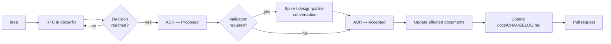

# Contributing to Orchestra

## Ground rules

1. **Decisions live in ADRs, not in prose.** If a document explains *why*, it links to an ADR. If no
   ADR exists, the decision has not been made — say so rather than implying consensus.
2. **ADRs are immutable once Accepted.** Supersede, never edit. The reasoning trail is the point.
3. **`main` is protected.** All changes arrive by pull request.
4. **Contracts are versioned.** Anything touching `docs/30-protocol/` follows
   [`docs/VERSIONING.md`](docs/VERSIONING.md).

## Workflow



## Branches

Short-lived, branched from `main`, deleted on merge.

```text
<type>/<short-kebab-description>

feat/connector-enrolment
docs/policy-model
adr/0011-tenant-isolation-strategy
fix/broken-schema-links
chore/bump-actions
```

## Commits

[Conventional Commits](https://www.conventionalcommits.org/en/v1.0.0/), enforced in CI by
commitlint. A scope is **required**.

```text
<type>(<scope>): <Subject in sentence case>
```

**Types** — `feat` `fix` `docs` `adr` `rfc` `refactor` `perf` `test` `build` `ci` `chore` `revert`

**Scopes** — [`.commitlintrc.json`](.commitlintrc.json) holds the list CI enforces:

- documentation sections — `overview` `architecture` `domain` `protocol` `governance` `workflows`
  `operations` `delivery` `reference` `schemas`
- services — `gateway` `tenant-user-management` `supervisor` `runtime` `compiler` `policy` `audit`
  `model-broker` `tool-invocation` `control-plane` `admin-console`, and `services` for what spans
  them
- everything else — `adr` `rfc` `ci` `repo` `deps` `release` `infra` `apps` `tooling`

```text
docs(governance): Add policy enforcement point specification
adr(adr): Record tenant isolation strategy as ADR-0011
ci(ci): Pin lychee action to a released version
```

A breaking change to a published contract is marked `!` after the scope and explained in a
`BREAKING CHANGE:` footer.

## Pull requests

- One logical change per pull request.
- The PR title must itself be a valid Conventional Commit — it becomes the squash-merge subject.
- Complete the checklist in the PR template. Do not delete items; mark them N/A with a reason.
- All CI checks must pass, and every review conversation must be resolved.
- Merge strategy is **squash and merge**. `main` keeps a linear history.

## Issues, labels and milestones

Issues and pull requests carry labels from four families. `kind/` and `area/` use the words of the
commit type and scope, so a label and a commit describe a change the same way.

| Family | Says | Labels |
| --- | --- | --- |
| `kind/` | What sort of change — the commit types | `feature` `bug` `docs` `adr` `rfc` `refactor` `performance` `test` `build` `ci` `chore` `security` `dependencies` `question` |
| `area/` | Where it lands — the commit scopes | A documentation section, a service, `infra` `apps` `ui-template` `tooling` `repo`, or `accessibility` |
| `priority/` | How soon | `p0-critical` `p1-high` `p2-medium` `p3-low` |
| `status/` | Why it is not moving | `triage` `needs-decision` `needs-design-partner` `blocked` |

An issue template applies `status/triage`, which triage replaces with an area and a priority. An
issue closed without a change carries `resolution/duplicate`, `resolution/invalid` or
`resolution/wontfix`. `good first issue` and `help wanted` keep their GitHub meanings.

Milestones mirror [`docs/70-delivery/milestones.md`](docs/70-delivery/milestones.md): M1 to M5,
defined by exit criteria and carrying no dates, because that document carries none. A security
vulnerability is never an issue — report it privately, as the issue chooser directs.

## Signed commits

Commits to `main` must be signed. Set up once:

```bash
git config --global commit.gpgsign true
git config --global gpg.format ssh
git config --global user.signingkey ~/.ssh/id_ed25519.pub
```

Then add the same public key to GitHub as a **signing key** (separate from an authentication key).

## Documentation conventions

Every document under `docs/` carries YAML front matter — see
[`docs/README.md`](docs/README.md) §3. CI validates it.

Diagrams are Mermaid, inline, so they version and diff with the prose.

Requirement keywords (MUST, SHOULD, MAY) carry [RFC 2119](https://www.rfc-editor.org/rfc/rfc2119)
meanings and are written in capitals.

## Running checks locally

```bash
npx --yes markdownlint-cli2@0.23.2          # style (same version CI runs)
node scripts/validate-docs.mjs              # front matter, ADR index, doc ids, internal links
npx --yes lychee --config lychee.toml .     # external links
```

## Releases

The documentation set is versioned in `docs/README.md` front matter and changelogged in
`docs/CHANGELOG.md`. A release is an annotated, signed tag on `main`:

```bash
git tag -s docs-v0.2.0 -m "Documentation set v0.2.0"
git push origin docs-v0.2.0
```
