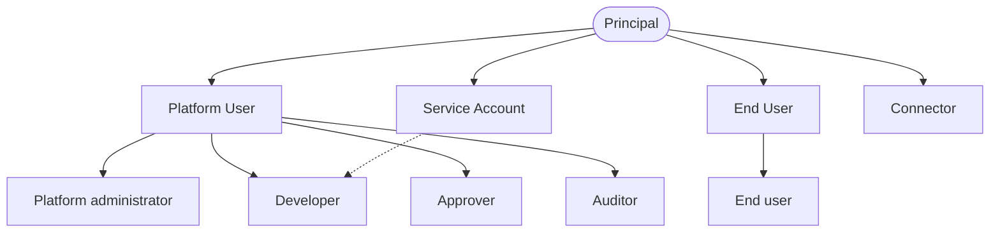

# Personas

Five personas: platform administrator, developer, approver, auditor, end user. For each, what they
are trying to do, what they need, what makes them refuse, and what is written for them.

Every need recorded here is a hypothesis. The project is pre-implementation and pre-customer and no
design partner has been interviewed, so nothing below has been checked against a real person doing a
real job. Where a persona's need would settle a design question, the question is named as open.

---

## 1. Personas are roles, not identity types

A persona is a job someone is doing. An identity type is a row in the identity model. There are five
of the first and four of the second. [`GLOSSARY.md`](../GLOSSARY.md) defines a **Principal** as any
authenticated actor and names four kinds: **Platform User**, **End User**, **Service Account**, and
the **Connector** itself.

Four of the five personas — administrator, developer, approver, auditor — are the same identity
type, **Platform User**, wearing different hats. They authenticate through the tenant's IdP. Only
the end user is a separate identity type, identified by a scoped Session Token that Orchestra mints
at the customer backend's request.

This is a commercial distinction, not a taxonomic one.
[ADR-0009](../adr/adr-0009-meter-first-defer-tiering.md) settled the seat definition deliberately,
because the candidates differ by orders of magnitude: Platform Users number in the tens to hundreds,
End Users potentially in the hundreds of thousands. Treating five personas as five identity types
would reopen exactly that ambiguity.

| Persona | Identity type | Seat-billable? | What their refusal blocks | Written for them |
| --- | --- | --- | --- | --- |
| Platform administrator | Platform User | Yes | Everything downstream: no Tenant configuration, no Model Binding, no registered Tool | [`10-architecture/`](../10-architecture/), [`60-operations/`](../60-operations/) |
| Developer | Platform User; their backend service is a Service Account | Only when they authenticate to the Control Plane | Integration: the platform is configured but nothing is built against it | [`20-domain/`](../20-domain/), [`30-protocol/`](../30-protocol/), [`50-workflows/`](../50-workflows/) |
| Approver | Platform User | Yes | Throughput: every Run that reaches a `require_approval` verdict waits on them | The approval surface itself, not a document |
| Auditor | Platform User | Yes | Procurement — security and compliance hold the veto, see section 3 | [`40-governance/`](../40-governance/) |
| End user | End User | No — measured, never seat-billed | Nothing structurally; the Agent simply has no one to serve | Nothing — see section 4 |

The dotted edge is the developer's second identity: a backend service calling the Gateway
authenticates as a Service Account, not as the person who wrote it. The Connector is a Principal
with no persona — it is software, and whoever installs it is the platform administrator.

---

## 2. The five personas

### 2.1 Platform administrator

**Doing.** Fitting Orchestra into an estate that already exists: connecting the tenant's IdP,
dividing the Tenant into Workspaces, registering Model Bindings against deployment surfaces the
enterprise already buys, enrolling Connectors, populating the Tool Catalog.

**Needs.** Tenant-scoped, deny-by-default authorization
([ADR-0001](../adr/adr-0001-product-shape-multi-tenant-saas.md)). Credential custody they can
describe to their own security team — envelope encryption, per-tenant data keys, no plaintext in
logs or backups ([ADR-0002](../adr/adr-0002-enterprise-segment-and-byok.md)). Visibility of each
Model Binding's Quota Envelope, because under BYOK the tenant's own provider limit is a permanent
capacity ceiling rather than an occasional error
([ADR-0006](../adr/adr-0006-model-layer-as-credential-broker.md)). Usage attributed by Workspace,
agent and workflow, which under BYOK is a reporting feature and not a bill (ADR-0009).

**Refuses when.** Isolation depends on application code remembering to filter by `tenant_id` rather
than the storage layer enforcing it. A Tool can be invoked without passing a Policy Enforcement
Point. Reaching an internal system needs an inbound firewall rule — the premise of
[ADR-0007](../adr/adr-0007-outbound-connector-for-enterprise-reachability.md), which is **Proposed**
and becomes binding only once at least two design partners confirm whether public exposure is
achievable for them and what their security teams demand of software inside their network.

### 2.2 Developer

**Doing.** Defining Agents and Workflows as versioned declarative definitions
([ADR-0008](../adr/adr-0008-declarative-workflow-definitions.md)), embedding the result in the
customer's own application, minting Session Tokens from their backend for their End Users.

**Needs.** A public contract with no rail types in it: LangGraph, MCP and provider vocabulary MUST
NOT appear in any API, schema, SDK or document they read
([ADR-0005](../adr/adr-0005-langgraph-as-compilation-target.md)). Compiler diagnostics good enough
to debug from, since definitions are compiled rather than interpreted — ADR-0005 treats those
diagnostics as a user-facing surface and requires every compiled graph to trace back to its source
definition, version and step identifiers. An event stream with ordering and replay: the intended
source is AG-UI ([ADR-0004](../adr/adr-0004-adopt-ag-ui-event-protocol.md)), which is **Proposed**
and binding only after a spike proves the approval lifecycle survives disconnect and replay through
its custom-event mechanism.

**Refuses when.** Debugging a Run means learning the runtime underneath it. The definition language
cannot express their process — a risk ADR-0008 rates high and accepts, since the escape hatch is a
reviewed custom step type and never raw customer code, and each new step type costs an ADR. There is
also no visual designer at MVP; authoring is schema-first and reviewed as code.

**Identity note.** A developer calling only the Gateway from a backend service acts as a **Service
Account**, and is not counted in the Platform Users dimension that ADR-0009 defines as distinct
Principals authenticating to the **Control Plane** in a billing period. Opening the Control Plane to
define an agent makes them a Platform User that period. One person, either, in the same week.

### 2.3 Approver

**Doing.** Resolving one Approval Request — approve, reject, ask for more — and being able to defend
it months later. A business role, not an IT one: a controller, a buyer, a warehouse manager. A
Platform User by identity who will never think of themselves as one.

**Needs.** The **Evidence Set**: the exact tool results, retrieved context and prior messages the
Agent relied on, so the human decides on the same information the model had. An Approval Chain
derived from policy rather than from whoever happened to be asked.

**Refuses when.** The request arrives without its evidence, or costs more attention than doing the
task by hand, or lands somewhere they do not work — no ADR names a notification or delivery channel,
and that is genuinely undecided.

**Why they are load-bearing.** The approver is the control standing between a prompt-injected agent
and a financial side effect. [ADR-0003](../adr/adr-0003-governance-layer-positioning.md) is explicit
that injection is defended by policy the model cannot argue past: an action above threshold requires
a human regardless of how persuasively the agent justifies it. An approver who rubber-stamps under
volume is not a control, and nothing in the ADR set addresses approval fatigue — it belongs to the
planned approval-workflows document in [`40-governance/`](../40-governance/).

**Reads nothing.** The reading paths in [`README.md`](../README.md) §2 have no approver entry, and
that is right: what is written for the approver is the approval surface. Per
[ADR-0010](../adr/adr-0010-a2ui-genui-interchange.md) the general GenUI catalog is deferred, but the
approval surface schema is required for the first vertical slice however A2UI resolves.

### 2.4 Auditor

**Doing.** Two jobs under one name. Afterwards: reconstructing who did what, when, on what basis,
under which policy. Before purchase: satisfying themselves that such a reconstruction is possible.

**Needs.** Audit Records that are append-only and immutable. Policy Decisions recorded **including
allows** — a denial-only trail cannot show a control was working. Evidence Set retention, so the
reconstruction includes what the approver saw. A Run tied to the exact definition version it pinned,
which ADR-0008 guarantees by never migrating a running instance. `tenant_id` on every record, event
and log line.

**Refuses when.** Audit is a log level rather than a product surface. Retention, residency and
subprocessor questions have no answer — ADR-0001 makes Orchestra a processor of customer data from
the first enterprise conversation, and records that SOC 2 gates the first deal and is calendar-bound
rather than effort-bound.

### 2.5 End user

**Doing.** Finishing a task inside an application they already use. Buying nothing, configuring
nothing, and in the room for none of it.

**Needs.** A response that streams and survives a dropped connection. An honest signal when a Run is
waiting — held at an Approval Request, or delayed behind a Quota Envelope. ADR-0006 requires that
scheduling delay be surfaced rather than hidden. Note the limit: Orchestra supplies the signal but
cannot render it, because the pixels belong to the customer.

**Refuses when.** Silence. A stalled run with no explanation is indistinguishable from a broken
product, and the customer's application takes the blame.

---

## 3. Who holds the veto

[ADR-0003](../adr/adr-0003-governance-layer-positioning.md) states plainly that security and
compliance stakeholders hold the veto in this segment. That is the premise of the whole positioning:
the purchase driver is not the ability to build an agent, which is now inexpensive, but the ability
to answer under audit who may use this agent, which capabilities it holds, who approved this action,
on what evidence, at what cost, and how it is stopped.

So the approver and auditor are not secondary users of a developer product. What the decision
record supports is narrow and worth keeping separate from what follows: security and compliance
stakeholders hold the veto in enterprise procurement.

Beyond that, the weighting between the personas is a working assumption, not a finding — no
customer has been observed. The assumption is that a platform which satisfies the developer while
exhausting the approver gets bought and then abandoned rather than failing in the demo. It belongs
on the list of things a design partner should confirm, not in the argument as though it were
established.

One simplification is worth naming: the auditor persona covers two people who may be different in a
real organisation — the assessor reading the trail afterwards, and the security reviewer who blocks
the deal beforehand. They want the same evidence at different times, which is why they are treated
as one persona here. Whether to split them is not decided.

---

## 4. The end user may never know Orchestra exists

The End User reaches an Agent through the customer's own application, identified to Orchestra by
that customer's backend. Nothing requires them to learn the platform's name, which constrains what
may be assumed of them:

- They MUST NOT be assumed to hold an Orchestra credential. A Session Token is minted at the
  customer backend's request and never appears in a browser or mobile bundle.
- No Orchestra-authored surface may be assumed visible to them. Errors, delays and approval states
  are signals the customer's application chooses how to render.
- UI Surfaces are declarative and rendered by allow-listed native components. An Agent never emits
  executable code — the one point on which ADR-0010 is not deferred.

It is also why the End User is measured but not seat-billed. ADR-0009 meters distinct end-user
subjects observed via session tokens as their own dimension, separate from Platform Users, so that a
customer embedding an agent for hundreds of thousands of their own users is not priced as though
each were an administrator.

---

## 5. What this document does not decide

- **These are not RBAC roles.** ADR-0001 requires a tenant-scoped, deny-by-default authorization
  model but names no roles. Whether "approver" and "auditor" are grantable roles, attributes on a
  Platform User, or purely policy-derived belongs to the planned identity-and-access document in
  [`10-architecture/`](../10-architecture/).
- **Whether an End User can resolve an Approval Request.** The glossary defines an Approval Chain as
  a set of **Principals**, which does not exclude an End User. Approving from inside the customer's
  application rather than the Control Plane is unspecified, and it touches the seat definition, so
  it needs the approval-workflows document or an ADR — not an assumption.
- **Whether a Service Account authenticating to the Control Plane consumes a seat.** ADR-0009's
  metering table counts distinct Principals authenticating to the Control Plane, while the glossary
  names the Platform User as the seat-billable identity. The counting rule needs to be made precise
  in the planned quotas-and-metering document.
- **How an approver is reached.** No ADR names a notification or delivery channel.
- **Whether these five are the right five.** They come from the section README and the ADR set, not
  from research. Procurement, legal, and the operator who runs the Connector inside the customer's
  network are all plausible additions.
