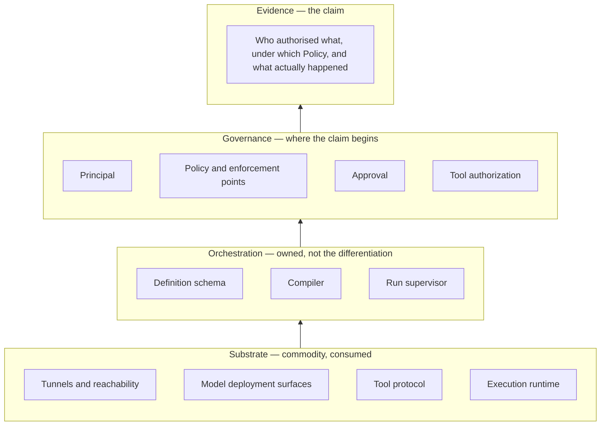

# Product Thesis

Orchestra is a multi-tenant SaaS governance layer for enterprise AI agents. It does not
differentiate on how an Agent reaches a Tool. It differentiates on the governance state and the
evidence attached to what the Agent does. That decision is
[ADR-0015](../adr/adr-0015-governed-action-positioning.md); this document is the argument for it,
laid out so a reader judging whether the strategy is sound can disagree with it precisely.

The claim is not a feature list. It is an assertion about what an action is:

> A consequential agent action is a **governed state transition** with an accountable Principal, an
> applicable Policy, an explicit approval state where one is required, and durable evidence of the
> decision.

**This document has been rewritten, and the reason belongs at the top.** Its previous version argued
[ADR-0003](../adr/adr-0003-governance-layer-positioning.md)'s sort of the platform into four
commodity capabilities and five differentiated ones. Primary evidence gathered on 2026-09-10 and
recorded in [`../80-reference/prior-art-survey.md`](../80-reference/prior-art-survey.md) and
[`../80-reference/mcp-evaluation.md`](../80-reference/mcp-evaluation.md) moves three of the five out
of the differentiated column. The sorting method was right and is run again in section 1. Three of
its answers were wrong, and the risk rating attached to them was wrong on the day it was written.
ADR-0015 supersedes ADR-0003 on that basis and this document follows it.

*Deterministic where determinism matters, agentic where judgment matters, governed at every step*
still describes the execution shape accurately, and it is no longer offered as a differentiation.
Camunda 8.9 sells that shape; section 6 gives the evidence and says what is left.

Orchestra is pre-implementation and pre-customer. No platform code exists, no design partner has
tested any claim below, and section 7 names what is unsettled.

## 1. The sort, run again

The method is one question: *would this capability improve over the next year whether or not
Orchestra built it?* Anything that would is commodity, however necessary it is to the product.
Building there spends a pre-customer year competing with people who are going to win that ground
anyway.

The four rows ADR-0003 sorted as commodity — agent orchestration, model invocation, tool-protocol
client libraries and agent-to-UI event streaming — are still commodity, and more securely so.
[`../80-reference/langgraph-evaluation.md`](../80-reference/langgraph-evaluation.md) establishes
that graph and state semantics, durable execution, checkpointing, interrupts and resume are
available under MIT, which is a stronger version of the same finding. Nothing in the re-sort touches
those rows.

The five it sorted as differentiated do not all survive.

| ADR-0003's differentiated capability | Standing on 2026-09-10 | What moved it |
| --- | --- | --- |
| Reaching Tools behind an enterprise firewall | **Moved — commodity substrate** | Two model vendors ship outbound-only SaaS-to-private-network tunnels. Section 1.1 |
| Custodying BYOK credentials across Tenants | **Moved — commodity platform capability** | An MIT gateway core with a licensed multi-tenant tier above it, and the runtime vendor selling the same custody with spend caps. Section 1.2 |
| Quota-aware scheduling against the customer's own limits | **Moved with it** | The same evidence and the same product tier. A Quota Envelope differentiates only where it is joined to Policy, Approval and the audit trail. Section 1.2 |
| Policy and approval as an administered system | **Split** | Policy enforcement is a market requirement — every hyperscaler ships an enforcement point. Approval as tenant-scoped administered data is held by nothing surveyed. Section 1.3 |
| Audit and attribution that survives a security review | **Held** | No surveyed product holds a record binding one governed act to exactly one Principal and a versioned Policy basis |

Three subsections give the evidence, one per mover. The full readings are in the reference
documents; what follows is only what each does to the sort.

### 1.1 Vendor tunnels took reachability

[`../80-reference/mcp-evaluation.md`](../80-reference/mcp-evaluation.md) section 3 establishes that
SaaS-to-private-network reachability with no inbound listener is shipped and documented by two
model vendors.
[OpenAI Secure MCP Tunnel](https://developers.openai.com/api/docs/guides/secure-mcp-tunnels)
runs a client inside the customer network that opens outbound HTTPS, long-polls for queued work and
posts responses back — "The private MCP server does not need a public listener."
[Anthropic MCP tunnels](https://platform.claude.com/docs/en/agents-and-tools/mcp-tunnels/overview)
run an outbound tunnel into a proxy terminating an inner TLS session under a certificate only the
customer holds; that one is a research preview offered as-is, with no continuity commitment.

ADR-0003's own commodity test is "improving without us", and the transport meets it. This is the
clearest of the three losses: reachability was listed first among the five, and the mechanism
[ADR-0007](../adr/adr-0007-outbound-connector-for-enterprise-reachability.md) proposes is the
mechanism two vendors already ship.

What does not move with the transport is the governance carried on it — the enforcement point, the
capability grant, the Connector's own allow-list and the governance-visible refusal fixed by
[`../40-governance/tool-authorization.md`](../40-governance/tool-authorization.md). That is a
narrower claim than the row it replaces, and it is a governance claim rather than a connectivity
one, which is the whole of section 2.

### 1.2 Commodity gateways took BYOK custody, budgets and metering

[LiteLLM](https://docs.litellm.ai/docs/enterprise)'s MIT core ships an OpenAI-compatible gateway,
virtual keys, spend tracking, budgets and request logging. The vendor of the runtime Orchestra
compiles onto sells the same custody shape: the
[LangSmith LLM Gateway](https://docs.langchain.com/langsmith/llm-gateway) has an administrator store
the provider key in workspace secrets, then enforces hard spend caps at organisation, workspace,
user and key level and returns a 402 when one is hit.

One qualification matters, and it cuts against Orchestra rather than for it. The multi-tenant shape
a Control Plane actually needs — organisation scoping, tag- and model-scoped budgets, key
rotation, secret-manager custody — is itself a paid tier inside the commodity gateway. So this is
not a case
of somebody giving the capability away. It is worse for the sort than that: it is a solved, priced
product category with incumbents already selling into it.
[ADR-0006](../adr/adr-0006-model-layer-as-credential-broker.md)'s decision — that under BYOK the
model layer can only be a credential and endpoint broker — is confirmed by this evidence. What
fails is any claim that being that broker differentiates anything.

Quota-aware scheduling moves on the same evidence. Per-key and per-team budget enforcement is free
and self-hostable today. A Quota Envelope is a rate limiter until it is joined to Policy, Approval
and the audit trail, and then the thing doing the differentiating is the join, not the envelope.

### 1.3 Platform governance surfaces took policy enforcement

Every hyperscaler now ships a policy enforcement point for agent actions. AWS made AgentCore Policy
generally available on 2026-03-03, compiling natural language to Cedar and evaluating each request
at a gateway that intercepts agent-tool traffic; the 2026-08-06 follow-on adds temporal policies,
prerequisite steps, escalation triggers and per-user gateway rate limiting. Google's Gemini
Enterprise Agent Platform, announced 2026-04-22, assembles agent identity, a registry indexing every
approved agent and tool, and a gateway enforcing policy — one control plane, sold as one thing.

Microsoft settles it. Centralised agent governance, approval flows, ownership, policy enforcement
and auditability are described as platform capabilities, with guidance covering per-action
authorisation, human approval, orchestration limits and action audit logging, alongside a risk-based
model with named ownership, decision rights, release gates, approval and audit trails. Section 9
carries the citations. Entra Agent ID is cross-platform by design and governs agents built on other
vendors' platforms, which is aimed squarely at the neutrality argument.

ADR-0003 rated *a rail provider adds governance and absorbs the category* at Medium likelihood and
cited no evidence. The evidence above was available on the day that ADR was accepted. This is the
part of the old sort that was not overtaken by events but wrong when written, and section 8 rates it
**High**.

The row does not vanish whole. What shipped is policy enforcement, not Approval as tenant-scoped
administered data — Temporal offers an approval primitive written into workflow code, Camunda a
model element, ServiceNow a steward review over assets, and none of them an Approval Chain a tenant
administrator configures without a deploy. But *policy enforcement* as a differentiation is gone. It
is a market requirement, and a product that treats a market requirement as a moat has misread the
market.

### 1.4 What the sort leaves

Two of five stand: administered approval, and audit that binds a governed act to one Principal and a
versioned Policy basis. The survey's own words for that position are "thin ice to build a category
on".

Claiming those two rows and stopping would leave the thesis as a feature list, and features get
copied — which is exactly what sections 1.1 to 1.3 record happening to the other three. ADR-0015
takes the alternative: re-found the claim on what the two surviving rows have in common, which is a
model of what a consequential action is rather than a pair of capabilities.

## 2. The layering that follows

ADR-0003's central move survives intact — build the control surface, not the rails. What changed
is which capabilities count as the control surface.

| Layer | Contents | Claim |
| --- | --- | --- |
| Substrate | Tunnels, model deployment surfaces, tool protocol, execution runtime | Commodity. Orchestra consumes it |
| Orchestration | Definition schema, compiler, run supervisor | Necessary, owned, not the differentiation |
| Governance | Principal, Policy, approval, authorization | Where the claim begins |
| Evidence | Who authorised what, under which Policy, and what actually happened | The claim |

Sorted against that layering, the capability list reads differently from the one this document used
to carry.

| Capability | Strategic status |
| --- | --- |
| Firewall and tunnel connectivity | Commodity substrate |
| BYOK credentials, budgets, metering | Commodity platform capability |
| Tool Catalog and tool authorization | Expected platform capability |
| Policy enforcement | Market requirement, not a moat |
| Deterministic execution | An execution property, not differentiation |
| Administered approvals | Potential differentiation |
| Principal, Policy and durable evidence together | The core thesis |

The middle rows are the uncomfortable ones and they are stated deliberately. A Tool Catalog with
authorization is *expected*: a buyer will refuse a platform without one and will not pay extra for
it. Deterministic execution is a property the compiled definition has, not a claim about anything.
Neither is a reason to buy; both are reasons not to be excluded.

**A note on wording.** Where this documentation set still calls Orchestra a "governance and
connectivity layer", that phrase is ADR-0003's and predates the re-sort. Connectivity is substrate
under ADR-0015. Bringing the remaining documents into line is named as follow-on work in that
record; this one uses the new sort throughout.

## 3. The claim, stated so it can be attacked

The governed-action model asserts four things about every consequential action. Each forbids
something specific, which is what makes it a claim rather than a value.

| Commitment | What it forbids | Where it is written down |
| --- | --- | --- |
| Exactly one accountable Principal per governed action | An unattributed path — no action whose actor resolves to "the platform" | [`../GLOSSARY.md`](../GLOSSARY.md); [`../40-governance/audit-model.md`](../40-governance/audit-model.md) section 9 |
| The Policy versions in force at admission are pinned for the life of the Run | A verdict changing under a Run already in flight | [ADR-0012](../adr/adr-0012-policy-decisions-are-audit-records.md) |
| An Approval Request carries the Evidence Set the model relied on | A human approving the model's summary of its own reasoning | [`../40-governance/approval-workflows.md`](../40-governance/approval-workflows.md) section 4 |
| A Policy Decision is durable before the action it gates | An action taken while the record of its authorisation could not be written | [ADR-0013](../adr/adr-0013-fail-closed-policy-decision-writes.md) |

**The strongest support for the reframing is that the semantics were decided before it.**
[ADR-0012](../adr/adr-0012-policy-decisions-are-audit-records.md) makes a Policy Decision a class of
Audit Record over an immutably versioned Policy, and pins those versions to the Run.
[ADR-0013](../adr/adr-0013-fail-closed-policy-decision-writes.md) makes that record durable before
the gated action is attempted, and refuses to let an implementation downgrade it under load. Both
were accepted on 2026-09-09 as governance rules, written to settle disagreements between the
`40-governance/` documents. ADR-0015 was accepted two days later and claims them as the product.

Two days is a short baseline and it would be dishonest to present it as a long one. What it does
establish is the direction of derivation: the claim was read off commitments that already existed,
rather than commitments being invented to make a claim sound defensible. A reframing that required
new promises to hold together would be the suspicious kind.

**What is not claimed, stated plainly.** Governance is not uniquely Orchestra's, and section 1.3 is
why that claim is untenable. Neither are the primitives: named ownership, approval flows, release
gates, registries and audit trails are all shipping from vendors with distribution Orchestra will
never have. Anyone reading this document as *we have governance and they do not* has read it wrong,
and that reading is worse than the five-part story it replaces, because it is contradicted by public
documentation rather than merely unproven.

The claim is the particular model above: one accountable Principal with no unattributed path, a
Policy version pinned for the life of a Run, an approval carrying the Evidence Set, and a decision
record durable before the action. Those are choices. A superseding record would have to attack the
choices, not the vocabulary.

**And one of the four is not yet whole.** The no-unattributed-path commitment holds for acts. Facts
caused by elapsed time or an observed condition — an approval expiring, a `wait` Step elapsing, a
Connector session dropping, platform-operator work — have no acting Principal, and
[`../40-governance/audit-model.md`](../40-governance/audit-model.md) section 9 owns that class and
explicitly does not close it. The one rule already fixed is that such a record MUST NOT be
attributed to a Principal who did not act, because a false attribution is worse than an acknowledged
gap. The hole is named here rather than left for a reader to find.

Normative wording is not this document's to write. Under [`../README.md`](../README.md) section 3
only `30-protocol/` and `40-governance/` bind, and the commitments above are stated there:
[`policy-model.md`](../40-governance/policy-model.md),
[`approval-workflows.md`](../40-governance/approval-workflows.md) and
[`audit-model.md`](../40-governance/audit-model.md).

## 4. Rails Orchestra does not own, and what it builds instead

The v0.1 analogy survives with its boundary corrected. Stripe did not build the card networks; it
built the control surface over them. The correction ADR-0015 makes is which surface: Orchestra stops
asserting ownership of the tunnel, which it does not have and is not going to get, and asserts
ownership of the record of what happened, which it can define.

The directional consequence is unchanged and is the best thing about the position. When the runtime
improves its checkpointing, or a model vendor ships a better tunnel, Orchestra's product improves
without Orchestra spending the year — a competitor who wrote their own pays for that improvement
and pays again to keep it. ADR-0003 made this argument about the wrong layer. Applied to the
substrate as sorted in section 2, it holds.

The cost is real: Orchestra depends on projects whose roadmaps, licences and breaking changes are
someone else's decision. Two mitigations carry it, both structural rather than disciplinary.

1. **Adapters at the edge.** Every rail is reached through an adapter, at a pinned version, with
   conformance tests, so an upstream breaking change is a bounded change in one component.
2. **No rail appears in a public contract.** Customer Workflows are declarative and compiled, and
   the runtime is a compilation target and never a public boundary
   ([ADR-0005](../adr/adr-0005-langgraph-as-compilation-target.md)), so a compiled graph is a build
   output regenerable for a different runtime with no customer-visible change.
   [`../GLOSSARY.md`](../GLOSSARY.md) expresses the same constraint as vocabulary: Run, Step and
   Workflow are the public words, and a rail's own MUST NOT appear in any API, schema, SDK or
   customer-facing document.

**What Orchestra builds is a schema, a compiler and a run supervisor**
([ADR-0014](../adr/adr-0014-run-supervisor-is-orchestras.md)). The runtime is an execution
substrate. Orchestra does not build graph and state semantics, durable execution, checkpointing,
interrupts or resume — those come from the substrate under a composable licence, and ADR-0014
keeps the half of the older reduction that is real: nobody should rebuild them. Run supervision is
Orchestra's: run
lifecycle, queueing, worker leasing and recovery, per-Tenant concurrency, scheduling, job-level
retry distinct from Step Execution retry, and draining a worker during deployment.

The reason that boundary sits where it does is worth one sentence, because an earlier statement of
it was wrong. **Durability at the graph level does not give you durable service-level run
orchestration.** A checkpoint says a graph reached state X. It does not say which worker owns the
run, who retries it, how many of a Tenant's runs may execute at once, or what happens when a hundred
thousand runs arrive together.

Two honest notes on that. The supervisor is distributed-systems work of the class where subtle bugs
are most expensive, and **its size is not known** — ADR-0014 leaves sizing as its first follow-on
rather than guessing. And by section 2's layering the supervisor is orchestration, not the
differentiation. ADR-0014 says as much in its own revisit criteria: a platform mostly building a
distributed runtime is not a governance layer. If sizing shows the supervisor dominates the build,
the positioning in this document is the thing under threat, not the supervisor.

## 5. Prompt injection is the clearest illustration

v0.1 never mentioned prompt injection, despite connecting a model to enterprise write-capable Tools.
It is the sharpest case for the thesis, because it is the case where better engineering of the agent
cannot help.

A supplier invoice arrives as a PDF. Its free-text remittance field says the bank details have
changed and the payment is urgent. An Agent holding a payment Tool reads that text as ordinary
context. No system prompt reliably survives this: the attacker writes into the same channel as the
instruction, and the model has no grounds for ranking the two.

The defence is that the decision is not the model's to make. A Step whose Side-Effect Class is
`financial` crosses a Policy Enforcement Point before it executes. If the Tenant's Policy says a
payment above a threshold requires a human, the PEP returns `require_approval`, the Run suspends,
and an Approval Request is raised carrying the proposed action and the Evidence Set the Agent relied
on. The Agent's justification is an input to the approver's decision, never to the verdict.

Three consequences follow. They are the shape of the commitment, not normative text; the binding
wording is in [`../40-governance/policy-model.md`](../40-governance/policy-model.md) section 7,
[`../40-governance/approval-workflows.md`](../40-governance/approval-workflows.md) section 4, and
[`../40-governance/threat-model.md`](../40-governance/threat-model.md) section 5.

- Every Step is evaluated at a Policy Enforcement Point before it executes, whatever its
  Side-Effect Class. The class is an input to the Policy, not a precondition for evaluation.
- A Policy Decision is never derivable from model output. Persuasion is not an input.
- An Approval Request carries the Evidence Set, so the human decides on the same information the
  model had rather than on the model's summary of it. A summary is written by the component the
  attack has already compromised.

This is enforceable only because it is structural: the compiler emits a Policy Enforcement Point at
every Step boundary, so governance cannot be bypassed by how a definition is written — the
argument for compilation in [ADR-0005](../adr/adr-0005-langgraph-as-compilation-target.md).

**It illustrates the thesis; it does not differentiate it.** AWS states the same principle in almost
the same words — that the agent does not see the policy logic and cannot reason around it. The
argument is correct and it is no longer distinctive, and those are two separate facts. What remains
specific to Orchestra is the third bullet: an approval that must carry the inputs rather than the
model's account of them is a commitment about evidence, and it is the one an incumbent's approval
flow is least likely to have made.

Not decided: the policy language, how thresholds are expressed, and how Approval Chains route and
escalate. Section 7 names what decides each, and no threshold value appears here because none has
been chosen.

## 6. The competitive position, without overclaiming

| Position | What it now holds | What it does not hold |
| --- | --- | --- |
| BPM and durable-execution engines — Camunda, Temporal | Camunda 8.8 put the agent inside the process model, with an ad-hoc sub-process the model selects activities from, an AI Agent connector and an alpha MCP client; 8.9 added a centralised audit log over "all critical user and client operations" and cluster-wide task listeners for governance. Temporal ships durable execution and an approval pattern | A Policy Decision as a first-class record over a versioned Policy; an Approval Chain as tenant data rather than workflow code; an Evidence Set. Temporal's audit covers control-plane operations only and says so |
| Agent runtimes, and the vendors selling above them | The library ships no governance. The vendor sells a registry with versioning and rollbacks, custom auth and access control, human-in-the-loop approvals, spend caps, PII redaction and administrative audit logging | A record binding a governed act to one Principal and a versioned Policy basis. Policy events land in the trace store, which is sampled and expiring |
| Platform and GRC vendors — AWS, Microsoft, Google, ServiceNow | The whole control surface: identity, registry, enforcement point, approval, audit, risk-based ownership. ServiceNow requires steward approval before an MCP server is usable and enforces it in the tooling, not in documentation | Substrate neutrality. Governance attaches to the vendor's own runtime, or — for ServiceNow — governs agents built elsewhere rather than sitting where they run |
| Orchestra | A governed-action model whose evidence semantics are already decided (ADR-0012, ADR-0013), substrate-neutral by construction | Everything under it. All of it is borrowed, unbuilt, and untested against a customer |

**One correction belongs here rather than in a footnote.** ADR-0008's differentiation sentence —
"Camunda offers determinism with AI attached at the edges; LangGraph offers agency with no
governance" — was not accurate when it was accepted on 2026-09-08. The Camunda capability shipped
at 8.8 on 2025-10-14, eleven months earlier, and the runtime half fails of the vendor even where it
holds of the library. [ADR-0014](../adr/adr-0014-run-supervisor-is-orchestras.md) supersedes
ADR-0008 on the build boundary and names that rationale defect on file without repairing it. This
document simply stops making the claim.

**Two things can be defended.**

1. **Substrate neutrality.** A platform vendor's governance stops at their own runtime; Orchestra's
   claim is substrate-neutral by construction, because the record is defined independently of what
   executed. This is thinner than it reads. Entra Agent ID is cross-platform by design and governs
   third-party agents. What keeps the argument alive is commercial rather than technical: those
   security and governance features sit behind a paid licence bundled only in the top Microsoft
   tier, so the incumbent's advantage is procurement and an existing relationship, not an
   entitlement the buyer already holds. That is real, and it is modest.
2. **The coherence of the model.** Not the existence of approvals or audit — those are
   everywhere — but the four commitments in section 3 holding together, so that an auditor
   pulling one thread gets the whole action back: who, under which Policy version, on what
   evidence, recorded before it happened.

**Three things cannot be defended, and this document does not try:** that Orchestra has governance
and competitors do not; that approvals or audit trails are novel; and that connectivity is a moat.

The matching non-goal is unchanged: **not a general-purpose automation platform.** Every Step
executes under Policy and audit, and the Tool Catalog holds registered business Tools rather than a
directory of SaaS connectors — which keeps the product out of both Camunda's lane and Zapier's.

## 7. What the thesis rests on that is not settled

Three ADRs are **Proposed**. They are not binding and this document does not treat them as though
they were.

| Proposed decision | What would make it binding |
| --- | --- |
| [ADR-0004](../adr/adr-0004-adopt-ag-ui-event-protocol.md) — AG-UI internally, behind an Orchestra-versioned profile | A spike: confirm the specification's version, governance and stability; prototype the approval lifecycle over custom events end to end through disconnect and replay; confirm the profile expresses Orchestra's ordering guarantees without forking |
| [ADR-0007](../adr/adr-0007-outbound-connector-for-enterprise-reachability.md) — outbound Connector for Tool reachability | Design-partner validation: whether public Tool exposure is achievable for them, what their security teams require of software running inside their network, and — the new criterion — whether a partner already running a vendor tunnel changes the question from *build* to *integrate* |
| [ADR-0010](../adr/adr-0010-a2ui-genui-interchange.md) — A2UI as the GenUI interchange | Deferred and off the critical path. Confirm A2UI's version and stability, and that the approval surface is expressible without extension |

**ADR-0007's standing has changed and the change is worth stating directly.** ADR-0015 demotes the
Connector from differentiation to plumbing. It may still be needed where a vendor tunnel does not
reach or does not fit a customer's security review, but it cannot be sold as a moat, and whether it
survives at all is now a live question for that ADR's own validation rather than a foregone
conclusion. The previous version of this document called reachability the platform's most
differentiated capability. It is not.

Decisions that are unmade, with what decides each:

| Unmade | What decides it |
| --- | --- |
| The policy language, and how thresholds are expressed | An ADR. [`policy-model.md`](../40-governance/policy-model.md) section 8 argues why it cannot be a later document: the language becomes a permanent public contract the moment a customer authors against it |
| What satisfies an Approval Chain, and whether escalation, delegation and reassignment exist | [`approval-workflows.md`](../40-governance/approval-workflows.md) section 11 holds these open and marks each as requiring an ADR |
| Audit retention periods | [`audit-model.md`](../40-governance/audit-model.md) section 11. No period is decided anywhere in this repository and no number appears there |
| Audit export | [`audit-model.md`](../40-governance/audit-model.md) section 12 states the requirement and records that nothing has designed it |
| Attribution for facts with no acting Principal | [`audit-model.md`](../40-governance/audit-model.md) section 9 owns it and does not close it |
| The run supervisor's size, and whether it dominates the build | [ADR-0014](../adr/adr-0014-run-supervisor-is-orchestras.md)'s first follow-on: enumerate its responsibilities precisely enough to size it, before an MVP is committed to |
| MVP scope | `70-delivery/mvp-definition.md`, unwritten. ADR-0015 says the first vertical slice is an approval surface with defensible evidence, not a connectivity demonstration |

Two Accepted decisions carry live questions of their own.
[ADR-0002](../adr/adr-0002-enterprise-segment-and-byok.md) records that "BYOK" may mean control of
spend, or may mean data must not transit Orchestra infrastructure; only the second implies a
customer-deployed Data Plane, and it MUST be tested with design partners before being architected
for. [ADR-0001](../adr/adr-0001-product-shape-multi-tenant-saas.md) notes the segment may refuse
third-party data processing at all.

## 8. Risks taken knowingly

From [ADR-0015](../adr/adr-0015-governed-action-positioning.md), because a thesis that omits its own
risk table is marketing. The last row is carried forward from ADR-0003, whose dependency on rails
Orchestra does not own is unchanged.

| Risk | Likelihood | Impact | Mitigation |
| --- | --- | --- | --- |
| A platform vendor ships the same governance model on their own substrate | **High** | High | Rated on shipped evidence, not inference. Compete on substrate neutrality and the depth of the model; a vendor's governance stops at their own runtime |
| Evidence semantics are too abstract to sell | Medium | High | Lead with the approval surface, which is concrete; the model is what survives the security review behind it |
| Administered approval and defensible evidence are absorbed as well | Medium | Existential | Then the category is gone and ADR-0015 is superseded in turn. Naming it is the honest position |
| Narrowing reads as retreat internally | Medium | Low | The claim is more specific, not smaller; a feature list was never a position |
| Upstream breaking changes in adopted rails | Medium | Medium | Adapters at the edge, pinned versions, conformance tests |

The first row was rated **Medium** in the previous version of this document, on no evidence, while
the evidence sat in public documentation. Re-rating it **High** is the single largest change here,
and it should be read as a correction rather than as a new development. The predicted shape has
shipped.

The largest risk is still not in the table. Nothing above has met a customer. The sort in section 1
argues from what enterprises are believed to buy, and the two rows that survived it survived against
vendor documentation rather than against a buyer who chose. That is the gap
[`../80-reference/prior-art-survey.md`](../80-reference/prior-art-survey.md) names as the question
the whole survey circles.

ADR-0015 names three falsification conditions, adopted here unchanged. Reopen the positioning if a
platform vendor ships a substrate-neutral governance and evidence model, which removes the last
structural distinction; if design partners consistently buy connectivity and treat governance as a
checkbox, which falsifies the thesis rather than the analysis; or if the approval and evidence model
proves undemonstrable in a sales cycle, which is a packaging problem that would still need
answering.

## 9. Sources with paths too long for prose

All returned HTTP 200 on 2026-09-11. The full evidence base is
[`../80-reference/prior-art-survey.md`](../80-reference/prior-art-survey.md) and
[`../80-reference/mcp-evaluation.md`](../80-reference/mcp-evaluation.md); these are the primary
sources cited directly above.

| Evidence | Source |
| --- | --- |
| AgentCore Policy generally available on 2026-03-03, Cedar compilation and gateway enforcement | [AWS what's new](https://aws.amazon.com/about-aws/whats-new/2026/03/policy-amazon-bedrock-agentcore-generally-available/) |
| Dogwood and its time-window policies, prerequisite steps, escalation triggers and gateway rate limiting, 2026-08-06; and the principle that the agent cannot reason around the policy | [AWS machine learning blog](https://aws.amazon.com/blogs/machine-learning/control-agent-behaviors-and-cost-beyond-a-single-action-new-capabilities-in-amazon-bedrock-agentcore/) |
| Centralised agent governance, approval flows, ownership, policy enforcement and auditability as platform capabilities | [Windows 365 for Agents](https://learn.microsoft.com/en-us/windows-365/agents/governance-auditability) |
| Risk-based governance with named ownership, decision rights, release gates, approval and audit trails | [Govern agents by risk](https://learn.microsoft.com/en-us/agents/center-of-excellence/govern-agents-risk) |
| Agent identity, agent registry and policy-enforcing gateway, announced 2026-04-22 | [Google Cloud blog](https://cloud.google.com/blog/products/ai-machine-learning/introducing-gemini-enterprise-agent-platform) |
| The agent inside the process model: ad-hoc sub-processes, the AI Agent connector, the MCP client connector | [Camunda AI agents](https://docs.camunda.io/docs/components/agentic-orchestration/ai-agents/) |
| Audit logging covering control-plane operations only, stated by the vendor | [Temporal Cloud audit logging](https://docs.temporal.io/cloud/audit-logging) |
| Registry with versioning and rollbacks, custom auth and access control, human-in-the-loop approvals | [LangSmith Deployment](https://www.langchain.com/langsmith/deployment) |
