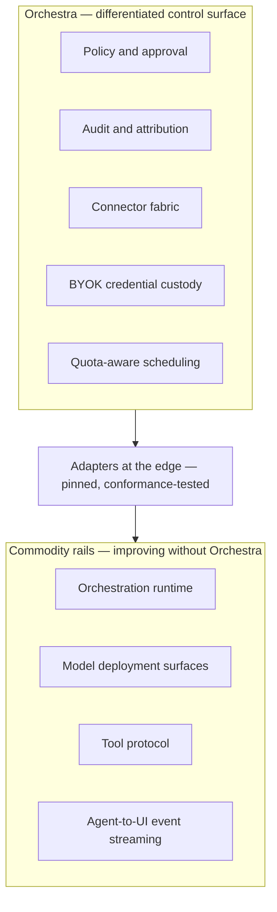

# Product Thesis

Orchestra is a multi-tenant SaaS governance and connectivity layer for enterprise AI agents, and not
an agent framework. That decision is recorded in
[ADR-0003](../adr/adr-0003-governance-layer-positioning.md); this document is the argument for it,
laid out so a reader judging whether the strategy is sound can disagree with it precisely.

The thesis compresses to one line: **deterministic where determinism matters, agentic where judgment
matters, governed at every step.**

Orchestra is pre-implementation and pre-customer. No platform code exists, no design partner has
tested any claim below, and the assumptions the argument leans on are named as guesses in section 5.

## 1. The sort that produced the decision

The v0.1 MVP scope was a list of components — agent runtime, model router, MCP client, two client
SDKs, an eleven-component UI catalog, a reference backend, transport, security, observability. The
decision came from sorting it by one question: *would this improve over the next year whether or not
Orchestra built it?*

| Capability | Verdict | Why |
| --- | --- | --- |
| Agent orchestration | Commodity | Durable, checkpointed, interruptible graph execution is solved and improving weekly outside Orchestra |
| Model invocation | Commodity | Every provider ships a client; every deployment surface documents its own |
| Tool-protocol client libraries | Commodity | MCP client implementations are widely available and converging |
| Agent-to-UI event streaming | Commodity | Already exists as AG-UI, with runtime support and React bindings |
| Reaching Tools behind an enterprise firewall | Differentiated | The ecosystem assumes reachable endpoints; ERP, WMS and core banking systems are effectively never internet-exposed |
| Custodying BYOK credentials across Tenants | Differentiated | Multi-tenant envelope encryption with per-tenant keys is unavoidable and was unaddressed |
| Policy and approval as an administered system | Differentiated | Frameworks offer a code-level interrupt; enterprises need a tenant-authored rule set that an administrator owns |
| Audit and attribution that survives a security review | Differentiated | A log level is not an audit trail; reconstructing who did what, when and on what basis is a product surface |
| Quota-aware scheduling against the customer's own limits | Differentiated | Under BYOK a Model Binding's Quota Envelope is a steady-state capacity ceiling, not an exceptional error |

The uncomfortable finding was that v0.1 put most of its weight in the commodity rows: two full
sections on model routing, and roughly ten lines with no schema for the policy engine. Effort was
close to inversely proportional to defensibility. The routing sections were worse than
misallocated — under BYOK a tenant enables a small, fixed set of deployment surfaces through
procurement measured in weeks, so capability-based routing has nothing to route across. See
[ADR-0006](../adr/adr-0006-model-layer-as-credential-broker.md).

The sort matters because the purchase driver in this segment is not the ability to build an agent,
which is now inexpensive. It is the ability to answer, under audit: who may use this Agent, which
Tools it holds, who approved this action, on what Evidence Set, at what cost, and how it is stopped.
Every one of those lands in a differentiated row.

## 2. Building on rails Orchestra does not own

The v0.1 analogy survives once corrected. Stripe did not build the card networks; it built the
control surface over them. The orchestration runtime, model deployment surfaces and tool protocol are
the rails.

The consequence is directional. When the runtime improves its checkpointing, or the tool protocol
tightens its authorization story, Orchestra's product gets better without Orchestra spending the
year. A competitor who wrote their own runtime pays for that improvement, and pays again to keep it.

The cost is real: Orchestra depends on projects whose roadmaps, licences and breaking changes are
someone else's decision. Two mitigations carry that risk, both structural rather than disciplinary.

1. **Adapters at the edge.** Every rail is reached through an adapter, at a pinned version, with
   conformance tests, so an upstream breaking change is a bounded change in one component.
2. **No rail appears in a public contract.** Workflows are declarative and compiled
   ([ADR-0008](../adr/adr-0008-declarative-workflow-definitions.md)); the runtime is a compilation
   target and never a public boundary
   ([ADR-0005](../adr/adr-0005-langgraph-as-compilation-target.md)), so a compiled graph is a build
   output regenerable for a different runtime with no customer-visible change.
   [`../GLOSSARY.md`](../GLOSSARY.md) expresses the same constraint as vocabulary: Run, Step and
   Workflow are the public words, and a rail's own MUST NOT appear in any API, schema, SDK or
   customer-facing document.

## 3. Prompt injection is the clearest illustration

v0.1 never mentioned prompt injection, despite connecting a model to enterprise write-capable Tools.
It is the sharpest case for the thesis, because it is the case where better engineering of the agent
cannot help.

A supplier invoice arrives as a PDF. Its free-text remittance field says the bank details have
changed and the payment is urgent. An Agent holding a payment Tool reads that text as ordinary
context. No system prompt reliably survives this: the attacker writes into the same channel as the
instruction, and the model has no grounds for ranking the two.

The defence is that the decision is not the model's to make. A Step whose Side-Effect Class is
`financial` crosses a Policy Enforcement Point before it executes. If the Tenant's Policy says a
payment above a threshold requires a human, the PEP returns `require_approval`, the Run suspends, and
an Approval Request is raised carrying the proposed action and the Evidence Set the Agent relied on.
The Agent's justification is an input to the approver's decision, never to the verdict.

Three consequences follow. They are stated here as the shape of the commitment, not as normative
text: under [`README.md`](../README.md) section 3 the normative wording belongs to
[`../40-governance/`](../40-governance/), which is not yet written.

- Every Step is evaluated at a Policy Enforcement Point before it executes, whatever its
  Side-Effect Class. The class is an input to the Policy, not a precondition for evaluation.
- A Policy Decision is never derivable from model output. Persuasion is not an input.
- An Approval Request carries the Evidence Set, so the human decides on the same information the
  model had rather than on the model's summary of it.

This is enforceable only because it is structural: the compiler emits a Policy Enforcement Point at
every Step boundary, so governance cannot be bypassed by how a definition is written — the argument
for compilation in [ADR-0005](../adr/adr-0005-langgraph-as-compilation-target.md).

Not decided: the policy language, how thresholds are expressed, and how Approval Chains route and
escalate. Those belong to the policy model, tool-authorization and threat-model documents under
[`../40-governance/`](../40-governance/), none of which is written, and no threshold value appears
here because none has been chosen.

## 4. The position this leaves

The competitive claim comes from [ADR-0008](../adr/adr-0008-declarative-workflow-definitions.md),
and it is a claim about a gap rather than about being better at somebody else's job.

| Position | Offers | Missing |
| --- | --- | --- |
| BPM and durable-execution engines (Camunda, Temporal) | Determinism, compensation, fifteen years of operational maturity | AI is attached at the edges; no model-aware policy, evidence or approval semantics |
| Agent runtimes and frameworks | Agency, tool use, fast iteration | Governance is a code-level interrupt at best; no administered policy, audit or tenancy |
| Orchestra | A process deterministic where determinism matters, agentic where judgment matters, governed at every Step | Everything in the other two rows; all of it is borrowed or unbuilt |

The third row holds only if the boundary stays narrow. A mediocre workflow engine loses on both
fronts at once — worse than the incumbents at orchestration, and a distraction from governance — so
Orchestra builds the definition schema, the compiler, policy injection, versioning and the audit
trail, and none of the durability, checkpointing, interrupts or resumption underneath them.

The matching non-goal is stated the same way: not a general-purpose automation platform. Every Step
executes under policy and audit, and the catalog holds registered business Tools rather than a
directory of SaaS connectors — which keeps the product out of Camunda's lane and out of Zapier's.

## 5. What the thesis rests on that is not settled

Three of the ten ADRs are **Proposed**. They are not binding, and this document does not treat them
as though they were.

| Proposed decision | What would make it binding |
| --- | --- |
| [ADR-0004](../adr/adr-0004-adopt-ag-ui-event-protocol.md) — adopt AG-UI rather than author an event protocol | A spike: confirm the specification's current version, governance and stability; prototype the approval lifecycle over custom events end-to-end through disconnect and replay; confirm the conformance profile expresses Orchestra's ordering guarantees without forking; assess the React bindings for enterprise fitness |
| [ADR-0007](../adr/adr-0007-outbound-connector-for-enterprise-reachability.md) — outbound connector for Tool reachability | Design-partner validation: confirm with at least two partners whether public MCP exposure is achievable for them, what their security teams require of software running inside their network, and whether "BYOK" means spend control or data non-egress |
| [ADR-0010](../adr/adr-0010-a2ui-genui-interchange.md) — A2UI as the GenUI interchange | Deferred, and not on the critical path. Confirm A2UI's version and stability, and that the approval surface is expressible without extension |

The second is load-bearing here: reaching Tools behind an enterprise firewall is named above as the
platform's most differentiated capability, and its mechanism is a proposal. If design partners can in
fact expose Tool endpoints publicly, the Connector demotes to a later differentiator — which would
not falsify the thesis, but would move a large part of its claimed moat.

Two accepted decisions carry live questions too.
[ADR-0002](../adr/adr-0002-enterprise-segment-and-byok.md) records that "BYOK" may mean control of
spend, or may mean data must not transit Orchestra infrastructure; only the second implies a
customer-deployed Data Plane, and it MUST be tested with design partners before being architected
for. [ADR-0001](../adr/adr-0001-product-shape-multi-tenant-saas.md) notes the segment may refuse
third-party data processing at all.

## 6. Risks taken knowingly

Reproduced from [ADR-0003](../adr/adr-0003-governance-layer-positioning.md), because a thesis that
omits its own risk table is marketing.

| Risk | Likelihood | Impact | Mitigation |
| --- | --- | --- | --- |
| A rail provider adds governance and absorbs the category | Medium | High | Compete on cross-runtime, cross-provider neutrality and enterprise depth |
| "Governance" reads as low-value overhead to buyers | Medium | Medium | Lead with approval, audit and connectivity outcomes, not with the abstract word |
| Upstream breaking changes in adopted rails | Medium | Medium | Adapters at the edge; pinned versions; conformance tests |

The first would hurt most, and its mitigation is a bet rather than a defence: neutrality across
runtimes and providers is worth something only to a customer who wants more than one of each, and
that preference is unverified. The largest risk is not in the table at all — nothing above has met a
customer, and the sort in section 1 argues from what enterprises are believed to buy.

[ADR-0003](../adr/adr-0003-governance-layer-positioning.md) names its own falsification condition,
adopted here unchanged: reopen the positioning if design partners consistently report that governance
is already satisfied by their existing controls, and that their unmet need is orchestration
capability itself.
