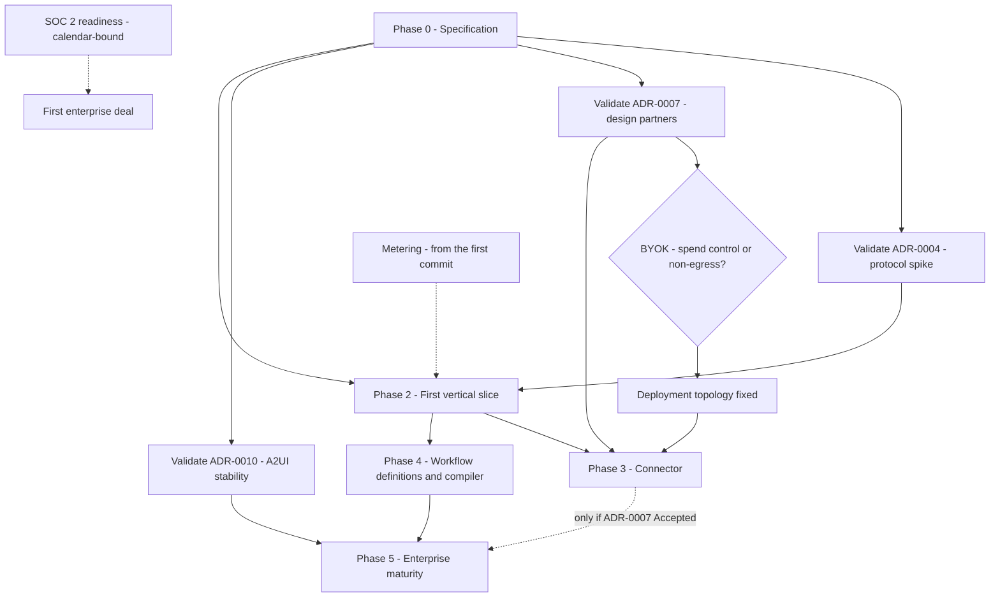

# Roadmap

Sequencing from the first vertical slice to enterprise maturity.

**There are no dates here, and their absence is deliberate rather than an omission.** No ADR
contains a date, a duration, a quarter or a headcount. Inventing one would lend the plan a
confidence the evidence does not support, and it would then be quoted back as a decision. **A phase
is complete when its exit criteria are met, not when a date passes.** Anyone turning this into a
schedule MUST derive the estimates themselves and record them in
[`70-delivery/`](../70-delivery/README.md), where they can be revised without disturbing the order.

The ordering is not arbitrary: every phase names the decision or artifact that gates it, and every
gate traces to an ADR. **Gate** is what must be true before a phase may start; **Entry** the
artifacts required on its first day; **Exit** the observable conditions that end it.

The project is pre-implementation and pre-customer. No platform code exists, no design partner has
been named, and every enterprise assumption below is a guess until a validation step retires it.
Three of the ten decisions are **Proposed**:
[ADR-0004](../adr/adr-0004-adopt-ag-ui-event-protocol.md),
[ADR-0007](../adr/adr-0007-outbound-connector-for-enterprise-reachability.md) and
[ADR-0010](../adr/adr-0010-a2ui-genui-interchange.md). A Proposed ADR gates not by existing but by
being resolved; each names its own validation step, and work depending on one MUST NOT begin as
though the decision were settled.

## 1. Phase dependencies

## 2. Phase 0 — Specification

**Gate:** none. Unblocked now.
**Entry:** the ten ADRs, [`GLOSSARY.md`](../GLOSSARY.md) and [`VERSIONING.md`](../VERSIONING.md).

Everything resting only on an Accepted decision can be specified today: the domain model, the Policy
model and where Policy Enforcement Points sit, Approval Request routing and the Evidence Set, audit,
the threat model, the Model Binding and Quota Envelope surface of the model broker, the Workflow
definition language, and the metering dimensions.

**Exit:**

- Every planned document in [`20-domain/`](../20-domain/README.md),
  [`40-governance/`](../40-governance/README.md), [`50-workflows/`](../50-workflows/README.md) and
  [`60-operations/`](../60-operations/README.md) resting only on Accepted ADRs is written.
- The tenant isolation strategy — row-level security, schema-per-tenant, database-per-tenant — has
  its own ADR. [ADR-0001](../adr/adr-0001-product-shape-multi-tenant-saas.md) names it as a separate
  decision, and it is still unmade.
- The transport seam is specified: a Tool connection is either a direct HTTPS session or a tunnelled
  one, indistinguishable to everything above it. ADR-0007 argues this is cheap now and expensive to
  retrofit, and separates it deliberately from building the Connector.
- The Python runtime to TypeScript Control Plane boundary is documented as a versioned internal
  contract, per [ADR-0005](../adr/adr-0005-langgraph-as-compilation-target.md).

## 3. Phase 1 — Validating the three Proposed decisions

**Gate:** none for the two spikes. The design-partner track is gated on design partners existing,
which is itself unscheduled.
**Entry:** Phase 0's threat model and approval-surface drafts, which the spikes exercise.

| Decision | What would make it binding | What it blocks meanwhile |
| --- | --- | --- |
| ADR-0004 | A spike proving the Approval Request lifecycle survives disconnect and replay over the adopted protocol, and that per-Run monotonic sequence, run id, tenant id and event id are expressible without forking | The client-facing event contract, and every SDK reading it |
| ADR-0007 | At least two design-partner conversations establishing whether public Tool exposure is achievable for them, and what their security teams require of software running inside their network | Building the Connector — not the transport seam |
| ADR-0010 | Confirmation that the A2UI specification is stable, and that the approval surface is expressible in it without extension | The general GenUI catalog, already outside the first slice |

One further question belongs here and SHOULD be answered before deployment topology is architected:
whether BYOK means *control of spend and the provider relationship*, or *data must not transit
Orchestra infrastructure*. Only the second implies a customer-deployed Data Plane. It is raised in
[ADR-0002](../adr/adr-0002-enterprise-segment-and-byok.md) and repeated as ADR-0007's third
validation item.

**Exit:** each of the three ADRs is Accepted, Rejected or superseded — none stays Proposed while
work depending on it proceeds — and the BYOK question has a recorded answer, in a new ADR if that
answer changes the topology.

## 4. Phase 2 — First vertical slice

**Gate:** Phase 0 exit, plus ADR-0004 resolved. The slice streams Agent Events to a client, so the
protocol decision cannot still be open.
**Entry:** normative specifications for tenancy, policy, approvals, audit and metering; one Model
Binding against one Deployment Surface.

**Exit** — one Run, end to end, exercising every load-bearing claim in the thesis:

- A Tenant exists; a Platform User authenticates through the tenant's IdP; a versioned Agent
  definition is pinned by the Run for the Run's whole life.
- The Run invokes a Tool over the direct HTTPS fast path, through the transport-abstracted client.
- A Policy Enforcement Point evaluates at Run admission and before the Tool invocation, and every
  Policy Decision is audited, including allows.
- A Tool of Side-Effect Class `financial` raises an Approval Request carrying its Evidence Set; a
  human resolves it; the Run resumes.
- Meter records exist for every dimension in
  [ADR-0009](../adr/adr-0009-meter-first-defer-tiering.md): append-only, tenant-scoped, idempotent
  under retry, reconcilable against the audit log.
- Admission control against the Quota Envelope exists with observable queue depth
  ([ADR-0006](../adr/adr-0006-model-layer-as-credential-broker.md)) — under BYOK the customer's own
  limit is a steady-state ceiling, not an exceptional failure.
- Every persisted record, emitted event and log line carries a `tenant_id`, enforced by CI tests.

**Deliberately excluded:** the Connector build, the GenUI catalog, the tier builder,
capability-based model selection, and a visual workflow designer.

## 5. Phase 3 — Connector

**Gate:** ADR-0007 Accepted after design-partner validation, and the BYOK question answered. Until
then this phase is not committed work.
**Entry:** at least one design partner willing to run Orchestra software inside their network; the
Connector threat model; the version-negotiation rules in [`VERSIONING.md`](../VERSIONING.md) §9.

ADR-0007 draws the distinction this phase rests on: designing the transport seam before design
partners exist is prudent; building the Connector before them is premature. The seam is Phase 0
work; only the product is deferred here.

**Exit:** enrolment and identity, mutual authentication, egress allow-listing, Tool allow-listing at
the Connector, tamper-evident local audit, health and observability in the Control Plane, signed
releases with published checksums, an upgrade path, and explicit refusal — never silent degradation
— of a Connector below the minimum supported protocol version. A tunnelled Tool invocation is
indistinguishable, above the transport, from a direct one.

## 6. Phase 4 — Workflow definitions and the compiler

**Gate:** Phase 2 exit. The decision is not the gate —
[ADR-0008](../adr/adr-0008-declarative-workflow-definitions.md) is Accepted. What gates it is the
runtime adapter and the Policy Enforcement Point injection proven in the slice.
**Entry:** the definition language specification from Phase 0; a golden-test harness mapping
definitions to expected compiled graphs.

**Exit:**

- The MVP Step types compile: `agent`, `tool`, `approval`, `condition`, `parallel`, `wait`,
  `transform`, `subworkflow`. Every Step declares a Side-Effect Class.
- The compiler emits a Policy Enforcement Point at every Step boundary, so policy cannot be bypassed
  by how a definition is written, and every compiled graph traces back to its source definition,
  version and Step identifiers.
- Rules W1–W4 of [`VERSIONING.md`](../VERSIONING.md) §8 hold: versions immutable, Runs pinned,
  in-flight Runs never migrated, retirement drains rather than kills.
- Compensation is declared and executed for `write`, `destructive` and `financial` Steps. A failed
  model call MAY be retried; a partially executed Tool call MUST NOT be. Idempotency keys are scoped
  to the Step Execution, not the Run.

**Deliberately excluded:** a visual designer. ADR-0008 records it as a later product decision, and
as the point where workflow products most often stall.

## 7. Phase 5 — Enterprise maturity

**Gate:** Phase 2 and Phase 4 exit. Phase 3 gates only the items below that need a Connector, and
only if ADR-0007 is Accepted — if it is Rejected, the rest of this phase is unaffected.

SOC 2 is deliberately not a gate here. ADR-0001 makes it a gating requirement for the *first deal*,
not for a build phase, and section 8 explains why it runs alongside engineering rather than after
it.

This phase has no exit criteria, and inventing them would be the same error as inventing dates. Its
contents are candidates whose priority depends on evidence that does not yet exist:

- **GenUI**, if ADR-0010 is Accepted — A2UI as the external interchange, behind an adapter over an
  internal normalised surface model.
- **Tiering.** ADR-0009 prices the first contracts by hand and sets its own trigger for revisiting:
  three or more customers in production, so real usage shapes are observable.
- **A hybrid topology** — hosted Control Plane, customer-deployed Data Plane — if the BYOK question
  resolves to data non-egress. ADR-0001 names this as the likely response, and explicitly not a
  reversal of the commercial model.
- **Capability-based model selection**, which ADR-0006 removed as unimplementable under BYOK, and
  which is additive if a design partner ever requires it.

## 8. Tracks that are not phases

**SOC 2 readiness** is calendar-bound, not effort-bound. ADR-0001 states that it gates the first
deal and that the clock should start before the product is finished, so it runs in parallel with
engineering from Phase 0 rather than after Phase 4. Sequencing it as a phase would be the most
expensive scheduling error available here.

**Metering** is likewise not a phase. Unrecorded usage cannot be recovered, so meter records exist
from the first commit that produces a Run. Tiering can wait precisely because prices change
trivially and history does not (ADR-0009).

## 9. MVP scope grew, and delivery must account for it

Against the archived v0.1 brief, the decisions so far have made the first release larger.

| Change | ADR | Direction |
| --- | --- | --- |
| Multi-tenancy, RBAC, tenant administration and secret management moved out of a later phase into MVP | ADR-0001 | Increase |
| A Workflow definition language and a validating compiler added | ADR-0008 | Increase |
| A Connector added — installation, enrolment, health, signed releases, upgrade; a distinct product, not a library | ADR-0007, Proposed | Increase |
| Capability-based and preference-based model routing removed | ADR-0006 | **The only decrease** |

ADR-0004 would also remove the cost of authoring an event protocol, but it is Proposed, so that
saving MUST NOT be counted yet. The net effect is an MVP materially larger than the one v0.1
described, reached through decisions each of which is individually defensible. The MVP definition
and milestones documents planned in [`70-delivery/`](../70-delivery/README.md) must be written
against this scope, not the original one.

## 10. What this roadmap does not decide

- **Dates, durations and headcount.** Nothing in the ADR set supports them.
- **The tenant isolation strategy.** Deferred by ADR-0001 to a decision not yet made; Phase 0 work.
- **Whether BYOK means data non-egress.** Phase 1 answers it by validation, not by choice.
- **Prices, tiers and packaging.** Deferred by ADR-0009 until production usage exists.
- **Whether a visual workflow designer is ever built.** ADR-0008 leaves it open.
- **Who the design partners are.** There are none. Every phase gated on them is gated on work that
  has not started.
