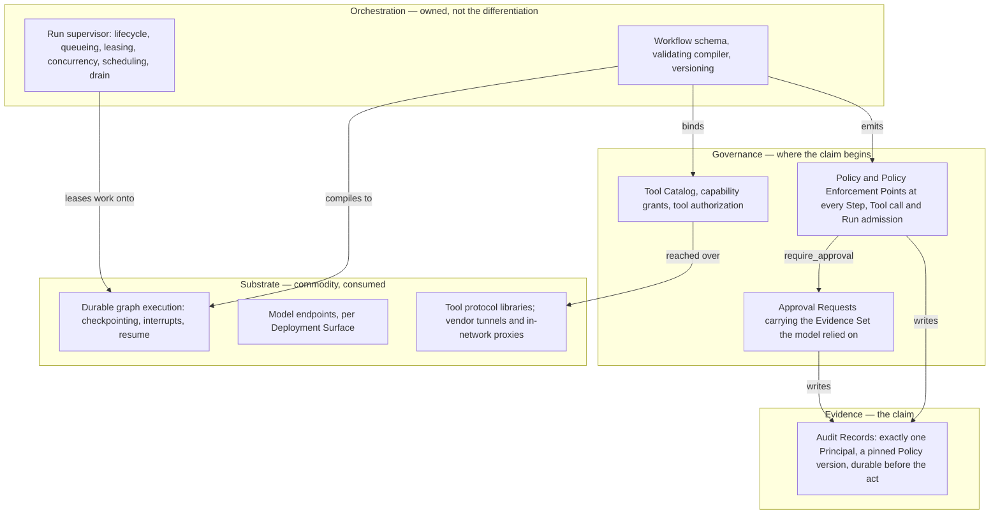

# Scope and Non-Goals

Orchestra is a multi-tenant SaaS control surface for enterprise AI agents. This document states what
that sentence includes, what it excludes, and — where an exclusion is provisional — what would
change it.

Two Accepted decisions have moved since v0.3.0 of this document, and both move scope.
[ADR-0015](../adr/adr-0015-governed-action-positioning.md) replaces the five-part differentiation
story this document was organised around: Orchestra does not differentiate on how agents reach
tools, and connectivity is substrate it consumes.
[ADR-0014](../adr/adr-0014-run-supervisor-is-orchestras.md) replaces the reduction of workflow
execution to a schema and a compiler: a run supervisor is Orchestra's, and is now in scope.

The one-line description in [`docs/README.md`](../README.md) and in CLAUDE.md is still *governance
and connectivity layer*. ADR-0015 leaves the first half standing and demotes the second. Repairing
the phrase is a separate edit to those documents, not a decision this one may take.

Two terms this revision leans on are absent from [`GLOSSARY.md`](../GLOSSARY.md), whose current
revision predates both ADRs: *run supervisor* and *governed state transition*. The supervisor's
state names in section 2.3 are internal to that subsystem, and reconcile against
[`../20-domain/lifecycle-state-machines.md`](../20-domain/lifecycle-state-machines.md), which stays
authoritative on the states a customer can observe. Adding either term to the glossary is a separate
edit, not a decision this document may take — and until it happens, a reader should treat the two as
provisional vocabulary rather than as canonical.

Every entry traces to an ADR. Where no ADR decides something, this document says so and names what
would decide it. The project is pre-implementation and pre-customer: no platform code exists, and
every claim here about what enterprises need is a guess until a design partner contradicts it.

## 1. Removed, deferred, undecided

Three exclusions read alike in a roadmap and behave differently in practice. Conflating them is how
a specification acquires imaginary agreement.

| Class | Meaning | What changes it |
| --- | --- | --- |
| **Removed** | An Accepted ADR determined Orchestra does not build it, and the reasoning is on record. | A superseding ADR. Accepted ADRs are never edited. |
| **Deferred** | Consistent with the product's direction but outside the current slice. Deferred deliberately, with the reasoning on record. | Where an Accepted ADR made the deferral, that ADR's revisit criteria and a superseding ADR. Where nothing has been decided, the named later document suffices. |
| **Undecided** | No ADR decides it in either direction. Treat any statement about it as opinion. | The document or ADR named beside it, once written. |

A fourth state cuts across all three. Three ADRs are **Proposed**, not Accepted: AG-UI adoption
([ADR-0004](../adr/adr-0004-adopt-ag-ui-event-protocol.md)), the outbound Connector
([ADR-0007](../adr/adr-0007-outbound-connector-for-enterprise-reachability.md)) and A2UI as the
GenUI interchange ([ADR-0010](../adr/adr-0010-a2ui-genui-interchange.md)). Each names the validation
that would bind it. Those validations are at three different stages rather than all unrun:

| Proposed ADR | Standing of its validation | What is outstanding |
| --- | --- | --- |
| ADR-0004 | Steps 1, 3 and 4 were carried out on 2026-09-09 | Step 2 alone, and it needs code rather than research — section 3.3 |
| ADR-0007 | Three steps, none of them run | All three, against a case ADR-0015 has weakened — section 2.8 |
| ADR-0010 | Step 1 was carried out and came back **not satisfied**; step 3 is partial | Step 2 alone; the evidence so far supports the deferral rather than reopening it — section 4 |

Scope resting on a Proposed ADR is provisional in both directions: the inclusion may not survive,
and neither may the exclusion it implies. ADR-0007 is weaker still — ADR-0015 demotes its Connector
from differentiation to plumbing, and section 2.8 states what remains of its case.

Two ADRs cited by v0.3.0 of this document are **Superseded** and appear below only as history:
[ADR-0003](../adr/adr-0003-governance-layer-positioning.md), by ADR-0015, and
[ADR-0008](../adr/adr-0008-declarative-workflow-definitions.md), by ADR-0014. Both are retained
unedited, so the reasoning trail survives the correction.

## 2. In scope

ADR-0015 sorts the platform into four layers and puts the claim in the top two, with one exception
in the layer below them that is structural rather than a feature. The layering is what this section
is organised by, because it is what decides whether a capability is built to be differentiated,
built because it is expected, or consumed.

> A consequential agent action is a **governed state transition** with an accountable Principal, an
> applicable Policy, an explicit approval state where one is required, and durable evidence of the
> decision.

### 2.1 The layering, and what it does to this list

| Layer | Contents | Orchestra's position |
| --- | --- | --- |
| Substrate | Tunnels, model providers, tool protocols, execution runtime | Commodity. Consumed, not built — section 3 |
| Orchestration | Definition schema, compiler, run supervisor | Owned, necessary, and not the differentiation — sections 2.2 and 2.3 |
| Governance | Principal, Policy, approval, authorization | Where the claim begins — section 2.4 |
| Evidence | Who authorised what, under which Policy, and what actually happened | The claim — section 2.5 |

Every capability the platform needs still has to be built or bought. What the layering changes is
which of them carry a claim:

| Capability | Strategic status per ADR-0015 | Where |
| --- | --- | --- |
| Firewall and tunnel connectivity | Commodity substrate | Section 2.8 |
| BYOK credentials, budgets, metering | Commodity platform capability | Section 2.7 |
| Tool Catalog and tool authorization | Expected platform capability | Section 2.4 |
| Policy enforcement | Market requirement, not a moat | Section 2.4 |
| Deterministic execution | An execution property, not differentiation | Section 2.2 |
| Enforcement points a definition cannot be written around | **Differentiation, and structural** | Section 2.2 |
| Administered approvals | Potential differentiation | Section 2.4 |
| Principal, Policy and durable evidence together | The core thesis | Section 2.5 |

Four rows of the survey's differentiation table stand as durable on 2026-09-10 evidence, and all
four are worth naming because the third is easy to lose: audit with exactly one Principal and a
Policy basis on every governed act; Approval as administered, tenant-scoped configuration — chains,
delegation, escalation, Evidence Set; compilation of a declarative Workflow into enforcement points
that cannot be written around; and cross-runtime, cross-provider neutrality, durable **only** for
buyers whose estate genuinely spans clouds and runtimes. The survey's phrase "thin ice to build a
category on" attaches to the audit row alone and not to the set. The evidence is
[`../80-reference/prior-art-survey.md`](../80-reference/prior-art-survey.md) section 8.1.

The third of those sits in the orchestration layer rather than the top two, which is why the
layering table above and the capability table below appear to disagree. Both statements are
ADR-0015's, and they reconcile at the seam: what the compiler emits is the governance layer's
enforcement points, so the property is architectural rather than a capability the orchestration
layer sells on its own. Section 2.2 states it.

**This is not a claim that Orchestra has governance and the incumbents do not.** ADR-0015 declines
that claim explicitly, and the evidence makes it untenable. Microsoft ships centralised agent
governance, approval flows, named ownership, policy enforcement and auditability as platform
capabilities today; AWS ships a policy language and a gateway that evaluates every agent-tool
request; Google ships agent identity, a governed registry and an enforcement gateway. The survey in
[`../80-reference/prior-art-survey.md`](../80-reference/prior-art-survey.md) section 7.1 holds the
evidence, and ADR-0003 rated that absorption risk **Medium** citing none. ADR-0015 rates it **High**
on shipped evidence. The primitives are not scarce. What is in scope here is a particular governance
model and a particular evidence semantics — one accountable Principal per action with no
unattributed path, a Policy version pinned for the life of a Run, an approval carrying the Evidence
Set the model relied on, and a decision record durable before the action it gates. Those are
choices, and they are what a superseding record would have to attack.

### 2.2 Orchestration — Workflow schema, compiler and versioning

Orchestra owns the declarative Workflow schema, the validating compiler, policy injection,
versioning and lifecycle. Customer workflows are declarative and compiled, never interpreted — the
decision ADR-0008 made and [ADR-0014](../adr/adr-0014-run-supervisor-is-orchestras.md) carries
forward unchanged.

The compiler emits a Policy Enforcement Point at every Step boundary, and a definition's author
neither places those points nor gets to omit them. That is the differentiation ADR-0015 keeps in
this layer, and it keeps it as **structural**: a competitor's guardrails are guidance a modeller may
skip, so this is an architectural property rather than a feature, which is why it is hard to add
without rebuilding. It survives as one of the four durable rows in prior-art-survey section 8.1.

The step types and the guard around them are ADR-0008's, and ADR-0008 is Superseded. ADR-0014
carries its declarative-and-compiled decision forward but does not restate its detail, so both are
cited here as history rather than as freshly Accepted: the eight MVP step types — `agent`, `tool`,
`approval`, `condition`, `parallel`, `wait`, `transform`, `subworkflow` — which
[`../GLOSSARY.md`](../GLOSSARY.md) also carries, and the mitigation in ADR-0008's risk table that
step-type additions are deny-by-default with every new type requiring an ADR, the stated guard
against the definition language growing into a programming language. Restating either normatively
belongs to whichever record next owns the definition language, not to this document.

Deterministic execution is in scope as an execution property, not as differentiation. ADR-0015
demotes it, and the survey supports the demotion: an established BPM vendor sells the same shape,
with the agent inside the process model rather than beside it.

### 2.3 Orchestration — the run supervisor, newly in scope

ADR-0014 adds a subsystem this document did not previously list at all. Orchestra builds the **run
supervisor**, and it is a first-class subsystem rather than glue:

| Concern | In scope |
| --- | --- |
| Run lifecycle | Persisting run intent and status through queued, leased, running, waiting, retrying, cancelling and terminal states |
| Work distribution | Enqueueing runnable work, leasing it to workers, reclaiming a lease when a worker disappears |
| Concurrency | Per-Tenant limits, priority between queues, admission under the Quota Envelope |
| Scheduling | Waking a Run at a future time, and resuming one that has been waiting on an approval |
| Failure handling | Job-level retry and cancellation, which ADR-0014 requires be kept distinct from Step Execution retry |
| Operations | Draining a worker during deployment, and scaling horizontally |

The supervisor's contract is narrow: persist the run intent, enqueue runnable work, lease it to a
worker, invoke the compiled graph, observe a checkpoint, an interrupt or completion, persist the
outcome, and either schedule the next work or finalise the Run. It does not need to understand the
semantics of every Step type. It needs to understand Runs.

Two constraints come with it. Orchestra depends only on the MIT-licensed execution components; no
Orchestra component may take a dependency on an Elastic-2.0 package, because providing such software
as a hosted service is the one thing that licence forbids and
[ADR-0001](../adr/adr-0001-product-shape-multi-tenant-saas.md) fixes a hosted product. And ADR-0014
records as a follow-on that the supervisor's Run states have to reconcile with the Run lifecycle in
[`../20-domain/lifecycle-state-machines.md`](../20-domain/lifecycle-state-machines.md), which stays
authoritative on the states a customer can observe. They are one entity seen from two levels.

**MVP scope has now grown three times, and this is the third.** ADR-0001 pulled multi-tenancy
forward; ADR-0007 added a Connector, conditionally, because it is Proposed and section 2.8 records
that its survival is now an open question; ADR-0014 adds a distributed run supervisor. ADR-0014
counts the three without that qualification, which is fair on its own date — it predates ADR-0015's
demotion of the Connector. `70-delivery/mvp-definition.md` is unwritten and has to account for all
three rather than discovering them one at a time. The supervisor's size is not
known: ADR-0014 leaves open whether it is glue
around an executor or a substantial distributed runtime, and says so deliberately rather than
guessing. Leasing, liveness, recovery and backpressure are the class of work where subtle bugs cost
most, which is an argument for sizing it before an MVP is committed to, not for assuming it is
small.

### 2.4 Governance — Principal, Policy, approval, authorization

Policy, Policy Enforcement Points, the Tool Catalog with its capability grants, and Approval
Requests carrying an Evidence Set. Minimally a PEP sits before any Tool invocation, at every
Workflow Step boundary, and at Run admission.

This is also the answer to prompt injection. Policy, not prompts, is the security boundary: a
financial action above a threshold requires a human regardless of how persuasively an agent argues
for it, and the Evidence Set exists so that the human decides on the inputs the model actually had.
That argument carries forward from ADR-0003 and is unchanged. What has changed is its standing as a
differentiator: the survey finds a hyperscaler stating the same design principle in almost the same
words, so it is a market requirement Orchestra must meet, not a position it holds alone.

Administered approvals — chains, delegation, escalation, as tenant configuration data rather than a
code-level interrupt — are the one capability in this layer ADR-0015 still rates **potential**
differentiation. No product surveyed was found to offer approval as tenant data over a Run — though
prior-art-survey section 9 is explicit that this was suspected for all of them and tested for none,
so it is a narrow lead held on untested ground. The survey's "thin ice to build a category on"
belongs to the audit row rather than this one; what covers this one is ADR-0015's own risk row, "the
two durable rows are also absorbed", at Medium likelihood and existential impact. The normative
specifications are
[`../40-governance/approval-workflows.md`](../40-governance/approval-workflows.md) and
[`../40-governance/tool-authorization.md`](../40-governance/tool-authorization.md).

### 2.5 Evidence — the claim

Audit as a product surface rather than a log level, with semantics that are the differentiation
rather than a governance chore:

- Every governed act resolves to **exactly one Principal**. There is no unattributed path.
- A **Policy version is pinned for the life of a Run**, so a decision can be reconstructed against
  the rule that was actually in force.
- A Policy Decision is a **class of Audit Record**, allows included, per
  [ADR-0012](../adr/adr-0012-policy-decisions-are-audit-records.md).
- The decision record is **durable before the action it gates**, per
  [ADR-0013](../adr/adr-0013-fail-closed-policy-decision-writes.md).

Those four were written as governance rules and turn out to be the product. The normative statement
is [`../40-governance/audit-model.md`](../40-governance/audit-model.md); ADR-0015 asks that the
evidence semantics be stated once, normatively, in [`../40-governance/`](../40-governance/) rather
than scattered. This section summarises and links; where the summary and the normative statement
diverge, the normative statement wins.

The trade-off is real and worth naming: evidence semantics are harder to demonstrate than a tunnel.
A buyer sees connectivity work in a minute and an audit model in a procurement review.

### 2.6 Tenancy, administration and secrets — in the MVP, not a later phase

Tenant is a first-class entity from the first commit, with RBAC, tenant administration and secret
management alongside it (ADR-0001). ADR-0001 requires `tenant_id` on every persisted record, every
emitted event and every log line, and tenant isolation is by shared schema with row-level security
([ADR-0011](../adr/adr-0011-tenant-isolation-shared-schema-rls.md)).

This was a **material MVP scope increase**, not a restatement of existing plans — the first of the
three counted in section 2.3. The v0.1 brief put all four in a later phase. ADR-0001 moved them
forward because tenant isolation is the one property that cannot be retrofitted, and the failure
mode is existential.

### 2.7 Credential custody, budgets and metering — in scope, and not a claim

Under BYOK the customer supplies the model credential and Orchestra custodies it under KMS-backed
envelope encryption, with per-tenant data keys, rotation, and no plaintext in logs, traces or
backups ([ADR-0002](../adr/adr-0002-enterprise-segment-and-byok.md)). Orchestra never resells
tokens. The customer's Quota Envelope is a steady-state capacity ceiling rather than an error
condition, and admission control against it is in scope
([ADR-0006](../adr/adr-0006-model-layer-as-credential-broker.md)) — with the resulting delay
surfaced to the user, not hidden inside a retry loop. Admission is enforced by the run supervisor,
which is where ADR-0014 finally gives it an owner.

Metering is a first-class, auditable subsystem from the first commit
([ADR-0009](../adr/adr-0009-meter-first-defer-tiering.md)), which requires meter records to be
append-only, tenant-scoped, timestamped, idempotent under retry, and reconcilable against the audit
log — that ADR states the requirement, and this document does not restate it as a second source.
Usage
that was not recorded cannot be recovered; a price that was not set can be set later. Model usage is
metered and reported to the customer but never billed: under BYOK, cost attribution by department,
Agent and Workflow is a feature, not an invoice.

ADR-0003 listed BYOK custody and quota-aware scheduling among five differentiated capabilities.
ADR-0015 re-sorts both as commodity platform capability, and the evidence is direct: per-key and
per-team budgets, spend tracking and request logging against a customer's own provider keys are free
and self-hostable today, and the multi-tenant, per-organisation shape Orchestra needs is a paid tier
inside that commodity gateway rather than an absent capability. They stay in scope because the
platform cannot function without them, and they carry no claim.

### 2.8 Enterprise tool reachability — in scope as plumbing, on a Proposed ADR

Reaching business systems that are not internet-exposed is still a real requirement, and ADR-0007
argues that the transport seam should be abstract from the outset, so that a direct HTTPS session
and a tunnelled one are indistinguishable to everything above them. That argument survives ADR-0015.
It carries no requirement while ADR-0007 is Proposed: designing the seam is justified, not
mandated. What has changed is what the seam is worth.

ADR-0015 moves reachability out of the differentiated column entirely. Two model vendors ship
SaaS-to-private-network tunnels with no inbound listener — precisely the problem ADR-0007 was
drafted to solve — and an Apache-2.0, foundation-governed gateway addresses part of the in-network
side. One of the two tunnels is a research preview offered as-is, with no uptime, support or
continuity commitment, which the evaluation records and which is weaker evidence of commodity status
than a generally available product. Under ADR-0003's own test, "commodity, and improving without
us", the transport is commodity even so.
The evidence is [`../80-reference/mcp-evaluation.md`](../80-reference/mcp-evaluation.md) section 3
and prior-art-survey section 7.2.

So the Connector's premise survives and its positioning does not. ADR-0007 remains **Proposed** with
three validation steps unrun, and ADR-0015 turns its survival into an open question rather than a
foregone conclusion: it may still be needed where vendor tunnels do not reach, it cannot be sold as
a moat, and a design partner already running a vendor tunnel changes the question from *is a
connector necessary* to *build or integrate*. Designing the seam now is justified; treating the
Connector as a settled MVP deliverable is not, and section 4 records both residual questions as
undecided.

## 3. Not built, and why

The load-bearing half of a scope document. Each exclusion is a decision, with the ADR that made it.

### 3.1 Not an agent framework

Orchestra does not compete with the orchestration runtime, the model providers or the tool protocol.
They are substrate, and every improvement in them accrues to Orchestra rather than threatening it.
That move — build the control surface, not the rails — was ADR-0003's and
[ADR-0015](../adr/adr-0015-governed-action-positioning.md) carries it forward. What ADR-0015 changes
is which capabilities count as the control surface, and applying the original argument at the right
layer is what makes better tunnels and better runtimes tailwinds rather than threats.

The runtime is a compilation target and never a public boundary
([ADR-0005](../adr/adr-0005-langgraph-as-compilation-target.md)). Its vocabulary MUST NOT appear in
any Orchestra API, schema, SDK or customer-facing document. The declarative definition is the
customer-facing artifact; the compiled graph is a build output that can be regenerated for a
different runtime with no customer-visible change. Owning the supervisor rather than a vendor's
server tier is what keeps that substitution affordable.

### 3.2 Not durability, checkpointing, interrupts or resumption

These four are supplied by the runtime and Orchestra does not build them. That half of ADR-0008's
reduction holds, and ADR-0014 carries it forward — the MIT licence on the checkpoint library is what
makes it hold. Checkpoint appears in the [glossary](../GLOSSARY.md) precisely so that it can be
named internally and kept out of every public contract. Rebuilding this class of machinery is a
multi-year investment in a solved problem.

**What was wrongly on this list is run supervision.** ADR-0008 reduced "build a workflow engine" to
"build a schema and a compiler", which conflated two layers. Durability at the graph level does not
give you durable service-level run orchestration: a checkpoint records that a graph reached state X.
It does not say which worker owns the Run, who retries it, how many of a Tenant's Runs may execute
concurrently, what happens when a worker disappears, who wakes a scheduled Run tomorrow, or how a
worker is drained during deployment. Those are control-plane concerns, and section 2.3 puts them in
scope.

### 3.3 Not a bespoke agent event protocol — proposed, not settled

The v0.1 brief proposed authoring one. ADR-0004 proposes adopting AG-UI internally instead, behind
an Orchestra-versioned profile that pins the upstream format and re-exports none of it as a promise.
This exclusion is **provisional**: ADR-0004 binds only after a spike confirms the approval lifecycle
survives disconnect and replay, and that the ordering guarantees Orchestra requires — per-Run
monotonic sequence, `run_id`, `tenant_id`, server-assigned event id — are expressible without
forking. If the spike fails, protocol authorship returns as an option.

### 3.4 Not model routing — removed, not deferred

Capability-based selection, preference-based routing and cost-optimising policy engines are
**removed** from scope (ADR-0006). The distinction matters: they were not postponed for capacity
reasons, they were found unimplementable under BYOK. A tenant enables a small, fixed set of Model
Bindings, changed by a procurement process measured in weeks; there is nothing to route across. The
model layer is therefore a broker — explicit selection of a Model Binding, ordered fallback,
quota-aware scheduling, normalised invocation. Reinstating routing requires a superseding ADR, most
plausibly triggered by a move toward a self-serve segment.

### 3.5 Not a general-purpose automation platform

ADR-0008 reversed the v0.1 non-goal of a generic workflow engine and restated it more precisely.
ADR-0014 carries that non-goal forward unchanged. The boundary has two halves, and both must hold:

- Every Orchestra Step executes under policy and audit. A Step that cannot be governed is not a
  Step.
- The Tool Catalog holds business capabilities registered as Tools, each with a versioned typed
  schema, a Side-Effect Class and an authorization binding. It is not a directory of SaaS
  connectors.

Those two constraints keep Orchestra out of a BPM engine's lane on one side and an
integration-automation product's lane on the other. What Orchestra builds around them is the schema,
the compiler, policy enforcement, versioning, observability, the run supervisor and the audit trail.

## 4. Deferred and undecided

### Deferred, not rejected

None of these is rejected in principle, and none was merely overlooked: each was deferred
deliberately and the reasoning sits in the cited ADR. Two were deferred by an ADR that is still
Accepted — the tier builder by ADR-0009, the customer-deployed Data Plane by ADR-0001's
hosted-platform decision. The visual designer was deferred by ADR-0008, now superseded; ADR-0014
carries ADR-0008's decision forward but does not restate its follow-ons, so that row is cited as
history and a reader should treat the deferral as unrestated rather than as freshly Accepted.

| Deferred | Position at MVP | What reopens it | Source |
| --- | --- | --- | --- |
| Tier builder, self-serve packaging | Meter every dimension; price the first contracts by hand | Enough customers in production for real usage shapes to be observable | [ADR-0009](../adr/adr-0009-meter-first-defer-tiering.md) |
| Visual workflow designer | Schema-first authoring, reviewed as code | A later product decision, informed by whether design partners refuse to adopt without one | [ADR-0008](../adr/adr-0008-declarative-workflow-definitions.md), superseded by [ADR-0014](../adr/adr-0014-run-supervisor-is-orchestras.md) |
| General generative-UI component catalog | Text plus a schema-validated approval surface | GenUI entering the roadmap, or A2UI reaching a stable release | [ADR-0010](../adr/adr-0010-a2ui-genui-interchange.md), Proposed |
| Hybrid or customer-deployed Data Plane | Orchestra operates both Control Plane and Data Plane | Design partners establishing that BYOK means data non-egress rather than spend control | [ADR-0002](../adr/adr-0002-enterprise-segment-and-byok.md), [ADR-0007](../adr/adr-0007-outbound-connector-for-enterprise-reachability.md) |

The last row is an open question, not a plan. ADR-0001 names a hybrid topology as the likely
response if the segment categorically refuses third-party data processing, and ADR-0002 requires
that the ambiguity be tested with design partners first. Until that test happens, nobody should
build toward it or promise it.

### Undecided — no ADR decides these in either direction

| Question | What would decide it |
| --- | --- |
| Whether Orchestra builds the tunnel at all, or only the governance carried on it | ADR-0015 removes the differentiation claim but takes no build decision; a decision belongs to [ADR-0007](../adr/adr-0007-outbound-connector-for-enterprise-reachability.md)'s validation or to a record superseding it |
| Whether the Connector survives that validation | ADR-0007's three validation steps, plus the reopener [`../80-reference/mcp-evaluation.md`](../80-reference/mcp-evaluation.md) section 3 recommends: a partner already running a vendor tunnel makes it build-or-integrate |
| Whether the run supervisor is glue or a substantial distributed runtime | The sizing exercise [ADR-0014](../adr/adr-0014-run-supervisor-is-orchestras.md) names as its first follow-on, before an MVP is committed to |
| What the MVP's first vertical slice contains, after three scope increases | `70-delivery/mvp-definition.md`, unwritten; ADR-0015 argues for an approval surface with defensible evidence rather than a connectivity demonstration |
| Which datastore engine backs the platform | An architecture decision, constrained by [ADR-0011](../adr/adr-0011-tenant-isolation-shared-schema-rls.md) to an engine that enforces row-level security |
| Whether BYOK means spend control or data non-egress | Design-partner validation, named in [ADR-0002](../adr/adr-0002-enterprise-segment-and-byok.md) and ADR-0007 |
| Compensation semantics beyond the requirement to declare them | [`../50-workflows/execution-semantics.md`](../50-workflows/execution-semantics.md), which also owns the Step Execution retry that job-level retry MUST NOT be conflated with |
| Price points, tier boundaries and what a seat costs | Observed usage, once customers exist — [ADR-0009](../adr/adr-0009-meter-first-defer-tiering.md) |

## 5. Status

Draft, and describing intended scope for a system that does not exist. This revision exists because
two Accepted decisions it was written against were superseded by evidence that was available when
they were taken; it will be wrong again in places only a customer can reveal, and when it is, the
correction belongs in an ADR first and here second. See [`docs/README.md`](../README.md) section 5
and [VERSIONING.md](../VERSIONING.md) section 3.
