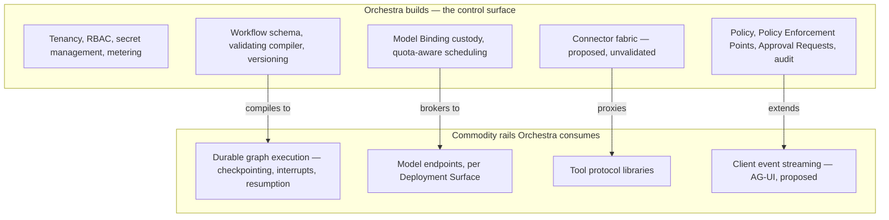

# Scope and Non-Goals

Orchestra is a multi-tenant SaaS governance and connectivity layer for enterprise AI agents. This
document states what that sentence includes, what it excludes, and — where an exclusion is
provisional — what would change it.

Every entry traces to an ADR. Where no ADR decides something, this document says so and names what
would decide it. The project is pre-implementation and pre-customer: no platform code exists, and
every claim here about what enterprises need is a guess until a design partner contradicts it.

## 1. Removed, deferred, undecided

Three exclusions read alike in a roadmap and behave differently in practice. Conflating them is how
a specification acquires imaginary agreement.

| Class | Meaning | What changes it |
| --- | --- | --- |
| **Removed** | An Accepted ADR determined Orchestra does not build it, and the reasoning is on record. | A superseding ADR. Accepted ADRs are never edited. |
| **Deferred** | Consistent with the product's direction but outside the current slice. Deferred deliberately, with the reasoning on record. | Where an Accepted ADR made the deferral, that ADR's revisit criteria and a superseding ADR. Where nothing has been decided, the named later document suffices. |
| **Undecided** | No ADR decides it in either direction. Treat any statement about it as opinion. | The document or ADR named beside it, once written. |

A fourth state cuts across all three. Three ADRs are **Proposed**, not Accepted: AG-UI adoption
([ADR-0004](../adr/adr-0004-adopt-ag-ui-event-protocol.md)), the outbound connector
([ADR-0007](../adr/adr-0007-outbound-connector-for-enterprise-reachability.md)) and A2UI as the
GenUI interchange ([ADR-0010](../adr/adr-0010-a2ui-genui-interchange.md)). Each names the validation
step — a spike or a design-partner conversation — that would bind it, and none has happened. Scope
resting on a Proposed ADR is provisional in both directions: the inclusion may not survive, and
neither may the exclusion it implies.

## 2. In scope

The differentiated surface, per [ADR-0003](../adr/adr-0003-governance-layer-positioning.md): the
questions an enterprise buyer asks under audit, which the commodity rails do not answer.

### 2.1 Tenancy, administration and secrets — in the MVP, not a later phase

Tenant is a first-class entity from the first commit, with RBAC, tenant administration and secret
management alongside it ([ADR-0001](../adr/adr-0001-product-shape-multi-tenant-saas.md)).
`tenant_id` MUST appear on every persisted record, every emitted event and every log line.

This was a **material MVP scope increase**, not a restatement of existing plans. The v0.1 brief put
all four in a later phase. ADR-0001 moved them forward because tenant isolation is the one property
that cannot be retrofitted, and the failure mode is existential. It must be planned as the increase
it is, not absorbed silently.

### 2.2 Credential custody and quota-aware scheduling

Under BYOK the customer supplies the model credential and Orchestra custodies it under KMS-backed
envelope encryption, with per-tenant data keys, rotation, and no plaintext in logs, traces or
backups ([ADR-0002](../adr/adr-0002-enterprise-segment-and-byok.md)). Orchestra never resells
tokens. The customer's Quota Envelope is therefore a steady-state capacity ceiling rather than an
error condition, and admission control against it is in scope
([ADR-0006](../adr/adr-0006-model-layer-as-credential-broker.md)) — with the resulting delay
surfaced to the user, not hidden inside a retry loop.

### 2.3 Policy, approval and audit

Policy, Policy Enforcement Points, Approval Requests carrying an Evidence Set, and audit as a
product surface rather than a log level. This is the centre of the platform, not a cross-cutting
concern ([ADR-0003](../adr/adr-0003-governance-layer-positioning.md)). It is also the answer to
prompt injection. Policy, not prompts, is the security boundary: a financial action above a
threshold requires a human regardless of how persuasively an agent argues for it, and the Evidence
Set exists so that the human decides on the inputs the model actually had.

### 2.4 Workflow definition, compiler and versioning

Orchestra owns the declarative Workflow schema, the validating compiler, policy injection,
versioning and lifecycle ([ADR-0008](../adr/adr-0008-declarative-workflow-definitions.md)). The
compiler emits a Policy Enforcement Point at every Step boundary, which is what makes governance
structural: it cannot be bypassed by how a definition is written. Step types at MVP are `agent`,
`tool`, `approval`, `condition`, `parallel`, `wait`, `transform` and `subworkflow`. Additions are
deny-by-default and each requires its own ADR — the stated guard against the definition language
growing into a programming language.

### 2.5 Metering

Metering is a first-class, auditable subsystem from the first commit
([ADR-0009](../adr/adr-0009-meter-first-defer-tiering.md)). Meter records MUST be append-only,
tenant-scoped, timestamped, idempotent under retry, and reconcilable against the audit log. Usage
that was not recorded cannot be recovered; a price that was not set can be set later. Model usage is
metered and reported to the customer but never billed: under BYOK, cost attribution by department,
Agent and Workflow is a feature, not an invoice.

### 2.6 Enterprise tool reachability — in scope, but resting on a Proposed ADR

Reaching business systems that are not internet-exposed is the largest unscoped item in the
platform, and ADR-0007 proposes a customer-deployed Connector establishing an outbound session, with
direct HTTPS as the fast path. The transport seam MUST be abstract from the outset, so that a direct
session and a tunnelled one are indistinguishable to everything above them. **ADR-0007 is
Proposed.** It binds only after design-partner conversations that have not happened — whether public
exposure is achievable for them, what their security teams demand of software running inside their
network, and what BYOK actually means to them. Designing the seam now is justified; treating the
Connector as a settled MVP deliverable is not.

## 3. Not built, and why

The load-bearing half of a scope document. Each exclusion is a decision, with the ADR that made it.

### 3.1 Not an agent framework

Orchestra does not compete with the orchestration runtime, the model providers or the tool protocol.
They are commodity rails, and every improvement in them accrues to Orchestra rather than threatening
it ([ADR-0003](../adr/adr-0003-governance-layer-positioning.md)). The runtime is a compilation
target and never a public boundary ([ADR-0005](../adr/adr-0005-langgraph-as-compilation-target.md)).
Its vocabulary MUST NOT appear in any Orchestra API, schema, SDK or customer-facing document. The
declarative definition is the customer-facing artifact; the compiled graph is a build output that
can be regenerated for a different runtime with no customer-visible change.

### 3.2 Not durability, checkpointing, interrupts or resumption

These are supplied by the runtime and explicitly excluded from what Orchestra builds
([ADR-0008](../adr/adr-0008-declarative-workflow-definitions.md)). Checkpoint appears in the
[glossary](../GLOSSARY.md) precisely so that it can be named internally and kept out of every public
contract. Rebuilding this class of machinery is a multi-year investment in a solved problem.

### 3.3 Not a bespoke agent event protocol — proposed, not settled

The v0.1 brief proposed authoring one. ADR-0004 proposes adopting AG-UI instead and carrying
governance events as `orchestra.*` namespaced extensions, with a published conformance profile. This
exclusion is **provisional**: ADR-0004 binds only after a spike confirms the approval lifecycle
survives disconnect and replay over custom events, and that the ordering guarantees Orchestra
requires — per-Run monotonic sequence, `run_id`, `tenant_id`, server-assigned event id — are
expressible without forking. If the spike fails, protocol authorship returns as an option.

### 3.4 Not model routing — removed, not deferred

Capability-based selection, preference-based routing and cost-optimising policy engines are
**removed** from scope ([ADR-0006](../adr/adr-0006-model-layer-as-credential-broker.md)). The
distinction matters: they were not postponed for capacity reasons, they were found unimplementable
under BYOK. A tenant enables a small, fixed set of Model Bindings, changed by a procurement process
measured in weeks; there is nothing to route across. The model layer is therefore a broker —
explicit selection of a Model Binding, ordered fallback, quota-aware scheduling, normalised
invocation. Reinstating routing requires a superseding ADR, most plausibly triggered by a move
toward a self-serve segment.

### 3.5 Not a general-purpose automation platform

ADR-0008 reverses the v0.1 non-goal of a generic workflow engine, and restates it more precisely.
The boundary has two halves, and both must hold:

- Every Orchestra Step executes under policy and audit. A Step that cannot be governed is not a
  Step.
- The Tool Catalog holds business capabilities registered as Tools, each with a versioned typed
  schema, a Side-Effect Class and an authorization binding. It is not a directory of SaaS
  connectors.

Those two constraints keep Orchestra out of a BPM engine's lane on one side and an
integration-automation product's lane on the other. What Orchestra builds is the schema, the
compiler, policy enforcement, versioning, observability and the audit trail.

## 4. Deferred and undecided

### Deferred, not rejected

None of these is rejected in principle, but neither were they merely overlooked: each was deferred
deliberately and the reasoning sits in the cited ADR. Three of the four were deferred by an
**Accepted** ADR — the tier builder by ADR-0009, the visual designer by ADR-0008, and the
customer-deployed Data Plane by ADR-0001's hosted-platform decision. Reopening any of those follows
that ADR's revisit criteria and produces a superseding ADR, rather than being a later choice
somebody is free to make.

| Deferred | Position at MVP | What reopens it | Source |
| --- | --- | --- | --- |
| Tier builder, self-serve packaging | Meter every dimension; price the first contracts by hand | Enough customers in production for real usage shapes to be observable | [ADR-0009](../adr/adr-0009-meter-first-defer-tiering.md) |
| Visual workflow designer | Schema-first authoring, reviewed as code | A later product decision, informed by whether design partners refuse to adopt without one | [ADR-0008](../adr/adr-0008-declarative-workflow-definitions.md) |
| General generative-UI component catalog | Text plus a schema-validated approval surface | GenUI entering the roadmap, or A2UI reaching a stable release | [ADR-0010](../adr/adr-0010-a2ui-genui-interchange.md), Proposed |
| Hybrid or customer-deployed Data Plane | Orchestra operates both Control Plane and Data Plane | Design partners establishing that BYOK means data non-egress rather than spend control | [ADR-0002](../adr/adr-0002-enterprise-segment-and-byok.md), [ADR-0007](../adr/adr-0007-outbound-connector-for-enterprise-reachability.md) |

The last row is an open question, not a plan. ADR-0001 names a hybrid topology as the likely
response if the segment categorically refuses third-party data processing, and ADR-0002 requires
that the ambiguity be tested with design partners first. Until that test happens, nobody should
build toward it or promise it.

### Undecided — no ADR decides these in either direction

| Question | What would decide it |
| --- | --- |
| Which datastore engine backs the platform | An architecture decision, constrained by [ADR-0011](../adr/adr-0011-tenant-isolation-shared-schema-rls.md) to an engine that enforces row-level security |
| Whether BYOK means spend control or data non-egress | Design-partner validation, named in [ADR-0002](../adr/adr-0002-enterprise-segment-and-byok.md) and [ADR-0007](../adr/adr-0007-outbound-connector-for-enterprise-reachability.md) |
| Compensation semantics beyond the requirement to declare them | The workflow execution-semantics specification, per [ADR-0008](../adr/adr-0008-declarative-workflow-definitions.md) |
| Price points, tier boundaries and what a seat costs | Observed usage, once customers exist — [ADR-0009](../adr/adr-0009-meter-first-defer-tiering.md) |
| Whether a Connector is required at all, or only a differentiator | Validation step 1 of [ADR-0007](../adr/adr-0007-outbound-connector-for-enterprise-reachability.md) |

## 5. Status

Draft, and describing intended scope for a system that does not exist. It will be wrong in places
only a customer can reveal; when it is, the correction belongs in an ADR first and here second. See
[`docs/README.md`](../README.md) §5 and [VERSIONING.md](../VERSIONING.md) §3.
