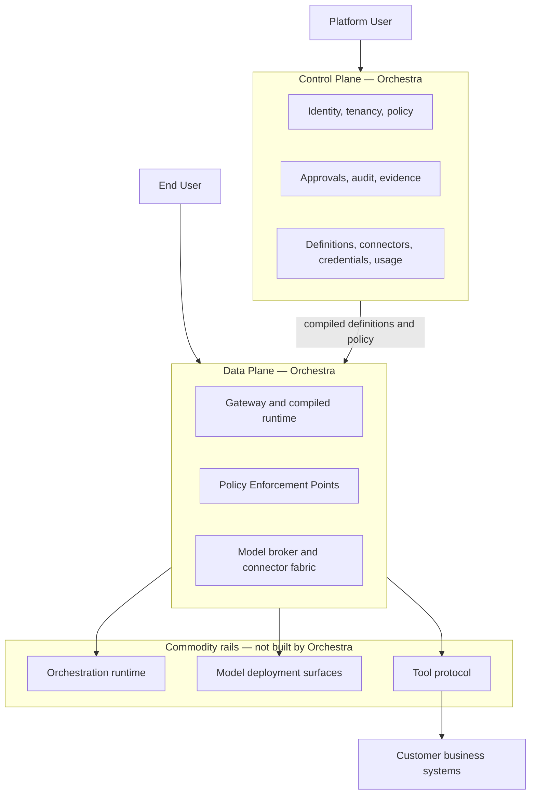

# Vision

Orchestra is a multi-tenant SaaS governance and connectivity layer for enterprise AI agents. This
document states the problem it addresses, why the existing rails do not address it, what Orchestra
is, what it deliberately is not, and who it is for. Everything else in the documentation set assumes
it.

> **Product thesis.** Deterministic where determinism matters. Agentic where judgment matters.
> Governed at every step.

---

## 1. The problem

Building an agent is no longer the hard part. An enterprise team can assemble a competent one from
an open orchestration runtime, a model endpoint and a handful of tool definitions. What they cannot
do is put it into production against a system that matters.

The obstacle is not capability. It is the set of questions an enterprise must answer before an agent
is permitted to act — under audit, in writing, to someone who can stop the project
([ADR-0003](../adr/adr-0003-governance-layer-positioning.md)):

- Who may use this agent?
- Which capabilities does it hold?
- Who approved this action?
- On what evidence?
- At what cost?
- How is it stopped?

A procurement agent that drafts a purchase order is a demo. One that issues it is a financial
system. The difference is not model quality. It is that the second requires an Approval Request
routed to a named Principal, an Evidence Set showing exactly what the agent relied on when it
proposed the action, and an Audit Record that survives a later security review.

Three further obstacles sit underneath that one.

**The systems worth acting on may not be reachable.** SAP, Oracle, a warehouse management system,
core banking — an agent running in a vendor's cloud may have no network path to them.
[ADR-0007](../adr/adr-0007-outbound-connector-for-enterprise-reachability.md) assumes such systems
are rarely internet-exposed and that inbound exceptions for third-party SaaS are hard to obtain.
That assumption is exactly what its design-partner validation tests, and it is why ADR-0007 remains
Proposed. It still supports direct exposure over HTTPS as a fast path where a customer can offer
one.

**Model access is already governed, and not by the agent vendor.** Enterprises with an AI governance
posture route model traffic through Azure OpenAI, AWS Bedrock, Google Vertex AI or a mandated
internal gateway, because that is where their commercial agreements, network controls and spend
commitments already sit ([ADR-0002](../adr/adr-0002-enterprise-segment-and-byok.md)). Their own
provider quota — the Quota Envelope — is then a permanent capacity ceiling to be scheduled within,
not an occasional error to retry ([ADR-0006](../adr/adr-0006-model-layer-as-credential-broker.md)).

**Prompt injection is not a prompt problem.** Connect a model to write-capable enterprise Tools and
every document it reads becomes an attack surface. No system prompt survives contact with an
adversary who controls the agent's inputs. The only durable defence is a rule the model cannot argue
past: a financial action above a threshold requires a human, regardless of how persuasively the
agent justifies it. Policy, not prompts, is the security boundary.

---

## 2. Why the existing rails do not solve it

Each rail solves its own problem well. The gap is not a missing feature in any one of them.

| Rail | What it gives you | What it does not give you |
| --- | --- | --- |
| Orchestration runtime | Durable, checkpointed, interruptible graph execution with resumption | An Approval Request routed to a Principal, carrying an Evidence Set and producing an Audit Record. An interrupt is a code-level construct, not an administered decision. |
| Model provider SDKs | Invocation and streaming against one deployment surface | Credential custody across Tenants, and admission control against each customer's Quota Envelope |
| Tool protocol (MCP) | A standard way to describe and invoke a Tool | Who may invoke it, on whose behalf, under which Policy — and how the server is reached from outside the customer's network at all |
| Agent-to-UI event protocols | Ordered streaming of agent output into an application | Governance semantics: approval required, policy denied, step boundaries crossed |
| BPM engines | Determinism, compensation and a fifteen-year lead | Agency. AI is attached at the edges of the process, not trusted with judgment inside it |

The common absence is the customer's organisation. None of these rails has a Tenant, a Platform
User, a Policy or an Approval Chain, because none of them is trying to. Governance assembled on top
of them is therefore per-project code, rebuilt for each agent and audited by nobody. The bet is
that this is where enterprise agent programmes stall. That is the hypothesis the product rests on,
not an observation — see section 6.

The correct response is not to rebuild the rails. It is to build the control surface over them.

---

## 3. What Orchestra is

Orchestra is a hosted, multi-tenant SaaS platform
([ADR-0001](../adr/adr-0001-product-shape-multi-tenant-saas.md)) for the enterprise segment, under
which the customer brings their own model credentials
([ADR-0002](../adr/adr-0002-enterprise-segment-and-byok.md)). Tenant is a first-class entity from
the first commit: every persisted record, every emitted event and every log line carries a
`tenant_id`. Multi-tenancy is the one property that cannot be retrofitted, so it is MVP scope, not a
later phase.

It is a governance and connectivity layer, not an agent framework
([ADR-0003](../adr/adr-0003-governance-layer-positioning.md)). The orchestration runtime, the model
providers and the tool protocol are commodity rails that improve weekly without Orchestra's help.
Orchestra owns the control surface over them: identity, policy, approval, audit, connectivity,
workflow definition and metering.

ADR-0003 puts the analogy this way: Stripe did not build the card networks — it built the control
surface over them. That is a statement about position and nothing else. It says where Orchestra
sits; it makes no claim about the size of the category or how this product will fare in it.

Five properties follow from that position.

**Definitions are declarative and compiled, not interpreted.** An Agent is configuration —
instructions, permitted Tools, a Model Binding, policy bindings and bounds. A Workflow is a
versioned graph of Steps, each typed and each declaring a Side-Effect Class. Orchestra owns the
schema, the validating compiler and the versioning; it does not own durability, checkpointing or
resumption ([ADR-0008](../adr/adr-0008-declarative-workflow-definitions.md),
[ADR-0005](../adr/adr-0005-langgraph-as-compilation-target.md)).

**Policy enforcement is structural, not conventional.** The compiler emits a Policy Enforcement
Point at every Step boundary, before every Tool invocation and at Run admission, so policy cannot be
bypassed by how a definition is written. A `require_approval` verdict raises an Approval Request
carrying the proposed action, the Evidence Set and the routing chain — so the human decides on the
same information the model had.

**Audit is a product surface, not a log level.** Every Policy Decision is recorded, including the
allows, with the rule that matched and the inputs it matched on.

**The model layer is a credential and endpoint broker, not a router.** A Model Binding names a
Deployment Surface, an endpoint, a credential reference and declared limits. Orchestra custodies
BYOK credentials under envelope encryption, schedules within each binding's Quota Envelope, and
never resells tokens ([ADR-0006](../adr/adr-0006-model-layer-as-credential-broker.md)).

**Usage is metered from the first commit, and priced later.** Runs, Step Executions, Approvals, Tool
invocations by Side-Effect Class, Platform Users and End Users counted separately, and model tokens
per Model Binding — the last reported to the customer as cost attribution, never billed. Unrecorded
usage is unrecoverable; unset prices are not
([ADR-0009](../adr/adr-0009-meter-first-defer-tiering.md)).

Reachability is the sixth, and it is the one still open. The proposed mechanism is a
customer-deployed Connector that opens an outbound session to Orchestra and proxies Tool traffic
inward, requiring no inbound firewall rule. That decision is Proposed, not Accepted — see section 6.

---

## 4. What Orchestra deliberately is not

| Not | Why | Decision |
| --- | --- | --- |
| An agent framework | Agent orchestration is commodity and improving without us. Every hour spent there competes with a well-funded ecosystem; every hour spent on governance does not. | [ADR-0003](../adr/adr-0003-governance-layer-positioning.md) |
| A model router | Under BYOK a tenant enables a small, fixed set of deployments, changed by procurement over weeks. Capability-based and preference-based routing have nothing to route across. | [ADR-0006](../adr/adr-0006-model-layer-as-credential-broker.md) |
| A general-purpose automation platform | Every Orchestra Step executes under policy and audit, and the catalog holds registered business Tools, not a directory of SaaS integrations. This keeps Orchestra out of both Camunda's lane and Zapier's. | [ADR-0008](../adr/adr-0008-declarative-workflow-definitions.md) |
| A runtime you program against | The orchestration runtime is a compilation target. Its vocabulary and types never appear in an API, schema, SDK or customer-facing document. | [ADR-0005](../adr/adr-0005-langgraph-as-compilation-target.md) |
| A token reseller | The customer's credential, the customer's provider relationship, the customer's spend controls. | [ADR-0002](../adr/adr-0002-enterprise-segment-and-byok.md) |

Three things are deferred rather than rejected, each with a named condition for returning: a visual
workflow designer, which is where workflow products most often stall (ADR-0008); a tier builder and
self-serve packaging, pending real usage data (ADR-0009); and the general generative-UI component
catalog, which the first vertical slice replaces with a narrow, schema-validated approval surface
([ADR-0010](../adr/adr-0010-a2ui-genui-interchange.md), Proposed).

---

## 5. Who it is for

The enterprise segment, where governance is a purchase driver rather than a feature
([ADR-0002](../adr/adr-0002-enterprise-segment-and-byok.md),
[ADR-0003](../adr/adr-0003-governance-layer-positioning.md)). The domains in view are finance,
logistics and procurement: different business processes, identical governance requirements, which is
what makes a definition layer a platform rather than a per-vertical fork
([ADR-0008](../adr/adr-0008-declarative-workflow-definitions.md)).

| Principal | What they do | Note |
| --- | --- | --- |
| Platform User | Defines Agents, Workflows and Policies; resolves Approval Requests; reads audit | The seat-billable identity |
| End User | Interacts with an Agent through the customer's own application, identified by a scoped Session Token | Measured, explicitly not seat-billed |
| Service Account | Machine-to-machine calls into the Gateway | A non-human Principal |

The economic buyer is a platform team, but security and compliance stakeholders hold the veto. That
has a consequence for how the product is described: lead with approval, audit and connectivity
outcomes, not with the abstract word *governance*, which reads as overhead
([ADR-0003](../adr/adr-0003-governance-layer-positioning.md) records this as a live risk).

It is not for developer self-serve or mid-market, which would likely require Orchestra-owned model
keys alongside BYOK — ADR-0002 names that as its revisit criterion. And it is not for a team whose
unmet need is orchestration capability itself; the rails serve them directly, and ADR-0003 names
that finding as grounds to reopen the entire positioning.

---

## 6. Status: pre-implementation and pre-customer

No platform code exists. This repository is a specification set, and every enterprise assumption in
it is a guess until a design partner confirms it. Statements above about what enterprises require
are drawn from the decision record, not from customer evidence.

Three decisions are **Proposed**, not Accepted. They MUST NOT be built on as though settled.

| ADR | Proposed decision | What would make it binding |
| --- | --- | --- |
| [ADR-0004](../adr/adr-0004-adopt-ag-ui-event-protocol.md) | Adopt AG-UI as the client-facing event protocol, carrying governance events as namespaced extensions | A spike that runs the approval lifecycle over custom events end to end and survives disconnect and replay, plus confirmation that a conformance profile can express Orchestra's ordering guarantees without forking |
| [ADR-0007](../adr/adr-0007-outbound-connector-for-enterprise-reachability.md) | A customer-deployed outbound Connector as the primary tool-reachability mechanism | Confirmation from at least two design partners that public MCP exposure is not achievable for them, and a statement of what their security teams require of software running inside their network |
| [ADR-0010](../adr/adr-0010-a2ui-genui-interchange.md) | A2UI as the external generative-UI interchange, behind an adapter | Verification of A2UI's current version and stability, and confirmation that the approval surface is expressible in it without extension. Deferred; not on the first slice |

Other questions are simply unmade, and this document does not pretend otherwise:

- **Tenant isolation strategy** — row-level security, schema-per-tenant or database-per-tenant.
  ADR-0001 records it as a separate decision, to be taken in
  [`10-architecture/`](../10-architecture/README.md).
- **What BYOK means to a given customer** — control of spend and provider relationship, or a
  requirement that data never transit Orchestra infrastructure. Only the second implies a hybrid
  topology with a customer-deployed data plane. ADR-0002 requires this be tested with design
  partners before it is architected for.
- **Pricing.** No price point, tier boundary or packaging assumption has been tested. ADR-0009
  defers all of it deliberately and meters instead.

Where this document says something is decided, it names the ADR. Where it names none, the decision
is unmade — read that as an open question, never as consensus.

---

## 7. What to read next

1. [Product thesis](product-thesis.md) — the governance-layer argument at length.
2. [Scope and non-goals](scope-and-non-goals.md) — the boundary, including the non-goal ADR-0008
   reversed and how it was rebounded.
3. [Roadmap](roadmap.md) — MVP through enterprise maturity.
4. [Personas](personas.md) — administrator, developer, approver, auditor, end user.

Then read every Accepted ADR in [`adr/`](../adr/README.md), and [`GLOSSARY.md`](../GLOSSARY.md),
whose terms are binding on documentation, schemas, APIs and code.
