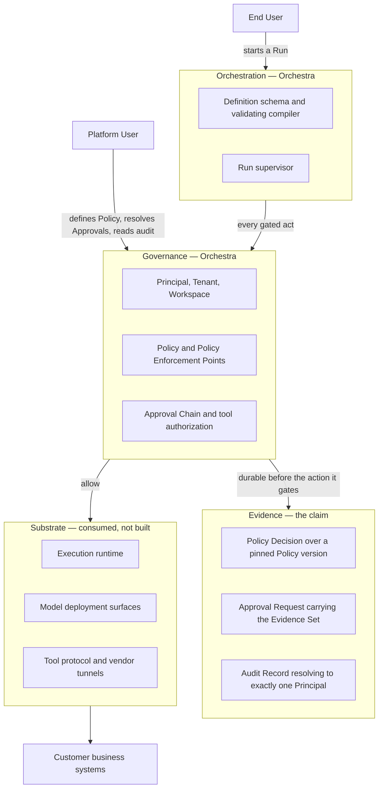

# Vision

Orchestra is a multi-tenant SaaS governance layer for enterprise AI agents. This document states the
problem it addresses, the claim it makes against that problem, what is substrate and what Orchestra
owns, what it deliberately is not, and who it is for. Everything else in the documentation set
assumes it.

> **Product thesis.** A consequential agent action is a **governed state transition**: it has an
> accountable Principal, an applicable Policy, an explicit approval state where one is required, and
> durable evidence of the decision
> ([ADR-0015](../adr/adr-0015-governed-action-positioning.md)).

**This revision is a correction, and it is worth saying so plainly.** Earlier versions of this
document argued five differentiated capabilities — firewall reachability, BYOK credential custody,
administered policy and approval, audit that survives a security review, and quota-aware scheduling
— and treated reachability as the central obstacle Orchestra removes. The evidence gathered in
[`prior-art-survey.md`](../80-reference/prior-art-survey.md) and
[`mcp-evaluation.md`](../80-reference/mcp-evaluation.md) on 2026-09-10 rated five of nine
differentiation claims derived from that story contestable, found the reachability claim answered by
two model vendors shipping outbound tunnels, and found the absorption risk — a platform vendor
adds governance and takes the category — already shipped rather than forecast.
[ADR-0015](../adr/adr-0015-governed-action-positioning.md) re-founds the claim on the thesis above
and [ADR-0014](../adr/adr-0014-run-supervisor-is-orchestras.md) corrects the build boundary
underneath it. ADR-0003 and ADR-0008 are superseded and appear below only as history. The older
descriptor *governance and connectivity layer* still stands in [`CLAUDE.md`](../../CLAUDE.md) and
[`docs/README.md`](../README.md), both of which are due the same correction.
[`roadmap.md`](roadmap.md) and [`personas.md`](personas.md) have been brought onto ADR-0014 and
ADR-0015 alongside this document.

The tagline *deterministic where determinism matters, agentic where judgment matters, governed at
every step* describes Orchestra's execution model accurately and is retained on that basis. It is
not the differentiation: ADR-0015 sorts deterministic execution as an execution property, and a BPM
vendor sells the same shape today ([`prior-art-survey.md`](../80-reference/prior-art-survey.md)
sections 2 and 8.1).

---

## 1. The problem

Building an agent is no longer the hard part. An enterprise team can assemble a competent one from
an open orchestration runtime, a model endpoint and a handful of tool definitions. What they cannot
do is put it into production against a system that matters.

The obstacle is not capability. It is the set of questions an enterprise must answer before an agent
is permitted to act — under audit, in writing, to someone who can stop the project:

- Who may use this agent?
- Which capabilities does it hold?
- Who approved this action?
- On what evidence?
- At what cost?
- How is it stopped?

That problem statement has not moved, and nothing in the 2026-09-10 evidence weakened it. What moved
is the answer, which is the subject of section 2.

A procurement agent that drafts a purchase order is a demo. One that issues it is a financial
system. The difference is not model quality. It is that the second requires an Approval Request
routed to a named Principal, an Evidence Set showing exactly what the agent relied on when it
proposed the action, and an Audit Record that survives a later security review.

Two conditions sit underneath that, and Orchestra claims to remove neither.

**Model access is already governed, and not by the agent vendor.** Enterprises with an AI governance
posture route model traffic through Azure OpenAI, AWS Bedrock, Google Vertex AI or a mandated
internal gateway, because that is where their commercial agreements, network controls and spend
commitments already sit ([ADR-0002](../adr/adr-0002-enterprise-segment-and-byok.md)). Their own
provider quota — the Quota Envelope — is then a permanent capacity ceiling to be scheduled
within, not an occasional error to retry
([ADR-0006](../adr/adr-0006-model-layer-as-credential-broker.md)).
This constrains the architecture. It differentiates nothing: ADR-0015 sorts BYOK custody, budgets
and metering as a commodity platform capability, and a free MIT gateway already covers virtual keys,
spend tracking and budgets at the single-tenant layer.

**Prompt injection is not a prompt problem.** Connect a model to write-capable enterprise Tools and
every document it reads becomes an attack surface. No system prompt survives contact with an
adversary who controls the agent's inputs. The only durable defence is a rule the model cannot argue
past: a financial action above a threshold requires a human, regardless of how persuasively the
agent justifies it. Policy, not prompts, is the security boundary, and
[`threat-model.md`](../40-governance/threat-model.md) is where that is specified rather than
asserted. The honest addendum is that this argument is now industry consensus rather than a position
— AWS documents the same principle in nearly the same words, that the agent does not see the
policy logic and cannot reason around it. Being right about the defence is a correctness
requirement, not a moat.

---

## 2. The claim

Orchestra does not differentiate on how agents reach tools. It differentiates on the governance
state and evidence attached to those actions
([ADR-0015](../adr/adr-0015-governed-action-positioning.md)).

The thesis is a claim about what an action *is*, not a feature list: a consequential agent action is
a governed state transition with an accountable Principal, an applicable Policy, an explicit
approval state where one is required, and durable evidence of the decision. Four commitments make
that specific enough to be attacked, and they are the substance of the claim.

| Commitment | What it rules out | Where it is fixed |
| --- | --- | --- |
| Exactly one accountable Principal per governed action, with no unattributed path | An action attributable to "the agent", to a shared service identity, or to nothing | [`GLOSSARY.md`](../GLOSSARY.md); [`audit-model.md`](../40-governance/audit-model.md) |
| The Policy version that matched is pinned for the life of a Run and referenced by version | Reconstructing after the fact what the rule *probably* said when the action was taken | [ADR-0012](../adr/adr-0012-policy-decisions-are-audit-records.md); [VERSIONING.md](../VERSIONING.md) section 8 |
| An Approval Request carries the Evidence Set the model relied on | A human approving a summary the model wrote about its own reasoning | [`approval-workflows.md`](../40-governance/approval-workflows.md) |
| The Policy Decision is durable before the action it gates is attempted | An action taken while the record of why it was permitted could not be written | [ADR-0013](../adr/adr-0013-fail-closed-policy-decision-writes.md) |

Those are choices, they cost availability and record volume, and they are what a superseding record
would have to attack. Only [`30-protocol/`](../30-protocol/) and
[`40-governance/`](../40-governance/) are normative; this section describes, and those documents
bind.

### 2.1 What this claim is not

**It is not a claim that governance is uniquely Orchestra's.** That claim is untenable on the
evidence and would discredit everything around it. On 2026-09-10 the survey found governance-shaped
capability shipped across the field:

| Vendor | Shipped | Why it bites |
| --- | --- | --- |
| Microsoft | Centralised agent governance, approval flows, named ownership, policy enforcement and auditability as platform capabilities, with per-action authorisation, human approval, orchestration limits and action audit logging | The predicted absorption in its exact shape, and cross-platform by design, which is precisely the neutrality Orchestra would otherwise claim |
| AWS | AgentCore Policy generally available 2026-03-03, compiled to Cedar and evaluated at a gateway intercepting agent-tool traffic; Dogwood adds rate limits, time windows, prerequisite steps and escalation triggers | A Policy Enforcement Point at the tool boundary, with identity and a consent portal beside it |
| Google | Gemini Enterprise Agent Platform: agent identity with a cryptographic ID and an auditable trail, an agent registry gating what is available, and a gateway enforcing policy | Registry, identity, enforcement point and audit trail sold as one control plane |
| ServiceNow | AI Control Tower governs MCP servers, models, agents, datasets and prompts as asset types, requiring steward approval before use and enforcing it in the tooling | The closest thing to Orchestra's stated positioning, from a vendor already holding the enterprise's change process |
| LangChain | LangSmith Deployment: agent registry with versioning and rollbacks, custom auth and access control, human-in-the-loop approvals; the LLM Gateway adds spend caps, PII redaction and administrative audit logging | Sold as the commercial control plane over the very runtime [ADR-0005](../adr/adr-0005-langgraph-as-compilation-target.md) compiles onto |
| Camunda | 8.9 ships a centralised audit log over user and client operations and cluster-wide user-task listeners for enforcing governance rules | An established enterprise process vendor moving into the same vocabulary |

**Neither are the primitives unique.** Named ownership, approval, release gates and audit trails all
ship elsewhere. The *enforcement* primitives increasingly ship free — Dogwood's policy language is
Apache-2.0, agentgateway is Apache-2.0 under the Linux Foundation, LiteLLM's gateway core is MIT —
while ownership, approval and audit sit inside the paid tiers of the rows above
([`prior-art-survey.md`](../80-reference/prior-art-survey.md) sections 7.1, 7.3 and 7.4; LiteLLM
puts audit logs in its Enterprise column). ADR-0015 rates absorption by a platform vendor at
**High** likelihood — raised from Medium, on shipped evidence rather than inference.

What is claimed is the particular governance model and evidence semantics in the commitments table
of section 2, and the claim that Orchestra's model is substrate-neutral by construction while a
platform vendor's governance is attached to that vendor's own substrate. That second half is thinner
than it reads: Microsoft governs agents built on other platforms by design, so neutrality is
contested from the identity layer down
([`prior-art-survey.md`](../80-reference/prior-art-survey.md) section 7.1).

Four of the nine differentiation claims the survey rated are **durable** on 2026-09-10 evidence, and
the fourth is durable only conditionally
([`prior-art-survey.md`](../80-reference/prior-art-survey.md) section 8.1).

| Durable claim | Standing |
| --- | --- |
| Audit with exactly one Principal and a Policy basis on every governed act | No surveyed product has this class. The survey's own words for the position are *thin ice to build a category on, but real ice* |
| Approval as administered, tenant-scoped configuration — chains, delegation, escalation, Evidence Set | Elsewhere it is a code pattern, a model element or a runtime feature; nowhere is it Approval as tenant data over a Run |
| Compilation of a declarative Workflow into enforcement points that cannot be written around | A competitor's guardrails are guidance a modeller may skip; Orchestra's compiler emits a Policy Enforcement Point at every Step boundary structurally. An architectural property rather than a feature, which is why it is hard to add without rebuilding |
| Cross-runtime, cross-provider neutrality | Durable **only** for buyers whose estate genuinely spans clouds and runtimes, and Microsoft contests even that from the identity layer |

The *thin ice* phrase belongs to the audit row alone and not to the set. None of the four is a claim
that governance is Orchestra's; each is a claim about a specific property of Orchestra's model.

The material risk is named rather than mitigated away: evidence semantics are harder to demonstrate
than a tunnel. A buyer sees connectivity work in a minute and an audit model in a procurement
review.

---

## 3. What is substrate, and what Orchestra owns

The move that survives from ADR-0003 is *build the control surface, not the rails*. What ADR-0015
changes is which capabilities count as that surface.

| Layer | Contents | Claim |
| --- | --- | --- |
| Substrate | Tunnels, model providers, tool protocols, execution runtime | Commodity. Orchestra consumes it |
| Orchestration | Definition schema, compiler, run supervisor | Necessary, owned, not the differentiation |
| Governance | Principal, Policy, approval, authorization | Where the claim begins |
| Evidence | Who authorised what, under which Policy, and what actually happened | The claim |

Capabilities sort against those layers as follows, and the sort is the part earlier versions of this
document got wrong.

| Capability | Strategic status |
| --- | --- |
| Firewall and tunnel connectivity | Commodity substrate |
| BYOK credentials, budgets, metering | Commodity platform capability |
| Tool Catalog and tool authorization | Expected platform capability |
| Policy enforcement | Market requirement, not a moat |
| Deterministic execution | An execution property, not differentiation |
| Enforcement points a definition cannot be written around | **Differentiation, and structural.** Compilation emits a Policy Enforcement Point at every Step boundary; a competitor's guardrails are guidance a modeller may skip. An architectural property rather than a feature, which is why it is hard to add without rebuilding |
| Administered approvals | Potential differentiation |
| Principal, Policy and durable evidence together | The core thesis |

### 3.1 What the substrate supplies

Each component solves its own problem well, and Orchestra rebuilds none of them.

| Substrate | What it supplies | What the component itself does not carry |
| --- | --- | --- |
| Execution runtime | Graph and state semantics, durable execution, checkpointing, interrupts, resume | A Tenant, a Principal, a Policy or an Approval Chain — and, per [ADR-0014](../adr/adr-0014-run-supervisor-is-orchestras.md), no service-level run supervision under a licence a hosted product can build on |
| Model deployment surfaces | Invocation and streaming against one endpoint | Credential custody across Tenants, and admission control against each customer's Quota Envelope |
| Tool protocol | A standard way to describe and invoke a Tool | Who may invoke it, on whose behalf, under which Policy |
| Vendor tunnels | SaaS-to-private-network reachability with no inbound listener | The enforcement point, the capability grant and the governance-visible refusal carried on the connection |
| Agent-to-UI event protocols | Ordered streaming of agent output into an application | Governance semantics: approval required, policy denied, step boundaries crossed |

The third column is true of each component. It is not true of the commercial products several of
those vendors sell above them — section 2.1 is the correction to any reading that the surrounding
market is empty.

### 3.2 Reachability is substrate

The network boundary is real. SAP, Oracle, a warehouse management system and core banking are
effectively never internet-exposed, and inbound exceptions for third-party SaaS are hard to obtain.
What changed is who solves it. Two model vendors ship SaaS-to-private-network reachability today,
both outbound-only: [OpenAI Secure MCP
Tunnel](https://developers.openai.com/api/docs/guides/secure-mcp-tunnels) runs a client inside the
customer network that opens outbound HTTPS, long-polls for queued work and posts responses back, so
"the private MCP server does not need a public listener". [Anthropic MCP
tunnels](https://platform.claude.com/docs/en/agents-and-tools/mcp-tunnels/overview)
run `cloudflared` outbound into a proxy that terminates an inner TLS session under a customer-held
certificate, and are a research preview offered as-is. An Apache-2.0, foundation-governed proxy
covers part of the in-network half. Under ADR-0003's own test — commodity is anything improving
without us — the transport is commodity, and ADR-0015 places it there.

[ADR-0007](../adr/adr-0007-outbound-connector-for-enterprise-reachability.md) is **Proposed**, and
ADR-0015 demotes its Connector from differentiation to plumbing. It may still be needed where vendor
tunnels do not reach or do not fit a customer's controls; it cannot be sold as a moat; and whether
it survives at all is now a live question for its validation rather than a foregone conclusion. A
design partner already running a vendor tunnel changes the build-or-integrate question rather than
the necessity question, and [`mcp-evaluation.md`](../80-reference/mcp-evaluation.md) section 3
recommends — without deciding — that ADR-0007 add that reopener and state which half of the
Connector it claims.

### 3.3 The analogy, and where it breaks

Stripe did not build the card networks; it built the control surface over them. That is a statement
about position and nothing else. It says where Orchestra sits and makes no claim about the size of
the category or how this product will fare in it.

The disanalogy is worth stating because it is the whole of section 2.1 in one line: the card
networks were not selling a control surface. Here, the substrate vendors are — LangChain sells a
control plane over the runtime Orchestra compiles onto, and the hyperscalers sell one over
everything. The position is available; it is not vacant.

---

## 4. What Orchestra is

Orchestra is a hosted, multi-tenant SaaS platform
([ADR-0001](../adr/adr-0001-product-shape-multi-tenant-saas.md)) for the enterprise segment, under
which the customer brings their own model credentials
([ADR-0002](../adr/adr-0002-enterprise-segment-and-byok.md)). Tenant is a first-class entity from
the first commit: every persisted record, every emitted event and every log line carries a
`tenant_id`, enforced by row-level security rather than by application discipline
([ADR-0011](../adr/adr-0011-tenant-isolation-shared-schema-rls.md)). Multi-tenancy is the one
property that cannot be retrofitted, so it is MVP scope, not a later phase.

**Definitions are declarative and compiled, not interpreted.** An Agent is configuration —
instructions, permitted Tools, a Model Binding, policy bindings and bounds. A Workflow is a
versioned graph of Steps, each typed and each declaring a Side-Effect Class. Orchestra owns the
schema, the validating compiler and the versioning. That decision was taken in
[ADR-0008](../adr/adr-0008-declarative-workflow-definitions.md), now superseded, and is carried
forward unchanged by [ADR-0014](../adr/adr-0014-run-supervisor-is-orchestras.md).

**Orchestra builds the run supervisor; the runtime is an execution substrate.** Durability,
checkpointing, interrupts and resume come from the runtime and Orchestra does not build them.
Run supervision is Orchestra's, as a first-class subsystem: run lifecycle, queueing, leasing work to
workers and reclaiming a lease when one disappears, per-Tenant concurrency and admission under the
Quota Envelope, scheduling and wake-up, job-level retry distinct from Step Execution retry, and
draining a worker during deployment. The reason is architectural before it is legal — durability
at the graph level does not give you durable service-level run orchestration; a checkpoint says a
graph
reached state X and says nothing about who owns the run, who retries it or what a Tenant's quota
permits — and it is reinforced by licence, since the obvious off-the-shelf implementation of that
layer is licensed Elastic-2.0, which forbids exactly the hosted product shape ADR-0001 fixes
([`langgraph-evaluation.md`](../80-reference/langgraph-evaluation.md)). This is the third expansion
of MVP scope, it is distributed-systems work of the kind where subtle bugs are most expensive, and
ADR-0014 deliberately leaves its size unresolved rather than guessing. *Run supervisor* is
ADR-0014's term and is not yet in [`GLOSSARY.md`](../GLOSSARY.md).

**Policy enforcement is structural, not conventional.** The compiler emits a Policy Enforcement
Point at every Step boundary, before every Tool invocation and at Run admission, so policy cannot be
bypassed by how a definition is written — rules E1 and E2 of
[`policy-model.md`](../40-governance/policy-model.md) section 3. A `require_approval` verdict raises
an Approval Request carrying the proposed action, the Evidence Set and the routing chain, so the
human decides on the same information the model had
([`approval-workflows.md`](../40-governance/approval-workflows.md) sections 3 and 4). *Having*
policy enforcement is a market requirement rather than a moat. Emitting it structurally, where a
definition author cannot write around it because the compiler places the point rather than the
author, is the third durable row of section 2.1. Either way it is load-bearing, because the evidence
in section 2 is only as good as the point that produces it.

**Audit is a product surface, not a log level.** Every Policy Decision is recorded, including the
allows, with the Policy version that matched and the inputs it matched on
([ADR-0012](../adr/adr-0012-policy-decisions-are-audit-records.md)), and a Policy Decision must be
durable before the gated action is attempted
([ADR-0013](../adr/adr-0013-fail-closed-policy-decision-writes.md)). Audit is never reconstructed
from traces and an audited act is never sampled — rule A6 and section 3 of
[`audit-model.md`](../40-governance/audit-model.md), restated in
[`observability.md`](../60-operations/observability.md) section 2.

**The model layer is a credential and endpoint broker, not a router.** A Model Binding names a
Deployment Surface, an endpoint, a credential reference and declared limits. Orchestra custodies
BYOK credentials under envelope encryption, schedules within each binding's Quota Envelope, and
never resells tokens ([ADR-0006](../adr/adr-0006-model-layer-as-credential-broker.md)).

**Usage is metered from the first commit, and priced later.** Runs, Step Executions, Approvals, Tool
invocations by Side-Effect Class, Platform Users and End Users counted separately, and model tokens
per Model Binding — the last reported to the customer as cost attribution, never billed.
Unrecorded usage is unrecoverable; unset prices are not
([ADR-0009](../adr/adr-0009-meter-first-defer-tiering.md)).

---

## 5. What Orchestra deliberately is not

| Not | Why | Decision |
| --- | --- | --- |
| An agent framework | Agent orchestration is commodity and improving without us. The control surface is where the claim is, and building the rails competes with a well-funded ecosystem for no return | [ADR-0015](../adr/adr-0015-governed-action-positioning.md) |
| The way agents reach systems | Two model vendors ship outbound tunnels today. Orchestra consumes reachability rather than claiming it, and any Connector it builds is plumbing | [ADR-0015](../adr/adr-0015-governed-action-positioning.md), [ADR-0007](../adr/adr-0007-outbound-connector-for-enterprise-reachability.md) (Proposed) |
| A model router | Under BYOK a tenant enables a small, fixed set of deployments, changed by procurement over weeks. Capability-based and preference-based routing have nothing to route across | [ADR-0006](../adr/adr-0006-model-layer-as-credential-broker.md) |
| A general-purpose automation platform | Every Orchestra Step executes under policy and audit, and the catalog holds registered business Tools, not a directory of SaaS integrations | [ADR-0014](../adr/adr-0014-run-supervisor-is-orchestras.md) |
| A runtime you program against | The execution runtime is a compilation target. Its vocabulary and types never appear in an API, schema, SDK or customer-facing document | [ADR-0005](../adr/adr-0005-langgraph-as-compilation-target.md) |
| A token reseller | The customer's credential, the customer's provider relationship, the customer's spend controls | [ADR-0002](../adr/adr-0002-enterprise-segment-and-byok.md) |

Three things are deferred rather than rejected, each with a named condition for returning: a visual
workflow designer, deferred by ADR-0008 as the place workflow products most often stall and not
revisited by ADR-0014; a tier builder and self-serve packaging, pending real usage data
([ADR-0009](../adr/adr-0009-meter-first-defer-tiering.md)); and the general generative-UI component
catalog, which the first vertical slice replaces with a narrow, schema-validated approval surface
([ADR-0010](../adr/adr-0010-a2ui-genui-interchange.md), Proposed).

---

## 6. Who it is for

The enterprise segment, where governance is a purchase driver rather than a feature
([ADR-0002](../adr/adr-0002-enterprise-segment-and-byok.md),
[ADR-0015](../adr/adr-0015-governed-action-positioning.md)). The domains in view are finance,
logistics and procurement: different business processes, identical governance requirements, which is
what makes a definition layer a platform rather than a per-vertical fork.

| Principal | What they do | Note |
| --- | --- | --- |
| Platform User | Defines Agents, Workflows and Policies; resolves Approval Requests; reads audit | The seat-billable identity |
| End User | Interacts with an Agent through the customer's own application, identified by a scoped Session Token | Measured, explicitly not seat-billed |
| Service Account | Machine-to-machine calls into the Gateway | A non-human Principal |

The economic buyer is a platform team, but security and compliance stakeholders hold the veto. That
has a consequence for how the product is described. Lead with the approval surface, which is
concrete and demonstrable; the governance model and its evidence semantics are what survive the
security review that follows. The abstract word *governance*, led with, reads as overhead — and
now also as a checkbox the buyer's existing cloud vendor claims to tick.

It is not for developer self-serve or mid-market, which would likely require Orchestra-owned model
keys alongside BYOK — ADR-0002 names that as its revisit criterion. And it is not for a team whose
unmet need is orchestration capability or connectivity itself; the rails serve them directly.
ADR-0015 names design partners consistently buying connectivity and treating governance as a
checkbox as grounds to reopen the positioning entirely — that outcome would falsify the thesis,
not merely the analysis behind it.

---

## 7. Status: pre-implementation and pre-customer

No platform code exists. This repository is a specification set, and every enterprise assumption in
it is a guess until a design partner confirms it. Statements above about what enterprises require
are drawn from the decision record, not from customer evidence. The competitive readings in section
2.1 come from vendor documentation, release notes and blogs — none of it exercised, and a
generally-available label is not a working feature.

Three decisions are **Proposed**, not Accepted. They MUST NOT be built on as though settled. Two of
them had part of their validation carried out on 2026-09-09, and the table states what actually
remains rather than what was originally listed — for ADR-0010, one completed step returned a
negative finding rather than a pending question.

| ADR | Proposed decision | What remains before it binds |
| --- | --- | --- |
| [ADR-0004](../adr/adr-0004-adopt-ag-ui-event-protocol.md) | Adopt AG-UI as the internal event format behind an Orchestra-versioned profile | Validation step 2 only: a prototype of the approval lifecycle against the 1.0 draft's **interrupt-and-resume** pattern — not the custom-event envelope — surviving disconnect and replay. It requires code rather than research. Steps 1, 3 and 4 were carried out on 2026-09-09: the profile carries the four per-event guarantees under a vendor-prefixed `metadata` key without forking, and the CopilotKit React bindings failed and are not adopted |
| [ADR-0007](../adr/adr-0007-outbound-connector-for-enterprise-reachability.md) | A customer-deployed outbound Connector as the primary tool-reachability mechanism | Confirmation from at least two design partners of **whether** public MCP exposure is achievable for them, and a statement of what their security teams require of software inside their network. [`mcp-evaluation.md`](../80-reference/mcp-evaluation.md) section 3 recommends, without deciding, that its validation add two further questions: whether a partner already running a vendor tunnel makes this build-or-integrate rather than necessary, and which half of the Connector — transport or the governance carried on it — the ADR claims |
| [ADR-0010](../adr/adr-0010-a2ui-genui-interchange.md) | A2UI as the external generative-UI interchange, behind an adapter | Validation step 2 only: confirmation that the approval surface is expressible without extension. Step 1 was carried out on 2026-09-09 and is **not satisfied** — A2UI is pre-1.0, its stability guarantees sit in an unshipped 1.0 milestone targeted for Q4 2026, and one breaking redesign has already shipped. Step 3 is partial: a first-party React renderer exists; there is no React Native renderer and none is planned, so that one would be Orchestra's to build. The revisit test is the published stability guarantee, not the 1.0 tag. Deferred; not on the first slice |

Other questions are unmade, and this document does not pretend otherwise.

- **The size of the run supervisor.** ADR-0014 requires its responsibilities be enumerated precisely
  enough to say whether it is glue around an executor or a substantial distributed runtime, and
  leaves the answer open. It changes the delivery plan and should be settled before an MVP is
  committed to.
- **Whether ADR-0007's Connector is built at all.** Its differentiation justification is gone; its
  reachability justification survives only where vendor tunnels do not reach. Design-partner
  validation decides it.
- **Whether the evidence model can be sold.** ADR-0015 rates *evidence semantics are too abstract to
  sell* at Medium likelihood and High impact. A packaging answer, not an architecture one, and
  untested pre-customer.
- **[ADR-0005](../adr/adr-0005-langgraph-as-compilation-target.md) needs the correction ADR-0014
  made.** It says durability, checkpointing, interrupts and resumption come free, which is true of
  the MIT library and not of the server tier, and it draws no library-versus-server distinction.
  That is a superseding ADR nobody has written.
- **What BYOK means to a given customer** — control of spend and provider relationship, or a
  requirement that data never transit Orchestra infrastructure. Only the second implies a hybrid
  topology with a customer-deployed data plane. ADR-0002 requires this be tested with design
  partners before it is architected for.
- **Pricing.** No price point, tier boundary or packaging assumption has been tested. ADR-0009
  defers all of it deliberately and meters instead.

Where this document says something is decided, it names the ADR. Where it names none, the decision
is unmade — read that as an open question, never as consensus.

---

## 8. What to read next

1. [Product thesis](product-thesis.md) — the governed-action argument at length.
2. [Scope and non-goals](scope-and-non-goals.md) — the boundary, and what moved out of it.
3. [Roadmap](roadmap.md) — MVP through enterprise maturity, with the run supervisor now in its
   sequencing and MVP scope recorded as having grown three times.
4. [Personas](personas.md) — administrator, developer, approver, auditor, end user.
5. [Prior art survey](../80-reference/prior-art-survey.md) and
   [MCP evaluation](../80-reference/mcp-evaluation.md) — the evidence that moved the claim.

Then read every Accepted ADR in [`adr/`](../adr/README.md), and [`GLOSSARY.md`](../GLOSSARY.md),
whose terms are binding on documentation, schemas, APIs and code.
