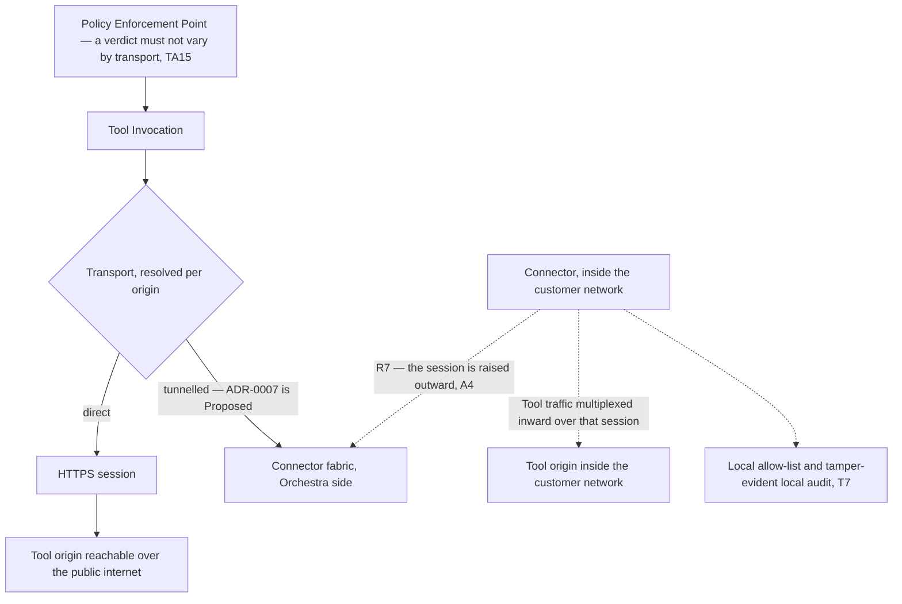
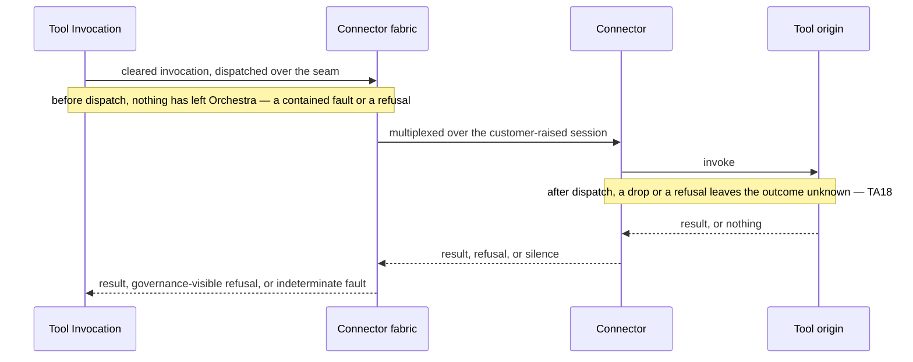

# Connector

The **Connector** is customer-deployed software running inside the customer's network. It
establishes an outbound session to Orchestra and proxies Tool traffic inward, requiring no inbound
firewall rule ([`../GLOSSARY.md`](../GLOSSARY.md)). That definition is fixed vocabulary. Almost
nothing else about the Connector is — including the benefit inside it. *No inbound firewall rule*
presumes that an outbound session out of that network is permitted at all, which is assumption
**A4** below and has been asked of nobody.

**This document is informative.** Only [`../30-protocol/`](../30-protocol/) and
[`../40-governance/`](../40-governance/) bind an implementation
([`../README.md`](../README.md) section 3), and where a rule binds this document links to it rather
than restating it. Orchestra is **pre-implementation and pre-customer**: no platform code exists, no
connector has been built, and no customer has reviewed one.

It was written against an **assumed design partner**, authorised by the repository owner for
demonstration purposes because the conversations
[ADR-0007](../adr/adr-0007-outbound-connector-for-enterprise-reachability.md) names have not
happened. That assumption unblocks the writing and validates nothing. **ADR-0007 remains Proposed.**
Section 2 lists every assumption, what would confirm each, and what breaks if it turns out false;
the body marks each place an assumption carries weight.

## 1. What ADR-0007 decides, and what it does not

ADR-0007 calls the line between Orchestra's cloud and the customer's network *the single largest
unscoped item in the platform*. It scopes one part of it and deliberately leaves the rest.

| ADR-0007 decides | ADR-0007 does not decide |
| --- | --- |
| That the **transport seam** is designed now: a Tool connection is either a direct HTTPS session or a multiplexed connector tunnel, **indistinguishable to everything above it** | That a connector is necessary — validation step 1 asks two design partners whether public exposure is achievable for them |
| That direct HTTPS exposure is supported as the **fast path** and the outbound connector is built as the **primary mechanism** — the decision carries no conditional, and its rationale is that assuming the fast path is assuming the sales cycle away | What form the connector takes — Kubernetes, VM and container are named as accommodation targets, not as a chosen packaging. Whether the fast path in fact carries the segment, which is what would demote the connector to a fallback, belongs to validation step 1 |
| That connector security is its own threat model, and names the controls it must carry | What a customer's security team will accept — validation step 2, and ADR-0007's own top risk is that the connector fails such a review |
| That version skew is permanent and governed by [`../VERSIONING.md`](../VERSIONING.md) section 9 | Whether "BYOK" means spend control or data non-egress — validation step 3, which decides whether a hybrid topology is needed at all |

The argument for splitting it this way is a cost argument, not a confidence one. The seam touches
timeouts, retries, cancellation, streaming and the error taxonomy; it is cheap to allow for now and
expensive to retrofit through all five. The connector product touches nothing above the transport,
so building it early buys a guess. **Designing the seam before design partners is not the same as
building the connector before them**, and only the first is defensible today.

If ADR-0007 is rejected, **sections 3 to 11 leave the specification**, Tools are reached over direct
HTTPS only, and nothing above the transport moves — the whole point of drawing the seam where
it is drawn ([`data-plane.md`](data-plane.md) section 10, [`containers.md`](containers.md)
section 7).
Sections 3 and 4 are inside that scope, not outside it: with one transport the seam rule is vacuous
and there is no tunnel for TA18 to govern.

> **This document rests on a Proposed decision.** Every section from 3 onward is conditional on
> [ADR-0007](../adr/adr-0007-outbound-connector-for-enterprise-reachability.md) binding.

## 2. Assumptions this document rests on

The repository owner has authorised an assumed design partner so that this document can be written
at all. **It is a demonstration device.** No partner has been interviewed, no security review has
been survived, and no row below has evidence behind it. Each is stated so that a reader can see
exactly how much of the document collapses with it.

| # | Assumption | Load-bearing in | What would confirm it | What changes if it is false |
| --- | --- | --- | --- | --- |
| **A1** | The partner's business systems are not reachable from the public internet | Sections 3 to 6 — the tunnelled branch of the seam, and the connector product. Without it there is no reachability problem and no connector. It is also what ADR-0007 validation step 1 tests, so the blockquote above already carries it; the seam's cost argument survives it | ADR-0007 validation step 1, with at least two partners | ADR-0007's revisit criteria fire. The connector demotes from an MVP requirement to a later differentiator, direct HTTPS carries the segment, and the seam survives on the cost argument alone |
| **A2** | The partner will run vendor software inside their network, subject to a security review they conduct | Sections 6 and 9, and section 12's row on reading the connector's local list. Section 6 describes a product nobody would be permitted to install otherwise | ADR-0007 validation step 2 — what their security teams require of such software | Reachability needs a mechanism that is not vendor software inside the perimeter, and the only one named here is a customer-built adapter against a published contract. Bring-your-own-cloud is not the escape it looks like: [`deployment-topologies.md`](deployment-topologies.md) section 7.2 shows it relocates the outbound-session problem rather than removing it, and so needs this assumption in a stronger form. If A1 and A2 both fail, reachability is unsolved. Section 6 becomes wasted work |
| **A3** | The partner can deploy in at least one form factor ADR-0007 names — Kubernetes, a virtual machine, or a container runtime | Section 6, and section 13's packaging row. Otherwise "installation" has no meaning to specify | The same conversation as A2 | A packaging question reopens and nothing above the transport moves. This is the cheapest assumption here to be wrong about |
| **A4** | Outbound sessions from inside that network to an external endpoint are permitted at all, possibly through a forward proxy | The definition in the opening paragraph, and the tunnel edge in section 3. The stated advantage — no inbound firewall rule — is otherwise only half true | The same conversation as A2, asked about egress rather than ingress | ADR-0007's central benefit narrows from *no firewall change* to *one egress rule instead of many inbound ones*. That is still an argument, but a weaker one, and the sales objection it was meant to remove partly returns |
| **A5** | For this partner, BYOK means control of spend and of the provider relationship — not that data must not transit Orchestra infrastructure | Section 11 existing as an option rather than a requirement. The hosted topology it sits inside is *not* assumed — [ADR-0001](../adr/adr-0001-product-shape-multi-tenant-saas.md) decides it and section 10 rests on that | ADR-0007 validation step 3 and the [ADR-0002](../adr/adr-0002-enterprise-segment-and-byok.md) follow-on; a design-partner conversation, not a document | A hybrid data plane enters scope, and [`deployment-topologies.md`](deployment-topologies.md) owns it. Section 11 stops being an option and becomes a requirement, relocating credential custody away from where ADR-0002 places it. The bar for that move is ADR-0001's own revisit criterion — the segment *categorically* refusing third-party data processing — and the move is made by an ADR superseding part of ADR-0001. One partner's answer is a data point toward it, not the decision |

**A1 and A2 are not the same assumption**: a partner can be unable to expose an endpoint *and*
unable to accept vendor software inside the perimeter, and ADR-0007 has no answer for that case. How
often it occurs is unknown — no partner has been interviewed, and this document claims no
frequency for it or for anything else about the segment. **None of these is a technical risk** —
each is a fact about a customer, learnable only by asking one.

## 3. The seam *(its tunnelled branch rests on A1 and A4)*

The seam is the one thing here worth acting on before ADR-0007 binds. Tool Invocation is
transport-abstracted from the outset, so the layers above it cannot tell how an origin was reached.
The abstraction is worth its cost either way; the **tunnelled** branch of it is what needs an
unreachable origin (**A1**) and an egress path to raise a session over (**A4**).

**What the seam must hide.** A Tool is the same Tool either way
([`../20-domain/domain-model.md`](../20-domain/domain-model.md) section 5 keeps reachability on an
axis of its own). The Tool's identity, its schema version, its Side-Effect Class, the capability
grant, the Policy that matched and the verdict are all transport-invariant. That is not a design
preference: [`../40-governance/tool-authorization.md`](../40-governance/tool-authorization.md)
**TA15** is normative and requires the same grant and the same Policy to produce the same verdict
either way, which is achievable only if every enforcement point sits **above** the seam.

**What the seam must not hide.** Everything in section 5. A tunnelled call has strictly more failure
modes than a direct one, and an abstraction presenting them as the same thing is not an
abstraction — it is a defect that only surfaces in production.

## 4. TA18 — a tunnelled call can end in an unknown state *(rests on A1)*

TA18 is normative **conditional on ADR-0007 binding, and void with it**: TA15 to TA18 live in
[`../40-governance/tool-authorization.md`](../40-governance/tool-authorization.md) section 7, whose
own scope note says that section leaves the specification if ADR-0007 is rejected. Normative is not
the same as unconditional.

> **TA18.** A connector refusal, or a tunnel drop mid-call, MUST NOT be retried blindly: the
> invocation is in an unknown state, and unknown is not the same as not done.
> ([`../40-governance/tool-authorization.md`](../40-governance/tool-authorization.md))

TA18 is invariant I4 and
[ADR-0008](../adr/adr-0008-declarative-workflow-definitions.md)'s prohibition on blind retry of a
side effect, applied to this path. What decides which side of the line a condition falls on is
**dispatch, not connector state** —
[`../60-operations/reliability.md`](../60-operations/reliability.md) F20.

Three consequences follow, none of which this document may soften:

- **Connector state is not evidence about a side effect.** `Offline` says the transport failed, not
  that the far side declined the work
  ([`../20-domain/lifecycle-state-machines.md`](../20-domain/lifecycle-state-machines.md) section
  5.2; reliability F9 forbids closing the gap that way).
- **A refusal is a governance outcome, not a transport error** (TA16), and **must not be routed
  around** by choosing another path to the same Tool (TA17). Route-shopping past the second list is,
  in TA17's own words, the one way the customer's last control can be undone from inside Orchestra.
- **Metering cannot resolve the unknown case yet.**
  [`../60-operations/quotas-and-metering.md`](../60-operations/quotas-and-metering.md) section 12
  records a refusal at the Connector as unresolved, because TA18 forbids asserting the origin was
  never called.

## 5. What the seam cannot hide *(rests on A1)*

ADR-0007 names three failure modes that MUST enter the reliability model — connector offline,
tunnel drop mid-call, version skew.
[`../60-operations/reliability.md`](../60-operations/reliability.md) section 9 carries them, and
this document does not restate its rules.

| Condition | Where it lands | Fixed by |
| --- | --- | --- |
| Connector `Offline` observed before dispatch | Contained fault — nothing left Orchestra | reliability F20 |
| Tunnel drop after dispatch | Indeterminate fault, never attempted again | TA18, reliability F20 |
| Connector `Refused` for version skew | A refusal, not an error, and in no error rate | [`../VERSIONING.md`](../VERSIONING.md) section 9, reliability section 9 |
| Refusal at the connector's own allow-list, decided **before** dispatch | A governance-visible refusal, in no error rate, and not to be worked around under TA17 | TA16, reliability F17 and section 4 |
| The same refusal returned **after** dispatch | An indeterminate fault, never attempted again — still governance-visible, still not worked around | TA18, reliability F20; the split is reliability section 4's |
| Connector not `Healthy` when a Step needs it | Fails the Step Execution — it does not suspend the Run and does not wait silently | reliability F19 |
| The Tool needed for a compensating action sits behind the connector that just failed | A Run with a known unresolved side effect | reliability F21, [`../50-workflows/execution-semantics.md`](../50-workflows/execution-semantics.md) section 6.2 |

A compensating action is an ordinary business action reaching an ordinary Tool
([`../50-workflows/execution-semantics.md`](../50-workflows/execution-semantics.md) X16), so an
outage that fails an action can equally make its compensation unavailable. That is a property of
tunnelling rather than of implementation quality, and no connector design removes it.

## 6. The Connector is a product, not a library *(rests on A1, A2 and A3)*

ADR-0007 is explicit that this is distinct software with its own surface area. Naming that surface
is not the same as designing it: **none of the rows below is designed, and none may be treated as
settled architecture.**

| Concern | What it means | Status |
| --- | --- | --- |
| Installation | Placing the software into a Kubernetes cluster, a virtual machine or a container runtime, in a customer change process Orchestra does not control | Form factors named by ADR-0007; packaging, prerequisites and footprint undecided |
| Enrolment | The administrative act that creates the installation's identity and issues its credential. Normatively an administrative act, per credential per installation, with terminal revocation ([`../40-governance/threat-model.md`](../40-governance/threat-model.md) T7) | The control is normative; the mechanism, the credential's form and the operator flow are undecided |
| Credential provisioning | Getting that credential into the installation without it passing through a channel that defeats the point | Undecided, and expensive to change once installations exist. If **A2** holds, it is also what a security review would ask about T7 first — an expectation, not a finding, since no reviewer has been asked |
| Health | The signal by which Orchestra and the customer both know whether the installation is serving | The states exist; what separates `Degraded` from `Healthy`, and on what interval, is **not decided anywhere** — see section 13 |
| Observability | What the customer's own operator can see locally, and what Orchestra surfaces in the Control Plane | Undecided. [`../60-operations/observability.md`](../60-operations/observability.md) owns the platform half; the local half has no owner yet |
| Signed releases | Signed artifacts and published checksums, so the release channel is not itself an attack path | Required by [`../VERSIONING.md`](../VERSIONING.md) section 9 and by T7. Signing scheme, key custody and verification point undecided |
| Upgrade | How a new version reaches an installation Orchestra cannot force-upgrade, and who decides when | Undecided. Section 7 governs what happens when it has not happened |

**Nothing here is a small addition to the platform.** Each row is a product decision with a support
obligation attached, and the honest reading of ADR-0007's negative consequences is that adopting the
connector adds a second product to the roadmap rather than a feature to the first.

## 7. Version skew is permanent — the decided part

[`../VERSIONING.md`](../VERSIONING.md) section 9 is normative and decided. It binds, and it is read
there rather than copied here — the supported-version window and its length, the alert, and the
signed-release requirement all live in it. Two of its facts are what section 8 consumes:

- The protocol version is negotiated **at enrolment and on every reconnection**.
- A connector below the minimum is **refused with an explicit, actionable error**, never silently
  degraded — which is what puts an installation into `Refused`.

One misreading is worth naming, because it would turn a commercial promise into an operational
threshold: the supported-version window is a **support commitment, not a health threshold**
([`../60-operations/reliability.md`](../60-operations/reliability.md) section 9). No interval,
timeout or threshold in this area is decided anywhere, and none is invented here.

Renegotiation on reconnection matters because the gateway's minimum can rise while an installation
is down. Admitting it afterwards on the strength of an earlier negotiation would let an unsupported
version proxy traffic indefinitely — the case the rule exists to prevent.

## 8. The lifecycle is already drawn

[`../20-domain/lifecycle-state-machines.md`](../20-domain/lifecycle-state-machines.md) section 5
draws the Connector lifecycle — `Enrolling`, `Healthy`, `Degraded`, `Offline`, `Refused` and
`Revoked`, with `Revoked` terminal and reachable from every other state. **That diagram is the
single copy**, not redrawn here; a second drawing that differed from it would be a defect. Three
things about it belong to this document rather than to that one:

- **`Refused` is a state, not an incident.** It is where permanent skew lands, and section 7 is what
  puts a connector into it and takes one out.
- **`Revoked` is terminal for the installation, not for the customer.** Terminal revocation per
  installation is a T7 control; re-enrolling is a new installation with a new identity.
- **The audited transitions are already fixed** — enrolment, first session, every
  version-negotiation outcome including every refusal, and revocation, each with the acting
  Principal, the Connector itself being one
  ([`../20-domain/domain-model.md`](../20-domain/domain-model.md) section 3). Whether *health*
  transitions are audited or telemetry is a separate, unsettled question; section 13 repeats it.

## 9. Security *(rests on A2)*

[`../40-governance/threat-model.md`](../40-governance/threat-model.md) section 11 is the connector
threat model. It is normative, it already carries ADR-0007's follow-on requirements as controls, and
this document composes with it rather than restating it. **T7 conditional on ADR-0007 is where the
answers live.** What follows is only how those controls interact, plus one warning.

**The connector's egress restriction and Orchestra's egress allow-list are different lists.** T7
requires the Connector to restrict what it can reach *inside the customer's network* to the origins
it is configured to proxy. T6 requires default-deny egress from Orchestra's own containers
*outbound*. They point in opposite directions, sit in different trust domains and are administered
by different parties; conflating them in a design would leave one unowned. This document cannot
close the allow-list shape question alone in any case — section 13 repeats that classification.

**Double enforcement of the Tool allow-list is deliberate, and is not redundancy.** The list exists:
T7 makes a local Tool allow-list a normative control, conditional on ADR-0007 binding and void with
it, which is the reading section 12 records. Authorization is therefore enforced twice on this path,
at Orchestra's enforcement point and at the customer's connector. What remains open is only
divergence and read access, not existence. The connector's list is the customer's last control if
Orchestra's Control Plane is misconfigured or compromised — which, on A2, is precisely what a
security review asks about, and precisely what a control Orchestra alone administers cannot answer
([`../40-governance/tool-authorization.md`](../40-governance/tool-authorization.md) section 7).

**A compromised connector is the highest-credibility injection channel in the system.** T7 says so:
fabricated Tool results arrive over a channel the platform trusts, with better provenance than
anything an attacker reaches otherwise. Policy, not prompting, is what stands between that and a
financial action — and the reason enforcement sits above the seam rather than beside it.

**The warning is ADR-0007's own.** Its highest-impact recorded risk is that *the connector itself
fails a security review*. Signed releases, minimal privileges, an egress allow-list, local audit and
third-party review are the stated mitigations, and none of them has been tested against a reviewer.
Until A2 is confirmed, the security posture described here is a proposal addressed to an audience
that has not yet been met.

## 10. Tenancy and the connector's own state

**Nothing here rests on a section 2 assumption**, only on ADR-0007 with the rest of the document.
The hosted topology this section places the fabric in is
[ADR-0001](../adr/adr-0001-product-shape-multi-tenant-saas.md), Accepted and not in question here;
what A5 governs is section 11.

A connector installation is **single-tenant by deployment** — it lives inside one customer's
network and belongs to one Tenant ([`multi-tenancy.md`](multi-tenancy.md) section 8 lists it among
the stores row-level security does not reach).
[ADR-0011](../adr/adr-0011-tenant-isolation-shared-schema-rls.md) governs the datastore, and the
connector is outside it, so the applicable rules are the weaker two that
[`multi-tenancy.md`](multi-tenancy.md) section 8 states for every store outside it: **the tenant
identifier is part of the addressing key, not only the value**, and **a store not in a declared
registry does not exist** — the registry entry naming the store, its addressing key, and the test
proving the key is present.

Applied here, T7's controls entail three connector-side stores, and this document owns that registry
entry rather than returning it: enrolment credential material, the tamper-evident local audit, and
the set of origins the installation is configured to proxy. Each is addressed by the installation
identity, which is one Tenant's by deployment — that is what stands in for a row predicate on a
store no engine-side control reaches. **Three entailed stores are not an inventory**: whether an
implementation adds others is owned by [`multi-tenancy.md`](multi-tenancy.md) section 10 with the
rest of the inventory, and stays open there.

Orchestra-side, the connector fabric holds enrolment and health state
([`containers.md`](containers.md) section 3), tenant-scoped like everything else under invariant I1;
whether the fabric is a container at all rests on ADR-0007's validation and is registered there.
Connectors are metered by health under
[ADR-0009](../adr/adr-0009-meter-first-defer-tiering.md), which makes `Healthy` and `Degraded`
invoice-adjacent state names — why reliability F18 requires a definition stable enough to invoice
against before the dimension ships.

## 11. What the trust boundary might later enable — a possibility, not a plan

ADR-0007 records, among its positive consequences, that the connector *establishes a trust boundary
inside the customer's network that later enables stronger options — including proxying model
traffic so credentials never leave their perimeter.*

**That is an observation about what becomes possible, not a commitment to build it.** Two registered
questions sit on it — whether an internal Deployment Surface inside the customer network is
reachable at all or only through the Connector, and whether model traffic may be proxied so BYOK
credentials never leave the perimeter. Both are classified **ADR required** by
[`system-context.md`](system-context.md), and this document repeats that classification rather than
revising it.

Both are **void if ADR-0007 is rejected**, and both are downstream of **A5**. If BYOK turns out to
mean data non-egress, this becomes **necessary but not sufficient**, and it is worth being precise
about why: proxying model traffic through the Connector addresses *credential* egress, which is the
benefit ADR-0007 actually names. The prompt, the tool arguments and the results are still assembled
in Orchestra's Runtime and still transit Orchestra infrastructure. The sufficient answer is the
hybrid topology that
[`deployment-topologies.md`](deployment-topologies.md) section 7 owns, in which the Model Broker
moves into the estate and this proxy loses its purpose entirely. So a non-egress reading does not
promote this section to a requirement — it makes it redundant. It relocates credential
custody away from Orchestra where [ADR-0002](../adr/adr-0002-enterprise-segment-and-byok.md) places
it. The bar for that is the one ADR-0001 sets for itself — the target segment *categorically*
refusing third-party data processing, which is also why
[ADR-0011](../adr/adr-0011-tenant-isolation-shared-schema-rls.md) says a single buyer asking for
dedicated storage is not a reason to reopen. One partner's answer is evidence toward that test, not
the decision; the move is made by an ADR superseding part of ADR-0001, and
[`deployment-topologies.md`](deployment-topologies.md) owns the topology half of it.

## 12. Registered questions that reach this document

Rows elsewhere name `connector.md` as decider. The **basis** column is load-bearing: *derived*
follows from a decided or normative source, *assumed* rests on a section 2 assumption and is
therefore not an answer, *escalated* means this document cannot close it.

| Registered question | What this document can say | Basis |
| --- | --- | --- |
| Whether a Connector carries a tool allow-list at all | **Yes, conditionally.** ADR-0007 does not decide it — [`../40-governance/tool-authorization.md`](../40-governance/tool-authorization.md) section 7 says so — but T7 makes a local Tool allow-list a normative control conditional on ADR-0007 binding, so the existence half is closed by the threat model and voids with the ADR | Derived |
| Precedence between the two allow-lists | **Fixed in one direction.** TA17 forbids routing around a connector refusal, so a refusal at the connector stands | Derived |
| Whether a Connector administration surface exists at all | **Yes, conditionally.** T7 requires enrolment to be an administrative act with per-installation credentials and terminal revocation, and [`../VERSIONING.md`](../VERSIONING.md) section 9 requires a refused connector to raise a control-plane alert. Neither is satisfiable without one. Its scope belongs to [`control-plane.md`](control-plane.md), whose register carries the row | Derived |
| Which fault position a connector condition occupies | Decided by dispatch, not by connector state — reliability F20 with TA18, stated in section 4 | Derived |
| Whether Orchestra may read the connector's local allow-list | No answer. The constraint any answer must satisfy: if the list is the customer's last control against a compromised Orchestra, Orchestra **depending** on it defeats its purpose while Orchestra **reporting** divergence does not. That framing assumes a reviewer who cares about that threat, which is what has not been asked | Assumed — **A2** |
| Detection and reporting of divergence from Orchestra's grants | Nothing. It needs the connector design and a reviewer's requirements | Escalated |
| What separates `Degraded` from `Healthy`, and on what interval | Only the shape is constrained: reliability F17 excludes refusals from any error rate, and F18 requires entry and exit conditions that differ so an invoice-adjacent definition cannot flap. **No interval, threshold or margin is decided or invented here** | Escalated |
| Whether Connector health transitions are Audit Records or telemetry | Half of it, from the lifecycle. Enrolment, every version-negotiation outcome and revocation have an acting Principal and are audited (section 8); a connector moving between `Healthy` and `Degraded` has none, which is exactly what makes the actor test bite against ADR-0009 metering the dimension by health. The tension is the decision, and [`../40-governance/audit-model.md`](../40-governance/audit-model.md) section 10 owns it | Escalated |
| Whether Connector local audit is exported and reconciled with the platform trail | Nothing. It needs that audit-model decision and a design-partner conversation about their SIEM | Escalated |
| The shape and scope of the egress allow-list | Only section 9's observation that two lists exist facing opposite directions with different owners. The shape spans three components and cannot close here | Escalated |
| Whether model traffic may be proxied through the Connector, and whether an internal Deployment Surface is reachable at all | Section 11 — both are possibilities ADR-0007 enables and neither is a plan; both are downstream of **A5** and void if ADR-0007 is rejected | Assumed — **A5**, and escalated |
| Whether a hybrid Control-Plane-to-Data-Plane link would be Connector software or a second product | Nothing yet, and nothing unless hybrid binds. [`deployment-topologies.md`](deployment-topologies.md) section 7.2 already fixes the shape of the problem — the same outbound-session pattern, carrying governance state rather than Tool traffic — which is what this document would extend. It is void unless **A5** turns out false | Assumed — **A5**, and escalated |

## 13. Open questions

**ADR required** marks a choice costly to reverse or spanning components. Rows marked *repeated*
carry another document's classification unchanged.

| Question | Decided by | ADR required? |
| --- | --- | --- |
| Whether a connector is necessary at all — whether design partners can in fact expose Tool origins publicly | ADR-0007 validation step 1; a design-partner conversation, not a document. Its revisit criteria name this exact reopening | **Yes** — it is ADR-0007 itself, and binding it is the decision |
| What a customer security team requires of software running inside their network | ADR-0007 validation step 2 | **Yes** — same ADR; A2 collapses without it |
| Whether model traffic may be proxied through the Connector so BYOK credentials never leave the customer perimeter | `connector.md` with the Model Broker design, after ADR-0007 binds; void if it is rejected | **ADR required** — it relocates credential custody, which ADR-0002 places with Orchestra; *repeated* from [`system-context.md`](system-context.md) |
| Whether an internal Deployment Surface inside the customer network is reachable at all, or only through the Connector | The same pair, with ADR-0007's validation | **ADR required** if reaching it needs the Connector, which extends ADR-0007 from Tool traffic to model traffic; otherwise the Model Broker design closes it; *repeated* |
| The shape and scope of the egress allow-list; the default-deny posture is settled normatively by [`../40-governance/threat-model.md`](../40-governance/threat-model.md) T6 and is not reopened | One ADR across the Model Broker, Tool Invocation and this document; the connector's share cannot close alone while ADR-0007 is **Proposed** | **ADR required** — *repeated* from [`containers.md`](containers.md) and [`data-plane.md`](data-plane.md) |
| Whether the Connector fabric is a container at all | ADR-0007's validation steps | **ADR required** — *repeated* from [`containers.md`](containers.md) |
| Which container terminates the customer's outbound session, and which authenticates enrolment and negotiates the protocol version. [`containers.md`](containers.md) places termination at the Connector fabric; [`identity-and-access.md`](identity-and-access.md) draws the enrolment identity arriving at the Gateway, which [`data-plane.md`](data-plane.md) calls the plane's only ingress; [`../VERSIONING.md`](../VERSIONING.md) section 9 names the gateway as the side that supports a protocol major | [`containers.md`](containers.md) with [`identity-and-access.md`](identity-and-access.md) and [`data-plane.md`](data-plane.md), after ADR-0007 binds. This document does not choose between them | No — it rides on the row above, and no answer is possible while the fabric's existence is **Proposed** |
| Whether a hybrid Control-Plane-to-Data-Plane link would be Connector software or a second product | Void unless the hybrid fork binds; then this document with ADR-0007, per [`deployment-topologies.md`](deployment-topologies.md) section 7.2, which fixes the shape — the same outbound-session pattern carrying governance state rather than Tool traffic | **ADR required** if it binds — it extends ADR-0007 from Tool traffic to governance state; *repeated* from [`deployment-topologies.md`](deployment-topologies.md) |
| What separates `Degraded` from `Healthy`, and on what interval | This document with [`../60-operations/reliability.md`](../60-operations/reliability.md), after ADR-0007 binds, constrained by F17 and F18 | No — *repeated* from [`../20-domain/lifecycle-state-machines.md`](../20-domain/lifecycle-state-machines.md) |
| Whether Connector health transitions are Audit Records or telemetry | [`../40-governance/audit-model.md`](../40-governance/audit-model.md) section 10, with [`../60-operations/observability.md`](../60-operations/observability.md) and this document | No — but it MUST be settled before the metered dimension ships; *repeated* |
| Divergence between the connector's local allow-list and Orchestra's grants: detection, reporting, and whether Orchestra may read the list at all | This document once ADR-0007 binds; precedence is already fixed by TA17 and existence by T7, so only these remain | Later document — *repeated* from [`../40-governance/tool-authorization.md`](../40-governance/tool-authorization.md) |
| Whether Connector local audit is exported and reconciled with the platform trail | [`../40-governance/audit-model.md`](../40-governance/audit-model.md) with this document; a design-partner conversation on their SIEM | Later document; void if ADR-0007 is rejected — *repeated* from [`../40-governance/threat-model.md`](../40-governance/threat-model.md) |
| Whether a Connector administration surface exists at all, and what it covers | Existence follows from T7 and [`../VERSIONING.md`](../VERSIONING.md) section 9, as section 12 derives; scope belongs to [`control-plane.md`](control-plane.md) after ADR-0007 binds | No — *repeated* from [`control-plane.md`](control-plane.md) |
| Whether an implementation holds stores beyond the three T7 entails, which section 10 registers here | [`multi-tenancy.md`](multi-tenancy.md) section 10, which owns the inventory; its addressing-key rule and its registry hold on any addition | No — *repeated* |
| The connector's packaging, prerequisites and footprint per form factor | This document, after A2 and A3 are confirmed | No — a packaging decision, cheap to revisit |
| How a credential reaches an installation at enrolment without a channel that defeats T7 | This document with [`identity-and-access.md`](identity-and-access.md), after ADR-0007 binds | **Yes** — the mechanism is expensive to change once installations exist, which holds whatever a reviewer asks first; on **A2** it would also be the first question a security review asks about T7 |
| The upgrade path for software that cannot be force-upgraded — who initiates, and on what notice | This document with [`../VERSIONING.md`](../VERSIONING.md) section 9, which governs what happens when an upgrade has not occurred | No — section 9's support window bounds the consequence either way |
| What a bounded wait for reconnection inside a single attempt may be | [`../60-operations/reliability.md`](../60-operations/reliability.md), which fixes F19 and leaves the bound open | No — *repeated* |
