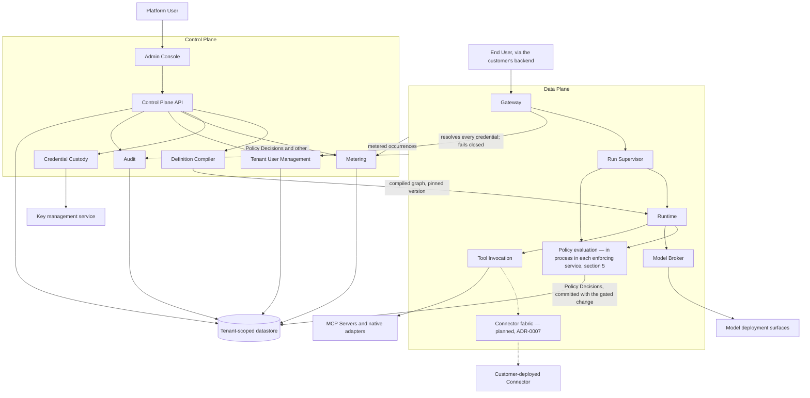

# Containers

The [C4](https://c4model.com) Level 2 view: the deployable pieces inside Orchestra, what each is
responsible for, what it holds, what it calls, and what it must never do.
[`system-context.md`](system-context.md) is the Level 1 view this decomposes.

**This document is informative.** Only [`../30-protocol/`](../30-protocol/) and
[`../40-governance/`](../40-governance/) are normative ([`../README.md`](../README.md) section 3),
so where a rule binds this links rather than restating it. Two copies of a normative rule drift, and
the copy in the informative document is the one that silently wins in someone's memory.

**Orchestra is pre-implementation.** No platform code exists. A container below is a unit of
responsibility with a name and a boundary, not a running service; which of them share a process,
host or release is a deployment question `deployment-topologies.md`, planned in
[`./README.md`](README.md), owns.

## 1. The two planes

[`../GLOSSARY.md`](../GLOSSARY.md) fixes the split and names the principal members of each side. The
**Control Plane** is the administrative surface — agents, workflows, policies, approvals, audit,
connectors, credentials, usage. The **Data Plane** is the execution path — Gateway, Runtime, Policy
Enforcement Points, Model Broker, Connector fabric. This document adds what each member does and
enumerates the containers completely, so two names below are not on the glossary's list: the Run
Supervisor, which [ADR-0014](../adr/adr-0014-run-supervisor-is-orchestras.md) adds, and Tool
Invocation, the path by which a Tool is reached whatever its transport. Audit is the glossary's
*audit* named as the container that keeps it. That is an enumeration
difference, not a second boundary — a container that appears to belong on both sides is still a
naming error.

Both planes are operated by Orchestra
([ADR-0001](../adr/adr-0001-product-shape-multi-tenant-saas.md)). The hybrid shape — hosted control
plane, customer-deployed data plane — appears in ADR-0001's revisit criteria and as option 3 in
[ADR-0007](../adr/adr-0007-outbound-connector-for-enterprise-reachability.md), and is not the
architecture today; no container below is designed for it.

The planes couple in two directions and no more. Definitions and Policies flow into the Data Plane
as compiled, versioned artifacts; facts — Policy Decisions, Audit Records, meter records, Run
state — flow back. Neither is a synchronous dependency of the other, with one exception. A Policy
Decision makes none: it commits in the enforcing service's own transaction and reaches the audit
store through that service's outbox
([ADR-0034](../adr/adr-0034-policy-decisions-commit-with-the-gated-change-and-leave-by-outbox.md)).
Authentication does make one: the Gateway resolves every credential through Tenant User
Management, a Control Plane container, and rejects the request when it cannot
([ADR-0024](../adr/adr-0024-global-person-with-tenant-memberships.md)). Both kinds of traffic take
the shape [ADR-0026](../adr/adr-0026-services-call-over-http-and-publish-through-an-outbox.md) gives
them. A call is an HTTP request under the JSON:API contract, authenticated with the calling
service's own credential. A fact another container reacts to leaves its owner through a
transactional outbox, and Kafka carries it to the containers that consume it, captured from the
outbox by Debezium ([ADR-0029](../adr/adr-0029-kafka-carries-facts-captured-by-debezium.md)).

## 2. Container diagram

Dotted edges rest on **Proposed** ADR-0007 and are not binding.

## 3. The containers

| Container | Plane | Responsibility | Holds | Calls | Must never |
| --- | --- | --- | --- | --- | --- |
| Admin Console | Control | The Platform User's surface: authoring, approvals, audit and usage views | Nothing durable | Control Plane API only | Reach the datastore, the Runtime or a model surface directly |
| Control Plane API | Control | Definition and Policy authoring and publish, Tool Catalog registration and capability grants, Connector enrolment (planned, ADR-0007), Model Binding configuration, approval resolution, usage reads, audit reads by calling Audit, and tenancy administration by calling Tenant User Management | Every tenant-scoped administrative record except those Tenant User Management and Audit own | Datastore, Definition Compiler, Credential Custody, Tenant User Management, Audit | Execute a Run, hold a plaintext credential, keep a copy of a Person's attributes, or read the audit store itself |
| Tenant User Management | Control | Owns Tenants, Workspaces, Persons and Principals, holds administrative grants and group-to-role mappings ([ADR-0032](../adr/adr-0032-administrative-grants-are-orchestra-defined-roles.md)), creates Tenants for Orchestra's provisioning client ([ADR-0031](../adr/adr-0031-tenant-user-management-creates-tenants.md)), and resolves a presented credential to exactly one Principal and one Tenant for the Gateway ([ADR-0024](../adr/adr-0024-global-person-with-tenant-memberships.md)) | The tenant directory, exempt from row-level security and holding routing facts only; tenant profiles, Workspaces, Memberships, Principals, administrative grants and group-to-role mappings under forced row-level security, and global Persons each visible to a Tenant only through its own Membership, all in its own schema | Datastore, Keycloak | Resolve a credential to more than one Principal or Tenant, admit a caller it could not resolve, or hold a credential's secret |
| Definition Compiler | Control | Validates a declarative Agent or Workflow definition, emits an execution graph carrying a Policy Enforcement Point at every Step boundary, and produces the diagnostics an author reads | Compiled graphs, each traceable to its source definition, version and Step identifiers | Nothing outbound; invoked by the Control Plane API | Accept customer code, or emit a graph in which an enforcement point can be suppressed — the compiler's side of [`policy-model.md`](../40-governance/policy-model.md) E2 |
| Credential Custody | Control | Envelope encryption of BYOK model credentials and Tool origin credentials, per-tenant data keys, rotation | Ciphertext and key references | An external key management service | Return plaintext into a log, trace or backup ([ADR-0006](../adr/adr-0006-model-layer-as-credential-broker.md)) |
| Metering | Control | Records the metered dimensions [ADR-0009](../adr/adr-0009-meter-first-defer-tiering.md) fixes, as records carrying the properties it requires; most occurrences arise in the Data Plane, so this container is fed rather than self-observing | Meter records | Datastore | Serve as the audit trail, or bill model tokens — model usage is reported, never billed |
| Audit | Control | Owns the audit store. Consumes Policy Decisions and every other Audit Record from Kafka, captured from the outbox of the service that wrote it ([ADR-0029](../adr/adr-0029-kafka-carries-facts-captured-by-debezium.md), [ADR-0034](../adr/adr-0034-policy-decisions-commit-with-the-gated-change-and-leave-by-outbox.md)), and answers the audit reads the Control Plane API serves, each carrying the completeness horizon it is known complete to ([`../60-operations/observability.md`](../60-operations/observability.md) section 4) | The append-only audit store, in its own schema, under roles holding no update or delete privilege on it ([`../40-governance/audit-model.md`](../40-governance/audit-model.md) A2); the retention period and erasure are its | Datastore | Update or delete a record within its retention period, be written to directly by another container rather than through the fact it published ([ADR-0020](../adr/adr-0020-monorepo-with-enforced-service-boundaries.md) rule B4), or answer a query without saying how far the trail is complete |
| Gateway | Data | The public HTTP and event-stream boundary; authenticates the calling Principal, forwards a Run submission to the Run Supervisor, streams Agent Events | No durable state of its own | Tenant User Management, to resolve a credential; Run Supervisor, to submit a Run | Expose a runtime, model-provider or tool-protocol type, evaluate a Policy, or hold a Run or the record of its admission ([ADR-0034](../adr/adr-0034-policy-decisions-commit-with-the-gated-change-and-leave-by-outbox.md)) |
| Runtime | Data | Executes compiled graphs on an orchestration substrate that supplies durability, checkpointing, interrupts and resume — Orchestra builds none of those. Run supervision is a separate concern and is Orchestra's ([ADR-0014](../adr/adr-0014-run-supervisor-is-orchestras.md), superseding [ADR-0008](../adr/adr-0008-declarative-workflow-definitions.md)). The container is the adapter around that substrate, not the substrate | Run state and Checkpoints, which are the runtime's rather than Orchestra's | Policy evaluation, Model Broker, Tool Invocation | Appear in any public contract, or expose a Checkpoint as an addressable object |
| Run Supervisor | Data | Run lifecycle, leasing work to workers and reclaiming a lease when one disappears, per-Tenant concurrency, scheduling and wake-up, job-level retry and drain ([ADR-0014](../adr/adr-0014-run-supervisor-is-orchestras.md)), built on PostgreSQL ([ADR-0019](../adr/adr-0019-postgres-run-supervisor.md)). **It admits Runs**: the Gateway forwards a submission, and the supervisor evaluates admission in process and commits the Run, or its refusal, with the admission Policy Decision in one transaction ([ADR-0034](../adr/adr-0034-policy-decisions-commit-with-the-gated-change-and-leave-by-outbox.md)) | Run intent, leases and scheduled wake-ups, the submission's `Idempotency-Key` with the Run it created ([`../30-protocol/gateway-api.md`](../30-protocol/gateway-api.md) G11), and each admission Policy Decision until Audit has recorded it — all in its own schema ([ADR-0020](../adr/adr-0020-monorepo-with-enforced-service-boundaries.md) rule B4) | The Runtime, to invoke a compiled graph | Retry a Step Execution — that retry is not the supervisor's to own — or let a Run start before its admission decision has committed ([`policy-model.md`](../40-governance/policy-model.md) D3) |
| Policy evaluation | Data | **A library in every enforcing service, not a deployable unit of its own.** Produces exactly one verdict per enforcement point, over the Policy versions the Run pinned, and writes the Policy Decision in the enforcing service's own transaction | Policy Decisions, until the audit store records them, and the aggregates it reserves | Nothing: it writes in its service's transaction, and that service's outbox carries the decision on ([ADR-0034](../adr/adr-0034-policy-decisions-commit-with-the-gated-change-and-leave-by-outbox.md)) | Be optional at any enforcement point, call a decision service, or read an aggregate another service keeps — see section 5 |
| Model Broker | Data | Resolves a Model Binding to a Deployment Surface, endpoint and credential reference; schedules within the Quota Envelope; normalises invocation and streaming; attempts declared fallbacks in order | No credential material of its own | Credential Custody, tenant-configured model deployment surfaces | Choose a model the definition did not name, or fall back outside the declared order |
| Tool Invocation | Data | Invokes a registered Tool over its origin's transport and returns the result as untrusted content | Nothing durable | MCP Servers, native adapters, and the Connector fabric if ADR-0007 binds | Invoke a Tool no enforcement point cleared, or let the transport change the Tool's identity |
| Connector fabric | Data | **Planned.** Terminates the outbound session a customer-deployed Connector establishes, and multiplexes Tool traffic over it | Connector enrolment and health state | The customer's Connector, over its own tunnel | Be assumed to exist — ADR-0007 is **Proposed** |

*Holds* means logical ownership of records, not a private database per container: every
tenant-scoped record lives in one logical datastore under
[ADR-0011](../adr/adr-0011-tenant-isolation-shared-schema-rls.md), per section 8.

## 4. The compiler is Orchestra's; the runtime is a compilation target

Customers author declarative definitions and Orchestra compiles them
([ADR-0008](../adr/adr-0008-declarative-workflow-definitions.md)). The compiler is Orchestra's own
component with its own correctness burden — validation, diagnostics, and golden tests from
definition to expected graph. What it emits is a build output: never a customer-facing artifact, and
the orchestration runtime it targets is never named in an API, schema, SDK or customer-facing
document ([ADR-0005](../adr/adr-0005-langgraph-as-compilation-target.md)).

Two container-level consequences follow. The Runtime consumes the compiled graph rather than the
definition, so the graph must carry the pinned definition version and Step identifiers back to
source — ADR-0005 records the debugging cost of compiling, and this pays it. And substitution stays
a compiler change only while every point of contact with the substrate sits inside the Definition
Compiler and one adapter within the Runtime container. That adapter is the seam ADR-0005's own
mitigation rests on: it is the Runtime's only contact with the substrate, and a second container
that knows what the substrate is has silently repriced the substitution.

## 5. Policy enforcement is a place, not a container

A Policy Enforcement Point is a place in the execution path
([`../20-domain/domain-model.md`](../20-domain/domain-model.md) section 6), and the compiler emits
one at every Step boundary rather than a convention placing them there
([`../40-governance/policy-model.md`](../40-governance/policy-model.md) E1–E2). *Enforcement* is
therefore inside the Run Supervisor at admission and inside the Runtime at every Step boundary and
before every Tool invocation, by construction. The Gateway forwards a submission and evaluates
nothing
([ADR-0034](../adr/adr-0034-policy-decisions-commit-with-the-gated-change-and-leave-by-outbox.md)).
There is no container to draw for enforcement, and no container that can decide not to consult it.

*Evaluation* runs there too: as a library call inside each enforcing service, over the Policy
versions the Run pinned, and never as a separate container those services call. `policy-model.md`
registered the question and named this section as its home, and three things settle it.

- A Run pins its Policy versions at admission for the life of the Run
  ([ADR-0012](../adr/adr-0012-policy-decisions-are-audit-records.md)), so an evaluator reads the
  versions the Run pinned, never the current ones.
- A Policy Decision must be durable before the gated action is attempted, and durable does not mean
  remote ([ADR-0013](../adr/adr-0013-fail-closed-policy-decision-writes.md)). It commits in the
  enforcing service's own transaction with the state change it gates, and reaches the audit store
  through that service's outbox
  ([ADR-0034](../adr/adr-0034-policy-decisions-commit-with-the-gated-change-and-leave-by-outbox.md)),
  so the write is in process as well.
- Evaluation is a pure function of its supplied inputs, because a Policy reads only
  platform-defined aggregates, each reserved in the transaction that writes its decision
  ([ADR-0035](../adr/adr-0035-cel-profile-for-policies-and-workflow-expressions.md)).

The third was why this document waited: the location question sat downstream of the
policy-language decision. With that decision taken, evaluation needs no datastore access of its
own, so the location needed no ADR of its own, and it is recorded here and in
[`data-plane.md`](data-plane.md) section 5.

This is also the one place where a governed action waits on a durable write: under the fail-closed
rule, the availability of the datastore an enforcing service commits to bounds that of every
governed action it gates. It does not couple the planes. The audit store a decision reaches
afterwards bounds how current the trail reads, not whether an action proceeds. ADR-0013 states the
cost and accepts it.

## 6. The Model Broker brokers; it does not route

ADR-0006 removed capability-based selection, preference routing and cost optimisation from scope.
What remains is a broker: an Agent version or a Step names a Model Binding, the broker resolves it
to a Deployment Surface, an endpoint and a credential reference, and invokes it. Fallback is a
declared ordered list, not a judgement the broker makes for the tenant.

Two properties make it a container rather than a library. Quota-aware scheduling is admission
control against each Binding's Quota Envelope: under BYOK the tenant's limit is a steady-state
capacity ceiling rather than an exceptional failure, and the delay is surfaced rather than hidden
([ADR-0006](../adr/adr-0006-model-layer-as-credential-broker.md)). Normalising invocation and
streaming keeps provider-native formats out of every contract above it.

The retry rule is the sharp edge. A failed model call is safe to retry; a call that may already
have produced a side effect is not. The broker is on the safe side by construction, which is why the
line is drawn at Tool Invocation and not here.

## 7. Tool Invocation, and the Connector fabric as planned work

Tool Invocation is required whatever becomes of ADR-0007: a Tool reaches Orchestra through an MCP
Server or a native adapter, exactly one origin per Tool
([`../20-domain/domain-model.md`](../20-domain/domain-model.md) section 5). Registration in the Tool
Catalog grants nothing, and this container invokes only what an enforcement point cleared
([`../40-governance/tool-authorization.md`](../40-governance/tool-authorization.md)).

The **Connector fabric is planned, not settled.** ADR-0007 is **Proposed** and binds only after
design-partner validation. Its architectural claim is that reachability is a transport concern:
direct HTTPS or multiplexed tunnel, the Tool is the same Tool and everything above is unchanged. If
ADR-0007 is rejected the fabric disappears, Tool Invocation talks only to publicly reachable
origins, and nothing else in section 2 moves — which is the argument for drawing the seam now.

The customer-deployed Connector is not Orchestra's container. It runs inside the customer's network,
cannot be force-upgraded, and is `connector.md`'s subject, planned in [`./README.md`](README.md).

## 8. Stores

There is one logical tenant-scoped datastore. Isolation is by shared schema with row-level security
enforced by the engine rather than by application code, and CI failing a tenant-scoped table that
lacks a forced policy is the load-bearing control
([ADR-0011](../adr/adr-0011-tenant-isolation-shared-schema-rls.md));
[`multi-tenancy.md`](multi-tenancy.md) specifies the mechanism.

**The datastore engine is PostgreSQL**
([ADR-0021](../adr/adr-0021-postgresql-is-the-datastore.md)), chosen against the capabilities
[`multi-tenancy.md`](multi-tenancy.md) sets out. Of the two places the engine matters most, what
satisfies ADR-0013's durable decision write is decided — a transaction in the enforcing service's
own schema, then its outbox (ADR-0034) — and the query shape audit reconstruction needs under
ADR-0012 is still open, against a known engine.

Any store outside that datastore must be tenant-scoped explicitly;
[`../40-governance/threat-model.md`](../40-governance/threat-model.md) T4 enumerates the classes,
states the requirement and records that no inventory of them exists. The enumeration stays there
rather than here, so that two copies of it cannot drift apart.
[`multi-tenancy.md`](multi-tenancy.md) assigns that inventory to whichever document introduces each
store, so **two of them are this view's contribution and the list stays open.** Credential Custody
holds key material in an external key management service, which holds no tenant records. The
Runtime's checkpoint storage does hold tenant-scoped Run state while Orchestra models nothing of it
(domain model I6) — the exact case T4 covers and row-level security does not reach.

One further candidate is conditional, and is not counted above. The durable Policy Decision write
introduces no store of its own: a decision waits in the enforcing service's schema under forced
row-level security and leaves through the Kafka topics [`multi-tenancy.md`](multi-tenancy.md)
section 8 registers (ADR-0034). Nor is the audit store outside this datastore — it is the Audit
container's own schema within it, held under roles with no update or delete privilege on it
([`../40-governance/audit-model.md`](../40-governance/audit-model.md) A2). Whether the Run event
stream is backed by a store depends on the replay design section 12 registers, which rests on
**Proposed** ADR-0004.

**The tenant directory is an ordering problem.** Whichever container authenticates a caller resolves
it to a Tenant before any tenant context exists, so a directory record identifies a Tenant rather
than belonging to one and cannot be filtered by the requester's context. That much follows from
ADR-0011. It lives in Tenant User Management's own schema, and the Gateway and the Control Plane API
call that service rather than reading the table
([ADR-0024](../adr/adr-0024-global-person-with-tenant-memberships.md)).

## 9. The language boundary

ADR-0005 records that the Runtime is Python while the control plane and protocol tooling are
TypeScript, and that the boundary between them is a **versioned internal contract that must be
documented as one.** It has not been. Read ADR-0005's *control plane* there as the TypeScript
implementation stack rather than the glossary's Control Plane: this is a language boundary, and it
does not have to follow the plane split — the Definition Compiler is a Control Plane container
whichever language it is written in.

That is a gap rather than a formality. [`../VERSIONING.md`](../VERSIONING.md) enumerates nine
versioned artifacts and this contract is not among them, so it has no compatibility rule, no
deprecation path and no owner. Two questions answer together and section 12 registers both: which
side the Definition Compiler sits on — TypeScript, emitting a runtime-neutral artifact, or Python,
next to the Runtime — and what crosses the boundary.

## 10. What is deliberately not a container

- **A checkpoint store.** Checkpointing is a library mechanism inside the Runtime container,
  persisting to Orchestra's own datastore
  ([ADR-0016](../adr/adr-0016-compile-to-the-langgraph-library.md)), not a store of its own. A
  Checkpoint is not addressable, not versioned by Orchestra, and not in any public contract (domain
  model I6).
- **A model router.** Removed from scope by ADR-0006.
- **A workflow engine.** The runtime library is the execution substrate
  ([ADR-0016](../adr/adr-0016-compile-to-the-langgraph-library.md)). What Orchestra adds over it is
  a compiler and a run supervisor ([ADR-0014](../adr/adr-0014-run-supervisor-is-orchestras.md)), not
  an engine of its own.
- **A per-tenant deployment.** ADR-0011 chose shared schema. The promotion path for a single Tenant
  is designed for and not built, and it is a topology question rather than a container.
- **A bespoke Admin Console.** Front-end surfaces duplicate the template in
  [`../../ui-template/README.md`](../../ui-template/README.md), a starting point, not a product.

## 11. Where this shape is weak

- **The datastore is a hard dependency of execution.** ADR-0013's fail-closed rule is deliberate
  and correct, and under ADR-0034 it means an outage of the datastore an enforcing service commits
  to stops every governed action that service gates. The audit store behind the outbox is not on
  that path: its outage leaves the trail behind rather than stopping work.
- **The Definition Compiler is a single point of correctness.** A compiler defect produces subtly
  wrong execution that policy then faithfully permits, because the emitted graph is what policy is
  enforced over. ADR-0005 mitigates with golden tests and retained snapshots — a practice, not a
  structure.
- **Tenant isolation rests on one control at one layer.** Row-level security covers the datastore
  and nothing else, so every container keeping state outside it reopens what ADR-0011 closed.
- **A container-shaped hole sits in the Data Plane.** The Connector fabric rests on a Proposed ADR;
  if it binds, its failure modes — offline, tunnel drop mid-call, version skew — enter a reliability
  model that does not yet exist.
- **None of this has been built.** Every boundary is a claim about a system that does not run.

## 12. Open questions

**ADR** means the choice is costly to reverse or spans components and must be recorded as an ADR
before implementation. **Document** means a later document suffices.

| Question | Needs | Decided by |
| --- | --- | --- |
| The Connector's share of the egress allow-list | **ADR** | [ADR-0038](../adr/adr-0038-egress-proxy-on-a-per-tenant-allow-list.md) settles the shape for the Model Broker and Tool Invocation: a per-tenant list derived from Model Binding endpoints and registered Tool origins by scheme, host and port, enforced at an egress proxy that is their one outbound route and that is the stable egress identity a customer allow-lists. The posture was never open — [`../40-governance/threat-model.md`](../40-governance/threat-model.md) T6 binds it normatively. Those two container boundaries are this document's contribution and are now fixed; `connector.md` cannot settle its own share while ADR-0007 is **Proposed** |
| Which side of the language boundary the Definition Compiler sits on, and what artifact crosses it | **ADR** | [`data-plane.md`](data-plane.md) section 11, which carries the analysis of both candidates, with ADR-0005 behind it. This view names the container; it does not decide the side. It fixes where every point of contact with the substrate lives, which is the substitution argument the boundary exists to protect |
| How the control-plane-to-runtime internal contract is versioned and deprecated | Document | [`../VERSIONING.md`](../VERSIONING.md), which enumerates nine artifacts and does not include this one, though ADR-0005 requires it be documented as a versioned contract |
| How long the Kafka topics that carry facts between services keep them, and how far a capture connector's replication slot may lag | Document | [`../60-operations/reliability.md`](../60-operations/reliability.md), with [ADR-0029](../adr/adr-0029-kafka-carries-facts-captured-by-debezium.md), when the first event type and its consumer are built. Retention must cover the longest a consumer may be down, and the lag bound decides how much write-ahead log a stalled connector may hold. The event contracts themselves belong in [`../30-protocol/schemas/`](../30-protocol/schemas/) |
| Whether the Connector fabric is a container at all | **ADR** | ADR-0007's validation steps. Until it binds, section 7 is planned work and the dotted edges in section 2 are provisional |
| Which container emits each Audit Record that is not a Policy Decision, and where the write path ADR-0013 permits to degrade lives | Document | [`../40-governance/audit-model.md`](../40-governance/audit-model.md) fixes the record classes and requires that a degraded period be visible; `reliability.md` in [`../60-operations/`](../60-operations/) owns how it is signalled. Where they land is no longer open — Audit records them all, section 3 — and the enforcing services emit the Policy Decisions; the emitter of each other class is this view's to name as its act is specified |
| How an enforcing service learns that the Audit container has recorded a decision it is keeping, and what then removes that copy | Document | This document with [`../40-governance/audit-model.md`](../40-governance/audit-model.md) and [`../60-operations/reliability.md`](../60-operations/reliability.md) sections 10 and 13. [ADR-0034](../adr/adr-0034-policy-decisions-commit-with-the-gated-change-and-leave-by-outbox.md) fixes only that nothing is removed before the audit store has it |
| Which containers are separately deployable, and which share a process or a release | Document | `deployment-topologies.md`, planned in [`./README.md`](README.md). Nothing here is a service count |
| The complete inventory of stores outside the row-level-secured datastore | Document | Accumulates as each document introduces a store; section 8 contributes the two this view introduces, and [`multi-tenancy.md`](multi-tenancy.md) owns the scoping rule the inventory is checked against. ADR-0013's durable decision write adds none ([ADR-0034](../adr/adr-0034-policy-decisions-commit-with-the-gated-change-and-leave-by-outbox.md)) |
| What the Gateway emits on the Run event stream, and how replay reaches a disconnected client | Document | [`../30-protocol/`](../30-protocol/); rests on ADR-0004, **Proposed**, whose validation step 2 is outstanding |
| Whether the Model Broker's Quota Envelopes are declared, discovered from the surface, or both | Document | The quota design ADR-0006 calls for, with [`../60-operations/`](../60-operations/) |

Neither of the two that gated other work still does. The allow-list's shape is settled for both
container boundaries by
[ADR-0038](../adr/adr-0038-egress-proxy-on-a-per-tenant-allow-list.md), which leaves the connector's
share alone, and evaluation location, which sat underneath the governance section's
implementability, is settled in section 5. The engine decision that used to lead this list, and
gated every T4 control, is now [ADR-0021](../adr/adr-0021-postgresql-is-the-datastore.md).
