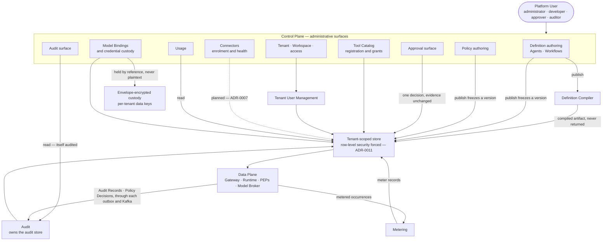

# Control Plane

## 1. Standing and scope

This document is **informative**: only [`../30-protocol/`](../30-protocol/) and
[`../40-governance/`](../40-governance/) are normative ([`../README.md`](../README.md) section 3),
so where a rule binds it is linked rather than restated — a second copy drifts, and the copy is the
one people read. Nothing here is built: the platform is pre-implementation and pre-customer, and
[`../../ui-template/README.md`](../../ui-template/README.md) is a starting point rather than a
running product. Read every "does" below as "is intended to do".

## 2. What the Control Plane is

[`../GLOSSARY.md`](../GLOSSARY.md) fixes it: *the Orchestra-operated administrative surface —
agents, workflows, policies, approvals, audit, connectors, credentials, usage. What the customer's
platform team buys.* The **Data Plane** is the execution path — Gateway, Runtime, Policy Enforcement
Points, Model Broker, Connector fabric — and is [`data-plane.md`](data-plane.md)'s subject. The
split is by responsibility, not by process; [`containers.md`](containers.md) fixes what runs where.

That definition names the principal surfaces rather than exhausting them: section 4 enumerates two
more administered here — tenancy and access, and the Tool Catalog, itself a glossary term as the
tenant-scoped registry of Tools. Reconciling the enumeration is [`../GLOSSARY.md`](../GLOSSARY.md)'s
to do; nothing below claims the definition already lists them.

[ADR-0003](../adr/adr-0003-governance-layer-positioning.md) makes this a first-class product surface
with its own architecture document, and records that it was **absent from v0.1 entirely**. That
absence is the point: the buyer's questions in that ADR — who may use this agent, which capabilities
it holds, who approved this action, on what evidence, at what cost, how it is stopped — are answered
here. The runtime executes; this is where a person configures, decides and looks. The user is the
**Platform User**, the seat-billable identity
([ADR-0009](../adr/adr-0009-meter-first-defer-tiering.md)), in the four roles
[`../00-overview/personas.md`](../00-overview/personas.md) separates — administrator, developer,
approver, auditor. End Users never reach it.

## 3. The surfaces, and the containers that serve them

This is a view of what a Platform User works with, **not a C4 Level 3 decomposition**:
[`containers.md`](containers.md) gives the Control Plane six containers, and the surfaces below cut
across them rather than sitting inside any one. The mapping after the diagram is what makes each
surface traceable to the containers above it.

The dotted edge rests on **Proposed**
[ADR-0007](../adr/adr-0007-outbound-connector-for-enterprise-reachability.md) and is not binding.
The Definition Compiler, Metering, Tenant User Management and Audit are Control Plane *containers*
rather than surfaces; they are drawn because a surface's writes or reads pass through them, and
metered occurrences and Audit Records both arise in the Data Plane while a Control Plane container
records them.

| Surface | Served by, per [`containers.md`](containers.md) section 3 |
| --- | --- |
| Agents and Workflows | Admin Console → Control Plane API → Definition Compiler at publish |
| Policies and Approvals | Admin Console → Control Plane API |
| Tenant and access | Admin Console → Control Plane API → Tenant User Management, which owns Tenants, Workspaces, Persons and Principals ([ADR-0024](../adr/adr-0024-global-person-with-tenant-memberships.md)) and holds administrative grants and group-to-role mappings ([ADR-0032](../adr/adr-0032-administrative-grants-are-orchestra-defined-roles.md)) |
| Audit | Admin Console → Control Plane API → Audit, the container that owns the audit store ([ADR-0034](../adr/adr-0034-policy-decisions-commit-with-the-gated-change-and-leave-by-outbox.md)) |
| Usage | Admin Console → Control Plane API, reading what Metering wrote |
| Tool Catalog and Connectors | Admin Console → Control Plane API; the Connector fabric it enrols is a **planned** Data Plane container |
| Credentials and Model Bindings | Admin Console → Control Plane API → Credential Custody |

## 4. The ten surfaces

Nine are settled scope. The tenth — a Connector administration surface — exists only if **Proposed**
[ADR-0007](../adr/adr-0007-outbound-connector-for-enterprise-reachability.md) binds, which
section 10 takes and section 13 registers.

| Surface | What a Platform User does | Reads and writes | Constrained by |
| --- | --- | --- | --- |
| Agents | Author, publish, set current, retire | Writes Drafts and frozen versions; reads the version set and its Runs | [VERSIONING](../VERSIONING.md) W1–W4, [ADR-0008](../adr/adr-0008-declarative-workflow-definitions.md) |
| Workflows | The same, over a graph of Steps | The same, plus a compiled artifact retained but never returned | [ADR-0005](../adr/adr-0005-langgraph-as-compilation-target.md), [ADR-0008](../adr/adr-0008-declarative-workflow-definitions.md) |
| Policies | Author and publish rules; never edit a live one | Writes Drafts and frozen versions; reads the decisions each produced | [ADR-0012](../adr/adr-0012-policy-decisions-are-audit-records.md), [`policy-model.md`](../40-governance/policy-model.md) |
| Approvals | Decide a request on its Evidence Set | Reads the request; writes exactly one decision | [`approval-workflows.md`](../40-governance/approval-workflows.md); its rendering rests on [ADR-0010](../adr/adr-0010-a2ui-genui-interchange.md) — **Proposed** |
| Audit | Query the trail; export it | Reads only — and the read produces a record | [`audit-model.md`](../40-governance/audit-model.md) sections 8 and 12 |
| Tool Catalog | Register and re-register a Tool; grant and revoke an Agent's or a Workflow's capability | Writes registrations and grants — two acts, audited separately | [`../20-domain/domain-model.md`](../20-domain/domain-model.md) I5, [`tool-authorization.md`](../40-governance/tool-authorization.md) TA1–TA3 and TA19–TA26 |
| Connectors | *If ADR-0007 binds*: enrol, revoke, watch health | Writes enrolment; reads health and version skew | [ADR-0007](../adr/adr-0007-outbound-connector-for-enterprise-reachability.md) — **Proposed**, so whether this surface exists at all is section 13 |
| Credentials | Register, rotate, revoke — never view | Writes by reference; no read path to any Principal | [ADR-0002](../adr/adr-0002-enterprise-segment-and-byok.md), [`threat-model.md`](../40-governance/threat-model.md) T5, [`identity-and-access.md`](identity-and-access.md) section 10 |
| Usage | Read metered dimensions and token attribution | Reads only | [ADR-0009](../adr/adr-0009-meter-first-defer-tiering.md) |
| Tenant and access | Administer Tenants, Workspaces, Principals | Writes; every write is a governed act | [ADR-0011](../adr/adr-0011-tenant-isolation-shared-schema-rls.md), [`identity-and-access.md`](identity-and-access.md) |

Every act above is audited: [`audit-model.md`](../40-governance/audit-model.md) section 3 names
publish, retire, grant, revoke, enrol, credential access and Platform User authentication as facts
that MUST produce an Audit Record.

## 5. Definition authoring — Agents and Workflows

The unit of work is a version, not a document: `Draft → Published → Active → Retired → Archived`,
drawn in [`../20-domain/lifecycle-state-machines.md`](../20-domain/lifecycle-state-machines.md)
section 4. Publication freezes the version, setting it current is a separate act, retirement drains
rather than kills, and in-flight Runs are never migrated. Authoring is schema-first and reviewed as
code; [ADR-0008](../adr/adr-0008-declarative-workflow-definitions.md) rules out a visual designer at
MVP. Publication records the acting Principal, the frozen definition and the compiled artifact —
which the audit surface never returns, since that would leak the orchestration runtime into a
customer-facing contract ([ADR-0005](../adr/adr-0005-langgraph-as-compilation-target.md) with
[`audit-model.md`](../40-governance/audit-model.md) A8).

Publication is also where the **Definition Compiler** runs — the Control Plane container
[`containers.md`](containers.md) names, which validates the definition and emits the execution graph
carrying an enforcement point at every Step boundary. That artifact is what publication hands to the
Runtime, and it stays internal at both ends: the author's contract is the declarative definition,
and the graph is an implementation detail the audit surface does not return. Which side of the
implementation-language boundary the compiler itself sits on is not this document's to take — it is
registered **ADR** in [`data-plane.md`](data-plane.md) section 11 and
[`containers.md`](containers.md) section 12, and section 13 repeats it.

Three consequences land here. **"What is live" has no single answer**, because a superseded version
still governs every Run pinned to it, so the surface shows a set of versions and their in-flight
populations. **A Retired version can stay undrainable indefinitely**, since a Run can suspend at an
approval for an unbounded time and a version cannot be archived while a version naming it is
unarchived ([ADR-0041](../adr/adr-0041-nested-versions-execute-inside-the-parent-run.md)); a
force-drain is cancellation of every Run pinned to the version and nothing else, settled by
`execution-semantics.md` X6 in [`../50-workflows/`](../50-workflows/). And **staleness signals are
assigned here by name** — a Tool's MAJOR schema bump surfaces as a control-plane warning
([VERSIONING](../VERSIONING.md) W5), and so does a published version naming an Agent or Workflow
that has moved on (W6), while a Connector below the minimum supported protocol version raises a
control-plane alert (section 9 there).

## 6. Policy authoring, and the friction ADR-0012 assigned here

A Policy is administered configuration authored by a Platform User through this surface — not code
and not prompt text ([`policy-model.md`](../40-governance/policy-model.md) P1).
[ADR-0012](../adr/adr-0012-policy-decisions-are-audit-records.md) makes Policies immutably versioned
on the same terms as a Workflow, so **editing a live Policy is not possible**: editing means
publishing a new version, and a Run pins the versions in force at admission for life. Authoring
gains a publish step and section 5's set-versus-latest problem. ADR-0012 names the resulting risk —
*publish friction pushes authors toward over-broad Policies* — and assigns it here rather than
weakening immutability. Taking the assignment:

**The cost does not stay on this surface.** An author who finds publication expensive writes one
broad rule instead of several narrow ones, and a broad `require_approval` is the volume
[`threat-model.md`](../40-governance/threat-model.md) T8 turns into approval fatigue — an approver
who approves everything, leaving a record indistinguishable from genuine review. An authoring
annoyance arrives as a governance failure two surfaces away.

**What is available without touching immutability.** The lifecycle already supplies a `Draft`, so
iteration before publication is free; the expensive part is the author's uncertainty about what a
rule will do once it governs. Two things reduce that from records already kept: the decision volume
and verdict mix a published version has produced, and the Workspace scope, which makes a narrow
Policy cheap to own. A third — evaluating a Draft against recorded inputs before publication — is
the obvious answer, is **not decided**, and carries an edge this document cannot settle, since a dry
run governs nothing while [`audit-model.md`](../40-governance/audit-model.md) A6 requires the
component that took a decision to write the record. Section 13.

## 7. The approval surface

[ADR-0010](../adr/adr-0010-a2ui-genui-interchange.md) is **Proposed** and binding on nothing: it
defers the general generative-UI catalog and keeps a **schema-validated approval surface in the
first slice**, judging it the more compelling demonstration for this segment. On that reading it is
the one agent-facing rendering problem this plane would own at MVP, and the reading is a proposal
until the ADR's validation is done. A request carries five parts, fixed by
[`approval-workflows.md`](../40-governance/approval-workflows.md) section 3: the proposed action as
it would execute, the Evidence Set, the Approval Chain, the resolution, and the causing Policy
Decision by version. The Evidence Set is what the surface exists to present — the exact inputs the
Agent relied on, so a human decides on the same information the model had rather than on the model's
summary of it. Rules E1, E2, E5 and E6 constrain presentation directly: inputs rather than
descriptions, the Agent's own argument labelled as model-generated, each item's provenance shown
with the item, truncation visible and the untruncated content retrievable. A surface that renders a
tidy summary satisfies none of them, and produces an Audit Record attesting to a review that could
not have worked.

**A registered question, answered.** `approval-workflows.md` section 10 asks whether
time-to-resolution and per-Policy approval rate are surfaced to a Tenant administrator, calling it a
product decision rather than an instrumentation one. They are surfaced here: ADR-0009 already meters
Approvals raised and resolved and [`audit-model.md`](../40-governance/audit-model.md) A4 requires a
timestamp on every record, so both fall out of records that exist either way — and a Policy whose
requests are approved without exception is either correctly scoped or not a control at all, a
difference only this surface can show a person.

Two things rest on that **Proposed** ADR. The schema has no home — validation step 2, *confirm the
approval surface is expressible without extension*, is outstanding and was never attempted — and
*approval surface* is not yet a [`../GLOSSARY.md`](../GLOSSARY.md) term, which
`approval-workflows.md` registers on its side. This document names it as a Control Plane surface and
describes it; the presentation rules stay with that normative document, and the schema belongs with
`ui-protocol.md` in [`../30-protocol/`](../30-protocol/).

## 8. Audit

Audit is a **product surface, not a log level** ([`../GLOSSARY.md`](../GLOSSARY.md)), readable by
the Tenant's own Platform Users and not only by the platform operator
([`audit-model.md`](../40-governance/audit-model.md) section 8). For any Run it returns every Policy
Decision, every Approval Request and its resolution, the pinned definition version, every Tool
invocation with its Side-Effect Class, and the Principal for each — ADR-0003's list of buyer
questions turned into a query. Because a Policy Decision is a class of Audit Record
([ADR-0012](../adr/adr-0012-policy-decisions-are-audit-records.md)) that is one store rather than
two, at the cost ADR-0012 accepted: this surface resolves Policy version references to reconstruct a
trail, and a Policy version outlives the records naming it.

Three properties shape the surface rather than the store. **A read is itself an audited action**,
and the recursion terminates — the record of a read is an ordinary record. **The compiled artifact
is never returned**, per section 5. And **the surface is behind the truth**:
[ADR-0013](../adr/adr-0013-fail-closed-policy-decision-writes.md) fixes that a Policy Decision is
durable before the gated action, and
[ADR-0034](../adr/adr-0034-policy-decisions-commit-with-the-gated-change-and-leave-by-outbox.md)
makes it durable in the enforcing service's own transaction and readable here only once that
service's outbox has delivered it to the **Audit** container, which owns the store this surface
reads through ([`containers.md`](containers.md) section 3). *No record* cannot be read as *nothing
happened* without knowing
how far the trail is complete, which the completeness horizon of `observability.md` in
[`../60-operations/`](../60-operations/) carries with every answer.

**Export is a requirement with no design.** A Tenant must be able to obtain its own records; an
audit surface without export reads as lock-in to a compliance reviewer (section 12 there). Format,
transport and completeness proof are open, and continuous forwarding into a customer SIEM rather
than on-demand export is its own decision, since it makes Orchestra an upstream system in that
customer's compliance chain. Who may read audit, and who may read an Evidence Set, is
settled by derivation in [`identity-and-access.md`](identity-and-access.md) section 6 — a separate
and narrower grant for the Evidence Set than for the audit surface — and binds once
[`audit-model.md`](../40-governance/audit-model.md) carries the rule.

## 9. Credentials and Model Bindings

Under [ADR-0002](../adr/adr-0002-enterprise-segment-and-byok.md) the customer supplies the model
credential and Orchestra custodies it under KMS-backed envelope encryption with per-tenant data
keys, held **by reference**: no plaintext is an attribute of any entity, in any store, log, trace or
backup. [`threat-model.md`](../40-governance/threat-model.md) T5 reads a screen as no exception — a
support tool that renders a credential is the same finding as a log that captures one — so this
surface writes, rotates and revokes, and does not display. **Nor is there a read-back path.**
[`identity-and-access.md`](identity-and-access.md) section 10 settles custody as write-only with
respect to every Principal, reading ADR-0002's *audited access paths* as the Model Broker's decrypt
at invocation — a use, not a caller-facing read. Nothing on this surface returns credential
material in any form, and the rule binds once
[`threat-model.md`](../40-governance/threat-model.md) T5 carries it, which that document names as
its home and still holds open. The one hole left is whether an operator break-glass decrypt exists,
registered in [`identity-and-access.md`](identity-and-access.md) rather than here.

The surrounding record is the **Model Binding** — deployment surface, endpoint, credential
reference, the customer's own model identifier, declared limits
([ADR-0006](../adr/adr-0006-model-layer-as-credential-broker.md)). There is no router to configure
and no Provider entity to pick: selection is explicit with an ordered fallback list, because under
BYOK a Tenant enables a small fixed set of deployments through procurement. Rotation and revocation
happen without changing any definition, and both are audited. Each binding carries one **Quota
Envelope**, a steady-state capacity ceiling rather than an exceptional failure, so a stall shown in
usage and a limit set on a binding are one conversation across two screens; whether an envelope is
declared, discovered, or both, is undecided.

## 10. Tool Catalog and Connectors

Registration is not permission: a Tool existing in a Tenant's Catalog and an Agent or a Workflow
being permitted to call it are two relationships, two administrative acts, audited separately
([`../20-domain/domain-model.md`](../20-domain/domain-model.md) I5,
[`tool-authorization.md`](../40-governance/tool-authorization.md)).
[ADR-0042](../adr/adr-0042-declared-tools-and-capability-grants.md) fixes the second act's shape. A
version declares the Tools it may call, and publication freezes that ceiling; a capability grant
names the Agent or Workflow and one registered Tool, and a revocation made here takes effect at the
next Tool enforcement point, Runs in flight included. The surface therefore administers grants
against definitions, never against versions. Grant syntax stays with the schema work
[`../30-protocol/gateway-api.md`](../30-protocol/gateway-api.md) section 8 lists.

**A registration is Tenant-scoped, and a Workspace narrows only which Tools a grant may name.** The
Catalog is tenant-scoped ([`../GLOSSARY.md`](../GLOSSARY.md)), and a Tool registration carries no
Workspace reference, as a component catalog registration carries none
([`../30-protocol/ui-protocol.md`](../30-protocol/ui-protocol.md) CC1). Delegated administration
gets its Workspace control where [`identity-and-access.md`](identity-and-access.md) section 8 puts
it: a Workspace narrows which Tools an administrator delegated to it may name in a capability grant,
checked when the grant is authored and never at an enforcement point
([`tool-authorization.md`](../40-governance/tool-authorization.md) TA4 and TA26). A registration
narrower than the grants naming it would decide nothing on its own, and
[`policy-model.md`](../40-governance/policy-model.md) P2 already gives the shape a Workspace
reference would take, so adding one later is additive under [VERSIONING](../VERSIONING.md) R2.

**A registered question, answered by derivation.** That document's section 10 asks whether a
registered Tool's Side-Effect Class may be changed once grants exist, and names the Control Plane
specification as its decider. It may not be changed in place. TA9 makes the registered value
authoritative at evaluation and forbids its being influenced at invocation time, Policy keys on it,
and every governed input is pinned for the life of a Run — [VERSIONING](../VERSIONING.md) W2 and W5
for definitions and Tool schemas, ADR-0012 for Policies. An in-place edit would change what a Run in
flight is governed by, with no new version for a record to name and nothing in the trail showing the
swap: the failure the pinning rules exist to prevent, arriving through a field nobody versioned. The
change is therefore a re-registration producing a new registered record, audited like any other
administrative act, and `tool-authorization.md` TA23 carries the rule. What happens to *existing
grants* is [ADR-0042](../adr/adr-0042-declared-tools-and-capability-grants.md)'s: they stop
satisfying, are retained and unsatisfiable, surface as a staleness warning beside the one
`execution-semantics.md` X30 requires, and must be granted again, because a grant is consent to the
Tool as it was classed.

The **Connector** half rests on
[ADR-0007](../adr/adr-0007-outbound-connector-for-enterprise-reachability.md), **Proposed** and
binding only after design-partner validation: a planned component, not settled architecture. If
validation goes the other way it reduces to registering MCP Servers reachable over direct HTTPS and
nothing else here changes — the point of keeping reachability as an axis separate from registration
and grant. As planned it covers enrolment and credential issue, revocation, and the health states in
[`../20-domain/lifecycle-state-machines.md`](../20-domain/lifecycle-state-machines.md) section 5:
revocation reaches every non-terminal state, and a Connector outside the supported version window is
refused loudly with an alert here rather than silently degraded, because a silently degraded
security boundary is worse than an offline one. What separates `Degraded` from `Healthy` is
undecided and belongs to `connector.md`, planned in [this section](README.md).

## 11. Usage

[ADR-0009](../adr/adr-0009-meter-first-defer-tiering.md) fixes the dimensions: Platform Users, End
Users, Runs, Step Executions, active Agents and Workflows, Connectors, Approvals, Tool invocations
by Side-Effect Class, and model usage. **Model token usage is reported to the customer and never
billed** — under BYOK the tokens are already the customer's, so visibility is the feature and cost
attribution by department, agent and workflow is the product. "Department" maps onto **Workspace**,
the only subdivision of a Tenant the domain model has; attribution beyond the metered dimensions
does not exist.

There is no tier builder and no self-serve packaging — early contracts are priced by hand — so this
reports rather than bills, read alongside an invoice produced elsewhere. Meter records are
reconcilable against the audit log by design under
[ADR-0009](../adr/adr-0009-meter-first-defer-tiering.md), and
[`audit-model.md`](../40-governance/audit-model.md) section 7 fixes what each side must carry for
that join to exist — which is what a customer disputing an invoice ultimately draws on. Whether the
reconciliation is a tenant-readable view on this surface or an operator-assisted procedure is not
decided, and neither is the identifier the join needs. Section 13.

The seat sits here too, and its wording is now clean:
[ADR-0039](../adr/adr-0039-seats-count-platform-users.md) supersedes ADR-0009 so that the metered
dimension counts *distinct Platform Users authenticating to the Control Plane*, which is what
[`../GLOSSARY.md`](../GLOSSARY.md) has always called the seat-billable identity. A Platform User
authenticating here is therefore a billing event; a Service Account authenticating is measured on a
dimension of its own and never billed, and a Platform Operator is never a seat.

## 12. Tenancy, the operator boundary, and how the front end is built

Control Plane records are tenant-scoped like every other record
([`../20-domain/domain-model.md`](../20-domain/domain-model.md) I1), and isolation is enforced by
forced row-level security in the datastore rather than by this surface's queries
([ADR-0011](../adr/adr-0011-tenant-isolation-shared-schema-rls.md)), in a datastore that is
PostgreSQL ([ADR-0021](../adr/adr-0021-postgresql-is-the-datastore.md)). A Workspace scopes
administration and visibility, never isolation
([`policy-model.md`](../40-governance/policy-model.md) P2); the context mechanism, the CI control
and the promotion path to a dedicated database are [`multi-tenancy.md`](multi-tenancy.md)'s, and who
may do what within a Tenant is [`identity-and-access.md`](identity-and-access.md)'s.

**What an Orchestra operator sees of a Tenant here is what its Platform Operator Principal may
see.** [ADR-0030](../adr/adr-0030-platform-operator-and-observed-conditions.md) makes operator
access to a Tenant's records an act by a Platform Operator Principal of that Tenant: it acts only
under an administrative grant with an end time, issued on Orchestra's side for a recorded support
case or incident, crosses the Policy Enforcement Points on its path, and is recorded in the Tenant's
own audit trail. The Tenant's consent is not required, and the operator never appears among the
Tenant's people. How Orchestra authorizes issuing the grant is registered in
[`identity-and-access.md`](identity-and-access.md) section 12. It is among the first questions an
enterprise security review asks of an administrative console.

**A Tenant is not created on this surface.** Tenant User Management creates it, in an internal
operation that only Orchestra's provisioning client may call, for a Platform Operator whose act is
the first record in the new Tenant's trail
([ADR-0031](../adr/adr-0031-tenant-user-management-creates-tenants.md)). No Tenant administers its
own creation, and the Gateway contract has no route to it. The creation names the customer's first
administrator by email address, and that person holds the Tenant's administrator role from their
first sign-in through the Organization with that address verified, with no operator step.

**The Tenant's identity provider is enrolled and configured here.** A Platform User authenticates
through it ([`../GLOSSARY.md`](../GLOSSARY.md)), so the integration is administration of access and
belongs to this surface rather than to the execution path.
[`identity-and-access.md`](identity-and-access.md) assigned two questions about it to this document.
Whether an identity-provider group may hold an administrative grant is settled by
[ADR-0032](../adr/adr-0032-administrative-grants-are-orchestra-defined-roles.md): only through a
group-to-role mapping the Tenant administers on this surface, each change to which is audited. The
other is not answerable pre-customer: which federation protocol the integration speaks, and with it
how group membership reaches Orchestra, which no ADR names and which wants a design partner. It is
in section 13, along with a further assignment from the same register: how a Platform User is
deprovisioned, and what becomes of grants held by a Principal who can no longer authenticate.

The front end is built by duplicating `ui-template/control-plane` per surface, per
[`../../ui-template/README.md`](../../ui-template/README.md): no dashboard from scratch, no code
shared across copies, extraction into a package only once three surfaces need the same thing. The
template already carries auth, onboarding, organizations, account, invitations and errors, mapping
onto tenant and workspace switching, member invitation and account administration, and agent-driven
regions render declaratively rather than as executable code. Two undecided boundaries here are
contracts rather than styling: whether the Control Plane ships as one duplicated surface or several,
and whether its administrative API is the Gateway API planned in
[`../30-protocol/`](../30-protocol/) or a contract of its own.

## 13. Open questions

Rows this document could not settle. **ADR** means the choice is costly to reverse or spans
components and must be recorded before implementation; **No** means a later document suffices.

One question assigned here is absent because section 10 answers it: whether a Tool's registered
Side-Effect Class may change in place, which
[`tool-authorization.md`](../40-governance/tool-authorization.md) section 10 routes to the Control
Plane specification. Two more are gone because section 10 records their answers: what a change of
class does to existing grants, which
[ADR-0042](../adr/adr-0042-declared-tools-and-capability-grants.md) decides, and whether a
registration may itself be Workspace-scoped, which it may not. Section 7 also answers whether
approval throughput is surfaced, but that is an
answer offered rather than an assignment discharged —
[`approval-workflows.md`](../40-governance/approval-workflows.md) section 10 names itself as the
decider and keeps the row. Rows below marked *repeated* carry the owning document's classification
unchanged.

| Question | What would decide it | ADR required? |
| --- | --- | --- |
| Whether the administrative API is the resource-oriented Gateway API or a separate contract | `gateway-api.md` in [`../30-protocol/`](../30-protocol/); it is a permanent public contract either way | No |
| Whether a Draft Policy or definition can be evaluated against recorded inputs before publication, and what such an evaluation records given that it governs nothing | Section 6, then [`audit-model.md`](../40-governance/audit-model.md) A6, which owns who writes a record and when | No |
| How an approver is reached — notification and delivery channel | A product decision no ADR names; the queue in section 7 is the floor and out-of-band delivery is additive | No |
| Where the approval surface schema is specified, and whether the term gains a glossary entry | `ui-protocol.md` in [`../30-protocol/`](../30-protocol/), once ADR-0010 validation step 2 is attempted | No |
| The Tenant creation operation's specification — its path, members and codes, how the Platform Operator's credential and the first administrator's address travel, how the first sign-in is observed, the Organization's alias, name and domains, and whether an invitation expires and how a wrong one is replaced — and what Orchestra's provisioning client is | A document in [`../30-protocol/`](../30-protocol/) and Tenant User Management's OpenAPI document, before the operation ships; [ADR-0031](../adr/adr-0031-tenant-user-management-creates-tenants.md) fixes who creates a Tenant, and for whom | No |
| Which side of the implementation-language boundary the Definition Compiler sits on, and what artifact crosses into the Data Plane | ADR-0005 requires the boundary be a versioned internal contract and places neither side; [`containers.md`](containers.md) section 12 and [`data-plane.md`](data-plane.md) section 11 carry the same row | **ADR** — *repeated* |
| Whether reconciliation against the audit log is a tenant-readable view here or an operator-assisted procedure, and what identifier the join uses | [`audit-model.md`](../40-governance/audit-model.md) section 7, which fixes what each side must carry and leaves the surface open, with the dispute runbook ADR-0009 calls for | No |
| Which federation protocol the identity-provider integration speaks, how group membership reaches Orchestra for a group-to-role mapping, and how stale it may be when a check relies on it | A design partner; [`identity-and-access.md`](identity-and-access.md) assigns it here and no ADR names one, so no input exists pre-customer; [ADR-0032](../adr/adr-0032-administrative-grants-are-orchestra-defined-roles.md) fixes that a group holds a role only through a mapping | No — *repeated* |
| How a Platform User is deprovisioned, and what becomes of grants held by a Principal who can no longer authenticate | The same assignment from [`identity-and-access.md`](identity-and-access.md); the domain model fixes that a Principal outlives its credentials, not what removes its authority | No — *repeated* |
| How a new Tenant's first administrator receives an administrative grant — within the creation, or as a second act of the Platform Operator | This document with [`identity-and-access.md`](identity-and-access.md), once the role set of [ADR-0032](../adr/adr-0032-administrative-grants-are-orchestra-defined-roles.md) exists; [ADR-0031](../adr/adr-0031-tenant-user-management-creates-tenants.md) creates the Tenant, and either act is recorded in its trail | No |
| Audit export: format, transport, and self-serve versus operator-assisted | [`audit-model.md`](../40-governance/audit-model.md) section 12, which separates on-demand export from continuous forwarding. The completeness proof is decided: an export carries the signed Audit Checkpoints covering its range and the proofs to check them ([ADR-0036](../adr/adr-0036-signed-merkle-checkpoints-over-audit.md)) | No |
| Whether the Control Plane ships as one duplicated front-end surface or several | Answered for the first slice only by [`../70-delivery/mvp-definition.md`](../70-delivery/mvp-definition.md) section 6 — one surface, because duplication pays before divergence exists. It reopens when a second audience does, such as an auditor who only reads | No |
| Whether a Connector administration surface exists at all, and what separates `Degraded` from `Healthy` | ADR-0007 binding first, then `connector.md` in this section with `reliability.md` in [`../60-operations/`](../60-operations/) | No |
