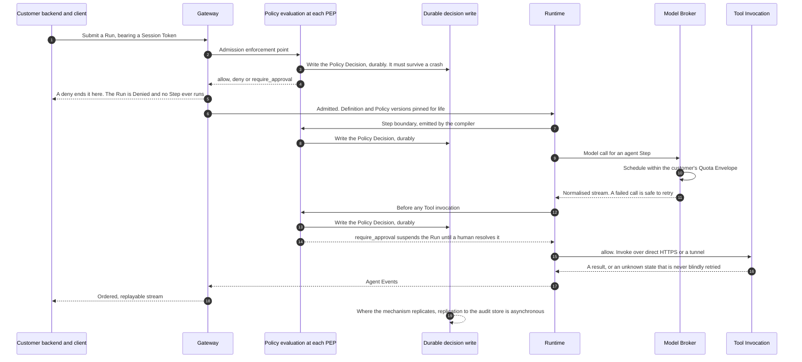

# Data Plane

The **Data Plane** is the execution path: Gateway, Runtime, Policy Enforcement Points, Model Broker,
Connector fabric ([`../GLOSSARY.md`](../GLOSSARY.md)). Everything administrative — agents,
workflows, policies, approvals, audit, connectors, credentials, usage — is the **Control Plane**,
described in [`control-plane.md`](control-plane.md). The split is the glossary's; section 2
decomposes its members rather than adding to them. No platform code exists: this is the intended
shape of a plane nobody has built.

## 1. Standing and scope

**This document is informative.** Only [`../30-protocol/`](../30-protocol/) and
[`../40-governance/`](../40-governance/) are normative ([`../README.md`](../README.md) section 3).
Where a rule binds it is linked, not repeated — two copies drift, and the copy that drifts is
always the informative one.

| What binds | Where |
| --- | --- |
| Where an enforcement point sits, what it evaluates, what it records | [`policy-model.md`](../40-governance/policy-model.md) sections 3, 4, 6 |
| What a Tool invocation must satisfy before leaving the platform | [`tool-authorization.md`](../40-governance/tool-authorization.md) section 5 |
| What must be recorded, and which writes are fail-closed | [`audit-model.md`](../40-governance/audit-model.md) section 2 |
| The gate, the Approval Chain and the Evidence Set | [`approval-workflows.md`](../40-governance/approval-workflows.md) |
| Run and Approval Request state | [`../20-domain/lifecycle-state-machines.md`](../20-domain/lifecycle-state-machines.md) |
| The wire contracts crossing this plane's edge | [`../30-protocol/`](../30-protocol/) |

No threshold, duration, retry count, quota or capacity appears here, and none governing this path is
decided anywhere in this repository. The connector support window in
[`../VERSIONING.md`](../VERSIONING.md) section 9 is the exception worth knowing about: it is
decided, and it governs connector version skew rather than execution. No datastore is selected
either: ADR-0011 constrains the engine to one enforcing row-level security and leaves the choice
open.

## 2. Components

| Component | Responsibility | Grounding |
| --- | --- | --- |
| **Gateway** | The plane's only ingress. Authenticates the calling Principal by any credential the Gateway contract accepts, resolving it to exactly one Principal and one Tenant; admits Runs; terminates the Run event stream. | `gateway-api.md` and `event-protocol.md` in [`../30-protocol/`](../30-protocol/) |
| **Runtime** | Executes the compiled artifact on the MIT library, never its server. Supplies durability — a guarantee only in `sync` mode — checkpointing, interrupts and the resume mechanism. It does not supply the supervision that notices a waiting or crashed Run and re-invokes it; that is the run supervisor's. | [ADR-0016](../adr/adr-0016-compile-to-the-langgraph-library.md), [ADR-0014](../adr/adr-0014-run-supervisor-is-orchestras.md) |
| **Policy Enforcement Points** | Not a component — places in the path where policy is evaluated and enforced. Whether the evaluator is a component of its own is open; section 5. | [`policy-model.md`](../40-governance/policy-model.md) E1 |
| **Durable decision write** | Whatever carries a Policy Decision across a crash ahead of the gated action. [ADR-0013](../adr/adr-0013-fail-closed-policy-decision-writes.md) fixes the requirement and leaves the mechanism open — a shared transaction with the datastore, a durable outbox, or a node-local append all satisfy it. It is drawn below as a participant because the write is on the path, not because its shape is decided. | [ADR-0013](../adr/adr-0013-fail-closed-policy-decision-writes.md) |
| **Model Broker** | Endpoint resolution, explicit selection, ordered fallback, quota-aware scheduling, normalised invocation and streaming. It resolves a credential reference and uses the credential at invocation; it holds none, and custody is a Control Plane duty. | [ADR-0006](../adr/adr-0006-model-layer-as-credential-broker.md); [`identity-and-access.md`](identity-and-access.md) section 10 |
| **Tool Invocation** | Carries an authorized invocation to its origin over a transport the layers above cannot distinguish. The name is [`containers.md`](containers.md) section 3's. | [ADR-0007](../adr/adr-0007-outbound-connector-for-enterprise-reachability.md) — **Proposed** |
| **Connector fabric** | Planned. Reaches Tools inside a customer network over an outbound session. See section 10. | [ADR-0007](../adr/adr-0007-outbound-connector-for-enterprise-reachability.md) — **Proposed** |

**The compiler is not in this plane.** It runs at publication, in the Control Plane, and its output
is what the Runtime executes. That matters because the Step-boundary enforcement point is
compiler-emitted: the control executes here but is placed by a Control Plane act, so no runtime
configuration moves it. What crosses into this plane is therefore an artifact, not a call — and
[`containers.md`](containers.md) section 12 assigns to this document which side of the
Python-to-TypeScript boundary the compiler sits on, and what that artifact is. It is not settled
here; section 11 says why.

**What this plane does not build.** Durability, checkpointing, interrupts and resume are the
runtime's, and remain so ([ADR-0005](../adr/adr-0005-langgraph-as-compilation-target.md),
[ADR-0014](../adr/adr-0014-run-supervisor-is-orchestras.md)). Orchestra builds the compiler,
enforcement, versioning, observability and the audit trail — **and the run supervisor**. ADR-0014
separates the two layers the earlier boundary conflated: the runtime supplies execution semantics,
while run supervision — lifecycle persistence, queueing, worker leasing and recovery, per-Tenant
concurrency, scheduling, job-level retry and drain — is Orchestra's. A checkpoint says a graph
reached a state; it does not say which worker owns the run, or who wakes it
tomorrow. Its only public surfaces are the Gateway API and the Run event
stream. The orchestration runtime's, a model provider's and the tool protocol's vocabulary stop at
the edge — none appears in an API, schema, SDK or customer-facing document
([`audit-model.md`](../40-governance/audit-model.md) A8), and the compiled artifact is retained for
reconstruction but never returned to a customer.

## 3. A Run end to end

| Control | Where it sits | What it gates | Normative home |
| --- | --- | --- | --- |
| Admission enforcement point | Gateway, before the Run reaches the Runtime | Whether the Run exists at all | [`policy-model.md`](../40-governance/policy-model.md) E1; [`lifecycle-state-machines.md`](../20-domain/lifecycle-state-machines.md) 2.1 |
| Version pinning | Admission | Which definition and Policy versions govern the Run, for life | [ADR-0012](../adr/adr-0012-policy-decisions-are-audit-records.md); [`../VERSIONING.md`](../VERSIONING.md) section 8 |
| Step-boundary enforcement point | In the compiled artifact, executed by the Runtime | Every Step, whatever its Side-Effect Class | [`policy-model.md`](../40-governance/policy-model.md) E2, E3 |
| Tool enforcement point | Before the invocation leaves the platform | Every Tool invocation, Agent Runs included | [`tool-authorization.md`](../40-governance/tool-authorization.md) TA11 |
| Durable Policy Decision write | Ahead of every gated action | Whether the action may be attempted at all | [ADR-0013](../adr/adr-0013-fail-closed-policy-decision-writes.md); [`audit-model.md`](../40-governance/audit-model.md) A6 |
| BYOK credential attachment and quota scheduling | Model Broker, over a credential it uses and does not hold | Attachment of a BYOK credential; admission of a model call | [ADR-0002](../adr/adr-0002-enterprise-segment-and-byok.md), [ADR-0006](../adr/adr-0006-model-layer-as-credential-broker.md) |
| Tenant scoping | Every read and write the plane makes | Every row it touches | [ADR-0011](../adr/adr-0011-tenant-isolation-shared-schema-rls.md) |

## 4. Where the enforcement points sit

**Admission.** A Run can be refused before it starts: `Denied` is a persisted terminal state rather
than the absence of a Run, and the decision is recorded whichever way it goes
([`../20-domain/lifecycle-state-machines.md`](../20-domain/lifecycle-state-machines.md) 2.1). The
Gateway is therefore a governance component, not a router. Admission is also where the Run pins its
definition version and the Policy versions in force
([ADR-0012](../adr/adr-0012-policy-decisions-are-audit-records.md)), fixing the governing input set
for the Run's life. Section 5 rests on that. One word does double duty across this plane and
the two senses must not be collapsed: admission here is a verdict, and a `deny` produces a Policy
Decision, while the *admission control* ADR-0006 asks of the Model Broker is scheduling against a
Quota Envelope (section 8) — capacity, not a verdict, producing no Policy Decision and refusing
nothing.

**Step boundaries.** The compiler emits an enforcement point at every Step boundary, so governance
cannot be bypassed by how a definition is written
([`policy-model.md`](../40-governance/policy-model.md) E2). This plane exposes no switch that
enables, defers or skips enforcement, because the enforcement point is in the artifact the Runtime
is handed. Every Step is evaluated whatever its Side-Effect Class (E3), so a `read` Step costs the
same machinery as a `financial` one — which makes the plane's latency profile a function of Step
count rather than of how a definition was classified.

**Tool invocation.** An Agent Run has no Steps, so the Tool enforcement point is the only control
between admission and a side effect (E4). What record that decision keys on is open in the domain
model — a Tool call inside an Agent Run has no Step Execution — and belongs to
`execution-semantics.md` in [`../50-workflows/`](../50-workflows/). The enforcement point does not
wait on that answer; only the record does.

## 5. Where policy evaluation executes

[`policy-model.md`](../40-governance/policy-model.md) section 9 and
[`system-context.md`](system-context.md) both assign this question here. It is not settled, and the
reason is not reluctance: it sits downstream of a question marked **ADR**.

Three decided things constrain any answer, and the enforcement path is where they bite.

1. The Step-boundary enforcement point is emitted into the compiled artifact (ADR-0005, ADR-0008),
   so enforcement executes wherever the Step executes. A separate decision service leaves the
   emitted point a stub that calls out — a client, not an enforcement point.
2. Pinning at admission (ADR-0012) removes the reason such a service usually exists, a single
   current view of mutable rules. A Run already may not see a current Policy, and determinism
   ([`policy-model.md`](../40-governance/policy-model.md) D4) means evaluating in many processes
   cannot yield many answers.
3. ADR-0013 already places a durable write ahead of every gated action. A synchronous network call
   in front of that write stacks a second availability ceiling on the one ADR-0013 accepts
   deliberately, at enforcement-point volume.

Together those point at evaluation in process at each enforcement point, over the Policy versions
the Run pinned, with distribution of those versions a Control Plane read. What stops that being a
conclusion is its premise: an in-process evaluator holds no cross-Run total, so the shape survives
only if a Policy is a pure function of its supplied inputs. Whether a Policy may depend on aggregate
state is registered **ADR** in [`policy-model.md`](../40-governance/policy-model.md) section 9, and
it is precisely the class a spend threshold needs. [`containers.md`](containers.md) section 5
declines the question for the same reason and this document does not overturn it: fixing the
location first would constrain the policy language by accident.

One thing holds whichever way it goes, and it is this plane's: evaluation failure is a fail-closed
failure rather than a degraded one (ADR-0013). One cost attaches to the in-process shape alone and
argues against it — an evaluator shipped inside every executing process makes a fix a fleet rollout
rather than the single upgrade a separate component would take, so a partially rolled-out fleet is a
correctness problem rather than a convenience one.

## 6. The durable write on the enforcement path

[ADR-0013](../adr/adr-0013-fail-closed-policy-decision-writes.md) requires a Policy Decision to be
durable before the gated action is attempted, and defines durable as *surviving a crash* rather than
*reaching the audit store* — a local append, replicated afterwards, satisfies it. Other Audit
Records may degrade if the degradation is recoverable from the trail. The rule is not restated here;
its consequences for this plane's shape are.

**Whether the plane is stateless turns on the mechanism.** A node-local append makes every process
hosting an enforcement point the owner of durable local storage, which makes that storage part of
the node's identity rather than scratch: scheduling, restart, drain and replacement all have to
account for it, and it becomes the largest single constraint the shape carries. A shared transaction
leaves the processes stateless and puts a network round-trip on the enforcement path instead, which
is the availability ceiling ADR-0013 accepts knowingly. The cost moves; it does not disappear,
because the write is on the path either way. Whether it also introduces a store *outside* the
row-level-secured datastore depends entirely on which mechanism is chosen: a shared transaction
introduces none, a durable outbox or a node-local append introduces one covered by no engine-side
control. If it does, the tenant identifier belongs in its addressing key and it belongs in the
registry that [`multi-tenancy.md`](multi-tenancy.md) section 8 makes checkable. That contingency is
the Data Plane's to declare once the mechanism is decided.

**If the mechanism replicates, replication lag bounds how current an audit query can be.** This
holds for a node-local append or an outbox and not for a shared transaction, which is one reason the
mechanism is worth deciding rather than assuming. Where it holds, the write flows one way into the
audit store, which is read through the Control Plane, so a decision that has already gated an
action is durable and not yet readable. Anyone reading a Run in flight — approver, auditor,
support engineer — reads a trailing view, and the audit surface has to be able to say what it has
not yet seen: absence read as non-occurrence is the failure ADR-0013 exists to prevent, arriving by
another route. ADR-0013 makes the lag a governed property and gives the signal to
`observability.md` in [`../60-operations/`](../60-operations/). A node lost holding unreplicated
appends is lost audit rather than stale audit: recovery is replay from that storage, since a
decision cannot be regenerated ([`policy-model.md`](../40-governance/policy-model.md) D5).

**Enforcement-point count is a latency multiplier.** A durable write sits ahead of every gated
action whichever mechanism carries it, so a Workflow with many Steps pays it at every boundary.
ADR-0013 accepts that floor and calls it the product working; the consequence is that Step
granularity is a cost decision rather than a free one. The plane also carries two write paths with
different guarantees, and the risk is that they converge under pressure — which ADR-0013 forecloses
by making the class a property of the record, never a runtime choice.

## 7. Suspension and resumption

A `require_approval` verdict suspends the Run, and resolution of the resulting Approval Request
resumes it ([`policy-model.md`](../40-governance/policy-model.md) V2,
[`../20-domain/lifecycle-state-machines.md`](../20-domain/lifecycle-state-machines.md) section 2.2).
Suspension may last days, so suspended state must be durable and independent of any live process or
connection. **Orchestra does not build that durability; it consumes it** (ADR-0005, ADR-0008). What
this plane owns is the governance record: which enforcement point suspended the Run, which Policy
Decision caused it, which Approval Request gates it, whose decision released it. A Checkpoint is
never exposed in a public contract
([`../20-domain/domain-model.md`](../20-domain/domain-model.md) invariant I6).

Resolution does not rewrite the verdict: an action permitted by a human is a different fact from one
permitted by rule ([`policy-model.md`](../40-governance/policy-model.md) V3), so a resumed Run
carries two records rather than one amended record. Three things are called resumption here, and
only one is inherited. The mechanism that continues a Run after a gate is the runtime library's
([ADR-0016](../adr/adr-0016-compile-to-the-langgraph-library.md)). Noticing that the gate has
resolved and re-invoking the Run is the run supervisor's
([ADR-0014](../adr/adr-0014-run-supervisor-is-orchestras.md)). And replay and resumption of the
*event stream* to a disconnected client are Orchestra's to build
([ADR-0004](../adr/adr-0004-adopt-ag-ui-event-protocol.md) — **Proposed**).

## 8. The Model Broker, the Quota Envelope and egress

[ADR-0006](../adr/adr-0006-model-layer-as-credential-broker.md) reduces the model layer to a
credential and endpoint broker: no capability routing, no preference policy, no cost-optimising
selection. An Agent or Step names a Model Binding, and a declared fallback list is attempted in
order. [`containers.md`](containers.md) section 6 draws it as a container of its own, on the
strength of the scheduling and normalising duties below.

Under BYOK the Quota Envelope is the customer's own provider-side limit, which makes it **a
steady-state capacity ceiling rather than an exceptional error**
([`../GLOSSARY.md`](../GLOSSARY.md),
[ADR-0002](../adr/adr-0002-enterprise-segment-and-byok.md)). ADR-0006 therefore specifies
quota-aware scheduling as **admission control with observable queue depth, and the resulting delay
surfaced to the user rather than hidden.** Three consequences follow:

- The broker is a scheduler with a queue per Model Binding, not a client library. Queue depth is a
  first-class signal, because a ceiling that is always present is something to show rather than an
  incident to alert on.
- Backpressure has to reach the caller. A Run waiting on capacity is still `Running`: the Run
  state machine has no capacity state, and inventing one is not this document's to do. How the
  delay surfaces is registered in section 11.
- Orchestra cannot buy its way past the ceiling, because the credential and the limit are the
  customer's. Fairness across a Tenant's own bindings is the only lever available.

None of this is per-tenant resource isolation: ADR-0011 states that shared-schema isolation provides
none and that quota work does not substitute for it, so noisy-neighbour effects on Orchestra's own
resources remain unsolved. [`multi-tenancy.md`](multi-tenancy.md) owns what isolation there is.

**Egress.** Every model call and every Tool invocation leaves this plane for a destination a
Platform User configured. [`threat-model.md`](../40-governance/threat-model.md) section 10 shows
that a customer-configurable endpoint is an SSRF primitive by construction and requires egress to
default to deny, deriving that requirement from its own analysis rather than inheriting it from
ADR-0001. That section is normative, so **the posture binds this plane already**; it is linked here
rather than restated, and it is not this document's to reopen. What is open is the allow-list's
**shape**, which spans the Model Broker, Tool Invocation and the connector — the last resting on
Proposed ADR-0007 — and so needs one ADR across the three rather than three local answers. Section
11 registers the shape, and only the shape.

## 9. Retry, idempotency and compensation

**Step Execution is the unit of idempotency, retry and compensation — never the Run**
([`../GLOSSARY.md`](../GLOSSARY.md),
[`../20-domain/domain-model.md`](../20-domain/domain-model.md) invariant I4, ADR-0008), so this
plane never restarts a Run to recover from a failure inside it. ADR-0006 requires fallback to
distinguish **a failed model call, which is safe to retry, from a partially executed tool call,
which is not.** The distinction is structural rather than a rule someone must remember:

- The Model Broker owns retry and ordered fallback, because a model call produces no effect outside
  this plane. Nothing is at stake in attempting it twice but cost and latency.
- Tool Invocation owns no retry, because it cannot know whether the far side acted. An
  ordered fallback list is a Model Binding feature and must not be generalised into fallback between
  Tools: a second Tool is a second side effect, not a second attempt at the first.

Unknown is not the same as not done. A cancellation mid-invocation, a dropped tunnel, or a connector
that declines all leave the invocation in an unknown state
([`../20-domain/lifecycle-state-machines.md`](../20-domain/lifecycle-state-machines.md) 2.4,
[`tool-authorization.md`](../40-governance/tool-authorization.md) TA18). A refusal is a
governance-visible outcome and an outage is not; reporting the first as the second records a fault
where a control operated (TA16). Failure after a side-effecting Step triggers declared compensating
actions, never a blind retry (ADR-0008); the semantics belong to `execution-semantics.md` in
[`../50-workflows/`](../50-workflows/).

**Metered occurrences originate here.** Most of what ADR-0009 meters happens on this path — Runs by
outcome, Step Executions, Tool invocations by Side-Effect Class, model usage per Model Binding —
while the Metering container that records them sits in the Control Plane
([`containers.md`](containers.md) section 3). Nothing else observes the occurrence, so emitting it
is this plane's obligation, and the retry rules above govern the emission: every metered occurrence
must also be an audited fact carrying an identifier stable across retry and replay, so that
reconciliation is a join rather than an inference over counts
([`audit-model.md`](../40-governance/audit-model.md) section 7). That is why emission belongs beside
the Audit Record write rather than to a counter of its own. What the identifying value is, and
whether it doubles as the meter idempotency key, is
[`audit-model.md`](../40-governance/audit-model.md)'s question, classified there as a later document
rather than an ADR (section 13). [`containers.md`](containers.md) section 2 and
[`control-plane.md`](control-plane.md) section 3 both draw the edge from this plane into Metering,
so all three views agree: occurrences originate here and Metering records them in the Control
Plane.

## 10. The Connector fabric — planned, not settled

> **This section rests on a Proposed decision.**
> [ADR-0007](../adr/adr-0007-outbound-connector-for-enterprise-reachability.md) binds only after
> design-partner validation. Nothing below may be treated as settled architecture.

What ADR-0007 argues is affordable now is the **seam**, not the connector: Tool Invocation is
transport-abstracted from the outset, so a direct HTTPS session and a tunnelled one are
indistinguishable above the transport. A verdict must not vary by transport
([`tool-authorization.md`](../40-governance/tool-authorization.md) TA15), which is achievable only
if the enforcement point sits above the seam. If ADR-0007 is rejected, Tools are reached over direct
HTTPS only and nothing above the transport changes — the point of designing the seam before the
product. The connector is distinct software with enrolment, health, signed releases and version
skew; `connector.md` in this section owns it once the ADR binds.

## 11. Open questions

**ADR** means the choice is costly to reverse or spans components and must be recorded as an ADR
before implementation. **Document** means a later document suffices.

| Question | ADR required? | Decided by |
| --- | --- | --- |
| The shape and scope of the egress allow-list, the default-deny posture itself being settled | **ADR** | One ADR across the Model Broker, Tool Invocation and `connector.md`; [`threat-model.md`](../40-governance/threat-model.md) section 10 is normative and fixes the posture, leaving only the shape, and ADR-0007 is **Proposed**, so the connector's share cannot close alone |
| Which mechanism satisfies the durable Policy Decision write — a shared transaction, a durable outbox or a node-local append — and, where it replicates, what lag to the audit store is tolerable | **ADR** | The datastore decision ADR-0011 constrains but does not make and ADR-0013 leaves open explicitly; [`multi-tenancy.md`](multi-tenancy.md) section 10 carries that decision, and this row is the enforcement path's share of it |
| Where policy evaluation executes — in process at each enforcement point, or a separate component | **ADR** if evaluation needs its own datastore access, otherwise Document | Blocked on whether a Policy may depend on aggregate state, marked **ADR** in [`policy-model.md`](../40-governance/policy-model.md) section 9. Section 5 derives the constraints any answer must satisfy; [`containers.md`](containers.md) section 12 carries the same row |
| Which side of the Python-to-TypeScript boundary the Definition Compiler sits on, and what artifact crosses into this plane | **ADR** | Assigned here by [`containers.md`](containers.md) section 12, whose section 9 names the two candidates: TypeScript emitting a runtime-neutral artifact, or Python beside the Runtime. Each cuts the other way against ADR-0005's substitution argument — a runtime-neutral artifact keeps every point of contact with the runtime on the far side of the seam but has to be expressive enough to compile without runtime types, while a compiler beside the Runtime may emit natively and makes substitution a compiler rewrite. What blocks a choice is that the versioned internal contract ADR-0005 requires is unwritten ([`containers.md`](containers.md) section 9), so neither placement has anything to be judged against yet, and section 2 defers to this row for that reason |
| What a `deny` outside admission does to a Run in flight, which this plane must implement and the Run state machine has no transition for | **ADR** | Already registered by [`policy-model.md`](../40-governance/policy-model.md) section 9 and [`tool-authorization.md`](../40-governance/tool-authorization.md) section 10; not this document's to take |
| How a delay against a Quota Envelope is surfaced to a caller, given a waiting Run is still `Running` | Document | `quotas-and-metering.md` in [`../60-operations/`](../60-operations/) with `event-protocol.md` in [`../30-protocol/`](../30-protocol/); rests on ADR-0004, **Proposed** |
| How a node is drained, restarted or replaced without losing decision writes not yet replicated, where the chosen mechanism replicates at all | Document | `reliability.md` in [`../60-operations/`](../60-operations/), which ADR-0013 gives the failure taxonomy, with `deployment-topologies.md` in this section |
| How a Run event stream survives a disconnect, given replay and resumption are Orchestra's to build rather than inherited | Document | `event-protocol.md` and `gateway-api.md` in [`../30-protocol/`](../30-protocol/); rests on ADR-0004, **Proposed**, whose validation step 2 is the approval lifecycle through disconnect and replay |
| Which Principals may cancel a Run, and what this plane does with an invocation already outside it | Document | [`identity-and-access.md`](identity-and-access.md) for the Principal; `execution-semantics.md` in [`../50-workflows/`](../50-workflows/) for the in-flight invocation |
| Whether a customer-hosted execution topology exists, and what of this plane would move into it | Document | `deployment-topologies.md` in this section; ADR-0002 notes only a data non-egress requirement would imply one, and ADR-0007 leaves it as a later option |

**Questions assigned here, and their disposition.**
[`policy-model.md`](../40-governance/policy-model.md) section 9 and
[`system-context.md`](system-context.md) assign *where policy evaluation executes*; section 5
derives what any answer must satisfy and states plainly why it cannot close ahead of the
aggregate-state ADR. [`threat-model.md`](../40-governance/threat-model.md) section 14 assigns
*egress*; section 8 accepts the default-deny posture as binding already and registers the allow-list
shape alone, because that is what spans three components, one of which rests on a Proposed ADR.
[`containers.md`](containers.md) section 12 assigns the *compiler's side of the language boundary*;
ADR-0005 places neither side and the row above marks it **ADR**.
[`multi-tenancy.md`](multi-tenancy.md) section 10 asks each plane to name the stores it introduces
outside the datastore; section 6 cannot yet answer for this plane, because whether the durable
decision write introduces such a store at all is a property of the mechanism, and it states instead
which rules — addressing key, then registry entry — attach the moment the mechanism is one that
does.
