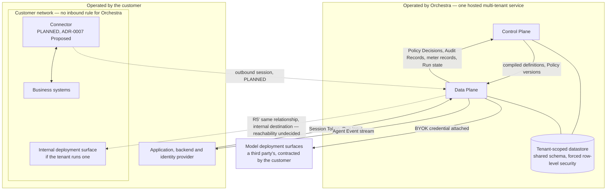

# Deployment Topologies

Where Orchestra runs, the question that decides whether a second topology exists, and a third
axis nothing yet decides.

**The one sentence.** Hosted is decided: Orchestra operates the Control Plane and the Data Plane as
one multi-tenant service ([ADR-0001](../adr/adr-0001-product-shape-multi-tenant-saas.md)). A hybrid
topology — hosted Control Plane, customer-deployed Data Plane — exists only if "BYOK" turns out to
mean *data must not transit Orchestra infrastructure* rather than *control of spend*, and nothing in
the platform may assume which.

## 1. Standing and scope

**This document is informative.** Only [`../30-protocol/`](../30-protocol/) and
[`../40-governance/`](../40-governance/) are normative ([`../README.md`](../README.md) section 3).
A binding rule is linked, never restated. Terms are [`../GLOSSARY.md`](../GLOSSARY.md)'s throughout.

**Orchestra is pre-implementation and pre-customer.** No platform code exists, no connector has been
built, and no deployment has ever run. A topology below is a placement of responsibilities.

| What binds, and is not reopened here | Where |
| --- | --- |
| Orchestra operates both planes as one hosted multi-tenant service | [ADR-0001](../adr/adr-0001-product-shape-multi-tenant-saas.md), Accepted |
| Enterprise segment, BYOK model credentials, Orchestra custodies and never resells | [ADR-0002](../adr/adr-0002-enterprise-segment-and-byok.md), Accepted |
| Isolation by shared schema with forced row-level security, and the promotion path as a design constraint | [ADR-0011](../adr/adr-0011-tenant-isolation-shared-schema-rls.md), Accepted |
| Connector version skew, the negotiated window and the support commitment | [`../VERSIONING.md`](../VERSIONING.md) section 9 |

No number appears below that is not one of those: no region count, service count, freeze window,
cutover duration, replication budget or rollback deadline is decided anywhere, and none is invented.

## 2. The assumptions this document rests on

The hybrid half of this document depends on design-partner conversations that **have not happened**.
The repository owner has directed that a partner be assumed so it can be written. That is a writing
device, not evidence, and it advances **Proposed**
[ADR-0007](../adr/adr-0007-outbound-connector-for-enterprise-reachability.md) not one step.

The hosted
topology is not assumed: ADR-0001 decides it, and sections 4 to 6 rest on Accepted decisions. The
hybrid fork is not a guess either — it is a *registered question*, raised by ADR-0002's follow-on
and named in ADR-0001's revisit criteria. Only what a customer would say if asked is assumed;
[`connector.md`](connector.md) must assume what a security team requires of software inside a
network.

| # | Assumption | Load-bearing in | What would confirm it | What changes if it is false |
| --- | --- | --- | --- | --- |
| A1 | Some enterprise buyer reads BYOK as data non-egress rather than as spend control | Section 7 existing at all | ADR-0002's follow-on and ADR-0007 validation step 3, which is a design-partner conversation rather than a document | Hybrid is void. ADR-0001's revisit criterion is never triggered and this document collapses to sections 4 to 6, 8 and 9 |
| A2 | A stated non-egress requirement is about the *execution* path — prompts, tool arguments, tool results — rather than about where records are *stored* | The claim that non-egress implies a customer-deployed Data Plane | Asking which data class and which verb: processed, stored, or both | What follows is a residency question (section 9) and a commercial conversation about dedicated storage — neither removes Orchestra from the execution path, and section 8 is explicit that the promotion path is not an answer to non-egress. Hybrid is not implied, but nor is it excluded. **This is the assumption most likely to be wrong and the one whose failure changes the most** |
| A3 | A buyer who refuses a hosted Data Plane still accepts a hosted Control Plane, with the operator access edge R8 that comes with it | Hybrid being *hybrid* rather than a self-hosted product | A partner conversation about administrative access and support, not about data location | The buyer wants ADR-0001's rejected option 2, a commercial-model question ADR-0001 settled. The deal is out of segment rather than a topology this section owes an answer to |
| A4 | A customer who deploys a Data Plane will operate it to a standard that keeps a governance claim credible — patching, upgrade, drain, clock, telemetry export | Every cost in section 7, and the reconciliation argument in 7.3 | A partner's operational capability, assessed rather than asserted | Hybrid is not merely expensive; it is a governance claim Orchestra cannot stand behind, because a control that executed in a process Orchestra neither operates nor can force-upgrade is asserted rather than evidenced |
| A5 | Tool reachability inside a customer network is solved by an outbound Connector | The hosted topology being *complete* for the target segment | ADR-0007 validation steps 1 and 2 | If partners can expose Tool origins publicly, hosted is unchanged and simpler. If they can neither expose origins nor accept a Connector, reachability is unsolved — a larger problem than which topology exists |
| A6 | Someone will eventually want a dedicated database enough to pay for it | Section 8 being worth building rather than only designing for | A customer asking; ADR-0011 designs the path without committing to sell it | The promotion path stays a design constraint, which ADR-0011 requires regardless because it is what keeps the shared-schema choice cheap to reverse. Nothing is lost |
| A7 | Some part of the target segment cannot accept a single-region deployment, and for at least some buyers residency rather than topology is what "where is our data" means | Section 9's comparison of the three shapes, and its closing claim | The same ADR-0002 follow-on conversation, asked about jurisdiction alongside egress | One region is sufficient for the segment, and section 9 narrows from a model choice to a commitment. Nothing about hybrid changes either way |

Where one of these is load-bearing in the body it is named at that point.

## 3. Four axes, two of which are decided

Four independent questions are routinely collapsed into one, which makes the open ones look
settled.

| Axis | The question | Status |
| --- | --- | --- |
| **Plane placement** | Who operates the Data Plane | **Decided**: Orchestra, both planes, ADR-0001. The hybrid variant is contingent on A1 and A2 |
| **Storage placement** | Whether a Tenant's records sit in the shared database or a dedicated one | **Decided** in its default: shared schema, forced row-level security, ADR-0011, with a promotion path designed for and not built. Both ends are hosted |
| **Residency** | Which jurisdiction the data physically sits in | **Undecided, and nothing addresses it.** ADR-0001 accepts the obligation and no document chooses a model — section 9 |
| **Reachability** | How a Tool inside a customer network is reached | ADR-0007, **Proposed**. Orthogonal to the other three, and it does not disappear under hybrid — section 7.2 |

Dedicated storage inside Orchestra's operation is **not** a customer-deployed Data Plane. Conflating
them would make the hybrid question look settled by a decision that never addressed it.

## 4. Hosted — the decided topology

[`system-context.md`](system-context.md) section 1 fixes the operator split and section 3 the edges.
This view does not redraw that boundary; it states what the boundary means for deployment.

**Orchestra operates** every container in [`containers.md`](containers.md) section 3 that exists
under the hosted topology, and the datastore. Whether the Connector fabric is a container at all is
classified **ADR** there, and that classification is repeated rather than settled by enumeration.
Orchestra answers in a review for all of it — including for its use of the external key management
service Credential Custody calls, which is a subprocessor under the obligations ADR-0001 accepts
rather than something Orchestra operates.

**The customer operates** their application, backend and identity provider, their business systems —
and, under Proposed ADR-0007, a Connector. The model deployment surfaces reached under BYOK are a
third party's, contracted by the customer ([`system-context.md`](system-context.md) section 1); the
exception is a tenant that runs its own internal surface, which `system-context.md` places inside
the customer network on R5' and registers, in its section 7, as reachability-undecided. Software
Orchestra ships but does not operate cannot be force-upgraded, which is why version skew is
permanent rather than exceptional ([`../VERSIONING.md`](../VERSIONING.md) section 9). Under
ADR-0007 the Connector would be the only such software; section 7.5 is about what happens when it
is not.

**Whether hosted is *complete* for the target segment rests on assumption A5** — that a Tool inside
a customer network is reached by an outbound Connector. ADR-0007 is **Proposed** and no Connector
has been built. If partners can neither expose Tool origins publicly nor accept one, what is missing
is reachability rather than a second topology, which is section 3's fourth axis and not this one.

**What this costs Orchestra is not optional.** ADR-0001 accepts it plainly: Orchestra is a processor
of customer data carrying DPA, residency, retention and subprocessor obligations from the first
enterprise conversation, and SOC 2 becomes calendar-bound rather than effort-bound. Those are
properties of the hosted topology, not responses to a customer's request.

## 5. What no topology changes

Each of these holds in every topology here, including one that does not exist. They are listed
because a topology discussion is where someone proposes relaxing one.

- **Tenant scoping.** Every persisted record, emitted event and log line carries a tenant identifier
  ([`../20-domain/domain-model.md`](../20-domain/domain-model.md) invariant I1). One Tenant alone in
  a database changes nothing: ADR-0011 is explicit that isolation does not change on promotion.
- **Isolation is enforced by the engine, not by placement.** Physical separation is no substitute
  for a forced row-level security policy, and a topology that treats it as one has replaced a
  structural control with an architectural argument ([`multi-tenancy.md`](multi-tenancy.md)).
- **Enforcement points do not move when a process moves.** The Step-boundary enforcement point is
  emitted into the compiled artifact and executes wherever the Step executes
  ([`data-plane.md`](data-plane.md) section 5). No deployment configuration relocates or suppresses
  one — [`../40-governance/policy-model.md`](../40-governance/policy-model.md) E2 is the rule.
- **The public contracts do not vary by topology**, and no rail reaches one in any topology
  ([ADR-0005](../adr/adr-0005-langgraph-as-compilation-target.md),
  [`../40-governance/audit-model.md`](../40-governance/audit-model.md) A8). A definition names no
  host, region or plane ([ADR-0008](../adr/adr-0008-declarative-workflow-definitions.md)); one that
  had to would make topology a customer-visible contract, which is what would make the fork in
  section 7 expensive to keep open.
- **Fail-closed stays fail-closed.** A Policy Decision must survive a crash ahead of the gated
  action ([ADR-0013](../adr/adr-0013-fail-closed-policy-decision-writes.md)). No topology may weaken
  that because the store got further away; one that puts distance on the enforcement path pays for
  the distance instead — section 7.3.

## 6. Which containers are separately deployable

[`containers.md`](containers.md) section 12 assigns this here with a warning worth keeping: *nothing
there is a service count*. This document produces none either — pre-implementation that is
invention, and three decisions land first: the datastore engine and the Definition Compiler's side
of the language boundary, both registered **ADR** elsewhere, and where policy evaluation executes,
which [`containers.md`](containers.md) section 12 registers **ADR** only if evaluation needs its own
datastore access and Document otherwise. Each classification is repeated, not revised. What can be
fixed now are the constraints on any packaging.

| Constraint | Why it holds |
| --- | --- |
| The plane boundary must be a **release** boundary, whatever the service count | An artifact already crosses it — compiled definitions down, facts up ([`containers.md`](containers.md) section 1) — and that is the whole of why it holds today, independent of any assumption. Separately, **under A1 and A2**, it is cheap insurance: the hybrid variant, if it ever exists, splits along exactly this line, so keeping the planes separately releasable is what would keep section 7 from being a rewrite |
| Policy evaluation may not become a network hop that can fail open | Enforcement is in-process by construction ([`data-plane.md`](data-plane.md) section 5). Where the *evaluator* runs is undecided; that failing to reach it is **fail-closed** is not — the gated action does not proceed, and the condition is a contained fault under [`../60-operations/reliability.md`](../60-operations/reliability.md) F10 and F11, never an `allow` and never recorded as a `deny`, which would inflate the governance-refusal count with outages. This is not |
| Every process that can gate an action carries the drain obligation | [`../60-operations/reliability.md`](../60-operations/reliability.md) F23 makes drain a property of that whole set, not of one service with a lifecycle hook, so packaging that multiplies such processes multiplies drain surfaces |

## 7. Hybrid — contingent, and not the architecture

> **This section describes a shape no decision has taken.** ADR-0001 is Accepted and hosted. The
> hybrid variant appears only in ADR-0001's revisit criteria and as option 3 in **Proposed**
> ADR-0007, which leaves it as a later possibility. No container is designed for it
> ([`containers.md`](containers.md) section 1). Everything here rests on assumptions A1 to A4 and is
> written so the cost is visible before anyone commits to it.

### 7.1 What would move, and what would not

[`data-plane.md`](data-plane.md) section 11 registers *what of this plane would move into a
customer-hosted execution topology* and classifies it **Document**. This is that answer, conditional
on a shape nobody has chosen.

| Component | Under hybrid | Note |
| --- | --- | --- |
| Gateway | Moves | It is the plane's only ingress, and ingress is where the customer's data first arrives |
| Runtime | Moves | The execution path is what a non-egress requirement is about, under A2 |
| Policy Enforcement Points | Move, necessarily | They are places in the path, not a service — they go where the Step goes |
| Policy evaluation | **Undecided, and the sharpest of these** | Its location is undecided today ([`containers.md`](containers.md) section 3) and its classification is repeated in section 6, not revised. Left hosted, it puts a wide-area call on every gating path, which section 6's second constraint permits only fail-closed — so a link failure stops governed work rather than passing it. Moved into the estate, Policy version propagation becomes a distributed-consistency problem instead |
| Model Broker | Moves | Which raises separately whether credential custody moves with it |
| Tool Invocation | Moves | And with it most of the Connector's reason to exist — 7.2 |
| Connector fabric | **Undecided, and split by the boundary** | It terminates the Connector's outbound session and holds enrolment and health state, while the enrolment *act* sits on the Control Plane API, which stays hosted ([`containers.md`](containers.md) section 3). Under hybrid it could move with Tool Invocation, stay hosted with enrolment, or lose most of its purpose where the deployed plane reaches in-network Tools directly. Whether it is a container at all is classified **ADR** in [`containers.md`](containers.md); this row is registered in section 12 |
| Whatever satisfies ADR-0013's durable decision write | Moves, or the enforcement path crosses a wide-area link | 7.3 |
| Control Plane API, Admin Console, Definition Compiler, Metering | Stay hosted | This is what makes it hybrid rather than self-hosted, per assumption A3 |
| Credential Custody | **Undecided** | ADR-0002 places custody with Orchestra. [`system-context.md`](system-context.md) section 7 registers the *connector-proxy* form of the question — whether model traffic may be proxied so credentials never leave the perimeter — and classifies it **ADR required**; that classification is repeated. The hybrid form is registered here for the first time and inherits it, because it relocates the same custody. Hybrid does not answer it |

### 7.2 Hybrid relocates the outbound-session problem; it does not remove it

A customer-deployed Data Plane reaches in-network Tools locally, so the Connector's reachability
role shrinks. The Control Plane must still reach that plane — compiled definitions and Policy
versions inward, Policy Decisions, Audit Records, meter records and Run state outward — from outside
a network that accepts no inbound rule. That is the same outbound-session pattern ADR-0007 proposes,
now carrying governance state rather than tool traffic, on a link whose failure stops governed work
rather than one Tool. Whether it is the same software is undecided and registered in section 12 —
and it is an argument for the *seam* ADR-0007 also proposes, a transport abstraction cheap now and
expensive to retrofit that survives either topology. The seam rests on cost rather than on status:
[`system-context.md`](system-context.md) section 4 says it is exactly as unbound as the ADR carrying
it and that nothing Accepted requires it, and ADR-0007 decides more than the seam — it builds the
outbound Connector as the primary mechanism, a part this section does not inherit.

### 7.3 Metering and audit reconciliation get materially harder

[ADR-0009](../adr/adr-0009-meter-first-defer-tiering.md) requires meter records reconcilable against
the audit log, because billing data must be defensible in a dispute.
[`../60-operations/quotas-and-metering.md`](../60-operations/quotas-and-metering.md) section 11
derives what that takes: a join on an **occurrence identifier minted by the component taking the
governed action, before either write**. Under hybrid that component sits inside the customer's
estate. Four consequences follow.

- **Both sides of the join are produced by software Orchestra does not operate and cannot
  force-upgrade.** A skew that changes how an identifier is minted becomes a billing defect rather
  than a compatibility annoyance.
- **The completeness horizon becomes a property of a link Orchestra does not control.**
  [`../60-operations/observability.md`](../60-operations/observability.md) section 4 makes absence
  readable as *not yet seen* rather than *did not happen*; under hybrid that horizon lags a customer
  network's availability, and a reconciliation run behind it asserts less than it does today.
- **ADR-0013's durable write must be satisfiable inside the estate**, or every enforcement point
  takes a wide-area round trip on the gating path. Hosted, the mechanism choice is a latency and
  audit-volume trade-off; hybrid removes the option that keeps it simple. The same arithmetic
  applies to the evaluation call itself wherever the evaluator stays hosted — 7.1.
- **Degraded periods are bracketed by an operator who is not Orchestra.** `reliability.md` F16 makes
  the bracket a metering input as well as an operational signal, so the customer's own operations
  become an input to their own invoice.

Assumption A4 is load-bearing throughout: if a customer's operational standard is lower than
assumed, none of this is a cost engineering can absorb.

### 7.4 What hybrid does not deliver

Hybrid **narrows** egress; it does not end it. Policy Decisions, Audit Records and meter records
still flow to the hosted Control Plane, because that is where approvals are resolved and audit is
read. An Approval Request carries an **Evidence Set** — the tool results and retrieved context the
Agent relied on ([`../GLOSSARY.md`](../GLOSSARY.md)) — and whether it is materialised by value or by
reference is open in
[`../40-governance/approval-workflows.md`](../40-governance/approval-workflows.md). If by value, the
customer's data leaves the estate every time a human approves something, which is what assumption
A1's buyer said must not happen. That tension belongs in the first partner conversation, not a
design review afterwards.

### 7.5 The costs

Two deployment shapes to build, operate, observe and upgrade. A second class of customer-run
software whose version skew reaches *enforcement* rather than transport — and
[`../VERSIONING.md`](../VERSIONING.md) enumerates nine versioned artifacts with no customer-deployed
execution plane among them, so hybrid adds a tenth with no policy behind it. Incidents inside a
customer's estate, diagnosed through their telemetry under their access controls, which the operator
edge R8 does not reach. Governance evidence resting on signed releases and tamper-evident local
audit for the whole execution path rather than a proxy. And a metering story whose defensibility
depends on a link Orchestra does not own. One thing hybrid genuinely makes easier: model traffic
never transits Orchestra infrastructure. Whether it leaves the customer's perimeter is a separate
question. ADR-0002 names Azure OpenAI, AWS Bedrock, the Anthropic API and a generic
OpenAI-compatible base URL as the MVP deployment surfaces, and the first three are public endpoints
reached over the internet whichever plane invokes them. Only an internal or self-hosted surface
keeps the traffic inside the estate, and its reachability is registered undecided on R5' in
[`system-context.md`](system-context.md) section 7.

## 8. Promotion is not hybrid

ADR-0011 makes the promotion path part of its decision: a single Tenant can be relocated to a
dedicated database **without a schema change and without any change to a public contract**.
[`multi-tenancy.md`](multi-tenancy.md) section 7 fixes the constraints that keep it possible and
assigns the procedure here. **A promoted Tenant is still hosted.** Orchestra operates the dedicated
database, remains the processor, and carries the same DPA, retention and subprocessor obligations.
Nothing about assumption A1's non-egress requirement is satisfied by it.

**The procedure, in shape.** No sequencing, duration, freeze window or rollback deadline is decided,
because each depends on the datastore engine ADR-0011 constrains and does not select.

1. Provision the dedicated database with the same schema, the same policies, and row-level security
   enabled and forced — the isolation model does not change on promotion.
2. Run the migration set against it. Migrations are written to run per database while there is one,
   which is what makes this step ordinary.
3. Copy by tenant key.
4. Verify, positively and negatively: every tenant-scoped table's rows for this Tenant arrived, and
   no row bearing another Tenant's identifier did. Audit and meter records are append-only and
   immutable, so a copy that rewrites them is a defect, and the reconciliation join of section 7.3
   must still resolve across the move.
5. Repoint the resolver. Cutover is a change to one routing fact, which is the entire reason the
   per-request tenant-to-connection resolution step exists from the first commit.
6. Retain the source rows until verified, then remove them under a deletion design that is itself
   open, bounded by audit retention
   ([`../40-governance/audit-model.md`](../40-governance/audit-model.md)).

**What the first promotion costs, and it lands once.** ADR-0011 lists cross-tenant aggregation as an
ordinary query among its benefits. That holds until one Tenant leaves, after which operator
aggregation is a per-Tenant query plus aggregation outside the transactional store — the sharpest
tension in the decision ([`multi-tenancy.md`](multi-tenancy.md) section 7), and promotion is when
the bill arrives. Assumption A6 is what makes planning to pay it worthwhile.

## 9. Residency is a third axis, and nothing decides it

ADR-0001 accepts residency as an obligation of being a processor. No document here chooses a model
and this one does not either — inventing one would be the enterprise guess working rule 8 warns
against. The shapes are not equivalent. **One region for all tenants** is cheapest and forecloses
whatever part of the segment cannot use it — that such a part exists is **assumption A7** and not a
fact. **Per-tenant region selection** is the promotion path plus a location, inheriting its costs
rather than adding new ones. **Per-record-class placement** — audit
in one jurisdiction, execution state in another — crosses the shared schema and is the shape
ADR-0011 was not designed for. Residency also reaches past the datastore: telemetry, logs and every
store outside row-level security carry tenant identifiers
([`multi-tenancy.md`](multi-tenancy.md) section 8), and that inventory is itself open, so a
commitment cannot yet be scoped.

**Under A7, residency may be what a buyer means by "where is our data" in the first place.** If A2
also holds, it may satisfy a buyer hybrid was proposed to satisfy, at a fraction of the cost — which
is a reason to ask the residency question early, not to treat it as answered. Neither assumption has
been put to a partner.

## 10. Drain, and whose operator performs it

[`data-plane.md`](data-plane.md) section 11 co-assigns *how a node is drained, restarted or replaced
without losing decision writes not yet replicated* to
[`../60-operations/reliability.md`](../60-operations/reliability.md) and to this document, and
classifies it **Document**. That classification is repeated, not revised; `reliability.md` section
10 answers the operational half in F22, which orders the drain, and F23, which places the obligation
on every process that can gate an action. This document's share is a topology sentence: under hosted
the procedure is Orchestra's to perform and be paged for; under hybrid it is the customer's, on a
schedule Orchestra does not set, for a failure mode whose consequence — where the durable write is a
node-local append or an outbox rather than a shared transaction — is **lost audit rather than stale
audit** (`reliability.md` section 10; the mechanism itself is undecided,
[`data-plane.md`](data-plane.md) section 11). Assumption A4 does the work in that second clause.

## 11. Questions assigned to this document, and their disposition

| Assigned by | Question | Disposition |
| --- | --- | --- |
| [`system-context.md`](system-context.md) section 7 | Whether a hybrid topology exists | **Escalated, not answered.** It rests on a design-partner conversation, and an assumed partner is not one. Section 7 states what it would cost so the decision is informed; its classification, **ADR required**, is repeated |
| [`data-plane.md`](data-plane.md) section 11 | Whether a customer-hosted execution topology exists, and what of this plane would move into it | **Split, and both halves keep their classifications.** Whether it exists is system-context's **ADR required** row above; what would move is the **Document** half, answered conditionally in 7.1 |
| [`containers.md`](containers.md) section 12 | Which containers are separately deployable, and which share a process or a release | **Answered as constraints, not as a count** — section 6. The count waits on three decisions registered **ADR** elsewhere |
| [`multi-tenancy.md`](multi-tenancy.md) section 10 | The promotion procedure — sequencing, verification and cutover | **Partly answered** — section 8 gives the ordered shape and what verification must assert. Sequencing under concurrent writes, cutover atomicity and rollback wait on the datastore engine and are registered below |
| [`data-plane.md`](data-plane.md) section 11 | How a node is drained without losing unreplicated decision writes | **Answered elsewhere and repeated** — `reliability.md` F22 and F23. Section 10 adds only whose operator performs it |
| [`connector.md`](connector.md) section 11 | The topology half of whether credential custody relocates when BYOK is read as non-egress | **Registered, not answered.** 7.1 marks Credential Custody **Undecided**; section 12 repeats [`system-context.md`](system-context.md)'s **ADR required** classification for the connector-proxy form and registers the hybrid form beside it |

## 12. Open questions

**ADR required** means the choice is costly to reverse or spans components and must not be settled
in prose. Where another document owns a question, its classification is repeated, not revised.

| Question | Decided by | ADR required? |
| --- | --- | --- |
| Whether a hybrid topology exists — hosted Control Plane, customer-deployed Data Plane | Design-partner validation, then an ADR superseding part of ADR-0001 | **ADR required** — [`system-context.md`](system-context.md)'s classification; it is ADR-0001's own revisit criterion |
| Whether "BYOK" means spend control or means data must not egress, which decides whether the row above is hypothetical | ADR-0002's follow-on and ADR-0007 validation step 3; a conversation, not a document | **ADR required** if it forces the hybrid topology; otherwise closed by evidence — [`system-context.md`](system-context.md)'s classification |
| Whether a non-egress requirement, if stated, is about processing or about storage — assumption A2 | The same conversation, asked with the distinction made explicit | No — but it decides whether section 7 is in play at all, or whether what follows is the residency question of section 9 and a commercial conversation about dedicated storage. Section 8 is explicit that the promotion path answers non-egress under neither reading. Asked first for that reason |
| The residency model: one region, per-tenant selection, or per-record-class placement | Unassigned anywhere in this repository until now; this document registers it and does not take it | **ADR required** — it constrains ADR-0011's shared schema and the store inventory outside it |
| Whether promotion to a dedicated database is offered commercially, to whom, and on what terms | A design-partner conversation; ADR-0011 designs the path without committing to sell it | No — [`multi-tenancy.md`](multi-tenancy.md)'s classification |
| Promotion under concurrent writes — quiesce or dual-write — cutover atomicity, and rollback | The datastore engine decision ADR-0011 constrains and does not make | No — [`multi-tenancy.md`](multi-tenancy.md) classifies the procedure as later-document work; this row is the residue section 8 could not close |
| Where the Connector fabric sits under hybrid, given the enrolment act stays on the hosted Control Plane API while enrolment state sits in the fabric | Void unless the first row binds; then [`containers.md`](containers.md), whose prior question is whether the fabric is a container at all | **ADR** — [`containers.md`](containers.md)'s classification of that prior question, repeated; this row cannot be narrower than it |
| Whether a hybrid Control-Plane-to-Data-Plane link would be Connector software or a second product | Void unless the first row binds; then [`connector.md`](connector.md) in this section, with ADR-0007 | **ADR required** if it binds — it extends ADR-0007 from Tool traffic to governance state |
| Whether credential custody moves under hybrid, given ADR-0002 places it with Orchestra | [`system-context.md`](system-context.md) section 7 registers the connector-proxy form of this question | **ADR required** — that register's classification; it relocates custody |
| How a customer-deployed execution plane would be versioned and its skew supported, given [`../VERSIONING.md`](../VERSIONING.md) enumerates nine artifacts and does not include one | [`../VERSIONING.md`](../VERSIONING.md), void unless hybrid binds | **ADR required** if it binds — it is a support commitment, not a document convention |
| Whether an Evidence Set is materialised by value or by reference, which decides how much egress hybrid actually prevents | [`../40-governance/approval-workflows.md`](../40-governance/approval-workflows.md) | No — that register's classification; recorded here because section 7.4 turns on it |
| Which containers are separately deployable, as a count rather than as constraints | The datastore engine, the Definition Compiler's side of the language boundary, and where policy evaluation executes — all registered **ADR** in [`containers.md`](containers.md) and [`data-plane.md`](data-plane.md) | No — the constraints in section 6 hold on any count |
