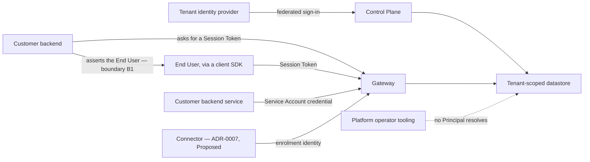

# Identity and Access

Who Orchestra believes an actor to be, how it decides what that actor may reach, and where those
two questions stop being one. Twelve open-questions rows across ten documents name this document as
decider, and more route a question here in prose; section 12 says which are settled and which are
escalated, and accounts for all twelve.

**This document is informative.** Only [`../30-protocol/`](../30-protocol/) and
[`../40-governance/`](../40-governance/) are normative, per [`../README.md`](../README.md)
section 3. Where a rule binds it is cited, not restated; where this document settles a question a
normative document holds open, it names the document that must carry the rule. Terms are used
exactly as [`../GLOSSARY.md`](../GLOSSARY.md) defines them, Control Plane and Data Plane included.

Orchestra is **pre-implementation and pre-customer**: no platform code, no identity provider
integrated, no customer requirement stated. **No lifetime, rotation interval, session duration or
expiry appears anywhere below**, because none is decided anywhere in this repository. Section 9
gives the forces that bound them instead.

## 1. Two questions that look like one

Conflating administration with capability is the likeliest way to build a platform that believes it
is governed and is not. Three questions sit in the path of one Tool call; they are ordered, all
three must hold, and only the first is owned here.

| Question | Owned by | What it decides |
| --- | --- | --- |
| May this Principal administer this thing through the Control Plane? | This document | Whether a capability grant, Policy, Model Binding or Tool registration may be authored at all |
| Does this Agent version hold a capability grant on this Tool? | [`../40-governance/tool-authorization.md`](../40-governance/tool-authorization.md) | What an Agent can ever do, as a ceiling |
| Does Policy permit this invocation now? | [`../40-governance/policy-model.md`](../40-governance/policy-model.md) | The verdict at the enforcement point |

An approver authorised to release a payment is not thereby an Agent that may make one, and an Agent
holding a capability grant on a `financial` Tool is not thereby permitted to invoke it — rule A2 of
`policy-model.md`, invariant I5 of [`../20-domain/domain-model.md`](../20-domain/domain-model.md).

**Two mechanisms, two words, always qualified.** *Capability grant* is the second row's
Agent-to-Tool edge, as `tool-authorization.md` uses it. *Administrative grant* is the first row's
permission to author something through the Control Plane, and is this document's provisional word
for a thing whose shape section 5 sends to an ADR. An unqualified "grant" would collapse exactly the
distinction this section exists to keep, so none appears below. Neither term has a
[`../GLOSSARY.md`](../GLOSSARY.md) entry and both need one (section 12).

## 2. The Principal model

Four disjoint and exhaustive subtypes; every action resolves to exactly one Principal (invariant I2,
domain model section 3). Personas are jobs, not identity types: administrator, developer, approver
and auditor are one subtype ([`../00-overview/personas.md`](../00-overview/personas.md) section 1).

| Subtype | Who it is | Authenticates by | Seat-billable |
| --- | --- | --- | --- |
| Platform User | A person administering Orchestra, approving, reading audit | The tenant's identity provider | Yes — ADR-0009 |
| End User | A person using the customer's own application | A scoped Session Token minted by Orchestra | No — measured only |
| Service Account | A machine caller into the Gateway, typically the customer's backend | Undecided; see section 3 | Not counted under ADR-0009 as written, which counts Principals authenticating to the Control Plane; whether that omission was intended is registered in `personas.md` section 5 |
| Connector | Customer-deployed software proxying Tool traffic inward | Enrolment identity, provisional under **Proposed** [ADR-0007](../adr/adr-0007-outbound-connector-for-enterprise-reachability.md) | No |

**A person administering two Tenants is two Principals, and no record joins them.** Domain model
section 11 routes here whether a cross-tenant person record exists behind the identity-provider
integration. It does not: invariant I1 puts a tenant identifier on every record and
[ADR-0011](../adr/adr-0011-tenant-isolation-shared-schema-rls.md) filters by it in the engine, so
such a record could not be read under a tenant predicate without a bypass — the argument
`audit-model.md` makes as its rule A1. It would have to live outside that datastore, which
[`multi-tenancy.md`](multi-tenancy.md) section 8 governs and nothing here needs; correlating one
human across Tenants is the identity provider's job.

## 3. Authentication, by subtype

**Platform User — the tenant's identity provider.** Orchestra holds no password and runs no sign-in
of its own, so the tenant's multi-factor policy, conditional access and joiner-mover-leaver process
are inherited rather than rebuilt. Authentication to the Control Plane is an audited act and the
seat-billable metered dimension under
[ADR-0009](../adr/adr-0009-meter-first-defer-tiering.md). Deprovisioning at the identity provider
removes the ability to authenticate, not the Principal — domain model section 10 fixes that a
credential expires while a Principal does not — so administrative grants that Principal holds
outlive the account unless something revokes them, and what performs that revocation is undesigned
(section 12).

**End User — a Session Token minted at the customer backend's request.** Never a tenant API key,
never present in a browser or mobile bundle. Orchestra does not authenticate the End User at all: it
trusts an assertion the customer's backend makes, which
[`../40-governance/threat-model.md`](../40-governance/threat-model.md) names boundary B1 and places
in its trusted-by-assumption set. The strength of End User identity is exactly the strength of that
backend, and no control Orchestra builds improves it.

**Service Account — undecided, and narrowed here.** The domain model routes the credential class to
this document. One thing follows without a new decision: it is not a Session Token, which is a
per-interaction authority minted per End User, where a Service Account is a durable Principal that
exists between interactions — serving both from one class would put a long-lived secret on the path
the glossary forbids a tenant API key from taking. Which class it is instead — long-lived secret,
asymmetric key, workload identity federated from the customer's cloud — is an unmade product
decision, and the one Orchestra-side credential whose rotation is Orchestra's own problem.

**Connector — provisional.** Enrolment identity, mutual authentication and revocation rest entirely
on **Proposed** ADR-0007; the planned `connector.md` in [`./README.md`](README.md) owns the
mechanism. If that ADR is rejected the subtype leaves the model and nothing else here changes.

**Which component authenticates, and which mints.** [`containers.md`](containers.md) registers both
here. Its section 3 gives the Gateway as the public HTTP and event-stream boundary that
authenticates the calling Principal, so every Data Plane caller is authenticated there and a
presented Session Token is validated there. Minting lands in the same place rather than on the
Control Plane API: the mint request is a machine-to-machine call the customer's backend makes, which
is a Service Account, and the glossary places a Service Account's calls at the Gateway. The Control
Plane authenticates one subtype only — the Platform User, federated at the tenant's identity
provider — and holds no part in an End User's session. **The normative home is `gateway-api.md` in
[`../30-protocol/`](../30-protocol/)**, where the mint and the token's expiry (section 9) have to be
written together.

**The tenant directory is read before any of that.** Resolving a caller to a Tenant precedes tenant
context, so a directory record identifies a Tenant rather than belonging to one — `containers.md`
section 8 derives that much from ADR-0011. What follows here is only *who reads it*: whichever
container authenticates, which the paragraph above fixes as the Gateway for every Data Plane caller
and the Control Plane for the federated Platform User. Where the record lives — the same engine, a
separate store, or the identity component — stays `containers.md`'s question with the datastore
decision, and nothing here narrows it.

## 4. Tenant and Workspace are scope, not isolation

A Tenant is the isolation boundary, enforced in the engine (ADR-0011,
[`multi-tenancy.md`](multi-tenancy.md)). A Workspace scopes delegated administration and visibility
and is **not** an isolation boundary — domain model section 3, tool-authorization TA4, and the
threat model calls a control that treats one as a security boundary a defect.

`multi-tenancy.md` registers here whether Workspace-scoped visibility is enforced in application
code. It is, and can be nowhere else: row-level security filters on the tenant identifier, so the
engine has nothing to filter a Workspace by. Tell a customer the asymmetry rather than glossing it.
A bug in Workspace scoping shows a Finance administrator a Logistics Agent — visible, recoverable,
administrative; the same bug across Tenants is an incident, and it is the one the engine rather than
the code exists to prevent. Every administrative grant below is therefore tenant-scoped and **may be
narrowed to a Workspace, never widened beyond the Tenant** — the glossary's delegated administration
without cross-tenant risk, as a rule about administration. A capability grant is tenant-scoped by
the same invariant, but its Workspace narrowing is a different thing: section 8 finds it an
authoring-time constraint and not a runtime boundary.

## 5. Control Plane authorization

[ADR-0001](../adr/adr-0001-product-shape-multi-tenant-saas.md) requires a tenant-scoped,
deny-by-default authorization model before any Tool executes, and names no roles. The posture that
follows is settled; the shape is not.

- Being a Platform User confers nothing. An absent administrative grant is a refusal, not a gap.
- Granting or removing an administrative grant is an administrative act with exactly one acting
  Principal, and is audited on its own — `audit-model.md` carries the row for Principal, Workspace
  and Tenant administration.
- An administrative grant is tenant-scoped and may be Workspace-narrowed (section 4).
- Administering a thing and being permitted to invoke it stay separate (section 1).

**No Policy Enforcement Point sits on the administrative path, and this document does not add one.**
That is a decision rather than a reading of silence: `policy-model.md` rule E1 requires enforcement
points at Run admission, every Workflow Step boundary and before every Tool invocation, and says in
the same breath that this is a minimum and not a maximum, so a later document may add one. The
consequence of taking the decision this way is that checking an administrative grant produces no
Policy Decision — coherent only because
[ADR-0012](../adr/adr-0012-policy-decisions-are-audit-records.md) makes a Policy Decision a class of
Audit Record, so an administrative act is fully audited without producing one. Two authorization
mechanisms therefore exist in the platform, and an audit surface presenting them as one would
misstate which control acted. Adding an enforcement point to the administrative path later remains
available and would be an ADR — registered in section 12 with the shape question below, because the
same language decision settles both.

**The shape needs an ADR.** Whether an administrative grant is a named role, an attribute on a
Principal, or an expression in the same language `policy-model.md` section 8 already reserves for an
ADR is unmade. It is a permanent authoring surface spanning the Control Plane, identity-provider
group mapping and audit, and once a Tenant has authored administrative grants against one reading,
moving to another is expensive — the test in [`../adr/README.md`](../adr/README.md) met twice over.
This also answers personas section 5, which asks whether *approver* and *auditor* are grantable
roles: that they are not identity types is settled there; whether they are roles at all waits on
this ADR.

## 6. Who may read audit, and who may read an Evidence Set

`audit-model.md` section 8 holds this open and names this document. Settled by derivation below;
**the resulting rule belongs in `audit-model.md`** — this document decides, that one binds.

| Subtype | Audit surface | Evidence Set |
| --- | --- | --- |
| Platform User | With an explicit administrative grant | With a second, narrower one; or request-scoped, as a member of the Approval Chain |
| Service Account | With an explicit administrative grant — a machine caller is a Principal like any other | With an explicit administrative grant, on the same terms |
| End User | Never | Never |
| Connector | Never | Never |

Four steps. The audit surface is the Control Plane read path over the audit store (`audit-model.md`
section 1), and the Control Plane identity is the Platform User — which an End User is not and holds
no credential for. A Connector is transport, and reachability is not authority (TA8).
Deny-by-default means no Platform User reads audit by virtue of being one, and a Service Account is
a Principal like any other, so an explicit administrative grant is the whole of its case — whether a
Tenant's export under `audit-model.md` section 12 travels a machine path at all is that section's
open mechanism, not an argument available here. And the Evidence Set is a **separate, narrower**
grant, not a facet of the first:
[`../40-governance/approval-workflows.md`](../40-governance/approval-workflows.md) section 4 notes
that an Evidence Set routinely holds the Tenant's most sensitive business data, and that asymmetry
is sufficient grounds on its own. `audit-model.md` section 3 currently carries a single combined row
for a read of the audit surface *or* of an Evidence Set; **that row has to be split when the rule
lands there.**

**A second path to an Evidence Set is request-scoped, not a standing administrative grant.** A
Principal resolved into an Approval Chain must be able to read the Evidence Set of the request they
decide, or rules E1 and E5 of `approval-workflows.md` are unsatisfiable; that read is bounded to
that request and audited like any other. Both administrative grants may be Workspace-narrowed, with
section 4's caveat — and both are undercut in one place: an operator reading the store is not
reading the surface, so the control does not reach them (section 11).

## 7. Who may cancel a Run

[`../20-domain/lifecycle-state-machines.md`](../20-domain/lifecycle-state-machines.md) section 2.4
holds this open and names this document. [ADR-0003](../adr/adr-0003-governance-layer-positioning.md)
lists *how it is stopped* among the questions an enterprise buyer arrives with, so cancellation is a
control surface, not a convenience. It is not one of the three enforcement points, so it is
authorized as an administrative act rather than by Policy, and the transition is audited with the
cancelling Principal and any Step Execution in flight. **No normative document owns the rule
below.** `gateway-api.md` in [`../30-protocol/`](../30-protocol/) is the natural home while
cancellation stays an ordinary operation on a public contract; `policy-model.md` is the alternative
if a later document admits cancellation as a further enforcement point, which rule E1's *minimum,
not a maximum* leaves available. Until one of them takes it, this table binds nobody — registered in
section 12.

| Subtype | May cancel | Derivation |
| --- | --- | --- |
| Platform User | With an explicit administrative grant, tenant-scoped, optionally Workspace-narrowed | The stop ADR-0003 implies must be reachable from the Control Plane |
| Service Account | With the same administrative grant | A backend that can start a Run must be able to stop one, or there is no programmatic stop |
| End User | Only in a Conversation they are party to, and only where the Session Token's scope says so | Deny-by-default: absent an explicit scope, no |
| Connector | Never | Reachability is not authority (TA8); transport does not decide execution |
| Platform operator | Cannot, today | No Principal resolves, so no administrative grant can be held and the deny-by-default posture of section 5 supplies the refusal; section 11 for what an operator does reach |

Three weaknesses, named rather than smoothed. **What a Session Token's scope may contain is
undecided**, so the End User row is a rule with an undefined term in it; that vocabulary belongs to
the delegation decision `tool-authorization.md` section 6 owns and marks ADR-required. **An incident
response cannot stop a Run**: the operator has no Principal, and acting as a tenant Principal would
be the false attribution `audit-model.md` section 9 calls worse than an acknowledged gap. And
cancellation stops orchestration, not side effects, which
[`../20-domain/lifecycle-state-machines.md`](../20-domain/lifecycle-state-machines.md) section 2.4
already fixes normatively — cited here rather than restated, because a second copy would drift from
the MUST NOT that carries it.

## 8. Whether a Workspace constrains which Tools a capability grant may name

`tool-authorization.md` section 10 holds this open and names this document. **Yes — as an
authoring-time constraint in the Control Plane, never as a runtime boundary.** The resulting rule
belongs in `tool-authorization.md` alongside TA2 to TA4, as an authoring-time constraint on a
capability grant — this document decides, that one binds.

There is one Tool Catalog per Tenant and a capability grant must name a Tool registered in it (TA2).
A Workspace exists to enable delegated administration and authoring a capability grant is itself an
administrative act (TA3), so constraining which Tools an administrator delegated one Workspace may
name is the whole content of the word *delegated*. Without it a Workspace scopes nothing that
matters.

The constraint cannot live at the enforcement point, and TA4 is explicit: sharing a Workspace
confers no capability, and a Workspace boundary is not what stops an invocation. At the Tool
enforcement point the inputs are Catalog registration state and the Agent version's capability grant
set (`policy-model.md` rule N1); Workspace is an input a Policy *may* match on, and the capability
machinery does not gate on it. So a capability grant that exists is complete on its own face, and a
defective authoring check yields a bad capability grant rather than a bypassed boundary — audited,
visible and revocable, which is what makes an administrative control acceptable here and
unacceptable in the enforcement path.

One residual: whether a Tool *registration* may itself be Workspace-scoped, given the Catalog is
tenant-scoped. That is a second scoping mechanism and belongs with the capability grant's subject,
which `tool-authorization.md` marks ADR-required — if capability grants become Workspace-authored,
the subject and this constraint are one decision.

## 9. Credentials and Session Tokens: what bounds a lifetime

`threat-model.md` section 14 routes lifetimes and rotation intervals here. **No number is decided
anywhere, and none is invented here.** What can be fixed is who owns each credential, which forces
bound it, and one derivation that makes the choice cheaper when it is finally made.

| Credential | Issued by | Rotation owned by |
| --- | --- | --- |
| BYOK model credential | The customer, on their own provider account | The customer |
| Session Token | Orchestra, at the customer backend's request | Orchestra |
| Service Account credential | Undecided — section 3 | Undecided |
| Connector enrolment credential | Orchestra; provisional under **Proposed** ADR-0007 | Provisional |

**Orchestra cannot set a rotation interval for a credential it does not issue.** Under
[ADR-0002](../adr/adr-0002-enterprise-segment-and-byok.md) the BYOK credential is the customer's,
rotated on their schedule. What Orchestra owes is that rotation and revocation be possible without
changing any definition and that both be audited — already normative in `threat-model.md` T5 — which
the credential *reference* in a Model Binding
([ADR-0006](../adr/adr-0006-model-layer-as-credential-broker.md)) makes achievable: the material
behind a stable reference changes, and nothing a Tenant authored moves.

**Forces on a Session Token lifetime.** Downward: it is a bearer credential outside Orchestra's
perimeter, and `threat-model.md` T3 names its holder as an adversary; expiry is the only mitigation
needing no revocation event, though revocation exists and is audited. Upward: minting costs the
customer's backend a call, and a Conversation spans one or more Runs, so a token shorter than a
Conversation forces re-minting inside somebody else's code — a cost imposed on the party who did not
choose it, which is the kind of cost that gets a product refused.

**One force that looks real and is not.** A Run may suspend at an Approval Request for days. If a
Run's authority expired with the token that admitted it, no suspended Run could resume and the
approval design would not work — so a Session Token's expiry bounds what may be *started or sent*,
never the life of a Run already admitted. The Run records its Principal and pins its versions at
admission; the token is how the request arrived, not what keeps the Run alive. That removes the
largest apparent floor and lets the token be short without shortening anything that matters; the
Gateway contract in [`../30-protocol/`](../30-protocol/) is where it must be written normatively.
What an expiry removes, and what it cannot, is domain model section 10's rule, not this one's. The
numbers themselves need a design partner or a customer contract, exactly as the retention question
in `audit-model.md` section 11 does; pre-customer there is no input to reason from, and a figure
written now would be a guess wearing the clothes of a decision.

## 10. Credential custody is write-only to every Principal

`threat-model.md` section 14 routes here whether custody is write-only or a read-back path exists on
an audited access path. **Settled: write-only with respect to every Principal.** The normative home
is `threat-model.md` T5, which currently holds it open.

The Model Broker must decrypt to call the provider, so a system read path exists by construction and
is what ADR-0002's *audited access paths* mitigation refers to. T5 already forbids rendering a
credential in plaintext to any interface, support tool, export or error surface; what remained open
was whether some path returns credential material to a caller without rendering it. It does not,
because no user need points at one. Under BYOK the customer already holds the credential — they
supplied it — so a read-back returns them what they have while converting the custodian into a
distribution point, the concentration T5 names as its own residual risk. The only decrypt is the
broker's use at invocation, audited by the row `audit-model.md` already carries: the binding and the
Principal, never the credential in any form.

The cost, stated rather than hidden: a customer who loses their own copy re-supplies it, and no path
moves credential material out of Orchestra — so ADR-0011's promotion path must relocate ciphertext
and per-tenant key references rather than export and re-import plaintext. One narrower question
stays open: whether an operator break-glass decrypt exists at all, which is where a write-only claim
would actually be tested.

## 11. Platform-operator access

`audit-model.md` section 9 calls platform-operator attribution the largest hole in the identity
model and marks it ADR-required. **This document owns only what an operator may reach on the
datastore path, and under what control.** It closes neither attribution nor scoping.

- **Scoping is unmade, and is the same decision as attribution rather than a second one.** Whether
  operator work reaches a Policy Enforcement Point at all, or reaches only the datastore under
  ADR-0011, is undecided — attribution is precisely what an enforcement point would need, so
  answering either answers the other.
  [`../40-governance/audit-model.md`](../40-governance/audit-model.md) section 9 owns both and needs
  an ADR; `threat-model.md` boundary B6 records the same. Meanwhile `policy-model.md` rule N2 fails
  any such path closed at an enforcement point, because an unattributable permission has nothing to
  attribute to — so no operator route today reaches invoking a Tool, admitting a Run or resolving an
  Approval Request, and what an operator can actually reach is a datastore read or write. That is
  the state of the world under N2, not a settled scope.
- **Separate roles.** The operator role is distinct from the application role and from the migration
  and owner role — [`multi-tenancy.md`](multi-tenancy.md) section 4 enumerates the three, and
  ADR-0011 requires the separation because ownership remains a bypass of the policy definition.
- **Cross-tenant by construction.** Metering aggregation under ADR-0009 and support both need it,
  and no per-tenant control constrains it.

Derivable and worth applying: **the three operator needs are not one privilege.** Aggregation for
metering needs aggregates, not rows; maintenance and migration need schema, not content; support
needs one Tenant's rows, and is the only one of the three that reads customer content — so it is the
only one a customer will ask about, and collapsing all three into one role forfeits the answer. That
is ADR-0011's "separate roles" applied, not a new decision.

**Section 6's audit-read control does not reach the operator, and this is the sharpest form of the
gap.** That control sits on the audit surface; the operator's datastore path is not the surface, so
an operator read of a Tenant's records produces no record at all — not a mis-attributed one, none.
The reader a customer most wants logged is the one this design cannot log. Nor is the deliberate
insider modelled: `threat-model.md` section 13 excludes an Orchestra employee acting with intent and
calls the exclusion uncomfortable. Everything here is written against accident, and against an
outsider who has obtained operator-level read access.

## 12. Open questions

Settled above and so absent from the table: who may read audit and an Evidence Set (section 6);
which Principals may cancel a Run (section 7); whether a Workspace constrains which Tools a
capability grant may name (section 8); whether Workspace-scoped visibility is enforced in
application code (section 4); whether credential custody is write-only (section 10); whether a
cross-tenant person record exists (section 2); that a Service Account credential is not a Session
Token (section 3); and which component authenticates each subtype, mints and validates a Session
Token, and reads the tenant directory (section 3). That discharges eight of the twelve register rows
naming this document in full. The other four are discharged in part: the Service Account halves of
`containers.md`, `system-context.md` and the domain model land in the credential-class row below,
and `threat-model.md`'s lifetimes row is below unchanged.

| Question | What would decide it | ADR required? |
| --- | --- | --- |
| The shape of an administrative grant — named roles, attributes on a Principal, or the language `policy-model.md` section 8 already reserves for an ADR — and whether an enforcement point is ever added to the administrative path, which E1's *minimum, not a maximum* leaves available | This document, with or after that language decision; it spans the Control Plane, identity-provider group mapping and audit | **ADR** — a permanent authoring surface, expensive to move once administrative grants exist |
| How platform-operator action is attributed under invariant I2, and — the same decision, not a second — whether operator work reaches a Policy Enforcement Point at all or only the datastore | [`../40-governance/audit-model.md`](../40-governance/audit-model.md) section 9, which owns both | **ADR** — its classification, repeated; section 7 shows the cost of leaving it |
| Whether an operator break-glass decrypt of a custodied credential exists | A security review, on the same test `approval-workflows.md` applies to break-glass | **ADR** — a deliberate hole in the control section 10 settles closed |
| What a Session Token's scope may contain, which bounds the End User row in section 7 | The delegation decision [`../40-governance/tool-authorization.md`](../40-governance/tool-authorization.md) section 6 owns | **ADR** — its classification, repeated |
| Whether an End User may sit in an Approval Chain, which would give a Session Token an approval authority | [`../40-governance/approval-workflows.md`](../40-governance/approval-workflows.md), and the seat definition under ADR-0009 | **ADR** — its classification, repeated |
| Which federation protocol the identity-provider integration speaks, and whether group membership maps to an administrative grant | [`control-plane.md`](control-plane.md) with a design partner; that document accepts the assignment in its section 12 and carries the row in section 13 | No |
| How a Platform User is deprovisioned, and what becomes of administrative grants held by a Principal who can no longer authenticate | [`control-plane.md`](control-plane.md), which accepts it in section 12 and carries the row in section 13; the domain model fixes that a Principal outlives its credentials, not what removes its authority | No |
| What credential class a Service Account authenticates with, and whether the tenant identity provider authenticates it or a separate credential type does | A product decision with a design partner; section 3 fixes only what it is not, and which component receives it | No |
| Session Token, Service Account and enrolment credential lifetimes and rotation intervals | A customer contract or design partner; no input exists pre-customer, and section 9 gives the forces | No — unless a lifetime enters a public contract, when [`../VERSIONING.md`](../VERSIONING.md) applies |
| Whether operator support access to a Tenant's rows requires consent, is time-bounded, or is announced to the Tenant | A design-partner conversation and the contract; no ADR names one | No — but it must exist before the first security review |
| Whether a Tool registration may itself be Workspace-scoped, given one Catalog per Tenant | [`control-plane.md`](control-plane.md) section 10, which specifies registration no further today, with the capability grant's subject, which `tool-authorization.md` marks ADR-required | No — unless it merges with that ADR |
| Which normative document carries the cancellation authorization rule of section 7 | `gateway-api.md` in [`../30-protocol/`](../30-protocol/) while cancellation is an ordinary operation on a public contract, or [`../40-governance/policy-model.md`](../40-governance/policy-model.md) if a later document adds an enforcement point there | No — unless it becomes an enforcement point, which changes E1's minimum |
| Whether a Service Account consumes a seat, given ADR-0009 counts Principals authenticating to the Control Plane and carries no Service Account dimension | `quotas-and-metering.md` in [`../60-operations/`](../60-operations/), where [`../00-overview/personas.md`](../00-overview/personas.md) section 5 registers it | No — its classification, repeated |
| GLOSSARY entries for *capability grant* and *administrative grant*, neither of which has one | [`../GLOSSARY.md`](../GLOSSARY.md), joining the entry [`../20-domain/domain-model.md`](../20-domain/domain-model.md) already registers for the first | No |
