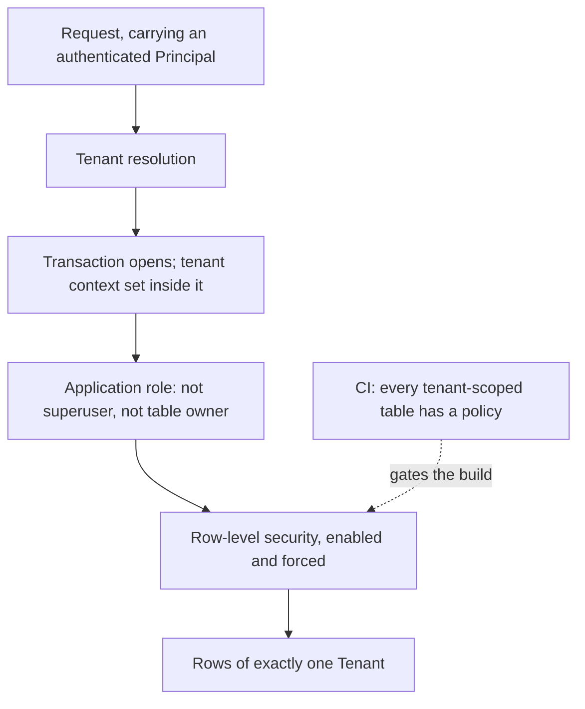

# Multi-Tenancy

[ADR-0011](../adr/adr-0011-tenant-isolation-shared-schema-rls.md) chose isolation by shared schema
with row-level security and named this document as its home. This is where that decision becomes an
implementable design: the enforcement stack, what makes it hold under connection pooling, what keeps
a cross-tenant reference out of the schema, what happens to the stores row-level security does not
reach, and what the promotion path forbids from the first commit.

**This document is informative.** Only [`../30-protocol/`](../30-protocol/) and
[`../40-governance/`](../40-governance/) are normative ([`../README.md`](../README.md) section 3).
The rules here bind because ADR-0011 decided them and
[`../40-governance/threat-model.md`](../40-governance/threat-model.md) section 8 restates them as
controls; this document links rather than restating, so there is one copy to keep true. Orchestra is
pre-customer, and no schema has been written. The datastore is PostgreSQL
([ADR-0021](../adr/adr-0021-postgresql-is-the-datastore.md)), chosen against the capabilities this
document states; those capabilities, not the product, remain the requirement.

## 1. What is scoped, and what is not a boundary

**Tenant** is the unit of data isolation, billing, configuration and audit
([`../GLOSSARY.md`](../GLOSSARY.md)). Invariant **I1** of
[`../20-domain/domain-model.md`](../20-domain/domain-model.md) puts a tenant identifier on every
persisted record, emitted event and log line, and exempts no entity.

**Workspace is not an isolation boundary.** Row-level security is enforced on the Tenant, so a
Workspace scopes delegated administration and visibility only. Treating one as a security boundary
is a defect, not a design variant — the domain model and threat model both say so. Workspace
visibility is an access-control question and belongs to
[`identity-and-access.md`](identity-and-access.md).

## 2. The enforcement stack

Four layers, of which only the fourth is a process rather than a mechanism. They are ADR-0011's
decision, restated normatively as control **C5** and the T4 controls of
[`../40-governance/threat-model.md`](../40-governance/threat-model.md) section 8. That is the copy
to keep true; what this document adds is the failure mode of each layer.

| Layer | Fails when |
| --- | --- |
| Non-nullable tenant identifier on every tenant-scoped table | A table ships without one |
| Row-level security enabled **and forced** | A path connects as superuser |
| Application role that is neither superuser nor owner | Tooling reuses the migration role |
| CI over the tenant-scoped table set | The check enumerates nothing and passes |

The load-bearing property is that a missing `WHERE tenant_id = ?` in application code is not
sufficient on its own to cross a boundary. That is ADR-0001's requirement, and it is the only reason
to accept a shared schema at all.

**The mechanism is written as capabilities, and the engine was chosen against them.** Read the four
layers, and the vocabulary the rest of this document uses — forced policies, ownership as a
privileged path, transaction-scoped context, pooler modes named transaction-level and
statement-level — as the acceptance criteria
[ADR-0021](../adr/adr-0021-postgresql-is-the-datastore.md) was written against when it chose
PostgreSQL. An engine satisfying ADR-0011 has to enforce row-level security itself, force it so
ownership does not exempt, admit an application role that neither owns the tables nor holds an
attribute bypassing the policy, and scope session context to a transaction. ADR-0021 gives each
capability its PostgreSQL spelling. The capabilities stay the requirement: a later change of engine
is judged against this section, not against PostgreSQL's behaviour.

## 3. Tenant context under connection pooling

This is the failure mode the design exists to survive: a pooled or multiplexed connection carrying
one request's tenant context into another's. It is not exotic — it is what a pooler does if
context is set once per connection. The mechanism follows in three steps.

1. **Context is set inside the transaction, not on the connection.** A connection-scoped setting
   survives the request that set it and is visible to whoever the pooler hands the connection to
   next. A transaction-scoped setting is discarded at commit or rollback with no cleanup step to
   forget.
2. **Every tenant-scoped statement runs inside a transaction**, including single-statement reads.
   Without this, a statement executed outside a transaction runs with whatever context the physical
   connection last held — which under transaction-level or statement-level pooling is another
   request's.
3. **The absence of context denies rather than permits.** A policy that resolves to *all rows* when
   the context is unset converts a forgotten `set` into a silent cross-tenant read. The policy shape
   is chosen so that an unset context matches nothing.

Two costs worth naming. Context-setting is per transaction, so it sits on every request path — one
additional statement, or the first statement of a batch. And the correctness of the whole scheme
depends on the pooler's mode, which is deployment configuration rather than application code.
ADR-0011 already requires testing against the pooler in use rather than only a direct connection;
that test is deployment-shaped, and belongs with the container owning the pool
([`containers.md`](containers.md)).

## 4. Roles and the privileged paths

Three role classes, separated because one of them can turn the mechanism off.

| Role | Used by | Relationship to row-level security |
| --- | --- | --- |
| Application role | Gateway, Runtime, Policy Enforcement Points | Subject to it; sets context per transaction |
| Migration/owner role | Schema migration only | Owns tables; forced policy still applies, but it can alter policy |
| Operator role | Support, metering aggregation, incident response | Deliberately cross-tenant; boundary B6 of [`../40-governance/threat-model.md`](../40-governance/threat-model.md) |

Forcing row-level security removes the ordinary owner exemption, but ownership still carries the
right to change the policy. Ownership is therefore a privileged path in its own right, not a solved
problem: migration tooling holds it, runs on a schedule nobody watches, and is the realistic
offender ADR-0011 names.

Operator access is cross-tenant by construction — metering under
[ADR-0009](../adr/adr-0009-meter-first-defer-tiering.md) and support both need it. It is unmade in
both respects. Whether operator work reaches a Policy Enforcement Point at all or only the datastore
is undecided, and so is how it is *attributed* under invariant I2 — one decision rather than two,
because attribution is precisely what an enforcement point would need.
[`../40-governance/audit-model.md`](../40-governance/audit-model.md) owns it and needs an ADR.
Meanwhile [`../40-governance/policy-model.md`](../40-governance/policy-model.md) rule N2 blocks any
such path through an enforcement point, because an unattributable permission has nothing to
attribute to.

## 5. The CI control, and what it must enumerate

ADR-0011 makes the build the control rather than a reviewer's memory, which requires the check to
know which tables are tenant-scoped.

**Derived from invariant I1, the exempt set is the maintained list, not the scoped set.** I1
puts a tenant identifier on every persisted record and exempts no entity, so the check treats every
table as tenant-scoped by default and requires an explicit, reviewed exemption entry for any that is
not. A list of what is scoped would omit the new table, which is precisely the failure the check
exists to catch; a list of what is exempt cannot, because a new table is scoped by omission.

The realistic exemptions are few and structural: schema-migration bookkeeping, non-tenant enumerated
reference data that ships with the schema, and the tenant directory of section 7 — which is
keyed by Tenant and must be readable *before* tenant context exists, so it holds routing facts and
nothing else.

Two further properties. The check must fail when it enumerates zero tables, because a check that
scans nothing and passes is the same class of defect as a commit-range check reporting failure
having scanned nothing. And it must assert the role posture as well as the table posture — the
application role neither owning the tables nor holding a bypass attribute — because a correct
policy under a bypassing role is not a control.

Two more follow from [ADR-0023](../adr/adr-0023-no-foreign-key-constraints.md). The check fails on
any `FOREIGN KEY` constraint in a service schema, and on a reference column whose table's write
policy carries no existence clause for it, because a policy that forgets one admits a cross-tenant
identifier without complaint.

## 6. Cross-tenant references — why filtering is not forbidding

[`../40-governance/tool-authorization.md`](../40-governance/tool-authorization.md) rule **TA2**
requires that a capability grant name a Tool in the same Tenant's Tool Catalog, and that a grant
against another Tenant's Tool not be creatable. Row-level security does not deliver that. It
*filters*: a statement sees the rows the policy admits. A referential-integrity check is a
different mechanism, typically executed with elevated rights so constraints hold regardless of the
querying role, and it therefore does not see the policy at all. A plain foreign key from a grant to
a Tool consequently admits a row naming another Tenant's Tool, and the success or failure of the
constraint itself discloses whether that identifier exists.

**The structure that forbids it is a write policy, not a foreign key.**
[ADR-0023](../adr/adr-0023-no-foreign-key-constraints.md) removes foreign key constraints from every
schema, so that any schema can move to its own database, and puts the check in row-level security:

- Every tenant-scoped table's primary key includes the tenant identifier.
- A reference is an identifier column, and no `FOREIGN KEY` constraint exists anywhere.
- The referencing table's write policy requires, in `WITH CHECK`, that its tenant identifier is the
  transaction's tenant and that a row with that tenant identifier and the referenced identifier
  exists. The lookup runs as the application role, so another Tenant's rows are invisible to it, and
  the clause governs updates as well as inserts.

A grant naming another Tenant's Tool is then refused by the engine with exactly the error a grant
naming a Tool that does not exist receives, so the refusal discloses nothing. The check lives in the
table's own policy, so it moves with the schema.

The costs are real. Every reference adds a subquery to its table's write policy. Nothing stops a
referent being deleted while references remain, so deletion is designed per record in the owning
service. A write policy that omits its existence clause silently admits a cross-tenant identifier,
which is why section 5's control checks for one. Surface identifiers in public contracts are not the
storage key, so the mapping is one more thing to get right — and a surface identifier unique only
within a Tenant would push tenant identification into every URL and every event, a public-contract
consequence rather than a storage one. Whether the surface identifier is additionally globally
unique is not decided here; it is schema work following the datastore choice. Section 7 needs
tenant-qualified keys too, which is the argument for taking their cost once.

## 7. The promotion path

ADR-0011 makes this part of the decision: a single Tenant can be relocated to a dedicated database
**without a schema change and without any change to a public contract**, and nothing may assume that
all tenants share one connection. What that forbids, in practice:

1. **Connection resolution is per request.** A tenant-to-connection resolution step exists from the
   first commit, even while it always returns the same connection. No module-level singleton
   connection, no ambient handle, no "the database" as a global. The tenant directory it reads is
   the one store legitimately reachable without tenant context, and holds routing facts only; Tenant
   User Management owns it
   ([ADR-0022](../adr/adr-0022-tenant-user-management-owns-tenancy.md)). The name is descriptive
   rather than a term of [`../GLOSSARY.md`](../GLOSSARY.md): it is a routing lookup, and a later
   document is free to call it something else.
2. **No cross-tenant join, foreign key or transaction anywhere.** Each works today and cannot work
   after a move. There is no foreign key constraint at all
   ([ADR-0023](../adr/adr-0023-no-foreign-key-constraints.md)), and the section 6 write policies
   standing in for them live in each table's own schema, so they move with it.
3. **Operator aggregation must be expressible per Tenant.** ADR-0011 lists cross-tenant aggregation
   as an ordinary query among its positive consequences. That is true today and false the moment one
   Tenant leaves, so aggregation for metering and support is written as a per-Tenant query plus
   aggregation outside the transactional store, even while a single query would work. This is the
   sharpest tension in the decision, and it is a cost the promotion path imposes on ADR-0011's own
   stated benefit.
4. **No shared identifier generator.** A global sequence is a shared resource a relocated Tenant
   loses. Identifiers are generable independently per Tenant.
5. **Migrations are written for many databases while there is one.** Ordered, idempotent, and
   runnable per database.
6. **Isolation does not change on promotion.** The dedicated database keeps the same schema, the
   same policies and the same forced row-level security, with one Tenant in it. Promotion changes
   physical placement, not the isolation model — which is what keeps this from becoming the
   two-isolation-models option ADR-0011 rejected.

The move itself is a copy by tenant key, a verification, and a repoint of the resolver. No
sequencing, retention, duration or freeze-window commitment is made here; the procedure belongs with
the deployment topologies document planned in
[`./README.md`](README.md).

**Per-tenant deletion for erasure requests is not designed here.** ADR-0011 records it as
follow-on work, materially different from dropping a database, and bounded by audit-retention
obligations [`../40-governance/audit-model.md`](../40-governance/audit-model.md) holds open.

## 8. Stores outside the row-level-secured datastore

Row-level security covers one datastore. Every other store is a gap the CI check of section 5 does
not cover, and the threat model registers the inventory of them as this document's question. That
inventory cannot be closed pre-implementation — each store's existence follows a design not yet
written — but its *shape* is derivable now, in two rules.

**The tenant identifier is part of the addressing key, not only the value** — a cache key, an
object-storage path prefix, a stream partition key, an index field, a log field. A store scoped only
in its payload fails exactly like a query with no tenant predicate, except that nothing below the
application will catch it.

**A store not in a declared registry does not exist.** No engine-side control is available outside
the datastore, so the registry is the artifact CI can check: each entry naming the store, its
addressing key, and the test proving the key is present. That is strictly weaker than a forced
policy, and saying otherwise would be dishonest.

What is implied today by decisions already taken, with what remains open:

| Store class | Implied by | Scoping | Status |
| --- | --- | --- | --- |
| Durable run state (Checkpoint) | [ADR-0005](../adr/adr-0005-langgraph-as-compilation-target.md); runtime-supplied, never public | Tenant in the addressing key if it is not the same datastore | Whether it is separate is undecided |
| Credential and key custody | [ADR-0002](../adr/adr-0002-enterprise-segment-and-byok.md) | Per-tenant data keys — scoped by key, not by row | Custody path owned by [`identity-and-access.md`](identity-and-access.md) |
| Meter records | [ADR-0009](../adr/adr-0009-meter-first-defer-tiering.md) | Tenant-scoped by I1; reconcilable against audit | The correlating value is open in [`../40-governance/audit-model.md`](../40-governance/audit-model.md) |
| Event delivery stream | Delivery only; audit is the system of record | Tenant in the partition or subject key | Rests on [ADR-0004](../adr/adr-0004-adopt-ag-ui-event-protocol.md), **Proposed** |
| Logs, traces and telemetry | I1 requires a tenant identifier on every log line | Tenant as a first-class field | Owned by [`../60-operations/`](../60-operations/) |
| Large-payload object storage | Only if Evidence Sets are materialised by value | Tenant as a path prefix | By value or by reference is open in [`../40-governance/approval-workflows.md`](../40-governance/approval-workflows.md) |
| Connector-side local state | [ADR-0007](../adr/adr-0007-outbound-connector-for-enterprise-reachability.md), **Proposed** | Single-tenant by deployment | Planned `connector.md`; not settled architecture |

Caches and search indexes appear in the threat model's list and in no decision. Both rules govern
them if they are introduced; neither is assumed here. The same conditional covers
[ADR-0013](../adr/adr-0013-fail-closed-policy-decision-writes.md), which requires that a Policy
Decision survive a crash ahead of the gated action and deliberately leaves the mechanism open:
whether that introduces a store outside this datastore at all is a property of the mechanism rather
than of the requirement, and the enforcement path owns the entry if it does
([`data-plane.md`](data-plane.md) section 6).

## 9. What this design does not protect against

- **A compromised application role reaches every Tenant**, subject to the context it sets. Row-level
  security constrains a buggy query, not an attacker controlling the process that sets the context.
- **No resource isolation.** Noisy-neighbour effects are shared. Quota work under
  [ADR-0006](../adr/adr-0006-model-layer-as-credential-broker.md) addresses provider capacity, not
  datastore contention, and is not a substitute.
- **Ownership remains a bypass of the policy definition**, if not of the policy itself.
- **Everything in section 8** rests on naming discipline and a registry rather than an engine.
- **The engine is trusted by assumption.** If PostgreSQL's row-level security implementation is
  wrong, every control here fails silently — the threat model lists it in that set. ADR-0021 treats
  that as a revisit criterion, because no control in this document could mitigate it.

## 10. Open questions

| Question | Decided by | ADR required? |
| --- | --- | --- |
| Per-tenant deletion for erasure requests under a shared schema, against audit-retention obligations | ADR-0011's follow-on, with [`../40-governance/audit-model.md`](../40-governance/audit-model.md) and legal input | **Yes** — it spans retention, the definition lifecycle and metering |
| Whether per-tenant encryption keys extend beyond credentials to data at rest | Left open by ADR-0011; ADR-0002 covers only credentials | **Yes** — a storage and key-management commitment |
| The complete inventory of stores outside the datastore; section 8 fixes the scoping rule and the registry, not the list | [`containers.md`](containers.md) and [`data-plane.md`](data-plane.md) as each store is introduced; the planned `connector.md` for the connector's own | No — the rule holds on any inventory |
| Whether platform-operator work reaches a Policy Enforcement Point at all or only the datastore, and how it is attributed under invariant I2 — one question, not two | [`../40-governance/audit-model.md`](../40-governance/audit-model.md), which owns the general case; boundary B6 of [`../40-governance/threat-model.md`](../40-governance/threat-model.md) records it unmade | **Yes** — it changes the identity model and the audit contract |
| By what structure a cross-tenant grant is kept out of the datastore, given that row-level security filters rather than forbids — answered in section 6 by write policies that require the referent to exist in the same Tenant, with no foreign key constraint, recorded here so the choice is traceable rather than resident in prose | This document, which [`../40-governance/tool-authorization.md`](../40-governance/tool-authorization.md) rule TA2 assigns it to | Decided by [ADR-0023](../adr/adr-0023-no-foreign-key-constraints.md) |
| Whether a surface identifier is globally unique as well as tenant-qualified, and the identifier shape | Schema work after the datastore decision; constrained by [`../VERSIONING.md`](../VERSIONING.md) once an identifier appears in a public contract | No |
| The promotion procedure itself — sequencing, verification and cutover | The planned `deployment-topologies.md` listed in [`./README.md`](README.md) | No — section 7 fixes the constraints, not the runbook |
| Whether promotion is offered commercially, to whom, and on what terms | A design-partner conversation; ADR-0011 designs the path without committing to sell it | No |
| Whether Workspace-scoped visibility is enforced in application code, given it is not an isolation boundary | [`identity-and-access.md`](identity-and-access.md) | No |
