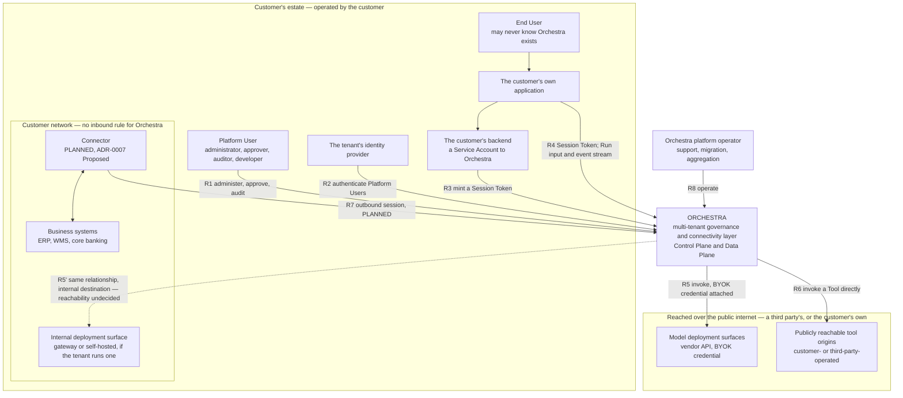

# System Context

The [C4](https://c4model.com) Level 1 view: Orchestra as one box, and everything it talks to. It
fixes where the system boundary falls, because every later view in this section subdivides the box
this one draws. Level 2 is [`containers.md`](containers.md); nothing here decomposes Orchestra.

**This document is informative.** Only [`../30-protocol/`](../30-protocol/) and
[`../40-governance/`](../40-governance/) are normative, per
[`../README.md`](../README.md) section 3. Where a rule binds it is cited, not restated — a second
copy of a normative rule is a defect waiting to drift. Terms carry the meanings in
[`../GLOSSARY.md`](../GLOSSARY.md), including **Control Plane** and **Data Plane**, which are not
redefined here.

Orchestra is **pre-implementation and pre-customer**. No platform code exists; `ui-template/` is a
front-end starting point, not a running product. Every claim below about what an enterprise will
accept is an assumption, and the ones that matter most are named in section 7.

## 1. Three operators, one boundary that matters

At Level 1 there are exactly three parties, and the useful question about any box is *who operates
it* — who patches it, who is paged when it fails, and whose security review it must pass.

| Operated by | What | Consequence |
| --- | --- | --- |
| Orchestra | The Control Plane and the Data Plane, as one hosted multi-tenant service ([ADR-0001](../adr/adr-0001-product-shape-multi-tenant-saas.md)) | Orchestra is a processor of customer data and carries the DPA, residency and retention obligations ADR-0001 accepts |
| The customer | Their own application and backend, their identity provider, their business systems, and — under **Proposed** [ADR-0007](../adr/adr-0007-outbound-connector-for-enterprise-reachability.md) — a Connector inside their network | Software Orchestra ships but does not operate cannot be force-upgraded; version skew is permanent, not exceptional |
| A third party, contracted by the customer | Model deployment surfaces reached under BYOK ([ADR-0002](../adr/adr-0002-enterprise-segment-and-byok.md), [ADR-0006](../adr/adr-0006-model-layer-as-credential-broker.md)) | Orchestra holds the credential and never the commercial relationship; it does not resell tokens |
| The customer, again | A Deployment Surface they operate themselves — an internal OpenAI-compatible gateway or a self-hosted endpoint (GLOSSARY.md) | The same relationship R5 as a vendor API, but its destination is inside the customer network, so R5 straddles the boundary |
| The customer or a third party, per Tool | A publicly reachable Tool origin, which R6 reaches by address rather than by operator — ADR-0007 option 1 exposes the customer's own systems this way | Reachability is not evidence of trust. An origin the customer runs and one a vendor runs are the same edge to Orchestra, so R6's controls cannot depend on which it is |

Control Plane and Data Plane are both inside the Orchestra box at this level. They are one operated
service with two surfaces, not two systems, and separating them on a context diagram would imply a
deployment split that no decision has taken — see section 7.

## 2. The context diagram

The diagram's load-bearing feature is the `NETWORK` boundary and the direction of the arrow that
crosses it. Every other edge is ordinary SaaS integration.

## 3. The relationships

| ID | Edge | What crosses | Grounding |
| --- | --- | --- | --- |
| R1 | Platform User → Orchestra | Agent, Workflow and Policy definitions; Tool registrations; Model Bindings; approval decisions; audit and usage reads. This is the Control Plane, and the Platform User is the seat-billable identity | [ADR-0003](../adr/adr-0003-governance-layer-positioning.md), [ADR-0009](../adr/adr-0009-meter-first-defer-tiering.md) |
| R2 | Tenant identity provider → Orchestra | Authentication of Platform Users. Orchestra does not hold their passwords and is not their directory | [`../00-overview/personas.md`](../00-overview/personas.md) |
| R3 | Customer backend → Orchestra | A request to mint a Session Token for a named end-user subject, authenticated by a tenant credential the backend holds server-side. The backend is a Service Account | GLOSSARY, [`../20-domain/domain-model.md`](../20-domain/domain-model.md) section 3 |
| R4 | Customer application → Orchestra | Run input and UI Actions outbound; the Agent Event stream inbound, under the Orchestra-versioned profile of **Proposed** [ADR-0004](../adr/adr-0004-adopt-ag-ui-event-protocol.md). Authority is the Session Token from R3 and nothing else | ADR-0004, GLOSSARY |
| R5 | Orchestra → model deployment surface | Prompts and assembled context out; completions and token counts back. The endpoint is tenant-configured and the credential is the tenant's, custodied under envelope encryption | ADR-0002, ADR-0006 |
| R6 | Orchestra → publicly reachable tool origin | A Tool invocation whose arguments were composed by a model, and results returning into the model's context. The origin may be a third party's or the customer's own, publicly exposed. The fast path of ADR-0007, and the only path if ADR-0007 is rejected | ADR-0007 option 1, [`../40-governance/threat-model.md`](../40-governance/threat-model.md) B4 and B5 |
| R7 | Connector → Orchestra | An outbound session raised from inside the customer network, multiplexing Tool traffic inward. **Planned, not settled** | ADR-0007, **Proposed** |
| R8 | Orchestra platform operator → Orchestra | Support access, migration tooling and cross-tenant aggregation for metering. Legitimate and cross-tenant by design; how it is attributed is unmade | [`../40-governance/threat-model.md`](../40-governance/threat-model.md) B6 |

R1 and R4 are separate edges rather than one, and that separation is the product. R1 is a person
holding an Orchestra account, authenticated through their employer's directory. R4 is an application
holding a delegated, short-lived credential on behalf of someone Orchestra never authenticates.
Collapsing them would make the End User an Orchestra user, which
[`../00-overview/personas.md`](../00-overview/personas.md) section 4 rejects and
[ADR-0009](../adr/adr-0009-meter-first-defer-tiering.md) prices against.

## 4. The network boundary, which the v0.1 architecture omitted

The v0.1 brief drew tool origins hanging off a client manager as though they were reachable. They
generally are not. The runtime is in Orchestra's cloud; the customer's ERP, WMS and core banking
systems are inside a network that accepts no inbound connection from third-party SaaS without a
security review that frequently fails. There was no line between those two boxes. There is one here,
and crossing it is a product rather than a configuration flag.

That product is the Connector, and it rests entirely on
[ADR-0007](../adr/adr-0007-outbound-connector-for-enterprise-reachability.md), which is **Proposed**
and therefore not binding. Three things follow, and none of them is settled by ADR-0007 itself: the
first holds by the ADR-status convention rather than by the ADR, the second is a property of the
option the ADR proposes, and only the third is worth acting on before the ADR binds.

1. **The Connector may be described as planned, never as architecture.** Its enrolment, health,
   upgrade and local-audit design belong to the planned `connector.md`, listed in
   [`README.md`](README.md) and not yet written. If the ADR is rejected, R7 and the `CONN` box leave
   this diagram, R6 becomes the only tool path, and nothing else on the diagram changes — which is
   why reachability is kept as an axis separate from Tool identity in
   [`../20-domain/domain-model.md`](../20-domain/domain-model.md) section 5.
2. **The arrow points outward.** A session established from inside the customer network needs no
   inbound firewall rule. The cost is that Orchestra cannot reach a Connector that has not called
   home, so connector reachability becomes a runtime condition rather than a static fact.
3. **The seam is worth allowing for regardless.** ADR-0007's position is that a tool connection is
   either a direct session or a tunnelled one, indistinguishable to everything above it. That
   position is exactly as unbound as the ADR carrying it, and nothing Accepted requires it. It is
   still the one of the three worth acting on early, on cost rather than on status: the seam is
   cheap to allow for now and expensive to retrofit, because it touches cancellation, streaming and
   the error taxonomy.

Orchestra also runs software inside a customer's perimeter under this option, which is a different
class of obligation from operating a SaaS: signed releases, minimal privilege, tamper-evident local
audit, and no ability to force an upgrade.

## 5. What does not cross a boundary

Stating the non-edges is as load-bearing as stating the edges, because each one is a mistake an
implementation could make without any diagram forbidding it.

- **A tenant API key never reaches a browser or a mobile bundle.** Only Session Tokens do — short
  lived, narrowly scoped, minted at the backend's request on R3 and used on R4. The definition is in
  [`../GLOSSARY.md`](../GLOSSARY.md); their lifetime and rotation are undecided and belong to
  [`identity-and-access.md`](identity-and-access.md).
- **No rail appears on any customer-facing edge.** The orchestration runtime is a compilation target
  ([ADR-0005](../adr/adr-0005-langgraph-as-compilation-target.md)); provider-native streaming
  formats stop at the Model Broker
  ([ADR-0006](../adr/adr-0006-model-layer-as-credential-broker.md));
  Checkpoints are runtime state and are never addressable
  ([`../20-domain/domain-model.md`](../20-domain/domain-model.md) invariant I6). R4 carries the
  Orchestra profile and R1 carries Orchestra resources — nothing else.
- **The End User's identity is asserted, not verified.** Orchestra never authenticates them; it
  trusts the customer backend's assertion, which is boundary B1 in
  [`../40-governance/threat-model.md`](../40-governance/threat-model.md) and the reason R3 exists as
  its own edge.
- **No tenant data crosses to another tenant.** Isolation is enforced by the datastore under
  [ADR-0011](../adr/adr-0011-tenant-isolation-shared-schema-rls.md), not by anything drawn here; see
  [`multi-tenancy.md`](multi-tenancy.md). R8 is the one deliberately cross-tenant edge on the
  diagram. Whether an operator path crosses a Policy Enforcement Point at all, or reaches only the
  datastore, is not settled here or anywhere else;
  [`../40-governance/audit-model.md`](../40-governance/audit-model.md) owns that question together
  with the attribution one registered in section 7, and
  [`../40-governance/policy-model.md`](../40-governance/policy-model.md) N2 blocks such a path
  meanwhile.
- **Model tokens are metered and reported, never billed.** Under BYOK the customer already pays the
  provider directly; Orchestra reports usage as a visibility feature (ADR-0009).
- **Orchestra initiates no connection into the customer network for Tool traffic.** Under ADR-0007
  every crossing of the `NETWORK` boundary for a Tool call is customer-initiated. If that ADR is
  rejected in favour of publicly exposed origins, this line changes and R6 carries the traffic
  instead. The statement is scoped to Tool traffic deliberately: R5' would cross the same boundary
  inbound and Orchestra-initiated whenever a tenant's Deployment Surface is an internal gateway,
  and whether that is reachable at all is registered below.

## 6. Registered questions that reach this document

No row in any register names `system-context.md` as its decider. Three name
[`../10-architecture/`](../10-architecture/) as a section; each is answered here only to the extent
Level 1 can answer it, and handed on precisely otherwise.

**The shape and scope of the egress allow-list**
([`../40-governance/threat-model.md`](../40-governance/threat-model.md) T6). The posture is not the
open part: T6 is normative, it derives default-deny from its own analysis rather than inheriting it,
and this view is bound by it. What remains open is the list's shape, which needs an ADR because it
spans the Model Broker, Tool invocation and the Connector — the threat model classifies it that
way, and this document repeats that classification.

What this view contributes is a snapshot of what such a list has to cover. Today's diagram carries
three outbound destination classes on tenant-supplied input — R5, R5' and R6 — and R7 is not
among them, because it is inbound in the direction that matters. Two further outbound classes are
registered in section 7 and cannot be drawn yet: the channel an approver is reached on, and audit
forwarding. Both would be tenant-configured, so the scope grows as they are settled. Three is where
the count stands, not a bound the ADR can rely on.

**The datastore engine** (same register). Not a Level 1 concern: no datastore appears on this
diagram, because it is inside the Orchestra box. ADR-0011 constrains it to an engine that enforces
row-level security itself and selects none. The criteria an engine has to meet are
[`multi-tenancy.md`](multi-tenancy.md) sections 2 to 5, and that document's register is where the
decision sits; [`containers.md`](containers.md) names the container and the constraints and
explicitly does not take it.

**Where policy evaluation executes**
([`../40-governance/policy-model.md`](../40-governance/policy-model.md)). Also not Level 1 — a
Policy Enforcement Point is a component of the Data Plane, so the question belongs to
[`data-plane.md`](data-plane.md) and [`containers.md`](containers.md).

## 7. Open questions

"ADR required" means the choice is costly to reverse or spans components, and must not be settled in
prose. Where another document owns a question, its classification is repeated rather than revised.

| Question | Decided by | ADR required? |
| --- | --- | --- |
| Whether a hybrid topology exists — hosted Control Plane, customer-deployed Data Plane — which would move the Orchestra box across the network boundary and rewrite this diagram | Design-partner validation first; then `deployment-topologies.md`, planned in [`README.md`](README.md) | **ADR required** — it is ADR-0001's own revisit criterion and would supersede part of it |
| Whether "BYOK" means spend control or means data must not egress the customer perimeter, which decides whether the question above is hypothetical | ADR-0002 follow-on and ADR-0007 validation step 3; a design-partner conversation, not a document | **ADR required** if it forces the hybrid topology; otherwise closed by evidence |
| The shape and scope of the egress allow-list. The default-deny posture is not in question: [`../40-governance/threat-model.md`](../40-governance/threat-model.md) T6 makes it normative and binding | Connector and model-broker designs in this section; see section 6 | **ADR required** — that document's classification |
| Whether an internal Deployment Surface inside the customer network is reachable at all on R5', or only through the Connector | `connector.md`, planned in [`README.md`](README.md), with the Model Broker design and ADR-0007's validation | **ADR required** if reaching it needs the Connector, which extends ADR-0007 from Tool traffic to model traffic; otherwise the Model Broker design closes it |
| Whether model traffic may be proxied through the Connector so BYOK credentials never leave the customer perimeter, adding an edge this diagram does not carry | `connector.md`, planned in [`README.md`](README.md), with the Model Broker design; void if ADR-0007 is rejected | **ADR required** — it relocates credential custody, which ADR-0002 places with Orchestra |
| How an approver is reached, which is an Orchestra-initiated outbound edge to a notification channel that this diagram cannot yet draw | [`../40-governance/approval-workflows.md`](../40-governance/approval-workflows.md); a product decision, per its register | Later document |
| Whether Orchestra forwards audit continuously into a customer SIEM, or exports on demand; forwarding would add a standing outbound edge and an availability obligation | [`../40-governance/audit-model.md`](../40-governance/audit-model.md); a design-partner conversation, per its register | **ADR required** — that register's classification |
| How platform-operator action on R8 is attributed, given that invariant I2 admits no unattributed action and no Principal subtype covers it | [`../40-governance/audit-model.md`](../40-governance/audit-model.md), with [`../40-governance/threat-model.md`](../40-governance/threat-model.md) | **ADR required** — that register's classification; it changes the identity model |
| Whether the tenant identity provider on R2 also authenticates Service Accounts, or a separate credential type does | [`identity-and-access.md`](identity-and-access.md) | Later document |
| The datastore engine, which this view deliberately does not surface | [`multi-tenancy.md`](multi-tenancy.md) section 10, against the criteria its sections 2 to 5 state; constrained by ADR-0011 | **ADR required** — that register's classification; costly to reverse |
| Where policy evaluation executes — in process at each enforcement point, or as a separate component | [`data-plane.md`](data-plane.md) and [`containers.md`](containers.md) | Later document; an ADR if it constrains the datastore |
