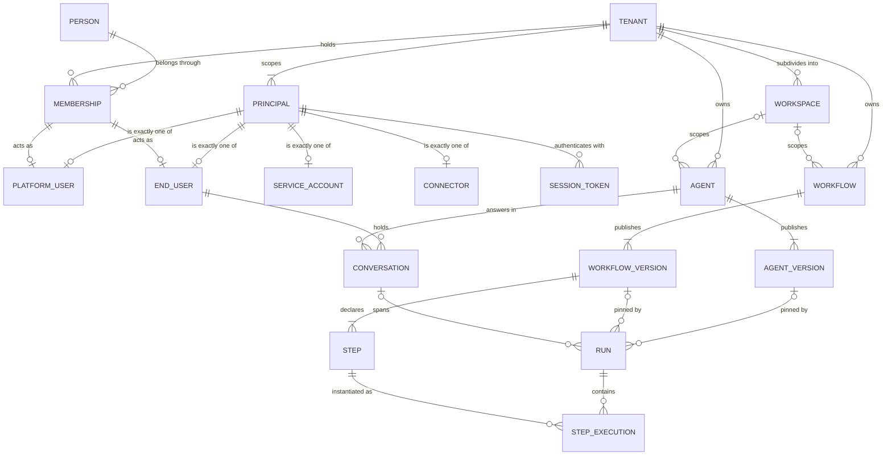
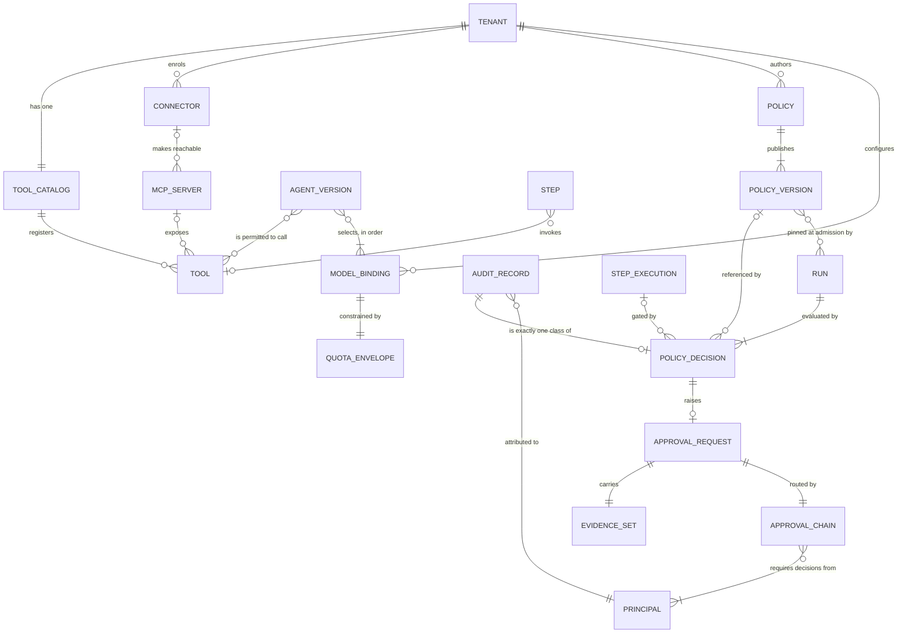

# Domain Model

[`../GLOSSARY.md`](../GLOSSARY.md) fixes what each term means. This document fixes how the entities
relate: cardinality, ownership, lifetime, and which entity is the unit of what. Where the two
disagree, the glossary wins and this document is the defect.

## 1. Scope

**In scope.** Entities, the relationships between them, cardinality, which entity owns which, and
what survives the deletion of what.

**Out of scope.** Attributes beyond the identifiers that carry a relationship; keys; indexes;
partitioning; and the datastore engine, which
[ADR-0021](../adr/adr-0021-postgresql-is-the-datastore.md) decides as PostgreSQL within the
constraint [ADR-0011](../adr/adr-0011-tenant-isolation-shared-schema-rls.md) sets. Nothing here may
be read as a table layout.

Orchestra is pre-implementation and pre-customer: no platform code exists and no schema has been
written. Of the three **Proposed** ADRs one reaches this document —
[ADR-0007](../adr/adr-0007-outbound-connector-for-enterprise-reachability.md), on which the Connector
entity and its reachability edge depend. That dependency is marked where it occurs.

## 2. Invariants

These are normative. Every entity and relationship below is subject to them.

**I1 — Tenant scoping is universal.** Every persisted record, every emitted event and every log line
MUST carry a tenant identifier, with one exception: a Person is global, and a Tenant sees it only
through its own Membership, under the same forced row-level security
([ADR-0024](../adr/adr-0024-global-person-with-tenant-memberships.md)). Isolation is enforced by
row-level security in the datastore, not by application code
([ADR-0001](../adr/adr-0001-product-shape-multi-tenant-saas.md),
[ADR-0011](../adr/adr-0011-tenant-isolation-shared-schema-rls.md)): a missing tenant predicate in
application code MUST NOT be sufficient on its own to cross a tenant boundary. Tenant ownership is
therefore an implicit edge from every entity below, drawn only where it carries extra meaning.

**I2 — One action, one Principal.** Every Principal resolves to exactly one identity, and every
action in the audit log resolves to exactly one Principal. There is no shared, anonymous or
unattributed action. It is a modelling constraint, not a logging convention.

**I3 — A Run pins its definition version for life.** A Run executes the Agent version or Workflow
version it started with, to completion, even after that version is retired. In-flight executions are
never migrated ([ADR-0008](../adr/adr-0008-declarative-workflow-definitions.md),
[VERSIONING.md](../VERSIONING.md) section 8, rules W1–W4). The pin is a relationship to an immutable
version, not a version number copied onto the Run. The same pin covers governance: a Run holds the
Policy versions in force at its admission for the life of the Run, so editing a Policy MUST NOT
change the verdict a Run in flight receives
([ADR-0012](../adr/adr-0012-policy-decisions-are-audit-records.md)).

**I4 — Step Execution is the unit of idempotency, retry and compensation. Not the Run.** Idempotency
keys are scoped to a Step Execution; compensation is declared on a Step and applies to a Step
Execution. The `Idempotency-Key` header on the Gateway ([VERSIONING.md](../VERSIONING.md) section 4)
is request deduplication at the API boundary — a different mechanism with a different lifetime, and
conflating the two is the error this invariant prevents. A failed model call is safe to retry; a
partially executed Tool call is not, and the Step Execution is what distinguishes them.

**I5 — Registration is not permission.** A Tool existing in a Tenant's Tool Catalog and an Agent being
permitted to call it are two relationships, created by two administrative acts and audited
separately. Authorization is deny-by-default: registration grants nothing.

**I6 — Checkpoint is not a domain entity.** Durable Run state permitting suspension and resumption is
supplied by the runtime ([ADR-0005](../adr/adr-0005-langgraph-as-compilation-target.md)). It is not
addressable, not versioned by Orchestra, not exported, and MUST NOT appear in any public contract.
The domain relies on the *property* — a Run can suspend at an Approval Request for days and
resume — and models nothing of the mechanism, so it appears in neither diagram.

**I7 — A Policy Decision is a class of Audit Record.** Not a separate entity, and not a neighbouring
record that an Audit Record points at
([ADR-0012](../adr/adr-0012-policy-decisions-are-audit-records.md)). Everything true of an Audit
Record — append-only, immutable, tenant-scoped, resolving to exactly one Principal — is true of it
without restatement, and section 6 adds only what is particular to the governance class. One class
means one lifetime, one retention question and one export format rather than two of each.

## 3. Tenancy and identity

[ADR-0009](../adr/adr-0009-meter-first-defer-tiering.md) adds Tenant, Workspace, Principal, Platform
User, End User and Service Account to the domain model, which v0.1 omitted entirely. This section is
where they land. They are required by approval and audit independently of billing: approvals record
who approved, audit records who requested, and only then can seats be counted.

| Entity | Scoped to | Cardinality | Unit of |
| --- | --- | --- | --- |
| Tenant | — | Root of the model | Isolation, billing, configuration, audit |
| Workspace | Tenant | Tenant 1 : 0..* Workspace | Delegated administration |
| Principal | Tenant | Tenant 1 : 1..* Principal | Attribution |
| Platform User | Tenant, as a Principal | Disjoint subtype of Principal | **Seat billing** |
| End User | Tenant, as a Principal | Disjoint subtype of Principal | Measurement — **never seat-billed** |
| Service Account | Tenant, as a Principal | Disjoint subtype of Principal | Machine-to-machine attribution |
| Connector | Tenant, as a Principal | Disjoint subtype of Principal | Reachability — see section 5 |
| Person | None — global, and visible to a Tenant only through a Membership | One per human | A human's attributes, held once across every Tenant |
| Membership | Tenant | Person 1 : 0..* Membership; a Membership has at most one Platform User and at most one End User | A Person's place in one Tenant |
| Session Token | Principal | Principal 1 : 0..* Session Token | Short-lived client authority |

**Workspace is optional and is not an isolation boundary.** An Agent, Workflow, Connector or Policy
carries a mandatory Tenant reference and an optional Workspace reference. Row-level security is
enforced on the Tenant, so a Workspace scopes administration and visibility, not isolation. A
control that treats a Workspace as a security boundary is wrong.

**The four Principal subtypes are disjoint and exhaustive.** A Principal is exactly one of them.
Making the Connector a Principal is deliberate: traffic arriving through the connector fabric is
attributable in the same audit trail as a human approval, with no second attribution mechanism.

**Platform User is the seat-billable identity; End User is measured and is not.** The two differ by
orders of magnitude — tens to hundreds of administrators against a potentially very large embedded
population — and mispricing that distinction is the failure ADR-0009 exists to prevent.

**A person administering two Tenants is two Principals, and one Person.** A Principal is
tenant-scoped, so for metering that person is still two Platform Users. The human behind them is
recorded once: **a Person is global, and each Tenant holds a Membership for it**
([ADR-0024](../adr/adr-0024-global-person-with-tenant-memberships.md)). A Platform User and an End
User each belong to exactly one Membership, a Person never acts, and a Tenant sees a Person only
through its own Membership. Only a subject the identity provider verified joins Memberships across
Tenants; an End User vouched for by a customer's backend is a Person known to that Tenant alone.
Which credential class a Service Account authenticates with belongs to
[`identity-and-access.md`](../10-architecture/identity-and-access.md).

**Platform operator action has no Principal subtype.** Work Orchestra performs on its own behalf —
scheduled maintenance, support access, migration tooling — is none of the four subtypes, yet I2
admits no unattributed action. Whether that becomes a fifth subtype or a separate operator
attribution path is **unmade**, would be decided by the audit and threat models in
[`../40-governance/`](../40-governance/), and is the largest hole in this section.

## 4. Execution

**Definitions and their versions are distinct entities.** An Agent or Workflow is a stable, named
thing; publishing it creates an immutable version, never afterwards edited
([VERSIONING.md](../VERSIONING.md) section 8, W1). The glossary calls Agent and Workflow "versioned,
declarative" definitions without naming the version separately; this document needs the finer grain
to state I3 precisely and writes it as *Agent version* and *Workflow version* rather than coining a
term. If the distinction survives review the glossary should gain those terms — a second word for
the same thing would be a defect — and section 11 registers that with the other glossary gaps. A
Policy is versioned on the same terms; section 6 covers it.

**A Run targets exactly one of the two** — an Agent version or a Workflow version, never both and
never neither. A Workflow version declares one or more Steps; a Step Execution is one execution of
one Step within one Run.

**A Conversation spans Runs, and a Run belongs to at most one Conversation.** A Workflow Run started
by a schedule or by a Service Account has no Conversation. Whether one Conversation may span Runs of
*different* Agents is **not decided**; the glossary says a Conversation is between an End User and an
Agent, and this document holds to that. *Message* appears in that definition with no glossary entry
of its own — one of the glossary gaps section 11 registers.

**A Tool call inside an Agent Run is not a Step Execution.** A Step is a node in a Workflow, so a
Run of an Agent — where the model chooses the sequence at runtime — has no Steps, no Step boundaries
and therefore no Step Executions. That is settled:
[`../40-governance/policy-model.md`](../40-governance/policy-model.md) E4 is normative, and
[`../50-workflows/execution-semantics.md`](../50-workflows/execution-semantics.md) states the same.

What holds instead: the Tool enforcement point governs every Tool invocation in an Agent Run, E4
makes it non-optional there, and the invocation is itself the anchor for idempotency and
compensation — CLAUDE.md rule 6 holds everywhere, so a partially executed tool call is never blindly
retried whatever the Run's shape.

What remains open is narrower than it looks: what that anchor is *called*, and what its Policy
Decision, Audit Record and meter record key on. Until that is named, the compensation and metering
guarantees are exact for Workflow Runs and unnamed rather than undefined for Agent Runs.

## 5. Capability and connectivity

A **Tool** is a single invocable business capability with a versioned typed schema, a Side-Effect
Class and an authorization binding. It reaches Orchestra through an MCP Server or a native adapter —
exactly one origin per Tool. The two relationships I5 separates are these:

| Relationship | Meaning | Cardinality | Administrative act |
| --- | --- | --- | --- |
| Tool Catalog registers Tool | The Tool exists and is available for binding in this Tenant | Tenant 1 : 1 Catalog; Catalog 1 : 0..* Tool | Registration by a Platform User |
| Agent version is permitted to call Tool | This Agent version may invoke it | Many to many, deny-by-default | A capability grant, separately audited |

A `tool` Step names exactly one Tool; every other Step type names none. Every Tool and every Step
declares a **Side-Effect Class** — `read`, `write`, `destructive`, `financial` or
`external-communication`. That is an enumerated value, not an entity with a lifecycle of its own, and
adding a value to it is a contract change under [VERSIONING.md](../VERSIONING.md) rules R2 and R3.

**Reachability is a third axis, separate from both.** An MCP Server is reached directly over HTTPS or
through a Connector, and the Tool is the same Tool either way. That edge rests on
[ADR-0007](../adr/adr-0007-outbound-connector-for-enterprise-reachability.md), **Proposed** and
binding only after design-partner validation. If it is rejected, the Connector Principal and the
reachability edge leave this model and MCP Servers are reachable only over direct HTTPS — nothing
else changes, which is the point of keeping the axes separate.

## 6. Governance

A **Policy Enforcement Point is a place in the execution path, not a record.** It is where policy is
evaluated: minimally at Run admission, before any Tool invocation, and at every Workflow Step
boundary. What persists is the **Policy Decision** — a reference to the Policy version that matched,
the inputs, the verdict and the timestamp — recorded for allows as well as denials, as the glossary
entry requires.

**Registration and the grant are inputs to the evaluation, not gates in front of it.** By I5 they
are two relationships rather than one, and both are available at the enforcement point: a Tool
absent from the Tenant's Tool Catalog, or an Agent version holding no grant to it, produces a
recorded refusal and not an unrecorded one.
[`../40-governance/policy-model.md`](../40-governance/policy-model.md) owns the full input set and
the shape of the record a failed precondition produces; this document fixes only that neither
relationship bypasses the enforcement point.

**Policies are versioned exactly as definitions are.** Publishing a Policy creates an immutable
version, never afterwards edited
([ADR-0012](../adr/adr-0012-policy-decisions-are-audit-records.md),
[VERSIONING.md](../VERSIONING.md) sections 2 and 8), so editing a Policy means publishing a new
version, and by I3 a Run keeps the versions it pinned at admission. Whether a Policy version is
scoped to a Tenant or to a Workspace is **not decided**: section 3 records the scope a Policy
carries, and ADR-0012 fixes the record model rather than Policy scope.

- Every Run has at least one Policy Decision, from admission.
- A Policy Decision references the Run, and where the enforcement point is a Step boundary, the Step
  Execution it gates.
- A Policy Decision names at most one Policy version, and holds that reference rather than the rule
  text (ADR-0012). Deny-by-default means the absence of a matching rule is itself a recorded
  outcome, so *no rule matched* is a decision, not a missing record; the same cardinality carries a
  denial reached before any Policy was evaluated at all.
- A `require_approval` verdict raises exactly one Approval Request; `allow` and `deny` raise none.
- An Approval Request carries exactly one Evidence Set and is routed by exactly one Approval Chain.
- An Approval Chain requires decisions from one or more Principals, ordered or parallel, derived
  from policy rather than stored as a static list. The glossary calls an Approval Request a *human*
  decision gate, so the deciding Principals are the human subtypes;
  [`../40-governance/approval-workflows.md`](../40-governance/approval-workflows.md) states that
  restriction normatively and the glossary entry does not yet carry it (section 11).

**The Evidence Set is what makes the approval meaningful.** It holds the exact inputs the Agent
relied on — Tool results, retrieved context, prior messages — so a human approves on the same
information the model had. Its lifetime is bound to the Approval Request and to audit retention, not
to the Run.

**Audit Records reference, they do not depend.** An Audit Record MUST remain readable after the
Agent, Workflow version, Tool, Policy or Principal it names has been deleted. It therefore holds
identifiers and the values recorded at the time of the event, not foreign keys a later deletion could
null. Audit is a product surface, not a log level. By I7 a Policy Decision is one of them and
inherits the rule rather than restating it: the Policy version it names is an identifier of exactly
that kind, and ADR-0012 bounds a Policy version's retention below by the records referencing it,
which is what keeps the reference resolvable.

**A Policy Decision MUST be durable before the gated action is attempted**
([ADR-0013](../adr/adr-0013-fail-closed-policy-decision-writes.md)); if it cannot be written, the
action MUST NOT proceed. Other Audit Records MAY be written behind the action they describe,
provided a degraded period is recoverable from the trail rather than silent. That split is a
property of the record class and MUST NOT be a runtime choice, which is why it is stated here with
the entity; [`../40-governance/audit-model.md`](../40-governance/audit-model.md) classifies each
record class within it.

The second diagram covers sections 5 to 7 together. A Tool whose origin is a native adapter has no
MCP Server edge, `POLICY_DECISION` is drawn as a subtype of `AUDIT_RECORD` under I7 exactly as the
Principal subtypes are drawn in the first diagram, and per I1 only Tenant edges carrying meaning
beyond tenant scoping are drawn.

## 7. Models

A **Model Binding** is a Tenant's configuration of one usable model: a Deployment Surface, an
endpoint, a credential reference, the customer's own model identifier and declared limits
([ADR-0006](../adr/adr-0006-model-layer-as-credential-broker.md)).

- **Deployment Surface** is an enumerated value on the Model Binding, not an entity, and is orthogonal
  to vendor: one vendor's model is reachable through several surfaces, each with its own
  authentication, identifiers, regional behaviour and quota. A `provider` field cannot express that,
  which is why there is no Provider entity here.
- The credential is held **by reference**. Under BYOK the customer supplies it and Orchestra custodies
  it under envelope encryption with per-tenant data keys
  ([ADR-0002](../adr/adr-0002-enterprise-segment-and-byok.md)). No plaintext credential is an
  attribute of any entity here, in any store, log, trace or backup.
- An Agent version selects one or more Model Bindings, **ordered**: an explicit primary and a declared
  fallback list. A Step may name one too. There is no capability-based or preference-based selection
  entity, because ADR-0006 removed that machinery from scope.
- Each Model Binding has exactly one **Quota Envelope** — the customer's own provider-side rate and
  token limits, which Orchestra MUST schedule within, and under BYOK a steady-state capacity ceiling
  rather than an exceptional failure mode. Whether an envelope is declared, discovered from the
  surface, or both, is **not decided**; ADR-0006 records that it needs a dedicated design.

## 8. Which entity is the unit of what

The table this document exists to make unambiguous.

| Question | Entity | Source |
| --- | --- | --- |
| Data isolation, billing, configuration and audit scope | Tenant | GLOSSARY, ADR-0001, ADR-0011 |
| Delegated administration | Workspace | GLOSSARY |
| Attribution of any action | Principal | GLOSSARY, invariant I2 |
| Seat billing | Platform User | ADR-0009 |
| Measured but explicitly not seat-billed | End User | ADR-0009 |
| Execution, observability, billing and audit | Run | GLOSSARY |
| Definition-version pinning | Run | ADR-0008, VERSIONING section 8 |
| Policy-version pinning at admission | Run | ADR-0012, invariant I3 |
| Idempotency, retry and compensation | Step Execution | GLOSSARY, ADR-0008, invariant I4 |
| Capability registration | Tool in the Tool Catalog | GLOSSARY, invariant I5 |
| Capability authorization | The grant from an Agent version to a Tool | GLOSSARY, invariant I5 |
| Declared consequence, and a primary policy input | Side-Effect Class | GLOSSARY |
| Recorded governance outcome | Policy Decision, a class of Audit Record | GLOSSARY, ADR-0012, invariant I7 |
| Human decision gate | Approval Request | GLOSSARY |
| The information an approval was given on | Evidence Set | GLOSSARY |
| Immutable historical fact | Audit Record | GLOSSARY |
| Model reachability and credential custody | Model Binding | ADR-0006 |
| Provider-side capacity ceiling | Quota Envelope | ADR-0002, ADR-0006 |
| Reachability into a customer network | Connector | ADR-0007 — **Proposed** |

## 9. Metering grain

Every dimension [ADR-0009](../adr/adr-0009-meter-first-defer-tiering.md) meters keys on an entity
above, and three of the mappings are worth stating because they are not obvious. *Active Agents and
Workflows* counts the definition, not the version, where at least one Run in the period pinned any of
its versions. *Tool invocations* counts the Step Execution of a `tool` Step, by Tool and Side-Effect
Class. *Model usage* is attributed to the Model Binding and is reported to the customer, never
billed. Meter records are append-only, tenant-scoped, idempotent under retry and reconcilable against
the audit log; the glossary does not define *meter record*, which section 11 registers with the
other glossary gaps.

Tool invocations inherit the gap in section 4: a Tool called inside an Agent Run has no Step
Execution to key on under the current model. Metering cannot be applied retroactively, which is why
that question should be settled early rather than left to implementation.

## 10. Ownership and lifetime

- **Deleting a Tenant cascades to everything tenant-scoped, except audit.** Audit Records carry the
  retention obligations ADR-0001 raises, and per-tenant erasure under a shared schema is materially
  different from dropping a database — ADR-0011 records it as needing design. **Retention periods are
  not decided** and no number appears in this document.
- **Retiring an Agent version or Workflow version drains, it does not kill** (W4). No new Run starts
  on it, existing Runs continue on the version they pinned, and the definition is retained for the
  audit retention period so an audit can reconstruct the exact process a decision followed.
- **A Policy version lives at least as long as the decisions naming it.** A Policy Decision holds a
  reference rather than the rule text, so a version MUST be retained at least as long as any Audit
  Record naming it ([ADR-0012](../adr/adr-0012-policy-decisions-are-audit-records.md)). That is a
  floor expressed in other records, not a period: no period is decided here or anywhere else.
- **A Session Token expires; a Principal does not.** Revoking a token removes an authority, never an
  identity, and never an attribution already recorded.
- **An Evidence Set outlives its Run**, retained with its Approval Request for audit.
- **Audit Records are append-only** and are the deletion target of nothing.

## 11. What this document does not decide

| Open question | What would decide it | ADR required? |
| --- | --- | --- |
| Attributes, keys, indexes, partitioning | The schema work that follows a datastore decision | No |
| What a Tool invocation in an Agent Run is called, and what its Policy Decision, Audit Record and meter record key on | `execution-semantics.md` in [`../50-workflows/`](../50-workflows/) section 11, with `audit-model.md` | No — but neither compensation nor metering can be applied retroactively |
| How platform operator action is attributed under I2 | The audit and threat models in [`../40-governance/`](../40-governance/) | **Yes** — it changes the identity model and the audit contract |
| Which credential class a Service Account authenticates with | [`identity-and-access.md`](../10-architecture/identity-and-access.md) | No |
| Whether a Conversation may span Agents | A product decision, not yet taken | No |
| Whether Quota Envelopes are declared or discovered | The quota design ADR-0006 calls for | No |
| Whether a Policy version is scoped to a Tenant or to a Workspace | Left open by ADR-0012, which fixes the record model and not Policy scope | **Yes** — a scope question with the character of Policy composition |
| The Policy version lifecycle and its states | `lifecycle-state-machines.md`, which ADR-0012 directs to follow the Workflow version lifecycle rather than invent a second shape | No |
| Audit, evidence and Policy-version retention periods | Compliance work; a customer contract will force it first | **Yes** — it spans storage, erasure, the definition lifecycle and metering |
| Glossary entries this document leans on — capability grant, Message, meter record, Agent version and Workflow version — and whether the Approval Chain entry carries the human-Principal restriction | [`../GLOSSARY.md`](../GLOSSARY.md) | No |
| Entity state machines | `lifecycle-state-machines.md`, planned in [`./README.md`](README.md) | No |

The state machines are the natural next document. This one fixes what exists and how it connects, and
says nothing about how a Run, an Approval Request, a Workflow version or a Connector moves through
its states.
