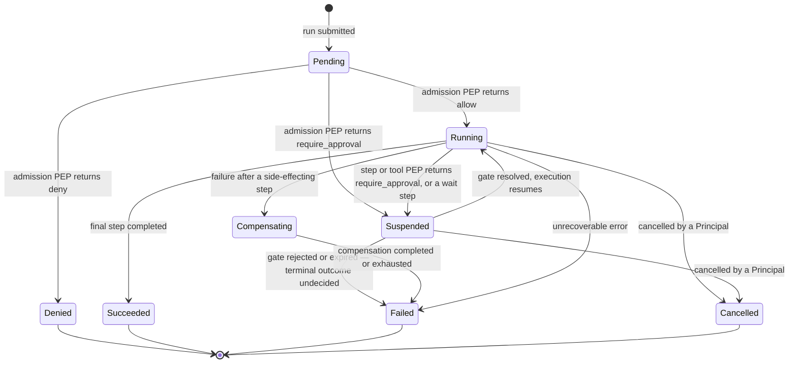
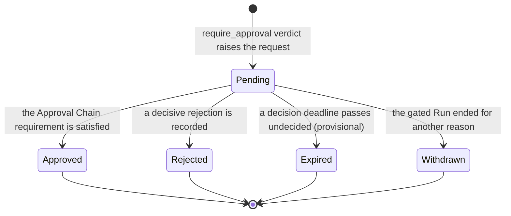
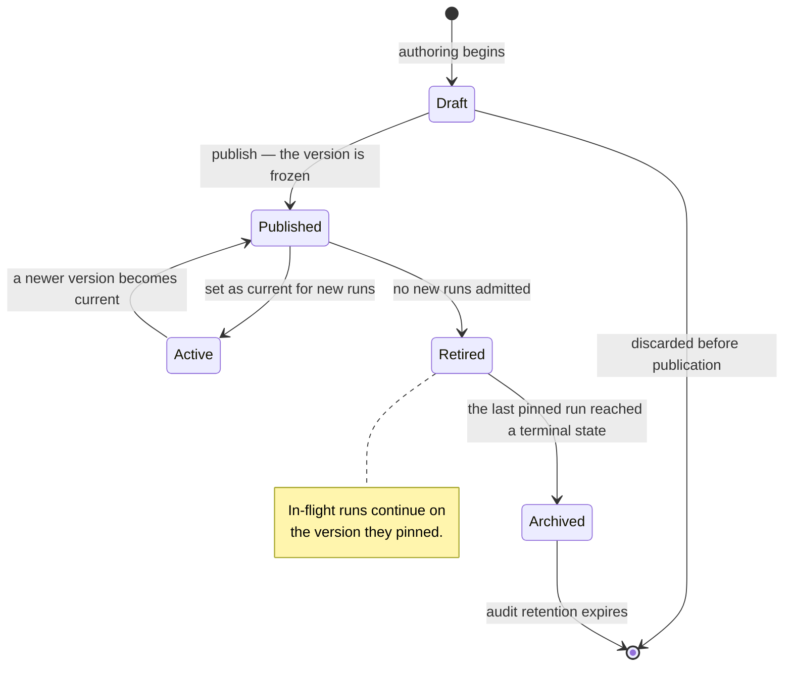
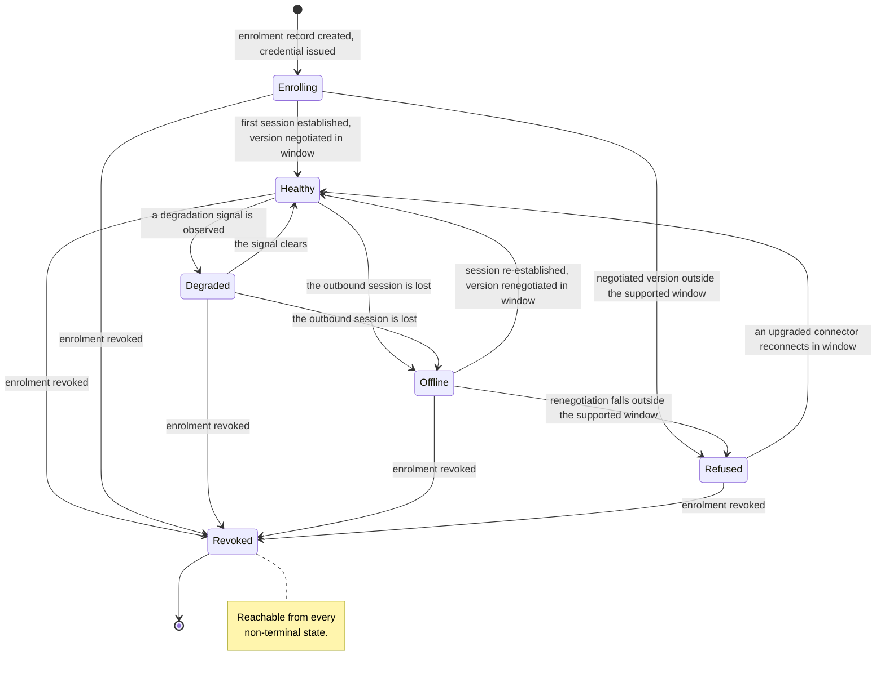

# Entity Lifecycle State Machines

Four entities change state in ways an auditor, a tenant administrator or a regulator will ask about:
the **Run**, the **Approval Request**, the Workflow or Agent **version**, and the **Connector**.
Their state names are the shared vocabulary of the audit trail, the control plane and the metered
dimensions of [ADR-0009](../adr/adr-0009-meter-first-defer-tiering.md). Renaming one later breaks
three surfaces at once. No platform code exists: this document states intended behaviour and marks
where no decision has been made and which document would make it. Section 6 registers those.

## 1. Conventions

Requirement keywords carry their [RFC 2119](https://www.rfc-editor.org/rfc/rfc2119) meanings.

- A state is **terminal** when no transition leaves it, and terminal is permanent. Retries live at
  Step Execution, never at the Run (GLOSSARY.md); re-running a completed Run means starting a new
  Run that references the old one. Audit Records are append-only and immutable, so reopening a Run
  would make its own history a lie.
- Every state record, transition and emitted event MUST carry `tenant_id`. **MUST be audited** means
  an Audit Record is written, sufficient to reconstruct who did what, when, on what basis, and under
  which Policy.
- Where this state lives is unsettled.
  [ADR-0011](../adr/adr-0011-tenant-isolation-shared-schema-rls.md) requires a datastore that
  enforces row-level security itself but selects none. No product is chosen.
- Run state is **Orchestra's** governance vocabulary, not the runtime's. Durability, checkpointing,
  interrupts and resumption come from the runtime
  ([ADR-0005](../adr/adr-0005-langgraph-as-compilation-target.md),
  [ADR-0008](../adr/adr-0008-declarative-workflow-definitions.md)); a Checkpoint is never exposed in
  a public contract, and these states MUST NOT be a projection of runtime internals.

| Entity | Typical lifetime | What moves it | Grounding |
| --- | --- | --- | --- |
| Run | Minutes to days | Policy Decisions, runtime progress, cancelling Principals | ADR-0005, ADR-0008 |
| Approval Request | Minutes to days | Principals in the Approval Chain; a deadline, if one is adopted | ADR-0003 |
| Workflow / Agent version | Indefinite | Platform Users publishing; in-flight Runs draining | [VERSIONING.md](../VERSIONING.md) §8 |
| Connector | Indefinite | Customer-side software; tenant administrators | ADR-0007 — **Proposed** |

## 2. Run

One execution of an Agent or Workflow: the primary unit of execution, observability, billing and
audit.

| State | Terminal | Meaning |
| --- | --- | --- |
| `Pending` | No | Submitted; admission not yet decided. |
| `Running` | No | Executing under the runtime. |
| `Suspended` | No | Halted at a gate: an Approval Request, or a `wait` step. |
| `Compensating` | No | **Provisional** — see §2.4. Declared compensating actions are executing. |
| `Succeeded` | Yes | Completed as defined. |
| `Failed` | Yes | Ended on an error, or on an unfavourable gate resolution. |
| `Cancelled` | Yes | Stopped by a Principal before completion. |
| `Denied` | Yes | Refused at admission. No Step Execution ever occurred. |

### 2.1 Admission is a Policy Enforcement Point

A Run can be refused before it starts. `Denied` is therefore a real state with a persisted record,
not the absence of a Run: ADR-0009 meters Runs **by outcome**, and a refused run is the outcome that
matters most under review. The admission Policy Decision MUST be audited whichever way it goes —
recording only denials makes the trail evidence of enforcement rather than of what happened.

### 2.2 Suspension and resumption

A Run suspends when a PEP returns `require_approval` and resumes when the resulting Approval Request
resolves; it also suspends on a `wait` step. Both are one `Suspended` state with a recorded reason —
splitting them buys nothing an attribute does not, and adds two transitions to every consumer.

Suspension may last days ([VERSIONING.md](../VERSIONING.md) §8), so suspended state MUST be durable
and MUST NOT depend on a live process, connection or in-memory continuation. Orchestra does not
implement that durability; it consumes it. Orchestra owns the governance record: which PEP suspended
the Run, which Policy matched, which Approval Request gates it, whose decision released it.

### 2.3 Version pinning

A Run pins its Agent or Workflow version at admission and executes that version for its whole life
([VERSIONING.md](../VERSIONING.md) §8, W2 and W3). The pin is immutable, so **there is no migration
transition here and there will never be one.** A Run started on `@3` finishes on `@3` long after
`@4` is published and `@3` retired.

### 2.4 What is not decided

- **A rejected or expired gate.** The diagram routes it to `Failed`, the conservative reading; but a
  rejection is a governance outcome rather than a fault, and an `approval` step may legitimately
  declare a rejection branch and continue. `50-workflows/step-types.md` decides it, see
  [`50-workflows/`](../50-workflows/).
- **Compensation.** ADR-0008 requires that failure after a side-effecting step triggers declared
  compensating actions and never a blind retry. The unit is settled: GLOSSARY.md puts compensation
  at Step Execution, *not* the Run. What is open is narrower — whether the Run carries an observable
  roll-up state while its Step Executions compensate, as drawn here.
  `50-workflows/execution-semantics.md` decides that.
- **Who may cancel** — Platform User, End User, Service Account — is decided by
  `10-architecture/identity-and-access.md`, see [`10-architecture/`](../10-architecture/).
- **No timeout, retry count or maximum Run duration is decided.** None exists in this repository.

Cancellation MUST NOT be read as proof that an in-flight side effect did not occur: a Run cancelled
mid-tool-call leaves that invocation in an unknown state, and unknown is not the same as not done.

### 2.5 Audited transitions

Every transition MUST be audited with `tenant_id`, `run_id`, timestamp and cause. In addition:

| Transition | Additional record |
| --- | --- |
| `Pending → *` | The admission Policy Decision: rule matched, inputs, verdict. Allows included. |
| Pin at admission | The Agent or Workflow identifier and its exact version. |
| `Running → Suspended` | The PEP, the Policy Decision, and the Approval Request identifier. |
| `Suspended → Running` | The resolving Approval Request and the Principals who decided it. |
| `* → Cancelled` | The cancelling Principal and any Step Execution in flight at that moment. |
| `* → Succeeded / Failed / Denied` | The outcome, which is a metered dimension under ADR-0009. |

## 3. Approval Request

A human decision gate raised by a `require_approval` verdict, carrying the proposed action, the
Evidence Set the Agent relied on, the Approval Chain, and its resolution.

| State | Terminal | Meaning |
| --- | --- | --- |
| `Pending` | No | Raised, awaiting the decisions the Approval Chain requires. |
| `Approved` | Yes | The chain's requirement was met. The gated Run may resume. |
| `Rejected` | Yes | A human declined. |
| `Expired` | Yes | **Provisional — see §3.1.** A deadline passed undecided. No human declined. |
| `Withdrawn` | Yes | The gated Run was cancelled or failed; there is nothing left to gate. |

**If a deadline mechanism is adopted, `Expired` MUST be distinct from `Rejected`.** "A human said
no" and "nobody looked" are different facts about a control, and an audit that cannot separate them
cannot report on that control. Whether a deadline exists at all is undecided, so the state is drawn
provisionally rather than asserted.

Expiry also has no acting Principal, and GLOSSARY.md admits none: every action in the audit log
resolves to exactly one Principal. [`domain-model.md`](domain-model.md) records the same gap for
platform-operator action and marks it unmade. Expiry is a second instance of it, not a separate
problem, and `40-governance/audit-model.md` decides both together.

**Proposed, owned by `40-governance/approval-workflows.md`: the Evidence Set is captured at raise
time and is immutable thereafter.** The point of attaching
it is that the human approves on the same information the model had; evidence that could change
afterwards attests to nothing.

### 3.1 Routing is not decided

An Approval Chain is ordered or parallel and derived from Policy. Beyond that, almost nothing is
settled and this document deliberately invents none of it: what satisfies a chain (all, quorum,
first decision), whether one rejection in a parallel chain is decisive, escalation, delegation,
reassignment after raise, re-raise after expiry, whether a deadline exists at all, and whether an
ordered chain's partial progress is a substate of `Pending` or an attribute of it — all undecided.
`40-governance/approval-workflows.md` decides them, see [`40-governance/`](../40-governance/). Until
it exists, treat any statement about chain behaviour as opinion.

How these transitions reach a client is also unsettled:
[ADR-0004](../adr/adr-0004-adopt-ag-ui-event-protocol.md) is **Proposed** and its second validation
step — prototype the approval lifecycle end to end, confirm it survives disconnect and replay — is
outstanding.

### 3.2 Audited transitions

The raise MUST record the causing Policy Decision, the proposed action, the Evidence Set and the
Approval Chain as resolved at that moment. Each decision MUST record the deciding Principal, the
authenticated identity behind them and the timestamp; the resolution MUST record which decisions
produced it. Approvals are metered, raised and resolved.

## 4. Workflow version

The lifecycle of the *definition*, not of a Run. Agent definitions follow it identically
([VERSIONING.md](../VERSIONING.md) §8).

| State | Terminal | Meaning |
| --- | --- | --- |
| `Draft` | No | Mutable, unpublished, never executed. |
| `Published` | No | Frozen and immutable. Runs may be pinned to it; it is not the default. |
| `Active` | No | The current version. New Runs start here. |
| `Retired` | No | Admits no new Runs. Existing Runs continue. |
| `Archived` | No | Drained. Retained solely for audit. |

**Published versions are immutable (W1),** so there is no edit transition — editing means creating
a Draft that publishes as a new version. **Retirement drains; it does not kill (W4):**
`Published → Retired` changes exactly one thing, that admission stops pinning new Runs to this
version. Runs already pinned are unaffected.

**`Retired → Archived` is not an administrative act** but an observed condition — the last Run
pinned to the version reached a terminal state. That couples the version lifecycle to the Run
lifecycle, with an uncomfortable consequence: because a Run can suspend on an approval for days, a
Retired version can stay undrainable for an unbounded period. **No force-drain mechanism is
decided.** W3 forbids *migrating* in-flight executions, not ending them, so a force-drain would have
to cancel Runs pinned to a Retired version rather than move them. Whether that is acceptable is
undecided.
`50-workflows/execution-semantics.md` decides it.

**Archived is retention-bound, not dead:** the definition is retained for the full audit-retention
period, because an audit must reconstruct the exact process a decision followed. **No retention
period is decided anywhere in this repository;** `40-governance/audit-model.md` decides it.

A version can also go stale without changing state — under W5 a Tool's MAJOR bump does not alter
published workflows, it surfaces as a control-plane warning. Staleness is an attribute, not a
state.

### 4.1 Audited transitions

Publication MUST record the Principal, the frozen definition and the compiled artifact — ADR-0005
requires every compiled graph to retain a traceable link back to its source definition, version and
step identifiers, and retains compiled snapshots for audit. Set-as-current, retirement and archival
MUST each record the acting Principal. Every Run's pin MUST be recorded, because that is what makes
`Retired → Archived` verifiable rather than asserted.

## 5. Connector

> **This lifecycle rests on a Proposed decision.**
> [ADR-0007](../adr/adr-0007-outbound-connector-for-enterprise-reachability.md) binds only after
> design-partner validation confirms that public MCP exposure is unachievable for them and
> establishes what their security teams require of software inside their network. If that validation
> goes the other way, this entire lifecycle is provisional.

| State | Terminal | Meaning |
| --- | --- | --- |
| `Enrolling` | No | Enrolment record exists; the software has never connected. |
| `Healthy` | No | Outbound session established, protocol version inside the supported window. |
| `Degraded` | No | Connected, but not serving Tool traffic normally. See §5.2. |
| `Offline` | No | No outbound session. Proxies nothing. |
| `Refused` | No | Version outside the supported window. Refused loudly; proxies nothing. |
| `Revoked` | Yes | Enrolment credential revoked. This installation may never reconnect. |

### 5.1 Version skew is a normal state, not an exception

The Connector runs inside the customer's network and cannot be force-upgraded, so skew is permanent
([VERSIONING.md](../VERSIONING.md) §9). The protocol version is negotiated at enrolment **and on
every reconnection**, which is why `Offline → Refused` exists: the gateway's minimum can rise while
a Connector is down, and it must be refused on the way back rather than admitted on the strength of
an earlier negotiation. A Connector below the minimum MUST enter `Refused`, MUST NOT proxy Tool
traffic, and MUST raise a control-plane alert with an actionable error. It MUST NOT be silently
degraded — a silently degraded security boundary is worse than an offline one.

### 5.2 What is not decided

- **What distinguishes `Degraded` from `Healthy`.** Candidate signals are an elevated
  tool-invocation error rate, partial Tool reachability, and skew inside but near the edge of the
  supported window. None is chosen, and **no health-check interval, threshold or timeout is
  decided.** `10-architecture/connector.md` and `60-operations/reliability.md` decide this.
- **What a Run does when its next Tool invocation targets a Connector that is not `Healthy`** — fail
  the Step Execution, or suspend and wait. ADR-0007 requires these failure modes to enter a
  reliability model that does not yet exist. `60-operations/reliability.md` decides it.
- **Whether health transitions are Audit Records or telemetry.** Enrolment, refusal and revocation
  are governance facts with an actor and MUST be audited. A Connector flapping between `Healthy` and
  `Degraded` has no actor and is poorly served by an append-only immutable store.
  `40-governance/audit-model.md` and `60-operations/observability.md` decide the boundary.

A tunnel drop mid-call leaves a Tool invocation in an unknown state. Connector state MUST NOT be
used to infer that a side effect did not occur: `Offline` says the transport failed, not that the
system on the other side declined the work.

### 5.3 Audited transitions

Enrolment, first session establishment, every version negotiation outcome including every refusal,
and revocation MUST be audited with the acting Principal — noting that the Connector is itself a
Principal. Connectors are metered by health under ADR-0009, so these state names are also a
billing-adjacent surface.

## 6. Open questions register

| Question | Entity | Decided by |
| --- | --- | --- |
| Does a rejected or expired gate fail the Run, or route to a declared rejection branch? | Run | `50-workflows/step-types.md` |
| Is compensation a Run state or confined to Step Execution? | Run | `50-workflows/execution-semantics.md` |
| Which Principals may cancel a Run? | Run | `10-architecture/identity-and-access.md` |
| What satisfies an Approval Chain, and how does it escalate or delegate? | Approval Request | `40-governance/approval-workflows.md` |
| Is there a decision deadline, and may a request be re-raised after expiry? | Approval Request | `40-governance/approval-workflows.md` |
| Do approval transitions survive disconnect and replay? | Approval Request | ADR-0004 validation step 2, then `30-protocol/event-protocol.md` |
| Can a Retired version be force-drained? | Workflow version | `50-workflows/execution-semantics.md` |
| What audit-retention period ends `Archived`? | Workflow version | `40-governance/audit-model.md` |
| May a `Draft` version be deleted, given audit-retention obligations? | Workflow version | `40-governance/audit-model.md`, ADR-0011 follow-on |
| How is an action with no acting Principal attributed — expiry, platform-operator work? | Approval Request, Audit Record | `40-governance/audit-model.md` |
| Is the Evidence Set immutable from raise time? | Approval Request | `40-governance/approval-workflows.md` |
| What separates `Degraded` from `Healthy`, and on what interval? | Connector | `10-architecture/connector.md`, `60-operations/reliability.md` |
| What does a Run do when its Connector is not `Healthy`? | Run, Connector | `60-operations/reliability.md` |
| Are Connector health transitions audited or telemetry? | Connector | `40-governance/audit-model.md` |
