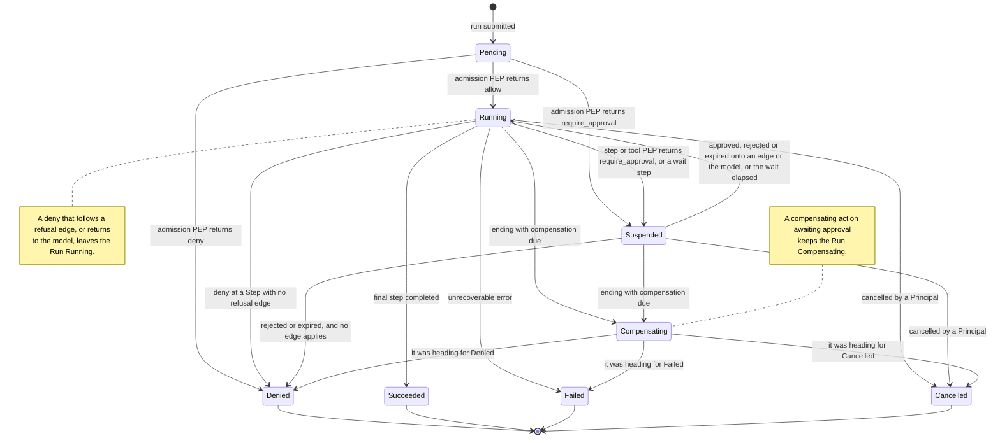
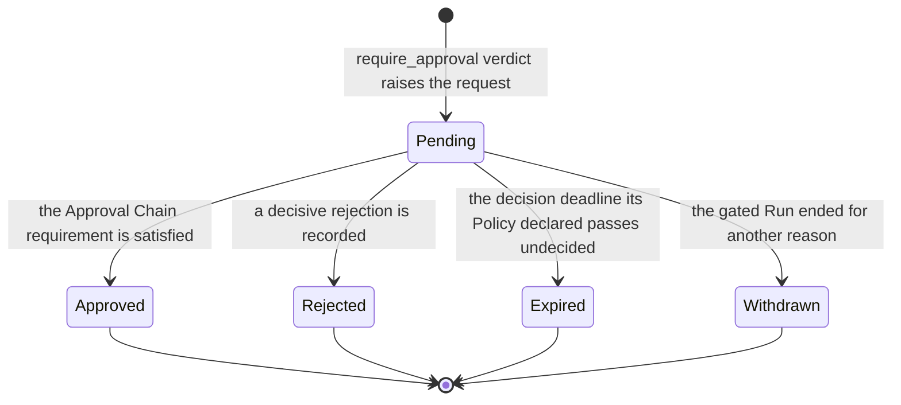
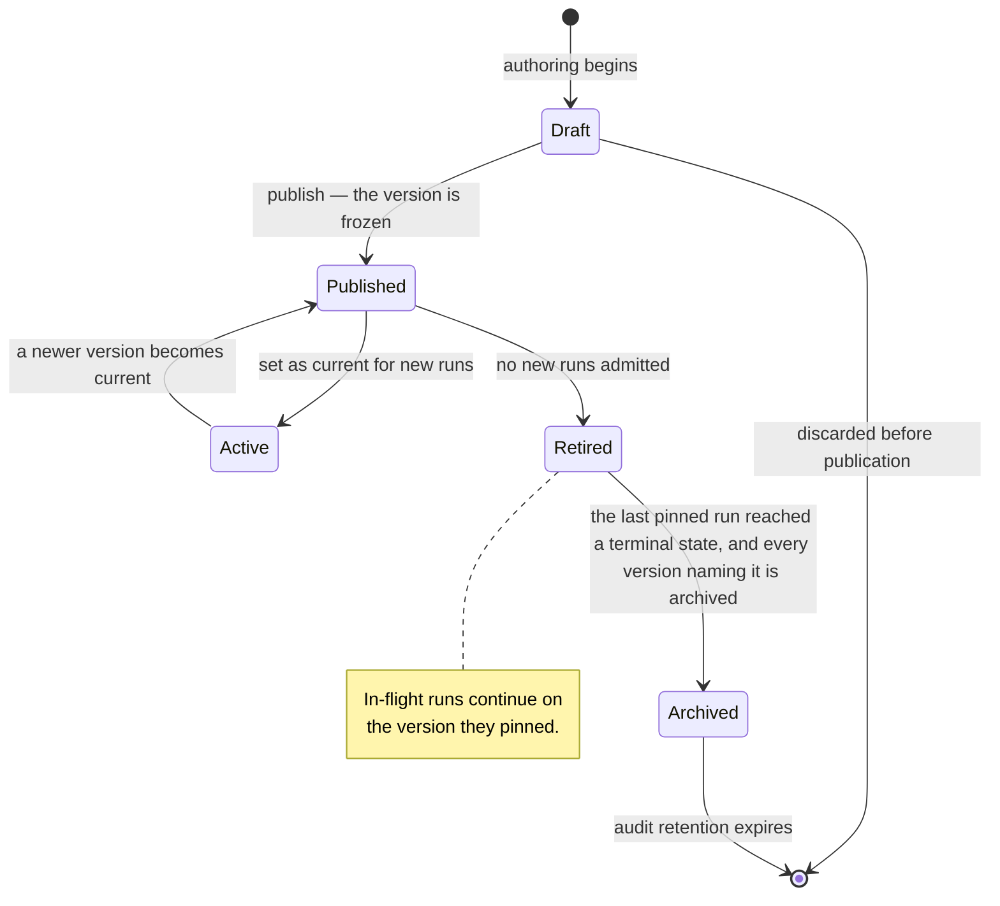
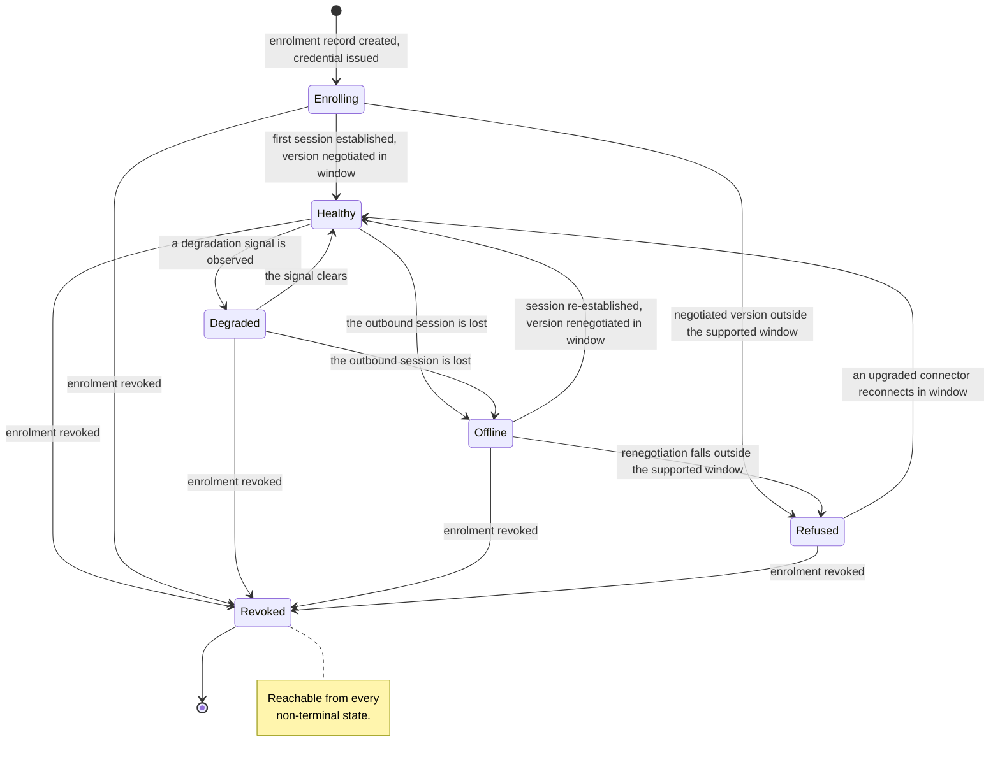

# Entity Lifecycle State Machines

Four entities change state in ways an auditor, a tenant administrator or a regulator will ask about:
the **Run**, the **Approval Request**, the Workflow or Agent **version**, and the **Connector**.
Their state names are the shared vocabulary of the audit trail, the control plane and the metered
dimensions of [ADR-0009](../adr/adr-0009-meter-first-defer-tiering.md). Renaming one later breaks
three surfaces at once. No platform code exists: this document states intended behaviour and marks
where no decision has been made and which document would make it. Section 6 registers those.

## 1. Conventions

Requirement keywords carry their [RFC 2119](https://www.rfc-editor.org/rfc/rfc2119) meanings.

- A state is **terminal** when no transition leaves it, and terminal is permanent. Retries live at
  Step Execution, never at the Run (GLOSSARY.md); re-running a completed Run means starting a new
  Run that references the old one. Audit Records are append-only and immutable, so reopening a Run
  would make its own history a lie.
- Every state record, transition and emitted event MUST carry `tenant_id`. **MUST be audited** means
  an Audit Record is written, sufficient to reconstruct who did what, when, on what basis, and under
  which Policy.
- This state lives in PostgreSQL, which
  [ADR-0021](../adr/adr-0021-postgresql-is-the-datastore.md) makes the datastore under the
  row-level security requirement of
  [ADR-0011](../adr/adr-0011-tenant-isolation-shared-schema-rls.md). Its layout there is unsettled.
- Run state is **Orchestra's** governance vocabulary, not the runtime's. Durability, checkpointing,
  interrupts and the resume mechanism come from the runtime library
  ([ADR-0016](../adr/adr-0016-compile-to-the-langgraph-library.md)); noticing a waiting or crashed
  Run and re-invoking it is the run supervisor's
  ([ADR-0014](../adr/adr-0014-run-supervisor-is-orchestras.md)). A Checkpoint is never exposed in a
  public contract, and these states MUST NOT be a projection of runtime internals — nor of the
  supervisor's, whose own run states map onto these rather than replacing them. This lifecycle is
  authoritative on the states a customer can observe.

| Entity | Typical lifetime | What moves it | Grounding |
| --- | --- | --- | --- |
| Run | Minutes to days | Policy Decisions, runtime progress, cancelling Principals | ADR-0005, ADR-0008 |
| Approval Request | Minutes to days | Platform Users in the Approval Chain; a decision deadline, where its Policy declares one | ADR-0003, [ADR-0043](../adr/adr-0043-approval-chains-and-separation-of-duties.md) |
| Workflow / Agent version | Indefinite | Platform Users publishing; in-flight Runs draining | [VERSIONING.md](../VERSIONING.md) §8 |
| Connector | Indefinite | Customer-side software; tenant administrators | ADR-0007 — **Proposed** |

## 2. Run

One execution of an Agent or Workflow: the primary unit of execution, observability, billing and
audit.

| State | Terminal | Meaning |
| --- | --- | --- |
| `Pending` | No | Submitted; admission not yet decided. |
| `Running` | No | Executing under the runtime. |
| `Suspended` | No | Halted at a gate: an Approval Request, or a `wait` step. |
| `Compensating` | No | Declared compensating actions are executing: the roll-up state `50-workflows/execution-semantics.md` X22 settles. Holds while a compensating action awaits approval, and leaves only for the terminal state the Run was heading for (§2.6). |
| `Succeeded` | Yes | Completed as defined. |
| `Failed` | Yes | Ended on a fault. A governance refusal never ends a Run here. |
| `Cancelled` | Yes | Stopped by a Principal before completion. |
| `Denied` | Yes | Ended by a governance refusal: at admission, where no Step Execution ever occurred, or later, where no declared edge or the model carried the Run on. Records where and why (§2.6). |

### 2.1 Admission is a Policy Enforcement Point

A Run can be refused before it starts. `Denied` is therefore a real state with a persisted record,
not the absence of a Run: ADR-0009 meters Runs **by outcome**, and a refused run is the outcome that
matters most under review. The admission Policy Decision MUST be audited whichever way it goes —
recording only denials makes the trail evidence of enforcement rather than of what happened.
Admission is the first way into `Denied`, not the only one: section 2.6 gives the others.

### 2.2 Suspension and resumption

A Run suspends when a PEP returns `require_approval`, unless the gated action is a compensating
action, which keeps the Run `Compensating` instead (section 2.6). A suspended Run leaves `Suspended`
when the resulting Approval Request resolves — approved, at the gated action; rejected or expired,
wherever section 2.6 sends it — and it also suspends on a `wait` step. Both are one `Suspended`
state with a recorded reason —
splitting them buys nothing an attribute does not, and adds two transitions to every consumer.

Suspension may last days ([VERSIONING.md](../VERSIONING.md) §8), so suspended state MUST be durable
and MUST NOT depend on a live process, connection or in-memory continuation. Orchestra does not
implement that durability; it consumes it. Orchestra owns the governance record: which PEP suspended
the Run, which Policy matched, which Approval Request gates it, whose decision released it.

### 2.3 Version pinning

A Run pins its Agent or Workflow version at admission and executes that version for its whole life
([VERSIONING.md](../VERSIONING.md) §8, W2 and W3). The pin is immutable, so **there is no migration
transition here and there will never be one.** A Run started on `@3` finishes on `@3` long after
`@4` is published and `@3` retired. The versions that `@3`'s `agent` and `subworkflow` Steps name
were pinned when `@3` was published, and execute inside the same Run on the same terms
([ADR-0041](../adr/adr-0041-nested-versions-execute-inside-the-parent-run.md)).

### 2.4 What is not decided

- **Who may cancel** — Platform User, End User, Service Account — is decided by
  `10-architecture/identity-and-access.md`, see [`10-architecture/`](../10-architecture/).
- **No timeout, retry count or maximum Run duration is decided.** None exists in this repository.

Cancellation MUST NOT be read as proof that an in-flight side effect did not occur: a Run cancelled
mid-tool-call leaves that invocation in an unknown state, and unknown is not the same as not done.

### 2.5 Audited transitions

Every transition MUST be audited with `tenant_id`, `run_id`, timestamp and cause. In addition:

| Transition | Additional record |
| --- | --- |
| `Pending → *` | The admission Policy Decision: rule matched, inputs, verdict. Allows included. |
| Pin at admission | The Agent or Workflow identifier and its exact version. |
| `Running → Suspended` | The PEP, the Policy Decision, and the Approval Request identifier. |
| `Suspended → Running` | The resolving Approval Request and the Principals who decided it. |
| `* → Cancelled` | The cancelling Principal and any Step Execution in flight at that moment. |
| `* → Denied` | Where the Run was refused — admission, a Step boundary or a Tool enforcement point, with the Step where one applies — and what refused it: the Policy Decision whose verdict was `deny`, or the Approval Request whose `Rejected` or `Expired` resolution ended the Run. |
| `* → Succeeded / Failed / Cancelled / Denied` | The terminal state, which is the metered outcome under ADR-0009, and the compensation outcome, naming each Step Execution whose effect remains. |

### 2.6 Why a Run ended, and whether its work was undone

[ADR-0040](../adr/adr-0040-run-outcomes-for-refusal-and-compensation.md) separates two facts that
one terminal state used to carry. **The terminal state says why the Run ended**: `Succeeded`, it
completed as defined; `Failed`, a fault ended it; `Cancelled`, a Principal stopped it; `Denied`, a
governance refusal ended it. No state is added for either fact.

A governance refusal ends the Run `Denied` unless something declared carries it on. A gate resolved
`Rejected` or `Expired` goes where a `deny` at the same point would, except at an `approval` Step:

- At admission, a `deny` or a rejected or expired gate ends the Run before any Step Execution.
- At an `approval` Step, a rejected or expired gate resumes the Run onto the rejection or expiry
  edge the Step declares, and otherwise ends it. A `deny` at its boundary follows its refusal edge,
  and otherwise ends it.
- At any other Workflow Step's boundary, or at the Tool enforcement point before the invocation a
  `tool` Step names, a `deny` or a rejected or expired gate follows the refusal edge the Step
  declares, and otherwise ends the Run.
- For a call the model chose, in an Agent Run or inside an `agent` Step, a `deny` or a rejected or
  expired gate returns to the model as that invocation's outcome, and the Run continues.

A Run that ends `Denied` records where it was refused, and the Policy Decision or Approval Request
that refused it. The Approval Request, not the Run state, says whether a gate was `Rejected` or
`Expired` (`40-governance/approval-workflows.md` rules D1 and J5).

**The compensation outcome says whether the work was undone.** Every Run in a terminal state
carries one: `not_required` where nothing it did called for compensation, `compensated` where every
compensating action it called for completed, and `unresolved` where at least one did not, naming
each Step Execution whose effect remains. A Run that would end `Failed`, `Cancelled` or `Denied`
while compensation is due passes through `Compensating`, the roll-up state
`50-workflows/execution-semantics.md` X22 settles, and ends in the state it was heading for. A
compensating action gated by `require_approval` keeps the Run `Compensating` while its Approval
Request is pending: approved, the action is attempted; rejected or expired, its effect is
`unresolved`. Resolving an `unresolved` effect later is a new governed act, never a reopened Run
(`40-governance/audit-model.md` section 6).

## 3. Approval Request

A human decision gate raised by a `require_approval` verdict, carrying the proposed action, the
Evidence Set the Agent relied on, the Approval Chain, and its resolution.

| State | Terminal | Meaning |
| --- | --- | --- |
| `Pending` | No | Raised, awaiting the decisions the Approval Chain requires. |
| `Approved` | Yes | The chain's requirement was met. The gated Run may resume. |
| `Rejected` | Yes | A human declined. |
| `Expired` | Yes | The decision deadline its Policy declared passed undecided. No human declined. |
| `Withdrawn` | Yes | The gated Run was cancelled or failed; there is nothing left to gate. |

**`Expired` MUST be distinct from `Rejected`.** "A human said no" and "nobody looked" are different
facts about a control, and an audit that cannot separate them cannot report on that control. A
request can expire only where the Policy that raised it declares a decision deadline
([ADR-0043](../adr/adr-0043-approval-chains-and-separation-of-duties.md)); a Policy that declares
none gives its requests none.

Expiry has no acting Principal. It is not an action but a transition caused by an observed
condition, so its record carries the cause and no Principal, and MUST NOT name one who did not act
([ADR-0030](../adr/adr-0030-platform-operator-and-observed-conditions.md),
`40-governance/audit-model.md` section 9). Withdrawal is recorded the same way.

**The Evidence Set is captured at raise time and is immutable thereafter**, settled by
`40-governance/approval-workflows.md` rule E4. The point of attaching
it is that the human approves on the same information the model had; evidence that could change
afterwards attests to nothing.

### 3.1 Routing

An Approval Chain is ordered or parallel, derived from Policy, and made of positions
([ADR-0043](../adr/adr-0043-approval-chains-and-separation-of-duties.md)). Each position resolves
at raise to the Platform Users eligible to decide it, and one approval from any of them satisfies
it. Where several matching rules gated the action the request carries each rule's chain, and
`Approved` waits on every one of them; `Rejected` waits on a single decisive rejection at an open
position of any of them. A reassignment changes who is eligible at an open position and moves no
state. There is no escalation on elapsed time, no delegation and no re-raise.
`40-governance/approval-workflows.md` sections 5 to 7 state the rules, see
[`40-governance/`](../40-governance/). One representational choice stays open: whether an ordered
chain's partial progress is a substate of `Pending` or an attribute of it.

How these transitions reach a client is also unsettled:
[ADR-0004](../adr/adr-0004-adopt-ag-ui-event-protocol.md) is **Proposed** and its second validation
step — prototype the approval lifecycle end to end, confirm it survives disconnect and replay — is
outstanding.

### 3.2 Audited transitions

The raise MUST record the causing Policy Decision, the proposed action, the Evidence Set, the
Approval Chain as resolved at that moment and the decision deadline where one applies. Each
decision MUST record the deciding Principal, the authenticated identity behind them, the position
and the timestamp. Each reassignment MUST record its acting Principal, its cause and the chain
before and after. The resolution MUST record which decisions produced it, and an expiry records its
cause and no Principal. Approvals are metered, raised and resolved.

## 4. Workflow version

The lifecycle of the *definition*, not of a Run. Agent definitions follow it identically
([VERSIONING.md](../VERSIONING.md) §8).

| State | Terminal | Meaning |
| --- | --- | --- |
| `Draft` | No | Mutable, unpublished, never executed. |
| `Published` | No | Frozen and immutable. Runs may be pinned to it; it is not the default. |
| `Active` | No | The current version. New Runs start here. |
| `Retired` | No | Admits no new Runs. Existing Runs continue, and so does its execution inside the Runs of a version that names it. |
| `Archived` | No | Drained. Retained solely for audit. |

**Published versions are immutable (W1),** so there is no edit transition — editing means creating
a Draft that publishes as a new version. **Retirement drains; it does not kill (W4):**
`Published → Retired` changes exactly one thing, that admission stops pinning new Runs to this
version. Runs already pinned are unaffected.

**`Retired → Archived` is not an administrative act** but an observed condition — the last Run
pinned to the version reached a terminal state, and every version naming it through an `agent` or
`subworkflow` Step is archived
([ADR-0041](../adr/adr-0041-nested-versions-execute-inside-the-parent-run.md)). That couples the
version lifecycle to the Run lifecycle and to the versions naming it, with an uncomfortable
consequence: because a Run can suspend on an approval for days, a Retired version can stay
undrainable for an unbounded period. **A force-drain is cancellation of
every Run pinned to the version, and nothing else** — settled by
`50-workflows/execution-semantics.md` X6. W3 forbids *migrating* in-flight executions, not ending
them, so a drain cancels rather than moves; it decomposes into individually audited cancellations,
and it may not be paired with re-submission on a newer version, which would be migration wearing
another name.

**Archived is retention-bound, not dead:** the definition is retained for the full audit-retention
period, because an audit must reconstruct the exact process a decision followed. **No retention
period is decided anywhere in this repository;** `40-governance/audit-model.md` decides it.

A version can also go stale without changing state — under W5 a Tool's MAJOR bump does not alter
a published Workflow or Agent version, it surfaces as a control-plane warning. A capability grant
left unsatisfiable by a change of the Tool's Side-Effect Class is flagged the same way
([ADR-0042](../adr/adr-0042-declared-tools-and-capability-grants.md)). Staleness is an attribute,
not a state.

### 4.1 Audited transitions

Publication MUST record the Principal, the frozen definition and the compiled artifact — ADR-0005
requires every compiled graph to retain a traceable link back to its source definition, version and
step identifiers, and retains compiled snapshots for audit. Set-as-current and retirement MUST each
record the acting Principal. Archival is caused by an observed condition, so it MUST record its
cause — the last pinned Run reaching a terminal state — and no Principal, because none acted
([ADR-0030](../adr/adr-0030-platform-operator-and-observed-conditions.md)). Every Run's pin MUST be
recorded, because that is what makes `Retired → Archived` verifiable rather than asserted.

## 5. Connector

> **This lifecycle rests on a Proposed decision.**
> [ADR-0007](../adr/adr-0007-outbound-connector-for-enterprise-reachability.md) binds only after
> design-partner validation confirms that public MCP exposure is unachievable for them and
> establishes what their security teams require of software inside their network. If that validation
> goes the other way, this entire lifecycle is provisional.

| State | Terminal | Meaning |
| --- | --- | --- |
| `Enrolling` | No | Enrolment record exists; the software has never connected. |
| `Healthy` | No | Outbound session established, protocol version inside the supported window. |
| `Degraded` | No | Connected, but not serving Tool traffic normally. See §5.2. |
| `Offline` | No | No outbound session. Proxies nothing. |
| `Refused` | No | Version outside the supported window. Refused loudly; proxies nothing. |
| `Revoked` | Yes | Enrolment credential revoked. This installation may never reconnect. |

### 5.1 Version skew is a normal state, not an exception

The Connector runs inside the customer's network and cannot be force-upgraded, so skew is permanent
([VERSIONING.md](../VERSIONING.md) §9). The protocol version is negotiated at enrolment **and on
every reconnection**, which is why `Offline → Refused` exists: the gateway's minimum can rise while
a Connector is down, and it must be refused on the way back rather than admitted on the strength of
an earlier negotiation. A Connector below the minimum MUST enter `Refused`, MUST NOT proxy Tool
traffic, and MUST raise a control-plane alert with an actionable error. It MUST NOT be silently
degraded — a silently degraded security boundary is worse than an offline one.

### 5.2 What is not decided

- **What distinguishes `Degraded` from `Healthy`.** Candidate signals are an elevated
  tool-invocation error rate, partial Tool reachability, and skew inside but near the edge of the
  supported window. None is chosen, and **no health-check interval, threshold or timeout is
  decided.** `10-architecture/connector.md` and `60-operations/reliability.md` decide this.
- **What a Run does when its next Tool invocation targets a Connector that is not `Healthy`** — fail
  the Step Execution, or suspend and wait. ADR-0007 requires these failure modes to enter a
  reliability model that does not yet exist. `60-operations/reliability.md` decides it.
- **Whether health transitions are Audit Records or telemetry.** Enrolment, refusal and revocation
  are governance facts with an actor and MUST be audited. A Connector flapping between `Healthy` and
  `Degraded` has no actor and is poorly served by an append-only immutable store.
  `40-governance/audit-model.md` and `60-operations/observability.md` decide the boundary.

A tunnel drop mid-call leaves a Tool invocation in an unknown state. Connector state MUST NOT be
used to infer that a side effect did not occur: `Offline` says the transport failed, not that the
system on the other side declined the work.

### 5.3 Audited transitions

Enrolment, first session establishment, every version negotiation outcome including every refusal,
and revocation MUST be audited with the acting Principal — noting that the Connector is itself a
Principal. Connectors are metered by health under ADR-0009, so these state names are also a
billing-adjacent surface.

## 6. Open questions register

| Question | Entity | Decided by |
| --- | --- | --- |
| Which Principals may cancel a Run? | Run | `10-architecture/identity-and-access.md` |
| Do approval transitions survive disconnect and replay? | Approval Request | ADR-0004 validation step 2, then `30-protocol/event-protocol.md` |
| What audit-retention period ends `Archived`? | Workflow version | `40-governance/audit-model.md` |
| May a `Draft` version be deleted, given audit-retention obligations? | Workflow version | `40-governance/audit-model.md`, ADR-0011 follow-on |
| What separates `Degraded` from `Healthy`, and on what interval? | Connector | `10-architecture/connector.md`, `60-operations/reliability.md` |
| What does a Run do when its Connector is not `Healthy`? | Run, Connector | `60-operations/reliability.md` |
| Are Connector health transitions audited or telemetry? | Connector | `40-governance/audit-model.md` |
