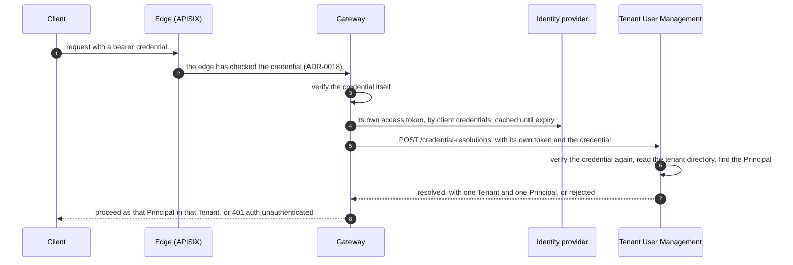

# Credential Resolution

How the Gateway turns a credential it has verified into exactly one Principal and one Tenant, as
[`gateway-api.md`](gateway-api.md) G7 requires and
[ADR-0024](../adr/adr-0024-global-person-with-tenant-memberships.md) assigns to Tenant User
Management. It is an internal contract between services under
[ADR-0026](../adr/adr-0026-services-call-over-http-and-publish-through-an-outbox.md): the Gateway
calls it, Tenant User Management answers it, and no end client ever does. This section is
**normative**. MUST, MUST NOT, SHOULD and MAY carry their
[RFC 2119](https://www.rfc-editor.org/rfc/rfc2119) meanings.

The executable form is the `resolveCredential` operation in
[`openapi/tenant-user-management.openapi.yaml`](openapi/tenant-user-management.openapi.yaml), and
[`http-conventions.md`](http-conventions.md) governs everything this document does not say.

## 1. The flow



## 2. The operation

**CR1 — One operation, `POST /credential-resolutions`, which changes nothing.** A resolution is
computed and answered with 200. It is not stored, so sending the same request again is always safe.

**CR2 — The caller authenticates as itself** ([`http-conventions.md`](http-conventions.md) HC17).
The request carries `Authorization: Bearer` with the calling service's own access token, which the
identity provider issued through the OAuth 2.0 client credentials grant with `tenant-user-management`
as its audience. Tenant User Management MUST refuse a missing or unverifiable token with 401
`auth.unauthenticated`. It MUST refuse a verified token from a client that may not resolve
credentials with 403 `auth.forbidden`. Today only the Gateway may.

**CR3 — The credential travels in the body, and is verified again.** The request is a JSON:API
document:

```json
{
  "data": {
    "type": "credential-resolutions",
    "attributes": { "credential": "<access-token>" }
  }
}
```

Tenant User Management MUST verify the credential's signature, issuer, audience and lifetime against
the identity provider's signing keys itself. It MUST NOT take a subject or an organization from the
caller instead. A compromised caller then cannot resolve a Principal whose credential it does not
hold. The credential MUST NOT be logged, stored or echoed. This rule governs resolution only. An
established Principal and Tenant travel on later calls between services in a Principal Token, which
Tenant User Management signs starting from a credential resolved as this document specifies
([ADR-0027](../adr/adr-0027-tenant-user-management-signs-principal-tokens.md)).

**CR4 — The Tenant comes from the credential's organization.** Each Tenant maps to one identity
provider Organization ([ADR-0017](../adr/adr-0017-keycloak-for-identity.md)), recorded in the tenant
directory by the Organization's alias. The credential's `organization` claim MUST name exactly one
Organization. Keycloak shapes that claim by its mapper's settings, so a single alias, a one-element
array of aliases, and an object with a single alias key are all accepted. The alias MUST map to an
active Tenant. A client obtains the claim by requesting the `organization` scope.

**CR5 — The Principal stands on the subject's Membership in that Tenant.** The credential's `sub` is
the subject the identity provider verified ([ADR-0024](../adr/adr-0024-global-person-with-tenant-memberships.md)).
Today the operation resolves a Platform User, which ADR-0024 requires to stand on a verified Person.
A Service Account's credential resolves by CR9 instead, against a record and not a Membership. An
End User's Session Token is not specified yet, and resolves to nothing until it is (section 5).

**CR6 — A rejection is an answer, not an error.** Every reason a credential does not resolve
answers 200 with `outcome` set to `rejected` and nothing more. The reasons include a failed
verification, no organization or several, an unknown or suspended Tenant, and no Principal in the
Tenant. The reason goes to Tenant User Management's log with the request identifier, and never to
the caller ([`http-conventions.md`](http-conventions.md) HC11). Telling a caller why would let it
probe which credentials, Organizations and Tenants exist.

```json
{
  "jsonapi": { "version": "1.1" },
  "data": {
    "type": "credential-resolutions",
    "id": "<request-id>",
    "attributes": {
      "outcome": "resolved",
      "tenant_id": "<tenant-id>",
      "principal_id": "<principal-id>",
      "principal_kind": "platform-user"
    }
  }
}
```

A rejected resolution carries only `"outcome": "rejected"` in its attributes. The resource `id` is
the request identifier, because a resolution is not stored and has no identity of its own.

**CR7 — Resolution fails closed.** Only a 200 with `outcome` set to `resolved` establishes a
Principal. The Gateway MUST answer a rejection with 401 `auth.unauthenticated`. It MUST answer a
failure to resolve with 503 `upstream.unavailable`, and never as a pass. A failure to resolve is an
error response, an unreachable service, or a deadline passed without an answer. The Gateway MAY
repeat a resolution that failed with `meta.retry` set to `safe`, within its own deadline (HC19).

**CR8 — Verification that cannot run is a failure, not a rejection.** When Tenant User Management
cannot reach the identity provider's signing keys, it has not judged the credential. It MUST answer
503 `upstream.unavailable`, which is safe to retry, rather than `rejected`.

**CR9 — A Service Account resolves from a record, not from an Organization.** A Service Account's
credential is an access token the identity provider issued through the OAuth 2.0 client credentials
grant ([RFC 6749](https://www.rfc-editor.org/rfc/rfc6749#section-4.4) section 4.4), presented as a
bearer token ([RFC 6750](https://www.rfc-editor.org/rfc/rfc6750)) and verified exactly as CR3 and
CR8 require. The verifier MUST accept only the signature algorithms Orchestra accepts, matched
against the identity provider's published key set, and MUST NOT take the algorithm from the token's
own `alg` header ([RFC 8725](https://www.rfc-editor.org/rfc/rfc8725) section 3.1). Such a credential
carries no `organization` claim, because an Organization holds users and not clients, so **CR4 does
not apply**. A client's service-account user MUST NOT be made a member of an Organization to produce
one, which would put tenancy in the identity provider
([ADR-0017](../adr/adr-0017-keycloak-for-identity.md),
[ADR-0031](../adr/adr-0031-tenant-user-management-creates-tenants.md)).

The Tenant and the Principal come from one **Service Account record** in Tenant User Management,
naming the identity provider's client, the Tenant that owns it and that Tenant's Service Account
Principal. The record identifies a Tenant rather than belonging to one, so it sits with the tenant
directory (CR4) and holds routing facts only. A resolution MUST satisfy all of:

- the credential's `sub` matches exactly one Service Account record, and no verified Person — a
  subject in both classes is a rejection, never a choice between them;
- the credential's client identifier agrees with the one that record names;
- the Tenant the record names is active, as CR4 requires of every Tenant;
- the Principal the record names is a Service Account in that Tenant.

A resolution that satisfies all four answers `principal_kind` set to `service-account`, with that
Tenant and that Principal. Anything else is a rejection under CR6. The credential class is
**interim** ([ADR-0047](../adr/adr-0047-service-accounts-authenticate-with-client-credentials.md)):
what this rule takes from it is a client and a subject, so a later class changes what the record is
keyed on rather than where the Tenant is decided.

## 3. Responses

| Status | Code | When |
| --- | --- | --- |
| 200 | — | The credential resolved, or it did not (CR6) |
| 400 | `request.malformed` | The body is not JSON, or not a JSON:API document with a resource object in `data` |
| 401 | `auth.unauthenticated` | The caller's own token is missing or does not verify (CR2). It is checked before the body is read |
| 403 | `auth.forbidden` | The caller's token verifies, but the caller may not resolve credentials (CR2) |
| 406, 415 | `request.not_acceptable`, `request.unsupported_media_type` | [`http-conventions.md`](http-conventions.md) HC1 |
| 422 | `request.validation_failed` | A member is missing or invalid: a `type` other than `credential-resolutions`, or no non-empty string `credential`. Each is its own error, and `source.pointer` names it |
| 500 | `server.internal` | An unhandled fault. `meta.retry` is `safe`, because a resolution changes nothing (CR1) |
| 503 | `server.unavailable`, `upstream.unavailable` | The service is not ready, or the identity provider's keys cannot be reached (CR8) |

## 4. The local stack

The local realm enables Organizations, with one Organization per local Tenant. The Gateway
authenticates as the `orchestra-gateway` client through the client credentials grant, and its tokens
name `tenant-user-management` as their audience. `infra/compose/smoke.sh` seeds the tenant directory
and a Platform User for the local user, then proves the flow end to end through the edge. It also
proves that a user in no Organization is refused.

## 5. Open questions

| Question | What would decide it | ADR required? |
| --- | --- | --- |
| How an End User's Session Token resolves | The Session Token's specification, with [`gateway-api.md`](gateway-api.md) G4 and G5 | No |
| Which claim of a client credentials token names the client CR9 matches, `client_id` or `azp` | This document with Tenant User Management's OpenAPI source, against the pinned Keycloak release, when CR9 is built; [ADR-0047](../adr/adr-0047-service-accounts-authenticate-with-client-credentials.md) decides everything else about how a Service Account's credential resolves | No |
| Whether the Gateway may cache a resolution, and for how long, given that a cached resolution outlives a Membership removed or a Tenant suspended in the meantime | This document, once a latency budget for the Gateway exists | No |
| How a person in several Organizations chooses the Tenant a session acts in | The sign-in flow, with [`../10-architecture/identity-and-access.md`](../10-architecture/identity-and-access.md) | No |
