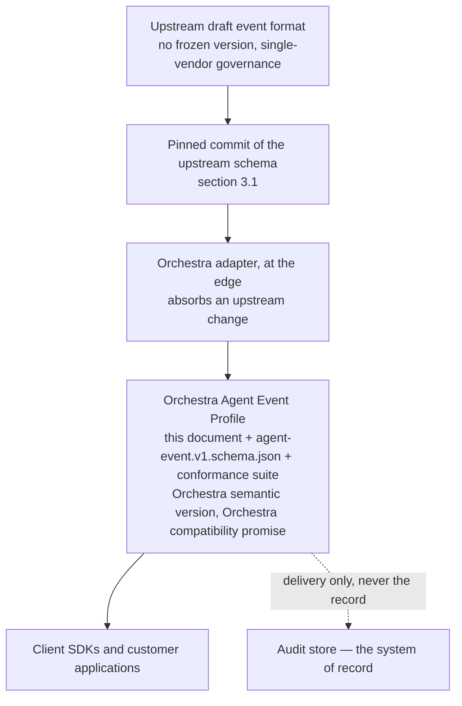
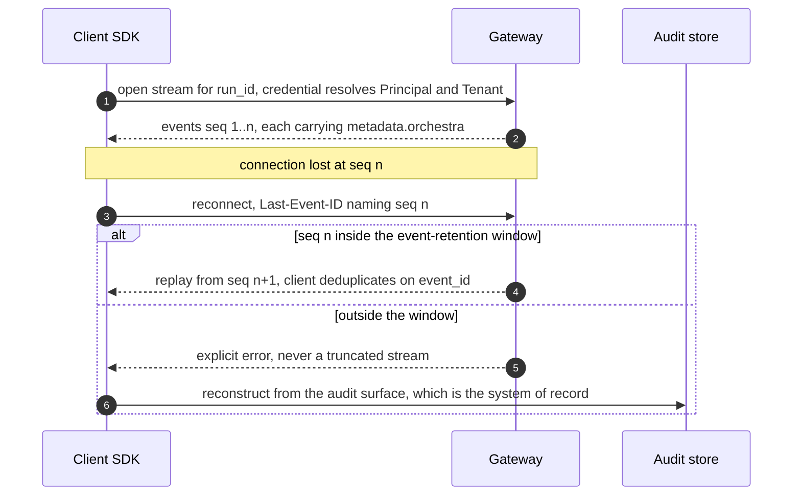

# Event Protocol

This is the prose half of the **Orchestra Agent Event Profile** — the contract a client implements
when it reads the Run event stream, and the word for what flows on it is **Agent Event**
([`../GLOSSARY.md`](../GLOSSARY.md)). The profile is Orchestra's artefact: Orchestra's document,
Orchestra's semantic version, Orchestra's conformance suite. It is derived from an upstream draft
event format, which it pins by commit and never re-exports as a promise. A consumer implements
against this profile and the schema named in section 1, never against the upstream specification,
and no upstream release changes what Orchestra guarantees here.

## 1. Standing, scope and status

**Normative.** Per [`../README.md`](../README.md) section 3, `30-protocol/` binds an implementation,
and MUST, MUST NOT, SHOULD, SHOULD NOT and MAY carry their
[RFC 2119](https://www.rfc-editor.org/rfc/rfc2119) meanings.

**JSON Schema is the source of truth** ([`schemas/README.md`](schemas/README.md),
[`../VERSIONING.md`](../VERSIONING.md) section 6). This document describes intent precisely enough
that the schema can be derived from it; where the two disagree the schema wins.
`agent-event.v1.schema.json` will carry the wire contract — the admitted event set, the
`metadata.orchestra` object of section 4, and every `orchestra.*` extension payload — and **it is
not written yet.** Neither is the conformance suite, which is not optional: a profile without one is
a claim rather than a contract, and there is no upstream corpus to inherit
([`../80-reference/ag-ui-evaluation.md`](../80-reference/ag-ui-evaluation.md) section 7).

**[ADR-0004](../adr/adr-0004-adopt-ag-ui-event-protocol.md) is Proposed, not Accepted.** Every claim
resting on it is marked where it occurs; its one outstanding validation step is section 7, and it
needs code. Orchestra is pre-implementation and pre-customer: no client has consumed this stream and
no design partner has reviewed it.

**In scope:** what the profile admits, refuses and extends; the four per-event guarantees and their
carriage; ordering, gap detection, replay and resumption; profile versioning. **Owned elsewhere:**
the HTTP surface that opens the stream ([`gateway-api.md`](gateway-api.md)) and declarative UI
payloads ([`ui-protocol.md`](ui-protocol.md)); Run and Approval Request states
([`../20-domain/lifecycle-state-machines.md`](../20-domain/lifecycle-state-machines.md)); what is
recorded and retained ([`../40-governance/audit-model.md`](../40-governance/audit-model.md)). No
timeout, retention period, page size, rate limit or payload cap appears here — none is decided
anywhere in this repository, and inventing one would give it an authority nobody granted.

## 2. Why the public contract is Orchestra's own

Three findings, taken on 2026-09-09 against primary sources and recorded with those sources in
[`../80-reference/ag-ui-evaluation.md`](../80-reference/ag-ui-evaluation.md), fix the shape of this
document:

- **No version of the upstream specification has ever been frozen.** There is nothing to pin but a
  commit.
- **The only published artefact disclaims compatibility.** The
  [draft](https://docs.ag-ui.com/spec/draft/basic) states that nothing in it is covered by a
  compatibility promise until a version is frozen, and asks not to be cited as a stable reference.
  This document does not cite it as one.
- **Governance is a single vendor.** One team owns the repository; there is no foundation, no
  steering committee and no proposal process, and that vendor's commercial product sits on the
  format.

Enterprise buyers are offered compatibility promises. **Orchestra cannot offer one stronger than the
promise of the thing it derives from unless the derivation is Orchestra's own artefact.** That is
the whole argument for the profile, and it is why the profile is load-bearing rather than
precautionary ([ADR-0004](../adr/adr-0004-adopt-ag-ui-event-protocol.md) — **Proposed**).

When upstream freezes a version, the profile pins that version instead of a commit and no customer
sees a change. That is the test of the arrangement: an upstream event is an internal event here.

## 3. What the profile declares

### 3.1 The pin

**The profile MUST pin one full commit identifier of the upstream schema, and MUST state it in the
schema file and in this section** ([ADR-0004](../adr/adr-0004-adopt-ag-ui-event-protocol.md) —
**Proposed**). A version range, a tag, a `0.0.x` release or "latest" is not a pin: no upstream
release line has ever carried a compatibility guarantee, so a floating reference would make
Orchestra's promise float with it. The pin moves only by a deliberate profile revision, never by a
dependency update. No commit is pinned today, because no implementation exists to pin one against;
section 11 registers it.

### 3.2 Which events Orchestra emits, and which it does not

The exhaustive per-type enumeration is normative in `agent-event.v1.schema.json`, and emitting a
type it does not enumerate is non-conformant. This table fixes the families and the reasoning.

| Family | In the profile | Grounding |
| --- | --- | --- |
| Run lifecycle | **Emitted.** The states are Orchestra's — `Pending`, `Running`, `Suspended`, `Succeeded`, `Failed`, `Cancelled`, `Denied` — and MUST NOT be a projection of runtime internals. The eighth state in the source, `Compensating`, is **Provisional** there and is not enumerated here; see below | [`../20-domain/lifecycle-state-machines.md`](../20-domain/lifecycle-state-machines.md) sections 2 and 2.4 |
| Text message | **Emitted.** Streamed content from an Agent to an End User | [`../GLOSSARY.md`](../GLOSSARY.md) |
| Tool call | **Emitted.** The Tool is identified by its Tool Catalog identifier and Side-Effect Class; no tool-protocol vocabulary appears | [`../40-governance/tool-authorization.md`](../40-governance/tool-authorization.md); [`../40-governance/audit-model.md`](../40-governance/audit-model.md) A8 |
| State snapshot and delta | **Emitted.** The one capability genuinely inherited: a snapshot replaces wholesale, a delta is an [RFC 6902](https://www.rfc-editor.org/rfc/rfc6902) JSON Patch applied atomically, deltas carry no version, and divergence is repaired by a fresh snapshot | [state events](https://docs.ag-ui.com/spec/draft/events/state) |
| Reasoning | **Not emitted in profile v1.** Who may see model reasoning is undecided, and it is the same question the Evidence Set raises. Admitting the family for every reader of a Run's stream is a MINOR change under R2. Admitting it for some readers and not others is **MAJOR**, because section 4 mints `seq` once per Run and admits no filtered stream | [`../40-governance/audit-model.md`](../40-governance/audit-model.md) section 8; section 4; section 11 |
| Activity | **Not emitted.** Orchestra's progress vocabulary is Step Execution. A second progress vocabulary is a synonym for an existing term, which CLAUDE.md working rule 3 makes a defect | [`../GLOSSARY.md`](../GLOSSARY.md) |
| Subagent attribution | **Not emitted.** Orchestra's nesting is the `subworkflow` Step. Subagent attribution is an execution shape the domain model does not have, and emitting it would create one on the wire before the domain has it | [`../20-domain/domain-model.md`](../20-domain/domain-model.md) |
| Raw passthrough | **MUST NOT be populated.** The base event's raw-event field carries the underlying provider or runtime payload verbatim. Populating it would put a rail's vocabulary into a public contract | [`../40-governance/audit-model.md`](../40-governance/audit-model.md) A8, [ADR-0005](../adr/adr-0005-langgraph-as-compilation-target.md), invariant I6 in [`../20-domain/domain-model.md`](../20-domain/domain-model.md) |
| Custom envelope | **Emitted, `orchestra.`-prefixed only.** Section 3.3 | [ADR-0004](../adr/adr-0004-adopt-ag-ui-event-protocol.md) — **Proposed** |

**`Compensating` is left out deliberately, and leaving it out is not free.**
[`../20-domain/lifecycle-state-machines.md`](../20-domain/lifecycle-state-machines.md) section 2.4
marks it Provisional and leaves one thing open: whether the Run carries an observable roll-up state
while its Step Executions compensate. `execution-semantics.md` in
[`../50-workflows/`](../50-workflows/) decides that, and the profile does not emit a state the
domain model has not settled. The cost is that the Run lifecycle set is one a consumer branches
across exhaustively, so C2 applies rather than R2: **admitting `Compensating` later is a profile
MAJOR.** Section 11 carries the row with the classification its owning document gives it.

Wire compatibility is deliberate. The profile keeps the upstream type constants on the wire, because
the interoperability ADR-0004 buys — any format-aware frontend can read Orchestra's stream — exists
only if it does. What is Orchestra's is the **contract**: which constants may appear, what each
carries, the guarantees of section 4, and the promise attached to all of it. A rail's vocabulary is
a different matter and is excluded absolutely — section 9.

### 3.3 The governance extension namespace

Governance signals are carried as namespaced extensions in the custom envelope. This is the
mechanism [ADR-0004](../adr/adr-0004-adopt-ag-ui-event-protocol.md) chose — **Proposed** — and the
one [`../VERSIONING.md`](../VERSIONING.md) section 5 already names.

| Reserved family | Carries | Names fixed today |
| --- | --- | --- |
| `orchestra.approval.*` | Approval Request lifecycle transitions | `orchestra.approval.required` |
| `orchestra.policy.*` | Policy Decisions surfaced to a client | `orchestra.policy.denied` |
| `orchestra.workflow.*` | Workflow Step transitions | `orchestra.workflow.step.started` |
| `orchestra.quota.*` | Quota Envelope delay signals — section 10 | none yet |
| `orchestra.ui.*` | UI Surface instances and their lifecycle, which [`ui-protocol.md`](ui-protocol.md) UC1 requires to reach a client as an Agent Event and leaves this profile to place — **Proposed** on [ADR-0010](../adr/adr-0010-a2ui-genui-interchange.md) and [ADR-0004](../adr/adr-0004-adopt-ag-ui-event-protocol.md) | none yet — section 11 |

| Rule | Requirement |
| --- | --- |
| **X1 — Prefix** | Every extension name MUST begin `orchestra.`. Unprefixed custom names are reserved for upstream, and Orchestra MUST NOT mint one |
| **X2 — Delivery, never the record** | An extension event MUST NOT be the system of record for the fact it reports; the audit store is ([`../40-governance/audit-model.md`](../40-governance/audit-model.md) section 8). A consumer MUST NOT infer from the absence of an event that the fact did not occur |
| **X3 — Never carried** | A credential in any form, an Evidence Set inline (section 7), the compiled artifact, a Checkpoint (invariant I6), another Tenant's data. Each MUST NOT appear in an extension payload — section 9 states the same prohibitions as they bind the whole stream |
| **X4 — Unknown names are ignorable** | A consumer MUST silently ignore an extension name it does not recognise ([`../VERSIONING.md`](../VERSIONING.md) R3). That is what makes a new governance signal a MINOR change rather than a client migration |

## 4. The four per-event guarantees

Every Agent Event MUST carry a per-Run monotonic `seq`, the `run_id`, the `tenant_id` and a
server-assigned `event_id` ([`../VERSIONING.md`](../VERSIONING.md) section 5; invariant I1,
[`../20-domain/domain-model.md`](../20-domain/domain-model.md)).

| Field | Assigned by | Requirement |
| --- | --- | --- |
| `seq` | The Gateway, at emission | Per-Run, and **minted once per Run rather than once per subscription**. MUST increase by exactly one per emitted event within a Run. A non-contiguous `seq` makes gap detection undecidable, and section 5 requires gap detection |
| `run_id` | At Run admission | The Run the event belongs to. Every event, not only the lifecycle ones |
| `tenant_id` | Resolved from the authenticated Principal at stream establishment, whatever credential established it — see [`gateway-api.md`](gateway-api.md) G3 to G7 for the credential shapes and the resolution rule | Every event, without exception (invariant I1, [ADR-0001](../adr/adr-0001-product-shape-multi-tenant-saas.md)) |
| `event_id` | The server | Unique within the Tenant. The deduplication key of O5, and never a client-supplied value |

The stream is not a Session Token surface. [`gateway-api.md`](gateway-api.md) G3 gives a Platform
User no Session Token at all, and [`ui-protocol.md`](ui-protocol.md) places the approval surface in
front of a Platform User — so a stream that accepted only Session Tokens would leave the one surface
the first vertical slice ships with no delivery path. Any credential the Gateway accepts may
establish a stream; what the profile requires is that it resolve to exactly one Principal and one
Tenant before the first event is emitted.

**One sequence, delivered whole to every authorized reader.** Because `seq` is minted once per Run,
**a Run's stream MUST be delivered whole, and the profile admits no per-reader filtering of it.** A
filtered reader would receive a stream with a hole in it, and O2 obliges that client to surface the
hole as a gap — a false gap, raised by a conformant client doing exactly what this profile requires.
Filtering is therefore not a matter of omitting events: it would require sequencing per subscription
rather than per Run, changing what `seq` means under `metadata.orchestra` and every guarantee
resting on it. **That is a MAJOR change to the profile, not the MINOR one an earlier draft
claimed.** A Principal not entitled to everything a Run's stream carries is not given a narrowed
stream; entitlement is to the stream, and a narrower read is served off it by an authorized surface,
the shape K1 already gives the Evidence Set. The question likeliest to force the change — whether an
End User may see model reasoning, the same question as who may read an Evidence Set — is registered
in section 11 with that classification.

**EG1 — Carriage.** The four MUST be carried together under the vendor-prefixed key `orchestra`
inside the event's `metadata` object, and MUST NOT be duplicated as top-level event fields
([ADR-0004](../adr/adr-0004-adopt-ag-ui-event-protocol.md) — **Proposed**; all four at the top level
are schema-invalid against the published schema, tested in
[`../80-reference/ag-ui-evaluation.md`](../80-reference/ag-ui-evaluation.md) section 4). They are
the profile's and not the format's: no third-party consumer validates them, because none knows they
exist (O3). **The rule binds Orchestra's own fields, not the pinned schema's.** Where a pinned event
type declares a run identifier of its own — the run-lifecycle events do, and a format-aware frontend
keys on it, which is the interoperability section 3.2 is buying — the profile MUST populate it with
the same value, and `metadata.orchestra.run_id` is authoritative if the two ever disagree.

**EG2 — Why not top-level, which is counter-intuitive.** Top-level extras currently survive parsing
in two upstream SDKs — the TypeScript base schema passes unknown properties through, the Python
model allows extras — so **a prototype that puts them at the top level will appear to succeed.** It
is building on a bug. The specification names that pass-through a conformance defect to be fixed,
the schema is the generator source of truth for every SDK, and the [binary
binding](https://docs.ag-ui.com/spec/draft/basic/transports/http-protobuf) declares a base event of
four fields with no catch-all, so top-level extras **vanish silently** on that wire. A guarantee
that disappears without an error is worse than one never claimed.

**EG3 — Why `metadata` works.** It is declared on the base event, so it is present on every event
type; it is open by key; the `ag-ui` key is reserved and every other key is application space; and
the [processing model](https://docs.ag-ui.com/spec/draft/basic/processing) strips unknown properties
everywhere except metadata, where [unknown keys are protocol-legal and never
stripped](https://docs.ag-ui.com/spec/draft/basic/metadata). That was tested against the published
schema, not assumed ([`../80-reference/ag-ui-evaluation.md`](../80-reference/ag-ui-evaluation.md)
section 4).

**EG4 — Field naming.** The profile's own fields are snake_case, as
[`../VERSIONING.md`](../VERSIONING.md) section 5 writes them, inside an envelope that is camelCase.
Everything under `orchestra` is Orchestra's contract and reads like the rest of them.

## 5. Ordering, gap detection and replay

**Nothing here is inherited.** The upstream specification states that arrival order is the
protocol's order and that a consumer MUST NOT use a timestamp to order events; its
[SSE binding](https://docs.ag-ui.com/spec/draft/basic/transports/http-sse) has a section titled "No
resumption", tells consumers to ignore the stream's `id:` field, and directs recovery to a new run
with a new identifier. There is no cursor, no sequence number, no server-assigned event id and no
replay contract. **Ordering and replay are Orchestra's to build**
([ADR-0004](../adr/adr-0004-adopt-ag-ui-event-protocol.md) — **Proposed**), and they are what make
reconnection possible for a Run that may suspend for days.

**O1 — Order.** Within a Run, `seq` is authoritative for Orchestra's own consumers. Wall-clock
timestamps MUST NOT be used to order events; clocks skew across the components that emit them, the
same reasoning [`../40-governance/audit-model.md`](../40-governance/audit-model.md) A7 applies.

**O2 — Gap detection.** An Orchestra client MUST detect a gap by arithmetic on `seq` and MUST
surface it. A stream that silently skips is indistinguishable from a Run that produced nothing, and
absence read as non-occurrence is the failure
[ADR-0013](../adr/adr-0013-fail-closed-policy-decision-writes.md) exists to prevent, by another
route.

**O3 — Nobody else will check it, and that bounds the guarantee.** A `seq` in metadata is
expressible but unenforceable by any third party, because the upstream specification tells consumers
that arrival order is authoritative. **No third-party consumer will validate Orchestra's sequence or
detect a gap on it.** It is data Orchestra carries and Orchestra's own client validates. Where gap
detection is a control, the audit store is the evidence, not the stream.

**O4 — Resumption, on the server-sent-events binding.**
[`../VERSIONING.md`](../VERSIONING.md) section 5 fixes the mechanism — resumption uses the
[server-sent events](https://html.spec.whatwg.org/multipage/server-sent-events.html)
`Last-Event-ID` header, within the Run's event-retention window, failing explicitly rather than
silently skipping a gap. This section fixes its exact semantics, because a conformance suite cannot
be written from the mechanism alone.

- **The cursor value.** The `id:` field MUST carry the event's `seq` as a decimal integer. `seq` is
  what O4 replays from and what O2 checks, and the stream is one Run's, so the Run-scoped counter
  identifies a position on it without ambiguity.
- **Exclusive, not inclusive.** `Last-Event-ID` names the last event the client received, so the
  server MUST replay from the event *after* the `seq` it names. The sequence diagram below shows the
  same rule. O5 makes the other reading survivable but not testable, and a conformance suite has to
  test one.
- **Explicit failure.** A `Last-Event-ID` the server cannot parse as a decimal `seq`, or that names
  a `seq` outside the window, MUST be refused with an explicit, actionable error. It MUST NOT be
  answered with a truncated stream, and MUST NOT be answered with a stream that silently begins
  somewhere else.
- **Other bindings.** O2 and O4 have no defined behaviour on a transport binding without an
  equivalent cursor, and the binary binding has none. Any further binding the Gateway serves MUST
  define an equivalent cursor before it is served; section 11 registers which bindings are served.

**This is a designed divergence.** Orchestra's binding populates, with the `seq`, the `id:` field
that upstream tells generic consumers to ignore. The divergence is safe in one direction only, and
that is why it is acceptable: a consumer that ignores `id:` loses resumption and nothing else, and
never reads a wrong value. It is an addition on Orchestra's own transport binding, not a
reinterpretation of upstream's.

**O5 — Delivery is at-least-once.** Replay may redeliver events a client already saw. A client MUST
deduplicate on `event_id` and MUST NOT treat a redelivered event as a second occurrence of the fact
it reports: a redelivered notification of a side effect is not a second side effect.

Deduplication on `event_id` is the floor rather than the whole rule. Where an extension carries an
instance identified stably within its Run — a UI Surface does
([`ui-protocol.md`](ui-protocol.md) UC3, **Proposed** on
[ADR-0010](../adr/adr-0010-a2ui-genui-interchange.md)) — a redelivered instance MUST replace the one
bearing that identifier rather than appear beside it. The two rules work at different levels:
`event_id` collapses a redelivered event, the instance identifier collapses a re-emitted instance
that arrives as a new event, which `event_id` alone cannot catch. An approver MUST NOT be shown two
gates where one exists.

**O6 — The stream is not the record.** Resumption returns delivery to a client. It does not
reconstruct a Run: the audit surface does, and it is authoritative where the two differ.

## 6. Streamed item families and the metadata merge

This bites only at assembly time. For the streamed item families — text message and tool call in
this profile, reasoning and activity upstream — a consumer MUST merge event `metadata` key by key,
**last-write-wins**, into the assembled item; the rule comes from the pinned schema and so rests on
[ADR-0004](../adr/adr-0004-adopt-ag-ui-event-protocol.md) — **Proposed**.
`metadata.orchestra` is one key, so the assembled item retains the final event's `seq` and
`event_id` and nothing of the events before it.

**M1 — Validate before assembly.** A conformant Orchestra client MUST perform O2 gap detection at
the event level, before item assembly. A client that gap-checks assembled items checks nothing.

**M2 — Do not read the merged values as the item's history.** The `orchestra` values on an assembled
item identify the Run and Tenant and the last contributing event. They MUST NOT be read as the
item's sequence range or as evidence that the item is complete.

**M3 — The governance path is unaffected.** Extensions in the custom envelope, the Run lifecycle
events, the Step transition events and the state events have no merge target, so their metadata
arrives intact and every guarantee attached to a governance signal holds unqualified.

**What is not settled** is a carriage that survives merging — one letting a consumer reconstruct the
per-event sequence of an assembled item. Every obvious candidate either grows the item's metadata
without bound or needs a key the merge cannot collapse, and none has been prototyped. Section 11
carries it with the condition that would escalate it.

## 7. The approval lifecycle, and the step that is still open

How a governance transition reaches a client is this document's to answer. **Whether it survives a
disconnect is [ADR-0004](../adr/adr-0004-adopt-ag-ui-event-protocol.md)'s outstanding validation
step 2, and it needs code rather than prose.** Nothing in this section is tested.

Two carriers are candidates:

- **The custom-event envelope** — `orchestra.approval.*` extensions on the open stream. This is what
  ADR-0004's decision text describes, and it keeps one stream open across a suspension
  [`../20-domain/lifecycle-state-machines.md`](../20-domain/lifecycle-state-machines.md) section 2.2
  says may last days. Nothing tests whether a live stream outlasts a suspension of that length.
- **The upstream 1.0 draft's interrupt-and-resume pattern** — an interrupt carried on run completion
  and tied to a tool call, with resume entries on the run input.
  [`../80-reference/ag-ui-evaluation.md`](../80-reference/ag-ui-evaluation.md) sections 4 and 7
  suggest the better structural fit, because it ends the stream at the gate instead of requiring one
  to persist across it — which is what `Suspended` already means: durable, not dependent on a live
  process or connection. **The suggestion is untested.**

Four rules hold whichever carrier wins, each derived from a document that does not depend on the
choice.

| Rule | Requirement |
| --- | --- |
| **K1 — The Evidence Set is never inline** | An approval event MUST reference the Approval Request by identifier and MUST NOT carry the Evidence Set, which is potentially the most sensitive content in the system and whose readership is undecided ([`../40-governance/audit-model.md`](../40-governance/audit-model.md) section 8). Evidence is read through an authorized surface by a Principal entitled to it, never delivered to whoever holds a stream |
| **K2 — A decision is never taken over the stream** | The stream is server to client. An approval decision is a state-changing call on the Gateway carrying `Idempotency-Key` ([`../VERSIONING.md`](../VERSIONING.md) section 4) — see [`gateway-api.md`](gateway-api.md) |
| **K3 — Resolution does not rewrite the verdict** | An action permitted by a human is a different fact from one permitted by rule ([`../40-governance/policy-model.md`](../40-governance/policy-model.md) V3), so a resumed Run produces a second event and a second record, never an amended one |
| **K4 — Absence proves nothing** | Per X2, a client MUST NOT infer a resolution, an expiry or a withdrawal from silence on the stream |

If validation step 2 shows the lifecycle cannot be expressed without forking the pinned schema,
ADR-0004's revisit criteria apply and the answer is an ADR, not an edit to this document.

## 8. Versioning and compatibility

The profile carries **its own semantic version**, additive-only within a major
([`../VERSIONING.md`](../VERSIONING.md) section 5 and the artifact table, row 4). The upstream
version is tracked and not controlled; it is recorded beside the pin and is not part of any promise
Orchestra makes.

**C1 — The must-ignore rule, stated where it applies.** A consumer MUST silently ignore event types,
fields, enum values, metadata keys and extension names it does not recognise, and MUST NOT fail,
warn loudly, or drop the surrounding envelope ([`../VERSIONING.md`](../VERSIONING.md) R3). This is
the conformance requirement the suite tests first, and it is what buys additive evolution.

**C2 — Where additive stops.** A closed enum is not covered by C1. Adding a fourth Policy verdict is
MAJOR, because every consumer branches across an exhaustive set and a new member repurposes it
rather than extending it ([`../40-governance/policy-model.md`](../40-governance/policy-model.md)
P3). The same test applies to any enum the profile declares exhaustive.

**C3 — No wire-facing object closes.** `additionalProperties` MUST NOT be `false` on a wire-facing
object in an Orchestra schema ([`../VERSIONING.md`](../VERSIONING.md) section 6). Upstream's
concrete event definitions close themselves by a different keyword, which is why extensions live in
`metadata` at all (section 4).
The profile MUST NOT propagate that closure into an Orchestra-owned object — the `orchestra`
metadata object and every `orchestra.*` payload stay open.

**C4 — Deprecation.** An event profile major carries **12 months** of notice before sunset, through
response headers, the changelog, the control plane and email to tenant admins
([`../VERSIONING.md`](../VERSIONING.md) section 10), and nothing is removed while telemetry shows a
supported customer still depends on it. Upstream churn is absorbed rather than passed through: an
upstream breaking change is a profile revision plus an adapter change, and a customer-visible break
requires a profile MAJOR and this notice, independently of what upstream did or when.

## 9. What this protocol never carries

| Never on this stream | Why |
| --- | --- |
| **Rail vocabulary** — the orchestration runtime's, a model provider's or the tool protocol's names, types and payloads — MUST NOT appear in any event, field or extension | CLAUDE.md working rule 2, [ADR-0005](../adr/adr-0005-langgraph-as-compilation-target.md), [`../40-governance/audit-model.md`](../40-governance/audit-model.md) A8. The raw-passthrough field of section 3.2 is the concrete trap |
| **A Checkpoint** MUST NOT be carried | Durable Run state is the runtime's and is never exposed in a public contract (invariant I6, [`../20-domain/domain-model.md`](../20-domain/domain-model.md)) |
| **The compiled artifact** MUST NOT be carried | Retained for reconstruction, never returned ([`../40-governance/audit-model.md`](../40-governance/audit-model.md) section 8) |
| **A credential**, in any form or encoding, MUST NOT be carried | [ADR-0002](../adr/adr-0002-enterprise-segment-and-byok.md) |
| **Another Tenant's event** — an event whose `tenant_id` differs from the stream's MUST NOT be delivered | The Gateway resolves any accepted credential to exactly one Principal and one Tenant, and scoping on a stream is explicit rather than inherited from a query predicate ([`gateway-api.md`](gateway-api.md) G7, [`../40-governance/threat-model.md`](../40-governance/threat-model.md) section 8) |
| **An unvalidated or executable UI payload** MUST NOT be carried. A UI Surface validated server-side against the Tenant's registered component catalog is carried, and only in the reserved `orchestra.ui.*` family of section 3.3 | [`ui-protocol.md`](ui-protocol.md) US1 and US2, which refuse an uncatalogued or executable surface before it reaches this stream; **Proposed** [ADR-0010](../adr/adr-0010-a2ui-genui-interchange.md) |

## 10. Questions assigned to this document, and their answers

| Question, and who assigned it | Answer |
| --- | --- |
| Whether the audit ordering key is this protocol's sequence number or an independent one — [`../40-governance/audit-model.md`](../40-governance/audit-model.md) section 13 | **Independent.** `seq` is per-Run and exists only for facts that reach a stream, while audit-model section 3 enumerates records with no Run at all — a Platform User authenticating, a Tool registered, a Model Binding changed, a read of the audit surface — which a per-Run counter cannot order. A6 also puts the record on the governed path ahead of the gated action, whereas the event is emitted later by the Gateway, and ADR-0013 lets other records degrade while the stream keeps flowing; binding the two would make audit order depend on delivery. An Audit Record MAY carry the corresponding `event_id` as a correlation value. It MUST NOT be the ordering key |
| What value identifies a metered occurrence across the audit and metering stores — [`../40-governance/audit-model.md`](../40-governance/audit-model.md) section 13, with the metering design | **This document answers only its half: it is not `event_id`.** Metered dimensions include occurrences that never reach a stream — Platform User authentications, Connector enrolments, active definitions over a period — and a Run meters with no client connected. ADR-0009 requires meter records reconcilable against the audit log, so the shared value must be one both stores mint on the governed path. ADR-0009's risk table says "keyed on the event id" without saying which identifier that is; it MUST NOT be read as this profile's `event_id`. `quotas-and-metering.md` in [`../60-operations/`](../60-operations/) owns the positive answer |
| How a delay against a Quota Envelope is surfaced, given a waiting Run is still `Running` — [`../10-architecture/data-plane.md`](../10-architecture/data-plane.md) section 11 | **As an event in the reserved `orchestra.quota.*` family, not as a Run state** — resting on [ADR-0004](../adr/adr-0004-adopt-ag-ui-event-protocol.md), **Proposed**, as that document marks it. The Run state machine has no capacity state and inventing one is neither that document's nor this one's to do. An extension event is the right carrier precisely because C1 makes an unrecognised one ignorable, so surfacing the delay cannot break an existing client. What the payload carries — queue depth, an estimate, the Model Binding — is `quotas-and-metering.md`'s |
| How an approval transition reaches a client, and whether it survives disconnect and replay — [`../40-governance/approval-workflows.md`](../40-governance/approval-workflows.md) section 11, [`../20-domain/lifecycle-state-machines.md`](../20-domain/lifecycle-state-machines.md) section 6 | **Half answered.** It reaches the client in the `orchestra.approval.*` family under rules K1–K4: by reference, never with the Evidence Set inline, never as the system of record, and never as the channel a decision is taken on. Whether it survives a disconnect is ADR-0004 validation step 2, still outstanding; section 11 carries the carrier choice |
| How a Run event stream survives a disconnect, replay being Orchestra's to build — [`../10-architecture/data-plane.md`](../10-architecture/data-plane.md) section 11 | **Answered by section 5**, resting on [ADR-0004](../adr/adr-0004-adopt-ag-ui-event-protocol.md), **Proposed**, as that document marks it: contiguous per-Run `seq`, gap detection by arithmetic, `Last-Event-ID` resumption exclusive of the named `seq` and within the Run's event-retention window, explicit failure rather than silent truncation, at-least-once delivery deduplicated on `event_id`. The window's length is not decided — section 11 |
| How a Policy Decision reaches a client — [`../40-governance/policy-model.md`](../40-governance/policy-model.md) section 9 | **In the reserved `orchestra.policy.*` family of section 3.3, as delivery and never as the record.** X2 makes the Policy Decision record in the audit store the system of record and forbids reading absence on the stream as non-occurrence, which is what [ADR-0013](../adr/adr-0013-fail-closed-policy-decision-writes.md) requires of every consumer of this signal. What a denial payload carries is the policy model's. Rests on [ADR-0004](../adr/adr-0004-adopt-ag-ui-event-protocol.md), **Proposed**, as that document marks it |

## 11. Open questions

**ADR** means the choice is costly to reverse or spans components and must be recorded as an ADR
before implementation. **No** means a later document or a named validation step suffices. Where
another document owns a row, its classification is repeated rather than revised.

| Question | What would decide it | ADR required? |
| --- | --- | --- |
| Which carrier the approval lifecycle uses — the custom-event envelope or the upstream interrupt-and-resume pattern | [ADR-0004](../adr/adr-0004-adopt-ag-ui-event-protocol.md) validation step 2: a prototype through disconnect. The evaluation favours interrupt-and-resume and that is untested | No — ADR-0004 exists and owns it, as [`../40-governance/approval-workflows.md`](../40-governance/approval-workflows.md) section 11 classifies it |
| A per-event carriage for the streamed item families that survives last-write-wins metadata merging | A prototype against the pinned schema; ADR-0004 registers it as follow-on work | **Yes, if it forces a fork of the pinned schema** — that changes the compatibility promise and the adapter together. Otherwise No |
| The length of the Run's event-retention window, which bounds resumption | Storage cost modelling once volume is observable, with `reliability.md` in [`../60-operations/`](../60-operations/). It is not the audit-retention period: the stream is delivery and this window bounds resumption, not evidence | No — but the profile cannot claim conformance to O4 until a number exists |
| Whether an out-of-band replay endpoint exists alongside in-stream resumption | Left open explicitly by ADR-0004; [`gateway-api.md`](gateway-api.md), with section 5 | No |
| Which upstream commit the profile pins, and what governs moving it | The first implementation. The pin is normative and there is nothing to pin against until code exists | No |
| Which transport bindings the Gateway serves, given that only the binary one drops top-level extras silently and only the server-sent-events one carries a cursor | [`gateway-api.md`](gateway-api.md). EG2 holds on any answer and holds hardest if the binary binding is ever served; O4 binds only where a binding defines an equivalent cursor, so O2 and O4 have no defined behaviour on a binding served without one | No |
| Whether the profile ever admits a reasoning family, and what an End User may see of model reasoning | The same decision [`../40-governance/audit-model.md`](../40-governance/audit-model.md) section 13 registers for who may read an Evidence Set; `identity-and-access.md` in [`../10-architecture/`](../10-architecture/) owns it. Section 4 bounds the answer: admitting the family for every reader of a Run's stream is MINOR under R2, while a per-reader answer needs per-subscription sequencing | No — classified as its owning document classifies it. The profile change a per-reader answer forces is a **MAJOR**, not the MINOR an earlier draft claimed |
| Whether the profile enumerates `Compensating`, and what it emits while Step Executions compensate | Whether the Run carries an observable roll-up state at all, which [`../20-domain/lifecycle-state-machines.md`](../20-domain/lifecycle-state-machines.md) section 2.4 marks Provisional and assigns to `execution-semantics.md` in [`../50-workflows/`](../50-workflows/) | No — that document's classification, repeated. Admitting the state into the profile later is a **MAJOR** under C2, which is the cost of leaving it out today |
| The event names inside the reserved `orchestra.ui.*` family, and how a surface orders against the approval extension it accompanies | [`ui-protocol.md`](ui-protocol.md) UC1, which asks this profile to fix them and invents none; section 3.3 reserves the family and does not name its events | No — additive under R2 once a surface model exists, and both ADRs behind it are **Proposed** |
| Whether untrusted content carries provenance inside the model context, and whether that marking reaches this contract — the profile carries none in v1 | [`../40-governance/policy-model.md`](../40-governance/policy-model.md) section 9, with this document; assigned by [`../40-governance/threat-model.md`](../40-governance/threat-model.md) section 14 | **ADR** if it changes a public contract — that document's classification, repeated |
| Whether Orchestra's resumption survives a frozen upstream version that makes the no-resumption rule normative for producers as well as consumers | The freeze, which has no announced date. Today the rule binds consumers only, so O4 is an addition rather than a contradiction | No — ADR-0004's revisit criteria already cover a divergence that forces a fork |
| Whether the conformance suite tests against a fixture corpus of Orchestra's own making, and what "conformant client" admits | The suite, which does not exist. There is no upstream corpus to inherit ([`../80-reference/ag-ui-evaluation.md`](../80-reference/ag-ui-evaluation.md) section 7) | No |

Two rows deliberately do not appear. **How a `deny` outside admission ends a Run in flight** is
[`../40-governance/policy-model.md`](../40-governance/policy-model.md) section 9's, marked **ADR**
there; this profile carries whatever transition that decision produces. **What satisfies an Approval
Chain** is [`../40-governance/approval-workflows.md`](../40-governance/approval-workflows.md)'s, and
`orchestra.approval.*` reports chain progress in whatever shape that document settles on.
