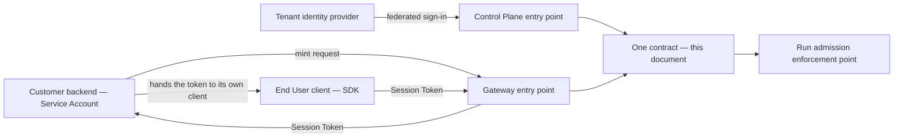

# Gateway API

The resource-oriented HTTP surface: what a customer's backend, a client SDK and the Control Plane
front end all call. It fixes the resource model, the authentication shapes, how a tenant is
established, which of two idempotency mechanisms a caller is using, and which outcomes an
implementation MUST keep distinguishable. It is not an endpoint catalogue.

## 1. Standing and scope

**Normative** ([`../README.md`](../README.md) section 3): implementations must conform. Keywords
carry their [RFC 2119](https://www.rfc-editor.org/rfc/rfc2119) meanings, and rules are numbered
`G1`–`G25` so other documents can cite them. **A citation MUST name this file** — `gateway-api.md`
G3 — because `G` is not unique across the normative set:
[`../40-governance/approval-workflows.md`](../40-governance/approval-workflows.md) numbers its gate
rules `G1`–`G3`, and [`event-protocol.md`](event-protocol.md) numbered its carriage guarantees the
same way before moving them to `EG1`–`EG4`. Citations of another document's rules below are
qualified the same way, since `A`, `D` and `E` collide across
[`../40-governance/policy-model.md`](../40-governance/policy-model.md), `approval-workflows.md` and
[`../40-governance/audit-model.md`](../40-governance/audit-model.md) too. Renumbering the corpus
onto document-unique prefixes, as `event-protocol.md` has begun to, would be the durable fix and is
nobody's assignment yet.

**JSON Schema is the source of truth for every wire contract**
([`schemas/README.md`](schemas/README.md)). Prose describes intent precisely enough that a schema
can be derived from it and names which planned file carries it; no file under [`schemas/`](schemas/)
exists yet, and where a schema and this prose ever disagree the schema governs.
Orchestra is **pre-implementation and pre-customer**: no platform code, no endpoint implemented.
**No timeout, retention period, page size, rate limit, payload cap or credential lifetime appears
below**, because none is decided anywhere in this repository.

Three **Proposed** ADRs reach this document and are marked where they bear, none of them binding:
[ADR-0004](../adr/adr-0004-adopt-ag-ui-event-protocol.md) for the Run event stream this contract
attaches to, specified in [`event-protocol.md`](event-protocol.md);
[ADR-0007](../adr/adr-0007-outbound-connector-for-enterprise-reachability.md) for the Connector
resource entirely; [ADR-0010](../adr/adr-0010-a2ui-genui-interchange.md) for declarative UI, which
belongs to [`ui-protocol.md`](ui-protocol.md). The definition language, the policy language and
which container serves which path are owned by [`../50-workflows/`](../50-workflows/),
[`../40-governance/policy-model.md`](../40-governance/policy-model.md) and
[`../10-architecture/containers.md`](../10-architecture/containers.md).

## 2. What VERSIONING already fixed

[`../VERSIONING.md`](../VERSIONING.md) fixes this API's versioning shape completely, and it is cited
section by section rather than re-decided: section 4 for the major version in the path, dated
revisions in an `Orchestra-Version` header resolving to the tenant's pin and never to `latest`,
`Idempotency-Key` on every state-changing endpoint with the original response returned on replay,
`Deprecation` and `Sunset` headers, and support windows of 24 months for a revision after its
successor's release and 36 months for a major after its successor's GA; section 10 for the 12- and
24-month deprecation notices; section 7 for rejecting an unsupported revision or profile range at
session establishment; section 6 for `additionalProperties` never being `false` on a wire-facing
object. Nothing below may contradict any of it, and where a figure is repeated here that document
holds the only copy.

**Section 5 binds this contract too, and is not reopened below.** Stream resumption uses SSE
`Last-Event-ID`. The exact resumption semantics are specified by
[`event-protocol.md`](event-protocol.md) O4 and are not restated here; the Gateway is the component
that assigns `seq` and serves the replay, within the Run's event-retention
window and MUST fail explicitly rather than silently skip a gap. The Gateway is the component that
assigns `seq` and serves that replay, and [`event-protocol.md`](event-protocol.md) section 5 carries
the rest — contiguous per-Run `seq`, gap detection by arithmetic, at-least-once delivery
deduplicated on `event_id`. Only the window's length is open, and that document owns it. The stream
itself rests on [ADR-0004](../adr/adr-0004-adopt-ag-ui-event-protocol.md), **Proposed**: if it is
rejected the carrier changes, and these obligations are Orchestra's own either way, since the
upstream format supplies neither ordering nor replay.

**G1 — The must-ignore rule governs this contract** (R3). A consumer MUST silently ignore fields,
resource states, error codes, Side-Effect Class values and metered dimensions it does not recognise,
and MUST NOT fail, warn loudly or drop the envelope. Every additive change below relies on it.

**G2 — Must-ignore is a compatibility rule, not a defaulting rule.** An implementation MUST NOT
substitute a permissive default: an unrecognised Side-Effect Class MUST NOT become `read`, and an
unrecognised failure code MUST NOT become safe to retry. Where a value is security-relevant the safe
degradation is *unknown*, never *benign*.

## 3. Authentication shapes

[`../10-architecture/identity-and-access.md`](../10-architecture/identity-and-access.md) sections 2
and 3 own the identity model, and enumerate one authentication shape per Principal subtype: four,
not two. Two *entry points* authenticate — the Control Plane's and the Gateway's, section 6 — and
the two are not the same count. What binds on this contract is the following.

**G3 — A Platform User administers through the Control Plane, authenticated by the tenant's
identity provider.** Orchestra holds no password and runs no sign-in of its own; that authentication
is an audited act and the seat-billable dimension (ADR-0009).

**G4 — An End User reaches this contract only with a Session Token.** Whatever credential a Service
Account presents is not a Session Token
([`../10-architecture/identity-and-access.md`](../10-architecture/identity-and-access.md) section 3,
which fixes only that and leaves the class open between a long-lived secret, an asymmetric key and
workload identity federated from the customer's cloud), and **no credential of either kind may
appear in a browser or mobile bundle, in client source, or in any artifact shipped to a device**
([`../GLOSSARY.md`](../GLOSSARY.md), `threat-model.md` T5). This document names no term for the
Service Account's credential, because the glossary defines none: "tenant API key" appears there only
in the negative, as what a Session Token is never.

**G5 — Minting is a Gateway operation performed by a Service Account**, which presents its own
credential and asks Orchestra for a short-lived, narrowly scoped token for a named End User.
Orchestra does not authenticate the End User; it trusts an assertion the backend makes, which
[`../40-governance/threat-model.md`](../40-governance/threat-model.md) names boundary B1 and places
in its trusted-by-assumption set. Issuance and revocation are audited
([`../40-governance/audit-model.md`](../40-governance/audit-model.md) section 3); revocation removes
an authority, never an identity and never a recorded attribution.

**G6 — A Session Token's expiry bounds what may be started or sent, never the life of a Run
already admitted.** A Run may suspend at an Approval Request for days; were its authority to expire
with the admitting token, no suspended Run could resume. The Run records its Principal and pins its
versions at admission. This discharges the assignment
[`../10-architecture/identity-and-access.md`](../10-architecture/identity-and-access.md) section 9
makes here, whatever the lifetime turns out to be.



The mint, illustrative only. The path shown is an example and not a decision: JSON Schema fixes
representations, not URLs, and [`../VERSIONING.md`](../VERSIONING.md) section 4 fixes only the `/v1`
prefix, so **the endpoint shape of this contract — path layout and resource addressing — is
undecided**, though [`ui-protocol.md`](ui-protocol.md) section 1 assigns it here. Section 9 carries
it.

```http
POST /v1/session-tokens
Authorization: Bearer <service-account-credential>
Orchestra-Version: 2026-09-08
Idempotency-Key: <client-generated-uuid>
```

That last header is a collision worth naming: a replay MUST return the original response, so a
replayed mint returns a bearer credential a second time, and satisfying the rule literally means
holding a live credential wherever idempotent responses are kept (section 9).

## 4. Tenant scoping, and the two idempotency keys

**G7 — The Tenant is resolved from the presented credential.** A tenant identifier a caller can
set, in a path segment, query parameter, body field or header, MUST NOT exist on this contract.
Where one appears in a representation it is an echo of what the credential established, never an
input. A caller-supplied tenant is an isolation defect, not a convenience.

**G8 — Every persisted record, emitted event and log line carries a tenant identifier** (invariant
I1, ADR-0011); isolation is enforced by row-level security in the datastore, and a missing tenant
predicate in application code MUST NOT be sufficient on its own to cross a boundary. A **reference
to another Tenant's resource MUST NOT be answered differently from a reference to one that does not
exist** — separating *forbidden* from *absent* across the boundary is an existence oracle, stated
as observable behaviour because the status vocabulary is undecided.

**G9 — A Workspace narrows visibility and administration and is not an isolation boundary**
(domain model section 3, `tool-authorization.md` TA4); it is enforced in application code and can be
nowhere else, since row-level security filters on the Tenant. No platform-operator route reaches
this contract: an operator resolves to no Principal, so `policy-model.md` N2 fails such a path
closed — the state of the world under N2, not a settled scope.

Two different mechanisms are called an idempotency key, and this is the likeliest place for a
serious bug.

**G10 — `Idempotency-Key` is request deduplication at the API boundary**: a header on one HTTP
request, caller-generated, scoped to that request, living for the retention window. **A Step
Execution's idempotency key is a different mechanism with a different lifetime** — idempotency,
retry and compensation are scoped to a Step Execution, never to the Run (invariant I4,
[ADR-0008](../adr/adr-0008-declarative-workflow-definitions.md) follow-on 3). It is not a header,
not caller-supplied, and appears here only as a recorded attribute of a Step Execution. An
implementation MUST NOT derive one from the other, map one onto the other, or write "the idempotency
key" unqualified.

**G11 — A replayed submission MUST NOT create a second Run and MUST NOT re-run admission**, which
writes a Policy Decision for every evaluation (`policy-model.md` D1); re-evaluating would record two
admission decisions for one submission. **A replayed approval decision MUST NOT record a second
decision**, since every Audit Record resolves to exactly one Principal (`audit-model.md` A3).

**G12 — An idempotent replay is not a retry of a side effect.** Returning a stored response is
safe; re-attempting a partially executed Tool call is not (CLAUDE.md working rule 6,
`tool-authorization.md`
TA18), and the two MUST NOT share a code path. The window's length, and what happens when a key is
reused with a different payload, are decided nowhere; section 9 registers both.

## 5. The resource model

Derived from [`../20-domain/domain-model.md`](../20-domain/domain-model.md). Every resource is
tenant-scoped by G7. *Operations* names what may be done, not endpoint syntax.

| Resource | What it is | Operations | Governing rule | Schema |
| --- | --- | --- | --- | --- |
| Run | One execution of an Agent version or Workflow version | Submit, read, list, cancel; attach the event stream | `policy-model.md` E1, V1; lifecycle section 2 | `run.v1` |
| Agent, Workflow, and their versions | Stable named definitions; publishing freezes an immutable version | Author a draft, publish, set current; read and retire a version | ADR-0008; VERSIONING W1–W4 | `workflow-definition.v1`; none for Agent |
| Approval Request | A gate raised by a `require_approval` verdict | Read, decide; never create | `policy-model.md` V2; `approval-workflows.md` | `approval-request.v1` |
| Evidence Set | The exact inputs the Agent relied on | Read, under a separate narrower authorization | `approval-workflows.md` E1–E6 | `approval-request.v1` |
| Policy, Policy version | Tenant-authored rules, immutably versioned | Author a draft, publish; never edit a published version | ADR-0012; `policy-model.md` P5 | `policy-rule.v1` |
| Tool | A capability registered in the Tenant's Tool Catalog | Register, re-register, read, list | Invariant I5; TA1–TA3, TA9 | None planned |
| Capability grant | An Agent version's permission to call one Tool | Grant, revoke — audited separately from registration | Invariant I5; TA1–TA3, TA5 | None planned |
| Connector | Customer-deployed software proxying Tool traffic inward | Enrol, read health, revoke | ADR-0007 — **Proposed** | `connector-envelope.v1` is the tunnel, not this |
| Model Binding | Surface, endpoint, credential reference, declared limits | Create, update, register or rotate a credential by reference | ADR-0006, ADR-0002; `threat-model.md` T5 | None planned |
| Session Token | A short-lived scoped client credential | Mint, revoke | GLOSSARY; section 3 | None planned |
| Audit Record | An append-only immutable fact | Read and query — and the read is itself audited | `audit-model.md` A1–A8 | `audit-record.v1` |
| Usage | Metered dimensions for a period | Read | ADR-0009 | None planned |
| Workspace, Principal | Administrative identity and scope inside a Tenant | Create, update, remove | ADR-0011; `identity-and-access.md` | None planned |
| Tenant | The isolation boundary every other row sits inside | Read and update. **No create and no remove**: G7 resolves the Tenant from the credential, so no caller can create the Tenant its own credential presupposes, and G9 leaves no operator route that could. Onboarding a Tenant is an insert rather than an operation here ([ADR-0011](../adr/adr-0011-tenant-isolation-shared-schema-rls.md)); which surface performs it is undecided, section 9 | ADR-0011; `identity-and-access.md` | None planned |

### 5.1 Runs

A Run pins the version it started with and executes it to completion, even after that version is
retired (invariant I3, VERSIONING W2–W3).

**G13 — A Run refused at admission is a created Run in `Denied`, not a failed submission.** `deny`
is refusal, not failure (`policy-model.md` V1), `Denied` is a real state with a persisted record
(lifecycle 2.1), and ADR-0009 meters Runs by outcome — a refusal that vanishes into a transport
error destroys the dimension a review cares about most. **Execution MUST NOT begin before the
admission Policy Decision is durable**
([ADR-0013](../adr/adr-0013-fail-closed-policy-decision-writes.md); `policy-model.md` E5 and D3,
whose labels `approval-workflows.md` also uses for different rules): submission MAY return with the
Run in `Pending`, and MUST NOT return one in `Running` whose decision is not yet durable.

**G14 — Resumption, migration and reopening are not operations on a Run.** A Run suspends at an
Approval Request or at a `wait` step, one state with a recorded reason (lifecycle 2.2), and resumes
when the request resolves or the wait elapses. Neither is a caller's to invoke: resuming a gated Run
directly would bypass the gate, and elapsed time has no acting Principal to attribute a resume to
(`audit-model.md` section 9). Terminal is permanent (lifecycle section 1): re-running means a new
Run referencing the old, and W3 forbids an in-flight migration ever being added.

**G15 — Cancellation stops orchestration, not side effects**: a Run cancelled mid-invocation
leaves that invocation in an unknown state, and unknown is not the same as not done (lifecycle 2.4).
It is authorized as an administrative act rather than by Policy — it is not one of the three
enforcement points, and `policy-model.md` E1's *minimum, not a maximum* leaves adding one
available. **This document takes the assignment
[`../10-architecture/identity-and-access.md`](../10-architecture/identity-and-access.md) section 7
makes; the table below is normative here.** The transition is audited with the cancelling Principal
and any Step Execution in flight.

| Principal | May cancel | Basis |
| --- | --- | --- |
| Platform User | With an explicit administrative grant, tenant-scoped, optionally Workspace-narrowed | The stop ADR-0003 implies must be reachable from the Control Plane |
| Service Account | With the same administrative grant | A backend that can start a Run must be able to stop one |
| End User | Only in a Conversation they are party to, and only where the Session Token's scope says so | Deny-by-default: absent an explicit scope, no |
| Connector | Never | Reachability is not authority (TA8) |
| Platform operator | Not reachable on this contract | No Principal resolves; `policy-model.md` N2 |

The End User row contains an undefined term: **what a Session Token's scope may contain is not
decided**, and it belongs to the delegation decision `tool-authorization.md` section 6 marks
ADR-required. Section 9 repeats that classification unchanged.

### 5.2 Definitions and their versions

**G16 — A published version has no update and no delete operation, and their absence is the
contract.** Publishing freezes an immutable version (W1); an operation that edited one would make
every Run's pin a lie. Retirement drains rather than kills (W4). **Archival is not an operation at
all**: it is caused by the last pinned Run reaching a terminal state, so no Principal acts and there
is nothing for a caller to invoke — which is the whole of what this contract decides about it. How
the resulting Audit Record is attributed is not this document's, and is not settled anywhere:
`audit-model.md` section 9 owns `Retired → Archived` as one of the transitions caused by an observed
condition rather than an act, marks the class **ADR**-required and does not close it, while
[`../20-domain/lifecycle-state-machines.md`](../20-domain/lifecycle-state-machines.md) section 4.1
requires archival to record an acting Principal. Two normative statements, one of which has to give,
with G11's *exactly one Principal* (`audit-model.md` A3) as the constraint they sit against. Section
9 repeats that row's classification. The compiled artifact is retained and never returned (ADR-0005,
`audit-model.md` section 3).

**G17 — No rail vocabulary appears in any representation.** The orchestration runtime's, a model
provider's and the tool protocol's vocabularies MUST NOT appear in a field name, enum value,
resource name or error code (CLAUDE.md working rule 2,
[ADR-0005](../adr/adr-0005-langgraph-as-compilation-target.md), `audit-model.md` A8), and a
Checkpoint is never addressable (invariant I6). A rail-minted identifier MAY be carried as an opaque
value where it lets a customer reconcile against their own provider-side records — under BYOK
those are the customer's — but MUST NOT be typed, named or structured so as to expose the rail.

A Workflow version pins the *major* version of each Tool schema it references (W5); a bump surfaces
as an actionable warning and MUST NOT alter a published version. Whether an *Agent* version pins one
is ADR-required in
[`../40-governance/tool-authorization.md`](../40-governance/tool-authorization.md).

### 5.3 Approval Requests and Evidence Sets

An Approval Request exists only as the consequence of a `require_approval` verdict
(`policy-model.md` V2), so **no create operation exists** and every request has a causing Policy
Decision. The representation MUST carry the proposed action as it would execute
(`approval-workflows.md` R1) and each evidence item's provenance (its E6), and MUST label a
model-generated justification as the Agent's argument rather than evidence (its E2). The Evidence
Set is immutable from raise time (its E4) and **MUST be read under a separate, narrower
authorization than the audit surface**, a Principal resolved into an Approval Chain reading the
Evidence Set of the request they decide on a request-scoped basis rather than a standing grant.
That rule is derived in
[`../10-architecture/identity-and-access.md`](../10-architecture/identity-and-access.md) section 6,
which is informative and routes the binding form to
[`../40-governance/audit-model.md`](../40-governance/audit-model.md); that document's section 13
still registers who may read an Evidence Set as open, and section 9 here repeats its
classification.

**G18 — An approval resolution MUST NOT be represented as an `allow`.** The verdict was
`require_approval` and the resolution is a separate governance fact (`policy-model.md` V3): audit
must distinguish an action permitted by rule from one permitted by a human. What satisfies a chain,
whether a deadline exists, escalation, delegation, reassignment and re-raise are **not decided**
and are not invented here
([`../40-governance/approval-workflows.md`](../40-governance/approval-workflows.md) sections 5 to
8). If a deadline is adopted, `Expired` MUST be distinct from `Rejected`.

### 5.4 Tools, the Tool Catalog and capability grants

Registration is not permission (invariant I5, TA1). **Registering a Tool and granting an Agent
version permission to call it MUST be distinct operations, separately authorized and separately
audited**; a contract in which registration also permits invocation collapses what makes
authorization deny-by-default. Reachability is not authority (TA8): a Tool's representation MUST NOT
imply permission from the fact that Orchestra can reach its origin. The Side-Effect Class is
declared at registration (TA9) and enumerated; adding a value is additive under R2 and R3, subject
to G2. **Whether a capability grant is authored inside the immutable Agent version or as a resource
of its own is ADR-required and undecided**, and this contract MUST NOT presume either answer.

### 5.5 Connectors and Model Bindings

> **Connectors rest on a Proposed decision.**
> [ADR-0007](../adr/adr-0007-outbound-connector-for-enterprise-reachability.md) binds only after
> design-partner validation. If it is rejected the Connector resource leaves this contract, Tools
> are reached over direct HTTPS only, and nothing else here changes.

A Connector is a Principal, so its enrolment credential is not a Session Token. Enrolment, first
session, every version negotiation outcome including refusals, and revocation are audited. A
connector below the minimum supported version is refused with an explicit, actionable error and
never silently degraded ([`../VERSIONING.md`](../VERSIONING.md) section 9).

**G19 — No operation on this contract returns credential material in any form**, masked, truncated,
re-encrypted or partial. The narrow ground is already settled: `threat-model.md` T5 forbids
rendering a credential in plaintext to any interface, support tool, export or error surface, and
[ADR-0002](../adr/adr-0002-enterprise-segment-and-byok.md) custodies by reference. The wider claim
— that custody is write-only with respect to every Principal — is derived in
[`../10-architecture/identity-and-access.md`](../10-architecture/identity-and-access.md) section 10,
which names `threat-model.md` T5 as its normative home and records that T5 currently holds it open;
G19 does not wait on it. The credential is held by reference, so rotation changes the material
behind a stable reference and nothing a Tenant authored moves.

Deployment Surface is an enumerated value orthogonal to vendor
([ADR-0006](../adr/adr-0006-model-layer-as-credential-broker.md)); there is no `provider` field,
because one vendor's model is reachable through several surfaces with different authentication,
identifiers, regional behaviour and quota. The customer's own model identifier is an opaque
customer-supplied value under G17. An Agent version selects Model Bindings in order — a primary
and a declared fallback list — and **fallback between Tools MUST NOT exist**, because a second
Tool is a second side effect, not a second attempt at the first.

### 5.6 Audit and usage

Audit is a product surface, not a log level, readable by the Tenant's own Principals rather than
only by the platform operator (`audit-model.md` section 8), and read-only here. **No Principal reads
it by virtue of a subtype**: an explicit administrative grant is required, and a Service Account
holding one is a Principal like any other — `identity-and-access.md` section 6 derives both and
routes the binding form to `audit-model.md`, whose section 13 still registers the rule as open.
**G20 — A read of the audit surface or of an Evidence Set produces an Audit Record** naming the
reading Principal and the query scope (`audit-model.md` section 3, whose single combined row for the
two reads that document is expected to split when the authorization rule lands there); the recursion
terminates because the record of a read is an ordinary record. Records within a Run carry a
deterministic ordering key, and wall-clock timestamps MUST NOT be the sole basis for order
(`audit-model.md` A7). Retention periods are decided nowhere, and export — format, transport,
completeness proof — has no design.

Usage is read-only over ADR-0009's dimensions. **Model token usage is reported and never billed**;
under BYOK the tokens are already the customer's. Attribution beyond the metered dimensions does not
exist, and "department" maps onto Workspace. **No price, tier, package or invoice resource exists**:
ADR-0009 defers tiering and early contracts are priced by hand.

## 6. Whether the administrative API is this contract

[`../10-architecture/control-plane.md`](../10-architecture/control-plane.md) section 13 assigns this
question here. **Answer: one resource-oriented contract, served at two authenticating entry
points.** [`../VERSIONING.md`](../VERSIONING.md) enumerates nine versioned artifacts and contains
exactly one HTTP API; a second administrative contract would be a tenth, needing its own path major,
revision timeline, support window and deprecation notices, none of which that document provides. The
resources are the same resources — a Run submitted by a Service Account and cancelled by a
Platform User, an Approval Request raised on the execution path and decided administratively, a Tool
registered administratively and invoked under Policy — so two contracts would need two names or
two shapes for one thing, and a synonym for an existing term is a defect (CLAUDE.md working rule 3).
What differs between the paths is authentication and authorization, not representation.

**G25 — Attaching a Run's event stream is not a Session Token surface.** It is an operation on the
Run resource (section 5), and **any credential this contract accepts MAY establish a stream**: the
Tenant resolves from the authenticated Principal at stream establishment, whatever credential
established it, and what the profile requires is only that the credential resolve to exactly one
Principal and one Tenant before the first event ([`event-protocol.md`](event-protocol.md) sections 4
and 9, on [ADR-0004](../adr/adr-0004-adopt-ag-ui-event-protocol.md), **Proposed**). A
Session-Token-only stream would be unsatisfiable on this contract: G3 gives a Platform
User no Session Token at all, and [`ui-protocol.md`](ui-protocol.md) puts the approval surface,
delivered as an Agent Event, in front of one — so the single surface the first vertical slice ships
would have no delivery path. **The stream is attached whole or not at all**: `seq` is minted once
per Run, so that profile admits no per-reader filtering and this contract has no partial-stream
operation to offer — a Principal not entitled to everything a Run's stream carries is served a
narrower read by another surface, not a narrowed stream. Which container serves which path is
[`../10-architecture/containers.md`](../10-architecture/containers.md)'s, and its section 3 gives
the Gateway as the event-stream boundary while drawing the Admin Console no edge to it; section 9
carries that gap.

The cost, stated rather than hidden: one revision timeline couples administrative refinements to
execution changes, so a revision forced by the Control Plane moves the pin for a customer who only
submits Runs. Accepted because R3 keeps most changes revision-free, and two timelines would double
what a customer's change-management process must track.

## 7. Error taxonomy

A policy deny, an approval gate, a quota wait and an unreachable connector are different outcomes.
What the taxonomy *is* — envelope, code vocabulary, status mapping — **is not decided**, and no
example error body appears here, because inventing one would be read as the decision. What the
governance rules already determine about it:

- **G21 — Every failure MUST carry a retry-safety classification with three values, not two** —
  *safe*, *unsafe*, *indeterminate*. ADR-0006 requires that a failed model call, safe to retry, be
  distinguishable from a partially executed tool call, which is not; a boolean cannot express
  indeterminate, and unknown is not the same as not done.
- **G22** — a governance refusal MUST be distinguishable from a fault (`policy-model.md` V1), and
  `require_approval` MUST NOT be a failure at all: the Run is `Suspended` and the gate is a resource
  (its V2).
- **G23** — a refusal MUST NOT carry Policy rule text or the matched Policy version's content. It
  MAY carry an opaque decision reference; reading the decision is an audit read under section 5.6.
- **G24** — the taxonomy MUST be at least two levels, so an unrecognised code degrades to a
  recognised class under R3; under G2 that degradation is *unknown*, never *safe*.

| Outcome | What happened | Retry safety | Rule |
| --- | --- | --- | --- |
| Policy deny | A rule refused it; nothing was attempted | Never — re-attempting is not a retry | `policy-model.md` V1 |
| Precondition deny | No Catalog registration, or no capability grant; names no Policy | Never | `policy-model.md` A4; `tool-authorization.md` TA6 |
| Evaluation incomplete, or decision not durable | Fail closed; the gated action MUST NOT proceed | Safe — nothing ran | `policy-model.md` A3, N2 and D3; ADR-0013 |
| Approval gate | Not a failure; the Run suspended | Not applicable | `policy-model.md` V2 |
| Quota wait | The customer's own provider-side ceiling; capacity, not fault | Wait, do not fail | ADR-0006 |
| Model call failed | No effect outside Orchestra | Safe | ADR-0006 |
| Tool call, outcome unknown | The far side may have acted | Indeterminate — never blind | Invariant I4 and ADR-0008, which hold whatever becomes of ADR-0007; `tool-authorization.md` TA18 is the connector-path instance |
| Connector refused | A governance-visible outcome, not an outage | Never | `tool-authorization.md` TA16, TA17 — ADR-0007, **Proposed** |
| Connector unreachable | Availability; safe only where the invocation demonstrably never left | Safe or indeterminate | ADR-0007 — **Proposed** |
| Unsupported revision or profile | Rejected at session establishment with a precise error | Fix and resubmit | VERSIONING section 7 |

A refusal MUST NOT be worked around by another route to the same Tool (`tool-authorization.md`
TA17).
[`../60-operations/`](../60-operations/) plans `reliability.md` as the internal failure taxonomy;
that document and this contract MUST agree, the first classifying a condition and the second
determining what a caller observes.

## 8. What the schemas must carry

Section 5 names the planned file for each resource, and **seven** have **none planned** — an Agent
definition, a Tool registration, a capability grant, a Model Binding, a Session Token mint, a usage
report, and the Workspace, Principal and Tenant administrative contracts — to which section 7's
error envelope adds an eighth that section 5 does not model as a resource at all. So the prose above
describes contracts nothing is scheduled to define. The mint is the one to name twice: section 3
records that a replayed mint returns a live bearer credential, which is a standing security question
against a contract nothing is scheduled to write. Every wire-facing object leaves
`additionalProperties` unset or `true`
([`../VERSIONING.md`](../VERSIONING.md) section 6), since `false` breaks R3; the `$id` embeds the
major version, on a base URI provisional pending domain registration.

## 9. Open questions

**ADR** means the choice is costly to reverse or spans components and must be recorded before
implementation; **No** means a later document suffices. Rows marked *repeated* carry the owning
document's classification unchanged. Two assignments are absent because this document answers them:
**which normative document carries the cancellation authorization rule** — this one, section 5.1
— and **whether the administrative API is the resource-oriented Gateway API** — it is, section
6. A third question is answered rather than registered: **which credentials may establish a Run
event stream** — any this contract accepts, G25.

| Question | What would decide it | ADR required? |
| --- | --- | --- |
| The error envelope, code vocabulary and HTTP status mapping — whether the envelope is [RFC 9457](https://www.rfc-editor.org/rfc/rfc9457) problem details or Orchestra-defined | This document with `reliability.md` in [`../60-operations/`](../60-operations/), which owns the internal failure taxonomy the wire codes project | **ADR** — a permanent public contract on every endpoint and in every SDK, and customers branch on codes |
| The `Idempotency-Key` retention window, and the outcome of a key reused with a different payload | A later revision of this document; [`../VERSIONING.md`](../VERSIONING.md) section 4 fixes the obligation and names no window | No |
| Whether a Session Token mint response may be stored under an `Idempotency-Key` at all, given a replay returns a live bearer credential | This document with a security review | No — but it must be settled before the first security review |
| What a Session Token's scope may contain, which leaves the End User cancellation row with an undefined term | The delegation decision [`../40-governance/tool-authorization.md`](../40-governance/tool-authorization.md) section 6 owns | **ADR** — *repeated* |
| Session Token, Service Account and enrolment credential lifetimes, and what credential class a Service Account holds | A customer contract or design partner; [`../10-architecture/identity-and-access.md`](../10-architecture/identity-and-access.md) sections 3 and 9 fix only what they are not | No — *repeated*, condition included: that document's section 12 classifies it *No, unless a lifetime enters a public contract, when [`../VERSIONING.md`](../VERSIONING.md) applies* — and this is that contract, so a lifetime landing here lands as a versioned obligation |
| What a `deny` outside admission does to a Run in flight, which this contract must represent | [`../40-governance/policy-model.md`](../40-governance/policy-model.md) section 9, with the Run state machine | **ADR** — *repeated* |
| Whether a rejected or expired gate fails the Run or takes a declared rejection branch, and whether an End User may sit in an Approval Chain | [`../40-governance/approval-workflows.md`](../40-governance/approval-workflows.md) section 8, shared with `step-types.md` in [`../50-workflows/`](../50-workflows/); the second also touches the seat definition under ADR-0009 | **ADR** — *repeated* |
| Whether the capability grant set is carried by the immutable Agent version, how a grant is addressed, and whether an Agent version pins a Tool's major schema version | [`../40-governance/tool-authorization.md`](../40-governance/tool-authorization.md) once the grant subject is fixed | **ADR** — *repeated* |
| The audit-retention period, and whether the rule is platform-wide, per Tenant or per record class | [`../40-governance/audit-model.md`](../40-governance/audit-model.md) section 11, on a customer contract | **ADR** — *repeated* |
| Audit export: format, transport, completeness proof, and self-serve versus operator-assisted | [`../40-governance/audit-model.md`](../40-governance/audit-model.md) section 12 | No — *repeated* |
| Whether an out-of-band replay endpoint exists alongside in-stream resumption — resumption itself is fixed by [`../VERSIONING.md`](../VERSIONING.md) section 5 and is not open, section 2 | [`event-protocol.md`](event-protocol.md) section 11 assigns it here, with its section 5; [ADR-0004](../adr/adr-0004-adopt-ag-ui-event-protocol.md) leaves it open and is **Proposed** | No — *repeated* |
| What a Quota Envelope delay carries, and whether an envelope is declared, discovered or both — the carrier is settled, [`event-protocol.md`](event-protocol.md) section 10 putting the delay in the reserved `orchestra.quota.*` family rather than in the Run state machine, on [ADR-0004](../adr/adr-0004-adopt-ag-ui-event-protocol.md), **Proposed** | `quotas-and-metering.md` in [`../60-operations/`](../60-operations/), on the quota design ADR-0006 calls for | No — *repeated* |
| Schemas for an Agent definition, a Tool registration, a capability grant, a Model Binding, a Session Token mint, a usage report and the administrative contracts, plus the error envelope — the eight of section 8, none of which is planned | [`schemas/README.md`](schemas/README.md), in the schema batch | No |
| Which transport bindings this contract serves for the Run event stream, given that only the binary one drops top-level extras silently and only the server-sent-events one carries a cursor | This document; [`event-protocol.md`](event-protocol.md) section 11 assigns it here, and its carriage guarantees hold on any answer | No — *repeated* |
| By which path a Platform User's client reaches a Run event stream, G25 admitting any credential this contract accepts while no edge to a stream is drawn for the Admin Console | [`../10-architecture/containers.md`](../10-architecture/containers.md) section 3, with [`ui-protocol.md`](ui-protocol.md) | No |
| The endpoint shape of this contract — path layout and resource addressing — assigned here by [`ui-protocol.md`](ui-protocol.md) section 1, and not something JSON Schema can carry | A later revision of this document, with the schema batch; [`../VERSIONING.md`](../VERSIONING.md) section 4 fixes only the `/v1` prefix | **ADR** — permanent for the life of `/v1` and reproduced in every SDK, on the same test as the error envelope above |
| Which surface provisions a Tenant, given G7 resolves the Tenant from the credential and G9 admits no operator route, so no caller of this contract can create one | [`../10-architecture/control-plane.md`](../10-architecture/control-plane.md), constrained by [ADR-0011](../adr/adr-0011-tenant-isolation-shared-schema-rls.md), under which onboarding a Tenant is an insert rather than an infrastructure step | **ADR** — a pre-tenant path is the one route the isolation argument excludes, and admitting one moves the boundary ADR-0011 draws |
| How a transition caused by an observed condition rather than an act is attributed, `Retired → Archived` included — G16 leaves it open here, and [`../20-domain/lifecycle-state-machines.md`](../20-domain/lifecycle-state-machines.md) section 4.1 answers it the other way | [`../40-governance/audit-model.md`](../40-governance/audit-model.md) section 9 | **ADR** — *repeated* |
| Who within a Tenant may read the audit surface, and who may read an Evidence Set, which sections 5.3 and 5.6 depend on | [`../40-governance/audit-model.md`](../40-governance/audit-model.md) section 13, which owns the binding form of the derivation [`../10-architecture/identity-and-access.md`](../10-architecture/identity-and-access.md) section 6 routes to it | No — *repeated* |
| Whether declarative UI representations reach this contract at all, or only [`ui-protocol.md`](ui-protocol.md)'s | ADR-0010 validation step 2, **Proposed** and outstanding | No — *repeated* |
