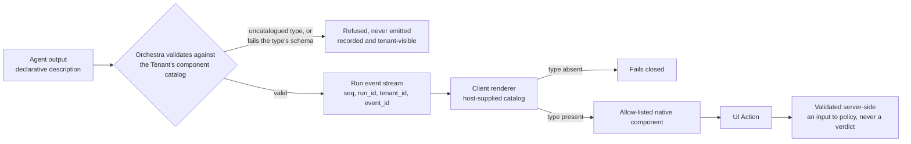
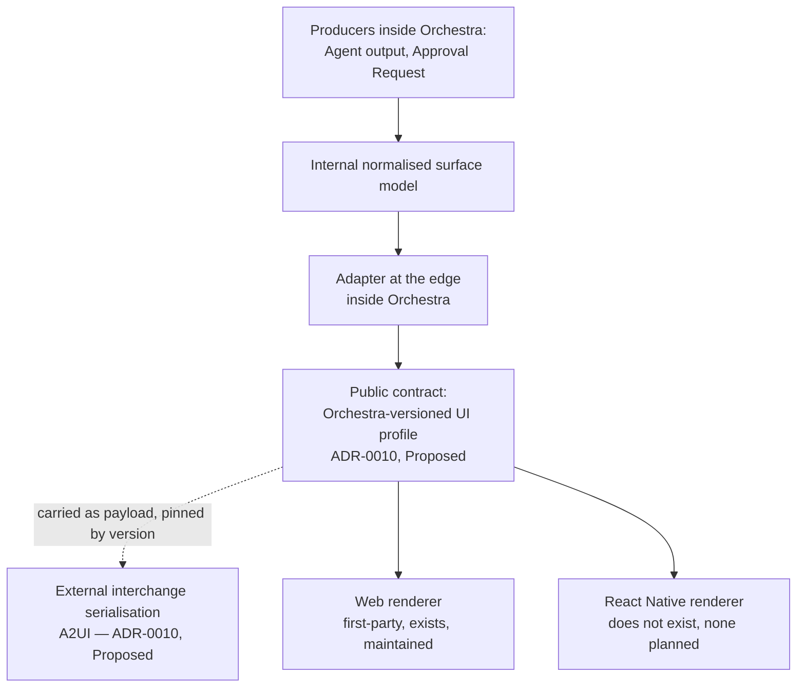

# UI Protocol

Declarative agent-produced interface regions — [`UI Surface`](../GLOSSARY.md) — the structured
events raised from them — [`UI Action`](../GLOSSARY.md) — and the one surface class the first
vertical slice ships: the approval surface.

**This section is normative** ([`../README.md`](../README.md) section 3). MUST, MUST NOT, SHOULD,
SHOULD NOT and MAY carry their [RFC 2119](https://www.rfc-editor.org/rfc/rfc2119) meanings.
Orchestra is pre-implementation and pre-customer: no platform code exists, no surface has been
rendered, and no design partner has seen any claim here.

**Two Proposed ADRs reach this document and neither binds.**
[ADR-0010](../adr/adr-0010-a2ui-genui-interchange.md) selects A2UI as the external interchange
behind an adapter and defers the general component catalog out of the first slice;
[ADR-0004](../adr/adr-0004-adopt-ag-ui-event-protocol.md) fixes how a surface reaches a client.
Every claim resting on either is marked **Proposed** where it is made. **Section 2 rests on
neither**: the safety model holds under all four options ADR-0010 considered, including the one in
which Orchestra defines the format itself.

## 1. Scope

| Question | Decided by |
| --- | --- |
| What a UI Surface is, the safety model over it, and how the component catalog is enforced | This document |
| What the approval surface MUST express, and what may author it | This document |
| What a UI Action is, how it is validated, and what it is not | This document |
| Whether the external interchange is A2UI at all | [ADR-0010](../adr/adr-0010-a2ui-genui-interchange.md), **Proposed** |
| The Approval Request lifecycle, chain, Evidence Set and resolution | [`../40-governance/approval-workflows.md`](../40-governance/approval-workflows.md) |
| When a verdict is `require_approval` | [`../40-governance/policy-model.md`](../40-governance/policy-model.md) |
| Which event carries a surface, its ordering and its replay | [`event-protocol.md`](event-protocol.md) |
| Endpoint shape, headers, idempotency and error bodies | [`gateway-api.md`](gateway-api.md) |
| Record format and retention of what a Principal was shown | [`../40-governance/audit-model.md`](../40-governance/audit-model.md) |
| What an attacker does to a surface | [`../40-governance/threat-model.md`](../40-governance/threat-model.md) |
| Where the approval surface is presented to a Platform User | [`../10-architecture/control-plane.md`](../10-architecture/control-plane.md) |

Whatever follows from an ADR, from [`../GLOSSARY.md`](../GLOSSARY.md), from
[`../VERSIONING.md`](../VERSIONING.md) or from the domain model is stated normatively here —
derivation, not invention. **JSON Schema is the source of truth**
([`schemas/README.md`](schemas/README.md)); this document describes intent precisely enough that a
schema can be derived from it and names in section 9 which schema will carry each contract, none of
which is yet written. There is **no timeout, payload cap, page size or retention period** here,
because no decision in this repository contains one.

## 2. The safety model

The spine of the document, and the part contingent on no Proposed ADR. **An Agent MUST produce
declarative descriptions, validated against a schema and rendered by allow-listed native components,
and MUST NOT produce executable code** — not under ADR-0010's decision, not under any option it
rejected, and not if Orchestra later defines the format itself. The rest of this section exists so
that the sentence is enforced somewhere Orchestra controls, rather than merely intended.

| | Requirement |
| --- | --- |
| **US1** | An Agent MUST produce a UI Surface as a declarative description. It MUST NOT produce executable code, markup carrying executable content, a script or style reference the client fetches, or a component defined by the surface rather than registered by the host. |
| **US2** | **Orchestra MUST validate every agent-produced surface server-side**, against the owning Tenant's registered component catalog, before the surface reaches the Run event stream. A component type absent from the catalog, or a property failing that type's registered schema, MUST cause the surface to be refused — in whole, and not in part. |
| **US3** | **The renderer is defence in depth, never the enforcement point.** The external interchange's catalog enforcement is a property of renderer implementations rather than a normative requirement of the specification: a third-party renderer could conform by name and still render an uncatalogued component ([`../80-reference/a2ui-evaluation.md`](../80-reference/a2ui-evaluation.md), fourth finding). A boundary enforced solely in client code Orchestra does not ship is not a boundary, so Orchestra MUST NOT rely on the renderer as the only check — and a renderer Orchestra ships MUST additionally fail closed on an uncatalogued type. |
| **US4** | A refused surface MUST be recorded and MUST be visible to the Tenant. An Agent emitting an uncatalogued component is a symptom of the surface injection [`../40-governance/threat-model.md`](../40-governance/threat-model.md) T1 describes, so a silent drop discards the signal. Whether the check is itself a Policy Enforcement Point — and so whether the refusal is a Policy Decision ([ADR-0012](../adr/adr-0012-policy-decisions-are-audit-records.md)) or another class of Audit Record — is **not decided**; section 10. |
| **US5** | No rail in the surface contract. Per CLAUDE.md working rule 2, [ADR-0005](../adr/adr-0005-langgraph-as-compilation-target.md) and [`../40-governance/audit-model.md`](../40-governance/audit-model.md) A8, the orchestration runtime's, a model provider's or the tool protocol's vocabulary MUST NOT appear in a UI Surface, a UI Action or a component catalog. A Tool named by a surface is named by its Tool Catalog identity and its Side-Effect Class, never by a protocol-native descriptor. |
| **US6** | Every surface, action and catalog is tenant-scoped (invariant I1, [`../20-domain/domain-model.md`](../20-domain/domain-model.md), and [ADR-0011](../adr/adr-0011-tenant-isolation-shared-schema-rls.md)). A surface MUST be validated against the catalog of the Tenant that owns the Run, and a UI Action MUST resolve to that same Tenant. |

The left-hand check is Orchestra's and normative. The right-hand check is an implementation property
of whichever renderer the client happens to run. They are not alternatives.

**What US4's open classification costs.** If the check is a Policy Enforcement Point, then
[`../40-governance/policy-model.md`](../40-governance/policy-model.md) D1 and
[ADR-0012](../adr/adr-0012-policy-decisions-are-audit-records.md) make *every* validation outcome a
Policy Decision, allows included — so US4 MUST NOT be read as licence to record refusals only, and
the volume warning in [`../40-governance/audit-model.md`](../40-governance/audit-model.md) section 4
applies in full. The record is then fail-closed under
[ADR-0013](../adr/adr-0013-fail-closed-policy-decision-writes.md): it MUST be durable before the
surface is emitted. If the check is not an enforcement point, the write MAY degrade under that same
ADR — and US4's tenant visibility is then only as strong as the classification, because a degraded
write loses the injection signal as silently as the drop US4 forbids. Two smaller gaps ride along
and section 10 registers both: audit-model section 3 declares itself the enumeration of audited acts
and has no row for a refused surface or for UA4's refused UI Action, and audit-model A3 requires
exactly one Principal per record where an Agent is not one (audit-model section 9).

## 3. What ships, and what is deferred

**Proposed, ADR-0010.** Both halves of that ADR are load-bearing, the deferral is the half most
easily mislaid, and the table is that ADR's first-slice reading rather than a settled scope.

| | First vertical slice | Deferred |
| --- | --- | --- |
| Surfaces | Text, and one schema-validated approval surface | The general component catalog and its types |
| Catalog | An allow-list with one member, fixed by Orchestra | Tenant-registered and customer-registered types |
| Interchange | Not exercised — the approval surface is Orchestra's own narrow schema | A2UI serialisation, behind the adapter and carried as the profile's payload |
| Renderers | One web surface Orchestra writes | An interchange renderer, and any mobile surface |

[`../00-overview/roadmap.md`](../00-overview/roadmap.md) section 4 excludes the GenUI catalog from
Phase 2 explicitly, and ADR-0010 records why: the differentiated value is governance, and an
approval surface needs only a narrow, purpose-built schema. What that roadmap commits for approvals
is an Approval Request carrying its Evidence Set which a human resolves; that the resolution happens
over a declarative surface at all rests on ADR-0010 and nothing else. **The general catalog is not
built for the first slice**, on that reading. Nothing in sections 4, 5 and 8 is a Phase 2 commitment
except where it concerns the approval surface — and section 2 applies to a one-member allow-list
exactly as it will to a general one. The machinery generalises. The rules do not change.

## 4. Layering: internal model, adapter, external interchange

**Proposed, ADR-0010.** The internal normalised surface model is what every producer inside the
platform emits and what every governance rule is written against; an adapter at the edge serialises
it. The public contract is an **Orchestra-versioned UI profile** — Orchestra's document, semantic
version and conformance suite — of which the external interchange is the serialisation. **The
adapter runs inside Orchestra and what a client parses is the profile**: the interchange's
serialisation travels as the payload the profile carries, pinned by version, and the compatibility
promise section 9 states covers the profile and the schemas Orchestra owns, re-exporting none of the
interchange's stability. That is the shape ADR-0004 — also **Proposed** — chose for the event
protocol, where the Orchestra Agent Event Profile pins an upstream commit and re-exports no upstream
promise ([`../VERSIONING.md`](../VERSIONING.md) section 5), applied here to the payload layer, and
it is why the two decisions are consistent rather than divergent. That document enumerates the
artefacts which carry versions and carries no UI profile among them, so the profile's own version is
asserted here and settled nowhere; section 10 registers it.

**The adapter exists because the interchange is pre-1.0 and single-vendor.** The current release is
pre-1.0, stability guarantees sit inside an unshipped 1.0 milestone, one breaking redesign has
shipped and a second is queued as a release candidate, and governance is one vendor's under its own
contributor agreement with no donation to a foundation
([`../80-reference/a2ui-evaluation.md`](../80-reference/a2ui-evaluation.md)). A specification change
is then an adapter change rather than a platform change.

**What the adapter does not contain.** It absorbs protocol drift. It does not absorb renderer API
drift, which lands directly in front-end code — three of the first-party renderer's last five
releases carry breaking-change entries. It does not absorb theming: the 1.0 candidate removes
branding from the protocol, so on-brand rendering is solved outside the interchange whichever option
lands. And it does not discharge accessibility: that renderer carries no audit, no test suite and no
conformance statement, and ADR-0004 — **Proposed** — treats an absent accessibility position as a
procurement stop rather than a backlog item in this segment — which bears harder on an approval
surface operated by a named human than on a streaming transcript. No conformance target is decided
anywhere in this repository and none is invented here; section 10 registers both.

**Renderers.** A first-party web renderer exists, is permissively licensed and is actively
maintained, so Orchestra would not write one for the web. **There is no React Native renderer,
first-party or credible third-party, and none on the roadmap.**
[`../VERSIONING.md`](../VERSIONING.md) section 7 already names `@orchestra/react-native` as a client
SDK, so the gap is not hypothetical: **if any Orchestra surface is ever React Native, that renderer
is Orchestra's to build and to maintain against a moving specification.**

## 5. The component catalog

[`../GLOSSARY.md`](../GLOSSARY.md) reserves **Tool Catalog** for the tenant-scoped registry of
Tools. This document writes **component catalog** for the registry of renderable component types.
They are unrelated and MUST NOT be conflated in a schema, an API or a control-plane surface.

| | Requirement |
| --- | --- |
| **CC1** | A component catalog is a registered, versioned, **Tenant-scoped** document declaring each permitted component type and the schema its properties MUST satisfy, and registering one is an administrative act by a Platform User. Tenant-scoped, because US6 requires a surface to be validated against the catalog of the Tenant that owns the Run and no document states how a Workspace catalog would compose with its Tenant's. Whether a registration may itself be Workspace-scoped is open on exactly the terms [`../10-architecture/control-plane.md`](../10-architecture/control-plane.md) section 10 holds it open for a Tool registration, and this document's section 10 repeats that row. |
| **CC2** | Registration is not authorship. An Agent MUST NOT extend or amend its Tenant's catalog, and a catalog entry MUST NOT be introduced from model output, Tool output, retrieved content or a UI Action. This is [`../40-governance/tool-authorization.md`](../40-governance/tool-authorization.md) TA7 — the grant set is closed at evaluation time — read over the catalog, on the same premise: policy, not prompts, is the security boundary ([ADR-0003](../adr/adr-0003-governance-layer-positioning.md)). |
| **CC3** | The catalog is closed by lookup, not by a closed schema: an allow-list of *values* checked at validation time. Two independent requirements follow over two different constructs, and satisfying one does not satisfy the other. The component-type field MUST NOT be a closed enum, because a closed enum is not covered by the must-ignore rule ([`event-protocol.md`](event-protocol.md) C2), so the type stays an open string on the wire while the allow-list stays closed behind it. Separately, `additionalProperties` MUST NOT be `false` on any wire-facing object ([`../VERSIONING.md`](../VERSIONING.md) section 6). |
| **CC4** | A custom customer component MUST be explicitly registered, carries its own schema, and is validated identically. A component type that renders customer-supplied content is still a description, never an escape hatch from US1. |
| **CC5** | Catalog evolution is additive. Adding a component type is MINOR under [`../VERSIONING.md`](../VERSIONING.md) R2; removing or repurposing one is MAJOR and requires prior deprecation under R5. What R3 and the deprecation table do not yet say about component types is in section 9. |
| **CC6** | The catalog version a surface was validated against MUST be recorded with the surface. Without it a surface validated against one version and read against another cannot be reconstructed, which AS6 and [`../40-governance/approval-workflows.md`](../40-governance/approval-workflows.md) E5 both need. Whether a Run additionally *pins* its catalog version for its whole life, as invariant I3 pins the definition version it started with, is not decided; section 10. |

## 6. The approval surface

**On ADR-0010's first-slice reading — Proposed — this is the surface the first slice ships**, and
the registered question *where the approval surface schema is specified* is answered here: the
specification is this section, and the schema named in section 9 will carry it.
[`../40-governance/approval-workflows.md`](../40-governance/approval-workflows.md) owns the Approval
Request — how it is raised, what the Evidence Set is, who may satisfy the chain, what a resolution
means. **This document owns only the surface.** Rules cited as E1–E6, C1–C6 and D1–D4 are that
document's, referenced and not restated.

**AS1 — What it MUST express.** The surface MUST present, as distinct and separately identifiable
regions: the proposed action — the Tool or Step, its Side-Effect Class, and the arguments as they
would execute; the Evidence Set, each item with its provenance under E6; the causing Policy Decision
by Policy version; the Approval Chain as resolved at raise and the viewing Principal's position in
it; and the decision affordances.

**AS2 — The platform composes it; the Agent does not.** Every part MUST be derived by the platform
from the Approval Request record. The single exception is the Agent's own justification, which MAY
appear, MUST be labelled model-generated and attributed to the Agent version that produced it (E2),
and MUST NOT be presented in a form indistinguishable from an Evidence Set item. **An approval
surface composed by the Agent would make the gate the delivery mechanism for the injection it exists
to stop** — the approver-directed and surface-injection variants of
[`../40-governance/threat-model.md`](../40-governance/threat-model.md) T1 in one move.

**AS3 — Reviewable, not merely available.** Where the surface truncates an Evidence Set item for
display, the truncation MUST be visible as one and the untruncated content MUST be retrievable
through the surface (E5). This answers the surface half of a question that document's section 4
registers; whether the set is materialised by value or by reference stays with it.

**AS4 — Whole, or refused.** The approval surface MUST render completely or not at all. A partly
rendered gate — a missing evidence item, a missing affordance, a dropped provenance label — yields a
decision taken on less than the record says was shown, which is exactly what E5 requires the record
to make reconstructible. **Whole means the AS1 set**, and that is the mechanism which keeps AS4 and
the must-ignore rule of [`../VERSIONING.md`](../VERSIONING.md) R3 both true: a renderer MUST fail
closed when a region AS1 requires is absent or unrenderable, and MUST ignore an addition it does not
recognise under R3. Without that reading, every additive MINOR change to the approval-surface schema
would break every deployed renderer, which R2 forbids a MINOR change from doing. Section 9 carries
the reconciliation.

**Where AS4 binds, given US3.** US3 holds that a boundary enforced only in client code Orchestra
does not ship is not a boundary, and AS4 is a rule about rendering. It therefore binds where
Orchestra ships the renderer — which under section 3 is every first-slice case, one
Orchestra-written web surface with all others deferred — and such a renderer MUST fail closed on it.
Presenting an approval surface through a renderer Orchestra does not ship is **out of scope for the
first slice**; admitting one would need a conformance requirement no decision in this repository
supplies, and section 10 registers that.

**AS5 — Affordances match the lifecycle, and none of them is authority.** The affordances are
exactly the transitions
[`../20-domain/lifecycle-state-machines.md`](../20-domain/lifecycle-state-machines.md) section 3
admits as decisions — today `Approved` and `Rejected`, so approve and reject. `Expired` and
`Withdrawn` are not decisions and MUST NOT be offered (C3, D2). If
[`../40-governance/approval-workflows.md`](../40-governance/approval-workflows.md) adopts a third —
its register holds *request more information* open and section 10 repeats the row — the affordance
joins the AS1 set, which under AS4 an older renderer fails closed on rather than ignores, making it
a MAJOR change to the approval surface under [`../VERSIONING.md`](../VERSIONING.md) R1 rather than
the additive one R2 describes. The surface MUST NOT offer an affordance to a Principal outside the
chain, nor in an ordered chain before every Principal ahead has decided (C6) — and rendering one
anyway proves nothing, because satisfaction is decided server-side under section 7.

**AS6 — Reconstructible.** AS2 makes the surface a function of the Approval Request record and a
versioned surface definition, so the surface definition version in force MUST be recorded with the
raise, alongside the catalog version CC6 requires. Without them, E5 cannot be satisfied for a
surface that later changes. *Surface definition* is a term this rule introduces and neither
[`../GLOSSARY.md`](../GLOSSARY.md) nor [`../VERSIONING.md`](../VERSIONING.md) carries it as a
versioned artefact; section 10 registers both gaps rather than treating the term as settled.

## 7. UI Actions

A **UI Action** is a structured, validated event raised by a Principal interacting with a UI
Surface. It travels from the customer application to Orchestra — outbound on relationship R4 of
[`../10-architecture/system-context.md`](../10-architecture/system-context.md) — and is therefore an
ordinary state-changing Gateway request, not an event on the stream.

**Which Gateway operation carries one.** An approval decision raised from the approval surface is
the *decide* operation on the Approval Request resource, which [`gateway-api.md`](gateway-api.md)
section 5 already admits as read and decide and never create. What this document adds to it is the
surface-instance reference UC4 requires, an obligation that resource's rules do not yet carry.
Whether any other UI Action reaches that contract, as its own resource or not at all, is that
document's open row, turning on ADR-0010 validation step 2 and therefore **Proposed**. Section 10
repeats it with gateway-api's classification rather than closing another document's question here.

| | Requirement |
| --- | --- |
| **UA1** | A UI Action MUST be validated server-side against the schema of the surface instance that raised it, and MUST reference that instance. An action naming a surface never emitted, emitted for another Run, or emitted for another Tenant MUST be refused. |
| **UA2** | **A UI Action MUST NOT be trusted as authorization.** It is an input to policy, never a substitute for a verdict. That an affordance was rendered, and that a well-formed action arrived, proves only that a Principal pressed something. An Agent MUST NOT acquire a capability from a UI Action ([`../40-governance/tool-authorization.md`](../40-governance/tool-authorization.md) TA7), and an approval decision carried by one MUST be re-evaluated server-side against the Approval Chain as resolved at raise, the acting Principal's authenticated identity, and the request's current state. |
| **UA3** | Every UI Action resolves to exactly one Principal with the authenticated identity behind them (invariant I2, [`../20-domain/domain-model.md`](../20-domain/domain-model.md)). Where the actor is an End User, the Session Token is the authority and nothing else ([`gateway-api.md`](gateway-api.md) G4, on relationship R4 of [`../10-architecture/system-context.md`](../10-architecture/system-context.md)). |
| **UA4** | A UI Action against a resolved Approval Request MUST be refused rather than applied, and the refusal recorded. A terminal request is permanently terminal (D3). |
| **UA5** | A UI Action changes state, so the Gateway's rules for a state-changing request apply unchanged and are cited rather than restated: `Idempotency-Key` is request deduplication at the API boundary and MUST NOT be derived from, or mapped onto, a Step Execution's idempotency key ([`gateway-api.md`](gateway-api.md) G10, invariant I4); a replayed approval decision MUST NOT record a second decision (that document's G11, with [`../40-governance/audit-model.md`](../40-governance/audit-model.md) A3); and an idempotent replay is not a retry of a side effect, since returning a stored response is safe where re-attempting a partially executed Tool call is not, and the two MUST NOT share a code path (that document's G12). What is this document's to add: a replayed action MUST resolve to the same surface instance under UC4, so that a replay is recognisable as the same act on the same gate. |
| **UA6** | Free text carried by a UI Action is untrusted content and MUST be treated as the object of an action, never as an instruction. Whether such content carries provenance inside the model context is undecided, registered jointly by [`../40-governance/policy-model.md`](../40-governance/policy-model.md) and the threat model, and repeated in section 10. |

**A vocabulary gap.** [`../GLOSSARY.md`](../GLOSSARY.md) defines a UI Action as raised by an **End
User** and a UI Surface as **agent-produced**. The approval surface is neither: the platform
produces it (AS2) and a Platform User uses it
([`../00-overview/personas.md`](../00-overview/personas.md) section 2.3). Both entries need widening
— to any Principal, and to any producer — or the approval surface falls outside the two terms that
describe it. This document specifies on the wider reading and registers the change in section 10
rather than making it: vocabulary is fixed by the glossary, not by a document that finds it
inconvenient. Two further terms stand in the same position — *component catalog*, which section 5
raises from a reference document's disambiguation into a normative term, a control-plane surface and
a schema name, and *surface definition* in AS6 — and the same row carries all four.

## 8. Carriage on the Run event stream

**Proposed, ADR-0004.**

**Who receives it, and how much of it.** A stream is established by any credential the Gateway
accepts, and the Tenant resolves from the authenticated Principal at establishment whatever that
credential was ([`event-protocol.md`](event-protocol.md), with
[`gateway-api.md`](gateway-api.md) G3–G5 for the credential shapes). That matters here rather than
only there: the approval surface is presented to a Platform User, who holds no Session Token under
gateway-api G3, so a Session-Token-only stream would leave the one surface the first slice ships
with no delivery path. A Run's stream is also **one sequence delivered whole to every authorised
reader** — `seq` is minted once per Run, so a per-reader filtered stream would open a hole that the
reader's own gap-detection rule obliges it to report as a lost event. A UI Surface on that stream is
therefore readable by every authorised reader of the Run, which is why an Evidence Set is never
carried inline and is read instead through an authorised surface by a Principal entitled to it
([`event-protocol.md`](event-protocol.md) K1, and AS3 here). Restricting a surface to some readers
of a Run would need per-subscription sequencing, which that document registers as a MAJOR change to
the profile rather than a MINOR one.

| | Requirement |
| --- | --- |
| **UC1** | A UI Surface reaches a client as an Agent Event under the Orchestra Agent Event Profile, carried as an `orchestra.`-prefixed extension ([`../VERSIONING.md`](../VERSIONING.md) section 5). This document defines the payload — section 6 for the approval surface, section 9 for the schemas that will carry it — which is the condition [`event-protocol.md`](event-protocol.md) attaches to listing a declarative UI payload among what the protocol does not carry. The family it travels in is `orchestra.ui.*`, reserved by [`event-protocol.md`](event-protocol.md) section 3.3 on that document's authority. The event names within the family, and how a surface orders against the approval extension it accompanies, remain that document's to fix. |
| **UC2** | Every event carrying a surface carries the per-run monotonic `seq`, the `run_id`, the `tenant_id` and the server-assigned `event_id` that [`../VERSIONING.md`](../VERSIONING.md) section 5 requires — under the profile's vendor-prefixed `metadata` key, and never as top-level fields, which one transport binding drops (ADR-0004, **Proposed**; [`event-protocol.md`](event-protocol.md) EG1–EG2 give the reason). Replay and resumption are Orchestra's to build, not inherited. |
| **UC3** | A UI Surface MUST carry an identifier stable within its Run, so replay is not duplication. A re-delivered surface MUST replace the instance bearing that identifier rather than appear a second time, or a resumed stream shows an approver two gates where one exists. |
| **UC4** | A UI Action MUST name the surface instance it came from, so that what was shown and what was done resolve to each other in the audit trail. |

## 9. Schemas, and evolution

| Contract | Schema that will carry it |
| --- | --- |
| The UI profile a client parses — the internal normalised surface model at the wire | `ui-surface.v1.schema.json` |
| A structured event raised from a surface | `ui-action.v1.schema.json` |
| The approval surface of section 6 | `approval-surface.v1.schema.json` |
| A registered component catalog and its type schemas | `component-catalog.v1.schema.json` |

The planned list in [`schemas/README.md`](schemas/README.md) does not yet name these four and needs
to. Rules that already bind and are restated as nothing new
([`../VERSIONING.md`](../VERSIONING.md) section 6): `additionalProperties` MUST NOT be `false` on a
wire-facing object, `$id` embeds the major version, a MINOR change is additive and MUST NOT tighten
an existing constraint, and every change carries a round-trip contract test against the previous
minor version. Endpoints carrying UI Actions take the Gateway's shape from that document's section 4
unchanged — major version in the path, `Orchestra-Version` resolving to the Tenant's pinned dated
revision and never to latest, `Idempotency-Key` on every state-changing endpoint, `Deprecation` and
`Sunset` headers — and its support windows and sunset notice periods are cited rather than copied,
so that the figures change in one place ([`../VERSIONING.md`](../VERSIONING.md) sections 4 and 10).

**R3 and the allow-list, reconciled.** [`../VERSIONING.md`](../VERSIONING.md) R3 requires a consumer
to silently ignore component types it does not recognise; US2 requires an uncatalogued type to be
refused. They meet on different sets. Because Orchestra never emits an uncatalogued type, a
conforming renderer never meets one inside an Orchestra-validated surface, and R3 governs only the
forward-compatibility case it was written for — a renderer built against an older profile meeting a
type added since. There it ignores the component and keeps the surrounding envelope. The approval
surface narrows that rule rather than excepting itself from it: AS4 makes a renderer fail closed
where a region AS1 requires is missing or unrenderable, because a partial gate is worse than no
gate, and R3 still governs every unrecognised addition outside that set — which is what leaves an
additive MINOR change to `approval-surface.v1.schema.json` additive for a deployed renderer.
**That narrowing is a claim about a universal rule and belongs in
[`../VERSIONING.md`](../VERSIONING.md), not only here** — as does the absence of any component-type
row in its deprecation table. Section 10 registers both.

## 10. Open questions

**Yes** means the choice is costly to reverse or spans components and MUST be recorded as an ADR
before implementation; **No** means a later normative document suffices. Rows marked *repeated*
carry the owning document's classification unchanged and are not revised here.

| Question | What would decide it | ADR required? |
| --- | --- | --- |
| Whether the external interchange is A2UI at all, and whether the approval surface is expressible in it without extension | ADR-0010 validation step 2, never attempted, against a pinned pre-1.0 version or deferred until 1.0 ships; the acceptance test is the published stability guarantee, not the version tag | No — [ADR-0010](../adr/adr-0010-a2ui-genui-interchange.md) exists |
| Whether validating a surface against the catalog is a Policy Enforcement Point, and so whether a refusal is a Policy Decision | [`../40-governance/policy-model.md`](../40-governance/policy-model.md), whose enforcement-point rule states a minimum rather than a maximum; it changes the enforcement-point set, the record class of every refusal, whether that record is fail-closed under [ADR-0013](../adr/adr-0013-fail-closed-policy-decision-writes.md), and what the event stream must carry | **Yes** |
| Which web renderer path Orchestra takes — the first-party one or the other vendor's — given that renderer API drift is not contained by the adapter | A front-end platform decision when GenUI enters the roadmap; [`../80-reference/a2ui-evaluation.md`](../80-reference/a2ui-evaluation.md) records both paths and no ADR covers either | **Yes** — replacement cost rises with every surface built on the choice, and it is zero today |
| Whether any Orchestra surface is ever React Native, given that no renderer exists and [`../VERSIONING.md`](../VERSIONING.md) section 7 already names the SDK | A product decision on mobile surfaces, with [`../../ui-template/README.md`](../../ui-template/README.md); a yes commits Orchestra to building and maintaining a renderer against a moving specification | **Yes** |
| Whether R3 records the narrowing AS4 applies to it — a renderer failing closed only where a region AS1 requires is missing — and how the deprecation table treats a component type | [`../VERSIONING.md`](../VERSIONING.md), which owns both rules; section 9 states the reconciliation this document composes with, and it needs recording there | No |
| Whether [`../GLOSSARY.md`](../GLOSSARY.md) widens *UI Surface* beyond agent-produced and *UI Action* beyond an End User, whether the approval surface gains its own entry, and whether *component catalog* and *surface definition* gain theirs | [`../GLOSSARY.md`](../GLOSSARY.md); section 7 names the gap and this document specifies on the wider reading meanwhile | No |
| The accessibility conformance target for the approval surface, and who attests to it | [`../70-delivery/compliance-roadmap.md`](../70-delivery/compliance-roadmap.md) section 4, which states why no level is set: it is a procurement fact following from the buyer and the jurisdiction, and no customer exists. ADR-0004, **Proposed**, treats the absence as a procurement stop | No |
| How an approval surface renders on-brand, given the interchange removes theming | The renderer-path decision above, with the front-end platform; it sits outside the interchange either way | No |
| Whether *request more information* is a state, given the lifecycle admits only Approved, Rejected, Expired and Withdrawn | [`../40-governance/approval-workflows.md`](../40-governance/approval-workflows.md) | No — *repeated* |
| Whether the Evidence Set is materialised by value or by reference | [`../40-governance/approval-workflows.md`](../40-governance/approval-workflows.md) section 4; AS3 answers only the surface half | No — *repeated* |
| How an approval transition reaches a client, and whether it survives disconnect and replay | ADR-0004 validation step 2, then [`event-protocol.md`](event-protocol.md) | No — ADR-0004 exists, *repeated* |
| Whether untrusted content carries provenance inside the model context, of which UI Action free text is one source | [`../40-governance/policy-model.md`](../40-governance/policy-model.md) jointly with this document, assigned by [`../40-governance/threat-model.md`](../40-governance/threat-model.md) | **Yes** if it reaches a public contract, else No — *repeated* |
| Where the UI profile, a component catalog and a surface definition enter the artefacts that carry versions, and whether a Run pins its catalog version as invariant I3 pins the definition version it started with | [`../VERSIONING.md`](../VERSIONING.md), which enumerates those artefacts and carries none of the three; section 4 asserts the profile's version, CC6 records the catalog's and AS6 the surface definition's, and no enumeration admits them | No |
| Whether declarative UI representations reach the Gateway contract at all, or only this document's | [`gateway-api.md`](gateway-api.md), on ADR-0010 validation step 2, **Proposed** and outstanding | No — *repeated* |
| Whether a component catalog registration may itself be Workspace-scoped, given one catalog per Tenant under CC1 | [`../10-architecture/control-plane.md`](../10-architecture/control-plane.md) section 10, which holds the same question open for a Tool registration and derives the shape but not the choice | No — unless it merges with that ADR, *repeated* |
| Which rows the audit enumeration needs for a refused UI Surface and a refused UI Action, and how a refusal with no acting Principal is attributed | [`../40-governance/audit-model.md`](../40-governance/audit-model.md): section 3 is the enumeration by its own rule, section 9 holds attribution open, and section 13 classifies it | **Yes** for the attribution half — *repeated*; the enumeration rows are No |
| Whether an approval surface may ever be presented through a renderer Orchestra does not ship, and what conformance MUST be demonstrated first | The renderer-path decision above, with the front-end platform; AS4 binds where Orchestra ships the renderer, and section 3 defers every other case out of the first slice | No |

Two questions assigned here are **answered rather than deferred**, and are absent above for that
reason. *Where the approval surface schema is specified*, assigned by
[`../10-architecture/control-plane.md`](../10-architecture/control-plane.md), is answered by section
6 and the schema named in section 9. *What the approval surface is, and which document owns it*,
assigned by [`../40-governance/approval-workflows.md`](../40-governance/approval-workflows.md), is
answered by section 6: a platform-composed surface class specified here. Only its glossary
consequence survives, as one row above.
