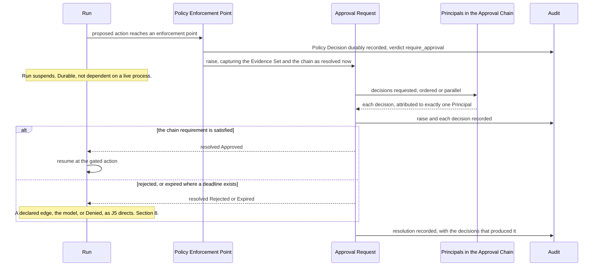

# Approval Workflows

What happens after a Policy Enforcement Point returns `require_approval`. The verdict itself
belongs to [`policy-model.md`](policy-model.md); this document owns everything downstream — how
the Approval Request is formed, what it carries, who may satisfy it, what a resolution means, and
what is recorded.

**This section is normative** ([`../README.md`](../README.md) section 3). MUST, MUST NOT, SHOULD,
SHOULD NOT and MAY carry their [RFC 2119](https://www.rfc-editor.org/rfc/rfc2119) meanings.
Orchestra is pre-implementation and pre-customer: no platform code exists, no approval surface has
been built, and no design partner has tested any claim here.

## 1. Scope, and what this document may decide

| Question | Decided by |
| --- | --- |
| When a PEP returns `require_approval` | [`policy-model.md`](policy-model.md) |
| What the Approval Request carries, and who may satisfy it | This document |
| What the Evidence Set is, and its integrity | This document |
| Whether a Principal may approve their own action | [ADR-0043](../adr/adr-0043-approval-chains-and-separation-of-duties.md), which this document states in section 6 |
| Record format, retention, facts with no actor | [`audit-model.md`](audit-model.md) |
| Whether a capability grant existed at all | [`tool-authorization.md`](tool-authorization.md) |
| What an attacker does to the gate | [`threat-model.md`](threat-model.md) |
| The `approval` Step type and its branches | `step-types.md`, in [`../50-workflows/`](../50-workflows/) |
| Run states and transitions | [`../20-domain/lifecycle-state-machines.md`](../20-domain/lifecycle-state-machines.md) |
| How a transition reaches a client | `event-protocol.md`, in [`../30-protocol/`](../30-protocol/) |

Whatever follows from an Accepted ADR, from [`../GLOSSARY.md`](../GLOSSARY.md), or from
[`../20-domain/domain-model.md`](../20-domain/domain-model.md) is stated normatively here —
derivation, not invention. Where a choice is genuinely open this document says so, names what
would decide it, and stops. **It contains no threshold, no duration, no quorum size, no retry
count and no retention period**, because no ADR in this repository contains one and naming one
here would manufacture a decision nobody has taken. A decision deadline, and how many positions a
parallel chain requires, are figures a Tenant writes into its own Policies
([ADR-0043](../adr/adr-0043-approval-chains-and-separation-of-duties.md)), never platform values.

Two **Proposed** decisions reach it and bind nothing:
[ADR-0004](../adr/adr-0004-adopt-ag-ui-event-protocol.md), whose outstanding validation step is a
prototype of exactly this lifecycle through disconnect and replay, and
[ADR-0010](../adr/adr-0010-a2ui-genui-interchange.md), under which the approval surface is the one
declarative surface the first vertical slice needs.

## 2. The gate

A gate is one Policy Decision, one Approval Request, one suspension, one resolution.

| | Requirement |
| --- | --- |
| **G1** | A `require_approval` verdict MUST raise exactly one Approval Request, and the gated Run MUST suspend before the proposed action executes — unless the proposed action is a compensating action, whose Run stays `Compensating` without attempting it until the request resolves (J5). The causing Policy Decision is a class of Audit Record ([ADR-0012](../adr/adr-0012-policy-decisions-are-audit-records.md)) and MUST be durable before the gated action could be attempted; if it cannot be written, nothing proceeds ([ADR-0013](../adr/adr-0013-fail-closed-policy-decision-writes.md)). Suspension may last days, so suspended state MUST be durable and MUST NOT depend on a live process, connection or in-memory continuation. Orchestra consumes that durability from the runtime rather than implementing it ([ADR-0005](../adr/adr-0005-langgraph-as-compilation-target.md)), and owns the governance record of the suspension. |
| **G2** | The Run MUST resume only on resolution. Approved, it MUST resume *at* the gated action rather than before it: re-entering the Agent to re-derive the action would mean the human approved something other than what executes. Rejected or expired, it goes where J5 directs, never to the gated action. |
| **G3** | No model output satisfies a gate — not the Agent's justification, not a Tool result, not a retrieved document. The Agent's argument is an input to the deciding Principal's judgement and never to the verdict ([ADR-0003](../adr/adr-0003-governance-layer-positioning.md), [`../00-overview/product-thesis.md`](../00-overview/product-thesis.md) section 3). |

## 3. The Approval Request

[`../GLOSSARY.md`](../GLOSSARY.md) fixes the first four parts, and each is normative here. The
fifth is this document's addition rather than the glossary's: it follows from
[`../20-domain/domain-model.md`](../20-domain/domain-model.md) section 6, where a Policy Decision
raises an Approval Request, and from
[`../20-domain/lifecycle-state-machines.md`](../20-domain/lifecycle-state-machines.md) section 3.2,
which requires the raise to record it. The glossary entry and this table are out of step, and the
entry is where that should be closed.

| Part | Requirement |
| --- | --- |
| Proposed action | The Tool or Step, its Side-Effect Class, and the arguments as they would execute. Recorded, never paraphrased. |
| Evidence Set | Section 4. Exactly one per request. |
| Approval Chain | Section 5. Exactly one per request, resolved at raise, and amended afterwards only by reassignment. |
| Resolution | Section 8. The terminal outcome and the decisions, if any, that produced it — a `Withdrawn` or `Expired` resolution has none. |
| Causing Policy Decision | The Policy **version** evaluated, the inputs and the verdict, so that *why was I asked* is answerable from the request alone. |

**R1.** The proposed action MUST be recorded as it would execute. An action re-derived at resume
time, or whose arguments are templated and evaluated later, is not the action that was approved.
If the arguments cannot be fixed at raise time, the gate is decorative. Every request is
tenant-scoped like every other record (invariant I1,
[ADR-0011](../adr/adr-0011-tenant-isolation-shared-schema-rls.md)), and an Approval Chain MUST NOT
resolve to a Principal outside the Tenant.

**R2.** The causing Policy Decision references the Policy **version** it evaluated and MUST NOT
embed the rule text: Policies are immutably versioned on the same terms as Agent and Workflow
definitions, and a Policy Decision is a class of Audit Record over them
([ADR-0012](../adr/adr-0012-policy-decisions-are-audit-records.md),
[`../VERSIONING.md`](../VERSIONING.md) sections 2 and 8). A Run pins the Policy versions in force at
admission for its whole life, so a Policy edited while a request is pending MUST NOT change the
verdict the suspended Run receives, and the version a request names stays resolvable for as long as
the request does.

## 4. The Evidence Set

The Evidence Set holds the exact inputs the Agent relied on — Tool results, retrieved context,
prior messages — so that a human decides **on the same information the model had, rather than on
the model's summary of it.**

Take the invoice case from the product thesis: a supplier PDF whose free-text remittance field says
the bank details have changed and the payment is urgent. A model-written summary reads *supplier
has updated their bank details and requests urgent payment* — faithful, competent, and it has
reproduced the attack while discarding the only thing that would expose it. The summary is written
by the component the attack has already compromised.
**An approver shown a summary is approving the model's framing, which is precisely the surface a
prompt injection attacks.** Calling that a control is worse than having no gate, because it
produces an Audit Record attesting to a review that could not have worked.

**E1 — Inputs, not descriptions.** The Evidence Set MUST contain the inputs themselves. A summary,
extract, description or rationale is not an input and MUST NOT stand in for one.

**E2 — The Agent's argument is labelled as such.** A model-generated summary or justification MAY
accompany the Evidence Set. It MUST be recorded as model-generated and attributed to the Agent
version that produced it, MUST NOT be the only content presented, and MUST NOT be presented in a
form indistinguishable from the inputs.

**E3 — Completeness.** The Evidence Set MUST cover everything the model had that is not otherwise
reconstructible from the Run record. Instructions and Tool bindings are reconstructible from the
pinned Agent or Workflow version (invariant I3) and need not be copied into every request; the
variable inputs are not, and MUST be. Anything less means the human decides on less than the model
did, which is the failure E1 exists to prevent.

**E4 — Immutable from raise time. Settled here by derivation, and open nowhere.** The Evidence Set
MUST be captured at raise and MUST NOT change afterwards. The derivation runs in three steps with
no gap in it. [`../20-domain/lifecycle-state-machines.md`](../20-domain/lifecycle-state-machines.md)
section 3.2 requires the raise to record the Evidence Set, so the set is content of an Audit Record.
[`../GLOSSARY.md`](../GLOSSARY.md) defines an Audit Record as append-only and immutable, which
[`audit-model.md`](audit-model.md) A2 restates as a structural rather than conventional property.
And A4 requires a record to carry *on what basis* an act happened, naming the Evidence Set where one
exists. Content that may change after the record is written satisfies none of the three, and mutable
evidence makes a recorded approval unfalsifiable.

[`../20-domain/lifecycle-state-machines.md`](../20-domain/lifecycle-state-machines.md) introduced
the rule as **Proposed** and owned by this document. E4 is that rule, settled here by derivation
from the glossary's requirement that the approver decides on the same information the model had.
It needs no ADR, and it is correspondingly absent from section 11.

**E5 — Faithful presentation.** The record MUST be sufficient to reconstruct what a deciding
Principal was shown. Whatever surface presents the request MUST NOT show, as an input the Agent
relied on, content absent from the Evidence Set, and MUST NOT present the other parts of the
Approval Request — the proposed action, the chain, the causing Policy Decision, the Agent's
argument under E2 — in a form indistinguishable from the Evidence Set. Each item's provenance under
E6 MUST be presented with the item. Where a presentation truncates for display, the record MUST
permit the untruncated content to be retrieved and the truncation MUST be visible as one.

**E6 — Item provenance.** Each item in the Evidence Set MUST record its origin — which Tool result,
which retrieved document, which prior message — and whether it is content the Agent read or text the
Agent itself authored. E2 labels the Agent's argument, which is the weaker property: provenance is
what lets an approver, and a later audit, tell a supplier's document from the model's gloss on it,
and it is the property the invoice case turns on. [`threat-model.md`](threat-model.md) requires it
against T1 and T8; the rule belongs here, because section 1 gives this document the Evidence Set and
its integrity.

Not settled: whether the set is materialised by value or by reference to immutable
content-addressed records, an implementation choice constrained by E4 and E6; and how a large
Evidence Set is made *reviewable* rather than merely available, which belongs with the approval
surface schema [ADR-0010](../adr/adr-0010-a2ui-genui-interchange.md) requires for the first slice
however A2UI resolves. Nor is *approval surface* itself a defined term: it carries a requirement in
E5 and appears in no [`../GLOSSARY.md`](../GLOSSARY.md) entry and no owning document. The set will
also routinely hold a Tenant's most sensitive business data, retained for an audit-retention period
**decided nowhere in this repository** —
[ADR-0012](../adr/adr-0012-policy-decisions-are-audit-records.md) fixes the record model and
explicitly leaves the period unmade — against erasure obligations whose mechanism ADR-0011 records
as needing design.

## 5. The Approval Chain

An Approval Chain is the ordered or parallel set of positions whose decisions the request
requires, **derived from Policy** — not a static list on the request, and not whoever happened to
be asked. [ADR-0043](../adr/adr-0043-approval-chains-and-separation-of-duties.md) decides what
satisfies one, who may sit in one and how it may change after raise. What follows from that ADR,
from invariant I2 (one action, one Principal), and from deny-by-default:

| | Requirement |
| --- | --- |
| **C1** | The chain MUST be derived from Policy at raise time and recorded as resolved at that moment: whether it is ordered or parallel, its positions, the Platform Users eligible at each, and how many positions a parallel chain requires. A chain that cannot be reconstructed later cannot be audited. Where several matching rules return `require_approval`, the request carries the chain of every one of them ([`policy-model.md`](policy-model.md) V2, [ADR-0035](../adr/adr-0035-cel-profile-for-policies-and-workflow-expressions.md), [ADR-0043](../adr/adr-0043-approval-chains-and-separation-of-duties.md)). |
| **C2** | A position MUST NOT be satisfied except by an approval from a Platform User eligible at it, so a position that resolves to nobody cannot be satisfied, and its request waits for a reassignment under C11. A chain that cannot reach the positions it requires is an unresolvable gate: the request MUST NOT resolve as satisfied and the gated action MUST NOT execute. An empty chain that auto-satisfies is a silent bypass of the platform's central control. A gate to which no matching rule supplies a chain at all is refused at raise rather than raised — C10. |
| **C3** | Satisfaction MUST be affirmative. Silence, absence, unavailability and the passage of time are not decisions and MUST NOT count toward satisfying a chain. |
| **C4** | Each decision MUST be attributed to exactly one Principal, with the authenticated identity behind them, and MUST name the one position it was taken at. |
| **C5** | Only a Platform User is ever eligible at a position. A Service Account or Connector decision MUST NOT count toward satisfying a chain: both are Principals, but the glossary defines an Approval Request as a **human** decision gate, and a machine Principal approving on a human's behalf is an automated approval wearing a human's name. Nor is an End User ever eligible. Orchestra does not authenticate an End User but trusts the customer backend's assertion ([`threat-model.md`](threat-model.md) boundary B1), which is too weak for the gate, and a confirmation an End User gives inside the customer's application is input to a Run, never an approval. |
| **C6** | In an ordered chain a position MUST NOT open before every position ahead of it is satisfied, or ordered and parallel are the same thing; partial progress MUST be recoverable from the record. |
| **C7** | A position is open while the request is `Pending` and the position is not yet satisfied; every position of a parallel chain is open from raise. A position is satisfied by one approval from any one of the Platform Users eligible at it. An ordered chain is satisfied when all its positions are. A parallel chain declares how many of its positions must be satisfied, and requires all of them where it declares none. The request resolves `Approved` the moment every chain it carries is satisfied, and positions still open then close undecided. |
| **C8** | A rejection by a Platform User eligible at an open position is decisive: the request resolves `Rejected`, whatever other positions and whatever other chains hold, and no count of approvals outvotes it. |
| **C9** | Where several matching rules return `require_approval`, the one Approval Request V2 raises carries the chain of every one of them, and none stands in for another ([ADR-0035](../adr/adr-0035-cel-profile-for-policies-and-workflow-expressions.md)). It resolves `Approved` only when every chain is satisfied on its own terms; a rejection at any open position of any chain is decisive under C8; the earliest deadline any matching rule declares applies to the whole request (section 7); and C14 counts a Principal at most once across the whole request rather than once per chain. |
| **C10** | Where no matching rule supplies a chain, the request MUST be refused at raise rather than raised: a gate with no position can never be satisfied, so none enters `Pending`. The case this is written for is an `approval` Step, where V4 narrows a matching `allow` to `require_approval` and an `allow` rule declares no chain; there the Run follows that Step's rejection edge where the definition declares one, and otherwise ends `Denied` ([ADR-0040](../adr/adr-0040-run-outcomes-for-refusal-and-compensation.md)). A gate refused this way anywhere else goes wherever ADR-0040 sends a refusal raised at that point. The refusal MUST be recorded with its causing Policy Decision and the proposed action. A chain that is declared but resolves to nobody eligible is the other case: that request is raised, and waits under C2. |

**Tenants author the figures, and the Expression Profile writes them.** Which Platform Users a
Policy makes eligible at each position, and how many positions a parallel chain requires, are the
Tenant's. How a Policy expresses them belongs to the Expression Profile
([`policy-model.md`](policy-model.md) section 8,
[ADR-0035](../adr/adr-0035-cel-profile-for-policies-and-workflow-expressions.md)), and no syntax is
fixed here. A request takes its chains, and any decision deadline under section 7, from the Policy
versions its causing Policy Decision names and the Run pinned (R2).

**The Control Plane warns an author whose `approval` Step no Policy gives a chain**, because a gate
C10 refuses at raise is cheapest to find while the definition is being written. It is a warning and
not a publication error: a Workflow version and a Policy version are published independently, so a
compiler that refused the Step would let a later Policy edit invalidate a definition already
published.

**After raise, a chain is amended only by reassignment, by hand.** An escalation is a reassignment
like any other, and nothing reassigns a request on its own.

| | Requirement |
| --- | --- |
| **C11** | A Principal holding an administrative grant for it MAY reassign a chain of a `Pending` request by hand, changing which Platform Users are eligible at a position that is not yet satisfied. A reassignment MUST NOT satisfy a position, remove or alter a recorded decision, change a chain from ordered to parallel or back, or lower how many positions a chain requires. It MUST NOT make the Principal performing it eligible, any more than it may make the Principal the Run records at admission eligible: another Principal holding the grant reassigns that position to them. C5 and the rules of section 6 bind a reassigned chain exactly as they bind the chain resolved at raise. |
| **C12** | A reassignment amends the chain; it does not rewrite it. It MUST be recorded with its acting Principal, its cause, and the chain before and after, and the chain as resolved at raise MUST remain reconstructible. |

Reassignment is the way out of a chain no Platform User can decide: a position that section 6 left
with nobody eligible, or one held by an approver who can no longer authenticate. It is not a
bypass. The reassigned request still needs an affirmative decision under C3, and the gated action
still waits for it. Because C11 refuses to make the reassigning Principal eligible, routing a
request to oneself takes two governed acts by two people, and a Tenant whose only grant holder is
also its only approver has to grant the role to a second person. Which role in the closed set of
administrative grants that
[ADR-0032](../adr/adr-0032-administrative-grants-are-orchestra-defined-roles.md) defines carries
reassignment is not decided here.

**Delegation and automatic escalation are not adopted.** No standing authority lets one Principal
decide in another's place, and no chain changes because time has passed. Either could be added
later without changing what an existing chain means. One constraint would hold on any delegation
added then, from I2 and from what audit is for: **the record names the delegate who decided**,
never the Principal on whose behalf they decided, and the delegation grant is a separate audited
fact with its own acting Principal and scope. Naming the person on whose behalf a decision was
taken is false attribution.

## 6. Separation of duties

**May the Principal who triggered an action approve it? No, and no Policy can say otherwise.**
[ADR-0043](../adr/adr-0043-approval-chains-and-separation-of-duties.md) decides it, because it is
the control an enterprise security review asks about by name, and a rule a Tenant has to remember
to write fails silently for the Tenant that never writes it. Invariant I2 gives every action
exactly one Principal, so the triggering and deciding Principals are both recorded and comparable,
and [ADR-0024](../adr/adr-0024-global-person-with-tenant-memberships.md) gives the Person behind
each of them wherever Orchestra verified it.

| | Requirement |
| --- | --- |
| **C13** | The Principal a Run records at admission MUST NOT be eligible at any position of a chain gating that Run, whether the chain was resolved at raise or reassigned afterwards. |
| **C14** | One Principal counts at most once across a request, however many chains it carries. A Platform User who has approved at one position MUST NOT be eligible at any other, because a quorum satisfied twice by one person is a quorum in name only. |
| **C15** | C13 and C14 compare the Person behind a Principal, where the identity provider verified that Person. Two Principals standing on one verified Person count as one, so a human who initiated a Run through one Principal is never eligible through another, and one human satisfies at most one position. A Principal no verified Person stands behind is compared as itself: a Service Account, which has none, and an End User whose Person a customer's backend asserts, which [ADR-0024](../adr/adr-0024-global-person-with-tenant-memberships.md) keys to the asserting Tenant and never merges. |
| **C16** | C13 to C15 are the platform's rules. No Policy can permit what they refuse, and none is written into a Policy. |

**Deadlock is the accepted cost.** In a small Tenant, or a Workspace with one qualified approver, a
chain excluding the trigger can leave a position with nobody eligible and deadlock under C2. The
way out is a governed act rather than a weaker rule: reassignment under C11, a decision deadline
where the Policy declares one (section 7), or cancelling the Run. Strict first is the reversible
direction. A Policy-permitted exception could be added later without changing what existing
Policies mean, while a default loosened now and tightened later would change them silently.

**The comparison stops at identity Orchestra verified.** One human can act as more than one
Principal, starting a Run as an End User or through a Service Account and deciding as a Platform
User, and C15 catches that only where one verified Person stands behind both. Treating a customer
backend's assertion as proof of identity would let a Tenant merge two humans, or split one, by
writing its own subject claims, and boundary B1 of [`threat-model.md`](threat-model.md) is exactly
what the gate may not rest on. Where no verified join exists, a Policy narrowing who is eligible is
the control.

## 7. Deadlines, expiry and re-raise

**A Policy MAY declare a decision deadline, as an ISO 8601 duration**
([ADR-0043](../adr/adr-0043-approval-chains-and-separation-of-duties.md)). The Tenant authors the
duration, so none appears in this document or anywhere else in the platform, and a Policy that
declares none gives its requests none. The deadline runs from the raise. The instant it falls is
computed once, at raise, from the Policy version the Run pinned (R2), and recorded with the
request; where several matching rules declare one, the earliest instant is the request's (C9), and
a reassignment under C11 does not move it.

| | Requirement |
| --- | --- |
| **D1** | `Expired` MUST be distinct from `Rejected`. *A human declined* and *nobody looked* are different facts about a control, and an audit that cannot separate them cannot report on that control at all. A request resolves `Expired` only when its deadline passes while it is still `Pending`. |
| **D2** | Expiry MUST NOT be recorded as a decision by any Principal, and MUST NOT be attributed to a Principal who did not act. Expiry is not an action but a transition caused by an observed condition, so its record carries its cause and no Principal ([`audit-model.md`](audit-model.md) section 9, [ADR-0030](../adr/adr-0030-platform-operator-and-observed-conditions.md)). Withdrawal takes the same rule; where a Principal cancelled the gated Run, the cancellation is the cause of the withdrawal, recorded as that Principal's own act, and that Principal MUST NOT be recorded as having decided the request. |
| **D3** | A terminal Approval Request is permanently terminal, and **no re-raise operation exists**. Proposing the action again raises a **new** Approval Request from a new verdict, wherever [ADR-0040](../adr/adr-0040-run-outcomes-for-refusal-and-compensation.md) sends the Run after the refused gate — on a Step reached through a rejection or expiry edge an `approval` Step declares, along another Workflow Step's refusal edge, at the next evaluation the model reaches in an Agent Run, or in a new Run (J3). It is never a reopening, and a decision that arrives after a request is terminal is refused. Derivable rather than preferred: reopening a terminal state would make the request's own history a lie, and Audit Records are append-only. |
| **D4** | A request raised again for the same action captures its own Evidence Set at its own raise time under E4. Whether that is a copy of an earlier capture or a fresh one MUST be recorded — a Principal told *this is what the Agent saw* is entitled to know when it saw it. |

Automatic re-raise does not exist: it would create a loop nothing bounds, and bounding it means
naming a number no decision supports. What the Run does after its gate is rejected or expires is
[ADR-0040](../adr/adr-0040-run-outcomes-for-refusal-and-compensation.md)'s: an `approval` Step may
declare rejection and expiry edges, a gate raised anywhere else goes where a `deny` at the same
point would go — back to the model in an Agent Run, along a Workflow Step's refusal edge — and with
no edge to take, the Run ends `Denied`.

**Orchestra makes no liveness promise beyond the deadline a Tenant declares.** A Policy that
declares none keeps two consequences. A suspended Run holds its pinned version undrainable
indefinitely, so a `Retired` version reaches `Archived` only once its Runs end, by cancellation if
need be, which is all a force-drain is
([`../50-workflows/execution-semantics.md`](../50-workflows/execution-semantics.md) X6). And a
request nobody will ever decide is indistinguishable, from the record, from one about to be
decided.

## 8. Rejection, expiry, withdrawal and the Run outcome

**A rejected or expired gate goes where a `deny` at the same point would, except at an `approval`
Step, which declares edges of its own.**
[ADR-0040](../adr/adr-0040-run-outcomes-for-refusal-and-compensation.md) decides it, widening
`Denied` to *ended by a governance refusal* and adding no Run state. The Run state machine is
[`../20-domain/lifecycle-state-machines.md`](../20-domain/lifecycle-state-machines.md)'s, and the
edges are `step-types.md`'s, in [`../50-workflows/`](../50-workflows/). Five requirements hold, and
J5 is where the gate lands.

| | Requirement |
| --- | --- |
| **J1** | A rejection is a governance outcome, not a fault, and MUST be distinguishable from a fault in the audit trail and in the metered outcome. ADR-0009 meters Runs *by outcome*, so this is a billing-adjacent contract, not a presentational choice. |
| **J2** | A rejection MUST NOT be readable as authorization for anything. A declared rejection branch is ordinary execution: every Step on it crosses a Policy Enforcement Point, because the compiler emits one at every Step boundary ([ADR-0008](../adr/adr-0008-declarative-workflow-definitions.md)). The branch does not inherit the refused action's authorization. |
| **J3** | Re-proposing the refused action raises a **new** Approval Request. A refused request is terminal and MUST NOT be resumed. |
| **J4** | Rejection MUST NOT be read as proof that no side effect occurred. G1 guarantees the refused action itself never started, so the unknown state is never that invocation: it is the Step Executions that already ran in this Run. A Tool invocation interrupted earlier leaves that call in an unknown state, and unknown is not the same as not done — which is why compensation, not retry, is the mechanism ADR-0008 requires, and why the unit is the Step Execution (invariant I4). |
| **J5** | A rejected or expired gate MUST go where a `deny` at the same point goes, except at an `approval` Step. At an `approval` Step it MUST resume the Run onto the rejection or expiry edge the Step declares for that resolution, and otherwise end the Run `Denied`. At any other Workflow Step's boundary, or at the Tool enforcement point before the invocation a `tool` Step names, it MUST follow that Step's refusal edge, and otherwise end the Run `Denied`. At Run admission it MUST end the Run `Denied`. For a call the model chose, in an Agent Run or inside an `agent` Step, it MUST be returned to the model as that invocation's outcome, saying only that the call was rejected or expired and never why, and the Run continues. A gate on a compensating action keeps the Run `Compensating` while the request is pending, never `Suspended`: approved, the action is attempted; rejected or expired, its effect is recorded `unresolved`, and the request's decision deadline, where its Policy sets one, bounds the wait. A Run this rule ends records the enforcement point and this Approval Request, after compensating where compensation is due. J2 and J3 hold on every path, and `Rejected` and `Expired` stay distinct on the Approval Request (D1), never in the Run state ([ADR-0040](../adr/adr-0040-run-outcomes-for-refusal-and-compensation.md)). |

**J1 holds, because of J5.** The metered outcome under ADR-0009 is the Run's terminal state, and
[`../20-domain/lifecycle-state-machines.md`](../20-domain/lifecycle-state-machines.md) section 2
now gives `Failed` to a fault alone and `Denied` to every governance refusal, whether it arrives at
admission or after a suspension. A refusal and a crash no longer meter identically, and no terminal
state was added to make it so.

**Withdrawal runs the other way.** The three outcomes above are the gate deciding what the Run does
next; `Withdrawn` is the Run having already ended — cancelled, or failed for an unrelated reason —
leaving nothing to gate
([`../20-domain/lifecycle-state-machines.md`](../20-domain/lifecycle-state-machines.md) section 3).
It is a resolution with no decision behind it, and the three requirements that follow
are derivations, not new choices: it MUST be recorded with its cause and the terminating Run event
so a resolution is never unexplained; D2 governs its attribution, since nobody decided it; and D3's
permanent terminality applies unchanged, so a withdrawn request MUST NOT be reopened and work
re-attempted afterwards raises a new Approval Request.

**A rejected admission gate ends the Run `Denied` with no Step Execution.** An admission gate has
no Step to branch from, so no edge can exist there, and the widened meaning of `Denied` covers it
exactly.

The same decision reaches one gate earlier. A mid-Run `deny` follows the refusal edge its Step
declares or ends the Run `Denied`, and in an Agent Run it returns to the model;
[`policy-model.md`](policy-model.md) V1 owns that rule, and J5 sends a rejected or expired gate
outside an `approval` Step the same way.
[ADR-0040](../adr/adr-0040-run-outcomes-for-refusal-and-compensation.md) records both.

## 9. Audit

**Every resolution is a Policy-relevant fact and MUST be audited**, as is every decision that
contributed to it, and the raise.

**[`audit-model.md`](audit-model.md) section 3 is the single enumeration of what MUST be audited.**
The table below is not a second one: it states only the approval-specific *content* each of these
records MUST carry, which that document cannot state on this document's behalf. Two rows below —
chain amendment, and resume or non-resume — are absent from that enumeration today. That is a gap in
the enumeration rather than a competing list, and it is closed there, not here.

| Event | MUST record |
| --- | --- |
| Raise | The causing Policy Decision by Policy version, the proposed action as it would execute, the Evidence Set with its provenance, the chain as resolved, the timestamp |
| Each decision | The deciding Principal, the authenticated identity behind them, the timestamp, the decision — approve or reject — and the chain position |
| Chain amendment | The cause, the acting Principal, the chain before and after, the timestamp |
| Resolution | The terminal outcome, the decisions — if any — that produced it, and the timestamp; for `Expired`, the deadline that passed, and no Principal |
| Withdrawal | The cause and the terminating Run event. A withdrawal is a resolution with no decision and no deciding Principal; D2 governs its attribution |
| Resume or non-resume | The resolving Approval Request and the Principals who decided it |

`verdict` is reserved throughout for the output of a Policy evaluation — `allow`, `deny`,
`require_approval` ([`../GLOSSARY.md`](../GLOSSARY.md)). A human's approve-or-reject is a
**decision**, and the lifecycle's `Approved` and `Rejected` name its outcome.

**A1.** Recording only refusals is not an audit trail. An approval is evidence that the control ran
and that a named human accepted the action, which is the fact a reviewer is looking for. That every
Policy Decision is audited, allows included, is [`policy-model.md`](policy-model.md) D1's
specification; approvals follow the same rule for the same reason.

**A2.** The record MUST be sufficient to reconstruct what the deciding Principal was *shown*, not
merely what was stored. E5 is what makes that possible.

**A3.** The causing Policy Decision is on the fail-closed side of
[ADR-0013](../adr/adr-0013-fail-closed-policy-decision-writes.md): it MUST be durable before the
gated action could be attempted, and a gate whose decision cannot be written does not let the action
proceed. Which side the approval records themselves fall on — the raise, each decision, the
resolution — is a classification [`audit-model.md`](audit-model.md) makes within that ADR's rule
set, and it is a property of the record class rather than a runtime choice.

Format, retention and the attribution of actorless facts are [`audit-model.md`](audit-model.md)'s.
No retention period appears here.

## 10. Throughput is a governance property

**Orchestra assumes an approval gate that is slow gets routed around** — the task done by hand,
outside the platform, the control disappearing with the audit trail. It is a design premise, not a
finding: no design partner has tested it. The premise matters because the failure it predicts
arrives as a UX complaint and gets triaged as one. The quieter form is the same failure: an
approver under volume who approves everything is not a control either, and the Audit Record looks
identical to one produced by genuine review.

No latency target is named here; none has been decided and none would be credible pre-customer.
The measurement, though, needs no new instrumentation — ADR-0009 meters Approvals raised and
resolved, and [`audit-model.md`](audit-model.md) A4 requires a timestamp on every record, so
time-to-resolution and approval rate per Policy fall out of records that already exist, including
for an expired request that carries no decision at all. Both are therefore computable from what
this document requires. Surfacing them to a Tenant administrator is a product decision no ADR has
taken, and it is registered rather than asserted: a Policy whose requests are approved without
exception is either correctly scoped or not a control at all, and the data to tell those apart
exists either way.

Mechanisms that reduce approval volume — batching several requests into one decision, standing
approvals, automatic approval below a bound — are **not permitted**. Each removes the per-decision
Evidence Set that makes the gate a control ([`threat-model.md`](threat-model.md) T8): a batch lets
one decision cover evidence the deciding Principal was not shown, against E1 and E3, and a
standing approval is decided before its Evidence Set exists. **A bound below which no human is
needed is a Policy that returns `allow`**, and it is recorded as an allow, never as an approval,
because an action permitted by rule and one permitted by a human are different facts
([`policy-model.md`](policy-model.md) V3). Adopting any of the three would need an ADR.

**No break-glass path exists.** Nothing bypasses the gate in an emergency, because a deliberate
hole in the primary control is costly to reverse, and adding one later would be additive while
removing one people rely on would not. An emergency uses governed acts instead: reassigning the
chain to a Platform User who can decide now (section 5, C11), or publishing a new Policy version and
starting a new Run under it. Each is attributed to exactly one Principal and audited in the same
surface as the approvals it concerns.

## 11. Open questions

Everything this document could not settle. **Yes** means the choice is costly to reverse or spans
components and MUST be recorded as an ADR before implementation; **No** means a later normative
document suffices. The middle column indexes the argument rather than repeating it, which is made
in the section named.

| Question | What would decide it | ADR required? |
| --- | --- | --- |
| Evidence Set retention and erasure against audit-retention obligations | [`audit-model.md`](audit-model.md) and the ADR-0011 erasure follow-on; ADR-0012 fixes the record model and leaves the period unmade | **Yes** — [`audit-model.md`](audit-model.md) section 13 owns the classification |
| Whether an ordered chain's partial progress is a substate of `Pending` or an attribute of it | Assigned here by [`../20-domain/lifecycle-state-machines.md`](../20-domain/lifecycle-state-machines.md) section 3.1; C6 holds either way, so the choice is representational | No |
| Whether *request more information* is a state, given the lifecycle admits only Approved, Rejected, Expired and Withdrawn | [`../00-overview/personas.md`](../00-overview/personas.md) names the action and the state machine has no transition for it; a later document reconciles the two | No |
| Whether the Evidence Set is materialised by value or by reference, and how a large one is made reviewable | Section 4; an implementation choice constrained by E4 and E6, then the approval surface schema ADR-0010 requires for the first slice | No |
| What the *approval surface* is, and which document owns it — the term carries a requirement in E5 and has no [`../GLOSSARY.md`](../GLOSSARY.md) entry | The same schema decision; a glossary entry or an owning document, whichever comes first | No |
| How an approval transition reaches a client, and whether it survives disconnect and replay | ADR-0004 validation step 2, then `event-protocol.md` in [`../30-protocol/`](../30-protocol/) | No — ADR-0004 exists |
| How an approver is reached — notification and delivery channel | No ADR names one; a product decision | No |
| Whether time-to-resolution and per-Policy approval rate are surfaced to a Tenant administrator | Section 10; computable from records already required, so the question is product surface, not instrumentation | No |

Two questions are **not** here, and their absence is deliberate. The Evidence Set's immutability
from raise time is settled by E4 and open nowhere.
And whether the causing Policy Decision carries the Policy version or the rule text is settled by
[ADR-0012](../adr/adr-0012-policy-decisions-are-audit-records.md): it carries the version, R2.
Seven more left this register with
[ADR-0043](../adr/adr-0043-approval-chains-and-separation-of-duties.md). What satisfies a chain,
reassignment after raise, separation of duties, End Users in a chain and decision deadlines are
stated in sections 5 to 7, and batching and break-glass are refused in section 10.

**The remaining Evidence Set questions are the ones to take first.** E4 and E6 fix what a gate holds
at the moment it is first built, and unlike a chain predicate they cannot be reinterpreted
afterwards for records already written.
