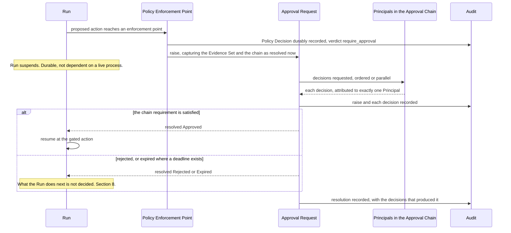

# Approval Workflows

What happens after a Policy Enforcement Point returns `require_approval`. The verdict itself
belongs to [`policy-model.md`](policy-model.md); this document owns everything downstream — how
the Approval Request is formed, what it carries, who may satisfy it, what a resolution means, and
what is recorded.

**This section is normative** ([`../README.md`](../README.md) section 3). MUST, MUST NOT, SHOULD,
SHOULD NOT and MAY carry their [RFC 2119](https://www.rfc-editor.org/rfc/rfc2119) meanings.
Orchestra is pre-implementation and pre-customer: no platform code exists, no approval surface has
been built, and no design partner has tested any claim here.

## 1. Scope, and what this document may decide

| Question | Decided by |
| --- | --- |
| When a PEP returns `require_approval` | [`policy-model.md`](policy-model.md) |
| What the Approval Request carries, and who may satisfy it | This document |
| What the Evidence Set is, and its integrity | This document |
| Whether a Principal may approve their own action | This document owns it and **does not decide it** — section 6 |
| Record format, retention, facts with no actor | [`audit-model.md`](audit-model.md) |
| Whether a capability grant existed at all | [`tool-authorization.md`](tool-authorization.md) |
| What an attacker does to the gate | [`threat-model.md`](threat-model.md) |
| The `approval` Step type and its branches | `step-types.md`, in [`../50-workflows/`](../50-workflows/) |
| Run states and transitions | [`../20-domain/lifecycle-state-machines.md`](../20-domain/lifecycle-state-machines.md) |
| How a transition reaches a client | `event-protocol.md`, in [`../30-protocol/`](../30-protocol/) |

Whatever follows from an Accepted ADR, from [`../GLOSSARY.md`](../GLOSSARY.md), or from
[`../20-domain/domain-model.md`](../20-domain/domain-model.md) is stated normatively here —
derivation, not invention. Where a choice is genuinely open this document says so, names what
would decide it, and stops. **It contains no threshold, no duration, no quorum size, no retry
count and no retention period**, because no ADR in this repository contains one and naming one
here would manufacture a decision nobody has taken.

Two **Proposed** decisions reach it and bind nothing:
[ADR-0004](../adr/adr-0004-adopt-ag-ui-event-protocol.md), whose outstanding validation step is a
prototype of exactly this lifecycle through disconnect and replay, and
[ADR-0010](../adr/adr-0010-a2ui-genui-interchange.md), under which the approval surface is the one
declarative surface the first vertical slice needs.

## 2. The gate

A gate is one Policy Decision, one Approval Request, one suspension, one resolution.

| | Requirement |
| --- | --- |
| **G1** | A `require_approval` verdict MUST raise exactly one Approval Request, and the gated Run MUST suspend before the proposed action executes. The causing Policy Decision is a class of Audit Record ([ADR-0012](../adr/adr-0012-policy-decisions-are-audit-records.md)) and MUST be durable before the gated action could be attempted; if it cannot be written, nothing proceeds ([ADR-0013](../adr/adr-0013-fail-closed-policy-decision-writes.md)). Suspension may last days, so suspended state MUST be durable and MUST NOT depend on a live process, connection or in-memory continuation. Orchestra consumes that durability from the runtime rather than implementing it ([ADR-0005](../adr/adr-0005-langgraph-as-compilation-target.md)), and owns the governance record of the suspension. |
| **G2** | The Run MUST resume only on resolution, and MUST resume *at* the gated action rather than before it. Re-entering the Agent to re-derive the action would mean the human approved something other than what executes. |
| **G3** | No model output satisfies a gate — not the Agent's justification, not a Tool result, not a retrieved document. The Agent's argument is an input to the deciding Principal's judgement and never to the verdict ([ADR-0003](../adr/adr-0003-governance-layer-positioning.md), [`../00-overview/product-thesis.md`](../00-overview/product-thesis.md) section 3). |

## 3. The Approval Request

[`../GLOSSARY.md`](../GLOSSARY.md) fixes the first four parts, and each is normative here. The
fifth is this document's addition rather than the glossary's: it follows from
[`../20-domain/domain-model.md`](../20-domain/domain-model.md) section 6, where a Policy Decision
raises an Approval Request, and from
[`../20-domain/lifecycle-state-machines.md`](../20-domain/lifecycle-state-machines.md) section 3.2,
which requires the raise to record it. The glossary entry and this table are out of step, and the
entry is where that should be closed.

| Part | Requirement |
| --- | --- |
| Proposed action | The Tool or Step, its Side-Effect Class, and the arguments as they would execute. Recorded, never paraphrased. |
| Evidence Set | Section 4. Exactly one per request. |
| Approval Chain | Section 5. Exactly one per request, resolved at raise. |
| Resolution | Section 8. The terminal outcome and the decisions, if any, that produced it — a `Withdrawn` resolution has none. |
| Causing Policy Decision | The Policy **version** evaluated, the inputs and the verdict, so that *why was I asked* is answerable from the request alone. |

**R1.** The proposed action MUST be recorded as it would execute. An action re-derived at resume
time, or whose arguments are templated and evaluated later, is not the action that was approved.
If the arguments cannot be fixed at raise time, the gate is decorative. Every request is
tenant-scoped like every other record (invariant I1,
[ADR-0011](../adr/adr-0011-tenant-isolation-shared-schema-rls.md)), and an Approval Chain MUST NOT
resolve to a Principal outside the Tenant.

**R2.** The causing Policy Decision references the Policy **version** it evaluated and MUST NOT
embed the rule text: Policies are immutably versioned on the same terms as Agent and Workflow
definitions, and a Policy Decision is a class of Audit Record over them
([ADR-0012](../adr/adr-0012-policy-decisions-are-audit-records.md),
[`../VERSIONING.md`](../VERSIONING.md) sections 2 and 8). A Run pins the Policy versions in force at
admission for its whole life, so a Policy edited while a request is pending MUST NOT change the
verdict the suspended Run receives, and the version a request names stays resolvable for as long as
the request does.

## 4. The Evidence Set

The Evidence Set holds the exact inputs the Agent relied on — Tool results, retrieved context,
prior messages — so that a human decides **on the same information the model had, rather than on
the model's summary of it.**

Take the invoice case from the product thesis: a supplier PDF whose free-text remittance field says
the bank details have changed and the payment is urgent. A model-written summary reads *supplier
has updated their bank details and requests urgent payment* — faithful, competent, and it has
reproduced the attack while discarding the only thing that would expose it. The summary is written
by the component the attack has already compromised.
**An approver shown a summary is approving the model's framing, which is precisely the surface a
prompt injection attacks.** Calling that a control is worse than having no gate, because it
produces an Audit Record attesting to a review that could not have worked.

**E1 — Inputs, not descriptions.** The Evidence Set MUST contain the inputs themselves. A summary,
extract, description or rationale is not an input and MUST NOT stand in for one.

**E2 — The Agent's argument is labelled as such.** A model-generated summary or justification MAY
accompany the Evidence Set. It MUST be recorded as model-generated and attributed to the Agent
version that produced it, MUST NOT be the only content presented, and MUST NOT be presented in a
form indistinguishable from the inputs.

**E3 — Completeness.** The Evidence Set MUST cover everything the model had that is not otherwise
reconstructible from the Run record. Instructions and Tool bindings are reconstructible from the
pinned Agent or Workflow version (invariant I3) and need not be copied into every request; the
variable inputs are not, and MUST be. Anything less means the human decides on less than the model
did, which is the failure E1 exists to prevent.

**E4 — Immutable from raise time. Settled here by derivation, and open nowhere.** The Evidence Set
MUST be captured at raise and MUST NOT change afterwards. The derivation runs in three steps with
no gap in it. [`../20-domain/lifecycle-state-machines.md`](../20-domain/lifecycle-state-machines.md)
section 3.2 requires the raise to record the Evidence Set, so the set is content of an Audit Record.
[`../GLOSSARY.md`](../GLOSSARY.md) defines an Audit Record as append-only and immutable, which
[`audit-model.md`](audit-model.md) A2 restates as a structural rather than conventional property.
And A4 requires a record to carry *on what basis* an act happened, naming the Evidence Set where one
exists. Content that may change after the record is written satisfies none of the three, and mutable
evidence makes a recorded approval unfalsifiable.

[`../20-domain/lifecycle-state-machines.md`](../20-domain/lifecycle-state-machines.md) introduced
the rule as **Proposed** and owned by this document. E4 is that rule, settled here by derivation
from the glossary's requirement that the approver decides on the same information the model had.
It needs no ADR, and it is correspondingly absent from section 11.

**E5 — Faithful presentation.** The record MUST be sufficient to reconstruct what a deciding
Principal was shown. Whatever surface presents the request MUST NOT show, as an input the Agent
relied on, content absent from the Evidence Set, and MUST NOT present the other parts of the
Approval Request — the proposed action, the chain, the causing Policy Decision, the Agent's
argument under E2 — in a form indistinguishable from the Evidence Set. Each item's provenance under
E6 MUST be presented with the item. Where a presentation truncates for display, the record MUST
permit the untruncated content to be retrieved and the truncation MUST be visible as one.

**E6 — Item provenance.** Each item in the Evidence Set MUST record its origin — which Tool result,
which retrieved document, which prior message — and whether it is content the Agent read or text the
Agent itself authored. E2 labels the Agent's argument, which is the weaker property: provenance is
what lets an approver, and a later audit, tell a supplier's document from the model's gloss on it,
and it is the property the invoice case turns on. [`threat-model.md`](threat-model.md) requires it
against T1 and T8; the rule belongs here, because section 1 gives this document the Evidence Set and
its integrity.

Not settled: whether the set is materialised by value or by reference to immutable
content-addressed records, an implementation choice constrained by E4 and E6; and how a large
Evidence Set is made *reviewable* rather than merely available, which belongs with the approval
surface schema [ADR-0010](../adr/adr-0010-a2ui-genui-interchange.md) requires for the first slice
however A2UI resolves. Nor is *approval surface* itself a defined term: it carries a requirement in
E5 and appears in no [`../GLOSSARY.md`](../GLOSSARY.md) entry and no owning document. The set will
also routinely hold a Tenant's most sensitive business data, retained for an audit-retention period
**decided nowhere in this repository** —
[ADR-0012](../adr/adr-0012-policy-decisions-are-audit-records.md) fixes the record model and
explicitly leaves the period unmade — against erasure obligations whose mechanism ADR-0011 records
as needing design.

## 5. The Approval Chain

An Approval Chain is the ordered or parallel set of Principals whose decisions the request
requires, **derived from Policy** — not a static list on the request, and not whoever happened to
be asked. What follows from that, from invariant I2 (one action, one Principal), and from
deny-by-default:

| | Requirement |
| --- | --- |
| **C1** | The chain MUST be derived from Policy at raise time and recorded as resolved at that moment. A chain that cannot be reconstructed later cannot be audited. |
| **C2** | A chain MUST resolve to at least one Principal. A chain resolving to none is an unresolvable gate: the request MUST NOT resolve as satisfied and the gated action MUST NOT execute. An empty chain that auto-satisfies is a silent bypass of the platform's central control. |
| **C3** | Satisfaction MUST be affirmative. Silence, absence, unavailability and the passage of time are not decisions and MUST NOT count toward satisfying a chain. |
| **C4** | Each decision MUST be attributed to exactly one Principal, with the authenticated identity behind them. |
| **C5** | A Service Account or Connector decision MUST NOT count toward satisfying a chain. Both are Principals, but the glossary defines an Approval Request as a **human** decision gate, and a machine Principal approving on a human's behalf is an automated approval wearing a human's name. |
| **C6** | In an ordered chain a Principal MUST NOT be asked before everyone ahead of them has decided, or ordered and parallel are the same thing; partial progress MUST be recoverable from the record. |

**What satisfies a chain is not decided, and needs an ADR.** Unanimity, quorum, first-decision and
any-one-of are all defensible, and nothing in the ADR set, the glossary or the domain model
chooses between them; nor is it decided whether one rejection in a parallel chain is decisive.
This is not a syntax detail deferrable to a schema. It is a predicate tenants author Policies
against, read by the compiler, the enforcement path, the approval surface, the event protocol and
the audit export, and once Policies exist against one reading it is expensive to move to another —
the ADR test in [`../adr/README.md`](../adr/README.md) met twice over.

**Escalation, delegation and reassignment after raise are undecided**, as is whether an End User
may sit in a chain at all — which [`../00-overview/personas.md`](../00-overview/personas.md)
raises, and which touches the seat definition under
[ADR-0009](../adr/adr-0009-meter-first-defer-tiering.md). Two constraints hold on whatever is
adopted, both from I2 and from what audit is for:

- **Delegation records the delegate, not the delegator.** The Audit Record MUST name the Principal
  who actually decided; the delegation grant is a separate audited fact with its own acting
  Principal and scope. Naming the person on whose behalf a decision was taken is false
  attribution.
- **Escalation amends the chain, it does not rewrite it.** It changes the chain after C1 recorded
  it, so the amendment MUST be recorded with its cause and the chain as originally resolved MUST
  remain reconstructible. Escalation on elapsed time has no acting Principal — section 7's
  problem.

## 6. Separation of duties

**May the Principal who triggered an action approve it? Nothing in this repository decides.** Not
an ADR, not the glossary, not the domain model. It is registered prominently because it is the
control an enterprise security review asks about by name, and *we have not decided* is a materially
worse answer in that room than either alternative.

What exists is the ability to enforce whichever answer is chosen: invariant I2 gives every action
exactly one Principal, so the triggering and deciding Principals are both recorded and comparable.
The data model supports the control; the rule does not exist. The candidate defaults are not
symmetric. **Deny self-approval unless a Policy permits it** matches the deny-by-default stance
ADR-0001 requires and invariant I5, and its cost is real: in a small Tenant, or a Workspace with
one qualified approver, a chain excluding the trigger can resolve to nobody and deadlock under C2.
**Permit unless a Policy forbids it** never deadlocks and fails silently — a Tenant that never
writes the rule has a gate the person taking the action can satisfy alone.

The same question returns in a second form and MUST be answered with it: whether one Principal may
occupy more than one position in a chain, and whether their single decision then counts twice. A
quorum satisfied twice by one person is a quorum in name only.

**This needs an ADR.** The predicate has to be expressible in the policy language, the default is a
security posture rather than a preference, deadlock under C2 is a liveness consequence reaching the
Run state machine, and changing the default later silently changes what existing Policies mean.

## 7. Deadlines, expiry and re-raise

**Whether a decision deadline exists at all is not decided.** No duration exists anywhere in this
repository and none is introduced here. What can be settled is what any deadline mechanism would
have to satisfy, and what follows from having none.

| | Requirement |
| --- | --- |
| **D1** | If a deadline exists, `Expired` MUST be distinct from `Rejected`. *A human declined* and *nobody looked* are different facts about a control, and an audit that cannot separate them cannot report on that control at all. |
| **D2** | Expiry MUST NOT be recorded as a decision by any Principal, and MUST NOT be attributed to a Principal who did not act. Expiry is a fact with no actor and invariant I2 requires one. *How* such facts are attributed is [`audit-model.md`](audit-model.md) section 9's, and that document holds the choice open — a purpose-made system Principal subtype is one of its live options, and nothing here forecloses it. Withdrawal is a third instance alongside expiry and platform-operator action and takes the same rule; where a Principal cancelled the gated Run, that Principal is the cause of the withdrawal and MUST NOT be recorded as having decided the request. |
| **D3** | A terminal Approval Request is permanently terminal, so a re-raise after expiry is a **new** Approval Request referencing the expired one, never a reopening. Derivable rather than preferred: reopening a terminal state would make the request's own history a lie, and Audit Records are append-only. |
| **D4** | A re-raised request captures its own Evidence Set at its own raise time under E4. Whether that is a copy of the original capture or a fresh one MUST be recorded — a Principal told *this is what the Agent saw* is entitled to know when it saw it. |

Whether re-raise is permitted at all, and whether it is manual or automatic, is undecided.
Automatic re-raise creates a loop nothing in this repository bounds, and bounding it means naming
a number no decision supports. Having no deadline has two real consequences: a suspended Run holds
its pinned version undrainable indefinitely, so a `Retired` version never reaches `Archived` and
no force-drain mechanism is decided either; and a request nobody will ever decide is
indistinguishable, from the record, from one about to be decided.

**This needs an ADR.** The answer decides whether Orchestra makes any liveness promise about a
suspended Run, and that promise reaches the Run state machine, version drain, actorless
attribution in audit, the event protocol and the policy language at once.

## 8. Rejection, expiry, withdrawal and the Run outcome

**Whether a rejected or expired gate fails the Run or routes to a declared rejection branch is not
decided.** [`../20-domain/lifecycle-state-machines.md`](../20-domain/lifecycle-state-machines.md)
draws `Suspended → Failed` as the conservative reading and marks it undecided; an `approval` Step
may legitimately declare a rejection branch and continue. The question is shared with
`step-types.md` in [`../50-workflows/`](../50-workflows/) and is not settled here alone. Four
things hold either way — though the first, as the paragraph immediately after the table records,
has nowhere to land under the Run state machine as currently drawn.

| | Requirement |
| --- | --- |
| **J1** | A rejection is a governance outcome, not a fault, and MUST be distinguishable from a fault in the audit trail and in the metered outcome. ADR-0009 meters Runs *by outcome*, so this is a billing-adjacent contract, not a presentational choice. |
| **J2** | A rejection MUST NOT be readable as authorization for anything. A declared rejection branch is ordinary execution: every Step on it crosses a Policy Enforcement Point, because the compiler emits one at every Step boundary ([ADR-0008](../adr/adr-0008-declarative-workflow-definitions.md)). The branch does not inherit the refused action's authorization. |
| **J3** | Re-proposing the refused action raises a **new** Approval Request. A refused request is terminal and MUST NOT be resumed. |
| **J4** | Rejection MUST NOT be read as proof that no side effect occurred. G1 guarantees the refused action itself never started, so the unknown state is never that invocation: it is the Step Executions that already ran in this Run. A Tool invocation interrupted earlier leaves that call in an unknown state, and unknown is not the same as not done — which is why compensation, not retry, is the mechanism ADR-0008 requires, and why the unit is the Step Execution (invariant I4). |

**J1 does not hold under the Run state machine as drawn**, and the requirement is not the defect.
[`../20-domain/lifecycle-state-machines.md`](../20-domain/lifecycle-state-machines.md) section 2
routes a rejected or expired gate to `Failed` and defines `Failed` as *ended on an error, or on an
unfavourable gate resolution* — one terminal state carrying both facts — while `Denied` is reachable
only from `Pending`. The metered outcome under ADR-0009 is that terminal state, so today a
governance refusal and a crash meter identically, which is exactly what J1 forbids. J1 is grounded
in ADR-0009 and stands; what is missing is somewhere for it to land. Either the Run gains a terminal
state for governance refusal reachable from `Suspended`, or the metered outcome keys on an attribute
distinct from the terminal state. Section 11 carries it.

**Withdrawal runs the other way.** The three outcomes above are the gate deciding what the Run does
next; `Withdrawn` is the Run having already ended — cancelled, or failed for an unrelated reason —
leaving nothing to gate
([`../20-domain/lifecycle-state-machines.md`](../20-domain/lifecycle-state-machines.md) section 3).
It is a resolution with no decision behind it, and the three requirements that follow
are derivations, not new choices: it MUST be recorded with its cause and the terminating Run event
so a resolution is never unexplained; D2 governs its attribution, since nobody decided it; and D3's
permanent terminality applies unchanged, so a withdrawn request MUST NOT be reopened and work
re-attempted afterwards raises a new Approval Request.

A second inconsistency awaits whoever settles this. The Run state machine gives `Denied` the meaning
*refused at admission, no Step Execution ever occurred*, which describes a human-rejected
admission gate exactly, yet the diagram routes every rejected gate through `Suspended → Failed`.
An admission gate has no Step to branch from, so a rejection branch cannot exist there in any case.

The same shape recurs one gate earlier, and that one is not this document's to register. A mid-Run
`deny` verdict has no defined effect on the Run either: [`policy-model.md`](policy-model.md) V1
makes `deny` terminal at admission and says only that the action MUST NOT be attempted elsewhere,
and the Run state machine has no transition for a refusal that is not a fault. It is the same
question in a different place and probably the same ADR; [`policy-model.md`](policy-model.md)
owns it.

**This needs an ADR.** It spans the Run state machine in `20-domain/`, branch semantics in
`50-workflows/`, and a metered outcome dimension — three documents that cannot answer it
separately without diverging.

## 9. Audit

**Every resolution is a Policy-relevant fact and MUST be audited**, as is every decision that
contributed to it, and the raise.

**[`audit-model.md`](audit-model.md) section 3 is the single enumeration of what MUST be audited.**
The table below is not a second one: it states only the approval-specific *content* each of these
records MUST carry, which that document cannot state on this document's behalf. Two rows below —
chain amendment, and resume or non-resume — are absent from that enumeration today. That is a gap in
the enumeration rather than a competing list, and it is closed there, not here.

| Event | MUST record |
| --- | --- |
| Raise | The causing Policy Decision by Policy version, the proposed action as it would execute, the Evidence Set with its provenance, the chain as resolved, the timestamp |
| Each decision | The deciding Principal, the authenticated identity behind them, the timestamp, the decision — approve or reject — and the chain position |
| Chain amendment | The cause, the acting Principal where one exists, the chain before and after, the timestamp |
| Resolution | The terminal outcome, the decisions — if any — that produced it, and the timestamp |
| Withdrawal | The cause and the terminating Run event. A withdrawal is a resolution with no decision and no deciding Principal; D2 governs its attribution |
| Resume or non-resume | The resolving Approval Request and the Principals who decided it |

`verdict` is reserved throughout for the output of a Policy evaluation — `allow`, `deny`,
`require_approval` ([`../GLOSSARY.md`](../GLOSSARY.md)). A human's approve-or-reject is a
**decision**, and the lifecycle's `Approved` and `Rejected` name its outcome.

**A1.** Recording only refusals is not an audit trail. An approval is evidence that the control ran
and that a named human accepted the action, which is the fact a reviewer is looking for. That every
Policy Decision is audited, allows included, is [`policy-model.md`](policy-model.md) D1's
specification; approvals follow the same rule for the same reason.

**A2.** The record MUST be sufficient to reconstruct what the deciding Principal was *shown*, not
merely what was stored. E5 is what makes that possible.

**A3.** The causing Policy Decision is on the fail-closed side of
[ADR-0013](../adr/adr-0013-fail-closed-policy-decision-writes.md): it MUST be durable before the
gated action could be attempted, and a gate whose decision cannot be written does not let the action
proceed. Which side the approval records themselves fall on — the raise, each decision, the
resolution — is a classification [`audit-model.md`](audit-model.md) makes within that ADR's rule
set, and it is a property of the record class rather than a runtime choice.

Format, retention and the attribution of actorless facts are [`audit-model.md`](audit-model.md)'s.
No retention period appears here.

## 10. Throughput is a governance property

**Orchestra assumes an approval gate that is slow gets routed around** — the task done by hand,
outside the platform, the control disappearing with the audit trail. It is a design premise, not a
finding: no design partner has tested it. The premise matters because the failure it predicts
arrives as a UX complaint and gets triaged as one. The quieter form is the same failure: an
approver under volume who approves everything is not a control either, and the Audit Record looks
identical to one produced by genuine review.

No latency target is named here; none has been decided and none would be credible pre-customer.
The measurement, though, needs no new instrumentation — ADR-0009 meters Approvals raised and
resolved, and [`audit-model.md`](audit-model.md) A4 requires a timestamp on every record, so
time-to-resolution and approval rate per Policy fall out of records that already exist, including
for an expired request that carries no decision at all. Both are therefore computable from what
this document requires. Surfacing them to a Tenant administrator is a product decision no ADR has
taken, and it is registered rather than asserted: a Policy whose requests are approved without
exception is either correctly scoped or not a control at all, and the data to tell those apart
exists either way.

Mechanisms that reduce approval volume — batching several requests into one decision, standing
approvals, automatic approval below a bound — are **not adopted**, and none is a schema detail.
Each weakens the control in a way an attacker can aim at, so each belongs in
[`threat-model.md`](threat-model.md) before it belongs in a policy language. One constraint
already holds: a batching mechanism MUST NOT let one decision cover an Evidence Set the deciding
Principal was not shown, which is E1 and E3 applied to a batch.

A **break-glass path** — a declared emergency bypass of the gate — is the same class of question
and is likewise **not adopted**. [`threat-model.md`](threat-model.md) sections 12 and 14 assign it
here and mark it as needing an ADR, because a deliberate hole in the primary control is costly to
reverse; this document accepts the assignment and registers it in section 11 rather than inventing
a mechanism. Two constraints would hold on any bypass that is adopted: it would be a governed act
with exactly one acting Principal and a recorded justification, and it would be audited in the same
surface as the approvals it bypasses, since a bypass invisible beside the control it circumvents is
not a control at all.

## 11. Open questions

Everything this document could not settle. **Yes** means the choice is costly to reverse or spans
components and MUST be recorded as an ADR before implementation; **No** means a later normative
document suffices. The middle column indexes the argument rather than repeating it, which is made
in the section named.

| Question | What would decide it | ADR required? |
| --- | --- | --- |
| What satisfies an Approval Chain — unanimity, quorum, first decision, any-one-of — and whether one rejection in a parallel chain is decisive | Section 5 | **Yes** |
| Whether escalation, delegation and reassignment after raise exist, and their triggers | Section 5; the two constraints there hold on any answer | **Yes** |
| Whether the Principal who triggered an action may approve it, the default, and whether one Principal may hold two chain positions | Section 6 | **Yes** |
| Whether a decision deadline exists at all, and whether a request may be re-raised after expiry | Section 7; D1–D4 hold on any answer | **Yes** |
| Whether a rejected or expired gate fails the Run or takes a declared rejection branch, and whether `Denied` or `Failed` ends a rejected admission gate | Section 8; shared with `step-types.md` in [`../50-workflows/`](../50-workflows/) | **Yes** |
| Where a governance refusal lands as a metered outcome, given `Failed` currently carries both a refusal and a fault | Section 8; the same decision, and J1 is unsatisfiable until it is taken | **Yes** |
| Whether an End User may sit in an Approval Chain | Touches the seat definition under ADR-0009 and the approver's identity | **Yes** |
| Whether batching, standing approvals or automatic approval below a bound are ever permitted | Section 10; [`threat-model.md`](threat-model.md) first, then a policy-language decision | **Yes** |
| Whether a break-glass path exists at all | Section 10; assigned here by [`threat-model.md`](threat-model.md) sections 12 and 14 — a deliberate hole in the primary control | **Yes** |
| Evidence Set retention and erasure against audit-retention obligations | [`audit-model.md`](audit-model.md) and the ADR-0011 erasure follow-on; ADR-0012 fixes the record model and leaves the period unmade | **Yes** — [`audit-model.md`](audit-model.md) section 13 owns the classification |
| How a fact with no acting Principal is attributed — expiry, withdrawal, platform-operator action | [`audit-model.md`](audit-model.md) section 9 owns it and holds it open; whichever option it takes binds expiry and withdrawal here, and D2 stands either way | **Yes** — [`audit-model.md`](audit-model.md) section 13 owns the classification |
| Whether an ordered chain's partial progress is a substate of `Pending` or an attribute of it | Assigned here by [`../20-domain/lifecycle-state-machines.md`](../20-domain/lifecycle-state-machines.md) section 3.1; C6 holds either way, so the choice is representational | No |
| Whether *request more information* is a state, given the lifecycle admits only Approved, Rejected, Expired and Withdrawn | [`../00-overview/personas.md`](../00-overview/personas.md) names the action and the state machine has no transition for it; a later document reconciles the two | No |
| Whether the Evidence Set is materialised by value or by reference, and how a large one is made reviewable | Section 4; an implementation choice constrained by E4 and E6, then the approval surface schema ADR-0010 requires for the first slice | No |
| What the *approval surface* is, and which document owns it — the term carries a requirement in E5 and has no [`../GLOSSARY.md`](../GLOSSARY.md) entry | The same schema decision; a glossary entry or an owning document, whichever comes first | No |
| How an approval transition reaches a client, and whether it survives disconnect and replay | ADR-0004 validation step 2, then `event-protocol.md` in [`../30-protocol/`](../30-protocol/) | No — ADR-0004 exists |
| How an approver is reached — notification and delivery channel | No ADR names one; a product decision | No |
| Whether time-to-resolution and per-Policy approval rate are surfaced to a Tenant administrator | Section 10; computable from records already required, so the question is product surface, not instrumentation | No |

Two questions are **not** here, and their absence is deliberate. The Evidence Set's immutability
from raise time is settled by E4 and open nowhere.
And whether the causing Policy Decision carries the Policy version or the rule text is settled by
[ADR-0012](../adr/adr-0012-policy-decisions-are-audit-records.md): it carries the version, R2.

**The remaining Evidence Set questions are the ones to take first.** E4 and E6 fix what a gate holds
at the moment it is first built, and unlike a chain predicate they cannot be reinterpreted
afterwards for records already written.
