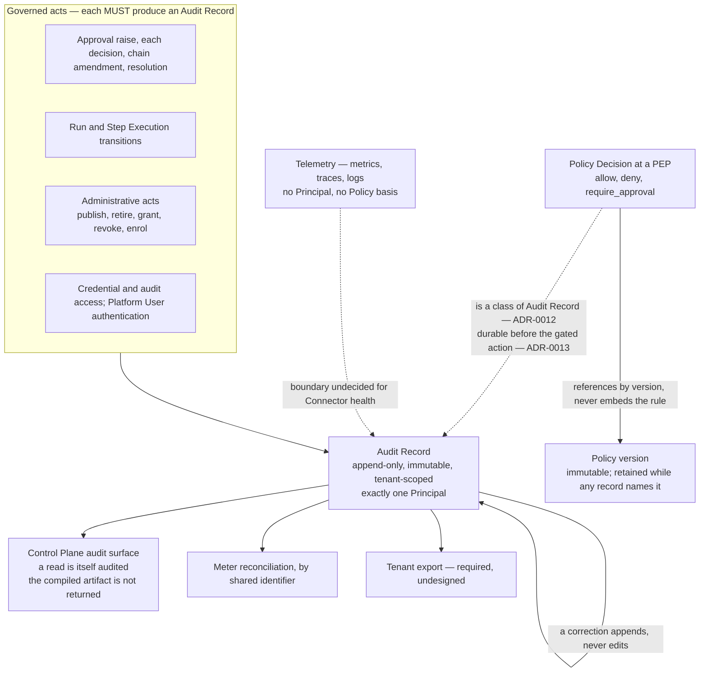

# Audit Model

[`../GLOSSARY.md`](../GLOSSARY.md) defines an **Audit Record** as an append-only, immutable fact
about something that happened, sufficient to reconstruct who did what, when, on what basis, and
under which Policy — then adds the sentence this document exists to enforce: *audit is a product
surface, not a log level.* [ADR-0003](../adr/adr-0003-governance-layer-positioning.md) counts audit
and attribution among the five capabilities Orchestra is being built for. The record that survives a
security review is the product.

## 1. Standing and scope

**Normative.** Under [`../README.md`](../README.md) section 3, `40-governance/` is normative and
implementations MUST conform. Keywords carry their
[RFC 2119](https://www.rfc-editor.org/rfc/rfc2119) meanings.

**In scope.** What an Audit Record is, what produces one, what each MUST contain, who it attributes
to, what its immutability forbids elsewhere, what metering reconciliation demands, and where audit
ends and telemetry begins. **Out of scope.** Field names, wire format, storage layout, query syntax,
API shape. No datastore is chosen:
[ADR-0011](../adr/adr-0011-tenant-isolation-shared-schema-rls.md) constrains the engine to one
enforcing row-level security itself and names PostgreSQL only as the obvious candidate. Orchestra is
pre-implementation and pre-customer; no code exists and no contract has forced a retention term.
[ADR-0004](../adr/adr-0004-adopt-ag-ui-event-protocol.md) and
[ADR-0007](../adr/adr-0007-outbound-connector-for-enterprise-reachability.md) are **Proposed**, and
marked where leaned on.

**Three things, four words.** The **audit store** is where records are persisted; the **audit
surface** is the Control Plane read path over them, which [`../GLOSSARY.md`](../GLOSSARY.md) names
where it has the Platform User read *audit logs*; an **audit trail** is the ordered set of records
over some range; an **Audit Record** is the fact itself. The distinction is load-bearing — three of
the four carry MUSTs below — so it is fixed here. Neither *audit surface* nor *meter record* is in
the glossary yet, and both belong there.

## 2. The eight properties of an Audit Record

**A Policy Decision is one of these records, not a neighbour of one.**
[ADR-0012](../adr/adr-0012-policy-decisions-are-audit-records.md) settles it: a Policy Decision is a
class of Audit Record. A1 to A8 hold of it without restatement, and it carries one lifetime, one
retention rule and one export format rather than two. [`policy-model.md`](policy-model.md) owns what
a Policy Decision additionally carries; this document owns everything true of it as a record.

**A1 — Tenant scoping, without exception.** Every Audit Record MUST carry a tenant identifier
([ADR-0001](../adr/adr-0001-product-shape-multi-tenant-saas.md), ADR-0011, invariant I1 of
[`../20-domain/domain-model.md`](../20-domain/domain-model.md)). The audit store is subject to the
same forced row-level security policy, and the same CI control, as every other tenant-scoped table.
An action affecting more than one Tenant MUST produce one record per Tenant affected: a record
spanning Tenants could not be read under a tenant predicate without a bypass.

**A2 — Append-only and immutable.** A record MUST NOT be updated or deleted within its retention
period, whose duration is undecided — section 11, and no implementation can claim conformance to the
term until it exists. A correction is a new record naming the one it corrects; the original stays
readable, and both are returned by any query covering the period. Immutability MUST be structural,
not conventional — the role that writes audit MUST NOT hold update or delete privilege on it, which
is ADR-0011's reasoning applied a second time. Whether immutability is additionally cryptographic —
hash chain, write-once storage, external notarisation — is **not decided**.

**A3 — Exactly one Principal.** Every record MUST resolve to exactly one Principal (GLOSSARY,
invariant I2) and MUST carry the authenticated identity behind it, so attribution survives a rename
or the Principal's deletion. The Principal named is the one who **acted**:
[`approval-workflows.md`](approval-workflows.md) fixes the same rule for delegation, where the
record names the delegate who decided and the delegation grant is a separate audited fact with its
own acting Principal. Whether a record ever carries an acted-for Principal alongside the acting one
depends on a delegation and impersonation mechanism no document defines; section 13 registers it,
and this rule holds on any answer. Actions with no acting Principal are section 9, and are
unresolved.

**A4 — Sufficiency.** A record MUST carry enough to reconstruct the event without reference to any
other system: **who** — the Principal of A3; **what** — the action and the entities it touched, by
identifier; **when** — a timestamp and the ordering key of A7; **on what basis** — the inputs it
rested on, including the Evidence Set where one exists; **under which Policy** — for a Policy
Decision, the Policy version it evaluated, held by reference and never as embedded rule text
(ADR-0012); for any other record, the Policy Decision that permitted or gated it. Where no Policy
Decision applies the record MUST say so rather than omit the field, since deny-by-default makes *no
rule matched* a decision, not a missing record. A Policy Decision that names no Policy is likewise a
decision — [`policy-model.md`](policy-model.md) owns when one arises.

**A5 — Records reference, they do not depend.** A record MUST stay readable and meaningful after the
Agent, Workflow version, Tool, Policy, Model Binding or Principal it names is deleted. It holds
identifiers and the values as they stood at the time, never a foreign key a later deletion could
null. ADR-0012 makes one reference load-bearing: a Policy Decision resolves its Policy by version,
so a Policy version MUST be retained for at least as long as any record referencing it — section 11.

**A6 — Written on the governed path.** The component taking the decision MUST write the record. A
record MUST NOT be reconstructed by parsing application logs, traces or metrics, and those artefacts
MUST NOT be presented as the audit trail. A governed action MUST NOT be reported as having occurred
under governance if its record was not durably written. The mechanism — a shared transaction with
the state change, or a durable outbox — is constrained by the datastore decision. What happens when
the audit store is unreachable is settled by
[ADR-0013](../adr/adr-0013-fail-closed-policy-decision-writes.md), which splits the write by record
class rather than treating audit as one undifferentiated thing.

- A **Policy Decision MUST be durable before the gated action is attempted**, where durable means
  it survives a crash — a local append that is later replicated satisfies it, a remote round-trip is
  not required ([ADR-0013](../adr/adr-0013-fail-closed-policy-decision-writes.md)). If it cannot be
  written, the action MUST NOT proceed. This is the fail-closed path and it holds at every PEP.
- **Every other Audit Record MAY degrade** — buffered, retried, or written behind the action. The
  permission is not an instruction: a degraded write is still a write, and a record never written is
  a gap rather than a saving.
- A degraded period MUST be recoverable from the trail, so that a gap is attributable rather than
  silent. It brackets the degradable class only: a Policy Decision that cannot be written halts the
  gated action under the first bullet rather than opening one, though the same audit store outage
  will usually open a period concurrently for the records buffering behind it. `reliability.md` in
  [`../60-operations/`](../60-operations/) owns the failure taxonomy and the signals that make one
  visible.
- The class is a property of the record, not a runtime choice. An implementation MUST NOT reclassify
  a Policy Decision as degradable under load.

ADR-0013 accepts the cost in the open, and this document repeats rather than buries it: audit store
availability bounds the availability of every governed action.

**A7 — Deterministic order.** Reconstruction requires order, and wall-clock timestamps MUST NOT be
the sole basis for it: clocks skew across the components that write records. Records within a Run
MUST carry a deterministic ordering key, and it is **independent of the event stream's `seq`**.
[`../30-protocol/event-protocol.md`](../30-protocol/event-protocol.md) section 10 settles this, and
the reason is structural rather than stylistic: Audit Records exist for actions that belong to no
Run and therefore have no `seq`, and A6 puts the record ahead of the gated action while the
corresponding event is emitted after it. An Audit Record MAY carry the event's identifier as a
correlation value; it MUST NOT use it as the ordering key. The per-run sequence itself is required
by [`../VERSIONING.md`](../VERSIONING.md) section 5 and the Agent Event Profile, not by ADR-0004,
which is Proposed and cannot carry a normative requirement.

**A8 — No rail in the audit contract.** Per CLAUDE.md working rule 2 and
[ADR-0005](../adr/adr-0005-langgraph-as-compilation-target.md), the orchestration runtime's, a model
provider's or the tool protocol's vocabulary MUST NOT appear in the audit surface, and a Checkpoint
is never referenced (invariant I6). An identifier minted by a rail MAY be retained as an opaque
value where it lets a customer reconcile against their own provider-side records — under BYOK those
are the customer's own — but MUST NOT be typed, named or structured so as to expose the rail through
a public contract.

## 3. What MUST be audited

Every row is a record satisfying A1 to A8 — for a Policy Decision the act and the record are one
thing under ADR-0012, and for every other row the act produces one. The grounding column is what
makes each row a derivation rather than a preference.

| Governed act | The record MUST additionally carry | Grounding |
| --- | --- | --- |
| Every Policy Decision at every PEP, all three verdicts | The PEP, the Policy version evaluated — by reference, never the rule text — the inputs, and the verdict. A `deny` reached before any Policy applied names none, and [`policy-model.md`](policy-model.md) owns that rule | [ADR-0012](../adr/adr-0012-policy-decisions-are-audit-records.md); GLOSSARY; [`policy-model.md`](policy-model.md) |
| Run admission, and every Run state transition | The admission Policy Decision, the pinned Agent or Workflow version, and the cause of each transition; for cancellation, the cancelling Principal and any Step Execution in flight | [ADR-0008](../adr/adr-0008-declarative-workflow-definitions.md), invariant I3, [`../20-domain/lifecycle-state-machines.md`](../20-domain/lifecycle-state-machines.md) |
| Step Execution start and terminal transition | The Run, the Step, the Side-Effect Class, the outcome, and the idempotency key the Step Execution is scoped to | Invariant I4, ADR-0009 — Step Executions is a metered dimension |
| Tool invocation | The Tool, its Side-Effect Class, and the execution it belongs to — the Step Execution in a Workflow Run; an Agent Run has none, and that grain is open (sections 7 and 13) | GLOSSARY, ADR-0009 |
| Approval Request raise | The causing Policy Decision, the proposed action, the Evidence Set, the Approval Chain as resolved | Section 5 |
| Each approval decision, and the resolution | The deciding Principal, the authenticated identity, which decisions satisfied the chain, and whether a Run suspended on it resumed | Section 5 |
| Amendment of an Approval Chain after it was resolved | The cause, the acting Principal where one exists, and the chain before and after | [`approval-workflows.md`](approval-workflows.md) section 9, [`threat-model.md`](threat-model.md) |
| A Policy version published, and any change to which Policy versions are in force | The Principal and the Policy version identity — the rule content is in the version, which is immutable and need not be restated per record | ADR-0012, [`../VERSIONING.md`](../VERSIONING.md) sections 2 and 8 |
| Definition published, set current, or retired | The Principal, the frozen definition, and the compiled artifact | ADR-0005, ADR-0008 |
| Definition archived | The cause — the last pinned Run reaching a terminal state — and no Principal, because none acted | Section 9, [`../20-domain/lifecycle-state-machines.md`](../20-domain/lifecycle-state-machines.md) |
| Tool registered in the Tool Catalog | The Principal and the Tool's origin | Invariant I5 |
| A capability grant from an Agent version to a Tool, and its revocation | The Principal — a second act, audited separately from registration | Invariant I5, [`tool-authorization.md`](tool-authorization.md) |
| Model Binding created or changed; a custodied credential accessed | The binding and the Principal — never the credential, in any form | [ADR-0002](../adr/adr-0002-enterprise-segment-and-byok.md) |
| Connector enrolment, first session, every version negotiation outcome including refusals, revocation | The Connector, which is itself a Principal | ADR-0007 — **Proposed** |
| Principal, Workspace and Tenant administration; Session Token issuance and revocation | The Principal, and the authority granted or removed | A3, GLOSSARY |
| A Platform User authenticating to the Control Plane | The Principal, the authenticated identity behind them, and the outcome | ADR-0009 — Platform Users is the seat-billable metered dimension; section 7 |
| A read of the audit surface or of an Evidence Set | The reading Principal and the scope of the query | ADR-0003 and section 8 — derived here, not required by an ADR |

Sampling MUST NOT be applied to any row above. Sampling is a telemetry technique, and a sampled
control cannot be evidenced.

**This table is the enumeration.** Where another normative document lists what an act must record —
[`approval-workflows.md`](approval-workflows.md) section 9 is the case — it states the *content* a
particular act carries; the list of audited *events* is here, and a divergence between the two is a
defect in whichever list is shorter.

**The compiled artifact is retained, not exposed.** The publication row keeps it so a Run's process
can be reconstructed, which [ADR-0005](../adr/adr-0005-langgraph-as-compilation-target.md)
sanctions. It is not part of the tenant-readable surface: see section 8, and A8 for why.

## 4. Policy Decisions, including allows

[`policy-model.md`](policy-model.md) D1 specifies the rule — a Policy Decision is written for every
evaluation, whatever the verdict — and GLOSSARY.md carries it in the definition. This section does
not restate it; it states what it costs. Recording only denials looks like a saving and reads, under
review, as a system that documents its refusals but not its behaviour. The buyer's question is not
*what did you block* but *why was this permitted*, and under ADR-0003 the answer to that is the
purchase driver. Two consequences follow.

**Volume is dominated by allows.** A PEP sits at Run admission, before every Tool invocation and at
every Workflow Step boundary, and the overwhelming majority return `allow`. Audit volume — and so
retention cost and export size — is set by ordinary behaviour rather than by incidents. That is a
cost to plan for, not a reason to sample.

**"Under which Policy" resolves through a version, not a snapshot.** ADR-0012 makes Policies
immutably versioned on the same terms as Agent and Workflow definitions
([`../VERSIONING.md`](../VERSIONING.md) sections 2 and 8), and a Policy Decision references the
version it evaluated rather than embedding the rule. A Run pins the Policy versions in force at
admission for its whole life, so editing a Policy cannot change the verdict a Run in flight
receives. Two obligations land on this document. A Policy version MUST be retained for at least as
long as any record referencing it, which section 11 folds into the retention question; and
reconstruction is a join, so a trail exported without the Policy versions its records name
reconstructs nothing (section 12).

## 5. Approvals and the Evidence Set

An approval resolution MUST record the deciding Principal and the Evidence Set that was before
them — the exact inputs the Agent relied on, so a human decides on the same information the model
had. A record that cannot reproduce it attests to nothing beyond somebody having clicked.

- The record MUST preserve the Evidence Set **as it stood when the request was raised**; held by
  reference, that content MUST be immutable for the retention period (section 11).
  [`approval-workflows.md`](approval-workflows.md) settles the same constraint as its E4, by
  derivation. This is the audit side of one rule, not a second rule.
- Where an Approval Chain requires several decisions, each MUST be its own record with its own
  Principal and timestamp, and the resolution MUST name the decisions that satisfied the chain. One
  aggregate record loses who dissented.
- `Expired` MUST be distinguishable from `Rejected`. "A human declined" and "nobody looked" are
  different facts about a control, and a report conflating them misstates it. Whether a deadline
  exists at all belongs to [`approval-workflows.md`](approval-workflows.md); expiry is also the
  sharpest instance of the attribution gap in section 9.
- An Evidence Set is content an Agent may have been induced to assemble. It is recorded because it
  is what the human saw, never because it is trustworthy — see [`threat-model.md`](threat-model.md).

## 6. Immutability forbids reopening

A terminal state is permanent, and the reason is this document's rather than the lifecycle's. A
record asserting that a Run reached `Succeeded` at a given moment is true forever; reopening the Run
would require either editing that record, which A2 forbids, or leaving a trail asserting two
contradictory facts about one entity. Immutability propagates into every state machine in
[`../20-domain/lifecycle-state-machines.md`](../20-domain/lifecycle-state-machines.md).

- A Run in `Succeeded`, `Failed`, `Cancelled` or `Denied` MUST NOT transition again. Re-execution is
  a new Run referencing the old one; retries live at Step Execution (invariant I4).
- An `Approved` Approval Request MUST NOT be un-approved. Reversing an approval's effect is a new
  governed act — a cancellation, a compensating Step Execution, a fresh Approval Request — with its
  own record and its own Principal.
- A `Revoked` Connector enrolment MUST NOT be reinstated. A replacement is a new enrolment, and the
  audit surface MUST NOT present it as continuous with the revoked one — ADR-0007, **Proposed**, so
  every Connector requirement here is provisional on its validation.
- Erasure collides with A2 head-on. ADR-0011 already records per-tenant erasure under a shared
  schema as needing design against the retention obligations ADR-0001 raises. Whether erasure is met
  by redacting identified fields inside an otherwise intact record, by crypto-shredding a per-record
  key, or by a contractual carve-out is **not decided**. Nothing should be built assuming deletion
  is available.

## 7. Reconciliation with metering

[ADR-0009](../adr/adr-0009-meter-first-defer-tiering.md) requires meter records to be "append-only,
tenant-scoped, timestamped, idempotent under retry, and reconcilable against the audit log", because
billing data must be defensible in a commercial dispute. Reconciliation is a join, not an inference
from counts and timestamps, and a join has requirements on both sides.

**Of audit.** Every occurrence of a metered dimension MUST also be an audited fact — Runs by
outcome, Step Executions, Tool invocations by Tool and Side-Effect Class, approvals raised and
resolved, Platform Users authenticating, Connectors by health, model usage per Model Binding. Each
such record MUST carry a stable identifier that does not change on retry or replay. Two of
ADR-0009's nine dimensions are not occurrences of their own: Active Agents and Workflows is a
derivation over Run records, and End Users is observed through Session Tokens. Both reconcile
against the records above rather than against a class of their own. Connectors by health is the one
dimension whose audit status is unsettled — section 10.

**Of metering.** A meter record MUST carry the identifier of the occurrence it counts, resolving to
exactly one Audit Record. That requirement is this document's own, derived from *reconciliation is a
join*: ADR-0009 requires meter records to be idempotent under retry and reconcilable against the
audit log, but names no value that identifies an occurrence across the two stores, and whether that
value is also the meter idempotency key is open — section 13. Both sides are tenant-scoped, so no
reconciliation crosses a Tenant. Reconciliation MUST surface a meter record with no corresponding
Audit Record, and an audited metered occurrence with no meter record. Both are defects, not
rounding. Which side is authoritative in a dispute is a commercial question for the runbook ADR-0009
calls for.

**Audit retention bounds billing defensibility**: retain audit for less than the window in which an
invoice can be disputed and reconciliation for old invoices becomes impossible, which makes
retention a commercial decision as well as a compliance one. And **the Agent Run gap propagates**: a
Tool call inside an Agent Run has no Step Execution to key on under the current domain model, so
metering and audit share one undefined grain until `execution-semantics.md` in
[`../50-workflows/`](../50-workflows/) settles it. Neither can be applied retroactively.

## 8. Audit is a product surface

- Audit MUST be readable by the Tenant's own Platform Users through the Control Plane, not only by
  the platform operator. GLOSSARY defines the Platform User as the identity that reads audit logs.
- For any Run the surface MUST return every Policy Decision, every Approval Request and its
  resolution, the pinned definition version, every Tool invocation with its Side-Effect Class, and
  the Principal for each — the list of questions ADR-0003 says the buyer arrives with. Because a
  Policy Decision is a class of Audit Record (ADR-0012), that is one query over one store rather
  than a join across two, and a Policy named in a decision resolves through the version it
  evaluated.
- The surface MUST NOT return the compiled artifact. It is retained in the publication record so a
  process can be reconstructed, which ADR-0005 sanctions; returning it would put the orchestration
  runtime's vocabulary into a customer-facing contract, which A8 and ADR-0005 both forbid. What a
  Tenant reads is the definition version it published and the identifiers that resolve to it.
- A read of audit is an action by a Principal and MUST therefore produce a record. The recursion
  terminates: the record of a read is an ordinary record, and reading it produces one more.
- Who within a Tenant may read audit, and who may read an Evidence Set — potentially the most
  sensitive content in the system — is **not decided**; `identity-and-access.md` in
  [`../10-architecture/`](../10-architecture/) owns it.
- How audited facts reach a client in real time rests on ADR-0004, **Proposed**, whose outstanding
  validation step is exactly the approval lifecycle through disconnect and replay. The audit store
  is the system of record regardless: the event stream is delivery, never the only place a governed
  fact exists.

## 9. Attribution when no Principal acted

Invariant I2 admits no unattributed action, and
[`../20-domain/domain-model.md`](../20-domain/domain-model.md) calls this the largest hole in its
identity section. **This document owns it and does not close it.**

It owns both halves, which were briefly separated and are not separable. Whether platform-operator
work crosses a Policy Enforcement Point at all, or reaches only the datastore under ADR-0011, is the
same decision as how it is attributed: attribution is exactly what an enforcement point would
require, so an answer to either determines the other. [`policy-model.md`](policy-model.md) N2 blocks
such a path meanwhile, and [`threat-model.md`](threat-model.md) B6 records the boundary as unmade in
both respects.

The class is larger than the two cases usually named. It covers approval expiry, if a deadline
mechanism is adopted; platform-operator work — scheduled maintenance, support access, migration
tooling; and every transition caused by elapsed time or an observed condition rather than by an act,
including a `wait` step elapsing, a Connector session dropping, and `Retired → Archived` firing when
the last pinned Run reaches a terminal state.

One constraint holds however it resolves, and it is normative: such a record MUST NOT be attributed
to a Principal who did not act. Attributing an expiry to the last approver, or migration tooling to
a tenant administrator, produces a record that is false rather than incomplete — and a false
attribution is worse than an acknowledged gap. Section 3's archival row is the plainest case:
`Retired → Archived` fires on an observed condition, so the record carries the cause and no
Principal.

One consequence is already normative elsewhere and is not this document's to soften.
[`policy-model.md`](policy-model.md) fails an evaluation closed where no Principal resolves (its
rule N2), so a platform-operator path that would cross a Policy Enforcement Point is blocked until
this is settled. Operator access to the datastore is a different thing, and a trust boundary either
way; [`threat-model.md`](threat-model.md) owns it.

| Option | Gains | Costs |
| --- | --- | --- |
| A fifth Principal subtype for platform and system action | One attribution mechanism; every record still resolves to a Principal; I2 stands unchanged | Breaks the domain model's "four disjoint and exhaustive" claim; under A1 it must be tenant-scoped, so the operator appears inside each customer's own trail — candid for support access, noisy for maintenance — and shares a namespace with the customer's own identities |
| A separate operator attribution path, outside the four subtypes | Keeps the customer's trail free of operator noise; the subtype claim stands | A second attribution mechanism, which is exactly what making the Connector a Principal avoided; "who touched my data" is then answered from two places, which is the answer a security review likes least |
| For time-caused transitions only: attribute to the configuring act | No extension to the identity model — expiry is the deterministic consequence of a Policy some Platform User authored, so the record names that Principal and marks elapsed time as the cause | Covers expiry and `wait`, covers no operator work at all, and is therefore at best half an answer |

**This needs an ADR.** It changes the identity section of the domain model, it is visible in a
public contract through the audit surface and the event stream, and it is expensive to reverse once
records exist under one scheme. [`threat-model.md`](threat-model.md) is the other consumer: operator
access to a Tenant's data is a trust boundary whether or not it is modelled as a Principal.

## 10. Audit or telemetry

The line matters in both directions. Telemetry in an append-only immutable store inherits retention
obligations it does not deserve and inflates the cost of the one store that must be kept; a
governance fact in telemetry is sampled, aggregated and expired on an operational schedule, and the
control it evidences becomes unevidenceable.

**The test.** A fact is an Audit Record if it answers *who did what, when, on what basis, and under
which Policy* — which requires a Principal and, where one applies, a Policy basis. A fact with
neither is telemetry, and belongs to `observability.md` in [`../60-operations/`](../60-operations/).

Connector health is where the test does not settle cleanly, and it is **undecided**. Enrolment,
every version negotiation outcome including refusals, and revocation have an acting Principal and
MUST be audited — ADR-0007, **Proposed**, so the Connector lifecycle these rest on is provisional. A
Connector flapping between `Healthy` and `Degraded` has no actor, which the test calls telemetry —
but ADR-0009 meters Connectors *by health*, and section 7 requires every metered occurrence to be an
audited fact carrying a shared identifier. The two pull opposite ways, and that tension is the
decision rather than a detail of it. Two constraints hold whichever way it goes: a Step Execution
that failed because a Connector was unreachable is a governed outcome and MUST be audited with its
cause, independently of how long health telemetry is retained; and Connector state MUST NOT be used
to infer that a side effect did not occur, since `Offline` says the transport failed, not that the
work was declined.

## 11. Retention is not decided, and no number appears here

**No retention period is decided anywhere in this repository.** ADR-0001 lists retention among the
processor obligations Orchestra incurs from its first enterprise conversation and settles none of
them; ADR-0011 records per-tenant erasure as needing design against those obligations. This document
invents no duration. It can state the forces that bound one, and that the *shape* of the rule is as
open as the number.

**Floors.** The customer's own regulatory obligation in their sector and jurisdiction, unknowable
pre-customer and different per Tenant; the window in which an invoice can be disputed (section 7);
the period a security review or incident investigation reaches back over.

**Ceilings.** Storage cost, driven by allow-decisions rather than incidents (section 4); erasure
obligations, which make retained data a liability as well as an asset; and the pull-through — a
Workflow or Agent version and its compiled artifact are retained for as long as audit requires, so
an audit can reconstruct the exact process a decision followed, and so is every Evidence Set, and so
under ADR-0012 is every Policy version a record still names. Audit retention therefore sets the
storage cost of definitions, Policy versions and evidence, not only of records.

**Policy Decisions are not a second retention question.** [`policy-model.md`](policy-model.md)
routes one here; ADR-0012 answers it by construction, since a Policy Decision is a class of Audit
Record and is retained under whatever rule this section eventually takes. What ADR-0012 does add is
a floor on something else: a Policy version MUST outlive every record referencing it, so the
retention decision now fixes the lifetime of Policy versions too.

**The shape is open too.** One platform-wide period, a per-Tenant term configurable within a
platform floor, or different periods per record class are three different products with three
different data models — as is when the clock starts: per record, or at the terminal state of the Run
whose trail the record belongs to, which is what keeps a Run's history whole.

**This needs an ADR.** It spans storage, erasure, the definition and Policy version lifecycles in
[`../20-domain/lifecycle-state-machines.md`](../20-domain/lifecycle-state-machines.md), metering and
the commercial contract — and the `Archived` state of a Workflow version has no exit condition until
it is taken.

## 12. Export is a requirement; nothing has designed it

No document in this repository has raised it, and an enterprise buyer will. They will want the trail
in their own SIEM, retained on their own schedule, and available on exit. **An audit surface with no
export will be read as lock-in**, and by a compliance reviewer as a trail they cannot verify
independently.

The requirement, and only the requirement: a Tenant MUST be able to obtain its own Audit Records for
the retention period (section 11, where that term is undecided); the export MUST be complete over
the range it claims, and scoped to exactly one Tenant — a partial export presented as complete is
worse than none, and a cross-tenant leak through an export path is the failure ADR-0011 exists to
prevent. Completeness has acquired a second half under ADR-0012: records reference Policy versions,
so an export whose recipient cannot resolve the versions its records name is not a reconstructable
trail. Nothing here specifies a format, a schema, a transport or a cadence. Three interactions
register with it: export is one answer to the retention ceiling, since a customer who exports can
keep records longer than Orchestra does, which changes what Orchestra must promise; an exported
record should be verifiable as unaltered, which is A2's cryptographic question again; and ADR-0011's
promotion path, relocating a Tenant to a dedicated database, needs the same property export needs —
a trail movable without a break in it.

**The mechanism belongs to a later document, with one exception.** Committing to *continuous
forwarding* into a customer's SIEM, rather than an on-demand export, makes Orchestra an upstream
system in that customer's own compliance chain, with the availability obligation that implies. That
is an ADR.

## 13. Open questions

Everything this document could not settle, and whether closing it requires an ADR or a later
document suffices. Two entries have left the register since the previous version: ADR-0012 settles
the record model and how a Policy is identified in a decision, and ADR-0013 settles what an
unreachable audit store does to a governed action.

| Question | What would decide it | ADR required? |
| --- | --- | --- |
| The audit-retention period, and whether the rule is platform-wide, per Tenant or per record class | A customer contract forcing a regulatory floor; storage cost modelling once volume is observable. Policy Decision retention is not separate from it (section 11), and it now also fixes how long a Policy version lives, since ADR-0012 bounds that below by the records naming it | **Yes** — spans storage, erasure, the definition and Policy version lifecycles, metering and the contract |
| How an action with no acting Principal is attributed, and whether platform-operator work crosses a Policy Enforcement Point at all — one decision, not two | Section 9 lays out three options; the choice changes the identity model and the audit contract | **Yes** |
| How erasure requests are satisfied against immutable Audit Records | ADR-0011's per-tenant erasure follow-on, with legal input | **Yes** |
| Whether immutability is additionally cryptographic — hash chain, write-once storage, notarisation | A security review, and the datastore selection ADR-0011 constrains but does not make | **Yes** — it narrows the datastore choice |
| Whether Orchestra forwards audit continuously into a customer SIEM, or exports on demand | A design-partner conversation; forwarding attaches an availability obligation to Orchestra | **Yes** |
| Whether a record ever carries an acted-for Principal alongside the acting one | The delegation, escalation and reassignment decision [`approval-workflows.md`](approval-workflows.md) owns; A3 holds on any answer, since the record names whoever acted | **Yes** — classified as its owning document classifies it |
| How a degraded period is represented and signalled, for the writes ADR-0013 permits to degrade | ADR-0013 settles the split and requires that a gap be attributable rather than silent; `reliability.md` in [`../60-operations/`](../60-operations/) owns the failure taxonomy and the signals, and hands one part back — whether the bracket marking such a period is itself an Audit Record class, which section 3's enumeration decides | No |
| What value identifies a metered occurrence across the audit and metering stores, and whether it is also the meter idempotency key | The metering design with `event-protocol.md` in [`../30-protocol/`](../30-protocol/); ADR-0009 requires the reconciliation but names no such value | No |
| Export format, schema, transport and completeness proof | A later governance or protocol document, once the forwarding question above is settled | No |
| Whether a discarded `Draft` definition version's content is retained | The retention decision above. The discard is audited under A2 regardless, and no Run ever pinned a Draft, so no reconstruction depends on its content; only whether rejected content is itself evidence is in question | No — a later document, once retention exists |
| Whether Connector health transitions are Audit Records or telemetry | The section 10 tension between the actor test and ADR-0009's reconciliation requirement; `connector.md` in [`../10-architecture/`](../10-architecture/) with `observability.md` in [`../60-operations/`](../60-operations/) | No — but it MUST be settled before the metered dimension ships |
| Who within a Tenant may read audit, and who may read an Evidence Set | `identity-and-access.md` in [`../10-architecture/`](../10-architecture/) | No |
| The audit grain of a Tool call inside an Agent Run | `execution-semantics.md` in [`../50-workflows/`](../50-workflows/) — the gap `domain-model.md` section 4 registers | No — but neither audit nor metering can be applied retroactively |
