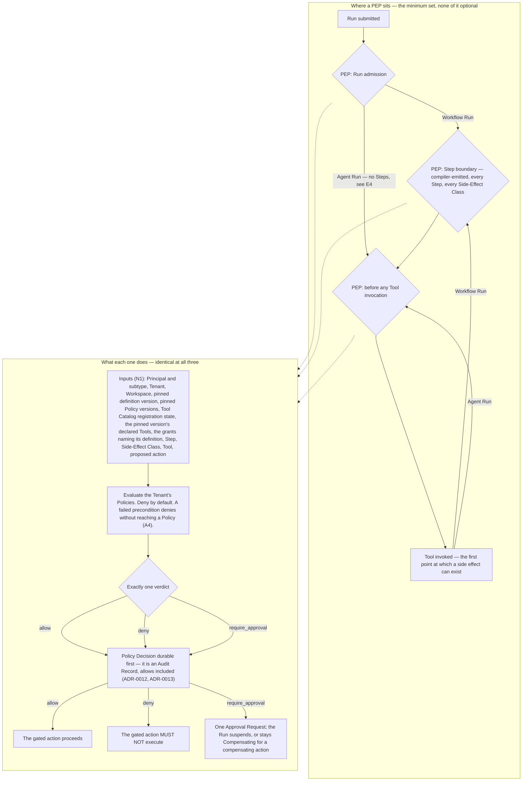

# Policy Model

**Normative.** Under [`../README.md`](../README.md) section 3, `40-governance/` is normative:
implementations MUST conform. Requirement keywords — MUST, MUST NOT, SHOULD, SHOULD NOT, MAY —
carry their [RFC 2119](https://www.rfc-editor.org/rfc/rfc2119) meanings.

[ADR-0003](../adr/adr-0003-governance-layer-positioning.md) makes Policy Enforcement Points the
architectural centre of the Data Plane and records that they require a normative specification.
This is that specification.

Orchestra is pre-implementation and pre-customer. Everything below is either derived from an
Accepted ADR or from a document this one links — [`../GLOSSARY.md`](../GLOSSARY.md),
[`../20-domain/domain-model.md`](../20-domain/domain-model.md),
[`../20-domain/lifecycle-state-machines.md`](../20-domain/lifecycle-state-machines.md),
[`../VERSIONING.md`](../VERSIONING.md) and
[`../00-overview/product-thesis.md`](../00-overview/product-thesis.md) — or it is marked unmade. The
distinction is the point of the document: a normative text that invents an undecided choice is worse
than one that leaves a gap, because the invention acquires an authority it was never given.
**No threshold, duration, retry count or retention period appears here. None has been chosen.**

Two **Proposed** decisions reach this document and are marked where they occur:
[ADR-0004](../adr/adr-0004-adopt-ag-ui-event-protocol.md), for how a Policy Decision reaches a
client, and [ADR-0007](../adr/adr-0007-outbound-connector-for-enterprise-reachability.md), for
whether Connector reachability is an evaluation input. Neither binds.

## 1. What a Policy is

A **Policy** is a tenant-authored rule evaluated at a Policy Enforcement Point, yielding `allow`,
`deny` or `require_approval` ([`../GLOSSARY.md`](../GLOSSARY.md)). Six rules follow from that
definition, from the domain model, and from
[ADR-0001](../adr/adr-0001-product-shape-multi-tenant-saas.md) and
[ADR-0012](../adr/adr-0012-policy-decisions-are-audit-records.md).

**P1 — A Policy is administered configuration, not code and not prompt text.** It is authored by a
Platform User through the Control Plane. A statement of intent embedded in an Agent's instructions
is not a Policy and MUST NOT be relied on as one. This is the distinction ADR-0003 draws between a
code-level interrupt and a rule set an administrator owns.

**P2 — A Policy is tenant-scoped.** It carries a mandatory Tenant reference and an optional
Workspace reference, and is subject to invariant I1: isolation is enforced by row-level security in
the datastore, not by application code
([ADR-0011](../adr/adr-0011-tenant-isolation-shared-schema-rls.md)). A Workspace scopes
administration and visibility, never isolation. A Policy MUST NOT be evaluated against another
Tenant's inputs, and every Policy Decision MUST carry `tenant_id`. An evaluation considers the
Tenant's Policies that name no Workspace together with those that name the evaluation's Workspace,
under the one precedence rule of D4, so a Workspace Policy can add a `deny` or a gate and MUST NOT
remove a Tenant's
([ADR-0035](../adr/adr-0035-cel-profile-for-policies-and-workflow-expressions.md)).

**P3 — The verdict set is closed.** Exactly three verdicts exist and an evaluation MUST yield
exactly one: never two, never none. There is no "warn", no "allow with conditions", no silent
pass-through. Adding a fourth is not the additive case [`../VERSIONING.md`](../VERSIONING.md) rule
R2 makes MINOR: the set is exhaustive and every consumer branches across all of it, so a new verdict
repurposes the enum rather than adding a value rule R3 lets a consumer ignore. It is a MAJOR
contract change, and it needs an ADR because it reaches every enforcement point, every consumer of a
Policy Decision and every audit report at once.

**P4 — A Policy Decision names every Policy version whose rules matched, with the verdict each
contributed.** The verdict comes from all of them and never from one chosen among them (D4), and
deny-by-default means *no Policy matched* is itself a decision with a record, not a missing record
— see section 5
([ADR-0035](../adr/adr-0035-cel-profile-for-policies-and-workflow-expressions.md)).

**P5 — A Policy is immutably versioned, and a Policy Decision references the version it
evaluated.** Policies are versioned on the same terms as Agent and Workflow definitions —
[`../VERSIONING.md`](../VERSIONING.md) sections 2 and 8, rules W1 to W4 — so a published version is
frozen and editing a Policy means publishing a new one
([ADR-0012](../adr/adr-0012-policy-decisions-are-audit-records.md)). A Policy Decision MUST
reference the matching Policy versions and MUST NOT embed the rule text. An audit that resolves a
decision against today's text reports a rule that may never have run; embedding the text instead
would carry rule content in every record at PEP volume. The cost ADR-0012 accepts is the resulting
join: a Policy version MUST be retained at least as long as any record referencing it. For its whole
life it is evaluated under the Expression Profile major it was published against (ADR-0035).

**P6 — A Run pins the Policy versions in force at admission, for its whole life.** Exactly as it
pins its definition version (domain model I3, [`../VERSIONING.md`](../VERSIONING.md) rules W2 and
W3) and for the same reason: editing a Policy MUST NOT change the verdict a Run in flight receives
([ADR-0012](../adr/adr-0012-policy-decisions-are-audit-records.md)). A Run suspended at an Approval
Request for days resumes under the Policy versions it was admitted under. The pin covers Policy
versions and nothing else, and was never meant to preserve a capability an administrator has
withdrawn: a revoked capability grant stops the next Tool invocation of a Run in flight, because a
revocation only narrows ([ADR-0042](../adr/adr-0042-declared-tools-and-capability-grants.md),
[`tool-authorization.md`](tool-authorization.md) TA22).

## 2. The three verdicts

| Verdict | Effect on execution | Raises | Recorded |
| --- | --- | --- | --- |
| `allow` | The gated action proceeds. | Nothing | A Policy Decision. Always. |
| `deny` | The gated action MUST NOT execute. | Nothing | A Policy Decision. |
| `require_approval` | The Run suspends at the gate, or stays `Compensating` where the gated action is a compensating action. | One Approval Request | A Policy Decision. |

Throughout, *the gated action* is the proposed action ([`../GLOSSARY.md`](../GLOSSARY.md)) seen from
the enforcement point that gates it. The two terms name one thing, not two.

**V1 — `deny` is refusal, not failure.** At Run admission it is terminal: the Run enters `Denied`
and no Step Execution ever occurs
([`../20-domain/lifecycle-state-machines.md`](../20-domain/lifecycle-state-machines.md) section 2).
At a Step boundary or before a Tool invocation the gated action MUST NOT be attempted — not
attempted and rolled back, not attempted and discarded. Denial precedes the side effect or it is not
denial. What a `deny` outside admission then does to the Run is fixed by
[ADR-0040](../adr/adr-0040-run-outcomes-for-refusal-and-compensation.md), and it is never recorded
as a fault:

- **At a Workflow Step** — its boundary, or the Tool enforcement point before the invocation a
  `tool` Step names — the Run MUST follow the refusal edge the Step declares. Otherwise it MUST end
  in `Denied`, recording the enforcement point and this Policy Decision, after compensating where
  compensation is due.
- **For a Tool invocation the model chose**, in an Agent Run or inside an `agent` Step, the refusal
  MUST be returned to the model as that invocation's outcome, and the Run continues. The refusal
  MUST NOT carry rule text or the matched Policy version's content
  ([`../30-protocol/gateway-api.md`](../30-protocol/gateway-api.md) G23). Every further call crosses
  the Tool enforcement point again (E4), and re-proposing the refused action is a new evaluation
  (E6).

A declared refusal edge is ordinary governed execution, and inherits none of the refused action's
authorization ([`approval-workflows.md`](approval-workflows.md) J2). A gate raised at either point
that is rejected or expires goes the same way (its J5). This rule holds on every path, because the
denied action is never attempted
([`../20-domain/lifecycle-state-machines.md`](../20-domain/lifecycle-state-machines.md) section
2.6).

**V2 — `require_approval` raises exactly one Approval Request**, carrying the proposed action, the
Evidence Set the Agent relied on, and an Approval Chain derived from Policy. Where several matching
rules return `require_approval`, that request's chain requires the chain of every one of them, and
none stands in for another (D4). The Run suspends — a compensating action's gate instead keeps it
`Compensating` ([ADR-0040](../adr/adr-0040-run-outcomes-for-refusal-and-compensation.md)) — and may
stay suspended for days. The Policy declares the chain and, optionally, a decision deadline. What
satisfies those chains, how one is reassigned and what expiry does are decided by
[ADR-0043](../adr/adr-0043-approval-chains-and-separation-of-duties.md), which
[`approval-workflows.md`](approval-workflows.md) states.

**V3 — An approval resolution does not retroactively change the verdict.** The verdict was
`require_approval` and the resolution is a separate governance fact with its own record and its own
acting Principals. An implementation MUST NOT rewrite the Policy Decision to `allow` when the
request is approved. Audit must distinguish an action permitted by rule from one permitted by a
human, and collapsing the two destroys the fact a reviewer came for.

**V4 — At the boundary of an `approval` Step the verdict set narrows to `require_approval` and
`deny`.** An implementation MUST NOT return `allow` there. The Step type declares that a gate belongs
at this point in the process; Policy decides the Approval Chain, the routing and the approvers, and
whether the action is refused outright — it does not decide whether the gate exists. A step type
whose gate a non-matching Policy silently removes is not a type, it is a comment, and an author who
placed it there would have no way to tell the difference until an audit. Where the narrowing leaves
a gate that no matching rule gives an Approval Chain, the request is refused at raise rather than
raised, because a gate with no position could never be satisfied
([ADR-0043](../adr/adr-0043-approval-chains-and-separation-of-duties.md),
[`approval-workflows.md`](approval-workflows.md) C10).

This is the only place the verdict set is narrowed, and it is narrowed in the conservative
direction: more gates, never fewer. The argument is set out in
[`../50-workflows/step-types.md`](../50-workflows/step-types.md) section 7, which cites this rule
rather than asserting it — a constraint on verdicts belongs to this document, and a rule stated only
in a non-normative section binds nothing.

## 3. Where Policy Enforcement Points sit

A **Policy Enforcement Point** is a place in the execution path, not a record
([`../20-domain/domain-model.md`](../20-domain/domain-model.md) section 6). The minimum set is fixed
by [`../GLOSSARY.md`](../GLOSSARY.md).

**E1 — A PEP MUST be evaluated at Run admission, at every Workflow Step boundary, and before any
Tool invocation.** That is a minimum, not a maximum. A later document may add enforcement points;
none of these three may be removed without superseding this section.

**E2 — Step-boundary enforcement is structural.** The compiler emits a Policy Enforcement Point at
every Step boundary, so governance cannot be bypassed by how a definition is written
([ADR-0005](../adr/adr-0005-langgraph-as-compilation-target.md),
[ADR-0008](../adr/adr-0008-declarative-workflow-definitions.md)). It follows that the definition
language MUST NOT contain any construct — flag, annotation, step type, escape hatch — by which an
author suppresses, skips or defers a PEP. Adding such a construct would reverse the load-bearing
argument for compilation and requires an ADR superseding ADR-0008, not a schema addition.

**E3 — Every Step is evaluated, whatever its Side-Effect Class.** The class is an input to the
Policy, not a precondition for evaluation: a `read` Step is evaluated and recorded exactly as a
`financial` Step is.
[`../00-overview/product-thesis.md`](../00-overview/product-thesis.md) section 3 states this as the
shape of the commitment and defers the normative wording here. Narrowing coverage by class fails
twice over: the platform could no longer answer what an Agent *read*, which is the first question a
data-protection review asks, and a declared class would become a self-issued exemption from the
control that reads it.

**E4 — The Tool PEP applies to Agent Runs, which have no Steps.** In an Agent Run the model chooses
the sequence at runtime, so no Step boundary exists and the Tool PEP is the only enforcement point
between admission and a side effect. It is not optional there. What the resulting Policy Decision
references is blocked on an open question in the domain model — a Tool call inside an Agent Run has
no Step Execution to key on — carried into section 9.

**E5 — Evaluation precedes the action, always.** A PEP is never a post-hoc check. Evaluation
completes, and its Policy Decision is durable, before the gated action is attempted
([ADR-0013](../adr/adr-0013-fail-closed-policy-decision-writes.md)); see D3.

**E6 — The action evaluated MUST be the action executed.** If the proposed action changes between
verdict and invocation — different arguments, different Tool, different Model Binding — the prior
verdict does not cover it and the enforcement point MUST be evaluated again. A decision governing a
different action than the one performed is not a control.

## 4. Evaluation inputs

**N1 — Every evaluation receives at least the following.** An implementation MUST supply them; a
Policy MAY match on any of them.

| Input | Grounding | Note |
| --- | --- | --- |
| Principal and its subtype | GLOSSARY, domain model I2 | Platform User, End User, Service Account, Platform Operator or Connector |
| Tenant | GLOSSARY, ADR-0001, ADR-0011 | Mandatory on every evaluation and every record |
| Workspace, where one applies | GLOSSARY, domain model section 3 | Administrative scope, never an isolation boundary |
| The Agent or Workflow, and the version the Run pinned | Domain model I3; ADR-0041 | The definition in force, not the current one. Inside an `agent` or `subworkflow` Step, also each version on the path from the Run's version to the one executing, as pinned at publication |
| The Policy versions the Run pinned at admission | ADR-0012, P6 | The versions in force at admission, never the current ones |
| The Step and its type, at a Step boundary | GLOSSARY, ADR-0008 | Absent in an Agent Run — see E4 |
| **Side-Effect Class** | GLOSSARY | A **primary** input; never a precondition for evaluation |
| The Tool | GLOSSARY | Present at the Tool PEP |
| The Tool schema major version the Run's definition version pins | VERSIONING W5 | Agent and Workflow versions both pin one for each Tool they declare; an origin that no longer serves it fails a precondition — see A4 |
| **Tool Catalog registration state** for that Tool | GLOSSARY, domain model I5 | Present at the Tool PEP. An input to the evaluation, never a gate in front of it — see A4 |
| **The Tools the pinned version declares, and the capability grants naming its definition** | GLOSSARY, domain model I5, ADR-0042 | Present at the Tool PEP, on the same terms. A grant counts only if it stood at admission and still stands — see A2 |
| The proposed action, including its arguments | GLOSSARY, ADR-0003 | The object of judgement — see section 7 |
| The enforcement point itself | E1 | Admission, Step boundary or Tool invocation |
| The Run | GLOSSARY | Every Policy Decision references it |

**N2 — An evaluation with no resolvable Principal MUST fail closed.** Domain model invariant I2
admits no unattributed action, and deny-by-default supplies the verdict: no path on which no
Principal resolves may be permitted through a PEP, because there is nothing to attribute the
permission to. Platform-operator work is not such a path. It resolves to a Platform Operator
Principal of the Tenant it acts in, and is evaluated as any other Principal's work is
([ADR-0030](../adr/adr-0030-platform-operator-and-observed-conditions.md)). Approval Request expiry
is not one either: it is a transition caused by an observed condition, not an act, and its record
carries its cause and no Principal ([`audit-model.md`](audit-model.md) section 9).

**N3 — Any input outside the table MUST be captured in the Policy Decision.** Wall-clock time,
aggregate state such as a running total within a Run or a period, and any value fetched during
evaluation are inputs like any other. If a Policy may depend on them, the values used MUST be
recorded, or the decision is not reconstructible and section 6 is violated. A Policy MAY depend on
aggregate state only through an aggregate the platform defines. The enforcing service reads it, and
reserves the proposed action's contribution, in the transaction that writes the Policy Decision, and
records the value it read as an input
([ADR-0035](../adr/adr-0035-cel-profile-for-policies-and-workflow-expressions.md),
[ADR-0034](../adr/adr-0034-policy-decisions-commit-with-the-gated-change-and-leave-by-outbox.md)).
Two concurrent evaluations of one aggregate therefore take turns, and neither decides on a total
that leaves out the other.

Whether Connector health or reachability is an input is **unmade** and rests on
[ADR-0007](../adr/adr-0007-outbound-connector-for-enterprise-reachability.md), **Proposed**. If it
becomes one, `Offline` says the transport failed, not that the far system declined the work; a
Policy reading it as the latter is wrong.

## 5. Deny by default

[ADR-0001](../adr/adr-0001-product-shape-multi-tenant-saas.md) requires a tenant-scoped,
deny-by-default authorization model before any Tool executes. Four rules follow.

**A1 — Absence of a permitting Policy MUST yield `deny`.** Nothing executes on the strength of no
rule having objected.

**A2 — Registration is not permission** (domain model I5). A Tool registered in the Tenant's Tool
Catalog, a capability grant to that Tool naming the Agent or Workflow the Run executes, and a PEP
verdict permitting this invocation are three separate controls, and all MUST hold. A capability
grant is not a verdict and MUST NOT be substituted for one; grants are specified in
[`tool-authorization.md`](tool-authorization.md). The grant satisfies only for a Tool the Run's
pinned version declares, and a Workflow holds grants on the same terms as an Agent: naming a Tool
in a `tool` Step declares it and grants nothing
([ADR-0042](../adr/adr-0042-declared-tools-and-capability-grants.md)).

**A3 — An evaluation that cannot complete MUST NOT return `allow`.** An unreachable policy store, a
malformed Policy, an evaluation error: none is a permission, and under
[ADR-0013](../adr/adr-0013-fail-closed-policy-decision-writes.md) the gated action MUST NOT proceed
where the Policy Decision cannot be made durable. What remains **unmade** is narrower and that ADR
does not reach it: whether a failure to evaluate is recorded as a `deny` or fails the Step Execution
as an error. The two differ in what the Run does next and in what the trail claims happened, and the
reliability model in [`../60-operations/`](../60-operations/) decides it with a later revision of
this document.

**A4 — A failed precondition is a `deny` that names no Policy.** Tool Catalog registration state,
the pinned version's declaration, the capability grants and the schema major the version pins reach
the enforcement point as evaluation inputs under N1, so a Tool that is unregistered, undeclared or
ungranted, or whose origin no longer serves the pinned major, does not bypass the evaluation — it
fails a precondition, and the evaluation yields `deny`. Because no Policy was reached, that Policy
Decision names none, which is the case P4
already admits and D2 already records as the explicit fact that none matched. A missing grant is
therefore an audited refusal carrying the basis on which it was refused, never a silent gap. The
alternative shape — short-circuiting to a refusal ahead of the enforcement point — produces the same
outcome for the caller and a different one for audit, which is why the rule is stated rather than
assumed. [`tool-authorization.md`](tool-authorization.md) cites it rather than restating the record
shape on its own account.

## 6. The Policy Decision

A **Policy Decision** is the recorded outcome of a PEP evaluation: every Policy version that
matched, the inputs, the verdict and the timestamp. **Always audited, including allows**
([`../GLOSSARY.md`](../GLOSSARY.md)). It **is a class of Audit Record**, not a separate record that
an Audit Record references
([ADR-0012](../adr/adr-0012-policy-decisions-are-audit-records.md)), so everything true of an Audit
Record — append-only, immutable, tenant-scoped, resolving to exactly one Principal — is true of it
and is not restated below.

**D1 — A Policy Decision MUST be written for every evaluation, whatever the verdict.** Recording
only refusals produces evidence that enforcement exists, not evidence of what happened. Audit must
answer *why was this permitted*, not only *what was refused* — the second question is asked after an
incident, the first at every security review and every dispute. Admission makes it concrete:
ADR-0009 meters Runs by outcome, and
[`../20-domain/lifecycle-state-machines.md`](../20-domain/lifecycle-state-machines.md) section 2.1
requires the admission decision to be audited whichever way it goes.

**D2 — A Policy Decision MUST carry** `tenant_id`, the Run, the enforcement point, the Principal,
the verdict, the timestamp, the inputs evaluated, every Policy version that matched with the verdict
each contributed, or the explicit fact that none did, and — at a Step boundary — the Step Execution
it gates. Append-onliness,
immutability and attribution to exactly one Principal are not requirements this rule adds; they hold
because it is an Audit Record (ADR-0012, domain model I2). Like every Audit Record it holds
identifiers and the values recorded at the time, not foreign keys a later deletion could null
(domain model section 6) — and, by P5, every Policy version it names MUST outlive it.

**D3 — The Policy Decision MUST be durable before the gated action is attempted**, and if it cannot
be written the action MUST NOT proceed
([ADR-0013](../adr/adr-0013-fail-closed-policy-decision-writes.md)). Otherwise a side effect can
exist with no record of the basis on which it was permitted, which is the condition audit exists to
exclude. Other Audit Records MAY be buffered or written behind the action on the terms that ADR
sets; a Policy Decision may not, and the classification is a property of the record class rather
than a runtime choice — an implementation MUST NOT downgrade a Policy Decision to the degradable
class under load. The cost is real and accepted knowingly: a durable write sits on the latency path
of every Step and every Tool invocation, in a system where the compiler emits a PEP at every Step
boundary.

**D4 — The same inputs MUST produce the same verdict.** Determinism is not a quality goal here; it
is what makes the trail mean anything. If the verdict is a function of the inputs, the record of the
inputs explains the outcome. If it is not, a reviewer is left with an assertion. Three consequences
follow, each a MUST:

1. **No model may sit in the evaluation path.** A model call is neither deterministic nor
   attributable to a rule. Section 7 reaches the same conclusion from the security side,
   independently.
2. **Every input must be recorded** — N3, restated from the other direction.
3. **Rule precedence must be specified before any Policy set may contain overlapping rules.** If two
   Policies match one action and precedence is undefined, the verdict is not a function of the
   inputs and D4 is unsatisfiable. Precedence is a prerequisite, not a later convenience, and it is
   order-independent: any `deny` wins; otherwise any `require_approval` wins, and every matching
   `require_approval` rule's chain is required (V2); otherwise the verdict is `allow`; and no
   matching rule is `deny` (A1). No authoring order affects it
   ([ADR-0035](../adr/adr-0035-cel-profile-for-policies-and-workflow-expressions.md)).

**D5 — Reconstruction MUST NOT require re-evaluation.** The record stands alone. Replaying an old
action against today's Policies may produce a different verdict; that is expected and is not a
defect. It is also why P5 exists.

Policy Decisions are not among the dimensions
[ADR-0009](../adr/adr-0009-meter-first-defer-tiering.md) meters, which counts Approvals raised and
resolved. This document adds no dimension; metering changes belong to ADR-0009.

## 7. Policy, not prompts, is the security boundary

A derivation from [ADR-0003](../adr/adr-0003-governance-layer-positioning.md) rather than a new
position.

**S1 — A Policy Decision MUST NOT be derivable, in whole or in part, from model output.** No
model-produced text is an input to the verdict as an assertion. The Agent's reasoning, its stated
confidence, its claim that an action is routine, safe, urgent or already approved: none carries
weight at a PEP.

**S2 — The proposed action is model-produced, and it is an input.** The distinction S1 turns on is
between judging content and believing it. A Policy MAY match on the arguments of a proposed Tool
call — a payee, an amount, a target record, a recipient — because those are the object of judgement.
A Policy MUST NOT treat model-produced content as an assertion about whether the action is
permitted. Arguments are evidence about *what is being attempted*, never testimony about *whether it
is allowed*. Where a rule discriminates on such an argument, an absent, malformed or unverifiable
value MUST NOT select the more permissive branch
([`threat-model.md`](threat-model.md) T1, which defers the wording here). For an absent or malformed
value the Expression Profile makes it so: an expression that raises an error does not make its rule
a non-match, and the evaluation has not completed, so A3 forbids `allow`
([ADR-0035](../adr/adr-0035-cel-profile-for-policies-and-workflow-expressions.md)). Whether a value
that is present and well formed but unverifiable is marked as such is the provenance question in
section 9. A restriction on what a Tool call may do, such as *refunds below a value* or *orders in a
region*, is written this way, as a rule on the arguments, and never as a condition on a capability
grant ([ADR-0042](../adr/adr-0042-declared-tools-and-capability-grants.md)).

**S3 — The Agent's justification is an input to a human approver's decision, never to the verdict.**
It reaches the approver in the Evidence Set attached to the Approval Request, so the human decides
on the same information the model had rather than on the model's summary of it
([`approval-workflows.md`](approval-workflows.md)).

**S4 — A Policy MUST NOT be implemented by instructing the model.** Instructions are advisory and
share a channel with attacker-controlled content. A Policy does neither.

Prompt injection is the case that makes this concrete, developed in
[`../00-overview/product-thesis.md`](../00-overview/product-thesis.md) section 3 and specified as a
threat in [`threat-model.md`](threat-model.md). A supplier invoice arrives as a PDF whose free-text
remittance field says the bank details have changed and the payment is urgent. The model has no
grounds for ranking that text below its own instructions: the attacker writes into the same
channel. The defence is that the decision is not the model's to make: the Step's Side-Effect Class
is `financial`, the PEP evaluates before execution, and if the Tenant's Policy requires a human
above a threshold the verdict is `require_approval` however persuasive the argument. No threshold
value appears here or anywhere in this repository. A threshold is a CEL predicate under the
Expression Profile, over the proposed action's arguments, or over a platform-defined aggregate for a
rate or a window (ADR-0035).

## 8. Why the language is an ADR, not a later document

Two entries stood in section 9 with their reason stated here, because the temptation was to fill
them in — a policy model with no policy language reads as incomplete, and an invention here would
have been cited as a decision by every document that followed.
[ADR-0035](../adr/adr-0035-cel-profile-for-policies-and-workflow-expressions.md) has taken both, and
the reasons stay because they are why it is an ADR.

**The policy language becomes a permanent public contract** the moment a customer authors against
it, carrying the versioning obligations
[ADR-0008](../adr/adr-0008-declarative-workflow-definitions.md) already accepts for the workflow
definition language. It constrains the compiler, the Control Plane authoring surface, the audit
representation, and the `policy-rule` schema slot reserved in
[`../VERSIONING.md`](../VERSIONING.md) section 6. Adopting an existing language, defining a
restricted declarative schema, and embedding a general-purpose expression evaluator are different
products with different failure modes, and the last puts arbitrary evaluation on the path of every
Step. ADR-0035 adopts the first: CEL, behind an Orchestra-versioned profile that bounds evaluation
cost and admits no user-defined function, so that it cannot become the last.

**Scope composition is a security property.** Whether a Workspace-scoped Policy may narrow a
Tenant-scoped one, whether it may widen one, and what happens when both match together decide
whether delegated administration can weaken a control the Tenant set. Workspace is explicitly not an
isolation boundary. ADR-0035 evaluates both scopes together under one precedence rule, so a
Workspace Policy can add a `deny` or a gate and never remove a Tenant's (P2).

A third entry stood here — Policy currency across a suspension — until
[ADR-0012](../adr/adr-0012-policy-decisions-are-audit-records.md) settled it for admission-time
pinning. P6 states the rule.

## 9. Open questions

Everything this document could not settle. **ADR** means the choice is costly to reverse or spans
components and MUST be recorded as an ADR before implementation. **Document** means a later
normative document suffices.

| Question | Needs | Decided by |
| --- | --- | --- |
| The Expression Profile's specification: the pinned CEL release, the inputs and their names, the functions and macros admitted, the cost measure and bound, and how an amount and a time are represented so that comparison is exact | Document | A specification in [`../30-protocol/`](../30-protocol/), under [ADR-0035](../adr/adr-0035-cel-profile-for-policies-and-workflow-expressions.md) |
| Which aggregates the platform defines, and when a reservation is released other than on an unknown outcome — a refusal, a rejected gate, a compensated action | Document | The Expression Profile's specification, with [`../50-workflows/execution-semantics.md`](../50-workflows/execution-semantics.md) section 6 |
| How a `require_approval` rule names its Approval Chain, and how one Approval Request records the chains of several matching rules, `approval-request.v1` carrying one chain with one mode | **ADR** | [`approval-workflows.md`](approval-workflows.md) section 5, with the decision on what satisfies a chain that its register marks **ADR** |
| How the Expression Profile is versioned, and where VERSIONING records it | Document | [`../VERSIONING.md`](../VERSIONING.md), with the profile's specification; ADR-0035 fixes that a published version keeps its profile major |
| Retention of Audit Records, Policy Decisions included | **ADR** | [`audit-model.md`](audit-model.md), adopting its classification. ADR-0012 makes this one question rather than two |
| Whether untrusted content carries provenance inside the model context | **ADR** if it reaches a public contract, else Document | Jointly with [`../30-protocol/`](../30-protocol/); assigned here by [`threat-model.md`](threat-model.md) section 14 |
| How a rule discriminating on a model-authored argument selects the restrictive branch on a value that is present and well formed but unverifiable — an absent or malformed value being settled by S2 under ADR-0035 | Document | With the provenance row above; assigned here by [`threat-model.md`](threat-model.md) section 14. See S2 |
| Whether the Step-boundary and Tool PEPs collapse into one evaluation for a `tool` Step | Document | A later revision of this document, with [`../50-workflows/`](../50-workflows/) |
| What a Policy Decision references for a Tool call inside an Agent Run | Document | `execution-semantics.md` in [`../50-workflows/`](../50-workflows/), or an ADR |
| What an evaluation failure records — a `deny`, or a Step Execution error | Document | Reliability model in [`../60-operations/`](../60-operations/). ADR-0013 already settles that the action MUST NOT proceed; only the record and the Run outcome are open |
| How a Policy Decision reaches a client | Document | [`../30-protocol/`](../30-protocol/); rests on ADR-0004, **Proposed** |
| Whether Connector reachability is an evaluation input | Document | Rests on ADR-0007, **Proposed** |

Five questions left this register together: the policy language, how thresholds are expressed,
rule precedence, scope composition and aggregate state. A language, a threshold syntax and a
precedence rule were three faces of a single choice, and settling any one alone would have
constrained the others invisibly, so
[ADR-0035](../adr/adr-0035-cel-profile-for-policies-and-workflow-expressions.md) takes all five.
Where evaluation executes waited on them and left with them: in process at each enforcing service
([`../10-architecture/data-plane.md`](../10-architecture/data-plane.md) section 5).

Three questions this document previously carried have been settled and are gone from the register.
[ADR-0040](../adr/adr-0040-run-outcomes-for-refusal-and-compensation.md) fixes what a `deny` outside
admission does to a Run, which V1 states.
[ADR-0012](../adr/adr-0012-policy-decisions-are-audit-records.md) fixes Policy versioning against
snapshotting into the decision record, and fixes admission-time pinning for a Run in flight; P5 and
P6 state both. [ADR-0013](../adr/adr-0013-fail-closed-policy-decision-writes.md) fixes what happens
when the record cannot be written, which D3 states and A3 now defers to.
[ADR-0042](../adr/adr-0042-declared-tools-and-capability-grants.md) settles two more: a restriction
on a call's arguments is a Policy rule (S2), and an Agent version pins the schema major of each
Tool it declares (N1). Where a classification
here differs from a sibling document's, the document that owns the subject is authoritative:
retention and actorless attribution are [`audit-model.md`](audit-model.md)'s, and this register
adopts its marking rather than restating a milder one.
