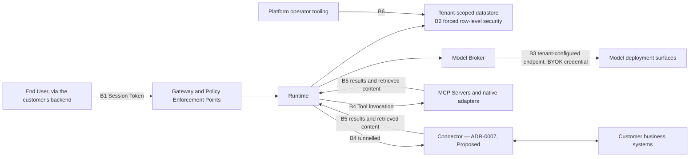

# Threat Model

[ADR-0003](../adr/adr-0003-governance-layer-positioning.md) makes this a required document rather
than an appendix, and names the threats it must answer: prompt injection, tool poisoning, confused
deputy, egress and SSRF. Four more are forced by the domain model and
[ADR-0011](../adr/adr-0011-tenant-isolation-shared-schema-rls.md): cross-tenant access, credential
compromise, connector compromise, and bypass of the approval control itself.

This section is **normative** ([`../README.md`](../README.md) section 3). MUST, MUST NOT, SHOULD,
SHOULD NOT and MAY carry their [RFC 2119](https://www.rfc-editor.org/rfc/rfc2119) meanings.

## 1. Scope, method and what is assumed

Orchestra is pre-implementation and pre-customer. No platform code exists and nobody outside the
project has reviewed any of this, so every control below is an obligation on a system that does not
exist, never a description of one that does. Section 4 states each threat's **asset** and
**adversary**; the section for each then gives the **attack**, the **controls**, and the **residual
risk** that remains once those controls work as intended.

**No threshold, timeout, retention period, rotation interval, retry count or rate limit appears in
this document.** None is decided anywhere in this repository, and naming one would manufacture a
decision. Likewise absent: CVSS scores, likelihood percentages, and any response commitment.

**Trusted by assumption** — if one fails, the control resting on it fails silently: the datastore's
row-level security implementation and the key management service behind encryption; the hosting
provider; and the tenant's identity provider together with the customer's backend, for asserting
End User identity. A Tool origin's own authorization is deliberately **not** in that set. What
identity the origin sees is undecided ([`tool-authorization.md`](tool-authorization.md) section 6),
so no control here may assume the origin can apply a per-user
check. Origin-side enforcement is depth, not the primary gate
(TA11), and no control below rests on it.

## 2. Trust boundaries

| Boundary | What crosses it | Why it is a boundary |
| --- | --- | --- |
| B1 | End User identity, asserted by the customer's backend, carried by a Session Token | Orchestra never authenticates the End User itself; it trusts the assertion |
| B2 | Every tenant-scoped row, inside one logical database | Isolation is enforced by the engine, not by application code (ADR-0011) |
| B3 | An outbound request to an endpoint a Platform User configured, carrying a BYOK credential | The destination is tenant-supplied input (ADR-0006) |
| B4 | A Tool invocation and its arguments, composed by a model | Arguments are model-authored; the callee is outside Orchestra |
| B5 | Tool results and retrieved content entering the model's context | **Unauthenticated by construction.** Nothing decides what an attacker may write here |
| B6 | Operator access for support, migration and cross-tenant aggregation | Legitimate and cross-tenant by design, and **unmade in both respects**. Whether operator work reaches a Policy Enforcement Point at all or only the datastore is undecided, and so is how it is attributed. The two are one decision: attribution is what an enforcement point would need, so answering either answers the other. [`audit-model.md`](audit-model.md) owns it and needs an ADR. Meanwhile [`policy-model.md`](policy-model.md) N2 blocks any such path through a PEP, because an unattributable permission has nothing to attribute to |

B5 is the boundary the rest of this document turns on: every other one has a credential, a policy or
an engine behind it, and B5 has bytes.

## 3. Cross-cutting controls

Controls referenced by more than one threat, stated once. Each is a derivation from an Accepted ADR,
[`../GLOSSARY.md`](../GLOSSARY.md) or
[`../20-domain/domain-model.md`](../20-domain/domain-model.md), not a new decision.

| ID | Control | Grounding |
| --- | --- | --- |
| C1 | Capability authorization is deny-by-default. Registration in the Tool Catalog grants nothing; an Agent version's permission to call a Tool is a separate, separately audited act. Both are inputs to the enforcement point rather than gates in front of it, and a failed precondition yields a recorded `deny` naming no Policy | Invariant I5, [`policy-model.md`](policy-model.md) A2 and A4, [`tool-authorization.md`](tool-authorization.md) TA6 |
| C2 | A Policy Enforcement Point is crossed at Run admission, before every Tool invocation, and at every Workflow Step boundary. The compiler emits the Step-boundary one, so no way of writing a definition omits it; admission and the Tool PEP sit on the platform path, which a definition cannot reach either | ADR-0005, ADR-0008, [`policy-model.md`](policy-model.md) E1–E4 |
| C3 | The Agent's justification, urgency claim and self-declared classification MUST NOT be policy inputs. Validated arguments are inputs — they are the object of judgement; the model's account of them is not | ADR-0003, [`policy-model.md`](policy-model.md) S1, S2 |
| C4 | Every Tool and Step declares a Side-Effect Class, and it is a primary policy input | GLOSSARY |
| C5 | Every tenant-scoped table carries a non-nullable tenant identifier; row-level security is enabled **and forced**; CI fails a table that lacks it | ADR-0011 |
| C6 | Credentials are custodied under envelope encryption with per-tenant data keys, held by reference, with no plaintext in any store, log, trace or backup | ADR-0002, ADR-0006 |
| C7 | Every Policy Decision is audited, allows included. A Policy Decision **is** a class of Audit Record, so append-only, immutable, tenant-scoped and attributable to exactly one Principal are true of it without restatement | ADR-0012, invariant I2, [`policy-model.md`](policy-model.md) D1 |
| C8 | Every Approval Request carries the Evidence Set the Agent relied on, so the human decides on the model's inputs and not its summary of them | GLOSSARY, [`approval-workflows.md`](approval-workflows.md) section 4 |
| C9 | A Policy Decision MUST be durable before the gated action is attempted; if it cannot be written the action MUST NOT proceed. Other Audit Records MAY degrade, provided the degraded period is recoverable from the trail rather than silent. Which side a record falls on is a property of its class, never a runtime choice | ADR-0013 |

## 4. Threat summary

The taxonomy is Orchestra's own; the general catalogues cover the same ground differently — the
[OWASP Top 10 for Large Language Model Applications](https://owasp.org/www-project-top-10-for-large-language-model-applications/)
and [MITRE ATLAS](https://atlas.mitre.org/).

| ID | Threat | Asset at risk | Adversary and capability | Primary control |
| --- | --- | --- | --- | --- |
| T1 | Prompt injection | Every capability the Agent holds without a gate, and the human approver behind any gate | Anyone who can place bytes into content an Agent reads — free text in a Tool result, document, record field or fetched page. No account or network position needed | C2, C3, C4 — policy the model cannot argue past |
| T2 | Tool poisoning | The basis on which the Agent selects a Tool, and the schema its arguments are validated against | Whoever controls the origin serving Tool metadata: a compromised MCP Server, a malicious third-party server registered in good faith, or write access to the registration | C1, plus registration-time capture of metadata |
| T3 | Confused deputy | The capabilities an Agent holds that the End User does not | An authenticated End User, or a holder of a stolen Session Token, who can send messages into a Conversation but cannot call the Tool directly | C1, plus policy discrimination on the calling Principal |
| T4 | Cross-tenant access | Every tenant-scoped record: definitions, Runs, Evidence Sets, Audit Records, credentials, meter records | A Principal of another Tenant issuing ordinary API requests with identifiers they should not be able to use — or no adversary at all, and an application defect | C5, and the CI check that enforces it |
| T5 | Credential compromise | BYOK model credentials, Tool origin credentials, enrolment credentials, Session Tokens | Anyone with read access to a log store, trace, backup, support export or a lower environment restored from production — through accident, or as an outsider who has obtained operator-level read access. The Orchestra insider acting deliberately is excluded in section 13 | C6, and no plaintext credential anywhere a person can read one |
| T6 | Egress and SSRF | Internal reachability of the data plane, what is reachable from it, and the credentials it carries | Any Platform User who can configure a Model Binding or register a Tool origin; one step removed, an injection influencing an argument that becomes a URL | Deny-by-default egress, validated at connection time — a posture this document takes, not one an ADR has |
| T7 | Connector compromise | A route from Orchestra's cloud into systems deliberately not internet-exposed | Four: Orchestra's release channel, the connector host, a stolen enrolment credential, and Orchestra's own control plane misused | Enrolment identity, local allow-listing, refused version skew |
| T8 | Approval fatigue and gate bypass | The approval control itself | None required — the tenant's own operational response suffices; an injection that raises many requests accelerates it | C7, C8, C9, and audited policy change |

## 5. T1 — Prompt injection

**Attack.** A supplier invoice arrives as a PDF whose remittance free-text field says the bank
details have changed and the payment is urgent. An Agent holding a payment Tool reads that as
ordinary context; no system prompt reliably survives it, because the attacker writes into the same
channel as the instruction and the model has no grounds for ranking the two, and the write may
precede the Run by months. Three variants matter as much. **Capability chaining:** the text has the
Agent call a permitted `read` Tool and place the result into the argument of a permitted
`external-communication` Tool — no single action is denied, and the composition is exfiltration.
**Approver-directed injection:** the Agent describes the action to the approver in terms that read
as routine, making the gate itself the delivery mechanism. **Surface injection:** the Agent emits a
UI Surface that misstates what is about to happen.

**Controls.**

- Better prompting is not a control. Delimiters, system-prompt hardening and instructions to ignore
  instructions in data MAY be used as defence in depth, but MUST NOT be relied upon or recorded as
  the mitigating control for any threat here.
- Every Step MUST cross a Policy Enforcement Point before it executes, whatever its Side-Effect
  Class (C2): the class is an input to the Policy, not a precondition for evaluation.
- A verdict MUST be a function only of the inputs [`policy-model.md`](policy-model.md) N1 requires
  and N3 makes recordable — among them the calling Principal and its subtype, the enforcement
  point, the pinned definition version, the registered Side-Effect Class and the validated
  arguments. That document owns the set and this one neither re-enumerates nor closes it; the entry
  this section would otherwise have dropped is the calling Principal, on which T3 depends.
  Model-produced content is judged as the object of the action and never believed as an assertion
  about permission (S1, S2, C3).
- Policy legitimately discriminates on model-authored arguments. Where a rule does, an absent,
  malformed or unverifiable value MUST NOT select the more permissive branch; how that is expressed
  is unmade, and [`policy-model.md`](policy-model.md) decides it.
- The approver decides on the Agent's inputs rather than its summary of them, with the Agent's own
  argument labelled as model-generated (C8, and rules E1 to E3 of
  [`approval-workflows.md`](approval-workflows.md)). Separating agent-authored text from content
  the Agent merely read is what this threat asks of the Evidence Set; the requirement belongs in
  the document that owns the set, and is stated there rather than here.
- A UI Surface MUST be validated server-side against the tenant's registered component catalog and
  MUST never be executable code; the renderer MUST NOT be the sole enforcement point
  ([ADR-0010](../adr/adr-0010-a2ui-genui-interchange.md), fourth validation finding — the
  requirement holds whichever interchange format that **Proposed** ADR selects).

**Residual risk.** Everything the Agent may do without a gate is available to an injection: the
residual is exactly the ungated capability set, which is what makes C1 and C4 load-bearing. A tenant
gating only `financial` and `destructive` has left chaining open, and the platform will have
enforced its policy correctly while the data leaves. Detection of injection is unsolved; no
classifier is proposed and none should be recorded as a control.

## 6. T2 — Tool poisoning

**Attack.** A `read`-classed Tool whose description instructs the model to call it before any other
and pass the full conversation as an argument. A description that renames a `financial` capability
in language that reads like a lookup. A schema that gains an optional free-text field the model
helpfully fills with context. Two Tools with confusable names. And the one with no answer yet:
metadata accurate at registration, changed on the server afterwards.

**Controls.**

- Registration is an administrative act by a Platform User, distinct from permission (C1), and MUST
  record the exact name, description and schema as presented at that moment, attributed to the
  registering Principal.
- The Side-Effect Class MUST be an Orchestra-side declaration bound at registration and MUST NOT be
  read from origin-supplied metadata at invocation time; a policy input the attacker supplies is not
  a policy input. Arguments MUST be validated against the registered schema, never one fetched
  during invocation.
- Divergence between registered metadata and what the origin now serves MUST be detected and MUST
  NOT be adopted silently. What follows — refuse, proceed against the registered record and alert,
  or require re-registration — is a precedence rule between registered and served metadata, and it
  is **not decided**. [`tool-authorization.md`](tool-authorization.md) TA9 owns it, and section 14
  names it. Detection of post-registration drift is a design nobody has done.
- Tool descriptions reach the model's context, so they are content under T1 and every T1 control
  applies to them.

**Residual risk.** The description remains the basis on which the model selects. These controls
bound the consequence of a wrong selection; they do not make the selection correct. A Tool honest at
registration that lies in its results is T1, and nothing here touches it.

## 7. T3 — Confused deputy

**Attack.** A support End User asks an Agent holding a refund Tool to issue a refund they have no
authority to approve, or asks a `read` Tool for a record their own role would not return. The
authority reaching the Tool is the Agent's, and the Agent has no native reason to check whose
request prompted it.

**Controls.** The grant model belongs to [`tool-authorization.md`](tool-authorization.md) and is not
restated here. Three requirements bear directly: Catalog registration state and the Agent version's
grant set are inputs to the enforcement point rather than gates in front of it, so a missing grant
is an audited refusal and never a silent gap (C1); every Tool invocation MUST record both the
acting Agent version and the Principal on whose behalf the Run executes (invariant I2, C7); and
Policy MUST be able to discriminate on that Principal, because a language that cannot express *this
Agent, for this class of requester* cannot express the deputy problem at all. That is an
expressiveness requirement on the policy language, not a claim that Orchestra knows what the caller
could have done unaided — what it knows of an End User's authority is itself open
([`tool-authorization.md`](tool-authorization.md) section 6). Whether Orchestra invokes with
the Agent's own authority or delegates the End User's identity so the origin applies its own
authorization is **not decided**: it spans identity, the connector and the Tool origin contract, and
grows expensive to reverse as origins depend on it, so it needs an ADR.

**Residual risk.** An Agent whose grant set exceeds what any single End User may do is a standing
confused-deputy surface, and a normal, intended configuration. Policy discrimination narrows it;
nothing removes it. Runs started by a schedule or a Service Account have no End User to discriminate
on at all.

## 8. T4 — Cross-tenant access

**Attack.** Enumerating another tenant's identifiers in a path or filter parameter. A query built
without a tenant predicate. A background job, cache key or object-storage path that carries the
record but not the tenant. A pooled connection carrying one request's tenant context into another's.
Migration tooling connecting as table owner. And the named failure mode: a new tenant-scoped table
shipped without a policy. ADR-0001 rates the consequence existential rather than serious.

**Controls.** From ADR-0011, restated normatively because they are this document's controls as much
as that ADR's decision.

- Every tenant-scoped table MUST carry a non-nullable tenant identifier, row-level security MUST be
  enabled **and forced** so ownership does not exempt, and the application MUST connect as a role
  that is neither superuser nor table owner (C5).
- The global Person is the one table of people without a tenant identifier
  ([ADR-0024](../adr/adr-0024-global-person-with-tenant-memberships.md)). It MUST still have
  row-level security enabled and forced, with a policy admitting a row only through the current
  Tenant's Membership. It MUST be written only through the linking functions, never by the
  application role, and its attributes MUST come only from the identity provider.
- Tenant context MUST be set per transaction, MUST be safe under connection pooling, and MUST be
  tested against the pooler in use rather than only a direct connection.
- CI MUST fail if a tenant-scoped table exists without row-level security enabled and forced. This
  is the load-bearing control; developer discipline is not one.
- A Workspace is **not** an isolation boundary, since row-level security is enforced on the Tenant,
  so a control that treats one as a security boundary is a defect.
- Any store outside that datastore (cache, queue, search index, object storage, log sink, event
  stream) MUST scope by tenant explicitly. Each is a gap the CI check does not cover, and the
  inventory of them does not yet exist.

**Residual risk.** Row-level security covers the datastore and nothing else: not derived stores, and
not a compromised application role, which by design reaches every tenant's rows subject to the
context it sets. Operator aggregation for metering and support bypasses per-tenant scoping by
construction (B6). The engine is PostgreSQL
([ADR-0021](../adr/adr-0021-postgresql-is-the-datastore.md)), chosen against the capabilities
[`../10-architecture/multi-tenancy.md`](../10-architecture/multi-tenancy.md) requires, which gives
every control above a concrete spelling.

## 9. T5 — Credential compromise

**Attack.** A provider error response echoing an Authorization header into a trace. A request log
capturing the header directly. A backup restored into a test environment. A support tool that
renders a credential to a screen. A tenant API key embedded in a browser bundle. Under ADR-0002 a
BYOK credential grants spend, and on some deployment surfaces data access, on the customer's own
provider account.

**Controls.**

- Credentials are custodied under KMS-backed envelope encryption with per-tenant data keys and held
  by reference; no plaintext credential is an attribute of any entity, in any store, log, trace or
  backup (C6).
- A credential MUST NOT be rendered in plaintext by any interface, support tool, export or error
  surface. That is C6 read as it stands — no plaintext in any store, log, trace or backup, and a
  screen is not an exception to it. Whether custody is additionally **write-only**, so that no
  read-back path exists for a tenant administrator, for support or for an Orchestra operator, is
  **not decided**: ADR-0002's own mitigation names audited access paths, which presupposes access
  that is audited rather than prohibited. Section 14 registers it.
- Error, telemetry and trace paths MUST redact provider responses that can echo credential material,
  and an Audit Record MUST reference a credential, never contain it.
- A Session Token is short-lived and narrowly scoped, minted at the request of the customer's
  backend. It MUST NOT be a tenant API key and MUST NOT be present in a browser or mobile bundle.
- Rotation and revocation MUST be possible without changing any definition, and both MUST be
  audited. Lifetimes, rotation intervals and key hierarchy depth are **not decided**.

**Residual risk.** Custody is itself the residual: BYOK does not reduce credential risk, it
concentrates it, moving a per-customer secret into a multi-tenant custodian. The runtime must use
these credentials by design, so any component able to invoke a model can obtain their use — where
this threat meets the exclusions in section 13.

## 10. T6 — Egress and SSRF

**Attack.** ADR-0006 requires a generic OpenAI-compatible base URL so tenants can reach an internal
gateway. **A customer-configurable endpoint is an SSRF primitive by construction**
([CWE-918](https://cwe.mitre.org/data/definitions/918.html)): the feature and the vulnerability are
one mechanism, and it cannot be designed away without removing the capability the segment
requires. Concretely: a base URL set to the cloud metadata address, harvesting
Orchestra's own instance credentials into a response the tenant reads; a base URL pointing at an
internal Orchestra service; a hostname resolving publicly at validation and privately at invocation;
a redirect from an allowed host to a private one; and the same against a Tool origin.

**Controls.**

- Egress MUST default to deny: the reachable set is an allow-list, not a block-list. This section
  is normative and this requirement is derived here, from the analysis above, rather than inherited:
  ADR-0001's deny-by-default governs authorization rather than network reachability. A
  customer-configurable endpoint is an SSRF primitive by construction, and a block-list cannot
  enumerate what it has not seen. The posture binds; its shape does not yet exist.
- Every outbound request made on tenant-supplied input MUST have its destination resolved and
  validated **at connection time**, not only at configuration time, and MUST be re-validated on
  every redirect. Cloud instance metadata endpoints MUST be unreachable from any component making
  tenant-configured outbound requests.
- A credential MUST NOT be attached to a request whose destination failed validation. SSRF and T5
  compose: an unvalidated base URL turns credential custody into credential delivery.
- Validation failure MUST surface as a loud, tenant-visible configuration error and MUST NOT fall
  back silently to a default endpoint. A response from a tenant-configured endpoint is untrusted
  content and is subject to T1.
- The **shape** of the allow-list is **not decided** — per tenant or platform-wide, hostnames or
  address ranges, in the application or by an egress proxy identity. The posture above is settled;
  only its shape is open. It spans the model broker, Tool invocation and the connector, so it needs
  one ADR covering all three rather than three local answers.

**Residual risk.** A customer's internal gateway is, by intent, an internal address, and Orchestra
cannot distinguish "the tenant's own gateway" from "an internal address this configurer should not
reach" by network property alone. That distinction is administrative — who may configure a Model
Binding — and rests on the tenant's own separation of duties.

## 11. T7 — Connector compromise

> **This section rests on a Proposed decision.**
> [ADR-0007](../adr/adr-0007-outbound-connector-for-enterprise-reachability.md) binds only after
> design-partner validation. If it is rejected this section is void, and the exposure moves to
> publicly exposed MCP endpoints with their own authentication story.

**Attack.** An enrolment credential replayed to stand up an attacker-controlled connector, which
then receives Tool traffic and its arguments. A compromised connector host returning fabricated Tool
results — a T1 injection channel with the highest credibility available anywhere in the system. A
connector reaching systems beyond the origins it proxies, because nothing restricts its egress on
the inside. And version skew: customer-side software cannot be force-upgraded, so a security fix can
go unapplied indefinitely.

**Controls.** ADR-0007 records connector security as its own threat model; these are its stated
follow-on requirements made normative.

- Enrolment MUST be an administrative act, credentials MUST be issued per installation, and
  revocation MUST be terminal for it. The tunnel MUST be mutually authenticated; the Connector is a
  Principal, so its traffic is attributable in the same audit trail as a human approval.
- The Connector MUST restrict what it can reach inside the network to the origins it is configured
  to proxy, and MUST enforce a local Tool allow-list. This is defence against a compromised
  Orchestra, not against the customer's own network.
- Local audit MUST be tamper-evident and releases MUST be signed. The protocol version MUST be
  negotiated at enrolment and on every reconnection; a version outside the supported window MUST be
  refused loudly and MUST NOT proxy traffic, because a silently degraded security boundary is worse
  than an offline one.
- Connector state MUST NOT be used to infer that a side effect did not occur. `Offline` says the
  transport failed, not that the far side declined the work.

**Residual risk.** ADR-0007 carries its own risk that the connector fails a customer's security
review — a threat-model outcome rather than a sales one, since the reviewer asks exactly the
questions in this section. The supported-version window, the upgrade policy, what a non-`Healthy`
connector does to a waiting Run, and whether local audit reconciles with the platform trail are
undecided.

## 12. T8 — Approval fatigue and gate bypass

**Attack.** A chain that gates every `write` raises more requests a day than anyone reads, and
approvers click through. Batching, standing approvals and automatic approval below a bound are the
same failure mechanised, and an attacker can aim at each. An approver decides on the Agent's summary
rather than the Evidence Set, at which point T1's persuasion has reached the human the gate existed
to protect. A Platform User relaxes a Policy under delivery pressure and the change is visible
nowhere an auditor looks. A request routes to an unavailable chain and a bypass path becomes
routine. Expiry resolves as approval.

**Controls.**

- Expiry MUST NOT resolve as approval. A deadline passing undecided MUST be an outcome distinct from
  a decision: "a human declined" and "nobody looked" are different facts about a control, and an
  audit that conflates them cannot report on it. Whether a deadline exists at all is **not decided**
  and needs an ADR — [`approval-workflows.md`](approval-workflows.md) section 7's classification,
  adopted here rather than restated.
- Every change to a Policy — which is what determines a chain — every chain amendment after raise,
  and every capability grant and revocation is an audited governance event attributable to exactly
  one Principal. The enumeration belongs to [`audit-model.md`](audit-model.md) section 3 and is not
  restated here; what this threat adds is that such a change MUST be visible in the same surface as
  the approvals it governs, because a control whose configuration changes unseen is not a control.
- A Policy is immutably versioned, and a Run pins the Policy versions in force at its admission for
  the life of the Run ([ADR-0012](../adr/adr-0012-policy-decisions-are-audit-records.md)). Relaxing
  a Policy under delivery pressure is therefore a publish, recorded like any other publish, and it
  cannot change the verdict a Run already in flight receives. The edit leaves a version trail
  instead of a changed rule.
- A gated action whose Policy Decision cannot be made durable MUST NOT proceed (C9). An unreachable
  audit store is not a bypass path; that audit availability bounds governed execution is the cost
  [ADR-0013](../adr/adr-0013-fail-closed-policy-decision-writes.md) accepts knowingly, and it is
  not to be worked around at the gate.
- Batching several requests into one decision, standing approvals, and automatic approval below a
  bound are **not adopted** ([`approval-workflows.md`](approval-workflows.md) section 10). Each
  removes the per-decision Evidence Set that makes C8 load-bearing, and a standing approval detaches
  the decision from the action it authorises altogether — an approval given before the Evidence Set
  exists cannot have been decided on it. Any of them needs an ADR before it needs a policy language;
  section 14 registers it.
- The approval surface presents the Evidence Set rather than only the proposed action and the
  Agent's justification, and presents it faithfully — rule E5 of
  [`approval-workflows.md`](approval-workflows.md), which owns the set (C8, T1). Approvals raised
  and resolved are metered
  ([ADR-0009](../adr/adr-0009-meter-first-defer-tiering.md)); those counts are the fatigue signal
  and SHOULD be reported to the tenant.
- Whether a break-glass path exists is **not decided**. If one is introduced it MUST be an
  attributable, audited governance event carrying a recorded justification, and it needs an ADR: a
  deliberate hole in the primary control is costly to reverse.
- Whether the Principal who caused a request may also decide it is **not decided**, and is
  registered rather than invented: an approval control that cannot express separation of duties
  fails the review it exists to pass. It needs an ADR, on the argument
  [`approval-workflows.md`](approval-workflows.md) section 6 makes: the default is a security
  posture rather than a preference, and changing it later silently changes what existing Policies
  mean.

**Residual risk.** Policy is tenant-authored by design, so a loosely configured control is loosely
enforced and the platform will faithfully record its own correct enforcement of a weak rule.
Orchestra can make configuration visible, audited and metered. It cannot make an approver read.

## 13. What is not modelled

Naming the exclusions is what separates a threat model from a list of worries. Each is a real risk
this document does not address, excluded deliberately rather than overlooked.

| Not modelled | Why | Where it belongs |
| --- | --- | --- |
| Denial of service and resource exhaustion, including noisy-neighbour effects | ADR-0011 provides no per-tenant resource isolation and says so; the controls are operational, and no scale figure exists to design against | [`../60-operations/`](../60-operations/) — reliability and quotas |
| Supply chain of Orchestra's own dependencies, build and release pipeline | ADR-0003 accepts dependence on rails Orchestra does not control; the only place it surfaces here is T7's signed-release requirement | A dedicated model, needed before a customer security review; not written |
| Insider threat at Orchestra — an employee or a compromised operator account, acting **deliberately** | Excluded deliberately, and uncomfortably: B6 is in the boundary table, the domain model has no Principal subtype for operator action, and invariant I2 admits no unattributed action. The distinction that keeps T5 honest: the controls in T5 and section 9 hold against accidental exposure through operator-reachable stores, and against an outsider who obtains operator-level read access. They are not written against an operator with intent | Attribution is registered in section 14; the adversary is not modelled |
| Physical and infrastructure security of the hosting provider | Assumed, per section 1 | The provider's attestations, and SOC 2 readiness under ADR-0001 |
| The security of the customer's systems behind a Tool, and of the model provider | Orchestra governs the call and does not vouch for the callee | The customer's own controls |

## 14. Open questions

"ADR required" means the choice is costly to reverse or spans components; "later document" means a
normative document in this set can decide it alone. Where another document owns a question, its
classification is the one repeated here.

| Question | Decided by | ADR required? |
| --- | --- | --- |
| Whether untrusted content carries provenance inside the model context, and whether that reaches the public event contract | [`policy-model.md`](policy-model.md), [`../30-protocol/`](../30-protocol/) | ADR if it changes a public contract |
| How a rule discriminating on a model-authored argument selects the restrictive branch on an unverifiable value | [`policy-model.md`](policy-model.md) | Later document |
| What happens when registered Tool metadata diverges from what the origin now serves — a precedence rule between registered and served metadata | [`tool-authorization.md`](tool-authorization.md), with the Tool registration specification in [`../10-architecture/`](../10-architecture/) | Later document |
| Whether a Tool is invoked with the Agent's authority or with a delegated End User identity | [`tool-authorization.md`](tool-authorization.md) | **ADR required** — spans identity, connector and the origin contract |
| Whether an immediately effective revocation path exists for a capability grant, and whether it overrides a Run's pinned version | [`tool-authorization.md`](tool-authorization.md), with the incident-response requirements this document does not carry | **ADR required** — that document's classification; it is what an incident response asks first |
| The shape and scope of the egress allow-list; the default-deny posture is settled normatively in section 10 and is not reopened here | Connector and model-broker designs in [`../10-architecture/`](../10-architecture/) | **ADR required** for the shape — it spans model broker, Tool invocation and connector |
| Which stores exist outside the row-level-secured datastore, and how each is tenant-scoped and CI-checked | `multi-tenancy.md` in [`../10-architecture/`](../10-architecture/) | Later document |
| How platform-operator action is attributed under invariant I2, and how operator cross-tenant access is authorised and audited | [`audit-model.md`](audit-model.md), with this document | **ADR required** — [`audit-model.md`](audit-model.md) section 13's classification; it changes the identity model and the audit contract |
| Whether per-tenant keys extend beyond credentials to data at rest | Left open by ADR-0011 | **ADR required** — key hierarchy and data model, expensive to reverse |
| Credential and Session Token lifetimes and rotation intervals | `identity-and-access.md` in [`../10-architecture/`](../10-architecture/) | Later document; a customer contract will force it first |
| Audit and Evidence Set retention periods, which bound how long any record relied on here can be produced | [`audit-model.md`](audit-model.md) | **ADR required** — that document's classification; it spans storage, erasure, the definition lifecycle and metering |
| Whether credential custody is write-only, or a read-back path exists on an audited access path | `identity-and-access.md` in [`../10-architecture/`](../10-architecture/), constrained by ADR-0002 and C6 | Later document |
| Whether a decision deadline exists at all, and whether a request may be re-raised after expiry | [`approval-workflows.md`](approval-workflows.md) | **ADR required** — that document's section 7 classification; it decides whether Orchestra makes any liveness promise about a suspended Run |
| Whether the Principal who caused a request may decide it, and whether one Principal may hold two chain positions | [`approval-workflows.md`](approval-workflows.md) | **ADR required** — that document's section 6 classification; a security posture, and deadlock reaches the Run state machine |
| Whether batching, standing approvals or automatic approval below a bound are ever permitted | This document's T8 analysis, which does not adopt them, then [`approval-workflows.md`](approval-workflows.md) section 10 and a policy-language decision | **ADR required** — a deliberate weakening of the primary control, on the same test as break-glass |
| Whether a break-glass path exists at all | [`approval-workflows.md`](approval-workflows.md), on this document's T8 analysis | **ADR required** — a deliberate hole in the primary control |
| Whether Connector local audit is exported and reconciled with the platform trail | [`audit-model.md`](audit-model.md), `connector.md` in [`../10-architecture/`](../10-architecture/) | Later document; void if ADR-0007 is rejected |
