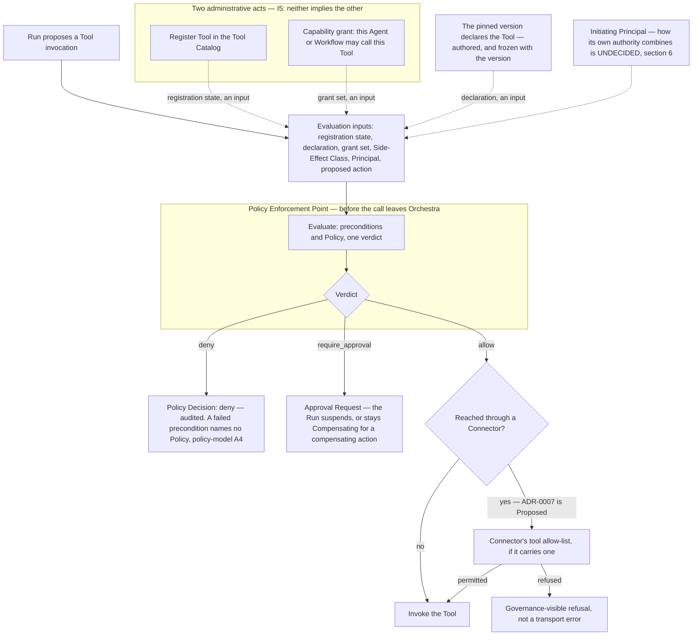

# Tool Authorization

**Normative.** This document fixes which Agent may invoke which Tool, and on whose behalf. It
composes with [`policy-model.md`](policy-model.md) rather than duplicating it: a capability grant
is an input to a Policy Enforcement Point, never a parallel mechanism that decides on its own. It
composes likewise with
[`../20-domain/lifecycle-state-machines.md`](../20-domain/lifecycle-state-machines.md), which owns
what a Run does after a verdict. Requirement keywords carry their
[RFC 2119](https://www.rfc-editor.org/rfc/rfc2119) meanings, and numbered rules are labelled
`TA1`–`TA26` so other documents can cite them.

Orchestra is pre-implementation and pre-customer. Everything below either follows from an Accepted
ADR, from [`../GLOSSARY.md`](../GLOSSARY.md), or from
[`../20-domain/domain-model.md`](../20-domain/domain-model.md), or is marked unmade and registered
in section 10. No grant syntax, threshold, retry count or retention period appears here, because
none has been decided. The term is **capability grant**, as the domain model names it and as
[`policy-model.md`](policy-model.md) rule A2 uses it; **grant** is its short form here and not a
second term. [`../GLOSSARY.md`](../GLOSSARY.md) defines it and records *grant* as its short form,
so the two cannot drift into synonyms.

## 1. Scope

**In scope.** The separation of registration from permission; deny-by-default; the Side-Effect
Class as a declared, non-negotiable input; where authorization is evaluated; the two authorities
that bear on an invocation; the enforcement points on the connector path; and what a version
declares, what a capability grant names, and how a grant is withdrawn.

**Out of scope, and where it lives.** The policy language and verdict semantics —
[`policy-model.md`](policy-model.md). Routing, delegation and escalation of a `require_approval`
verdict — [`approval-workflows.md`](approval-workflows.md). What is recorded and for how long —
[`audit-model.md`](audit-model.md). Prompt injection, tool poisoning, egress and SSRF —
[`threat-model.md`](threat-model.md). How a Principal authenticates — the unwritten
`identity-and-access.md` in [`../10-architecture/`](../10-architecture/).

## 2. Two relationships, two questions

Invariant **I5** of [`../20-domain/domain-model.md`](../20-domain/domain-model.md) states it: *a
Tool existing in a Tenant's Tool Catalog and an Agent or a Workflow being permitted to call it are
two relationships, created by two administrative acts and audited separately. Authorization is
deny-by-default: registration grants nothing, and neither does a version declaring the Tool.*
Collapsing them is the likeliest way to build a platform that believes it is governed and is not.

| Relationship | Question it answers | Administrative act |
| --- | --- | --- |
| Tool Catalog registers Tool | Does this capability exist and is it available for binding in this Tenant? | Registration by a Platform User, recording the Side-Effect Class and the origin |
| Agent or Workflow is permitted to call Tool | May its Runs invoke it, where the pinned version declares it? | A capability grant, a separate act with its own record |

**TA1.** Registration MUST NOT imply permission. An implementation in which registering a Tool
makes it callable by any Agent violates I5 and ADR-0001's requirement for a tenant-scoped,
deny-by-default authorization model before any tool executes.

**TA2.** A capability grant MUST name a Tool registered in the same Tenant's Tool Catalog, and a
grant MUST NOT be creatable against a Tool outside the granting Tenant. There is one Catalog per
Tenant and every record is tenant-scoped (I1,
[ADR-0011](../adr/adr-0011-tenant-isolation-shared-schema-rls.md)), which places isolation below
application code rather than in it. A cross-tenant grant is kept out of the datastore by a
row-level security write policy that requires the granted Tool to exist in the same Tenant, with no
foreign key constraint ([ADR-0023](../adr/adr-0023-no-foreign-key-constraints.md));
[`multi-tenancy.md`](../10-architecture/multi-tenancy.md) section 6 specifies it.

**TA3.** Each act MUST resolve to exactly one Principal (I2) and MUST be audited independently. A
trail showing that a Tool was registered but not who granted it answers half the question.

**TA4.** A Workspace is not an isolation boundary (domain model, section 3), and MUST NOT be
treated as a substitute for a grant in either direction: sharing a Workspace confers no
capability, and a Workspace boundary is not what stops one.

## 3. Deny by default

**TA5.** A Run of an Agent or a Workflow MUST NOT invoke a Tool for which no capability grant is
held; a definition holds exactly the capabilities granted to it, within the Tools its pinned version
declares (TA19), and no others. This is invariant I5 and
[ADR-0001](../adr/adr-0001-product-shape-multi-tenant-saas.md)'s deny-by-default precondition
stated over grants, as [`policy-model.md`](policy-model.md) rule A1 states the same posture over
Policies.

**TA6.** The absence of a matching capability grant MUST yield a recorded `deny` Policy Decision,
not a missing record. Catalog registration state, the pinned version's declaration and the
capability grants naming its definition are inputs to the enforcement point rather than gates in
front of it, so a failed precondition is decided there like any other outcome; the shape of the
record — a `deny` naming no Policy, because no Policy was
reached — is specified by [`policy-model.md`](policy-model.md) rule A4 and is not restated here.
*No grant matched* is an outcome, and a trail silent in that case cannot distinguish a refusal from
an invocation that never happened.

**TA7.** The grant set is closed at evaluation time. An Agent MUST NOT acquire a capability from
model output, Tool output, retrieved content, a UI Action, or an origin's own advertisement of
what it can do. This is [ADR-0003](../adr/adr-0003-governance-layer-positioning.md) applied to
authorization — policy, not prompts, is the security boundary — and one of the commitments
[`../00-overview/product-thesis.md`](../00-overview/product-thesis.md) section 3 defers here.

**TA8.** Reachability is not authority. Orchestra holding a credential for an origin, or a
Connector holding an open session to one, MUST NOT be read as permission to invoke anything
through it. The domain model keeps reachability on a third axis precisely so the two cannot merge.

## 4. The Side-Effect Class

Every Tool declares a Side-Effect Class — `read`, `write`, `destructive`, `financial`,
`external-communication` — and it is a primary input to Policy. It is an enumerated value, and
adding one is a contract change under [`../VERSIONING.md`](../VERSIONING.md) rules R2 and R3.

**TA9.** The class is declared at registration, and the value recorded in the Catalog is
authoritative at evaluation. It MUST NOT be supplied, overridden or influenced at invocation time
by model output, by the Run, or by the origin's advertised metadata. A Tool that could call itself
`read` on the call that mattered would make every rule keyed on the class advisory. The same holds
of the rest of the registered record: divergence between the name, description, schema and class
captured at registration and what the origin now serves MUST NOT be adopted silently
([`threat-model.md`](threat-model.md) T2). How such drift is detected, and what follows from
detecting it, is unmade and registered in section 10.

**TA10.** The Side-Effect Class MUST NOT be treated as a substitute for a capability grant, and a
grant MUST NOT be treated as a policy verdict ([`policy-model.md`](policy-model.md) rule A2). A
`read` Tool needs a grant like any other; a grant on a `financial` Tool does not authorize the
invocation, because the enforcement point still evaluates Policy and may return `require_approval`
or `deny`. The two are ordered, not alternatives.

An origin's MAJOR schema bump is settled for every version. Under
[`../VERSIONING.md`](../VERSIONING.md) rule W5 an Agent version and a Workflow version each pin the
*major* version of each Tool schema they declare, so a bump alters no published version, its
declaration or any grant, and surfaces as a control-plane warning; TA24 says what follows when an
origin stops serving a pinned major. A *registered* Tool's class changes only by re-registration,
and TA23 says what that does to the grants on it.

## 5. Where authorization is evaluated

A Policy Enforcement Point is a place in the execution path, not a record. One sits before any
Tool invocation ([`policy-model.md`](policy-model.md) rule E1), and the compiler emits it
structurally, so it cannot be bypassed by how a definition is written (rule E2). Neither rule is
restated here. What this document adds is where that evaluation may happen, and that the two
authorization preconditions reach it as inputs.

**TA11.** Authorization MUST be evaluated at a Policy Enforcement Point in Orchestra's Data Plane
([`../GLOSSARY.md`](../GLOSSARY.md)), before the invocation leaves the platform. The gate composed
of the grant and the Policy verdict MUST NOT be delegated to the client, to the Agent, or to the
Tool origin. An origin may enforce its own controls as well, and should; whether Orchestra may
*rely* on an origin's own per-caller check, or whether it is strictly defence in depth, is one of
the open questions in section 6 and is not decided by this rule.

**TA12.** Every evaluation that completes MUST produce a Policy Decision, recorded whether the
verdict is `allow`, `deny` or `require_approval`. That requirement is
[`policy-model.md`](policy-model.md) rule D1, cited rather than restated, and it holds because
recording only refusals yields evidence of enforcement rather than of what happened. What an
evaluation that cannot complete records is left open by rule A3. The record is durable before the
invocation is attempted: a Policy Decision is a class of Audit Record
([ADR-0012](../adr/adr-0012-policy-decisions-are-audit-records.md)) whose write is fail-closed
([ADR-0013](../adr/adr-0013-fail-closed-policy-decision-writes.md)), so an invocation whose
decision could not be written MUST NOT proceed.

Authorization is evaluated per invocation, whether or not that invocation has a Step Execution to
key on — the domain model records that a Tool call inside an Agent Run has none under the current
model, and marks it that document's most consequential gap. The enforcement point does not wait on
the answer; the record it writes does.

What a Run does after a `deny` is [`policy-model.md`](policy-model.md) rule V1's, and
[ADR-0040](../adr/adr-0040-run-outcomes-for-refusal-and-compensation.md) decides it past admission.
A `deny` at the Tool enforcement point of a `tool` Step follows that Step's refusal edge, or ends
the Run in `Denied`
([`../20-domain/lifecycle-state-machines.md`](../20-domain/lifecycle-state-machines.md) section
2.6). A `deny` of a call the model chose, in an Agent Run or inside an `agent` Step, returns to the
model as that invocation's outcome, and the Run continues; the next call crosses this enforcement
point again, and a missing grant refuses it again (TA6). A gate raised here that is rejected or
expires goes the same way ([`approval-workflows.md`](approval-workflows.md) J5).

## 6. On whose behalf — the confused deputy

[ADR-0003](../adr/adr-0003-governance-layer-positioning.md) names the confused deputy as requiring
threat modelling. The concrete case: an End User who may not issue a refund asks an Agent that
holds a grant on the refund Tool. If the grant alone decides, Orchestra has laundered authority
the End User never held, and every per-user control in the origin is bypassed by asking politely.

**TA13.** Policy MUST be able to discriminate on the initiating Principal and its subtype. A rule
language that cannot express *this Agent version, for this class of requester* cannot express the
deputy problem at all ([`threat-model.md`](threat-model.md) T3). This is a requirement on
expressiveness, which the platform can meet from inputs it holds; it is not a claim that Orchestra
knows what the caller could have done unaided, and it settles nothing about how the two
authorities combine.

A capability grant, within the Tools the pinned version declares, is a ceiling on what an Agent can
ever do. It is not a statement about
what this caller could have done alone, and it MUST NOT be recorded as the sole basis for an
invocation made on another Principal's behalf — a negative that follows from I5 without deciding
the combination rule. Whether authorization must additionally *weigh* the initiating Principal's
own authority is the open question below, not a requirement of this section, because what Orchestra
knows of that authority is itself undecided.

**TA14.** The initiating Principal MUST be an input available at the enforcement point and MUST be
recorded in the resulting Policy Decision ([`policy-model.md`](policy-model.md) rules N1 and D2).
By I2 there is always exactly one, so *no caller* is not a case to design for: a scheduled Run
resolves to a Service Account, and traffic arriving through the connector fabric resolves to the
Connector, a disjoint Principal subtype (domain model section 3). The deputy problem has the same
shape for every subtype — a Platform User or Service Account with narrow rights invoking an Agent
that holds a broad grant is the same laundering — so the End User above is the
illustration, not the boundary. Platform-operator action is no exception: it resolves to a Platform
Operator Principal of the Tenant it acts in, a disjoint subtype like the others, and crosses the
enforcement point as any other does
([ADR-0030](../adr/adr-0030-platform-operator-and-observed-conditions.md)).

**How the two authorities combine is a design choice nobody has made, and this document does not
make it.** Intersection is the intuitive answer and is not obviously right: an Agent whose purpose
is to perform, under approval, an action its caller cannot perform unaided is a legitimate and
probably common pattern. Three connected questions are open, and they are one decision rather than
three.

- What Orchestra knows of an End User's authority at all. It lives in the customer's systems, and
  Orchestra meets the End User through a Session Token the glossary calls *narrowly scoped*
  without saying what a scope contains.
- What identity the origin sees: Orchestra's own service identity, a delegated End User identity,
  or an exchanged on-behalf-of credential. This decides whether the origin can apply its per-user
  controls, and so whether the deputy problem is solved or merely described.
- Whether an origin's own check may be relied upon, or is strictly defence in depth.

The decision spans the Gateway, the Tool Catalog, credential custody, the connector path and
audit, and is expensive to reverse once tokens are minted one way. It needs an ADR, informed by
[`threat-model.md`](threat-model.md) and by a design partner.

## 7. Tools reached through a Connector

> **This section rests on a Proposed decision.**
> [ADR-0007](../adr/adr-0007-outbound-connector-for-enterprise-reachability.md) binds only after
> design-partner validation. If it is rejected, this section leaves the specification and Tools are
> reached only over direct HTTPS — nothing in sections 2 to 6 changes, which is the point of
> keeping reachability on an axis of its own.

ADR-0007 lists tool allow-listing at the connector among the controls its own threat model must
carry, and [`threat-model.md`](threat-model.md) T7 makes it normative: the Connector MUST enforce a
local Tool allow-list. That requirement is conditional on ADR-0007 binding and void with it, like
the rest of this section — but its existence is not in question while the ADR stands. Authorization
is therefore enforced twice on this path: at Orchestra's enforcement point, and at the customer's
connector. The duplication is deliberate rather than redundant, because the second enforcement is
the customer's own control and survives a compromise of the first.

**That would be deliberate, and it would not be redundancy.** The two lists sit in different trust
domains, are authored by different parties, and change under different control. The connector's
list would be the customer's last control if Orchestra's Control Plane is misconfigured or
compromised — precisely what a security review asks about, and not answerable by a control
Orchestra alone administers. Whether the list exists at all rides on ADR-0007 binding, and section
10 routes it to `connector.md` with the rest.

**TA15.** A decision MUST NOT vary by transport. ADR-0007 requires a direct HTTPS session and a
tunnelled one to be indistinguishable to everything above the transport, so the same grant and the
same Policy MUST produce the same verdict either way.

**TA16.** A refusal at the connector MUST surface as a governance-visible outcome rather than a
transport error. Reported as a transport failure it is indistinguishable from an outage, and the
trail then records a fault where a control operated.

**TA17.** A connector refusal MUST NOT be worked around by choosing another route to the same Tool.
Route-shopping past the second list is the one way the customer's last control can be undone from
inside Orchestra.

**TA18.** A connector refusal, or a tunnel drop mid-call, MUST NOT be retried blindly: the
invocation is in an unknown state, and unknown is not the same as not done. This is invariant I4
and [ADR-0008](../adr/adr-0008-declarative-workflow-definitions.md)'s prohibition on blind retry of
a side effect, applied to the connector path; idempotency, retry and compensation live at Step
Execution and not here.

How divergence between the two lists is detected, reported and reconciled is undecided, as is
whether Orchestra may read the connector's list at all; both belong to `connector.md` in
[`../10-architecture/`](../10-architecture/), after ADR-0007 binds.

## 8. Declared Tools and capability grants

[ADR-0042](../adr/adr-0042-declared-tools-and-capability-grants.md) fixes what a version declares,
what a capability grant names, how a grant is withdrawn, and where a restriction on a call belongs.
The rules below carry it.

**TA19.** A version MUST declare every Tool its Runs may invoke. An Agent version declares each Tool
it may call; a Workflow version declares a Tool by naming it, in a `tool` Step or in a compensating
action declared on one. The declaration is part of the version, frozen by publication
([`../VERSIONING.md`](../VERSIONING.md) rule W1) and pinned with it by every Run (invariant I3). It
is a ceiling: a Run MUST NOT invoke a Tool its pinned version does not declare, whatever is granted.
Declaring grants nothing, and naming a Tool in a `tool` Step is a declaration, never a grant.

**TA20.** A capability grant MUST name exactly one Agent or Workflow and exactly one Tool, both of
the granting Tenant (TA2), and nothing more. It names the definition, never a version, so a new
version needs no new grant for a Tool already granted. It carries no condition on an invocation: it
stands or it does not. The calls made inside an `agent` or `subworkflow` Step belong to the version
that Step delegates to, so that version's declaration bounds them and grants naming its definition
satisfy them.

**TA21.** A grant MUST be read at every Tool enforcement point, and MUST NOT widen a Run after its
admission. Every attempt reads the grant as it stands
([`../50-workflows/execution-semantics.md`](../50-workflows/execution-semantics.md) X12). A grant
satisfies only if it stood when the Run was admitted, still stands, and was given for the
Side-Effect Class the Tool is registered with now. Which grants stood is recorded when the Run is
admitted, and the enforcement point decides from that record, never by comparing clocks
([`policy-model.md`](policy-model.md) N3, [`audit-model.md`](audit-model.md) A7). An invocation
proceeds only when the Tool is registered, the pinned version declares it, a grant satisfies and the
origin still serves the schema major the version pins (TA24). A failure of any of them is a `deny`
naming no Policy ([`policy-model.md`](policy-model.md) A4), and Policy decides the rest.

**TA22.** Revoking a capability grant MUST take effect at the next Tool enforcement point, Runs in
flight included, and MUST NOT be refused or deferred because a Run holds a side effect it may yet
compensate. A Run suspended at an Approval Request resumes into an enforcement point that refuses
the call. The pin of [`policy-model.md`](policy-model.md) P6 does not preserve a capability an
administrator has withdrawn, because a revocation only narrows. Granting the Tool again makes a new
grant, under TA21. Compensation a revocation strands is recorded as `unresolved` in the Run's
compensation outcome (ADR-0040).

**TA23.** A registered Tool's Side-Effect Class MUST NOT change in place: a change is a
re-registration ([`../10-architecture/control-plane.md`](../10-architecture/control-plane.md)
section 10). A re-registration that changes the class MUST leave every existing grant on the Tool
retained and unsatisfiable, surfaced as a staleness warning on the definition holding it, which is
the shape [`../50-workflows/execution-semantics.md`](../50-workflows/execution-semantics.md) X30
gives grants on a de-registered Tool. A stale grant never satisfies again, even if the class changes
back, so the Tool must be granted again. A grant is consent to the Tool as it was classed.

**TA24.** An Agent version and a Workflow version MUST each pin the schema major of every Tool they
declare ([`../VERSIONING.md`](../VERSIONING.md) rule W5). A Tool's major bump surfaces as a
control-plane warning and MUST NOT alter a published version, its declaration or any grant. An
invocation whose pinned major the origin no longer serves is a `deny` naming no Policy, and the
remedy is a new version. How Orchestra learns what an origin serves is the drift detection TA9
leaves undesigned.

**TA25.** A restriction on what an invocation may do, such as *refunds below a value* or *orders in
a region*, MUST be a Policy rule on the proposed action's arguments
([`policy-model.md`](policy-model.md) S2), and MUST NOT be an attribute of a grant. Every such
restriction is then versioned and pinned like any Policy, and a refusal under one names the Policy
version that refused. How the rule is written waits on the policy language.

**TA26.** A Tool registration is Tenant-scoped. A Workspace MAY narrow which Tools an administrator
delegated to it may name in a capability grant, as
[`../10-architecture/identity-and-access.md`](../10-architecture/identity-and-access.md) section 8
derives. That constraint is checked when the grant is authored, and MUST NOT be evaluated at an
enforcement point (TA4).

**De-registration.** What happens to existing grants, and to Runs in flight, when a Tool is
removed from the Catalog is specified by
[`../50-workflows/execution-semantics.md`](../50-workflows/execution-semantics.md) X29 to X32.

## 9. Audit and metering

Every authorization decision is a Policy Decision, and a Policy Decision is a class of Audit Record
rather than a neighbour of one
([ADR-0012](../adr/adr-0012-policy-decisions-are-audit-records.md)). Everything
[`audit-model.md`](audit-model.md) requires of an Audit Record therefore holds of it without
restatement — append-only, immutable, tenant-scoped, one Principal, allows included — including
that it stays readable after the Tool, Agent version or Principal it names is deleted, which is
that document's rule A5. The matching Policy versions are referenced, not embedded, and a Run pins
the Policy versions in force at admission for its life, so editing a Policy never changes the
verdict a Run already in flight receives.

The write is fail-closed
([ADR-0013](../adr/adr-0013-fail-closed-policy-decision-writes.md)): a Policy Decision MUST be
durable before the gated invocation is attempted, and an invocation whose decision cannot be
written MUST NOT proceed. Other Audit Records may degrade — buffered, retried, written behind the
action — provided the degraded period is recoverable from the trail rather than silent, and the
classification is a property of the record class and MUST NOT be a runtime choice. Both
administrative acts in section 2 are audited separately (TA3).
[ADR-0009](../adr/adr-0009-meter-first-defer-tiering.md) meters Tool invocations by Tool and
Side-Effect Class; whether a refused invocation counts as one is undecided, and metering is not
retroactive, so settle it before the first Run.

## 10. Open questions

Every row is a decision this document could not make. The last column says whether it needs an
ADR, because it is costly to reverse or spans components, or whether a later document settles it.

| Question | What would decide it | ADR required? |
| --- | --- | --- |
| The syntax of a declaration and of a capability grant, their subjects being fixed by TA19 and TA20 | The Agent definition and capability grant schemas [`../30-protocol/gateway-api.md`](../30-protocol/gateway-api.md) section 8 lists, after the endpoint shape its section 9 registers | Later document |
| How the Agent's grant combines with the calling Principal's own authority | [`threat-model.md`](threat-model.md) plus design-partner validation | **ADR** |
| What identity the Tool origin sees — Orchestra service identity, delegated End User, or an exchanged credential | The same decision; it spans the Gateway, credential custody and the connector path | **ADR** |
| Whether a grant left unsatisfiable by de-registration satisfies again when the Tool is registered again, and whether a re-registration that changes the origin but not the Side-Effect Class leaves grants satisfying (TA23) | This document with [`../10-architecture/control-plane.md`](../10-architecture/control-plane.md) section 10, and [`threat-model.md`](threat-model.md) T2 for the origin half | Later document |
| How post-registration drift between the registered Tool record and what the origin now serves is detected, and what follows from detecting it (TA9) | This document with [`threat-model.md`](threat-model.md) T2, once a detection design exists | Later document |
| Divergence between the Connector's local allow-list and Orchestra's grants: detection, reporting, and whether Orchestra may read the list at all. Existence is settled by [`threat-model.md`](threat-model.md) T7 and precedence by TA17 | `connector.md` in [`../10-architecture/`](../10-architecture/), after ADR-0007 binds | Later document |
| Whether a refused invocation is metered as a Tool invocation | `quotas-and-metering.md` in [`../60-operations/`](../60-operations/) | Later document |
