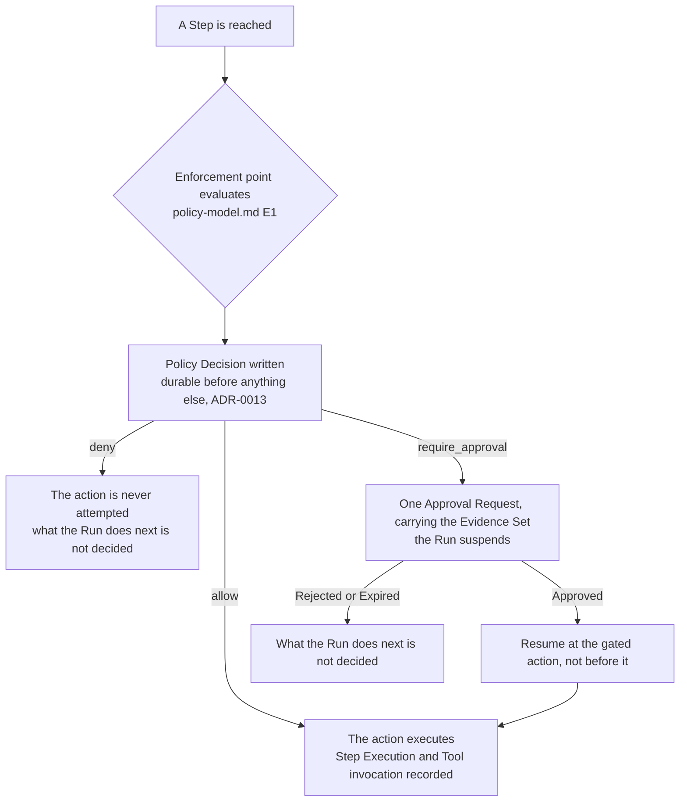

# Worked Examples

Three business processes, each walked through as a governed Run: what the author writes, where the
platform evaluates, what a human is shown, what the audit trail holds afterwards, and where the
specification stops.

They are governance walk-throughs, not a syntax reference. The definitions use the notation of
[`../workflow-dsl.md`](../workflow-dsl.md) section 3 and are bounded exactly as that section bounds
its own example: only the keys in its section 2 table are specified. The predicate syntax, the
`${…}` references, the input type notation, the branch labels and the shape of the `tool:` object
are illustration.
[`workflow-definition.v1.schema.json`](../../30-protocol/schemas/workflow-definition.v1.schema.json)
fixes the document shape and nothing more.

## The three

| Example | Process | What it shows |
| --- | --- | --- |
| [`invoice-payment.md`](invoice-payment.md) | Pay a supplier invoice | A gate raised by Policy rather than placed by the author, and a prompt injection defeated by the Evidence Set rather than by the prompt |
| [`purchase-approval.md`](purchase-approval.md) | Raise a purchase order | A gate the author places and Policy cannot remove, and compensation as a second governed action |
| [`shipment-exception.md`](shipment-exception.md) | Handle a delayed shipment | Concurrency that removes no enforcement point, a `wait` with no acting Principal, and a customer notification with no undo |

## Every Step, in one picture

Every trace below follows this path. What changes from example to example is which branch a Step
takes.

## How to read a trace

Each example carries a trace table with the same four columns.

| Column | Meaning |
| --- | --- |
| Boundary | Where an enforcement point is evaluated: Run admission, a Step boundary, or before a Tool invocation ([`policy-model.md`](../../40-governance/policy-model.md) E1) |
| What decides it | The inputs that matter in this case, out of the full set in N1 |
| Verdicts | Which of `allow`, `deny` and `require_approval` can arise. Only an `approval` Step narrows the set (V4) |
| Records | The Audit Records written, per [`audit-model.md`](../../40-governance/audit-model.md) section 3 |

Two things are true of every row, and the tables do not repeat them. Every evaluation writes a
Policy Decision, allows included (D1). And that Decision is durable before the action it gates is
attempted — if it cannot be written, the action does not proceed
([ADR-0013](../../adr/adr-0013-fail-closed-policy-decision-writes.md)).

A `tool` Step is evaluated twice under E1: at its Step boundary, and again before the invocation,
where the second evaluation also sees the Tool's registration state, the grant set and the
arguments. Whether the two collapse into one is unmade ([`../step-types.md`](../step-types.md)
section 6). The traces show both, and [`invoice-payment.md`](invoice-payment.md) shows why the
answer matters.

## Where the examples stop

Each example ends with the questions it runs into. Most are registered in the document that owns
them and are repeated so that a reader sees where the specification stops, rather than reading an
answer the example quietly chose. Four recur in all three:

- What a rejected or expired gate does to the Run —
  [`approval-workflows.md`](../../40-governance/approval-workflows.md) section 8, ADR required.
- The policy language. Every Policy below is written in prose because no syntax exists —
  [`policy-model.md`](../../40-governance/policy-model.md) section 8, ADR required.
- Whether the Principal who started a Run may approve its gate —
  [`approval-workflows.md`](../../40-governance/approval-workflows.md) section 6, ADR required.
- What satisfies an Approval Chain —
  [`approval-workflows.md`](../../40-governance/approval-workflows.md) section 5, ADR required.

Walking the processes through surfaced two questions nothing had registered. Both are registered in
the examples that found them: an approved payment re-raising its own gate, in
[`invoice-payment.md`](invoice-payment.md), and what an `approval` Step's request actually asks a
human to approve, in [`purchase-approval.md`](purchase-approval.md).

## The demonstration question

[`mvp-definition.md`](../../70-delivery/mvp-definition.md) registers what a demonstrable governed
action looks like to a buyer. [`invoice-payment.md`](invoice-payment.md) is the candidate. It is the
product thesis's own case, the one where better agent engineering cannot help, and what it shows —
an approver reading the supplier's words rather than the model's summary of them — is the part
[ADR-0015](../../adr/adr-0015-governed-action-positioning.md) says remains specific to Orchestra. It
is a candidate, not an answer; a design partner decides.
