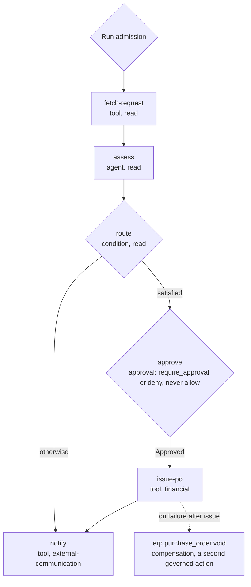

# Example: Purchase Approval

`purchase-approval@3`, the definition [`../workflow-dsl.md`](../workflow-dsl.md) section 3 uses as
its worked example, executed. That section shows the shape and is not repeated here; this document
shows what happens when it runs.

It is the counterpart to [`invoice-payment.md`](invoice-payment.md). There, Policy raised a gate the
author never asked for. Here, the author places the gate, and Policy cannot take it away.

## The process

A purchase request is fetched and an Agent assesses it. A `condition` routes it: requests that pass
go to an explicit approval and then to a purchase order; everything else goes straight to a
notification. The requester is told either way.

## The trace

| # | Boundary | What decides it | Verdicts | Records |
| --- | --- | --- | --- | --- |
| 1 | Run admission | The Principal — a Platform User submitting a request through the Control Plane; the pinned `purchase-approval@3` and Policy versions | Any | Run admission; Run enters `Running` |
| 2 | `fetch-request`, both evaluations | Class `read`; the Tool and its registration | Any; `allow` here | Step Execution; Tool invocation |
| 3 | `assess` Step boundary, then each Tool the Agent chooses | The delegation, then each call against the grant set | Any | Step Execution; Tool invocation per call |
| 4 | `route` Step boundary | Class `read`. The predicate itself is evaluated over data already in the Run, not by Policy | Any; `allow` here | Step Execution, with the branch taken |
| 5 | `approve` Step boundary | The Step's type — an `approval` boundary — and the Run's inputs | **`require_approval` or `deny` only** ([`policy-model.md`](../../40-governance/policy-model.md) V4) | Approval Request raise, with the chain derived from Policy; Run enters `Suspended`, reason approval |
| 6 | Not an evaluation — a human decision | The chain's Principals | `Approved` or `Rejected` | Each decision; the resolution |
| 7 | `issue-po` Step boundary, then before `erp.purchase_order.create` | Class `financial`; the proposed action and its arguments | Any — **including a second `require_approval`** | Step Execution; Tool invocation |
| 8 | `notify`, both evaluations | Class `external-communication` | Any | Step Execution; Tool invocation |

## The gate the author places

**Policy decides who approves. It does not decide whether anyone does.** At row 5 the verdict set
narrows to `require_approval` and `deny` (V4). No Policy — matching or not — can return `allow`
there, because a Step type whose gate a non-matching Policy silently removes is not a type, it is a
comment. Policy still owns everything else about the gate: the Approval Chain is derived from Policy
at raise time, never authored on the Step
([`approval-workflows.md`](../../40-governance/approval-workflows.md) C1), and a Policy may refuse
the purchase outright with `deny`.

**No threshold appears in the definition, and none may.** A threshold written into a definition is a
control the author moves by publishing a new version, not one an administrator owns
([`../workflow-dsl.md`](../workflow-dsl.md) section 3).

## Two gates, one purchase

Row 7 is evaluated like every other Step boundary (E1, E3). If the Tenant also has the threshold
Policy from [`invoice-payment.md`](invoice-payment.md), a purchase order above that threshold raises
a **second** Approval Request after the first was approved. Nothing in the specification makes an
approval at one Step satisfy a later Step's boundary.

That exposes a question the specification had not asked. An Approval Request carries its proposed
action as *the Tool or Step, its Side-Effect Class, and the arguments as they would execute*
([`approval-workflows.md`](../../40-governance/approval-workflows.md) section 3). At an `approval`
Step the gated action is the gate itself — class `read`, no Tool, no arguments. So the human at row
6 is asked to approve a Step that does nothing, while the purchase order they have in mind is the
next Step, whose arguments the request does not carry. What an `approval` Step's request should name
as its proposed action, and whether approving it covers `issue-po`, is registered below.

## Compensation is a second governed action

`issue-po` is `financial`, so it must declare compensation
([`execution-semantics.md`](../execution-semantics.md) X15): `erp.purchase_order.void`. It is not a
rollback. It is a new business action with its own Side-Effect Class, capability grant, enforcement
point, Audit Record and metered occurrence (X16). A void above a threshold can itself be gated — and
a governance platform should expect exactly that. If the void's outcome is unknown, it is not
retried blindly (X17), and a failed void does not trigger compensation of the void (X20).

## Open questions — where this example stops

| Question | Decided by | ADR required? |
| --- | --- | --- |
| What an Approval Request raised at an `approval` Step names as its proposed action — the gate, or the Step that follows — and whether approving it covers `issue-po` | [`approval-workflows.md`](../../40-governance/approval-workflows.md) section 3, with [`../step-types.md`](../step-types.md) section 7 | Not yet classified — **new here** |
| Whether an approval at one Step may satisfy a later Step's boundary for the same action, or a second request is correct | [`approval-workflows.md`](../../40-governance/approval-workflows.md), which owns everything after the raise | Not yet classified — **new here** |
| What a rejected gate does to the Run, and whether the language admits a rejection branch | [`approval-workflows.md`](../../40-governance/approval-workflows.md) section 8, jointly with [`../step-types.md`](../step-types.md) section 7 | **Yes** — repeated |
| Whether the requester may approve their own purchase | [`approval-workflows.md`](../../40-governance/approval-workflows.md) section 6 | **Yes** — repeated |
| If `notify` fails after the purchase order was issued, whether that failure compensates `issue-po` — voiding a valid order because an email bounced | [`../execution-semantics.md`](../execution-semantics.md) section 6, which owns what triggers compensation | Not yet classified — **new here** |
| The syntax of the `route` predicate, and what a predicate that cannot evaluate does to the Run | [`../workflow-dsl.md`](../workflow-dsl.md) section 8 and [`../step-types.md`](../step-types.md) section 13 | As classified there |
| Whether the `assess` Step pins `procurement-analyst@2` or resolves the Active version at run time | [`../workflow-dsl.md`](../workflow-dsl.md) section 11 | **Yes** — repeated |
