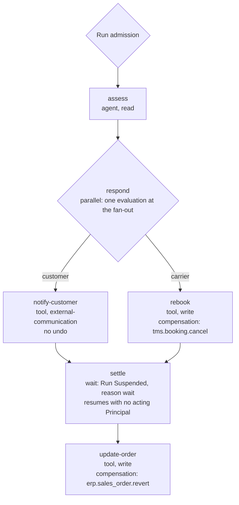

# Example: Shipment Exception

A carrier reports that a shipment will miss its delivery date. The Workflow assesses the delay, then
— at the same time — tells the customer and rebooks with a second carrier, waits for the new booking
to settle, and updates the sales order.

It is the example that exercises the parts of the language the other two do not: `parallel`, `wait`,
and a side effect that cannot be undone.

## The definition

```yaml
# shipment-exception@2 — published and frozen (VERSIONING W1). Notation per workflow-dsl.md §3.
name: shipment-exception
workspace: logistics
version: 2
inputs:
  shipment_id: { type: string, required: true }
entry: assess
steps:
  assess:
    type: agent
    side_effect_class: read
    agent: { name: delay-analyst, version: 1 }
    input: { shipment_id: "${inputs.shipment_id}" }
  respond:
    type: parallel
    side_effect_class: read
  notify-customer:
    type: tool
    side_effect_class: external-communication
    tool: { name: notify.email.send, schema_major: 1 }
    arguments:
      to: "${steps.assess.output.customer_email}"
      template: delay-notice
  rebook:
    type: tool
    side_effect_class: write
    tool: { name: tms.booking.create, schema_major: 3 }
    arguments:
      shipment_id: "${inputs.shipment_id}"
      carrier: "${steps.assess.output.alternate_carrier}"
    compensation:
      tool: { name: tms.booking.cancel, schema_major: 3 }
      arguments: { booking_id: "${steps.rebook.output.booking_id}" }
  settle:
    type: wait
    side_effect_class: read
    until: "<time condition — syntax undecided, see workflow-dsl.md section 8>"
  update-order:
    type: tool
    side_effect_class: write
    tool: { name: erp.sales_order.update, schema_major: 1 }
    arguments:
      shipment_id: "${inputs.shipment_id}"
      booking_id: "${steps.rebook.output.booking_id}"
    compensation:
      tool: { name: erp.sales_order.revert, schema_major: 1 }
      arguments: { shipment_id: "${inputs.shipment_id}" }
edges:
  - { from: assess, to: respond }
  - { from: respond, to: notify-customer, branch: customer }
  - { from: respond, to: rebook, branch: carrier }
  - { from: notify-customer, to: settle }
  - { from: rebook, to: settle }
  - { from: settle, to: update-order }
```

How two branches rejoin is shown here as two edges into `settle`. That is notation: what satisfies a
`parallel` join is unmade.



## The trace

| # | Boundary | What decides it | Verdicts | Records |
| --- | --- | --- | --- | --- |
| 1 | Run admission | The Principal — the Service Account the transport-management integration uses, triggered by the carrier's delay report; no Conversation | Any | Run admission; Run enters `Running` |
| 2 | `assess` Step boundary, then each Tool the Agent chooses | The delegation, then each call against the grant set | Any | Step Execution; Tool invocation per call |
| 3 | `respond` Step boundary — the fan-out | Class `read` | Any | Step Execution |
| 4a | `notify-customer`, both evaluations | Class `external-communication`; the recipient and template | Any | Step Execution; Tool invocation |
| 4b | `rebook`, both evaluations, concurrently with 4a | Class `write`; the carrier and shipment | Any | Step Execution; Tool invocation |
| 5 | `settle` Step boundary | Class `read` | Any | Step Execution; Run enters `Suspended`, reason wait |
| 5a | `settle` resumes | — resumption is not an enforcement point | None | The Run transition, with no acting Principal |
| 6 | `update-order`, both evaluations | Class `write`; the booking from `rebook` | Any | Step Execution; Tool invocation |

## Concurrency removes no enforcement point

The fan-out at row 3 is one evaluation, and then every Step inside every branch is evaluated as if
the branches were sequential ([`../step-types.md`](../step-types.md) section 9). E1 is per Step, not
per path: running two branches at once reduces the count of enforcement points by exactly zero.

## A message cannot be unsent

`rebook` is `write`, so it must declare compensation; `notify-customer` is `external-communication`,
and the mandate does not reach it ([`execution-semantics.md`](../execution-semantics.md) X15). There
is nothing to declare: a sent email has no undo.

That makes the order a design decision the author owns. Because the two branches run at the same
time, the customer can be told about a rebooking that then fails. If that matters, the author runs
`notify-customer` after `rebook` rather than beside it. The platform cannot make the message unsent,
and it does not pretend to — compensation compensates, it does not roll back (X16).

If `rebook` fails, what happens to `notify-customer` is unmade: cancel it, let it complete, or
compensate it ([`execution-semantics.md`](../execution-semantics.md) X19). Three things hold on any
answer. Cancelling a sibling mid-invocation turns a known failure into an unknown one. Compensation
across the two branches must not be presented or audited as ordered, because branches are not
ordered. And the join at `settle` must not be reported as satisfied while either branch holds a Step
Execution that has not reached a terminal outcome.

## A wait nobody ends

At row 5 the Run enters the same `Suspended` state an approval produces, with the reason recorded as
a wait ([`lifecycle-state-machines.md`](../../20-domain/lifecycle-state-machines.md) section 2.2).
Two things about it are uncomfortable, and neither is hidden.

**Its resumption has no acting Principal.** Nobody acts; time passes. Every audited action must
resolve to exactly one Principal, and this transition resolves to none. That is the attribution gap
[`audit-model.md`](../../40-governance/audit-model.md) section 9 owns and holds open, with a `wait`
elapsing named among its cases.

**It waits on time, not on the carrier.** What the process actually wants is to wait for the carrier
to confirm the new booking. Whether a `wait` may be released by an external signal is unmade, and
larger than it looks: ADR-0008's revisit criteria name complex event correlation as the demand that
would point to a dedicated process engine ([`../step-types.md`](../step-types.md) section 10). So
this definition waits a fixed time and then proceeds — and no maximum Run duration exists to bound a
condition that never becomes true.

## Open questions — where this example stops

| Question | Decided by | ADR required? |
| --- | --- | --- |
| What satisfies the join at `settle`, and what a failed `rebook` does to `notify-customer` | [`../execution-semantics.md`](../execution-semantics.md) section 6, assigned by [`../step-types.md`](../step-types.md) section 9 | As classified there |
| Whether an `external-communication` Step must declare a compensating action, and what one would mean | [`../execution-semantics.md`](../execution-semantics.md) section 6 | As classified there |
| How the resumption of `settle` is attributed, no Principal having acted | [`audit-model.md`](../../40-governance/audit-model.md) section 9 | As classified there |
| Whether a `wait` may be released by an external signal, such as the carrier's confirmation | [`../step-types.md`](../step-types.md) section 10 | As classified there |
| What bounds a wait whose condition never becomes true | [`lifecycle-state-machines.md`](../../20-domain/lifecycle-state-machines.md) section 2.4, which records that no maximum Run duration is decided | As classified there |
