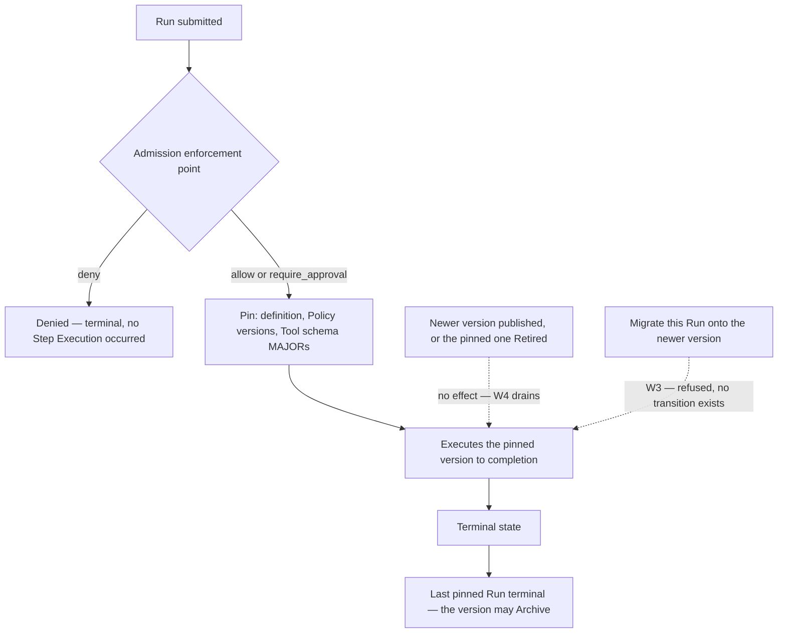

# Execution Semantics

How a Run behaves once it starts: what it pins, what may be attempted twice, what is undone when
something fails, and what a stop actually stops.

## 1. Standing

This section is **not normative** — per [`../README.md`](../README.md) section 3 only
[`../30-protocol/`](../30-protocol/) and [`../40-governance/`](../40-governance/) bind an
implementation. But the Workflow definition language is a permanent public contract
([ADR-0008](../adr/adr-0008-declarative-workflow-definitions.md)), and
[`../VERSIONING.md`](../VERSIONING.md) section 8 calls customer-authored workflows the most
dangerous versioning problem in the platform: W1 freezes a published version forever and R3 makes
the contract additive-only, so a loose sentence here becomes an obligation that cannot be
withdrawn. [RFC 2119](https://www.rfc-editor.org/rfc/rfc2119) keywords are therefore used at full
strength for the semantics this document owns; where a governance rule binds, this document
**links** to its owner rather than restating it. Rules are numbered **X1** onward —
[`../30-protocol/event-protocol.md`](../30-protocol/event-protocol.md) uses X1 to X4 for its
extension-namespace rules, so an X citation carries its document's name, as it must for the E rules
`policy-model.md` and `approval-workflows.md` both number.

**This document decides no number.** No timeout, retry count, backoff, attempt budget, step limit,
nesting depth, payload size or retention period is fixed here, and none is fixed in any document
this one depends on; [`../VERSIONING.md`](../VERSIONING.md) decides support and deprecation windows
and nothing else. No platform code exists: this is pre-implementation and pre-customer.

Two of the ADRs this document depends on are **Proposed** rather than Accepted, and are named here
rather than leaned on. [ADR-0004](../adr/adr-0004-adopt-ag-ui-event-protocol.md) carries the event
profile that section 6.1 hands a MAJOR-version decision.
[ADR-0007](../adr/adr-0007-outbound-connector-for-enterprise-reachability.md) supplies the
connector-shaped failure modes X9 uses as examples. The rules cited from the documents resting on
them — `event-protocol.md` rule C2, `tool-authorization.md` TA18 — are normative and bind
regardless; if the reachability model changes, X9's examples change and X9 does not.

## 2. Two units

[`../GLOSSARY.md`](../GLOSSARY.md) and invariant **I4** of
[`../20-domain/domain-model.md`](../20-domain/domain-model.md) fix it: **Step Execution is the unit
of idempotency, retry and compensation. Not the Run.** Every rule below applies that sentence, and
the failures this document exists to prevent violate it.

| Property | Run | Step Execution |
| --- | --- | --- |
| Definition version | Pinned at admission for life (I3, W2) | Inherits the Run's pin; holds none |
| Policy versions | Pinned at admission ([ADR-0012](../adr/adr-0012-policy-decisions-are-audit-records.md)) | Inherits |
| Idempotency key | **None. Ever.** | Exactly one, stable across attempts (X7) |
| Retry | **Never retried** | Only per X9 |
| Compensation | Declared on none; roll-up state only (X22) | The unit it is declared on and applies to |
| Metered | By outcome ([ADR-0009](../adr/adr-0009-meter-first-defer-tiering.md)) | By count |

**X1 — A Run is never retried.** Re-running work that ended means a **new** Run referencing the old
([`../20-domain/lifecycle-state-machines.md`](../20-domain/lifecycle-state-machines.md) section 1).
An implementation MUST NOT offer resume, rewind, replay-from-step or re-run-in-place on a Run,
terminal or not: each is the Run pretending to be the unit I4 says it is not.

## 3. Version pinning, and why migration is refused rather than solved

**X2 — A Run pins its Workflow or Agent version at admission and executes that version to
completion** (W2, invariant I3). The pin survives publication of a newer version and retirement of
the pinned one. So do the versions that version's `agent` and `subworkflow` Steps name, which were
pinned when it was published and execute inside the Run (W6,
[ADR-0041](../adr/adr-0041-nested-versions-execute-inside-the-parent-run.md)).

**X3 — In-flight executions are never migrated** (W3). An implementation MUST NOT provide any
operation, API, control-plane action, support procedure or migration tool that moves a Run in
flight onto another definition version. No such transition exists and none ever will. When a
customer asks, **the correct answer is to refuse.** Three reasons, each sufficient:

- **The input to a migration is a state no version can produce.** A Run suspended at step 6 of `@3`
  holds state `@3` produced; resuming it at `@4`'s step 7 asks what that step means given inputs
  `@4` never generated. Only a per-migration guess answers that, and the resulting failure is
  unreproducible by construction — `@3` no longer runs and `@4` never starts from there. This is
  the single most common source of catastrophic, unreproducible failure in workflow platforms, and
  W3 says so in those words.
- **It destroys the answer W4 exists to preserve.** Retirement retains a definition for the full
  audit-retention period so an audit can reconstruct the exact process a decision followed; a
  migrated Run followed no single process. Approvals sharpen this: a human approved a proposed
  action on an Evidence Set immutable since raise time
  ([`../40-governance/approval-workflows.md`](../40-governance/approval-workflows.md) rule E4), and
  migration reattaches that decision to a gate the approver never saw.
- **It destroys the one guarantee that prevents a repeated side effect.** A Run's Step Executions
  carry idempotency keys minted against the Steps of the version it pinned (X7). The target version
  declares different Steps, so no key on it identifies the work already attempted; the guard of
  section 4 then either reports done for work never taken or admits a second attempt at a side
  effect already taken. Migration cannot preserve it, and nothing weaker is worth preserving.

**X4 — Three things pin at one moment, and the Tool Catalog is not one of them.** A Run pins its
definition version, the Policy versions in force (ADR-0012), and — under W5, for Agent and Workflow
versions alike — the MAJOR version of each Tool schema the version declares. It does **not** pin
Catalog registration state: that reaches each enforcement point as an evaluation input
(`policy-model.md` rule N1), which is what makes section 9 possible. **Capability grants are not
pinned either, and they never widen a Run.** The Tools a version declares are part of the version
and pin with it, as a ceiling on what the Run can reach. The grants naming its definition are read
at every Tool enforcement point, where one satisfies only if it stood at the Run's admission and
still stands ([ADR-0042](../adr/adr-0042-declared-tools-and-capability-grants.md),
`tool-authorization.md` TA19 to TA24). A grant made after admission never reaches the Run, and a
revocation reaches it at the next attempt.

**X5 — Retirement drains, it does not kill** (W4). `Published → Retired` changes one thing:
admission stops pinning new Runs. Runs already pinned are untouched, and `Retired → Archived` is an
observed condition, not an administrative act.

### 3.1 Force-draining a Retired version

[`lifecycle-state-machines.md`](../20-domain/lifecycle-state-machines.md) section 4 and
[`control-plane.md`](../10-architecture/control-plane.md) section 5 register this and name this
document: a Run can suspend on an approval indefinitely, so a Retired version can stay undrainable
for an unbounded period.

**X6 — A force-drain is cancellation of every Run pinned to the version, and nothing else.** W3
forbids *migrating* an in-flight execution, not *ending* one, so the only available mechanism
already exists. A force-drain MUST decompose into individual cancellations: each Run transitions to
`Cancelled` on its own, is audited with the cancelling Principal and any Step Execution in flight
(lifecycle section 2.5), and is subject to section 7 in full, compensation included. It MUST NOT be
a bulk state write on the version and MUST NOT set `Archived` directly. Each constituent
cancellation MUST also record the version-level intent it was taken under, so that N stops
reconstruct as one act against one version rather than as N coincidences —
[`../40-governance/audit-model.md`](../40-governance/audit-model.md) rule A4 requires a record
sufficient to reconstruct the event, and *on what basis* is the part that decomposition would
otherwise lose.

**A force-drain reaches only the Runs pinned to the version it drains.** A version that another
version names through an `agent` or `subworkflow` Step cannot be archived until that version is
(W6, [ADR-0041](../adr/adr-0041-nested-versions-execute-inside-the-parent-run.md)), so draining it
ends in `Archived` only once each version naming it has been archived as well.

**A force-drain MUST NOT be paired with re-submission as one act.** X1 permits a new Run
referencing an ended one, and X6 permits ending Runs in bulk; composing the two into a
"drain `@3` and restart on `@4`" operation reassembles from permitted primitives exactly the
upgrade-running-instances feature W3 forbids, and hides it behind two clean audit trails. No
operation, control-plane action or support procedure may offer the pair. A Run submitted after a
force-drain is an ordinary new Run: it is admitted from the beginning, pins at its own admission,
and inherits no state, no Step Execution, no Evidence Set and no approval from the cancelled Run.
The reference X1 allows is an audit link and nothing more; carrying state across it is X3's hazard
with the evidence removed.

It sounds like housekeeping and is not: it inherits cancellation's limitation, so draining a
Retired version can leave real side effects unresolved and MUST NOT be presented as
version-lifecycle cleanup. Who may invoke it is settled by section 7's authorization rule; whether
it is offered as one control-plane operation is registered.

## 4. Idempotency is scoped to Step Execution — and there are two different keys

**X7 — A Step Execution's idempotency key is an attribute of that Step Execution, minted by
Orchestra**, stable across every attempt at it (X11), and distinct between two Step Executions of
the same Step — the domain model's cardinality admits more than one. That much is this document's.
That the key is neither caller-supplied nor a header, and that an implementation must not derive
one key from the other, map one onto the other, or write "the idempotency key" unqualified, is
[`gateway-api.md`](../30-protocol/gateway-api.md) rule G10, which binds. Section 1 says this
document links rather than restates, and a second copy of a normative prohibition is the way the
two drift.

**X8 — The distinction is load-bearing from inside a Run, not only at the API boundary.** The
table is the contribution: the two keys differ in layer, in who mints them, in how long they live
and in what a repeat of each prevents, and an implementation that holds one where it needs the
other fails in the concrete way below.

| | `Idempotency-Key` header | Step Execution idempotency key |
| --- | --- | --- |
| Layer | One HTTP request at the API boundary | One Step Execution inside a Run |
| Minted by | The caller | Orchestra |
| Lifetime | A retention window — none is decided (`gateway-api.md` section 9) | The Step Execution's, and its audit retention |
| On replay | The stored response returns; admission is not re-run (G11) | Not a replay — an attempt, governed by X9 |
| Prevents | A duplicate **Run** from a retried submission | A duplicate **side effect** from a repeated invocation |

The failure mode is concrete. A caller submits a Run, times out, retries under the same
`Idempotency-Key`: one Run exists (G11). Inside it a `financial` `tool` Step's invocation then
times out. An implementation reaching for the request key holds one key for the whole Run — the Run
was not duplicated, so the guard reports "already done" and the payment is skipped; mapped the
other way, it is attempted twice under a key that never identified it.

**X9 — What may be attempted again.** Three positions relative to a side effect; only the first is
retryable:

| Position | Example | Permitted response |
| --- | --- | --- |
| The attempt provably never left Orchestra | An enforcement point denied it; a model call failed inside the plane; a connector observed unreachable before the invocation was dispatched (`reliability.md` F20) | Retry, where the owning component holds retry — the Model Broker does, Tool Invocation does not ([`data-plane.md`](../10-architecture/data-plane.md) section 9) |
| It left Orchestra and the outcome is unknown | A timeout, a dropped tunnel, a connector refusal (`tool-authorization.md` TA18) | **No retry.** Unknown is not the same as not done |
| It completed and something later failed | A payment succeeded, the next Step Execution failed | Compensation (section 6), never retry |

An implementation MUST NOT infer position one from a transport signal: `Offline` says the transport
failed, not that the far side declined the work (lifecycle section 5.2). Retry counts, backoff and
any bound on attempts belong to `reliability.md` in [`../60-operations/`](../60-operations/), and
none of them is fixed here.

**X10 — Presenting an idempotency key to an origin is not authority to retry.** Whether an origin
honours a key is a property of the origin, and the registered Tool record — name, description,
schema, Side-Effect Class, origin (`tool-authorization.md` TA9) — does not carry it. Until it does,
position two admits no exception.

**X11 — A retry is another attempt at the same Step Execution, not a new one.** A new Step
Execution would carry a new idempotency key (X7), and the mechanism preventing a duplicate side
effect would prevent nothing; ADR-0009 meters Step Executions, so counting attempts would bill a
flaky origin as extra work. Attempts are an attribute of the Step Execution, each individually
audited.

**X12 — Every attempt crosses the enforcement point again.** `policy-model.md` rule E5 puts
evaluation before *the action* and each attempt is an action; ADR-0013 requires the decision
durable first. The cost is that *n* attempts write *n* Policy Decisions; the benefit is what
section 9 depends on — a Tool de-registered between attempts stops the second one, Catalog
registration state being an evaluation input rather than something the Run pinned (X4). A
*withdrawn grant* bites the same way: a capability grant revoked between attempts stops the second
one, and so does a grant left stale by a change of the Tool's Side-Effect Class
([ADR-0042](../adr/adr-0042-declared-tools-and-capability-grants.md)). Policy itself cannot change
under a Run in flight, which pinned its Policy versions at admission.

## 5. The grain of a Tool call inside an Agent Run

[`domain-model.md`](../20-domain/domain-model.md) section 4 calls this the most consequential gap
in that document; `policy-model.md` rule E4 and
[`audit-model.md`](../40-governance/audit-model.md) section 7 both wait on it. Start from what is
already fixed and not this document's to move: **an Agent Run has no Steps.**
[`../GLOSSARY.md`](../GLOSSARY.md) defines a Step as one node in a Workflow, and `policy-model.md`
rule E4 states it normatively — the model chooses the sequence at runtime, so no Step boundary
exists. It follows
that an Agent Run has no Step boundaries and no Step Executions, and that a Tool call in one has
nothing to key on. Compensation, idempotency and metering are exact for Workflow Runs and undefined
for Agent Runs.

**X13 — A Tool invocation in an Agent Run is governed by the Tool enforcement point, and is the
anchor for idempotency and for compensation without being a Step.** Two halves, each already
carried by a rule this document only applies:

- **Enforcement.** `policy-model.md` rule E4 makes the Tool PEP the only control between admission
  and a side effect in an Agent Run, and says it is not optional there. Nothing here narrows
  anything: E2 and E3 range over Steps and stand unqualified, an Agent Run simply has none for them
  to range over, and the invocation is covered by the Tool PEP instead. An informative document
  does not carve an exception out of a normative one, and this one does not.
- **Idempotency and compensation.** CLAUDE.md working rule 6 holds wherever a side effect is taken:
  a partially executed Tool call is never blindly retried. Section 4's three positions and section
  6's compensation rules therefore apply to a model-chosen invocation exactly as they apply to one
  a Workflow declared, and the invocation is what they attach to.

**What that anchor is called is not this document's to name.** Naming it means either giving an
existing domain term a second meaning or adding an entity, and the entity model belongs to
[`domain-model.md`](../20-domain/domain-model.md), whose section 11 carries the question and which
`policy-model.md` rule E4 cites for exactly that reason. That register assigns this document the
part execution semantics can answer, and X13 answers it: what governs such an invocation, and what
it anchors. What it cannot answer without minting a term it does not own is what the term is, so
section 11 below carries that residual back with the classification unchanged.

Until it is named, three things stay undefined together, and they are one gap seen from three
documents: what the Policy Decision for such an invocation references (`policy-model.md` rule E4),
what the audit grain is (`audit-model.md` section 7), and what ADR-0009 meters. None of the three
can be applied retroactively, which is an argument for naming it early and not an argument for
naming it here.

**Where the declaration lives, and where the same hole used to reappear.** A compensating action was
declared on a Step (I4), and an Agent Run has no Step to carry one.
[ADR-0046](../adr/adr-0046-compensation-is-declared-on-the-tool-registration.md) puts the
declaration on the Tool's Catalog registration: a Tool whose class is `write`, `destructive` or
`financial` names its compensating Tool and an argument mapping when it is registered, or records
that it has none. The pairing is a property of the capability, so it covers a model-chosen
invocation in an Agent Run, and one inside an `agent` Step, exactly as it covers a `tool` Step's —
which is what X15 required and nothing supplied. The hole used to reappear inside a Workflow Run:
an `agent` Step *is* a Step, with its own Step Execution and its own boundary evaluation, but
[`step-types.md`](step-types.md) section 5 fixes that a definition constrains the delegation and
not the order, count or arguments of the calls the model makes, so a model-chosen invocation inside
it had no declaration of its own either. It now has the registered one. What is still unnamed is
the invocation itself, and section 11 carries that where the domain model registered it. Which
invocations
are reachable at all is bounded by the Tools the Agent version declares, each still needing a
capability grant naming the Agent that stood at the Run's admission and still stands
([ADR-0042](../adr/adr-0042-declared-tools-and-capability-grants.md)).

## 6. Compensation

**X14 — The unit is settled and is the Step Execution.** ADR-0008 follow-on 2 requires that failure
after a side-effecting step triggers declared compensating actions and never a blind retry; I4 puts
compensation at the Step Execution. Nothing below moves it to the Run.

**X15 — A compensating action MUST exist for every `write`, `destructive` and `financial` effect** —
ADR-0008's mitigation, now exact at both grains. For a `tool` Step it is the action the Step declares
under X21, or, where the Step declares none, the one the Tool's registration names
([ADR-0046](../adr/adr-0046-compensation-is-declared-on-the-tool-registration.md)); a Step whose Tool
is registered with no compensating action and which declares none of its own is rejected at
publication. For a Tool invocation the model chooses, which no Step declares, it is the registered
one. Both soft edges the rule used to carry are now closed.

- **The type edge.** Only a `tool` Step carries one of the three classes at all, the compiler
  deriving every Step's class
  ([ADR-0045](../adr/adr-0045-the-compiler-derives-a-steps-side-effect-class.md)): `condition`,
  `transform`, `wait`, `approval` and `parallel` carry `read`, and an `agent` or `subworkflow` Step
  carries the set its delegation can reach and declares no compensating action — the effects its
  delegation takes are compensated at the Tools that take them.
- **The `external-communication` edge.** The mandate does **not** reach that class and no compensating
  action is mandated for it. A sent message has no undo. A follow-up action — a correction, a
  retraction notice — MAY be declared or registered, and it is never presented as an undo. Where a
  Run needed such a message unsent, the effect is recorded `unresolved` in the Run's compensation
  outcome (ADR-0040), which is the honest record and is better than a mandated action that pretends
  to reverse it.

**X16 — Compensation compensates; it does not roll back.** A compensating action is a new business
action with its own Side-Effect Class, capability grant (`tool-authorization.md` TA5), enforcement
point (`policy-model.md` rule E1), Audit Record and metered occurrence. Calling it a rollback
invites the assumption that it always succeeds, and that assumption is wrong: a compensating action
can be denied by Policy or gated by `require_approval` — a refund above a threshold is exactly the
case a governance platform should expect.

**X17 — Compensation is itself a side effect and is subject to X9.** A compensating action whose
outcome is unknown MUST NOT be retried blindly, on the same terms as the action it compensates.

**X18 — Compensation proceeds in reverse order of completion**, because a later Step Execution may
depend on an earlier one's effect and undoing the earlier first can leave the later effect
referencing something gone. No ADR decides this; the derivation is the dependency and nothing more.

**X19 — Reverse order is defined within a branch, not across branches.** A branch is totally
ordered; the branches of a `parallel` Step are not ([`step-types.md`](step-types.md) section 9), so
compensation across them MUST NOT be presented or audited as ordered, and each compensating action
is separately audited against the Step Execution it compensates. What a branch failure does to its
*siblings* — cancel them, let them complete, or compensate them — is assigned here by that
document's section 9, together with what satisfies the join, and neither is **decided**. Three
constraints hold on any answer. Cancelling a sibling mid-invocation converts a known failure into
an unknown one (X26). A sibling side effect already taken is compensated on X28's terms rather than
abandoned. And a join MUST NOT be reported as satisfied while any branch still holds a Step
Execution that has not reached a terminal outcome, an unknown-state invocation included — otherwise
*within a branch* in this rule names an interval that has not closed, and reverse order is
undefined over it.

**X20 — Compensation MUST NOT recurse.** A failed compensating action MUST NOT trigger compensation
of the compensating action: there is no bottom to that recursion and no number here bounds it.

**X21 — A compensation declaration attaches to the Step it compensates and is not itself a Step.**
It carries no Step identifier, adds no node to the graph, and declares no Side-Effect Class of its
own — a Step declares one ([`step-types.md`](step-types.md) section 4) and a compensating action
takes the Tool's (TA9), which is why the two cannot be the same construct. It is evaluated at the
enforcement point `policy-model.md` rule E1 requires before any Tool invocation, not at a Step
boundary it does not have. Where the compensating action is a Tool invocation — the only shape the
language admits today — the declaration names exactly one Tool registered in the Tenant's Catalog,
the arguments as they would execute, and the Tool schema MAJOR the Workflow version pins (W5). All
of it follows from X16: a compensating action is an ordinary business action, so it needs what an
ordinary business action needs and nothing more.
[`workflow-dsl.md`](workflow-dsl.md) registers the content of the declaration here and keeps the
schema slot and the concrete syntax; whether the language admits a compensating action that is
anything other than a Tool invocation stays there, and this rule is written to survive that
answer.

**A Step's declaration overrides the Tool's registered one, and a Step may declare none.** A Tool
whose class is `write`, `destructive` or `financial` names its compensating Tool and an argument
mapping at registration, or records that it has none
([ADR-0046](../adr/adr-0046-compensation-is-declared-on-the-tool-registration.md)). One invocation
has one compensating action: the Step's where it declares one, the registration's otherwise, and
none of the arithmetic above changes. The registered pairing is what a Tool invocation the model
chooses uses, having no Step. The compensating call needs a capability grant and a declaration by
the Run's pinned version like any other invocation (X16, ADR-0042), and where it has neither, the
effect is recorded `unresolved` (ADR-0040). X20 still holds of a registered pairing: the compensating
Tool's own registered compensation is never attempted.

### 6.1 Is compensation a Run state, or confined to Step Execution?

[`lifecycle-state-machines.md`](../20-domain/lifecycle-state-machines.md) section 2.4 registers
this and names this document. It draws `Compensating` as a provisional Run state and asks the
narrow question: does the Run carry an observable roll-up state while its Step Executions
compensate?

**X22 — Yes, and the drawn state machine is the answer**, adopted rather than contradicted. Without
it, a Run whose Step Executions are compensating is indistinguishable from one that is `Running`,
and the two differ in the way that matters most to whoever is watching an incident: one is making
progress, the other is undoing it. It changes nothing about the unit — `Compensating` is a
projection over Orchestra's own Step Execution records, not a second locus of compensation, and not
a projection of runtime internals (lifecycle section 1).

The cost belongs elsewhere. `event-protocol.md` leaves `Compensating` out of profile v1 precisely
because this was open, and its rule C2 makes admitting a Run lifecycle state later a **profile
MAJOR**. Answering yes hands that document a MAJOR-version decision; the cheapest moment to take it
is now, with no consumers. X22 is what makes the state exist, so section 11 classifies the
follow-on question here rather than repeating a classification back at the document waiting on
this one.

### 6.2 What happens when compensation itself fails

ADR-0008 says compensation cannot be deferred indefinitely. It does not say what happens when a
compensating action fails. A failed compensating action leaves a Run with a **known unresolved side
effect** — worse than an unknown one, because the platform can name it. Three candidates were
weighed: a terminal `Failed` carrying an attribute marking unresolved compensation; a distinct
terminal state; or suspension for human resolution, which converts a fault into an approval-shaped
gate and gives the Run an unbounded lifetime.
[ADR-0040](../adr/adr-0040-run-outcomes-for-refusal-and-compensation.md) takes none of the three,
and separates the two facts instead.

**X23 — An unresolved compensation MUST be a distinct recorded fact and MUST NOT be collapsed into
a generic failure.** A Run that failed cleanly and a Run that failed leaving a payment made are
different facts about the business, ADR-0009 meters Runs *by outcome*, and the outcome is what a
customer disputes — `approval-workflows.md` rule J1's requirement in a different place.

**X33 — A Run's terminal state says why it ended, and its compensation outcome says whether its
work was undone.** Every Run in a terminal state carries exactly one compensation outcome, and
neither axis is derived from the other.

| Compensation outcome | Meaning |
| --- | --- |
| `not_required` | Nothing the Run did called for compensation |
| `compensated` | Every compensating action the Run called for completed |
| `unresolved` | At least one did not: it failed, was refused at its own enforcement point, had its gate rejected or expire (X35), was stranded (`reliability.md` F21), or has an unknown outcome (X17). The outcome names each Step Execution whose effect remains |

Compensation can therefore fail terminally without a Run state of its own: the Run ends in the state
it was heading for (X34), with `unresolved` beside it. A compensating action follows no edge, being
no Step (X21), so a refusal of one changes neither the terminal state nor the path; it leaves the
effect `unresolved`. Resolving that effect later is a new governed act with its own record and
Principal, never a reopened Run (X1, `audit-model.md` section 6).

**X35 — A compensating action that `require_approval` gates waits in `Compensating`.** It raises an
Approval Request like any gated action (X16), and the Run stays `Compensating` while the request is
pending, with no transition to `Suspended`. Approved, the action is attempted. Rejected or expired,
its effect is recorded `unresolved` (X33). The request's decision deadline, where the Policy that
raises it sets one (ADR-0043), bounds the wait, and X27 still forbids a cancellation from abandoning
it.

For a Tool invocation in an Agent Run, or one the model chose inside an `agent` Step, these rules
hold and the naming does not yet. Its compensating action is declared on the Tool's registration
(ADR-0046), and what an `unresolved` outcome names for it waits on the anchor section 11 registers.

## 7. Cancellation

**Who may cancel is not this document's, and it now has a normative owner.**
[`identity-and-access.md`](../10-architecture/identity-and-access.md) section 7 drew the table —
Platform User and Service Account with an explicit administrative grant, End User only within a
Conversation they are party to and only where the Session Token's scope permits, Connector never,
a Platform Operator only under an administrative grant with an end time for a recorded case — and
[`gateway-api.md`](../30-protocol/gateway-api.md) rule G15 has
since taken that assignment and reproduces the table as normative there. Cancellation is authorized
as an administrative act, not by Policy. One term in it is still undefined, as G15 itself says:
what a Session Token's scope may contain belongs to the delegation decision
`tool-authorization.md` section 6 marks ADR-required, so the End User row is exact only once that
lands. X6's force-drain inherits this rule and adds nothing to it.

**X24 — Cancellation stops orchestration, not side effects.** `gateway-api.md` rule G15 binds it,
and lifecycle section 2.4 states the same in the domain model's voice; it is cited, not restated.
The rest of this section is what it implies.

**X25 — Cancellation MUST NOT start a new Step Execution.** That is the whole of what "stop" can
guarantee, and the weaker promise is the one that can be kept.

**X26 — A Step Execution whose invocation has already left Orchestra MUST be recorded as
unknown-state** — not failed, not not-run, not cancelled. `audit-model.md` rule A4 requires a
record sufficient to reconstruct what happened, and "we stopped" is not what happened. The
transition is audited with the cancelling Principal and any Step Execution in flight (lifecycle
section 2.5).

**X27 — Cancellation MUST NOT retry anything and MUST NOT abandon a compensation in progress.**
Cancelling a Run that is already compensating would guarantee an unresolved side effect; the drawn
state machine agrees, since no transition leaves `Compensating` except to a terminal outcome.

**X28 — Cancelling a Run that has already taken a side effect is a compensation problem, not a stop
problem.** The transition MUST trigger the declared compensating actions of completed
side-effecting Step Executions on the same terms as failure.

X28 collided with the state machine as first drawn, where `Compensating` left only to `Failed`, so a
cancelled Run that compensated would have metered as a failure — the defect J1 names, from a third
direction. The Run's terminal state conflated *why the Run ended* with *whether its work was
undone*, and [ADR-0040](../adr/adr-0040-run-outcomes-for-refusal-and-compensation.md) separates
them.

**X34 — `Compensating` ends in the terminal state the Run was heading for when it entered it —
`Cancelled`, `Failed` or `Denied` — and the compensation outcome records what compensation achieved
(X33).** A cancelled Run that compensates ends `Cancelled` and meters as a cancellation, and a
refused one ends `Denied`. X27 and X28 hold unchanged: cancellation triggers compensation and never
abandons it.

**Cancelling a Run cancels the executions nested in it.** An `agent` or `subworkflow` Step executes
the version it names inside the Run rather than as a Run of its own
([ADR-0041](../adr/adr-0041-nested-versions-execute-inside-the-parent-run.md)), so X24 to X28 apply
to each Step Execution inside a nested execution exactly as to any other, and no nested execution
can be cancelled apart from its Run ([`step-types.md`](step-types.md) section 12).

## 8. A mid-Run `deny`

`policy-model.md` rule V1 owns this, and
[ADR-0040](../adr/adr-0040-run-outcomes-for-refusal-and-compensation.md) decides it without a new
Run state, so `event-protocol.md` rule C2 is untouched. In a Workflow Run, a `deny` at a Step's
boundary, or at the Tool enforcement point before the invocation a `tool` Step names, follows the
refusal edge the Step declares, and otherwise ends the Run `Denied`. In an Agent Run, or for a call
the model chose inside an `agent` Step, the refusal returns to the model as that invocation's
outcome and the Run continues. A gate raised at any of those points outside an `approval` Step that
is rejected or expires goes the same way (`approval-workflows.md` rule J5). V1 states the rule; this
section states what follows from it:

- **The denied action is never the unknown one.** V1 fixes that the gated action MUST NOT be
  attempted — not attempted and rolled back, not attempted and discarded. A Run that ends `Denied`
  is therefore a compensation question: the only side effects in play are Step Executions already
  completed in this Run, exactly the position `approval-workflows.md` rule J4 describes for a
  rejected gate, and they compensate before the Run ends, on the terms X28 sets (X34).
- **The outcome is distinguishable from a fault** in the audit trail and the metered outcome: the
  Run ends `Denied`, never `Failed` (J1).
- **A declared refusal edge is ordinary execution** (`approval-workflows.md` rule J2) — every Step
  on it crosses an enforcement point and inherits none of the refused action's authorization — and
  re-proposing the refused action is a new evaluation (`policy-model.md` rule E6), never a
  resumption of the denied one.
- **A model told no is still governed call by call.** Whether a rule denied the call or a human
  rejected it, every further call the model makes crosses the Tool enforcement point (E4, X12), and
  the outcome it receives says only that the call was refused, never why (`gateway-api.md` G23).
  Proposing a rejected action again is a new evaluation that raises a new Approval Request
  (`approval-workflows.md` J3). That the model may probe for a permitted route is the standing
  residual of [`threat-model.md`](../40-governance/threat-model.md) T1.

## 9. When a Tool is de-registered

`tool-authorization.md` section 8 recorded this as unspecified, and its register named this
document.
The answer divides cleanly, and the sharp part is the asymmetry with definition versions.

**X29 — De-registration takes effect at the next enforcement point, through no new mechanism.**
Catalog registration state is already an evaluation input rather than a gate in front of the
enforcement point (`policy-model.md` rule N1, `tool-authorization.md` TA6) and is explicitly not
pinned by a Run (X4). The next Tool PEP therefore finds no registration and fails a precondition,
which `policy-model.md` rule A4 shapes as a recorded `deny` naming no Policy — an outcome, not a
missing record and not a crash.

**X30 — Grants are retained and become unsatisfiable; they are not deleted.** A grant must name a
Tool registered in the same Tenant's Catalog (TA2), so de-registration makes every grant on that
Tool undischargeable. Deleting them would erase the answer to *what was this Agent permitted to do
at the time*, which `audit-model.md` rule A5 requires to stay readable after the Tool it names is
gone. The condition then needs to surface as a warning on affected definitions — another staleness
signal beside those [`control-plane.md`](../10-architecture/control-plane.md) section 5 names by
name. That surface is that document's to place, so this one registers the requirement rather than
imposing it.

**X31 — De-registration reaches a Run in flight; a definition edit cannot.** W1 and W3 make a
published definition unreachable by any later change, so an author cannot touch a running Run. The
Catalog is tenant state rather than pinned definition, so an administrator de-registering a Tool
can, and X12 makes it bite on the next attempt. That is correct behaviour — it is one of two
immediately effective withdrawal paths the platform has, revoking a capability grant being the
other ([ADR-0042](../adr/adr-0042-declared-tools-and-capability-grants.md)) — but it is a
governance surface, not a housekeeping one, and MUST be presented as such.

**X32 — Completed Step Executions are unaffected.** They are audited facts and stay readable after
the Tool is deleted (A5). De-registration is not retroactive.

Three consequences follow. **The Run's resulting outcome is section 8's**: X29's `deny` names no
Policy and is a `deny` like any other, so the Run follows the Step's refusal edge, ends `Denied`, or
returns the refusal to the model in an Agent Run. **A suspended
approval survives and authorizes nothing impossible**: a Run suspended for days on a request naming
a Tool de-registered meanwhile resolves normally — the Evidence Set is immutable
(`approval-workflows.md` rule E4), the resolution is a governance fact in its own right, and
`policy-model.md` rule E5 puts the Tool enforcement point before the invocation, where X29 refuses
it; the request is **not** `Withdrawn`, a state meaning the Run ended rather than that the action
became impossible. And **compensation can be stranded**: if a completed Step Execution's
compensating action is itself a Tool later de-registered, compensation is denied at its own
enforcement point, and the effect stays `unresolved` (X33). A revoked capability grant strands
compensation the same way, is never refused on that account, and leaves the effect `unresolved`
([ADR-0040](../adr/adr-0040-run-outcomes-for-refusal-and-compensation.md),
[ADR-0042](../adr/adr-0042-declared-tools-and-capability-grants.md)). Whether de-registration is
refused,
warned or permitted while Runs in flight hold uncompensated side effects is registered, with the
staleness surface X30 needs.

## 10. Failure taxonomy: six outcomes that must not collapse

A policy deny, a rejected approval, an expired gate, a quota wait, a model failure and a tool
failure are six different facts. `approval-workflows.md` rule J1 states the general defect — a
governance refusal recorded as a fault — and ADR-0009 makes it billing-adjacent by metering Runs
*by outcome*.

| Outcome | What it is | Fault? | Retryable? | Where the rule lives |
| --- | --- | --- | --- | --- |
| Policy `deny` | A rule refused the action | No | The action never; re-proposal is a new evaluation (`policy-model.md` E6) | `policy-model.md` V1; the Run transition is [ADR-0040](../adr/adr-0040-run-outcomes-for-refusal-and-compensation.md)'s, section 8 |
| Rejected approval | A human declined | No | No — re-proposal raises a **new** request (J3) | `approval-workflows.md` section 8 |
| Expired gate | Nobody decided; no human declined | No | No — there is no re-raise; proposing the action again raises a **new** request from a new verdict (D3) | `approval-workflows.md` section 7; attribution in `audit-model.md` section 9 |
| Quota wait | The customer's own provider capacity, scheduled around | **Not a failure at all** | Not applicable — nothing failed | [ADR-0006](../adr/adr-0006-model-layer-as-credential-broker.md); `quotas-and-metering.md` |
| Model failure | A fault inside the plane, no external effect | Yes | Yes — the Model Broker owns retry and ordered fallback | ADR-0006; `reliability.md` |
| Tool failure | A fault outside the plane, possibly a side effect | Yes | **By position (X9), never blanket** — positions two and three admit none at all; position one is safe to attempt, but no component holds retry for a Tool invocation | `reliability.md` F19 and F20; compensation in section 6 |

Two distinctions carry the table. **A quota wait is not a failure**: a waiting Run is still
`Running`, and the Quota Envelope is capacity rather than a verdict — no Policy Decision, nothing
refused ([`data-plane.md`](../10-architecture/data-plane.md) section 4). How the wait reaches a
caller is registered against `quotas-and-metering.md`, repeated not revised. And **a model failure
is retryable while a tool failure is not** (X9): CLAUDE.md working rule 6, ADR-0006's fallback
constraint and ADR-0008's prohibition on blind retry state one rule three times.

**The tool half of that asymmetry turns on who holds retry, not only on where the fault sits.** A
failed model call is X9 position one *and* has a component that attempts it again — the Model
Broker, under ADR-0006. A tool fault reaches position one too: a connector observed unreachable
before the invocation is dispatched left nothing outside Orchestra, which is why
[`gateway-api.md`](../30-protocol/gateway-api.md) section 7 rates an unreachable connector *safe or
indeterminate* rather than always indeterminate, and why `reliability.md` F20 places the condition
by dispatch rather than by connector state — both resting on
[ADR-0007](../adr/adr-0007-outbound-connector-for-enterprise-reachability.md), **Proposed**. It is
still not a retry: no component holds retry for a Tool invocation (X9,
[`data-plane.md`](../10-architecture/data-plane.md) section 9), so the fault fails the Step
Execution that carried it (`reliability.md` F19) instead of being attempted again inside Orchestra,
and any later invocation of the same Tool is a fresh act crossing the enforcement point again (X12),
never another attempt at the one that failed. Positions two and three admit nothing whatever, and
X9's caveat holds throughout: the transport signal is never the evidence that nothing left —
dispatch is, and a refusal or a drop mid-call is unknown rather than not-done
(`tool-authorization.md` TA18).

**Where the taxonomy is owned.** Not here. The fault half belongs to `reliability.md` in
[`../60-operations/`](../60-operations/), which carries the failure taxonomy including connector and
quota conditions and cuts faults operationally into four classes — refusal, wait, fault, degradation
— a coarsening that classifies a condition and does not replace these six; the refusal half lands on
`Denied` ([ADR-0040](../adr/adr-0040-run-outcomes-for-refusal-and-compensation.md)), where sections
6.2, 7 and 8 converged. What this document fixes is that the six MUST stay distinguishable in the
audit trail, in the metered outcome and to the caller — three surfaces, one enumeration, not
addable retroactively. The terminal state separates a refusal from a fault; within `Denied`, the
recorded enforcement point, the refusing Policy Decision and the Approval Request's own resolution
separate a `deny` from a rejection and from an expiry.

## 11. Open questions

**ADR** means the choice is costly to reverse or spans components and MUST be recorded as an ADR
before implementation. **Document** means a later document suffices. Where another document owns a
question, its classification is repeated rather than revised.

| Question | Needs | Decided by |
| --- | --- | --- |
| What a Tool invocation in an Agent Run is called, and what its Policy Decision, its audit record, its meter record and an `unresolved` compensation outcome (X33) key on, an Agent Run having no Steps | Document | [`../20-domain/domain-model.md`](../20-domain/domain-model.md) section 11 registers it, cited by `policy-model.md` rule E4 and `audit-model.md` section 7; classification repeated, and neither compensation nor metering can be applied retroactively |
| The audit-retention period bounding a retained definition, an Evidence Set and a Step Execution record | **ADR** | [`../40-governance/audit-model.md`](../40-governance/audit-model.md) section 11; classification repeated |
| What a `parallel` branch failure does to its siblings — cancel, complete, or compensate — and what satisfies the join | Document | A later revision of this document; [`step-types.md`](step-types.md) section 9 assigns both halves here and section 13 carries the classification, repeated. X19 fixes three constraints any answer must satisfy |
| Whether a compensating action may be anything other than a Tool invocation, a `subworkflow` for instance | Document | [`workflow-dsl.md`](workflow-dsl.md), which owns what the language admits |
| Whether de-registering a Tool is refused, warned or permitted while Runs in flight hold uncompensated side effects against it, and where X30's staleness warning on affected definitions surfaces, with the warning [ADR-0042](../adr/adr-0042-declared-tools-and-capability-grants.md) gives a grant left stale by a change of Side-Effect Class | Document | [`../10-architecture/control-plane.md`](../10-architecture/control-plane.md) section 5, which names the other two staleness signals, with `tool-authorization.md`; ADR-0040 chose no human resolution, so the first half stands |
| Whether the Tool Catalog records that an origin honours an idempotency key, which X10 needs and TA9's record lacks | Document | `control-plane.md` with `tool-authorization.md` |
| Retry counts, backoff, attempt budgets and any bound on attempts — none is fixed here or in any document this one depends on | Document | `reliability.md` in [`../60-operations/`](../60-operations/) |
| Whether a force-drain is offered as one control-plane operation, given that X6 fixes what it decomposes into and G15 fixes who may invoke it | Document | [`../10-architecture/control-plane.md`](../10-architecture/control-plane.md) section 5, which registers the undrainable Retired version and names this document |
| Whether profile v1 enumerates `Compensating`, now that X22 settles that the roll-up state exists | Document | [`../30-protocol/event-protocol.md`](../30-protocol/event-protocol.md) decides it and this document classifies it, X22 being what makes the state exist; admitting it later is a profile MAJOR under C2 |
| Whether the Step-boundary and Tool enforcement points collapse into one evaluation for a `tool` Step | Document | A later revision of [`../40-governance/policy-model.md`](../40-governance/policy-model.md) with [`step-types.md`](step-types.md) section 6; classification repeated |
| How a Run's representation shows an Approval Request pending on a compensating action, and refers to a later act that resolves an effect its compensation outcome left `unresolved`, the Run itself never reopening (X33, X35) | Document | [`../30-protocol/gateway-api.md`](../30-protocol/gateway-api.md) with [`../40-governance/audit-model.md`](../40-governance/audit-model.md) section 6 |

Four questions previously registered against this document are answered above and not repeated
here: force-drain (X6), whether a retry creates a new Step Execution and whether it is re-evaluated
(X11, X12), whether compensation is a Run state (X22), and what de-registration does to grants and
Runs in flight (X29 to X32). A fifth, the grain of a Tool call in an Agent Run, is answered only in
part: X13 fixes what governs such an invocation and what it anchors, and the row asking what it is
called carries the rest, where the domain model registered it.
[ADR-0042](../adr/adr-0042-declared-tools-and-capability-grants.md) answers two rows carried here
before: capability grants are read at every attempt and never widen a Run (X4, X12), and an Agent
version pins the schema major of each Tool it declares (X4).

Three more are answered by
[ADR-0040](../adr/adr-0040-run-outcomes-for-refusal-and-compensation.md): what a mid-Run `deny`
does to the Run (section 8), what a Run carrying an unresolved compensation is called (X33), and
where a cancelled Run that compensates ends (X34).
