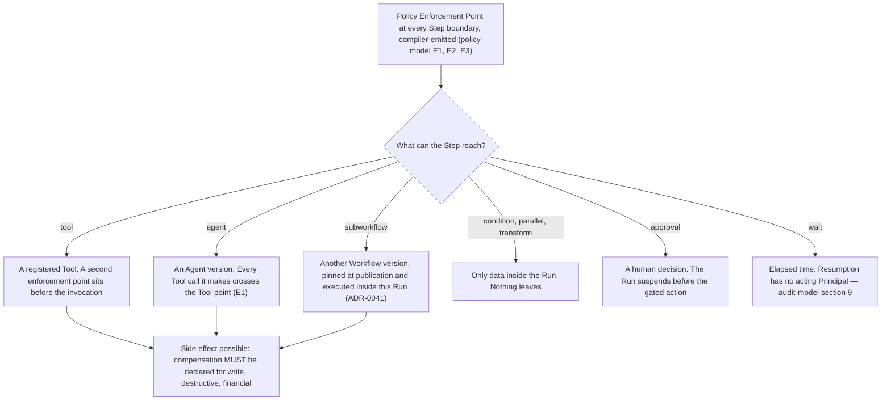

# Step Types

A **Step** is one node in a Workflow, typed, and declares a Side-Effect Class
([`../GLOSSARY.md`](../GLOSSARY.md)).
[ADR-0008](../adr/adr-0008-declarative-workflow-definitions.md) fixes eight types at MVP and no
more. Each section below gives what the type does, what the compiler validates, what the Policy
Enforcement Point at its boundary sees, and how it fails; what an author declares appears where the
type does not already fix it.

## 1. Standing and scope

This section is **informative** under [`../README.md`](../README.md) section 3 — only
[`../30-protocol/`](../30-protocol/) and [`../40-governance/`](../40-governance/) bind. The
definition language is a permanent public contract regardless: ADR-0008 says so, and
[`../VERSIONING.md`](../VERSIONING.md) section 8 calls customer-authored workflows the most
dangerous versioning problem in the platform. W1 freezes a published version and R3 makes the
contract additive-only, so a step type specified loosely here cannot be corrected. It therefore uses
[RFC 2119](https://www.rfc-editor.org/rfc/rfc2119) keywords for the language, and links what binds
elsewhere rather than restating it.

**The compiled graph is not in this document, and not in the language.** A customer authors a
definition; the compiler emits an execution graph carrying a Policy Enforcement Point at every Step
boundary; that graph is a build output, retained for audit, traceable to its source definition,
version and Step identifiers, and never returned through a public contract
([ADR-0005](../adr/adr-0005-langgraph-as-compilation-target.md)). No substrate vocabulary appears in
a step type, a field name or a diagnostic.

Orchestra is pre-implementation and pre-customer: no compiler exists, no definition has been
authored, no claim here is design-partner tested, and
[ADR-0007](../adr/adr-0007-outbound-connector-for-enterprise-reachability.md) is **Proposed**.

## 2. The eight types

| Type | What it does | What it names | Sequence fixed by the definition | Suspends the Run |
| --- | --- | --- | --- | --- |
| `agent` | Delegates to an Agent version, which chooses its own sequence of Tool calls at runtime | An Agent version | No — the one exception | No |
| `tool` | Invokes exactly one registered Tool with arguments fixed at authoring | Exactly one Tool | Yes | No |
| `approval` | Places a human decision gate in the process explicitly, rather than leaving it to a threshold | Nothing outside the definition | Yes | Yes, until resolution |
| `condition` | Selects one declared branch by evaluating a predicate over data already in the Run | Branch targets in the same definition | Yes | No |
| `parallel` | Declares branches that may execute concurrently, and rejoins them | Branch targets in the same definition | Yes, per branch | No |
| `wait` | Suspends until a declared time condition is met | Nothing outside the definition | Yes | Yes, until it elapses |
| `transform` | Reshapes data already in the Run — mapping, projection, formatting | Nothing outside the definition | Yes | No |
| `subworkflow` | Executes another Workflow version as a Step of this one | A Workflow version | Yes | Follows the child |

Only a `tool` Step names a Tool; every other type names none
([`../20-domain/domain-model.md`](../20-domain/domain-model.md) section 5). Any Step may suspend the
Run whatever the last column says, because rule E1 in
[`../40-governance/policy-model.md`](../40-governance/policy-model.md) puts an enforcement point at
every Step boundary and rule P3 closes the verdict set at three, `require_approval` among them. The
column records what the type does on its own account, not what policy may do to it. `approval` is
the one type whose own account is a verdict, its boundary being barred from returning `allow` —
section 7.

## 3. Adding a ninth type is denied by default

[ADR-0008](../adr/adr-0008-declarative-workflow-definitions.md) rates *the definition language grows
into a programming language* High likelihood and High impact — one of its two highest-rated risks —
and answers it with one guard: **step-type additions are deny-by-default, and every new type
requires its own ADR.**
[`../00-overview/scope-and-non-goals.md`](../00-overview/scope-and-non-goals.md) section 2.4
restates it as scope. It is repeated here because this is where a ninth-type proposal starts.

The contract rules make it necessary rather than sufficient. Under
[`../VERSIONING.md`](../VERSIONING.md) rule R2 a new step type is a MINOR, additive change; under R3
every consumer must ignore what it does not recognise, so nothing breaks the day it lands; under
section 10 withdrawing one costs 24 months of notice on every affected definition. Adding is cheap,
removing is not, and that asymmetry is the argument.

Two constraints hold on any proposal. No type may carry a construct by which an author suppresses,
skips or defers a Policy Enforcement Point: rule E2 in
[`../40-governance/policy-model.md`](../40-governance/policy-model.md) states that prohibition and
is not restated here, and a type needing such a construct requires an ADR superseding ADR-0008
rather than a schema addition. And the escape hatch
[ADR-0005](../adr/adr-0005-langgraph-as-compilation-target.md) reserves for patterns the language
cannot express is *a reviewed custom step type, never raw customer code* — a ninth type, gated here.

## 4. What every Step declares, whatever its type

| Declaration | Requirement | Source |
| --- | --- | --- |
| Step identifier | Stable within the Workflow version, and the handle the compiled graph traces back through | [ADR-0005](../adr/adr-0005-langgraph-as-compilation-target.md) |
| Type | Exactly one of the eight | [ADR-0008](../adr/adr-0008-declarative-workflow-definitions.md) |
| Side-Effect Class | Mandatory: `read`, `write`, `destructive`, `financial` or `external-communication` | [`../GLOSSARY.md`](../GLOSSARY.md) |
| Compensating action | MUST be declared where the class is `write`, `destructive` or `financial` | [ADR-0008](../adr/adr-0008-declarative-workflow-definitions.md) risks; [`../00-overview/roadmap.md`](../00-overview/roadmap.md) Phase 4 exit |
| Refusal edge | MAY be declared, in `edges`: the edge the Run follows when the Step's boundary, or the Tool enforcement point before the invocation a `tool` Step names, returns `deny`, or when a gate raised there is rejected or expires. Without one the Run ends `Denied`. An `approval` Step's own gate takes its rejection and expiry edges instead (section 7) | [ADR-0040](../adr/adr-0040-run-outcomes-for-refusal-and-compensation.md); [`workflow-dsl.md`](workflow-dsl.md) L12 |
| Tool reference | Exactly one on a `tool` Step, none on any other type | [`../20-domain/domain-model.md`](../20-domain/domain-model.md) section 5 |
| Definition reference | An exact Agent version on an `agent` Step and an exact Workflow version on a `subworkflow` Step, pinned when the Workflow version is published; none on any other type | [ADR-0041](../adr/adr-0041-nested-versions-execute-inside-the-parent-run.md); [`../VERSIONING.md`](../VERSIONING.md) rule W6 |
| Tool schema MAJOR pin | A Workflow version pins the major version of each Tool schema it references | [`../VERSIONING.md`](../VERSIONING.md) rule W5 |

**S1 — Every Step is evaluated at a Policy Enforcement Point, whatever its Side-Effect Class.** This
is [`../40-governance/policy-model.md`](../40-governance/policy-model.md) rule E3 under a local
handle, carried because the per-type tables below refer to it: E1 places the enforcement point, E2
makes its emission structural, and E3 owns the rule and says why narrowing coverage by class fails
twice over. Nothing in this document qualifies it. The per-type sections say what a boundary sees,
never whether one is there.

**S2 — A step type does not determine the Side-Effect Class.** On a `tool` Step the class is the one
recorded in the Tool Catalog at registration, authoritative at evaluation and never overridable by
the definition, the Run or model output
([`../40-governance/tool-authorization.md`](../40-governance/tool-authorization.md) rule TA9). A
definition that restates the class cannot make it true, and [`workflow-dsl.md`](workflow-dsl.md)
section 5 rejects a mismatch rather than adopting it
([`../40-governance/tool-authorization.md`](../40-governance/tool-authorization.md) TA9). On the
other seven types the declared class asserts something about a Step that reaches no Tool of its own,
and what constrains that value is **unmade**, also section 13. The `agent` Step is the sharp case: a
definition cannot constrain which Tools the model calls, so a `read`-classed delegation can reach a
Tool the Catalog classes `financial`.

**S3 — The unit is the Step Execution, never the Run.** Idempotency keys, retry and compensation key
on one execution of one Step within one Run (invariant I4,
[`../20-domain/domain-model.md`](../20-domain/domain-model.md)). Their mechanics belong to
[`execution-semantics.md`](execution-semantics.md); what belongs here is that every failure mode
below is stated at that grain.

## 5. `agent` — where judgment enters

The `agent` Step is the only type whose internal sequence the definition does not fix: the model
chooses which Tools to call, in what order and how many times, at runtime. That is the point. The
platform is *deterministic where determinism matters and agentic where judgment matters*
([ADR-0003](../adr/adr-0003-governance-layer-positioning.md)), and this type carries the second
half.

What makes it governable is that its bounds are declared and its every act evaluated. **A definition
can constrain five things:** the Agent it delegates to — Agent definitions follow rules W1 to W4
identically ([`../VERSIONING.md`](../VERSIONING.md) section 8), and the Step names an exact Agent
version, pinned when the Workflow version is published and executed inside this Run
([ADR-0041](../adr/adr-0041-nested-versions-execute-inside-the-parent-run.md)); everything the
resolved version fixes — instructions, model binding, policy bindings and bounds
([`../GLOSSARY.md`](../GLOSSARY.md)); the Tools that version declares, the outer limit on what may
be called at all, each call still needing a capability grant naming the Agent (I5,
[`../40-governance/tool-authorization.md`](../40-governance/tool-authorization.md) TA19 to TA21);
the data handed in; and the Step's class with its compensation declaration. **It cannot
constrain** the
order, count or arguments of the calls the model makes, which the Tool enforcement point bounds at
runtime. The definition bounds the authority; the enforcement point bounds each act.

| Aspect | |
| --- | --- |
| Compiler validates | The reference names an exact Agent version already published in this Tenant and not `Archived`, which publication pins ([ADR-0041](../adr/adr-0041-nested-versions-execute-inside-the-parent-run.md)). A compensating action is present where the declared class requires one. The reference names no Agent outside the Tenant, and Workspace scope resolves. |
| At its boundary | One evaluation over the Step and the Agent version it resolves to as the proposed action — the delegation itself, not any call it will make. Inputs are [`../40-governance/policy-model.md`](../40-governance/policy-model.md) rule N1. The definition fixes no sequence inside the delegation, so it declares no further Steps and there are no further Step boundaries; every Tool call the model makes crosses the Tool enforcement point, which rule E1 places before *any* Tool invocation rather than once per Step. Rule E4 says the same of an Agent Run, where that point is not optional and is the only control between admission and a side effect — the same shape, cited as the analogy it is rather than as coverage, an `agent` Step not being an Agent Run. The delegated execution crosses no Run admission enforcement point of its own: it is not a Run, and every evaluation inside it runs under the Policy versions this Run pinned at admission ([ADR-0041](../adr/adr-0041-nested-versions-execute-inside-the-parent-run.md)). |
| Failure modes | A failed model call is safe to retry; a partially executed Tool call is not, and is compensated rather than retried (ADR-0008) — though the only declaration a definition can carry sits on the delegation rather than on the calls the model chooses, and where a compensating action for such a call is declared is **unmade**, section 13. Non-termination: no step limit, no maximum duration and no timeout is decided anywhere in this repository. A `deny` on a call the model chooses, or a gate on such a call that is rejected or expires, returns to the model as that invocation's outcome and the Step continues; a `deny` of the delegation at the Step's own boundary, or a gate raised there that is rejected or expires, follows the Step's refusal edge or ends the Run `Denied` ([`../40-governance/policy-model.md`](../40-governance/policy-model.md) V1, [`../40-governance/approval-workflows.md`](../40-governance/approval-workflows.md) J5). Quota Envelope pressure under BYOK is a steady-state capacity constraint, not an exceptional failure ([ADR-0006](../adr/adr-0006-model-layer-as-credential-broker.md)). |

Prompt injection is not a failure mode of this type; it is the ordinary condition of it. The defence
is that no model output ever satisfies a control, and
[`../40-governance/policy-model.md`](../40-governance/policy-model.md) section 7 owns that argument.
The domain model draws the edge from this Step to the Agent version it names, as it does for
`subworkflow` in section 12
([ADR-0041](../adr/adr-0041-nested-versions-execute-inside-the-parent-run.md)).

## 6. `tool` — the only type that names a Tool

Invokes one registered Tool with arguments fixed at authoring time. It is where a side effect
actually occurs, and the one place a compensating action has something concrete to undo.

| Aspect | |
| --- | --- |
| Declares | Exactly one Tool; the arguments as they would execute; the Tool schema MAJOR version pinned by the Workflow version (rule W5); the class, which is the Tool's own (S2); a compensating action where that class is `write`, `destructive` or `financial`. |
| Compiler validates | [`workflow-dsl.md`](workflow-dsl.md) section 5 enumerates the checks and is where they live: the Tool is registered in this Tenant's Tool Catalog, its schema MAJOR is pinned, the arguments conform to that major, and compensation is present where required. It also rejects a declared class that differs from the one the Catalog recorded at registration — a restatement that differs is a mismatch, never an override. Registration at compile time is not permission — invariant I5 — and registration state is re-read as an evaluation input at every invocation. |
| At its boundary | Two evaluations under rule E1: one at the Step boundary, one before the invocation. The second additionally sees the Tool, its registration state, the grant set and the proposed action including its arguments. Whether the two collapse into one evaluation for this type is **unmade** and owned by [`../40-governance/policy-model.md`](../40-governance/policy-model.md). |
| Failure modes | An interrupted invocation leaves the call in an unknown state, and unknown is not the same as not done — which is why compensation rather than blind retry is the mechanism, at Step Execution grain. A refusal is a governance outcome, not a fault: a `deny` at either evaluation, or a gate either raises that is rejected or expires, follows the Step's refusal edge or ends the Run `Denied` ([`../40-governance/policy-model.md`](../40-governance/policy-model.md) V1, [`../40-governance/approval-workflows.md`](../40-governance/approval-workflows.md) J5). Registered metadata diverging from what the origin now serves MUST NOT be adopted silently ([`../40-governance/threat-model.md`](../40-governance/threat-model.md) T2). Reachability through a Connector rests on [ADR-0007](../adr/adr-0007-outbound-connector-for-enterprise-reachability.md), **Proposed**. |

Naming the Tool is a declaration, never a grant. The Workflow holds capability grants on the same
terms as an Agent, so the invocation needs a grant naming the Workflow and the Tool, read at the
Tool enforcement point, as well as the registration and the verdict
([ADR-0042](../adr/adr-0042-declared-tools-and-capability-grants.md),
[`../40-governance/tool-authorization.md`](../40-governance/tool-authorization.md) TA19 to TA21). A
missing grant is an audited refusal naming no Policy
([`../40-governance/policy-model.md`](../40-governance/policy-model.md) A4).

## 7. `approval` — the governance core, made a node

A `require_approval` verdict can arise at any Step boundary. The `approval` Step exists so an author
can put the gate where the process demands one, rather than relying on a threshold to produce it.

**It does not mint an Approval Request.** A request is raised by a `require_approval` verdict
([`../GLOSSARY.md`](../GLOSSARY.md)) and carries the causing Policy Decision — the Policy version,
the inputs and the verdict — so *why was I asked* is answerable from the request alone
([`../40-governance/approval-workflows.md`](../40-governance/approval-workflows.md) rule G1 and
section 3, which own everything after the raise). A gate raised without an evaluation would carry
nothing behind it. So the Step declares that a gate belongs here, the boundary enforcement point
evaluates, and the request forms from that verdict. Nor does the Step name its own approvers: the
Approval Chain is derived from Policy at raise time (rule C1), so it MUST NOT be authored on the
Step.

**The boundary of an `approval` Step MUST NOT return `allow`**, by
[`../40-governance/policy-model.md`](../40-governance/policy-model.md) rule V4, which carries the
requirement — a constraint on verdicts belongs to the normative document that owns them. Its verdict
is `require_approval`, or `deny` where a Policy refuses the action outright. What the Step
declares is that a gate belongs at this point in the process. Policy determines the chain, the
routing and who may satisfy it; it does not determine whether the gate exists, because a type whose
boundary may return `allow` is not a type but a comment, and an author reading the definition would
have no way to tell whether the gate they wrote is there. The direction is the conservative one —
more gates, never fewer — which is what it means for policy rather than prompts to be the security
boundary. The alternative reading, that the type is an author's hint Policy may override, is the
thing an ADR would have to choose; section 13 registers it.

| Aspect | |
| --- | --- |
| Compiler validates | That the boundary enforcement point is emitted and unsuppressed (rule E2), and that any declared rejection, expiry or refusal edge leads to an ordinary sequence of Steps, each carrying its own boundary evaluation ([`workflow-dsl.md`](workflow-dsl.md) L12). It cannot validate the chain, which does not exist until raise time. The Control Plane warns instead, at authoring time, where no Policy version in force supplies a chain at this Step, because a gate with no position is refused at raise ([ADR-0043](../adr/adr-0043-approval-chains-and-separation-of-duties.md), [`../40-governance/approval-workflows.md`](../40-governance/approval-workflows.md) C10). |
| At its boundary | The same inputs as any Step boundary (rule N1). What differs is the verdict available to it: `require_approval`, or `deny`, and never `allow` — the rule above — with the Approval Request forming from the first of the two. |
| Failure modes | Rejection, including a gate refused at raise because no matching Policy supplied a chain ([ADR-0043](../adr/adr-0043-approval-chains-and-separation-of-duties.md), [`../40-governance/approval-workflows.md`](../40-governance/approval-workflows.md) C10); expiry, where a Policy that raised the gate declares a decision deadline; and withdrawal, which is the Run having already ended and left nothing to gate. Three requirements govern the suspension and are cited rather than restated: durability of a suspension that may last days is [`../40-governance/approval-workflows.md`](../40-governance/approval-workflows.md) rule G1, resumption *at* the gated action rather than before it is its rule G2, and the Policy Decision behind the gate must be durable before the gated action could be attempted ([ADR-0013](../adr/adr-0013-fail-closed-policy-decision-writes.md)). |

**An `approval` Step may declare where its own rejected or expired gate leads.**
[ADR-0040](../adr/adr-0040-run-outcomes-for-refusal-and-compensation.md) admits two edges on this
type and on no other: a rejection edge, which the Run resumes onto when the request resolves
`Rejected`, and an expiry edge, which it resumes onto when the request resolves `Expired` because
its decision deadline, where the Policy that raised it sets one (ADR-0043), passed undecided.
Without the edge the Run ends `Denied`, a governance refusal rather than a fault, and that
document's rule J5 carries the requirement. Like every Step, this one may also declare a refusal
edge, but that edge serves a `deny` at its boundary, never its own gate. Every other type sends a
rejected or expired gate where a `deny` at the same point would go. Four more things hold on every
path, J1 to J4 in that section, counted there and not here. Two bear directly on this type: a
declared rejection or expiry edge leads to ordinary execution, every Step on it crossing an
enforcement point and inheriting none of the refused action's authorization (J2); and re-proposing
a refused action raises a **new** request, a refused one being terminal (J3). J4 is the one a reader
of this document alone would otherwise miss — a rejection is never proof that no side effect
occurred, because Step Executions that already ran in this Run may have left one, and unknown is not
the same as not done. An admission gate has no Step to branch from, so a rejected one ends the Run
`Denied` with no Step Execution.

## 8. `condition` — deterministic branching

Evaluates a predicate over data already in the Run and selects one declared branch. No model, no
effect leaving the platform.

| Aspect | |
| --- | --- |
| Declares | The predicate, an Expression Profile expression ([ADR-0035](../adr/adr-0035-cel-profile-for-policies-and-workflow-expressions.md)), and the branch each outcome selects. How a definition writes it is [`workflow-dsl.md`](workflow-dsl.md)'s to specify. |
| Compiler validates | Every branch target resolves to a Step in the same definition; the predicate is well-formed and references only data the definition makes available at that point; the predicate invokes no Tool and no model — either is a different step type. A cyclic graph is rejected at compile time under [`workflow-dsl.md`](workflow-dsl.md)'s graph well-formedness check, so a branch may not target a Step already on the path to it and the language admits no iteration. Whether the language requires an exhaustive branch set remains a graph-shape question for that document. |
| At its boundary | The Step, its class, and a proposed action that is a *selection* rather than an effect. The resulting Policy Decision is a class of Audit Record ([ADR-0012](../adr/adr-0012-policy-decisions-are-audit-records.md)), and so the durable record of why the process branched. It is evaluated like every other Step (S1). |
| Failure modes | Predicate evaluation error, and a reference resolvable at compile time but absent at runtime because a model or a Tool did not produce it. Two failures are distinct here and only one of them is a policy failure. Where the boundary *Policy* evaluation cannot complete, rule A3 in [`../40-governance/policy-model.md`](../40-governance/policy-model.md) forbids `allow` and leaves the record — a `deny`, or a Step Execution error — **unmade**. Where the *predicate* cannot evaluate, no Policy was reached and nothing refused: it is a fault, which [`execution-semantics.md`](execution-semantics.md) section 10's taxonomy keeps distinct from a refusal in the audit trail, in the metered outcome and to the caller. What a predicate fault then does to the Step Execution and the Run is **unmade** — section 13. Having no side effect, a condition is the one case where re-evaluation cannot leave unknown state. |

## 9. `parallel` — concurrency, and what it does to policy

Declares two or more branches that may execute concurrently, and rejoins them.

| Aspect | |
| --- | --- |
| Compiler validates | Each branch is a well-formed sequence of Steps, each with its own boundary evaluation. Whether concurrent branches may write the same data, and what wins if they do, is a data-flow question for [`workflow-dsl.md`](workflow-dsl.md). |
| At its boundary | One evaluation at the fan-out, **plus one at every Step inside every branch**. Concurrency reduces the count of enforcement points by exactly zero; rule E1 is per Step, not per path. |
| Failure modes | A branch failing after a side-effecting Step compensates at Step Execution grain (invariant I4). What that does to its siblings — cancellation, compensation, or letting them complete — is **unmade** and belongs to [`execution-semantics.md`](execution-semantics.md). No fan-out limit is decided. |

The sharp edge is not concurrency but what it does to a Policy reading accumulated state: two
branches evaluating a spend threshold at the same instant could each see a total excluding the
other, and both be permitted.
[`../40-governance/policy-model.md`](../40-governance/policy-model.md) rule N3 closes it. A Policy
reads only a platform-defined aggregate, which the enforcing service reads and reserves in the
transaction that writes the Policy Decision, so the two branches take turns and the second sees the
first's contribution
([ADR-0035](../adr/adr-0035-cel-profile-for-policies-and-workflow-expressions.md)).

## 10. `wait` — time, and a transition no Principal causes

Suspends the Run until a declared time condition is met, entering the same `Suspended` state an
approval gate produces with a recorded reason distinguishing the two
([`../20-domain/lifecycle-state-machines.md`](../20-domain/lifecycle-state-machines.md) section
2.2). No duration, default or maximum appears here, because none is decided anywhere.

**Resumption is a transition with no acting Principal.** Nobody acts; time passes. It is caused by
an observed condition, so its record carries that cause and no Principal, as
[`../40-governance/audit-model.md`](../40-governance/audit-model.md) section 9 requires
([ADR-0030](../adr/adr-0030-platform-operator-and-observed-conditions.md)). Nothing is attributed to
the Principal who started the Run or to the author of the definition, since neither acted.

| Aspect | |
| --- | --- |
| Compiler validates | The wait condition is expressible in the language without arbitrary evaluation, and the Step declares a class like any other. |
| At its boundary | One evaluation at the Step boundary, with the inputs any Step boundary receives (rule N1) and on the same terms as every other type (S1). Rule E1 fixes a minimum of three enforcement points and resumption is not among them; it permits a later document to add one, and none does, so a `wait` carries one evaluation and not two. Resumption is recorded with its cause rather than evaluated, because no Principal acts there. |
| Failure modes | A condition that never becomes true: no maximum Run duration exists to bound it. Cancellation during a wait interrupts no invocation, so the wait itself leaves nothing in an unknown state — which says nothing about Step Executions that already ran, and cancellation is never proof that an earlier side effect did not occur. |

Whether a `wait` may instead be released by an external signal is **unmade**, and larger than it
looks: [ADR-0008](../adr/adr-0008-declarative-workflow-definitions.md)'s revisit criteria name long
timers and complex event correlation as the demands indicating a dedicated BPM engine, reopening
this decision as an integration.

## 11. `transform` — the type most likely to become a programming language

Reshapes data already inside the Run — mapping, projection, formatting. No Tool, no model, no
effect.

| Aspect | |
| --- | --- |
| Compiler validates | References resolve; no Tool and no model is named; the body is an Expression Profile expression that type-checks within the profile's cost bound ([ADR-0035](../adr/adr-0035-cel-profile-for-policies-and-workflow-expressions.md)). [ADR-0005](../adr/adr-0005-langgraph-as-compilation-target.md) permits a reviewed custom step type as the escape hatch and **never raw customer code**, so a transform that needed to run authored code is a ninth-type proposal under section 3, not a transform. |
| At its boundary | Evaluated like every other Step (S1). What it moves matters as much as what it computes: a transform can lift an untrusted string — a supplier's free-text field, an End User's message — into a field a later Step treats as trusted. Whether untrusted content carries provenance through the platform is **unmade** and owned jointly by [`../40-governance/policy-model.md`](../40-governance/policy-model.md), [`../40-governance/threat-model.md`](../40-governance/threat-model.md) and [`../30-protocol/`](../30-protocol/). |
| Failure modes | An absent reference, or a type mismatch the compiler could not see because the value arrived from a model or a Tool at runtime. No side effect, so nothing to compensate. |

ADR-0008's guard is on *step types*, and an expression language grows
without anyone proposing a ninth type — one convenience at a time, until the definition is code
written in YAML. The guard does not cover this axis, so
[ADR-0035](../adr/adr-0035-cel-profile-for-policies-and-workflow-expressions.md) sets the ceiling:
the Expression Profile admits no user-defined function, bounds evaluation cost, and grows only by a
profile version, which W1 keeps from altering a definition already published.

## 12. `subworkflow` — nesting inside the Run

Executes another Workflow version as a Step of this one. With `agent`, it is one of the two types
that name a definition, and the version either one names executes inside the Run that reached the
Step ([ADR-0041](../adr/adr-0041-nested-versions-execute-inside-the-parent-run.md)). The event
protocol declines to emit subagent attribution for that reason: nesting creates no Run of its own to
attribute ([`../30-protocol/event-protocol.md`](../30-protocol/event-protocol.md)).

The domain model draws the edge from this Step to the Workflow version it names, and the three
questions this section used to register are settled.

**The child is pinned when the parent is published.** The Step names an exact Workflow version, and
publishing the parent freezes that reference with the rest of it (W1). Nothing resolves it again, so
every Run of the parent executes the child version it names, however many versions of the child are
published later. Retiring the child stops the Runs that target it (W4), not its execution inside the
parent's Runs, and the child cannot be archived while a version naming it is unarchived. When the
child moves on, each version of the parent that still admits Runs surfaces a warning in the
Control Plane, and a new version of the parent adopts the newer child
([`../VERSIONING.md`](../VERSIONING.md) rule W6), as W5 has it for a Tool's MAJOR bump.

**It is not a separate Run.** The child's Steps execute inside the parent Run, and their Step
Executions are the parent Run's. There is no second admission and no second Policy pin: every
evaluation inside the child runs under the Policy versions the Run pinned at admission (P6), and
receives the child version beside the Run's own.
[ADR-0009](../adr/adr-0009-meter-first-defer-tiering.md) meters the Run once, so dividing a process
between two definitions leaves the Runs dimension unchanged. It raises two others: the child counts
in Active Agents / Workflows once it runs, and the `subworkflow` Step is still a Step, which the
Step Executions dimension counts. The audit trail carries the nesting: each Step Execution inside
the child records the Step Execution it executes under.

**Cancelling the parent cancels the child.** The child is part of the Run, so cancellation reaches
it on the same terms as the rest of the Run, compensation included
([`execution-semantics.md`](execution-semantics.md) section 7), and it cannot be cancelled apart
from its Run.

| Aspect | |
| --- | --- |
| Compiler validates | The reference names an exact Workflow version already published in this Tenant and not `Archived`. A reference can only name a version published before the parent, so a reference cycle across definitions cannot be formed; the cyclic-graph check still runs over the Steps one definition declares ([`workflow-dsl.md`](workflow-dsl.md) L11). No nesting depth is decided. |
| At its boundary | One evaluation at the Step boundary, plus one at every Step inside the child. The child crosses no Run admission enforcement point of its own. |
| Failure modes | Everything the child can fail at, with the same effect on the Run as the same failure anywhere else in it. Nesting adds no propagation rule of its own. |

## 13. Open questions

**Yes** means the choice is costly to reverse or spans documents and MUST be an ADR before
implementation. Rows marked *repeated* carry, unchanged, the owning document's classification.

| Open question | What would decide it | ADR required? |
| --- | --- | --- |
| Whether the compiler rejects a `tool` Step whose declared Side-Effect Class differs from the one the Tool Catalog records, or the language forbids restating the class at all | [`workflow-dsl.md`](workflow-dsl.md) section 5, which enumerates the compiler's checks and carries neither; [`../40-governance/tool-authorization.md`](../40-governance/tool-authorization.md) rule TA9 supplies the reason a restated class cannot be adopted | No |
| What a Side-Effect Class means on the seven types that reach no Tool of their own, and whether the compiler constrains the declared value or accepts the author's assertion | [`../40-governance/policy-model.md`](../40-governance/policy-model.md), whose rule N1 makes the class a primary evaluation input, with [`workflow-dsl.md`](workflow-dsl.md) | **Yes** |
| Whether untrusted content carries provenance through the platform, a `transform` being able to lift an untrusted string into a field a later Step treats as trusted | [`../40-governance/policy-model.md`](../40-governance/policy-model.md) section 9 carries it jointly with [`../30-protocol/`](../30-protocol/), assigned there by [`../40-governance/threat-model.md`](../40-governance/threat-model.md) | **ADR** if it reaches a public contract, else Document — *repeated* |
| What a `condition` predicate that cannot evaluate does to the Step Execution and the Run, as distinct from a boundary Policy evaluation that cannot complete under A3 | The fault half of [`execution-semantics.md`](execution-semantics.md) section 10's taxonomy, which assigns it to `reliability.md` in [`../60-operations/`](../60-operations/); [`workflow-dsl.md`](workflow-dsl.md) owns the expression language it faults in | No |
| Whether an `approval` Step is instead an author's hint that Policy may override, its boundary free to return `allow`, rather than a gate Policy routes but cannot remove | An ADR superseding the rule in section 7; [`../40-governance/approval-workflows.md`](../40-governance/approval-workflows.md) assigns the type here and its rule G1 fixes that only a `require_approval` verdict raises a request | **Yes** |
| What satisfies a `parallel` join, and what a branch failure does to its siblings — cancellation, compensation, or completion | [`execution-semantics.md`](execution-semantics.md) | No |
| What a Tool call the model chooses keys on for idempotency, compensation and metering — in an Agent Run, which has no Steps, and inside an `agent` Step, whose delegation is the only Step there is | [`../20-domain/domain-model.md`](../20-domain/domain-model.md) section 11 registers it and [`../40-governance/policy-model.md`](../40-governance/policy-model.md) rule E4 cites it, with the mechanics in [`execution-semantics.md`](execution-semantics.md) | No — *repeated* |
| Where a compensating action is declared for a Tool call the model chooses, an `agent` Step's declaration covering the delegation rather than the calls | [`execution-semantics.md`](execution-semantics.md) section 11 registers it, with [`../10-architecture/control-plane.md`](../10-architecture/control-plane.md) and [`../40-governance/tool-authorization.md`](../40-governance/tool-authorization.md) | **Yes** — *repeated* |
| Whether the Step-boundary and Tool enforcement points collapse into one evaluation for a `tool` Step | [`../40-governance/policy-model.md`](../40-governance/policy-model.md) section 9 owns it, with this section | No — *repeated* |
| What happens to a Run in flight when a Tool a `tool` Step names is de-registered | [`execution-semantics.md`](execution-semantics.md); registered by [`../40-governance/tool-authorization.md`](../40-governance/tool-authorization.md) | No — *repeated* |
| Whether a `wait` may be released by an external signal rather than elapsed time | A product decision read against ADR-0008's revisit criteria, which name complex event correlation as the demand that reopens the engine question | No |
| What admitting a cyclic graph would require — a step limit, an iteration bound and an answer on non-termination — a cyclic graph being rejected at compile time until an ADR admits one. A reference cycle across definitions cannot be formed, every reference naming a version already published ([ADR-0041](../adr/adr-0041-nested-versions-execute-inside-the-parent-run.md)) | [`workflow-dsl.md`](workflow-dsl.md) section 11, which owns graph shape and registers it | **Yes** — *repeated* |
| Graph shape otherwise — whether a `condition` branch set must be exhaustive, and data flow between Steps | [`workflow-dsl.md`](workflow-dsl.md), which owns schema and graph shape | No |

Three rows that stood here were one question in two guises: whether a sub-execution is a separate
Run, whether a Step pins the version it names, and whether a Step may name an Agent version at all.
[ADR-0041](../adr/adr-0041-nested-versions-execute-inside-the-parent-run.md) answers all three: the
Step names an exact version, pinned at publication, which executes inside the Run.
