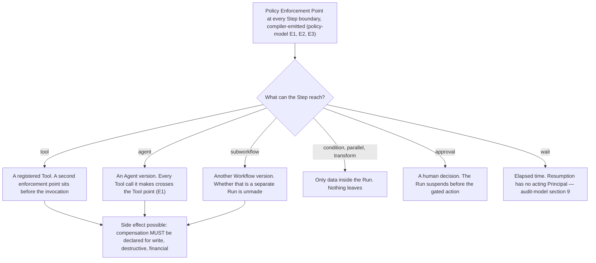

# Step Types

A **Step** is one node in a Workflow, typed, and declares a Side-Effect Class
([`../GLOSSARY.md`](../GLOSSARY.md)).
[ADR-0008](../adr/adr-0008-declarative-workflow-definitions.md) fixes eight types at MVP and no
more. Each section below gives what the type does, what the compiler validates, what the Policy
Enforcement Point at its boundary sees, and how it fails; what an author declares appears where the
type does not already fix it.

## 1. Standing and scope

This section is **informative** under [`../README.md`](../README.md) section 3 — only
[`../30-protocol/`](../30-protocol/) and [`../40-governance/`](../40-governance/) bind. The
definition language is a permanent public contract regardless: ADR-0008 says so, and
[`../VERSIONING.md`](../VERSIONING.md) section 8 calls customer-authored workflows the most
dangerous versioning problem in the platform. W1 freezes a published version and R3 makes the
contract additive-only, so a step type specified loosely here cannot be corrected. It therefore uses
[RFC 2119](https://www.rfc-editor.org/rfc/rfc2119) keywords for the language, and links what binds
elsewhere rather than restating it.

**The compiled graph is not in this document, and not in the language.** A customer authors a
definition; the compiler emits an execution graph carrying a Policy Enforcement Point at every Step
boundary; that graph is a build output, retained for audit, traceable to its source definition,
version and Step identifiers, and never returned through a public contract
([ADR-0005](../adr/adr-0005-langgraph-as-compilation-target.md)). No substrate vocabulary appears in
a step type, a field name or a diagnostic.

Orchestra is pre-implementation and pre-customer: no compiler exists, no definition has been
authored, no claim here is design-partner tested, and
[ADR-0007](../adr/adr-0007-outbound-connector-for-enterprise-reachability.md) is **Proposed**.

## 2. The eight types

| Type | What it does | What it names | Sequence fixed by the definition | Suspends the Run |
| --- | --- | --- | --- | --- |
| `agent` | Delegates to an Agent version, which chooses its own sequence of Tool calls at runtime | An Agent version | No — the one exception | No |
| `tool` | Invokes exactly one registered Tool with arguments fixed at authoring | Exactly one Tool | Yes | No |
| `approval` | Places a human decision gate in the process explicitly, rather than leaving it to a threshold | Nothing outside the definition | Yes | Yes, until resolution |
| `condition` | Selects one declared branch by evaluating a predicate over data already in the Run | Branch targets in the same definition | Yes | No |
| `parallel` | Declares branches that may execute concurrently, and rejoins them | Branch targets in the same definition | Yes, per branch | No |
| `wait` | Suspends until a declared time condition is met | Nothing outside the definition | Yes | Yes, until it elapses |
| `transform` | Reshapes data already in the Run — mapping, projection, formatting | Nothing outside the definition | Yes | No |
| `subworkflow` | Executes another Workflow version as a Step of this one | A Workflow version | Yes | Follows the child |

Only a `tool` Step names a Tool; every other type names none
([`../20-domain/domain-model.md`](../20-domain/domain-model.md) section 5). Any Step may suspend the
Run whatever the last column says, because rule E1 in
[`../40-governance/policy-model.md`](../40-governance/policy-model.md) puts an enforcement point at
every Step boundary and rule P3 closes the verdict set at three, `require_approval` among them. The
column records what the type does on its own account, not what policy may do to it. `approval` is
the one type whose own account is a verdict, its boundary being barred from returning `allow` —
section 7.

## 3. Adding a ninth type is denied by default

[ADR-0008](../adr/adr-0008-declarative-workflow-definitions.md) rates *the definition language grows
into a programming language* High likelihood and High impact — one of its two highest-rated risks —
and answers it with one guard: **step-type additions are deny-by-default, and every new type
requires its own ADR.**
[`../00-overview/scope-and-non-goals.md`](../00-overview/scope-and-non-goals.md) section 2.4
restates it as scope. It is repeated here because this is where a ninth-type proposal starts.

The contract rules make it necessary rather than sufficient. Under
[`../VERSIONING.md`](../VERSIONING.md) rule R2 a new step type is a MINOR, additive change; under R3
every consumer must ignore what it does not recognise, so nothing breaks the day it lands; under
section 10 withdrawing one costs 24 months of notice on every affected definition. Adding is cheap,
removing is not, and that asymmetry is the argument.

Two constraints hold on any proposal. No type may carry a construct by which an author suppresses,
skips or defers a Policy Enforcement Point: rule E2 in
[`../40-governance/policy-model.md`](../40-governance/policy-model.md) states that prohibition and
is not restated here, and a type needing such a construct requires an ADR superseding ADR-0008
rather than a schema addition. And the escape hatch
[ADR-0005](../adr/adr-0005-langgraph-as-compilation-target.md) reserves for patterns the language
cannot express is *a reviewed custom step type, never raw customer code* — a ninth type, gated here.

## 4. What every Step declares, whatever its type

| Declaration | Requirement | Source |
| --- | --- | --- |
| Step identifier | Stable within the Workflow version, and the handle the compiled graph traces back through | [ADR-0005](../adr/adr-0005-langgraph-as-compilation-target.md) |
| Type | Exactly one of the eight | [ADR-0008](../adr/adr-0008-declarative-workflow-definitions.md) |
| Side-Effect Class | Mandatory: `read`, `write`, `destructive`, `financial` or `external-communication` | [`../GLOSSARY.md`](../GLOSSARY.md) |
| Compensating action | MUST be declared where the class is `write`, `destructive` or `financial` | [ADR-0008](../adr/adr-0008-declarative-workflow-definitions.md) risks; [`../00-overview/roadmap.md`](../00-overview/roadmap.md) Phase 4 exit |
| Tool reference | Exactly one on a `tool` Step, none on any other type | [`../20-domain/domain-model.md`](../20-domain/domain-model.md) section 5 |
| Tool schema MAJOR pin | A Workflow version pins the major version of each Tool schema it references | [`../VERSIONING.md`](../VERSIONING.md) rule W5 |

**S1 — Every Step is evaluated at a Policy Enforcement Point, whatever its Side-Effect Class.** This
is [`../40-governance/policy-model.md`](../40-governance/policy-model.md) rule E3 under a local
handle, carried because the per-type tables below refer to it: E1 places the enforcement point, E2
makes its emission structural, and E3 owns the rule and says why narrowing coverage by class fails
twice over. Nothing in this document qualifies it. The per-type sections say what a boundary sees,
never whether one is there.

**S2 — A step type does not determine the Side-Effect Class.** On a `tool` Step the class is the one
recorded in the Tool Catalog at registration, authoritative at evaluation and never overridable by
the definition, the Run or model output
([`../40-governance/tool-authorization.md`](../40-governance/tool-authorization.md) rule TA9). A
definition that restates the class cannot make it true, and [`workflow-dsl.md`](workflow-dsl.md)
section 5 rejects a mismatch rather than adopting it
([`../40-governance/tool-authorization.md`](../40-governance/tool-authorization.md) TA9). On the
other seven types the declared class asserts something about a Step that reaches no Tool of its own,
and what constrains that value is **unmade**, also section 13. The `agent` Step is the sharp case: a
definition cannot constrain which Tools the model calls, so a `read`-classed delegation can reach a
Tool the Catalog classes `financial`.

**S3 — The unit is the Step Execution, never the Run.** Idempotency keys, retry and compensation key
on one execution of one Step within one Run (invariant I4,
[`../20-domain/domain-model.md`](../20-domain/domain-model.md)). Their mechanics belong to
[`execution-semantics.md`](execution-semantics.md); what belongs here is that every failure mode
below is stated at that grain.

## 5. `agent` — where judgment enters

The `agent` Step is the only type whose internal sequence the definition does not fix: the model
chooses which Tools to call, in what order and how many times, at runtime. That is the point. The
platform is *deterministic where determinism matters and agentic where judgment matters*
([ADR-0003](../adr/adr-0003-governance-layer-positioning.md)), and this type carries the second
half.

What makes it governable is that its bounds are declared and its every act evaluated. **A definition
can constrain five things:** the Agent it delegates to — Agent definitions follow rules W1 to W4
identically ([`../VERSIONING.md`](../VERSIONING.md) section 8), though whether the Step *pins* the
version it names or resolves the Active one at run time is **unmade**, ADR-required, and registered
by [`workflow-dsl.md`](workflow-dsl.md) section 11 jointly with this document; everything the
resolved version fixes — instructions, permitted tools, model binding, policy bindings and bounds
([`../GLOSSARY.md`](../GLOSSARY.md)); that version's capability grant set, the outer limit on what
may be called at all (I5), though whether the grant set is carried by the immutable Agent version
and so pinned for the life of a Run is **unmade** and owned by
[`../40-governance/tool-authorization.md`](../40-governance/tool-authorization.md) section 10; the
data handed in; and the Step's class with its compensation declaration. **It cannot constrain** the
order, count or arguments of the calls the model makes, which the Tool enforcement point bounds at
runtime. The definition bounds the authority; the enforcement point bounds each act.

| Aspect | |
| --- | --- |
| Compiler validates | The reference resolves to a published rather than `Draft` Agent definition. Whether it resolves to a pinned version or to the Active one is the unmade question above, so no pinning check is specified here and none may be read in. A compensating action is present where the declared class requires one. The reference names no Agent outside the Tenant, and Workspace scope resolves. |
| At its boundary | One evaluation over the Step and the Agent version it resolves to as the proposed action — the delegation itself, not any call it will make. Inputs are [`../40-governance/policy-model.md`](../40-governance/policy-model.md) rule N1. The definition fixes no sequence inside the delegation, so it declares no further Steps and there are no further Step boundaries; every Tool call the model makes crosses the Tool enforcement point, which rule E1 places before *any* Tool invocation rather than once per Step. Rule E4 says the same of an Agent Run, where that point is not optional and is the only control between admission and a side effect — the same shape, cited as the analogy it is rather than as coverage, an `agent` Step not being an Agent Run. Whether the delegated execution *additionally* crosses a Run admission enforcement point turns on the missing Step-to-Agent-version edge below, exactly as the equivalent question does for `subworkflow` in section 12. |
| Failure modes | A failed model call is safe to retry; a partially executed Tool call is not, and is compensated rather than retried (ADR-0008) — though the only declaration a definition can carry sits on the delegation rather than on the calls the model chooses, and where a compensating action for such a call is declared is **unmade**, section 13. Non-termination: no step limit, no maximum duration and no timeout is decided anywhere in this repository. A `deny` on a call inside the Step has no defined effect on the Run, which [`../40-governance/policy-model.md`](../40-governance/policy-model.md) registers. Quota Envelope pressure under BYOK is a steady-state capacity constraint, not an exceptional failure ([ADR-0006](../adr/adr-0006-model-layer-as-credential-broker.md)). |

Prompt injection is not a failure mode of this type; it is the ordinary condition of it. The defence
is that no model output ever satisfies a control, and
[`../40-governance/policy-model.md`](../40-governance/policy-model.md) section 7 owns that argument.
Separately: the domain model draws no edge from a Step to an Agent version, so this type needs one
that does not exist — the same shape as the `subworkflow` gap in section 12, registered with it.

## 6. `tool` — the only type that names a Tool

Invokes one registered Tool with arguments fixed at authoring time. It is where a side effect
actually occurs, and the one place a compensating action has something concrete to undo.

| Aspect | |
| --- | --- |
| Declares | Exactly one Tool; the arguments as they would execute; the Tool schema MAJOR version pinned by the Workflow version (rule W5); the class, which is the Tool's own (S2); a compensating action where that class is `write`, `destructive` or `financial`. |
| Compiler validates | [`workflow-dsl.md`](workflow-dsl.md) section 5 enumerates the checks and is where they live: the Tool is registered in this Tenant's Tool Catalog, its schema MAJOR is pinned, the arguments conform to that major, and compensation is present where required. It also rejects a declared class that differs from the one the Catalog recorded at registration — a restatement that differs is a mismatch, never an override. Registration at compile time is not permission — invariant I5 — and registration state is re-read as an evaluation input at every invocation. |
| At its boundary | Two evaluations under rule E1: one at the Step boundary, one before the invocation. The second additionally sees the Tool, its registration state, the grant set and the proposed action including its arguments. Whether the two collapse into one evaluation for this type is **unmade** and owned by [`../40-governance/policy-model.md`](../40-governance/policy-model.md). |
| Failure modes | An interrupted invocation leaves the call in an unknown state, and unknown is not the same as not done — which is why compensation rather than blind retry is the mechanism, at Step Execution grain. A refusal is a governance outcome, not a fault. Registered metadata diverging from what the origin now serves MUST NOT be adopted silently ([`../40-governance/threat-model.md`](../40-governance/threat-model.md) T2). Reachability through a Connector rests on [ADR-0007](../adr/adr-0007-outbound-connector-for-enterprise-reachability.md), **Proposed**. |

One authorization control has no stated subject. The grant edge the domain model draws runs from an
*Agent version* to a Tool; a `tool` Step names the Tool directly, and whether that naming is itself
the permission or Workflows need a grant subject of their own is **unmade**
([`../40-governance/policy-model.md`](../40-governance/policy-model.md) A2,
[`../40-governance/tool-authorization.md`](../40-governance/tool-authorization.md)). Registration
and the verdict hold either way; a missing grant is an audited refusal naming no Policy (A4).

## 7. `approval` — the governance core, made a node

A `require_approval` verdict can arise at any Step boundary. The `approval` Step exists so an author
can put the gate where the process demands one, rather than relying on a threshold to produce it.

**It does not mint an Approval Request.** A request is raised by a `require_approval` verdict
([`../GLOSSARY.md`](../GLOSSARY.md)) and carries the causing Policy Decision — the Policy version,
the inputs and the verdict — so *why was I asked* is answerable from the request alone
([`../40-governance/approval-workflows.md`](../40-governance/approval-workflows.md) rule G1 and
section 3, which own everything after the raise). A gate raised without an evaluation would carry
nothing behind it. So the Step declares that a gate belongs here, the boundary enforcement point
evaluates, and the request forms from that verdict. Nor does the Step name its own approvers: the
Approval Chain is derived from Policy at raise time (rule C1), so it MUST NOT be authored on the
Step.

**The boundary of an `approval` Step MUST NOT return `allow`**, by
[`../40-governance/policy-model.md`](../40-governance/policy-model.md) rule V4, which carries the
requirement — a constraint on verdicts belongs to the normative document that owns them. Its verdict
is `require_approval`, or `deny` where a Policy refuses the action outright. What the Step
declares is that a gate belongs at this point in the process. Policy determines the chain, the
routing and who may satisfy it; it does not determine whether the gate exists, because a type whose
boundary may return `allow` is not a type but a comment, and an author reading the definition would
have no way to tell whether the gate they wrote is there. The direction is the conservative one —
more gates, never fewer — which is what it means for policy rather than prompts to be the security
boundary. The alternative reading, that the type is an author's hint Policy may override, is the
thing an ADR would have to choose; section 13 registers it.

| Aspect | |
| --- | --- |
| Compiler validates | That the boundary enforcement point is emitted and unsuppressed (rule E2), and that any declared rejection branch is an ordinary sequence of Steps, each carrying its own boundary evaluation. It cannot validate the chain, which does not exist until raise time. |
| At its boundary | The same inputs as any Step boundary (rule N1). What differs is the verdict available to it: `require_approval`, or `deny`, and never `allow` — the rule above — with the Approval Request forming from the first of the two. |
| Failure modes | Rejection; expiry, if a deadline mechanism is adopted at all; and withdrawal, which is the Run having already ended and left nothing to gate. Three requirements govern the suspension and are cited rather than restated: durability of a suspension that may last days is [`../40-governance/approval-workflows.md`](../40-governance/approval-workflows.md) rule G1, resumption *at* the gated action rather than before it is its rule G2, and the Policy Decision behind the gate must be durable before the gated action could be attempted ([ADR-0013](../adr/adr-0013-fail-closed-policy-decision-writes.md)). |

**What a rejected or expired gate does to the Run is not decided, and not decided here.**
[`../40-governance/approval-workflows.md`](../40-governance/approval-workflows.md) section 8 owns
it, classifies it as needing an ADR, and shows why: `Failed` today carries both a crash and a
governance refusal, and ADR-0009 meters Runs by terminal outcome, so the two meter identically —
which its rule J1 forbids. Four things hold on any answer, J1 to J4 in that section, counted there
and not here. Two bear directly on this type: a declared rejection branch, if the language admits
one, is ordinary execution, every Step on it crossing an enforcement point and inheriting none of
the refused action's authorization (J2); and re-proposing a refused action raises a **new** request,
a refused one being terminal (J3). J4 is the one a reader of this document alone would otherwise
miss — a rejection is never proof that no side effect occurred, because Step Executions that already
ran in this Run may have left one, and unknown is not the same as not done. An admission gate has no
Step to branch from, so no answer covers it.
[`../20-domain/lifecycle-state-machines.md`](../20-domain/lifecycle-state-machines.md) section 2.4
names this document as the decider, but the question spans the Run state machine, branch semantics
here and a metered dimension, so section 13 repeats the ADR classification instead.

## 8. `condition` — deterministic branching

Evaluates a predicate over data already in the Run and selects one declared branch. No model, no
effect leaving the platform.

| Aspect | |
| --- | --- |
| Declares | The predicate, and the branch each outcome selects. The expression language is [`workflow-dsl.md`](workflow-dsl.md)'s to specify. |
| Compiler validates | Every branch target resolves to a Step in the same definition; the predicate is well-formed and references only data the definition makes available at that point; the predicate invokes no Tool and no model — either is a different step type. A cyclic graph is rejected at compile time under [`workflow-dsl.md`](workflow-dsl.md)'s graph well-formedness check, so a branch may not target a Step already on the path to it and the language admits no iteration. Whether the language requires an exhaustive branch set remains a graph-shape question for that document. |
| At its boundary | The Step, its class, and a proposed action that is a *selection* rather than an effect. The resulting Policy Decision is a class of Audit Record ([ADR-0012](../adr/adr-0012-policy-decisions-are-audit-records.md)), and so the durable record of why the process branched. It is evaluated like every other Step (S1). |
| Failure modes | Predicate evaluation error, and a reference resolvable at compile time but absent at runtime because a model or a Tool did not produce it. Two failures are distinct here and only one of them is a policy failure. Where the boundary *Policy* evaluation cannot complete, rule A3 in [`../40-governance/policy-model.md`](../40-governance/policy-model.md) forbids `allow` and leaves the record — a `deny`, or a Step Execution error — **unmade**. Where the *predicate* cannot evaluate, no Policy was reached and nothing refused: it is a fault, which [`execution-semantics.md`](execution-semantics.md) section 10's taxonomy keeps distinct from a refusal in the audit trail, in the metered outcome and to the caller. What a predicate fault then does to the Step Execution and the Run is **unmade** — section 13. Having no side effect, a condition is the one case where re-evaluation cannot leave unknown state. |

## 9. `parallel` — concurrency, and what it does to policy

Declares two or more branches that may execute concurrently, and rejoins them.

| Aspect | |
| --- | --- |
| Compiler validates | Each branch is a well-formed sequence of Steps, each with its own boundary evaluation. Whether concurrent branches may write the same data, and what wins if they do, is a data-flow question for [`workflow-dsl.md`](workflow-dsl.md). |
| At its boundary | One evaluation at the fan-out, **plus one at every Step inside every branch**. Concurrency reduces the count of enforcement points by exactly zero; rule E1 is per Step, not per path. |
| Failure modes | A branch failing after a side-effecting Step compensates at Step Execution grain (invariant I4). What that does to its siblings — cancellation, compensation, or letting them complete — is **unmade** and belongs to [`execution-semantics.md`](execution-semantics.md). No fan-out limit is decided. |

The sharp edge is not concurrency but what it does to a Policy reading accumulated state: two
branches evaluating a spend threshold at the same instant can each see a total excluding the other,
and both be permitted. Whether a Policy may depend on aggregate state at all is **unmade** and most
threatens the determinism requirement in rule D4;
[`../40-governance/policy-model.md`](../40-governance/policy-model.md) rule N3 owns it, and must
answer it against this type, where the race becomes reachable.

## 10. `wait` — time, and the attribution gap it opens

Suspends the Run until a declared time condition is met, entering the same `Suspended` state an
approval gate produces with a recorded reason distinguishing the two
([`../20-domain/lifecycle-state-machines.md`](../20-domain/lifecycle-state-machines.md) section
2.2). No duration, default or maximum appears here, because none is decided anywhere.

**Resumption is a transition with no acting Principal.** Nobody acts; time passes. That is the
attribution gap [`../40-governance/audit-model.md`](../40-governance/audit-model.md) section 9 owns
and holds open, naming a `wait` Step elapsing among its cases. I2 admits no unattributed action, and
[`../40-governance/policy-model.md`](../40-governance/policy-model.md) rule N2 fails an evaluation
closed where no Principal resolves, leaving the resume side's attribution undefined until that
settles. That document's third option — attributing a time-caused transition to the configuring
act — covers this Step exactly, and carries that document's own costing of it: covering no
platform-operator work at all, it is at best half an answer.

| Aspect | |
| --- | --- |
| Compiler validates | The wait condition is expressible in the language without arbitrary evaluation, and the Step declares a class like any other. |
| At its boundary | One evaluation at the Step boundary, with the inputs any Step boundary receives (rule N1) and on the same terms as every other type (S1). Rule E1 fixes a minimum of three enforcement points and resumption is not among them; it permits a later document to add one, and none does, so a `wait` carries one evaluation and not two. Were resumption made an enforcement point, rule N2 would fail it closed while the attribution gap above stands. |
| Failure modes | A condition that never becomes true: no maximum Run duration exists to bound it. Cancellation during a wait interrupts no invocation, so the wait itself leaves nothing in an unknown state — which says nothing about Step Executions that already ran, and cancellation is never proof that an earlier side effect did not occur. |

Whether a `wait` may instead be released by an external signal is **unmade**, and larger than it
looks: [ADR-0008](../adr/adr-0008-declarative-workflow-definitions.md)'s revisit criteria name long
timers and complex event correlation as the demands indicating a dedicated BPM engine, reopening
this decision as an integration.

## 11. `transform` — the type most likely to become a programming language

Reshapes data already inside the Run — mapping, projection, formatting. No Tool, no model, no
effect.

| Aspect | |
| --- | --- |
| Compiler validates | References resolve; no Tool and no model is named; the expression requires no arbitrary evaluation. [ADR-0005](../adr/adr-0005-langgraph-as-compilation-target.md) permits a reviewed custom step type as the escape hatch and **never raw customer code**, so a transform that needed to run authored code is a ninth-type proposal under section 3, not a transform. |
| At its boundary | Evaluated like every other Step (S1). What it moves matters as much as what it computes: a transform can lift an untrusted string — a supplier's free-text field, an End User's message — into a field a later Step treats as trusted. Whether untrusted content carries provenance through the platform is **unmade** and owned jointly by [`../40-governance/policy-model.md`](../40-governance/policy-model.md), [`../40-governance/threat-model.md`](../40-governance/threat-model.md) and [`../30-protocol/`](../30-protocol/). |
| Failure modes | An absent reference, or a type mismatch the compiler could not see because the value arrived from a model or a Tool at runtime. No side effect, so nothing to compensate. |

ADR-0008's guard is on *step types*, and an expression language grows
without anyone proposing a ninth type — one convenience at a time, until the definition is code
written in YAML. The guard does not cover this axis. Section 13 registers where the ceiling is set,
as an ADR: a published expression language is frozen by W1 into every definition using it.

## 12. `subworkflow` — nesting, and three questions nothing has decided

Executes another Workflow version as a Step of this one — Orchestra's only nesting construct. The
event protocol declines to emit subagent attribution for that reason: it would create an execution
shape the domain model lacks
([`../30-protocol/event-protocol.md`](../30-protocol/event-protocol.md)).

The domain model does not have this one either. It draws Steps as declared by a Workflow version,
Step Executions as contained by a Run, and no edge from a Step to a definition. Three questions
follow, none derivable.

**Does a sub-execution pin its own version?** Rule W2 pins a version at Run start. If the child is a
separate Run it pins at *its* start, which can be later than the version current when the parent
began — a published, immutable parent changing behaviour without its own version changing, which W1
exists to prevent. W5 pins each *Tool* schema major a Workflow version references and is silent on a
referenced Workflow version; the analogy argues for pinning in the parent, and an analogy is not a
decision. And W4 stops new Runs, so retiring a child halts a parent still Active.

**Is it a separate Run for metering and audit?**
[ADR-0009](../adr/adr-0009-meter-first-defer-tiering.md) meters Runs by outcome and Step Executions
as a separate dimension. If a sub-execution is a Run, an author changes the customer's bill by
refactoring one definition into two, the business process unchanged. If not, the child's Step
Executions belong to the parent Run and the audit trail must carry the nesting. Billing and
semantics at once, and metering cannot be applied retroactively. The same fork decides whether the
child pins its own Policy versions at its own admission under P6.

**What does cancelling the parent do to it?** Cancellation records the cancelling Principal and any
Step Execution in flight, and is never proof no side effect occurred. Whether the child is
cancelled, whether its Step Executions compensate, and under whose attribution, follow from fork
one.

| Aspect | |
| --- | --- |
| Compiler validates | Today, only that the reference resolves to a published Workflow version within the Tenant. A cyclic graph is rejected at compile time, but that check runs over the Steps one definition declares; whether it can reach a reference cycle running through two definitions depends on whether the reference pins a version, which is the question above. Whether it is pinned therefore still waits, and no nesting depth is decided, so a depth bound is not available as an answer either. |
| At its boundary | One evaluation at the Step boundary, plus one at every Step inside the child. Whether the child *additionally* crosses a Run admission enforcement point is exactly the separate-Run question. |
| Failure modes | Everything the child can fail at, plus the undefined propagation above. Until this settles, the honest statement is that `subworkflow` is specified as a reference and not as a semantics. |

## 13. Open questions

**Yes** means the choice is costly to reverse or spans documents and MUST be an ADR before
implementation. Rows marked *repeated* carry, unchanged, the owning document's classification.

| Open question | What would decide it | ADR required? |
| --- | --- | --- |
| Whether a rejected or expired `approval` gate fails the Run or takes a declared rejection branch, and whether the language admits a rejection branch at all | [`../40-governance/approval-workflows.md`](../40-governance/approval-workflows.md) section 8 owns it, with the Run state machine in [`../20-domain/lifecycle-state-machines.md`](../20-domain/lifecycle-state-machines.md) section 2.4 and the metered outcome under ADR-0009 | **Yes** — *repeated* |
| Whether a sub-execution is a separate Run — for version pinning, Policy pinning at admission, metering and the audit trail — and what cancelling the parent does to it | An ADR: it spans [`../VERSIONING.md`](../VERSIONING.md) section 8, the Run cardinality in [`../20-domain/domain-model.md`](../20-domain/domain-model.md), a metered dimension and the audit contract, and none of the four can answer it alone | **Yes** |
| Whether an `agent` or `subworkflow` Step pins the version of the definition it names or resolves the Active one at run time, and what a retired child version does to a published parent still admitting Runs | [`workflow-dsl.md`](workflow-dsl.md) section 11 registers it and assigns it jointly here, read against [`../VERSIONING.md`](../VERSIONING.md) rules W1 to W3. Rule W5 pins Tool schema majors and is silent on a referenced definition; rule W4 supplies the drain behaviour that makes the answer visible | **Yes** — *repeated* |
| Whether a Step may reference an Agent version at all, the domain model drawing no such edge and holding that a Run targets exactly one definition, and so whether a delegated execution crosses a Run admission enforcement point of its own | The same ADR as the `subworkflow` rows; it is the same missing edge in a different type | **Yes** |
| Whether the compiler rejects a `tool` Step whose declared Side-Effect Class differs from the one the Tool Catalog records, or the language forbids restating the class at all | [`workflow-dsl.md`](workflow-dsl.md) section 5, which enumerates the compiler's checks and carries neither; [`../40-governance/tool-authorization.md`](../40-governance/tool-authorization.md) rule TA9 supplies the reason a restated class cannot be adopted | No |
| What a Side-Effect Class means on the seven types that reach no Tool of their own, and whether the compiler constrains the declared value or accepts the author's assertion | [`../40-governance/policy-model.md`](../40-governance/policy-model.md), whose rule N1 makes the class a primary evaluation input, with [`workflow-dsl.md`](workflow-dsl.md) | **Yes** |
| How far the expression language in `transform` and in `condition` predicates may go, given that the deny-by-default guard is on step types and an expression language grows without adding one | [`workflow-dsl.md`](workflow-dsl.md), as an ADR: rule W1 freezes it into every definition that uses it, and rule R3 makes it additive-only thereafter | **Yes** |
| Whether untrusted content carries provenance through the platform, a `transform` being able to lift an untrusted string into a field a later Step treats as trusted | [`../40-governance/policy-model.md`](../40-governance/policy-model.md) section 9 carries it jointly with [`../30-protocol/`](../30-protocol/), assigned there by [`../40-governance/threat-model.md`](../40-governance/threat-model.md) | **ADR** if it reaches a public contract, else Document — *repeated* |
| What a `condition` predicate that cannot evaluate does to the Step Execution and the Run, as distinct from a boundary Policy evaluation that cannot complete under A3 | The fault half of [`execution-semantics.md`](execution-semantics.md) section 10's taxonomy, which assigns it to `reliability.md` in [`../60-operations/`](../60-operations/); [`workflow-dsl.md`](workflow-dsl.md) owns the expression language it faults in | No |
| Whether an `approval` Step is instead an author's hint that Policy may override, its boundary free to return `allow`, rather than a gate Policy routes but cannot remove | An ADR superseding the rule in section 7; [`../40-governance/approval-workflows.md`](../40-governance/approval-workflows.md) assigns the type here and its rule G1 fixes that only a `require_approval` verdict raises a request | **Yes** |
| What a mid-Run `deny` does to a Run, which every Step boundary in every type can produce | [`../40-governance/policy-model.md`](../40-governance/policy-model.md) section 9 owns it, with [`../40-governance/tool-authorization.md`](../40-governance/tool-authorization.md) | **Yes** — *repeated* |
| Whether a `tool` Step naming a Tool is itself the permission, or Workflows need a grant subject of their own | [`../40-governance/tool-authorization.md`](../40-governance/tool-authorization.md) with the definition language | **Yes** — *repeated* |
| How the resumption of a `wait` is attributed, no Principal having acted | [`../40-governance/audit-model.md`](../40-governance/audit-model.md) section 9 owns it and holds it open | **Yes** — *repeated* |
| Whether a Policy may depend on aggregate state, which `parallel` makes reachable as a race from a definition | [`../40-governance/policy-model.md`](../40-governance/policy-model.md) rule N3 | **Yes** — *repeated* |
| What satisfies a `parallel` join, and what a branch failure does to its siblings — cancellation, compensation, or completion | [`execution-semantics.md`](execution-semantics.md) | No |
| What a Tool call the model chooses keys on for idempotency, compensation and metering — in an Agent Run, which has no Steps, and inside an `agent` Step, whose delegation is the only Step there is | [`../20-domain/domain-model.md`](../20-domain/domain-model.md) section 11 registers it and [`../40-governance/policy-model.md`](../40-governance/policy-model.md) rule E4 cites it, with the mechanics in [`execution-semantics.md`](execution-semantics.md) | No — *repeated* |
| Where a compensating action is declared for a Tool call the model chooses, an `agent` Step's declaration covering the delegation rather than the calls | [`execution-semantics.md`](execution-semantics.md) section 11 registers it, with [`../10-architecture/control-plane.md`](../10-architecture/control-plane.md) and [`../40-governance/tool-authorization.md`](../40-governance/tool-authorization.md) | **Yes** — *repeated* |
| Whether the Step-boundary and Tool enforcement points collapse into one evaluation for a `tool` Step | [`../40-governance/policy-model.md`](../40-governance/policy-model.md) section 9 owns it, with this section | No — *repeated* |
| What happens to a Run in flight when a Tool a `tool` Step names is de-registered | [`execution-semantics.md`](execution-semantics.md); registered by [`../40-governance/tool-authorization.md`](../40-governance/tool-authorization.md) | No — *repeated* |
| Whether a `wait` may be released by an external signal rather than elapsed time | A product decision read against ADR-0008's revisit criteria, which name complex event correlation as the demand that reopens the engine question | No |
| What admitting a cyclic graph would require — a step limit, an iteration bound and an answer on non-termination — a cyclic graph being rejected at compile time until an ADR admits one, and a `subworkflow` reference cycle turning additionally on the pinning row above | [`workflow-dsl.md`](workflow-dsl.md) section 11, which owns graph shape and registers it | **Yes** — *repeated* |
| Graph shape otherwise — whether a `condition` branch set must be exhaustive, and data flow between Steps | [`workflow-dsl.md`](workflow-dsl.md), which owns schema and graph shape | No |

Three of the twenty-two rows are one question in two guises: the domain model draws no edge from
a Step to a definition, and both `agent` and `subworkflow` need one — the separate-Run row, the
pinning row and the Agent-version row. Cheap now, expensive once Runs exist.
