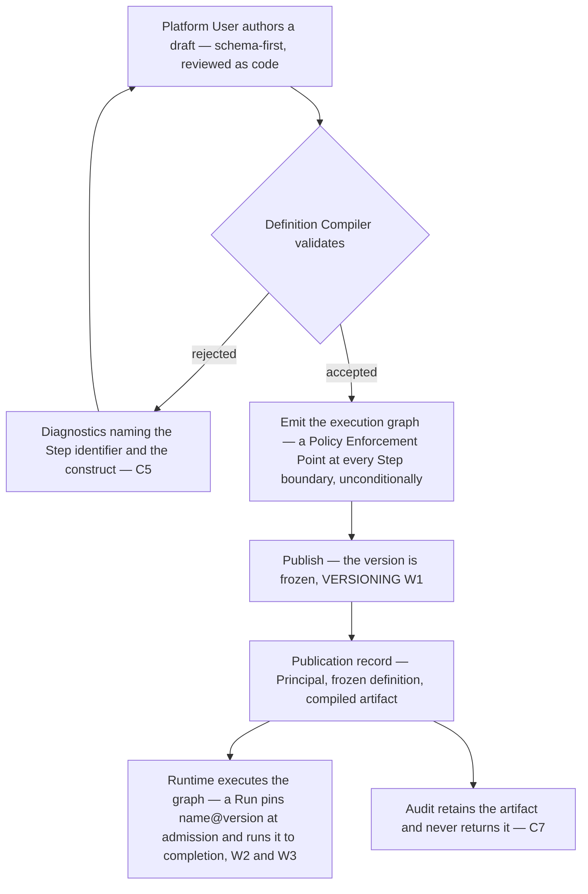

# Workflow Definition Language

This document is **informative** under [`../README.md`](../README.md) section 3, which makes
[`../30-protocol/`](../30-protocol/) and [`../40-governance/`](../40-governance/) normative and
everything else informative *unless it says otherwise*.
[`../VERSIONING.md`](../VERSIONING.md) says otherwise on its first line, and this document leans on
it harder than on anything else. The language is nonetheless a permanent public contract:
[ADR-0008](../adr/adr-0008-declarative-workflow-definitions.md) accepts that outright, and
[`../VERSIONING.md`](../VERSIONING.md) section 8 calls customer-authored workflows the platform's
most dangerous versioning problem. [RFC 2119](https://www.rfc-editor.org/rfc/rfc2119) keywords
therefore bind where this document specifies the language or the semantics of compilation, and are
used sparingly where another document owns the rule.

Where a governance rule binds this language it is cited, never restated:
[`../40-governance/policy-model.md`](../40-governance/policy-model.md) owns Policy Enforcement
Points, [`../40-governance/approval-workflows.md`](../40-governance/approval-workflows.md) approval
routing, [`../40-governance/tool-authorization.md`](../40-governance/tool-authorization.md) grants,
[`../40-governance/audit-model.md`](../40-governance/audit-model.md) what publication records.
Per-type semantics belong to `step-types.md`, run-time semantics to `execution-semantics.md`.

Orchestra is pre-implementation and pre-customer. **No timeout, retry count, backoff figure, step
limit, nesting depth, payload size or retention period appears here. None has been decided.**

## 1. What a Workflow definition is

A **Workflow** is a versioned, declarative graph of Steps defining a business process
([`../GLOSSARY.md`](../GLOSSARY.md)). Steps may be deterministic or agentic. What a customer authors
is a *definition document*; what executes is a *compiled graph*. Never the same artifact, and only
the first is a contract.

**L1 — Declarative means the author states what, and the compiler decides how.** A definition
declares Steps, their types, their Side-Effect Classes, their bindings and the edges between them.
It MUST NOT contain executable customer code, and no construct may mean "run this". ADR-0005 names
the escape hatch for a pattern the language cannot express: a reviewed custom step type.

**L2 — A definition is tenant-scoped, optionally Workspace-scoped.** Tenant scoping is domain
model I1 and [ADR-0011](../adr/adr-0011-tenant-isolation-shared-schema-rls.md); that a Workspace is
optional and is not an isolation boundary is
[`../20-domain/domain-model.md`](../20-domain/domain-model.md) section 3. A Workspace scopes
administration and visibility, never isolation.

**L3 — Nothing in the language may suppress a Policy Enforcement Point.**
[`../40-governance/policy-model.md`](../40-governance/policy-model.md) E2 states the prohibition and
E3 the coverage, both normative and both binding here. Cited, not restated — it is the rule a
language document is most tempted to soften. What this document adds is only the consequence: the
author has no opt-out to write, because the opt-out is not a construct, and section 4 is how that is
made true rather than promised.

**L4 — No rail vocabulary appears in the language.** The orchestration runtime's, a model provider's
and the tool protocol's vocabularies MUST NOT appear in a key, enum value, step type or diagnostic
(ADR-0005, `gateway-api.md` G17, `audit-model.md` A8), and a Checkpoint is not addressable from a
definition (domain model I6). Durability, checkpointing, interrupts and the resume mechanism are the
runtime library's and absent from the language deliberately
([ADR-0016](../adr/adr-0016-compile-to-the-langgraph-library.md)). Run supervision is absent too,
for the opposite reason: it is Orchestra's own subsystem
([ADR-0014](../adr/adr-0014-run-supervisor-is-orchestras.md)), and a definition declares a process,
not how the platform schedules one. ADR-0008 called what remained "a schema and a compiler"; it was
a schema, a compiler and a run supervisor.

## 2. The document shape

| Key | Required | Meaning |
| --- | --- | --- |
| `name` | Yes | Stable identifier within the Tenant. Never renamed, never reused — a decision this document takes, with its reason in L5 |
| `version` | Assigned | Assigned by publication, not authored. A draft carries none |
| `workspace` | No | Administrative scope. Never an isolation boundary |
| `inputs` | Yes | The declared values a Run supplies at admission. MAY be empty |
| `entry` | Yes | The Step at which execution begins |
| `steps` | Yes | Declared Steps, keyed by author-assigned identifier |
| `edges` | Yes | The graph. Control flow lives here and nowhere else |

**L5 — Identity is a name plus a publication-assigned version**, addressed `purchase-approval@3` in
the form W2 uses. Publication assigns and freezes it (W1). The author writes no version number: an
author-supplied one makes immutability an authoring convention, since two drafts could claim `@3`.
The name is never renamed and never reused. That is taken here rather than inherited — R4's
never-reused rule covers Orchestra's own document, ADR and RFC identifiers, not customer-authored
names — and for one reason: a definition is retained for the full audit-retention period (W4), so a
reused name makes every audit reference to it ambiguous across that period.

**L6 — Every Step declares an identifier unique within the version, a type, and a Side-Effect
Class.** The identifier is authored, not generated, being the unit of traceability (C6) and the
anchor of every diagnostic (C5). A Step with no business effect declares a class too: the class is
an input to policy, never a precondition for evaluation (E3).

**On a `tool` Step the declaration is a restatement the compiler checks, never an assertion it
adopts.** The authoritative value is the one the Tool Catalog recorded at registration
([`../40-governance/tool-authorization.md`](../40-governance/tool-authorization.md) TA9,
`step-types.md` S2), and section 5 rejects a mismatch rather than believing the definition. What the
declared value constrains on the seven types that reach no Tool of their own is unmade, and is
registered in section 11.

**L7 — A `tool` Step names exactly one Tool to invoke; every other type names none**
([`../20-domain/domain-model.md`](../20-domain/domain-model.md) section 5). It pins the MAJOR
version of that Tool's schema (W5). A Tool MAJOR bump surfaces as an actionable warning in the
Control Plane and MUST NOT alter a published definition.

**A compensating action declared on that Step is a second Tool invocation and is not a second
Step**, which is why L7's count holds with one in the example below. `execution-semantics.md` X21
fixes what the declaration contains — one registered Tool, the arguments as they would execute, the
schema MAJOR the version pins — and X16 fixes what it is: an ordinary business action whose class is
the Tool's own (TA9). It therefore carries no Step identifier, declares no class and adds no Step
boundary. It is governed where every Tool invocation is governed, at the enforcement point
[`../40-governance/policy-model.md`](../40-governance/policy-model.md) E1 places before any Tool
invocation — not by a Step boundary, there being no Step — and section 5 validates the Tool it names
on the same terms as the one it compensates. Whether the language admits a compensating action that
is anything other than a Tool invocation is open, assigned here by X21 and registered in section 11.

**L8 — Control flow lives in `edges`, never inside a Step body.** The trade-off is real: an explicit
edge list is more verbose than a `next` field per Step. It buys a graph analysable without reading
any Step body — what the reachability, acyclicity and enforcement-point passes need — and a
version-to-version diff a reviewer can read, which schema-first authoring depends on (section 9).
The two types that would otherwise pull a target into a Step body are `condition` and `parallel`:
under L8 such a Step declares the outcome labels and the edges leaving it carry the targets. What
each type declares is `step-types.md`'s; the graph shape is this document's.

**L9 — An unrecognised construct is rejected, not ignored, and the compiler rejects it rather than
the schema.** R3's must-ignore rule binds *consumers* of an Orchestra contract; the compiler is not
one, but the authority deciding what a definition means. Ignoring an unknown key or step type drops
the author's intent, and where that intent was a governance one the loss is invisible. R3
deliberately does not reach here.

That settles who rejects, not how, and the how is constrained already:
[`../VERSIONING.md`](../VERSIONING.md) section 6 forbids `additionalProperties: false` on any
wire-facing object, and the `workflow-definition` slot reserved there is one. So the closure cannot
live in the schema. It lives where [`../30-protocol/ui-protocol.md`](../30-protocol/ui-protocol.md)
CC3 already put the same closure for the component catalog — closed by lookup, not by a closed
schema: the schema stays open and a compiler pass checks every construct against an allow-list of
recognised ones. Same rejection, and additive evolution survives it.

## 3. A worked example

```yaml
# purchase-approval@3 — published and frozen (VERSIONING W1)
name: purchase-approval
workspace: finance
version: 3
inputs:
  purchase_request_id: { type: string, required: true }
entry: fetch-request
steps:
  fetch-request:
    type: tool
    side_effect_class: read
    tool: { name: erp.purchase_request.get, schema_major: 1 }
    arguments: { request_id: "${inputs.purchase_request_id}" }
  assess:
    type: agent
    side_effect_class: read
    # Shown pinned, and the question is open: whether an `agent` or `subworkflow` Step pins the
    # version it names or resolves the Active one at run time is an ADR — section 11.
    agent: { name: procurement-analyst, version: 2 }
    input: { request: "${steps.fetch-request.output}" }
  route:
    type: condition
    side_effect_class: read
    when: "<predicate — syntax undecided, see section 8>"
  approve:
    type: approval
    side_effect_class: read
  issue-po:
    type: tool
    side_effect_class: financial
    tool: { name: erp.purchase_order.create, schema_major: 2 }
    arguments: { request_id: "${inputs.purchase_request_id}" }
    compensation:
      # A Tool invocation, not a second Step — L7, with execution-semantics.md X21 and X16.
      tool: { name: erp.purchase_order.void, schema_major: 2 }
      arguments: { purchase_order_id: "${steps.issue-po.output.purchase_order_id}" }
  notify:
    type: tool
    side_effect_class: external-communication
    tool: { name: notify.email.send, schema_major: 1 }
    arguments: { to: "${steps.fetch-request.output.requested_by_email}" }
edges:
  - { from: fetch-request, to: assess }
  - { from: assess, to: route }
  - { from: route, to: approve, branch: satisfied }
  - { from: route, to: notify, branch: otherwise }
  - { from: approve, to: issue-po }
  - { from: issue-po, to: notify }
```

**Illustrative, and bounded by section 2.** What the example specifies is the shape section 2's
table gives, and nothing past the keys in that table. Everything else is notation chosen to make the
shape readable, and MUST NOT be read as decided: the predicate in `route`, the `${…}` references and
the branch labels leaving `route`, which are one question registered in section 8; the `inputs` type
notation and the choice of YAML as the concrete syntax, registered with the type system in section
11; the `tool: { name, schema_major }` object shape; the version pin on `assess`; and the class
declared on the `agent`, `condition` and `approval` Steps, whose meaning on a type that reaches no
Tool is itself open in section 11. A list of exceptions has to be recounted every time the example
changes; the rule that the table is the specification does not.

[`examples/purchase-approval.md`](examples/purchase-approval.md) walks this definition through as a
Run, enforcement point by enforcement point.

**No threshold appears in `approve`, and none may.** That a gate belongs here is the Step's own
declaration and not Policy's to override — `step-types.md` owns that rule and states it. What the
gate then costs is Policy's: the Approval Chain, the routing and who may satisfy it are owned by
[`../40-governance/approval-workflows.md`](../40-governance/approval-workflows.md) and
[`../40-governance/policy-model.md`](../40-governance/policy-model.md), and unmade in both. A
threshold written into a definition is a control the author moves by publishing, not one an
administrator owns.

## 4. Compilation is the governance mechanism

The language is compiled rather than interpreted for a governance reason, not a performance one. An
interpreter executes the definition the author wrote; a compiler produces the graph that executes,
and can therefore place into it things the author did not write and cannot remove. The Policy
Enforcement Point at every Step boundary is such a thing, and
[ADR-0003](../adr/adr-0003-governance-layer-positioning.md) makes those points the Data Plane's
architectural centre.

**C1 — Compilation happens at publication.** Publication validates, compiles, freezes the version
(W1) and records the act with the acting Principal, the frozen definition and the compiled artifact
([`../10-architecture/control-plane.md`](../10-architecture/control-plane.md) section 5).

**C2 — The compiler emits a Policy Enforcement Point at every Step boundary** (ADR-0005, ADR-0008,
`policy-model.md` E1 and E2). Emission is unconditional: every Step, every type, every Side-Effect
Class, never a function of what the definition says. That is what makes L3 a guarantee, not a
request.

**C3 — Compilation is total.** A definition compiles and publishes or is rejected whole, so nothing
uncompiled reaches the Runtime. A partially governed process is indistinguishable from a governed
one at run time, which is why there is no partial publish.

**C4 — Compilation is deterministic.** The same definition version MUST compile to the same graph;
ADR-0005 mitigates compiler defects with golden tests and retained snapshots, and neither means
anything without it.



The guarantee has a price, and ADR-0005 accepts it: a compiler carries a correctness burden and
adds indirection when debugging. C5 and C6 pay that down.

## 5. What the compiler validates, and what it rejects

| Class | What is checked | On failure |
| --- | --- | --- |
| Construct recognition | The document conforms to the published definition schema, and every key, closed-set value and step type is one the compiler recognises — checked against an allow-list, the schema itself staying open | Rejected — L9 |
| Step-type membership | Every `type` is in the closed set of section 7 | Rejected — L10 |
| Side-Effect Class | Every Step declares one, from the enumeration fixed in the glossary | Rejected — L6 |
| Registered class match | On a `tool` Step the declared class equals the class the Tool Catalog recorded at registration. A restatement that differs is a mismatch, never an override | Rejected — L6, `tool-authorization.md` TA9, `step-types.md` S2 |
| Compensation | Every `write`, `destructive` and `financial` Step declares a compensating action | Rejected — `execution-semantics.md` X15 |
| Tool reference | Every Tool named — the Step's own and the one in its compensating action — is registered in this Tenant's Tool Catalog, pins its schema MAJOR, and passes arguments conforming to that major | Rejected — L7, W5, `execution-semantics.md` X21 |
| Agent and Workflow reference | An `agent` or `subworkflow` Step names something that resolves within the Tenant and is published rather than draft. Whether the reference pins that version is unmade, so no pinning check is specified either way | Rejected — `step-types.md` section 5; section 11 |
| Graph well-formedness | Step identifiers unique, `entry` names a declared Step, every edge names declared Steps, every Step reachable from `entry`, and the graph acyclic | Rejected — L8, L11 |
| Rail vocabulary | No runtime, provider or tool-protocol vocabulary in any name or value | Rejected — L4 |

One absence is deliberate: **nothing is warned and published**, a compile-time warning on a
governance construct being an unenforced rule. Acyclicity is not an absence. It is the
deny-by-default of L11, taken because declining to check would itself have decided the question, in
the direction W1 makes hardest to reverse.

**C5 — Diagnostics are a user-facing surface and MUST be built as one**, which ADR-0005 says in
those words. A diagnostic MUST identify the Step by the author's identifier and the construct by its
path, MUST state what was expected, and MUST NOT contain rail vocabulary (L4) — one naming the
runtime leaks it as surely as an API field would.

## 6. Traceability, and the artifact that is never returned

**C6 — Every compiled graph MUST retain a traceable link back to its source definition, its version
and its Step identifiers** (ADR-0005). Without it, an operator debugging a Run is debugging the
runtime rather than the process — the experience the developer persona refuses on.

**C7 — The compiled artifact is retained for audit and never returned.** The publication record
keeps it so a Run's process can be reconstructed, and the tenant-readable surface MUST NOT return it
(`audit-model.md` sections 3 and 8, A8, `gateway-api.md` G17): returning it would put the
orchestration runtime's vocabulary into a customer-facing contract. A Tenant reads back the version
it published and the identifiers resolving to it. The definition is retained for the full
audit-retention period (W4); that period is undecided, owned by `audit-model.md` section 11.

## 7. The step-type set is closed, and stays closed

**L10 — The step types are `agent`, `tool`, `approval`, `condition`, `parallel`, `wait`, `transform`
and `subworkflow`, and additions are deny-by-default. Every new type requires its own ADR**
([`../00-overview/scope-and-non-goals.md`](../00-overview/scope-and-non-goals.md) section 2.4). This
is a rule of this document, not a note attached to one: ADR-0008 rates *the definition language
grows into a programming language* its highest risk on both axes, and L10 is the whole mitigation.

The arithmetic explains why the gate is an ADR and not a schema review. Adding a type is MINOR under
R2 and costs a customer nothing. Removing one is MAJOR, and VERSIONING section 10 gives a step type
24 months of notice — matching a Gateway API major version, the longest in that table. Cheap to add,
close to irreversible: the profile that belongs in an ADR. ADR-0005's escape hatch is itself a step
type, gated identically — it admits a capability under review rather than around it.

## 8. Expressions — where a definition language becomes a programming language

L10 is necessary and it is not sufficient. The step-type set can stay closed while the language
becomes a programming language anyway, because the pressure does not arrive as a step type. It
arrives as an expression, through three doors into one room. A `condition` Step needs a predicate. A
Step consuming an earlier Step's output needs a reference. A `transform` Step is, by its name, a
body of expression.

Each door opens the same way. A predicate needs a comparison, then a conjunction, then a null check,
then a date comparison, then arithmetic on an amount, then a string function "just for
normalisation". No step in that sequence is unreasonable and none adds a step type, so none trips
L10. By the time it is visible as a language it is a contract under W1, additive-only under R3, and
frozen into every definition already written against it.

The options are different products, not points on a scale:

| Option | What it is | What it costs |
| --- | --- | --- |
| No expression language | Predicates are structured comparisons in the schema — a reference, an operator from a closed set, a literal. References are static paths | Narrowest surface, and the likeliest not to express a real process. Pressure moves to the escape hatch, where each relief costs an ADR |
| A restricted declarative form | A closed operator set. No user-defined functions, no iteration, no I/O, evaluation total by construction | The most specification work, and a boundary defended forever, because every proposed addition looks small |
| An existing expression language | Adopt a third-party specification and its evaluator | Inherits someone else's versioning and someone else's escape hatches, and puts a third-party evaluator on the path of every Step |
| A general-purpose evaluator | Embed a scripting engine | Reverses L1 — the definition would contain code — and places arbitrary evaluation inside the very Step boundary the enforcement point exists to govern |

**This is not decided, and this document MUST NOT decide it.** It is ADR-shaped on exactly the
grounds `policy-model.md` section 8 gives for the policy language — the same question at a different
enforcement point. It becomes a permanent public contract the moment a customer authors against it,
it constrains the compiler, the authoring surface, the audit representation and the
`workflow-definition` schema slot reserved in VERSIONING section 6, and the four options fail in
different ways rather than at different prices. Whether it and the policy language are one language
is part of that decision, not a detail of it: one language is one surface to defend and one
evaluator to secure, two are two.

**Expressions are one pressure on the closed set; iteration is the other.** It is the same risk in
other clothes: a cycle plus a predicate is a loop, and a loop is where step limits, iteration bounds
and non-termination arrive — none decided, and none this document may invent.

**L11 — A cyclic graph is rejected at compile time, and the language admits no iteration until an
ADR admits one.** Declining to check would not have been neutral. It would have decided the question
in the permissive direction, and W1 then freezes every definition written under it: admitting cycles
later is MINOR under R2, while withdrawing them is MAJOR and needs deprecation under R5 against
every definition already published. Deny-by-default is the reversible direction, and it is the rule
this document already applies to an unrecognised construct (L9) and to a ninth step type (L10).
What it costs an author is every process a loop expresses, and what would restore them is the ADR
registered in section 11 — which has to supply the bounds first, because a language that admits
non-termination with no bound decided anywhere is not a governed one.

## 9. Schema-first authoring, and why there is no designer at MVP

ADR-0008 follow-on 4 rules out a visual designer at MVP. Authoring is schema-first: a definition is
a document, reviewed as code, published through the Control Plane (`control-plane.md` section 5).

The reason is not that a designer is undesirable — ADR-0008 says plainly it is *where workflow
products most often stall*. A designer is a second complete representation of the language: every
construct needs a visual form, every diagnostic a place on a canvas, every language change becomes
two. Building one first freezes the language around what the canvas can draw, and section 8 is open.

Nothing here says a designer will never exist. ADR-0008 records the countervailing risk — customers
may demand one to adopt — rates it Medium on both axes, and states that schema-first does not
preclude one later. What is fixed is the ordering: the document is the contract, a designer is a
client of it, and a definition authored in one MUST be the same document as one typed by hand.

## 10. What VERSIONING already fixed, seen from the author's chair

Cited, not decided here. [`../VERSIONING.md`](../VERSIONING.md) section 8 is where these live.

| Rule | What an author sees |
| --- | --- |
| W1 | A published version cannot be edited. Editing opens a draft, which publishes as a new version |
| W2 | A Run started on `purchase-approval@3` executes `@3` to completion — after `@4` is published, and after `@3` retires |
| W3 | An in-flight execution is never migrated, and the request to migrate one is refused rather than scheduled |
| W4 | Retirement drains rather than kills, and the definition is retained for the full audit-retention period |
| W5 | A version pins each referenced Tool schema's MAJOR. A bump warns and never alters |

## 11. Open questions

Every row is a decision this document could not make. **ADR** means costly to reverse or spanning
components. Rows marked *repeated* carry another document's classification unchanged.

| Question | ADR required? | Decided by |
| --- | --- | --- |
| The expression language — predicates, data references and `transform` bodies, which are one question and not three | **ADR** | An ADR of its own, on the grounds `policy-model.md` section 8 gives for the policy language. Whether the two are one language is part of the decision. Section 8 sets out the four options and why they differ in kind |
| What admitting a cycle would require — a step limit, an iteration bound and an answer for non-termination — and so whether the language ever admits iteration | **ADR** | The same ADR, or one beside it. L11 rejects a cyclic graph in the interim, so nothing frozen under W1 depends on an answer nobody has given; admitting cycles later is MINOR under R2, withdrawing them would be MAJOR. The ADR has to supply the bounds, not only the permission |
| Whether a `tool` Step naming a Tool is itself the permission, or Workflows need a grant subject of their own | **ADR** — *repeated* | [`../40-governance/tool-authorization.md`](../40-governance/tool-authorization.md) section 10, which assigns it jointly here. Disposition below |
| Whether the Step-boundary and Tool enforcement points collapse into one evaluation for a `tool` Step | Document — *repeated* | [`../40-governance/policy-model.md`](../40-governance/policy-model.md) section 9, with a later revision of that document. Disposition below |
| Whether an `agent` or `subworkflow` Step pins the version of the definition it names, or resolves the Active one at run time | **ADR** | This document with `step-types.md`, read against W1 to W3 and invariant I3. Resolving Active at run time lets a published version's behaviour change without republishing it, which W1 exists to prevent, and lets a Run reach logic published after its own admission, which I3 and W2 exist to prevent; pinning makes a nested definition undrainable while any caller is published. Neither cost has been accepted, and the `subworkflow` half is only answerable once `step-types.md` section 13 settles whether a sub-execution is a separate Run. The worked example shows a pin and says it is undecided |
| What a Side-Effect Class means on the seven types that reach no Tool of their own, and whether the compiler constrains the declared value or accepts the author's assertion | **ADR** — *repeated* | [`../40-governance/policy-model.md`](../40-governance/policy-model.md), whose rule N1 makes the class a primary evaluation input, with this document; registered by `step-types.md` section 13. Disposition below |
| Graph shape past well-formedness — whether a `condition` branch set must be exhaustive, and whether a `subworkflow` reference cycle is reachable across definitions, which is where recursion and nesting depth live | Document | This document, which owns schema and graph shape; assigned here by `step-types.md` section 13. L11 rejects a cycle inside one definition and says nothing about one spanning several |
| Whether concurrent branches of a `parallel` Step may write the same data, and what wins if they do | Document | This document with the type-system row below, data flow being a schema question; assigned here by `step-types.md` section 9 |
| The type system for `inputs` and Step outputs, whether the schema borrows an existing schema language, and which concrete syntax is canonical | Document | This document with the `workflow-definition` schema slot reserved in [`../VERSIONING.md`](../VERSIONING.md) section 6. W1 needs one canonical form to freeze and to diff. Cheaper to take after the expression-language ADR |
| Whether compiler diagnostics are a versioned contract with stable codes a customer's build can assert against | Document | This document with the error-envelope decision registered in [`../30-protocol/gateway-api.md`](../30-protocol/gateway-api.md). C5 fixes a diagnostic's content, not its stability |
| What a reviewed custom step type is, and what review admits one | **ADR** | ADR-0005 names it as the escape hatch and ADR-0008 requires an ADR per step type, so each instance is gated. The general shape of the hatch is unmade |
| Whether a rejected or expired approval gate fails the Run or takes a declared rejection branch, and so whether the language admits a rejection edge | **ADR** — *repeated* | [`../40-governance/approval-workflows.md`](../40-governance/approval-workflows.md) section 8, shared with `step-types.md` |
| Whether the language admits a compensating action that is anything other than a Tool invocation | Document | This document, assigned here by `execution-semantics.md` X21. That document's section 6 now fixes what a declaration contains and what executing one means — X15 to X21 — leaving only what the language admits, which L7 does not widen |
| Whether a definition may be imported from a customer-held repository rather than authored in the Control Plane | Document | A product decision with `control-plane.md` in [`../10-architecture/`](../10-architecture/); ADR-0008 requires only that authoring be schema-first and reviewed as code |

**Questions assigned here, and their disposition.** `tool-authorization.md` section 10 assigns the
grant-subject question jointly to this document. Taking it: the language contributes L7 and nothing
more — a `tool` Step names one Tool and pins its schema MAJOR — and cannot decide whether that
naming *is* the permission. The constraint it adds is that domain model I5 separates registration
from permission; were naming granting, publication would become an authorization-granting act, and
any Platform User who may publish would hold every grant a definition can name. The row stays
**ADR** where its owner put it. `policy-model.md` section 9 assigns the collapsed-enforcement-point
question jointly. Taking that one: the language expresses neither answer, since a `tool` Step
declares a Tool and a Side-Effect Class and says nothing about enforcement, so the choice is
invisible to an author and visible only in the audit trail as one Policy Decision or two. The
constraint added here is that E6 must survive the collapse — the action evaluated must be the action
executed — so one evaluation works only where it has the Tool's arguments in hand. The
classification stays Document, with its owner.

`step-types.md` section 13 assigns the Side-Effect Class question jointly. Taking it: the language
contributes L6 and section 5 and nothing further — every Step declares a class; on a `tool` Step the
declaration is checked against the Catalog and a mismatch rejected (TA9, S2); on the other seven the
compiler can check membership of the enumeration and no more, because no more is decided. The
constraint the language adds is that whatever the value comes to mean there, it MUST NOT become a
self-issued exemption: E3 evaluates every Step whatever the class, so an author writing `read`
narrows no coverage and buys no silence. The row keeps the **ADR** classification its registering
document gave it, with `policy-model.md`.
