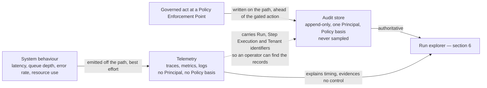
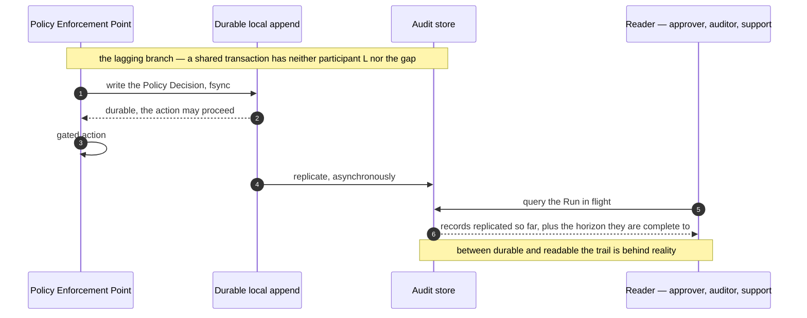

# Observability

What Orchestra can see of itself, and what a customer can see of a Run. The first thing this
document has to fix is the boundary between audit and telemetry, because every other question here
resolves differently on either side of it. [`../GLOSSARY.md`](../GLOSSARY.md) states the rule in one
sentence — *audit is a product surface, not a log level* — and everything below is that sentence
applied to traces, metrics, signals and the Run explorer.

## 1. Standing, scope, and the numbers that are not here

**Not normative.** Per [`../README.md`](../README.md) section 3, only
[`../30-protocol/`](../30-protocol/) and [`../40-governance/`](../40-governance/) bind an
implementation. Where a rule binds, this document links to it rather than restating it.

**In scope.** The telemetry side of the audit boundary, the observable signal for a degraded audit
write period, replication lag as a read-path property, quota queue depth and the surfaced delay, the
Run explorer, and tracing across the boundary an Agent Run creates. **Out of scope:**
instrumentation libraries, storage engines, dashboard products and alert routing — none is chosen
or implied — and **every number.** No retention period, latency target, service level objective,
error budget, alert threshold, health-check interval, sampling rate, queue-depth bound, backoff
figure or rate limit is decided anywhere in this repository, and none is invented here; where a
figure is load-bearing this document states what bounds it and registers it in section 9. Orchestra
is pre-implementation and pre-customer, so a figure written now would be a guess wearing the clothes
of a decision.
[ADR-0004](../adr/adr-0004-adopt-ag-ui-event-protocol.md) and
[ADR-0007](../adr/adr-0007-outbound-connector-for-enterprise-reachability.md) are **Proposed**, and
everything resting on them is provisional and marked at each use.

## 2. Audit is not telemetry, and telemetry is not audit

[`../40-governance/audit-model.md`](../40-governance/audit-model.md) section 10 owns the test and
this document does not re-derive it: a fact is an Audit Record if it answers *who did what, when, on
what basis, and under which Policy*, which requires a Principal and, where one applies, a Policy
basis. A fact with neither is telemetry, and telemetry is this document's.

| Property | Audit Record | Telemetry signal |
| --- | --- | --- |
| Answers | Who acted, on what basis, under which Policy | What the system did, how long it took, how loaded it was |
| Principal | Exactly one, always — invariant I2 | None. That is the definition, not an omission |
| Policy basis | Present, or explicitly stated as absent — never left out | Not applicable |
| Sampling | Forbidden for every audited act — audit-model section 3 | Expected, and what makes it affordable |
| Lifetime | Append-only and immutable; a correction appends. Retention driven by regulation, dispute window and investigation reach, and undecided | Aggregated, downsampled and expired on an operational schedule, driven by usefulness against cost |
| Read by | A Platform User or Service Account of the Tenant, each by explicit administrative grant — [`../10-architecture/identity-and-access.md`](../10-architecture/identity-and-access.md) section 6 derives it | Orchestra's operators — and the Tenant too, wherever the Run explorer of section 6 renders it, at which point A8 and section 8's redaction rules bite |
| Written by | The component that took the decision, on the governed path | Any component, off the path |
| Store unreachable | [ADR-0013](../adr/adr-0013-fail-closed-policy-decision-writes.md) governs — section 3 | The signal is lost and nothing else stops |

Three rules follow from documents that bind, and are quoted with their rule identifiers rather than
re-derived here. Audit MUST NOT be reconstructed by parsing logs, traces or metrics, and those
artefacts MUST NOT be presented as the audit trail (audit-model A6). Sampling MUST NOT be applied to
any audited act, because a sampled control cannot be evidenced (audit-model section 3). And every
log line carries a tenant identifier (invariant I1 of
[`../20-domain/domain-model.md`](../20-domain/domain-model.md)) — section 8.

**A meter record is neither.** It has no Principal and no Policy basis, so the test read carelessly
would sweep it into telemetry, and [`quotas-and-metering.md`](quotas-and-metering.md) sections 10
and 12 forbid exactly that: a meter record is tenant-scoped, append-only, never sampled, and
reconcilable by a join to one occurrence in the audit trail, because a bill has to be defensible in
a dispute. It is a third class with its own owner, so nothing in the table above applies to it and
the store registry of section 8 does not sweep the metering store into the telemetry class.

**A refusal is not a fault, and no fault signal may count one.**
[`reliability.md`](reliability.md) rule F4 assigns the operational half here: an error rate, an
alert or a health computation that counts a policy `deny`, a rejected approval or an expired gate
reports a governance platform doing its job as an outage, and the more governance a Tenant
configures the worse its reliability looks. The separation already exists in the records —
[`../50-workflows/execution-semantics.md`](../50-workflows/execution-semantics.md) section 10 keeps
six outcomes distinct — and a signal computed from a coarser bucket throws it away on the way to a
dashboard.

**Connector health is where the test does not settle, and two documents defer it here.**
[`../40-governance/audit-model.md`](../40-governance/audit-model.md) section 10 states the tension
and leaves it **undecided**: a Connector flapping between `Healthy` and `Degraded` has no actor,
which the test calls telemetry, while ADR-0009 meters Connectors *by health* and audit-model section
7 requires every metered occurrence to be an audited fact carrying a shared identifier.
[`../20-domain/lifecycle-state-machines.md`](../20-domain/lifecycle-state-machines.md) section 5.2
defers the same boundary to the same pair. The half available without the decision is what the
telemetry side would have to supply for the metered dimension to reconcile at all: a tenant
identifier, the Connector, and a transition identifier a meter record can join on — a join, not a
count, so a sampled or downsampled signal cannot supply it, and that is the cost of answering
*telemetry*. Two constraints hold on either answer and are audit-model section 10's rather than this
document's: a Step Execution that failed because a Connector was unreachable is a governed outcome
audited with its cause, and Connector state MUST NOT be used to infer that a side effect did not
occur. ADR-0007 is **Proposed**, so the Connector lifecycle underneath is provisional. Registered in
section 9.

**Correlation runs one way.** A telemetry signal may carry the Run, Step Execution and Tenant
identifiers that let an operator find the corresponding records. The reverse does not hold:
audit-model A4 requires a record to be reconstructable without reference to any other system, so a
record that needs a trace to be intelligible is defective, and an expired trace takes nothing with
it. The arrow that does not exist in the diagram below is the load-bearing part.

Blurring the line costs in both directions, and audit-model section 10 names both: telemetry in an
append-only immutable store inherits retention obligations it does not deserve, and a governance
fact in telemetry is sampled and expired until the control it evidences cannot be evidenced.

## 3. The degraded-period signal

[ADR-0012](../adr/adr-0012-policy-decisions-are-audit-records.md) makes a Policy Decision a class of
Audit Record, and [ADR-0013](../adr/adr-0013-fail-closed-policy-decision-writes.md) splits the audit
write by that class: a Policy Decision MUST be durable before the gated action is attempted, and
other Audit Records MAY degrade — buffered, retried, written behind the action — provided the
degradation is observable. The signal itself is specified once, by
[`reliability.md`](reliability.md) section 8, which ADR-0013 and
[`../40-governance/audit-model.md`](../40-governance/audit-model.md) A6 name as its owner. This
section specifies only how it is surfaced and read, and does not restate it.

**A failed Policy Decision write is not a degraded period.** It is a halt: the action does not
proceed. Degradation is only ever about the second class, and conflating the two would let an
availability argument reach the strict path, which ADR-0013 forecloses by making the class a
property of the record rather than a runtime choice. The two are not alternatives, though.
[`reliability.md`](reliability.md) F11 notes that an audit-store outage will usually open a degraded
period *concurrently*, for the second class buffering behind the same failure — so a reader may well
meet a bracket over the interval in which a gated action halted, and the bracket does not describe
the halt.

A **degraded period** is an interval during which writes in the degradable class were buffered,
retried or written behind the acts they describe. [`reliability.md`](reliability.md) rules F13 and
F14 fix what brackets one and what the bracket must survive and carry; the word is that document's
and is used here rather than a second one. What this section owns is what the bracket has to do on
the read path, which is four things.

- **It rides a path the failure cannot swallow.** A bracket recorded only into the store that is
  failing is not a signal — F13 puts it on the durable local append ADR-0013 already places on the
  enforcement path.
- **It attaches to the range, not to a console.** A query whose range overlaps a degraded period
  returns the bracket alongside the records. The reader who most needs the caveat is an auditor
  reading a trail months later, not an operator watching a dashboard on the day.
- **It states what is missing in kind.** F14 puts three things in the bracket — the interval, the
  record classes affected, and enough to tell whether the buffered records later arrived — so that a
  reader can say *records of this class in this interval are incomplete*. A bracket saying only
  *something was degraded* converts a bounded gap into unbounded doubt about the whole trail, which
  is worse than the gap.
- **Its closure is a claim, and there are two different claims.** F14's *whether the buffered
  records later arrived* reads on the trail as two outcomes, not one: they landed, or they did not
  and the gap is permanent. A single *resolved* conflates recovery with abandonment — the defect
  audit-model section 5 names when it requires `Expired` to stay distinct from `Rejected`.

**The failure this exists to prevent is silence.** A gap nobody can see is read as nothing having
happened, and absence read as non-occurrence is the exact failure ADR-0013 names in its risk table.
[`../30-protocol/event-protocol.md`](../30-protocol/event-protocol.md) rule O2 prevents the same
failure on the event stream by another mechanism, and cites ADR-0013 for the reason.

**Ownership splits cleanly.** [`reliability.md`](reliability.md) owns the failure taxonomy, how
degradation is detected and what ends it —
[`../40-governance/audit-model.md`](../40-governance/audit-model.md) section 13 assigns it there and
classifies it as needing a document rather than an ADR. This section owns what a reader of the trail
sees, and nothing else.

**What is not decided.** Whether the bracket is itself an Audit Record class — audit-model section 3
is the enumeration of audited events and decides it, and reliability.md registers it as needing a
document rather than an ADR. Note the friction either way: a bracket has no acting Principal, since
degradation is an observed condition rather than an act, which is the attribution class audit-model
section 9 holds open. Nor is there any bound on how long a degraded period may run before execution
stops, and such a bound would reintroduce the coupling ADR-0013's split exists to remove:
operational audit volume able to halt a Run after all.

## 4. Replication lag is a governed property

ADR-0013 is precise about what *durable* means: the decision survives a crash before the gated
action, not that it has reached the audit store. A local append replicated afterwards satisfies the
rule. That produces three states where a reader intuits two — **durable**, **replicated**,
**readable** — and the gap between the first and the last is where a Run in flight is read.

Whether the gap exists at all is a property of the mechanism, not of the requirement.
[`../10-architecture/data-plane.md`](../10-architecture/data-plane.md) section 6 lays it out: a
shared transaction with the datastore has no lag and puts a network round-trip on the enforcement
path instead; a durable outbox or a node-local append has lag and keeps the round-trip off it. The
mechanism is undecided and registered **ADR** in that document's section 11, repeated in section 9.
The diagram below draws the lagging branch only, because it is the branch that creates a read-path
problem at all: on the shared-transaction branch there is no separate append, no replication step
and no gap, and nothing else in this section applies.

**The signal has three parts.**

- **A completeness horizon on every answer.** The point up to which the trail is known complete,
  carried with the result. [`reliability.md`](reliability.md) F15 is the rule it satisfies —
  absence MUST be readable as *not yet seen* rather than *did not happen* — and the horizon is how
  a reader tells *no record exists* from *no record yet visible*. The negative reading is the one an
  auditor asks for. Where the mechanism has no lag the horizon is the present moment rather than
  absent, so one contract holds either way.
- **The lag itself, watched.** Not a value stamped on a response and read by nobody: it bounds how
  current every Control Plane read of a Run in flight can be, which gives it a consumer.
- **A distinction the horizon cannot make alone.** A node lost holding unreplicated appends is
  *lost* audit, not stale audit (data-plane section 6), and a Policy Decision cannot be
  regenerated — [`../40-governance/policy-model.md`](../40-governance/policy-model.md) D5. The
  horizon reports how far the trail is known good; whether the missing tail is arriving or gone is
  recovery, and [`reliability.md`](reliability.md) owns it.

**A registered question, answered.**
[`../10-architecture/control-plane.md`](../10-architecture/control-plane.md) section 8 and
data-plane.md section 6 hand the same question here: how the audit surface says what it has not yet
seen, so that *no record* is not read as *nothing happened*. It says so with the horizon above,
returned with the answer rather than published separately, because a caveat a caller has to go
looking for will not be looked for. **No lag budget exists and none is invented.** ADR-0013 places
it with the datastore work [ADR-0011](../adr/adr-0011-tenant-isolation-shared-schema-rls.md)
constrains and decides none; what bounds it is not a storage target but how stale a Run-in-flight
view may be before a support engineer or a Platform User reviewing context is misled by it.

## 5. Quota queue depth, and what "surfaced" means

[ADR-0006](../adr/adr-0006-model-layer-as-credential-broker.md) is blunt about this: under BYOK the
customer's own provider quota is a permanent capacity ceiling to be scheduled within, not an
exceptional error, and the ADR's own mitigation is to model it as *admission control with observable
queue depth from day one*.
[`../50-workflows/execution-semantics.md`](../50-workflows/execution-semantics.md) section 10 fixes
the consequence for the failure vocabulary: a quota wait is **not a failure at all** — nothing
faulted, nothing was refused, and a waiting Run is still `Running`.

"Surfaced" means two different things to two audiences, and only one of them is a dashboard.

**To an operator**, per Model Binding: how many invocations are admitted, how many wait, how long
they have waited, and which Quota Envelope is the binding constraint. It has no Principal and no
Policy basis, so by section 2's test it is telemetry; it is not a metered dimension either, since
[ADR-0009](../adr/adr-0009-meter-first-defer-tiering.md) meters tokens and calls per Model Binding
and a wait is neither. The signal has to name the Model Binding rather than report a platform-wide
saturation figure: under BYOK the exhausted ceiling is the customer's own, and a per-tenant capacity
limit rendered as an aggregate reads as an Orchestra outage.

**To an End User waiting on a Run**, the delay is carried by the event stream.
[`../30-protocol/event-protocol.md`](../30-protocol/event-protocol.md) section 10 settles the
carrier — an event in the reserved `orchestra.quota.*` family, not a Run state, since the Run state
machine has no capacity state and inventing one is not this document's to do. That rests on
ADR-0004, **Proposed**. What the payload carries belongs to
[`quotas-and-metering.md`](quotas-and-metering.md), and that document has answered it in its section
4 table: the Model Binding, the observable queue depth, that the Run is still `Running` with nothing
refused, and a clearing signal when the call is admitted — and **never a promised wait estimate**,
an estimate needing the Quota Envelope refresh behaviour that document's section 5 has not decided.
Repeated here, not revised.

**Hiding the delay is what costs.** A Run that waits with no signal is indistinguishable from a Run
that has stalled, to the End User and the support engineer both, and the predictable outcome is an
incident raised against Orchestra for the customer's own provider ceiling that nobody can refute
from the Run alone. No queue-depth bound, wait-time target or admission figure is decided: Quota
Envelope values are the customer's own and differ per binding, and whether a Quota Envelope is
declared, discovered or both is registered against the quota design ADR-0006 calls for.

## 6. The Run explorer

*Run explorer* is the working name — used here, not minted here — for the Control Plane read that
reconstructs one Run: what happened, in order, with the Principal and Policy basis behind each
governed act and the timing that explains the gaps between them. It is named in
[`README.md`](README.md) as this section's scope, and it is not a
[`../GLOSSARY.md`](../GLOSSARY.md) term; CLAUDE.md working rule 3 fixes vocabulary there rather than
in an informative document, so section 9 registers the term along with whether the read is a surface
of its own — [`../10-architecture/control-plane.md`](../10-architecture/control-plane.md) section 4
enumerates ten Control Plane surfaces and names no explorer among them.

**Two sources, one precedence rule.** Audit is authoritative. Telemetry explains timing and
evidences no control. The event stream is delivery and never the record — event-protocol.md rule O6
says so and points at the audit surface as what reconstructs a Run. Where the sources disagree the
trail wins, and the explorer shows which source an element came from rather than blending them.

**[ADR-0005](../adr/adr-0005-langgraph-as-compilation-target.md) is what makes it possible.** That
ADR records that compilation adds indirection when debugging, and requires in the same breath that
every compiled graph retain a traceable link back to its source definition, version and step
identifiers. The explorer resolves through that link to the definition version the Run pinned
(invariant I3) and shows the Step identifiers the customer authored. **The compiled artifact is
retained for audit and never returned to a customer** — audit-model section 3 keeps it in the
publication record, section 8 and A8 keep it out of the tenant-readable surface, ADR-0005 is why
both. So there are two views over one Run: an Orchestra operator diagnosing a compilation defect
needs the artifact and the customer-facing explorer cannot show it. What an operator may see of a
Tenant's Run, and how that read is attributed given invariant I2 admits no unattributed action, is
the operator-boundary question audit-model section 9 holds open and classifies **ADR** — repeated in
section 9, not decided here.

**What it reconstructs** is audit-model section 8's list, not restated. Three things are this
document's, and each is a way a view can destroy information the records preserve.

- **Attempts are not collapsed.** Step Execution is the unit of idempotency, retry and compensation
  — invariant I4, not the Run. Merge the attempts of one Step Execution into a single row and *we
  retried* becomes indistinguishable from *the side effect may have happened twice*. CLAUDE.md
  working rule 6 and ADR-0006's fallback constraint say a failed model call is safe to retry and a
  partially executed Tool call is not; that is legible only if each attempt and its outcome stays
  separate on the screen.
- **The six outcomes stay distinct.** execution-semantics.md section 10 requires a policy `deny`, a
  rejected approval, an expired gate, a quota wait, a model failure and a tool failure to remain
  distinguishable in the audit trail, in the metered outcome and to the caller. The explorer is
  where a person meets the first of those three, and a view painting all six as *failed* undoes what
  the records took care to keep apart.
- **A Run in flight reads through the trailing view of section 4**, with the degraded-period
  brackets of section 3 attached to the range being read.

**One grain is missing a name, and the name is not this document's to mint.** A Tool call inside an
Agent Run has no Step Execution to key on —
[`../20-domain/domain-model.md`](../20-domain/domain-model.md) section 4 and execution-semantics.md
section 5 — but that document's X13 fixes the invocation itself as the anchor, so the explorer's
grain for an Agent Run is *unnamed rather than undefined*, in domain-model.md section 4's own words,
and domain-model.md section 11 carries the naming. Classification repeated in section 9.

## 7. Tracing across the boundary an Agent Run creates

A Workflow Run's shape is known before it starts: the definition is the graph, the compiler emits an
enforcement point at every Step boundary, and a trace confirms a sequence declared in advance.

An Agent Run has no Steps. `policy-model.md` rule E4 states it normatively and
execution-semantics.md section 5 works through the consequences: the model chooses the sequence at
runtime, so no Step boundary exists and nothing declares the shape in advance. **What the model
chose is still governed, and the trail is still where it is recorded.** Every Tool invocation a
model chooses crosses the Tool enforcement point — E4 makes that point the only control between
admission and a side effect in an Agent Run and says it is not optional there, and
execution-semantics.md X13 makes the invocation what governance attaches to — so each one produces
a Policy Decision and a Tool-invocation Audit Record (audit-model section 3), ordered by A7's
deterministic ordering key rather than by anything the trace carries. Section 6's precedence rule is
not suspended here: audit is authoritative, telemetry explains timing and evidences no control.

**What exists only in the trace is the ungoverned material between those acts:** the intermediate
reasoning that took no action, the timing and the gaps between calls, and the calls the model
considered and did not make. The trace carries the invocations, their order and their timing, and
correlation references to the Tool Policy Decision and to the Evidence Set where one exists —
references rather than content, because whether the payloads may be captured at all is the security
question section 8 states rather than an instrumentation default. It does not carry *why*. The
nearest available account of why is what was in front of the choice, and that is an account of what
the model saw rather than of how it reasoned. Saying otherwise would sell an explainability the
platform does not have.

**Sampling is asymmetric here, and the asymmetry is the point.** A trace may be sampled; the
governed acts inside it may not (audit-model section 3), and their order is A7's rather than the
trace's. A sampled-away trace therefore loses the ungoverned material above and loses no governance
evidence — exactly the separation section 2 buys. That is also what bounds the argument against
sampling an Agent Run's trace: what the model chose survives in the trail, while what it considered
and declined, and how long it spent, survive nowhere else. No sampling rate is decided; section 9
registers it.

**The rails must not leak, and the boundary is the surface rather than the store.** A8 keeps the
orchestration runtime's vocabulary out of the audit surface and ADR-0005 keeps it out of every
customer-facing contract. A trace attribute naming a compiled node type is internal and permissible;
the moment the Run explorer renders it to a Tenant it is a public contract and both rules bite.
Correlation is by Run identifier, by Step Execution identifier in a Workflow Run, and by Tenant on
every line. In an Agent Run the middle term does not exist, so the trace correlates at the Run and
at the invocation X13 fixes as the anchor — that rule expressly declining to name it and leaving the
term to [`../20-domain/domain-model.md`](../20-domain/domain-model.md) section 11.

## 8. Tenant scoping, redaction, and what telemetry must not carry

Invariant I1 puts a tenant identifier on every persisted record, every emitted event and **every log
line** — the one requirement telemetry inherits directly from the normative set, and not one
convention satisfies.
[`../10-architecture/multi-tenancy.md`](../10-architecture/multi-tenancy.md) section 8 lists logs,
traces and telemetry as a store class scoped by a first-class field rather than by forced row-level
security, calls that strictly weaker than the datastore control, and hands the class here. The check
available is the registry that document makes CI-checkable: each entry naming the store, its
addressing key, and the test proving the key is present. Telemetry belongs in it — this document's
answer to the row multi-tenancy.md assigns.

**Credentials.** [`../40-governance/threat-model.md`](../40-governance/threat-model.md) control C6
puts no plaintext credential in any store, log, trace or backup, and its T5 analysis requires error,
telemetry and trace paths to redact provider responses that can echo credential material. A
telemetry pipeline is one of the named exposure paths, not an exception to them: T5's opening attack
is a provider error response echoing an Authorization header into a trace.

**Model payloads.** An Evidence Set is content an Agent may have been induced to assemble. A trace
capturing prompt and tool payloads puts that content in front of an operator, outside the approval
surface and outside the read controls that govern the Evidence Set itself.
[`../10-architecture/identity-and-access.md`](../10-architecture/identity-and-access.md) section 6
settles who may read one **by derivation** — a second, narrower administrative grant than the audit
surface, or a request-scoped read by a member of the Approval Chain, and never an End User or a
Connector — and says the resulting rule belongs in
[`../40-governance/audit-model.md`](../40-governance/audit-model.md), which is where it will bind.
That same section undercuts the control in exactly this place: *an operator reading the store is not
reading the surface, so the control does not reach them*. A telemetry pipeline is a store. Until the
rule lands, capturing model payloads into telemetry is a security decision rather than an
instrumentation default.

**Noisy neighbours.** ADR-0011 provides no per-tenant resource isolation and says so; the threat
model excludes denial of service and resource exhaustion and points at this section. Telemetry's
part is narrow and real: I1's tenant field is what makes the effect attributable to a Tenant at all.
The controls belong to [`reliability.md`](reliability.md) and
[`quotas-and-metering.md`](quotas-and-metering.md).

## 9. Open questions

**ADR** means the choice is costly to reverse or spans components and belongs in an ADR before
implementation. **Document** means a later document suffices. Where another document owns a
question, its classification is repeated rather than revised.

| Question | Needs | Decided by |
| --- | --- | --- |
| Whether Connector health transitions are Audit Records or telemetry | Document — but it must be settled before the metered dimension ships | [`../40-governance/audit-model.md`](../40-governance/audit-model.md) section 10 owns the tension between the actor test and ADR-0009's reconciliation requirement; `connector.md` in [`../10-architecture/`](../10-architecture/) with this document, and [`../20-domain/lifecycle-state-machines.md`](../20-domain/lifecycle-state-machines.md) section 5.2 defers to the same pair. Classification repeated. Section 2 supplies the half available without the decision — what a telemetry answer would have to carry for the metered dimension to reconcile. ADR-0007 is **Proposed**, so the lifecycle underneath it is provisional |
| Whether the bracket marking a degraded audit period is itself an Audit Record class | Document | [`../40-governance/audit-model.md`](../40-governance/audit-model.md) section 3, which is the enumeration of audited events; [`reliability.md`](reliability.md) F13 and F14 fix what it must survive and carry. Classification repeated. Section 3 here specifies what it must make visible on either answer, and notes that a bracket has no acting Principal |
| How a degraded period is detected and ended, and whether any duration bound halts execution | Document | [`reliability.md`](reliability.md), which ADR-0013 gives the failure taxonomy and the signals; audit-model section 13 classifies it, repeated. A halting bound would reintroduce the coupling ADR-0013's split removes |
| Which mechanism satisfies the durable Policy Decision write, which decides whether replication lag exists at all | **ADR** | Registered in [`../10-architecture/data-plane.md`](../10-architecture/data-plane.md) section 11; ADR-0013 leaves it open and ADR-0011 constrains it. Classification repeated; section 4's horizon is defined to hold on either answer |
| The replication lag budget, where lag exists | Document | ADR-0013 places it with the datastore work it constrains and decides none; the engine choice itself is registered **ADR** in [`../10-architecture/multi-tenancy.md`](../10-architecture/multi-tenancy.md) section 10. The bound is the staleness a Run-in-flight read may carry, not a storage target |
| Whether the completeness horizon appears in the public Gateway contract or only in the Control Plane, and whether *completeness horizon* enters the glossary | Document | [`../30-protocol/gateway-api.md`](../30-protocol/gateway-api.md), whose endpoint shape is itself open; adding a horizon to an answer is additive under [`../VERSIONING.md`](../VERSIONING.md) R2. The term is coined in section 4 and carries that section's whole answer, so it wants a [`../GLOSSARY.md`](../GLOSSARY.md) row before it reaches a contract |
| Queue-depth, wait-time and admission figures, and whether any of them ever becomes a commitment | Document | The quota design ADR-0006 calls for and which does not exist, with [`quotas-and-metering.md`](quotas-and-metering.md) sections 3 and 4. Quota Envelope values are the customer's own, so an admission figure is bounded by them rather than chosen; section 1 states what else is undecided |
| Whether a Quota Envelope is declared, discovered from the Deployment Surface, or both | Document | The quota design ADR-0006 calls for; [`quotas-and-metering.md`](quotas-and-metering.md) section 5 bounds it and closes nothing. Classification repeated from [`../10-architecture/containers.md`](../10-architecture/containers.md) section 12 |
| Whether the Run explorer is a Control Plane surface of its own or a view over the Audit surface, whether *Run explorer* enters the glossary, and whether a Run's model token usage appears in it | Document | [`../10-architecture/control-plane.md`](../10-architecture/control-plane.md) section 4, which enumerates ten surfaces and names no explorer; its section 11 holds token usage on the Usage surface, reported and never billed under ADR-0009 |
| What an Orchestra operator sees of a Tenant's Run, the compiled artifact included, and how that read is attributed | **ADR** | audit-model section 9, which owns operator attribution and the enforcement-point question as one decision; classification repeated |
| The trace and audit grain of a Tool call inside an Agent Run | Document | [`../20-domain/domain-model.md`](../20-domain/domain-model.md) section 11 with [`../50-workflows/execution-semantics.md`](../50-workflows/execution-semantics.md) section 5; classification repeated, and neither audit nor metering can be applied retroactively |
| What may be sampled, at what rate, and whether an Agent Run's trace may be sampled at all | Document | An operations design with [`reliability.md`](reliability.md), whose register does not yet carry the row. Bounded above by audit-model section 3, which forbids sampling any audited act, and below by section 7: what a model chose survives in the trail, so what a sampled-away trace destroys is the ungoverned material — the timing, and the calls considered and not made |
| Telemetry retention, which is not the audit-retention question | Document | Operational cost once volume is observable. audit-model section 11 classifies audit retention **ADR**; that classification is not inherited here, and putting telemetry in the audit store is exactly what would inherit it |
| Who may read an Evidence Set, including one rendered into an operator console by a telemetry pipeline | Document | [`../10-architecture/identity-and-access.md`](../10-architecture/identity-and-access.md) section 6 settles it by derivation and hands the binding rule to [`../40-governance/audit-model.md`](../40-governance/audit-model.md); what is open is the landing, not the answer. Classification repeated from audit-model section 13 |

One question registered here in an earlier version has left it: **what a Quota Envelope delay
payload carries** is answered by [`quotas-and-metering.md`](quotas-and-metering.md) section 4's
table, with the carrier settled by
[`../30-protocol/event-protocol.md`](../30-protocol/event-protocol.md) section 10, and section 5
above repeats that answer rather than the question. It rests on ADR-0004, **Proposed**.
