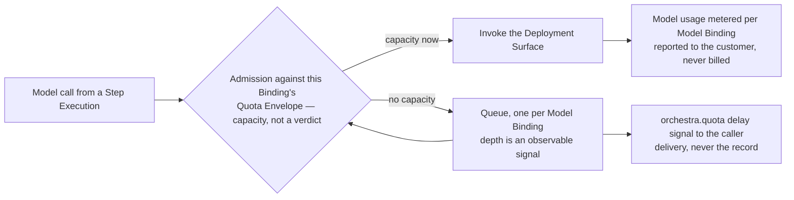
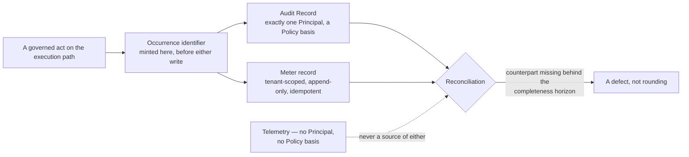

# Quotas and Metering

Two subjects in one document because they share a source of truth: the governed execution path. A
quota decides whether a model call may start now, against capacity Orchestra does not own and cannot
buy; a meter counts what happened, against a trail that must defend the count in a dispute. Neither
is reconstructable afterwards, which is the asymmetry
[ADR-0009](../adr/adr-0009-meter-first-defer-tiering.md) rests on: unrecorded usage is
unrecoverable, unset prices are not.

## 1. Standing and scope

**Informative.** Under [`../README.md`](../README.md) section 3 only
[`../30-protocol/`](../30-protocol/) and [`../40-governance/`](../40-governance/) bind. Where a rule
already binds — audit record properties, the fail-closed write, the rail exclusion — this document
links to it rather than restating it, and RFC 2119 keywords appear only in a quotation or citation.

**In scope.** What a Quota Envelope is under BYOK and what scheduling within it requires; how the
resulting delay reaches the caller; the metered dimensions and the grain each keys on; what a meter
record has to be; and what reconciliation against the audit trail demands of both stores. **Out of
scope.** Prices, tiers, seat costs and the tier builder, deferred entirely by ADR-0009; storage and
query shape, which wait on the datastore
[ADR-0011](../adr/adr-0011-tenant-isolation-shared-schema-rls.md) constrains without selecting; the
failure taxonomy and the degraded-period signal, which [`reliability.md`](reliability.md) section 8
owns; and metrics, traces and the run explorer, which [`observability.md`](observability.md) owns.

**No number appears here.** No quota figure, queue bound, backoff, reconciliation window, retention
period or sampling rate is decided anywhere in this repository, and neither are the operational
figures [`reliability.md`](reliability.md) and [`observability.md`](observability.md) carry the
bounds for; [`../VERSIONING.md`](../VERSIONING.md) carries the only durations that exist — support
windows and deprecation notice — and none is any of these. Where a number would be needed below,
what bounds it is stated instead and the number registered in section 14.

[ADR-0004](../adr/adr-0004-adopt-ag-ui-event-protocol.md) and
[ADR-0007](../adr/adr-0007-outbound-connector-for-enterprise-reachability.md) are **Proposed**, and
everything resting on them is provisional and marked at each use.

## 2. The Quota Envelope is a capacity ceiling, not an error

[`../GLOSSARY.md`](../GLOSSARY.md) defines a **Quota Envelope** as the customer's own provider-side
rate and token limits for a Model Binding, and
[ADR-0006](../adr/adr-0006-model-layer-as-credential-broker.md) draws what follows from
[ADR-0002](../adr/adr-0002-enterprise-segment-and-byok.md): the credential is the customer's, so the
limit is the customer's, and it is present at all times rather than occasionally. The v0.1 brief
listed rate limiting as an error to retry; ADR-0006 calls that wrong, and the correction is
structural — an always-present ceiling is something to schedule within and to show, not an incident
to alert on. Three consequences, carried already by
[`../10-architecture/data-plane.md`](../10-architecture/data-plane.md) section 8 and
[`../10-architecture/containers.md`](../10-architecture/containers.md) section 6:

- **Orchestra cannot buy its way past the ceiling.** The credential and the limit belong to the
  Tenant. Fairness across that Tenant's own Model Bindings is the only lever available.
- **A wait is not a failure.** [`../50-workflows/execution-semantics.md`](../50-workflows/execution-semantics.md)
  section 10 fixes it in the failure taxonomy: a waiting Run is still `Running`, no Policy Decision
  is taken, nothing is refused, and there is nothing to retry because nothing failed.
- **The delay is surfaced, not hidden** — ADR-0006 requires it, and section 4 carries it.

The envelope is per Model Binding — exactly one each
([`../20-domain/domain-model.md`](../20-domain/domain-model.md) section 7) — which is the grain
model usage meters on too: the scheduling unit and the reporting unit are one object.

## 3. Admission control against the envelope

ADR-0006 specifies quota-aware scheduling as **admission control with observable queue depth**, so
the Model Broker is a scheduler with a queue per Model Binding rather than a client library.

What holds regardless of how the design ADR-0006 calls for resolves:

- **Quota admission is not a Policy Enforcement Point** — a different sense of the word from Run
  admission ([`../20-domain/lifecycle-state-machines.md`](../20-domain/lifecycle-state-machines.md)
  2.1), which is one and is audited. No verdict, no Policy Decision, no Audit Record:
  [`../40-governance/audit-model.md`](../40-governance/audit-model.md) section 10's test finds no
  Principal and no Policy basis here, so queue depth is telemetry,
  [`observability.md`](observability.md) section 5's.
- **Quota admission is per model call, not per Run**, so a Run may queue several times, each wait
  independent; the unit below the Run is the Step Execution (invariant I4). **Queue ordering has no
  input yet**: no definition carries a priority, importance or deadline attribute, so fairness is
  the only policy expressible today.
- **Cancelling the queued model call is unambiguously safe**, that call never having left Orchestra.
  Cancelling the **Run** it belongs to is not: admission being per call, a Run waiting at a later
  Step may already hold completed side-effecting Step Executions, which
  [`../50-workflows/execution-semantics.md`](../50-workflows/execution-semantics.md) X28 makes a
  compensation problem rather than a stop problem. Cancellation is never proof that a side effect
  did not occur
  ([`../20-domain/lifecycle-state-machines.md`](../20-domain/lifecycle-state-machines.md) 2.4).
- **Saturation and failure are different triggers for the declared fallback list.** Falling back on
  *failure* is settled by ADR-0006; falling back on *saturation* is a separate decision, saturation
  being no failure. Registered — and either way a fallback stays inside the declared order and lands
  on a binding with its own envelope and queue, moving the wait rather than removing it.

## 4. Backpressure reaches the caller

**The carrier is settled and is not this document's.**
[`../30-protocol/event-protocol.md`](../30-protocol/event-protocol.md) section 10 places the delay
in the reserved `orchestra.quota.*` extension family rather than in the Run state machine, which has
no capacity state — resting on [ADR-0004](../adr/adr-0004-adopt-ag-ui-event-protocol.md), which is
**Proposed**. The payload is this document's, bounded by two rules that bind already: the event is
delivery and never the system of record (rule X2), and an unrecognised extension is silently
ignorable ([`../VERSIONING.md`](../VERSIONING.md) R3), which makes the signal additive.

| The delay signal | Why |
| --- | --- |
| **Carries** the Model Binding the call is queued against | The envelope's grain, and the only object the customer can act on |
| **Carries** the observable queue depth or position | ADR-0006's own mitigation against under-designed scheduling causing silent stalls |
| **Carries** that the Run is still `Running` and nothing was refused | A quota wait is one of the six outcomes [`../50-workflows/execution-semantics.md`](../50-workflows/execution-semantics.md) section 10 keeps distinct — a policy deny, a rejected approval, an expired gate, a quota wait, a model failure and a tool failure — and it is the only one that is not a failure at all |
| **Carries** a clearing signal when the call is admitted | Absence of an event may not be read as non-occurrence (X2), so a raise with no clear leaves waiting indistinguishable from dead |
| **Never** provider-native rate-limit responses, headers, codes or vocabulary | The rail exclusion — CLAUDE.md working rule 2, `event-protocol.md` section 9, ADR-0006's normalisation duty |
| **Never** any part of the credential, in any form | ADR-0002; `event-protocol.md` rule X3 |
| **Never** a promised wait estimate | An estimate needs the envelope's refresh behaviour, which section 5 has not decided; anything else is a guess presented as a fact |

**Orchestra supplies the signal and cannot render it**, the End User reaching the Agent through the
customer's own application ([`../00-overview/personas.md`](../00-overview/personas.md) section 4):
honesty about the wait is Orchestra's obligation, its presentation the customer's choice. Whether
the payload may name the Tenant's configured limits, that stream reaching an application built for
End Users, is registered.

## 5. Declared, discovered, or both — undecided, and not closed here

ADR-0006 records that Quota Envelope discovery, configuration and enforcement **need a dedicated
design that does not exist**. [`../20-domain/domain-model.md`](../20-domain/domain-model.md) section
11, [`../10-architecture/containers.md`](../10-architecture/containers.md) section 12 and
[`../30-protocol/gateway-api.md`](../30-protocol/gateway-api.md) section 9 register the same
question and none closes it. Neither does this. What bounds an answer:

- **Declared alone goes stale silently.** A typed figure is a claim about someone else's system and
  the provider's real limit governs regardless, so a stale declaration over-admits and the first
  symptom is the provider-side rejection ADR-0006 exists to prevent.
- **Discovered alone is not available everywhere**: Deployment Surfaces differ in whether they
  expose limits at all, and what they expose is provider-native, which cannot cross into a public
  contract un-normalised (`event-protocol.md` section 9). **Both** needs a precedence rule, and a
  rule for what a declared-to-discovered mismatch means.
- **Observed rejections are evidence either way**, not merely a call to retry; a design that
  discards them relearns the ceiling on every call. And **one envelope per binding may not match one
  ceiling per account** — two Model Bindings on the same underlying deployment share a real ceiling
  the model draws as two independent envelopes.

## 6. What quota work is not

**Not per-tenant resource isolation.** ADR-0011 states that shared-schema isolation provides none,
and [`../10-architecture/multi-tenancy.md`](../10-architecture/multi-tenancy.md) records that quota
work does not substitute for it: scheduling a customer's own provider capacity leaves
noisy-neighbour effects on Orchestra's own resources exactly where they were. **Not Orchestra's own
inbound rate limiting** either — whether the Gateway limits a Tenant's request rate, and on what
basis, is decided nowhere; different subject, different owner, and borrowing the Quota Envelope's
vocabulary for it would be a defect under [`../GLOSSARY.md`](../GLOSSARY.md). And **not a governance
control**: a quota wait must stay distinguishable from a policy `deny` in the audit trail, in the
metered outcome and to the caller — one enumeration across three surfaces, per
`execution-semantics.md` section 10.

## 7. Metering exists before it is commercially needed, deliberately

ADR-0009 builds metering as a first-class auditable subsystem from the first commit and defers the
tier builder and self-serve packaging entirely, on an asymmetry rather than an optimism: usage that
was not recorded is gone, while a price that was never set costs nothing to set later. ADR-0009
names the cost in its own consequences — metering must be built correctly before it is commercially
needed, **which can feel premature** — and this document repeats that rather than dressing it up.
Early contracts are priced by hand and invoiced manually, which is normal at this size.

## 8. The metered dimensions

The nine dimensions below are ADR-0009's, reproduced faithfully. **They are decided, and this
document does not extend them.** Where ADR-0009's wording is wider than its own dimension name —
*Platform Users*, defined as distinct Principals — section 13 states the counting rule and registers
it rather than treating the reading as this document's to settle. The grain column is
[`../20-domain/domain-model.md`](../20-domain/domain-model.md) sections 8 and 9: section 9 states
three of the mappings outright and the rest follow from section 8's table of units, each an entity
that already exists.

| Dimension | Definition (ADR-0009) | Grain it keys on |
| --- | --- | --- |
| **Platform Users** | Distinct Principals authenticating to the Control Plane in a billing period — **the seat-billable identity** | Platform User; section 9 |
| **End Users** | Distinct end-user subjects observed via session tokens — measured, explicitly **not** seat-billed | Session Token subject; a derivation, not an occurrence class |
| **Runs** | Executions of an Agent or Workflow, by outcome | Run, broken down by outcome; the outcome enumeration is unsettled — section 14, and `execution-semantics.md` section 7 |
| **Step Executions** | Executions of individual steps | Step Execution |
| **Active Agents / Workflows** | Definitions with at least one run in the period | The definition, not the version; a derivation over Run records |
| **Connectors** | Enrolled connector instances, by health | Connector — ADR-0007 is **Proposed**, so this dimension and its lifecycle are provisional |
| **Approvals** | Raised and resolved | Approval Request |
| **Tool invocations** | By Tool and Side-Effect Class | The Step Execution of a `tool` Step; section 12 |
| **Model usage** | Tokens and calls per Model Binding | Model Binding — **reported to the customer, never billed** |

Two of the nine are derivations rather than occurrence classes of their own — *Active Agents and
Workflows* over Run records, *End Users* through Session Tokens — and both reconcile against records
of other classes (section 11). *Connectors, by health* is the one whose audited status is unsettled:
health transitions have no acting Principal, which
[`../40-governance/audit-model.md`](../40-governance/audit-model.md) section 10's test calls
telemetry, while its section 7 requires every metered occurrence to be audited. That document owns
the tension and requires it settled before the dimension ships.

## 9. Two rules that are easy to get backwards

**Platform Users are the seat-billable identity. End Users are measured and never seat-billed.**
ADR-0009 records why the ambiguity was fatal: a Tenant's Platform Users number in the tens to
hundreds while its End Users may number in the hundreds of thousands where the SDK is embedded in a
customer-facing application, so pricing the second population as though each were an administrator
misprices by orders of magnitude. Both are counted; only one is a seat — a split
[`../20-domain/domain-model.md`](../20-domain/domain-model.md) section 8 and the glossary carry too.

**Model usage in tokens and calls is reported to the customer and never billed.** Under BYOK the
customer already pays their provider, so reselling tokens is neither available nor wanted. What is
wanted is what a provider console cannot give: cost attribution by Workspace, Agent, Workflow and
Model Binding, inside the governance trail. Visibility is the feature, and billing this dimension is
the one change that would turn a reporting surface into a markup.

## 10. What a meter record has to be

ADR-0009 requires meter records to be **append-only, tenant-scoped, timestamped, idempotent under
retry, and reconcilable against the audit log**, because billing data must be defensible in a
dispute. What each demands:

| Property | What it requires |
| --- | --- |
| Append-only | A correction is a new record naming the one it corrects, never an edit — the same shape as `audit-model.md` rule A2, for the same reason: a restated count with no trail is indistinguishable from a mistake being hidden |
| Tenant-scoped | A `tenant_id` on every record, under the same forced row-level security as every other tenant-scoped table (ADR-0011, invariant I1). No aggregate crosses a Tenant, and no reconciliation does either |
| Timestamped | A timestamp is not an ordering key — clocks skew across the components that write (`audit-model.md` rule A7). Which clock assigns an occurrence to a billing period, and what happens to a record arriving after that period closed, is registered |
| Idempotent under retry | Keyed on the occurrence identifier together with the dimension counted — section 11. A replayed write is the same occurrence, not a second one |
| Reconcilable | A join against the audit trail, not a comparison of counts — section 11 |

Sampling has no place in any of it: a sampled count cannot be defended in a dispute any more than a
sampled control can be evidenced (`audit-model.md` section 3 states the audit half of that rule).

## 11. Reconciliation is a join, and a join has two sides

[`../40-governance/audit-model.md`](../40-governance/audit-model.md) section 7 states both sides
normatively: every occurrence of a metered dimension must also be an audited fact carrying a stable
identifier, and a meter record must carry the identifier of the occurrence it counts, resolving to
exactly one Audit Record. It registers what neither ADR names — **what that value is** — and assigns
the positive answer here. `event-protocol.md` section 10 answered its half: **not** the profile's
`event_id`, since metered occurrences include facts that never reach a stream.

**The answer this document derives.** The shared value is an **occurrence identifier minted by the
component taking the governed action, before either write**, carried unchanged into the Audit Record
as its identity and into the meter record as its reference. What forces that shape:

- It cannot be assigned by whichever store writes first:
  [ADR-0013](../adr/adr-0013-fail-closed-policy-decision-writes.md) lets audit writes outside the
  Policy Decision class be buffered or written behind the action, so a store-assigned key is not
  available when the meter record is written.
- It must be stable across retry and replay (`audit-model.md` section 7), which a value minted per
  write attempt is not; and it must not be a rail-minted identifier surfaced as a typed field (A8).
  Nor is it the audit ordering key, which `event-protocol.md` section 10 fixes as independent of
  both `seq` and delivery.

**The idempotency key is that identifier together with the dimension**, because one occurrence lands
on more than one: the Step Execution of a `tool` Step counts as a Step Execution and as a Tool
invocation, and one model call counts as a call and in tokens. ADR-0009's risk table says "keyed on
the event id" without naming which identifier that is; `event-protocol.md` forbids reading it as the
profile's `event_id`, and this is the value it leaves in its place. The two derived dimensions mint
none and need none — they reconcile against the Run records and Session Token issuances they are
computed from.

**Four things bound what reconciliation can assert.** *Outside* a bracketed degraded interval a
missing counterpart is a defect rather than rounding (`audit-model.md` section 7); *inside* one it is
attributable to the bracket, and the Run that ran through it did not fail and is not metered as
though it had — [`reliability.md`](reliability.md) F16, in the section 8 that specifies the
degraded-period signal, which makes that bracket a metering input as well as an operational one.
**Ahead of the completeness horizon [`observability.md`](observability.md) section 4 defines, a
missing counterpart reads as "not yet seen" rather than "did not happen".** ADR-0013 lets every audit
write outside the Policy Decision class be buffered or written behind the action in normal
operation, so a meter record can exist before its Audit Record is readable, and the join is only
meaningful behind the horizon (`reliability.md` F15). Audit retention bounds billing
defensibility, and no retention period is decided (`audit-model.md` section 11). Which side is
authoritative in a dispute is commercial, for the reconciliation runbook ADR-0009 calls for.

## 12. What is not metered, and what has no price

**A refused invocation is not metered as a Tool invocation.** The dimension counts Tool invocations
by Tool and Side-Effect Class, keyed on the Step Execution of a `tool` Step, and a policy `deny`, a
missing capability grant and a missing Catalog registration all resolve at an enforcement point
*before* the invocation ([`../40-governance/policy-model.md`](../40-governance/policy-model.md) rule
E5, [`../40-governance/tool-authorization.md`](../40-governance/tool-authorization.md) TA6) — the
origin was never called, so there is no invocation to count. The refusal is not lost: it is a Policy
Decision, and under [ADR-0012](../adr/adr-0012-policy-decisions-are-audit-records.md) that is a
class of Audit Record. Counting it as usage would make one dimension mean two things. The test, and
the two edges it settles:

| Case | Metered as a Tool invocation? | Why |
| --- | --- | --- |
| Refused at a Policy Enforcement Point | No | Nothing left Orchestra; the origin was never called |
| Refused at the Connector (TA16) | Unresolved | This document cannot assert the origin was never called: [`../40-governance/tool-authorization.md`](../40-governance/tool-authorization.md) TA18 is normative and puts a connector refusal or a mid-call tunnel drop in an **unknown** state, which is why neither may be retried blindly. Metering it requires TA18 to distinguish a refusal resolved before dispatch from a drop after it. Registered in section 13. ADR-0007 is **Proposed** |
| Attempted, outcome unknown | **Yes** | The far side may have acted. Under-counting a call that may have had a side effect is the worse error, and the general prohibition binds: [`../20-domain/lifecycle-state-machines.md`](../20-domain/lifecycle-state-machines.md) 2.4 and `execution-semantics.md` X26 — unknown is not the same as not done. `audit-model.md` section 10 carries the narrower Connector-state form of the same rule |

Two related questions are not this one and keep their owners' classifications. Where a *governance
refusal* lands as a metered Run outcome, given that `Failed` carries both a refusal and a fault, is
[`../40-governance/approval-workflows.md`](../40-governance/approval-workflows.md) section 8's,
marked **ADR** there; what a Tool call *inside an Agent Run* keys on, that Run having no Steps, is
[`../50-workflows/execution-semantics.md`](../50-workflows/execution-semantics.md) section 11's, and
neither audit nor metering is retroactive, so it wants settling before the first Run.

**Telemetry is not metering.** A meter record resolves to a Tenant and to one occurrence in the
audit trail; a metric resolves to neither, and deriving a bill from metrics carries the defect
`audit-model.md` rule A6 names for audit — the artefact was never written on the governed path.
**And no price, no tier boundary and no seat cost exists**, here or anywhere: ADR-0009 defers all
three until customers exist, no packaging assumption having been tested, and a number written down
now would be read as a decision.

## 13. Questions assigned to this document, and their answers

| Question, and who assigned it | Answer |
| --- | --- |
| Whether a Service Account authenticating to the Control Plane consumes a seat — [`../00-overview/personas.md`](../00-overview/personas.md) section 5, [`../10-architecture/control-plane.md`](../10-architecture/control-plane.md) section 13, [`../10-architecture/identity-and-access.md`](../10-architecture/identity-and-access.md) | **No.** ADR-0009 names the dimension *Platform Users* and the glossary names the Platform User as the seat-billable identity; a Service Account is a different Principal subtype, non-human and used for machine-to-machine calls into the Gateway. The dimension's wording — "distinct Principals authenticating to the Control Plane" — is wider than its own name and must be read against it. The counting rule is therefore: a seat is a Platform User, and no Service Account consumes one. A Service Account that does authenticate to the Control Plane is unaffected in every other respect — it is a Principal, and every act it takes is attributed and audited on the same terms ([`../40-governance/audit-model.md`](../40-governance/audit-model.md) section 3); what it does not do is consume a seat. Reading a decided dimension against its own name narrows the seat-billed population, which is a commercial effect, so that reading and whether an unbilled Service Account count exists as a dimension of its own are registered together in section 14 |
| What the Quota Envelope delay signal carries, the carrier being settled — [`../10-architecture/data-plane.md`](../10-architecture/data-plane.md) section 11, [`../30-protocol/event-protocol.md`](../30-protocol/event-protocol.md) section 10, [`../30-protocol/gateway-api.md`](../30-protocol/gateway-api.md) section 9 | **Section 4's table.** The Model Binding, the observable queue depth, that the Run is still `Running` with nothing refused, and a clearing signal when the call is admitted. Not provider-native rate-limit vocabulary, not any part of the credential, and not a promised wait estimate — an estimate needs the envelope refresh behaviour section 5 has not decided. Rests on ADR-0004, **Proposed**, as the protocol document marks it |
| Whether a Quota Envelope is declared, discovered or both — [`../20-domain/domain-model.md`](../20-domain/domain-model.md) section 11, [`../10-architecture/containers.md`](../10-architecture/containers.md) section 12, [`../30-protocol/gateway-api.md`](../30-protocol/gateway-api.md) section 9 | **Not answered, and not closable here.** ADR-0006 says the design does not exist; section 5 states the forces that bound it. Registered, with its owners' classification repeated |
| Whether a refused invocation is metered as a Tool invocation — [`../40-governance/tool-authorization.md`](../40-governance/tool-authorization.md) section 10 | **Split.** A refusal resolved before dispatch is not metered — nothing was invoked. A refusal at the Connector is **unresolved**: [`../40-governance/tool-authorization.md`](../40-governance/tool-authorization.md) TA18 puts a connector refusal or a mid-call tunnel drop in an unknown state, so this document cannot assert the origin was never called. Metering it requires TA18 to separate the two cases first — section 12 |
| What value identifies a metered occurrence across the audit and metering stores, and whether it is also the meter idempotency key — [`../40-governance/audit-model.md`](../40-governance/audit-model.md) section 13, [`../30-protocol/event-protocol.md`](../30-protocol/event-protocol.md) section 10 | **An occurrence identifier minted on the governed path before either write**, carried into the Audit Record as its identity and into the meter record as its reference — section 11, with the constraints that force it. The meter idempotency key is that identifier **plus the dimension counted**, since one occurrence lands on several dimensions. This is a derivation, not a normative rule: its home is [`../40-governance/audit-model.md`](../40-governance/audit-model.md) section 7, which carries the MUSTs on both sides and still registers the value itself as open. It is therefore proposed to the owning document rather than settled here, and the adoption is registered in section 14 |

## 14. Open questions

**ADR required** means the choice is costly to reverse or spans components and must be recorded as
an ADR before implementation. **No** means a later document or a named design settles it. Where
another document owns a question, its classification is repeated rather than revised.

| Question | What would decide it | ADR required? |
| --- | --- | --- |
| Whether a Quota Envelope is declared, discovered from the Deployment Surface, or both — and the precedence rule if both | The quota design ADR-0006 calls for and which does not exist; section 5 bounds it | No — *repeated* from [`../20-domain/domain-model.md`](../20-domain/domain-model.md) section 11 |
| Whether saturation of a Model Binding triggers the declared fallback list, or only failure does | The same quota design, against ADR-0006's rule that fallback is attempted in declared order with strict limits on what may be retried | No |
| Whether two Model Bindings may share one provider-side ceiling, which one-envelope-per-binding cannot express | The same quota design, with [`../20-domain/domain-model.md`](../20-domain/domain-model.md) section 7, which fixes the cardinality | No |
| Queue ordering within a Model Binding, and whether it is ever customer-configurable | The same quota design; no definition carries a priority, deadline or importance attribute today, so there is no input to order on | No |
| Whether the delay signal may name the Tenant's configured limits, given that the Run stream reaches an application built for End Users | The payload design with [`../10-architecture/identity-and-access.md`](../10-architecture/identity-and-access.md), which owns who may read what | No |
| Whether Orchestra rate-limits its own inbound Gateway traffic, and on what basis | A separate decision with no owner today; it is not the Quota Envelope and must not borrow its vocabulary | No |
| Whether a Service Account is excluded from the *Platform Users* count, section 13 having read that dimension against its own name, and whether an unbilled Service Account count exists as a dimension of its own | ADR-0009's revisit criteria: its nine dimensions and their wording are both decided, so narrowing the seat-billed population and adding a dimension are equally that ADR's to confirm rather than a document's; [`../40-governance/audit-model.md`](../40-governance/audit-model.md) section 3 would need the matching audited act for a new dimension | **Yes** — both change a fixed commercial dimension set |
| Which clock assigns an occurrence to a billing period, and what happens to a record arriving after that period closed | The metering design with the datastore selection; ADR-0009 requires a timestamp and names no boundary rule | No |
| The audit-retention period, which bounds how long an invoice can be reconciled and therefore disputed | A customer contract forcing a regulatory floor; storage cost modelling once volume is observable | **Yes** — *repeated* from [`../40-governance/audit-model.md`](../40-governance/audit-model.md) section 13 |
| Whether Connector health transitions are Audit Records or telemetry, which the *Connectors, by health* dimension depends on | The tension between the actor test and the reconciliation requirement, in [`../40-governance/audit-model.md`](../40-governance/audit-model.md) section 10 | No — *repeated*, and it must be settled before the dimension ships; ADR-0007 is **Proposed**, so the Connector lifecycle underneath the dimension is provisional |
| Where a governance refusal lands as a metered Run outcome, given `Failed` carries both a refusal and a fault | [`../40-governance/approval-workflows.md`](../40-governance/approval-workflows.md) section 8, which owns it | **Yes** — *repeated* |
| What a Tool invocation inside an Agent Run keys on for its meter record, that Run having no Steps | [`../50-workflows/execution-semantics.md`](../50-workflows/execution-semantics.md) section 11, with [`../20-domain/domain-model.md`](../20-domain/domain-model.md) section 11 | No — *repeated*; neither audit nor metering is retroactive |
| Queue-depth, wait-time and admission figures, and whether any of them ever becomes a customer commitment | The same quota design; bounded below by what a customer's operator can act on and above by BYOK itself — the ceiling is the customer's own capacity, so a commitment on it would be a promise about someone else's system | No — *repeated* from [`observability.md`](observability.md) section 9 |
| Whether [`../40-governance/audit-model.md`](../40-governance/audit-model.md) section 7 adopts the occurrence identifier section 11 derives, retires its own open row, and names the A-rule that carries an Audit Record's identity | That document, which owns both MUSTs; this one is informative and can propose the shape, not decide it | No — the derivation is section 11's, the rule is that document's |
| Glossary entries this document leans on — *meter record*, and *occurrence identifier* for the value section 11 derives | [`../GLOSSARY.md`](../GLOSSARY.md); vocabulary is fixed, so a term carrying a section needs an entry rather than a first use in prose | No — *repeated* from [`../20-domain/domain-model.md`](../20-domain/domain-model.md) section 11 |
| Prices, tier boundaries, seat cost and the tier builder | Three or more customers in production and observable usage shapes, per ADR-0009's revisit criteria. Nothing about the dimensions above depends on it | No — deferred by decision, not by omission |
| Reconciliation and dispute handling as an operational procedure, which ADR-0009 requires before the first invoice | An operational runbook in this section, once a billing surface exists to reconcile | No |
