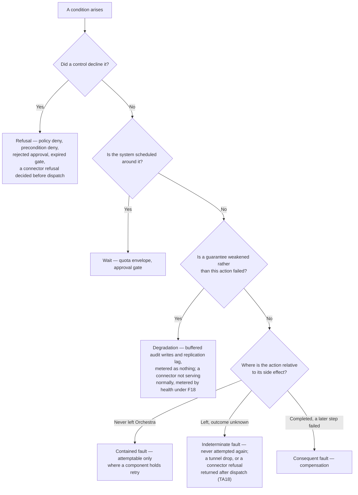

# Reliability

**Never blindly retry a side effect.** A failed model call is safe to retry; a partially executed
Tool call is not — CLAUDE.md working rule 6,
[ADR-0006](../adr/adr-0006-model-layer-as-credential-broker.md)'s constraint on fallback,
[ADR-0008](../adr/adr-0008-declarative-workflow-definitions.md)'s prohibition on blind retry, and
invariant **I4** of [`../20-domain/domain-model.md`](../20-domain/domain-model.md) putting retry at
the **Step Execution and never the Run**. Every failure classified below is a way of getting that
one rule wrong.

## 1. Standing and scope

This document is **not normative**. Per [`../README.md`](../README.md) section 3 only
[`../30-protocol/`](../30-protocol/) and [`../40-governance/`](../40-governance/) bind an
implementation; where a rule binds, this document links to its owner rather than restating it, and
[RFC 2119](https://www.rfc-editor.org/rfc/rfc2119) keywords appear only inside such a citation.
Where a rule below is this document's own it is written in lower case, and is an informative
recommendation: it binds when its normative owner adopts it and not before, as F10 says of itself.
Rules are numbered **F1** onward so other documents can cite them, and
[ADR-0007](../adr/adr-0007-outbound-connector-for-enterprise-reachability.md) is **Proposed**, so
section 9 is marked as resting on it.

**This document decides no number.** No retry count, backoff, attempt budget, timeout, health-check
interval, threshold, error budget, service level objective, alert threshold, queue depth, sampling
rate or retention period is fixed here, or in any document this one depends on.
[`../VERSIONING.md`](../VERSIONING.md) decides support and deprecation windows and nothing else; its
section 9 connector window is a support commitment, never a health signal. Section 11 says what
bounds each missing figure instead.

## 2. Two units, and what an attempt is an attempt at

**F1 — The unit is the Step Execution.** A Run is never retried, holds no idempotency key and
carries no compensating action ([`../GLOSSARY.md`](../GLOSSARY.md), invariant I4,
[`../50-workflows/execution-semantics.md`](../50-workflows/execution-semantics.md) section 2). Every
rule below applies to one Step Execution, or to a Tool invocation in an Agent Run, which has none to
key on — a gap that document registers and this one inherits.

**F2 — A retry is another attempt at the same Step Execution, not a new one** (X11). Each attempt
crosses the enforcement point again (X12), so *n* attempts write *n* Policy Decisions, each carrying
the durable write [ADR-0013](../adr/adr-0013-fail-closed-policy-decision-writes.md) puts ahead of
the gated action. An attempt budget is an audit-volume and latency decision as much as a resilience
one.

## 3. Four classes, which must not collapse

A **refusal**, a **wait**, a **fault** and a **degradation** are four different facts, and three
surfaces depend on telling them apart: the audit trail, the metered outcome under
[ADR-0009](../adr/adr-0009-meter-first-defer-tiering.md), and what the caller observes
([`../30-protocol/gateway-api.md`](../30-protocol/gateway-api.md) section 7). These four are an
operational coarsening rather than a replacement enumeration:
[`../50-workflows/execution-semantics.md`](../50-workflows/execution-semantics.md) section 10 fixes
**six** outcomes over those same three surfaces and says they are not addable retroactively, because
usage recorded under the wrong outcome cannot be reclassified once invoiced.

| Class | What it is | Fault? | Attemptable? | Metered as |
| --- | --- | --- | --- | --- |
| **Refusal** | A control operated and declined the action | No | Never — a re-proposal is a new evaluation | A Run outcome distinct from failure (J1); the outcome vocabulary itself is **ADR**-blocked, section 13 |
| **Wait** | Capacity, or a human decision, that the system is scheduled around | No — nothing failed | Not applicable | Nothing of its own for a capacity wait, the Run still `Running`; an approval gate raises and resolves an Approval Request, which ADR-0009 meters under **Approvals** |
| **Fault** | Something broke | Yes | Only where the action provably never left Orchestra, and only where a component holds retry | A Run outcome distinct from a refusal (J1), on the same **ADR**-blocked vocabulary |
| **Degradation** | The platform serves, but a guarantee is weakened | No — not of any one Run | Not applicable | Nothing for an audit-write or replication degradation; a Connector's health is itself a metered dimension under ADR-0009 (F18) |

**F3 — Classification follows what happened, never what is convenient to report.**
[`../40-governance/tool-authorization.md`](../40-governance/tool-authorization.md) TA16 binds the
sharp case — a refusal reported as a transport error records a fault where a control operated — and
it generalises: the class is a property of the condition.

**How the six map onto the four.** `execution-semantics.md` section 10 enumerates a policy deny, a
rejected approval, an expired gate, a quota wait, a model failure and a tool failure. The first
three are refusals; the quota wait is a wait; a model failure is a fault in the contained position;
a tool failure is a fault in the indeterminate or consequent position, which is the same split
section 6 draws by position rather than by rail. Degradation is the class that document has no
member for, because it is a property of the platform and not of any one Run. **The six remain the
enumeration for the metered outcome and for the wire**; these four coarsen them for operational
classification only, so the floor F24 names is the six.

## 4. A governance refusal is not a fault

A policy `deny`, a precondition `deny` naming no Policy, a rejected approval, an expired gate and a
connector refusal decided before the invocation is dispatched are outcomes of the system working.
[`../40-governance/approval-workflows.md`](../40-governance/approval-workflows.md) J1 makes
recording one as a fault a defect, and ADR-0009 meters Runs *by outcome*, so the defect reaches an
invoice.

**A connector refusal splits by dispatch, and only the pre-dispatch half is a refusal.**
`tool-authorization.md` **TA18** is normative and puts a connector refusal, or a tunnel drop
mid-call, in an **unknown** state; `execution-semantics.md` X9 lists a connector refusal as an
example of its second position, *left Orchestra and the outcome is unknown*. Where the refusal is
decided before dispatch — version skew under section 9, a Tool the connector does not expose —
nothing left Orchestra and the condition is a refusal. Where it is returned after the invocation was
dispatched into the customer network, it is an indeterminate fault under F20: never attempted again,
and compensation rather than re-proposal is the question. Whether it is metered at all is unresolved
for the same reason, and belongs to [`quotas-and-metering.md`](quotas-and-metering.md) section 12,
which cannot assert the origin was never called. That X9's example does not itself carry the split
is registered in section 13.

**F4 — A refusal must not contribute to any fault signal.** That is J1 applied to the operational
surface rather than the trail: an error rate, an alert or a health computation that counts refusals
reports a governance platform doing its job as an outage, and the more governance a Tenant
configures the worse its reliability looks. `observability.md` in this section owns the signals it
constrains; section 9 is where it is hardest to see.

**F5 — A refusal is never attemptable.** Re-proposing a denied action is a new evaluation
([`../40-governance/policy-model.md`](../40-governance/policy-model.md) E6); re-proposing a rejected
one raises a **new** Approval Request (J3). Routing either through a retry mechanism converts a
decision into a loop.

**Where the refusal outcome lands is not this document's to decide.** J1 does not hold under the Run
state machine as drawn — `Failed` carries both a crash and an unfavourable gate resolution — and the
fix needs a terminal state or outcome dimension that does not exist, marked **ADR** by
`approval-workflows.md` section 8 and repeated in the register.

## 5. A quota wait is not an error

Under BYOK the Quota Envelope is the customer's own provider-side limit, which
[`../GLOSSARY.md`](../GLOSSARY.md) and ADR-0006 make a **steady-state capacity ceiling rather than
an exceptional failure mode**. v0.1 listed rate limiting as an error to retry; ADR-0006 overturns
exactly that. A ceiling always present is something to show, not an incident to alert on.

**F6 — Waiting on capacity is normal operation, and is not the same wait as an approval gate.**
ADR-0006 specifies quota-aware scheduling as admission control with observable queue depth and the
delay surfaced to the user rather than hidden. A Run waiting on capacity is still `Running`
([`../10-architecture/data-plane.md`](../10-architecture/data-plane.md) section 8) — the state
machine has no capacity state and this document invents none — where `require_approval` suspends
the Run and the gate is a resource (`policy-model.md` V2). Two conditions that both look like
*nothing is happening* are opposite facts, and section 9 turns on not adding a third.

**F7 — A wait must not be implemented as retry with backoff against the origin.** Attempting a call
the scheduler knows the envelope cannot admit manufactures the failure it then retries, spends the
customer's own quota on rejections, and hides the queue the scheduler exists to expose. Backoff
belongs inside the scheduler as a queue; a retry policy above it applies the same wait twice.

## 6. Faults, by position relative to the side effect

`execution-semantics.md` X9 fixes the three positions; this document adopts them under the names
above and adds which component holds the response.

| Position | Name | Response | Holder |
| --- | --- | --- | --- |
| Provably never left Orchestra | Contained | Attemptable only where a component holds retry — see below | The Model Broker for a model call; nothing for a Tool call |
| Left, outcome unknown | Indeterminate | Never attempted again; compensation of prior effects | `execution-semantics.md` section 6 |
| Completed, a later step failed | Consequent | Declared compensating actions, reverse order within a branch | `execution-semantics.md` section 6 |

**Contained does not mean attemptable by itself.** X9 permits retry at position one *where the
owning component holds retry*, and that component is the Model Broker for a model call and nobody
for a Tool invocation (`data-plane.md` section 9). A contained model fault is therefore attemptable
under F2 and section 11's undecided budget, while a contained Tool or connector fault fails the Step
Execution (F19) and re-proposing it is the caller's act, not a retry. `gateway-api.md` section 7
classifies *Connector unreachable* as **safe or indeterminate**; *safe* there is a statement about
the side effect, not an instruction that Orchestra attempts again on the caller's behalf.

**F8 — Retry lives where the effect does not**, and an ordered fallback list is a Model Binding
feature that must not be generalised into fallback between Tools: a second Tool is a second side
effect, not a second attempt at the first (`data-plane.md` section 9).

**F9 — A transport signal is not evidence about the far side.** `Offline` says the transport
failed, not that the work was declined
([`../20-domain/lifecycle-state-machines.md`](../20-domain/lifecycle-state-machines.md) 5.2), and
Connector state MUST NOT be used to infer that a side effect did not occur
([`../40-governance/audit-model.md`](../40-governance/audit-model.md) section 10). Nor is an
idempotency key presented to an origin authority to attempt again (X10): honouring one is a property
of the origin, and the registered Tool record does not carry it.

## 7. What an evaluation failure records

`policy-model.md` **A3** settles the safety half — an evaluation that cannot complete MUST NOT
return `allow`, and under ADR-0013 the gated action MUST NOT proceed where the Policy Decision
cannot be made durable — and registers the remainder here: **whether the failure is recorded as a
`deny`, or fails the Step Execution as an error.** This document answers it; the answer binds only
when a later revision of `policy-model.md` adopts it.

**F10 — An evaluation that cannot complete is a contained fault, recorded as a Step Execution error.
It is not a `deny`.** Four reasons, the first decisive:

- **A `deny` asserts a determination never reached.** The verdict set is closed (P3) and D4 requires
  the same inputs to produce the same verdict; recording a verdict where none was reached, then
  allowing that action on a later attempt, puts two verdicts against one input set into the trail.
- **The near neighbour is exact and different.** A4's `deny` naming no Policy is a *precondition
  evaluated and found false* — an unregistered Tool, a missing grant — a determinate answer derived
  from N1 inputs. An evaluation error answers nothing about the action.
- **It is J1's defect mirrored.** A fault recorded as a refusal inflates the governance-refusal
  count with outages, and audit is a product surface: a customer reading `deny` learns that a rule
  refused their action. The two also meter differently under ADR-0009.
- **It needs no Run transition that does not exist.** A mid-Run `deny` has none and is
  **ADR**-blocked in three registers; a failed Step Execution is the ordinary fault path, so
  choosing `deny` would drag every outage into that unresolved decision.

**F11 — Evaluation failure and decision-write failure are one class and two causes, and stay
distinguishable.** They halt the action identically and differ in what can be recorded: an
evaluation error can be written, whereas a failure to make the Policy Decision durable cannot
describe itself in the store that refused it.

Neither is a degraded period. Both are halts: the gated action does not proceed. An audit-store
outage will usually open a degraded period *concurrently*, for the second record class buffering
behind it, and that period is bracketed under section 8 — but the decision write itself never enters
the degradable class. ADR-0013 makes the classification a property of the record class rather than a
runtime choice, and rates reclassifying a Policy Decision as degradable an **existential** risk. It
is exactly the door an availability argument would push on.

**F12 — A `condition` predicate that cannot evaluate is a contained fault, and must not fall
through to a default branch.** [`../50-workflows/step-types.md`](../50-workflows/step-types.md)
section 13 assigns this here *as distinct from* a boundary evaluation failing under A3: that Step's
boundary enforcement point already ran and allowed (E2, E3), so what failed is an expression in the
Workflow's own language, with no Policy Decision at stake and no verdict to misreport. What the two
share is the safety shape — an evaluation that produced no answer must not be read as the permissive
one, whether that answer is `allow` or *take the else branch*, because a fault choosing the path is
a fault choosing the side effect. Whether such a predicate is attemptable depends on whether the
expression language admits anything impure, which
[`../50-workflows/workflow-dsl.md`](../50-workflows/workflow-dsl.md) owns and has not decided.

## 8. Degradation, and the signal for a degraded period

ADR-0013 splits the audit write by record class — a split
[ADR-0012](../adr/adr-0012-policy-decisions-are-audit-records.md) makes available by putting the
Policy Decision inside the audit model as a class of Audit Record over versioned Policies. A
**Policy Decision MUST be durable before the gated action** — durable meaning it survives a crash,
not that it reached the audit store — while **other Audit Records MAY degrade**, provided a degraded
period is recoverable from the trail rather than silent. That ADR and `audit-model.md` A6 both name
this document as owner of the signal. State the cost as ADR-0013 asks: **audit store availability
bounds the availability of every governed action**, deliberately, and that belongs in front of a
buyer rather than in a post-incident review. Degradation of the second class bounds not availability
but what the platform may afterwards claim.

**F13 — A degraded period is bracketed, and the bracket is written on the path that cannot
degrade.** A record of the gap in the degradable class can be lost by the same failure that caused
the gap, which is circular. The requirement is durability and not a mechanism: the bracket rides
whichever path carries the fail-closed Policy Decision write, so it survives the crash the buffered
records did not. ADR-0013 offers a durable local append as one *sufficient* example and requires no
particular one; which path that is follows the write mechanism section 10 leaves undecided, and
under a shared transaction there is no local append for a bracket to ride.

**F14 — The bracket makes the gap attributable, not merely flags that something was wrong.** It
carries when the degradation began and ended, which record classes were affected, and which
components and which Tenants: a bracket saying only *something was degraded* converts a bounded gap
into unbounded doubt about the whole trail, which is worse than the gap. Its closure is a claim, and
there are two different claims — the buffered records landed, or they did not and the gap is
permanent — so a single *resolved* would conflate recovery with abandonment. A reader can then say
*records of this class in this interval are incomplete*, or that they are complete after all. How a
bracket reaches that reader, a query whose range overlaps one returning it alongside the records, is
[`observability.md`](observability.md) section 3, which surfaces this signal and does not respecify
it. Whether the bracket is itself an Audit Record class belongs to `audit-model.md`, whose section 3
table **is** the enumeration of audited events.

**F15 — Absence must be readable as "not yet seen" rather than "did not happen."** Where the durable
write replicates, a decision can be durable and not yet readable, so anyone reading a Run in flight
reads a trailing view (`data-plane.md` section 6). ADR-0013 makes replication lag a governed
property and gives its signal to `observability.md`; this rule is the failure that ADR exists to
prevent, arriving by another route.

**F16 — A degraded period bounds reconciliation, and is not a fault of the Run that ran through
it.** `audit-model.md` section 7 makes meter-to-audit reconciliation a join and requires a metered
occurrence with no Audit Record to surface as a defect; a buffered record that never arrived
produces exactly that shape, so reconciliation must distinguish *a defect* from *a known degraded
interval*, or an outage reads as a metering error in a commercial dispute. The Run itself did not
fail and must not be metered as though it had.

## 9. Connector conditions

> **This section rests on a Proposed decision.** ADR-0007 binds only after design-partner
> validation. Every claim below is provisional; if the reachability model changes, these conditions
> change and sections 3 to 8 do not.

ADR-0007 names three failure modes that MUST enter the reliability model — connector offline, tunnel
drop mid-call, version skew — and observes that v0.1 contained no such model.
`lifecycle-state-machines.md` section 5 draws the states and its section 5.2 registers two questions
here.

**Version skew first, because it is not a fault.** Software inside a customer network cannot be
force-upgraded, so skew is permanent (`VERSIONING.md` section 9, whose window for the previous
connector protocol major is a support commitment, not a health threshold). A Connector below the
minimum enters `Refused`, proxies nothing, and is refused loudly with an actionable error rather
than degraded silently: a silently degraded security boundary is worse than an offline one.
`Refused` is a **refusal** under section 4 and belongs in no error rate. That classification holds
whichever way the evaluation-input question goes; whether a `Refused` connector *also* reaches a
caller as a precondition `deny` is `policy-model.md`'s, **unmade** there and registered below.

**F17 — A health signal excludes refusals.** A connector declining a Tool call is a
governance-visible outcome (TA16), so an error rate counting refusals marks a working control as an
unhealthy connector — F4 where it is hardest to see, since a refusal and a timeout arrive on the
same code path.

**F18 — Health is a billing surface, so its definition must be stable.** ADR-0009 meters Connectors
*by health*, making `Healthy` and `Degraded` invoice-adjacent state names. A definition that flaps
makes a metered period indefensible, so any candidate needs entry and exit conditions that differ
rather than one threshold crossed in both directions. That is a shape, not a number: no threshold,
window, interval or margin is decided, and none is invented here.

**F19 — A Connector that cannot serve an invocation fails the Step Execution. It does not suspend
the Run and does not wait silently.** This is `lifecycle-state-machines.md` 5.2's second question,
and it turns on section 5's distinction. A Quota Envelope is a known, permanent ceiling with a queue
in front of it, so waiting there is scheduling; a connector outage is an unpredicted failure in
customer infrastructure with no expected end, so waiting on it converts an outage into an unbounded
Run holding a pinned definition, pinned Policy versions and a lifetime nobody chose. Suspension is
worse: `Suspended` means a human decision is outstanding, and overloading it makes an approval queue
and an outage indistinguishable to whoever is watching. A bounded wait for reconnection *inside a
single attempt* is a property of the attempt rather than a Run state, and its bound is undecided.

**F20 — Which fault position a connector condition occupies depends on dispatch, not on state.**
`Offline` observed *before* an invocation is dispatched is contained: nothing left Orchestra. A
tunnel dropped *after* dispatch is indeterminate and is never attempted again (TA18), and F9 forbids
closing that gap with the connector's current state.

**F21 — An outage can strand compensation.** A compensating action is an ordinary business action
reaching an ordinary Tool (X16), so where that Tool sits behind the connector that just failed,
compensation is unavailable for the reason the original action was. The result is a Run with a known
unresolved side effect — `execution-semantics.md` section 6.2's condition, marked **ADR** there, and
likelier by this route than by the de-registration route that document reaches it through.

**What separates `Degraded` from `Healthy` is not decided here.** The lifecycle names three
candidates: elevated tool-invocation error rate, partial Tool reachability, and skew near the edge
of the supported window. F17 constrains the first, F18 all three, and the third is a known condition
with an actionable answer rather than a rate to measure. Choosing belongs with the connector design
in [`../10-architecture/`](../10-architecture/) once ADR-0007 binds.

## 10. Draining a process that holds durable decision writes

`data-plane.md` section 11 registers here: **how a node is drained, restarted or replaced without
losing decision writes not yet replicated, where the chosen mechanism replicates at all.** The
mechanism — a shared transaction, a durable outbox, or a node-local append — is undecided and
belongs to that document with the datastore ADR. A shared transaction leaves the processes
stateless, so drain is ordinary and this section is vacuous, at the cost of a network round-trip on
every enforcement path. A node-local append or an outbox makes durable storage part of the process's
identity, and unreplicated decisions are then **lost audit, not stale audit**: a Policy Decision
cannot be regenerated (D5), and replaying the evaluation later produces a new decision rather than
the one that gated the action.

**F22 — Drain is ordered: stop admitting gated actions, let in-flight enforcement complete, flush
replication, then terminate.** Any other order loses records the platform has already told a Run
were durable. Late replication is permitted by ADR-0013 — durable does not mean remote — but losing
the medium is not the same as replicating late. A process that cannot flush has not drained, and
destroying it opens a degraded period of section 8's kind.

**F23 — *Node* is the wrong noun.** The Step-boundary enforcement point is emitted into the compiled
artifact and executes wherever the Step executes (ADR-0005, `data-plane.md` section 5), so drain is
a property of **every process that can gate an action**, not of one service with a lifecycle hook.
No drain timeout, flush deadline or deployment gate is decided.

## 11. The numbers, and what bounds them

Nothing here is decided, and none of it can be decided honestly pre-implementation. Each row gives
the constraint, so whoever eventually sets a figure inherits it rather than a blank field.

| Undecided figure | Bounded below by | Bounded above by |
| --- | --- | --- |
| Attempt budget, contained position | One attempt, or the class is pointless | F2 — every attempt writes a Policy Decision with a durable write, so the budget multiplies enforcement latency and audit volume in a store `audit-model.md` section 4 says is already dominated by allows |
| Attempt budget, indeterminate position | Not a figure at all: the position admits no attempt, by the opening rule and section 6 | Not applicable |
| Elapsed time across attempts | The origin's own recovery behaviour | The caller's timeout at the Gateway, and any deadline a racing Approval Request carries — both undecided, in `gateway-api.md` section 1, which fixes that no timeout is decided anywhere, and `approval-workflows.md` section 7 |
| Backoff | The origin's recovery behaviour | The attempt budget. Under BYOK, backoff against a Quota Envelope is scheduling and not backoff (F7); the two must not be composed |
| Health-check interval, degradation threshold | What the customer's own operator can act on — faster than a human response is telemetry, not an alert | How long a Run may sit against a connector that cannot serve it, which F19 makes short by choosing failure over waiting; F18 bounds the shape |
| Service level objective, error budget | A commitment in a contract nobody has signed | ADR-0013 makes audit store availability the ceiling for every governed action; F4 keeps a Tenant's own governance configuration out of the denominator |
| Run event-retention window, which bounds stream resumption | `event-protocol.md`, which names this document as co-decider | Storage cost once volume is observable. It is not the audit-retention period: the stream is delivery, not evidence |

## 12. What the wire sees

`gateway-api.md` section 7 is normative and already fixes the projection, in **G21** (three
retry-safety values, not two), **G22** (a governance refusal distinguishable from a fault, and an
approval gate not a failure at all), **G23**, **G24** and **G2**. Those rules are cited and not
restated: a second copy of a contract [`../VERSIONING.md`](../VERSIONING.md) rule R3 lets evolve
additively is a copy that drifts, and section 6 cites X9 the same way. What this document adds is
the constraint below.

**F24 — This taxonomy is the lower bound on the wire vocabulary.** A condition these classes
separate and the wire collapses is still recoverable from audit; one the wire separates and these
classes do not is recoverable from nowhere. That is why F10 and F11 reach past the trail:
`gateway-api.md` already distinguishes *evaluation incomplete, or decision not durable* from *policy
deny* and *precondition deny*, and an implementation recording one class for all three cannot
generate the codes its own contract promises. The envelope, code vocabulary and status mapping stay
undecided and **ADR**-marked, owned jointly with that document.

## 13. Open questions

**ADR** means the choice is costly to reverse or spans components and must be recorded as an ADR
before implementation; **No** means a later document suffices. Rows marked *repeated* carry the
owning document's classification unchanged.

| Question | What would decide it | ADR required? |
| --- | --- | --- |
| Where a governance refusal lands as a Run outcome, `Failed` today carrying both a refusal and a crash | `approval-workflows.md` section 8 with the Run state machine and an ADR-0009 outcome dimension; F4 and F10 both assume a separation neither can create | **ADR** — *repeated* |
| Whether compensation can fail terminally, and what a Run carrying a known unresolved side effect is called | `execution-semantics.md` section 6.2; F21 reaches the same condition by the connector route and adds urgency, not an answer | **ADR** — *repeated* |
| Retry counts, backoff, attempt budgets and any bound on attempts | This document, once an implementation exists to measure against; section 11 states the bounds and section 6 admits no attempt at all in the indeterminate position | No — assigned here by `execution-semantics.md`, escalated as unanswerable pre-implementation |
| Which mechanism satisfies the durable Policy Decision write — shared transaction, durable outbox, or node-local append | `data-plane.md`, against PostgreSQL ([ADR-0021](../adr/adr-0021-postgresql-is-the-datastore.md)); section 10 is conditional on it | **ADR** — *repeated* |
| Whether the bracket marking a degraded audit period is itself an Audit Record class | `audit-model.md` section 3, which is the enumeration of audited events; F13 and F14 fix what it must survive and carry | No |
| How a degraded period is **detected and ended**, and whether any duration bound halts execution | This document, after section 10's write mechanism is chosen — detection and closure ride whichever path F13 names. A halting bound would reintroduce the coupling ADR-0013's split exists to remove: operational audit volume able to halt a Run after all | No |
| Drain timeout, flush deadline, and whether a process that cannot flush blocks a release | This document with the deployment topology work, after the write mechanism is chosen | No |
| What separates `Degraded` from `Healthy`, and on what interval | The connector design in [`../10-architecture/`](../10-architecture/) after ADR-0007 binds, constrained by F17 and F18 | No — *repeated* from `lifecycle-state-machines.md` |
| Whether Connector health transitions are Audit Records or telemetry | `audit-model.md` section 10, held open because ADR-0009 meters Connectors by health while the audit test calls a flap telemetry | No — but it MUST be settled before the metered dimension ships; *repeated* |
| Whether Connector reachability is an evaluation input, which decides whether a `Refused` connector surfaces as a precondition `deny` or a fault | `policy-model.md` section 9; rests on ADR-0007, **Proposed** | No — *repeated* |
| Whether the Tool Catalog records that an origin honours an idempotency key, which F9 needs | `control-plane.md` with `tool-authorization.md` | No — *repeated* |
| Whether a connector refusal is one condition or two, X9 listing it whole as a position-two example while section 4 splits it by dispatch | `execution-semantics.md` X9 with TA18, which is normative and puts only the dispatched case in an unknown state; section 4 states the split this document uses | No |
| Whether a Tool invocation refused at the Connector is metered, TA18 leaving the invocation in an unknown state | `quotas-and-metering.md` section 12, which cannot assert the origin was never called; a refusal resolved before dispatch is not metered | No — *repeated* |
| What may be sampled, at what rate, and whether an Agent Run's trace may be sampled at all | An operations design with `observability.md`, bounded above by `audit-model.md` section 3, which forbids sampling any audited act | No — *repeated* |
| The length of the Run's event-retention window, which bounds resumption | Storage cost modelling once volume is observable, with `event-protocol.md` | No — but the profile cannot claim conformance to O4 until a number exists; *repeated* |
| Service level objectives and error budgets for any surface | A customer contract; section 11 gives the two structural bounds any first objective inherits | No |

Two questions registered here are answered above and not carried forward: what an evaluation failure
records (F10, with F11 separating the decision-write case and F12 the predicate case), and what a
Run does when its Connector is not `Healthy` (F19, with F20 placing the condition and F21 naming
what it can strand). Both are informative until `policy-model.md` A3 and the connector work under
ADR-0007 adopt them. A third is answered elsewhere and so carried by neither: how a delay against a
Quota Envelope reaches a caller, a waiting Run still being `Running`, which
[`quotas-and-metering.md`](quotas-and-metering.md) section 4 answers on the carrier
`event-protocol.md` section 10 fixes.
