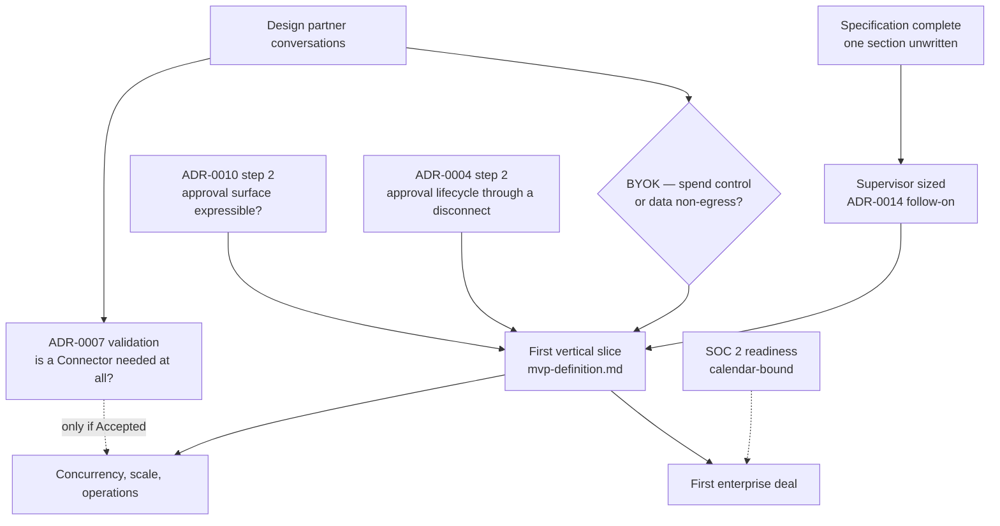

# Milestones

Sequencing, and the work that is bound by a calendar rather than by effort.

This document carries no dates. [`../00-overview/roadmap.md`](../00-overview/roadmap.md) explains
why: no ADR contains one, and a date invented here would read as a commitment. Milestones are
defined by entry and exit criteria, and the only thing on this page measured in time is the work
that is genuinely calendar-bound.

## 1. What blocks what

Three things are worth reading off that graph. **Design-partner conversations gate more than any
engineering task** — the BYOK question and the whole of ADR-0007 sit behind them. **SOC 2 does not
gate the slice**, only the first deal. And **the Connector is no longer on the path to anything**,
which is a consequence of [ADR-0015](../adr/adr-0015-governed-action-positioning.md) rather than a
scheduling choice.

## 2. Milestones

### M1 — Specification complete

**Exit:** every planned document written, or explicitly held with its reason stated in the section
README. At the time of writing, `30-protocol/schemas/` remains, and three documents are held
deliberately — the connector and deployment-topology pair were written against an assumed partner,
and `60-operations/runbooks/` waits for something to operate.

### M2 — The supervisor is sized

**Entry:** M1.
**Exit:** a written answer to whether the run supervisor is glue around an executor or a substantial
distributed runtime, with the responsibilities of
[ADR-0014](../adr/adr-0014-run-supervisor-is-orchestras.md) enumerated against it.

This milestone exists alone rather than folded into M3 because its outcome changes the plan, and in
one direction it changes the positioning: ADR-0015 notes that a platform mostly building a
distributed runtime is not a governance layer. It is cheap, it is a desk exercise, and everything
after it is mis-estimated without it.

### M3 — First vertical slice

**Entry:** M2, plus the BYOK question answered, plus ADR-0010 validation step 2 — the slice ships an
approval surface and cannot be built against a format that cannot express one.
**Exit:** the eight criteria in [`mvp-definition.md`](mvp-definition.md) section 7.

### M4 — Hardening

**Entry:** M3.
**Exit:** concurrency beyond one Run, worker recovery under failure, drain during deployment, and
the observability signals [`../60-operations/`](../60-operations/) specifies — including the
degraded-period bracket, which is the one that proves the audit trail does not lie by omission.

### M5 — First enterprise deal

**Entry:** M3 and SOC 2 readiness sufficient to answer a security review with evidence rather than
intent. M4 is not a precondition, though a buyer may make it one.
**Exit:** commercial, and outside this document.

## 3. The calendar-bound work

[ADR-0001](../adr/adr-0001-product-shape-multi-tenant-saas.md) states it plainly: SOC 2 becomes a
gating requirement for the first deal, it is calendar-bound rather than effort-bound, and the clock
should start before the product is finished. Its risk table rates it High and High.

The consequence for sequencing is the whole point of naming it here. **SOC 2 readiness runs in
parallel from M1, not after M4.** Work that is bound by an observation window cannot be compressed
by adding effort later, and a team that starts it when the product feels ready has already lost the
window. [`compliance-roadmap.md`](compliance-roadmap.md) owns what readiness requires.

Nothing else in the plan is calendar-bound. Everything else is gated by an exit criterion or by a
conversation.

## 4. What is not a milestone

**The Connector.** ADR-0007 is Proposed, its premise is contested by shipped vendor tunnels, and
ADR-0015 demotes it to plumbing. It appears in section 1 as a branch off design-partner validation
and nowhere else. If those conversations establish it is needed, it becomes a milestone then.

**A design partner.** Signing one is not an engineering milestone and cannot be planned like one,
but four registered questions and two Proposed ADRs wait on it. It is the highest-leverage activity
on this page and the only one no amount of engineering substitutes for.

**Tiering.** [ADR-0009](../adr/adr-0009-meter-first-defer-tiering.md) revisits it once three or more
customers are in production. Until then metering runs and prices are set by hand.

## 5. Open questions

| Question | Decided by | ADR required? |
| --- | --- | --- |
| Whether M4 is a precondition for a first deal, or a buyer-by-buyer judgement | A design partner | No |
| What SOC 2 readiness means concretely — Type I or Type II, and scope | [`compliance-roadmap.md`](compliance-roadmap.md) with an assessor | No |
| Whether the supervisor's size, once known, reopens ADR-0015's positioning | [ADR-0015](../adr/adr-0015-governed-action-positioning.md)'s revisit criteria, after M2 | **Yes**, if it does |
| Whether ADR-0004's remaining prototype gates M3 or can follow it | [`../30-protocol/event-protocol.md`](../30-protocol/event-protocol.md); the slice needs an event stream but not necessarily a proven replay path | No |
