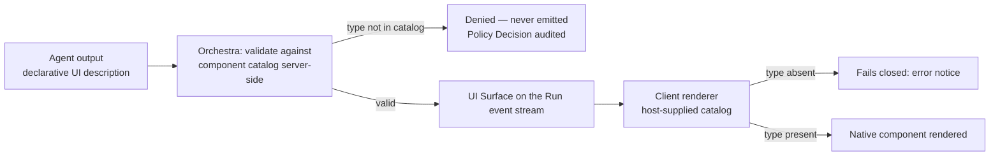

# A2UI Evaluation

The evidence behind [ADR-0010](../adr/adr-0010-a2ui-genui-interchange.md), recorded here so the
reasoning survives independently of the decision record. ADR-0010 is **Proposed**, not Accepted. It
is not binding, and nothing in this document makes it so.

Investigation date: **2026-09-09**. Every claim below is a snapshot of a project that merged 151
pull requests in the preceding thirty days. Re-check before relying on any figure.

## Scope

This document covers two of ADR-0010's three named validation steps:

| Validation step | Verdict | Section |
| --- | --- | --- |
| 1. Current version and stability guarantees | **Not satisfied** | [Version and stability](#version-and-stability) |
| 2. Approval surface expressible without extension | Not attempted | [What this does not establish](#what-this-does-not-establish) |
| 3. Renderer availability for React and React Native | **Partial** | [Renderer availability](#renderer-availability) |

A fourth finding, on the allow-listed component catalog, was not asked for and is the most
consequential result: see [The safety model](#the-safety-model-the-finding-nobody-asked-for).

AG-UI is evaluated separately. That document (`ag-ui-evaluation.md`) is planned in
[`80-reference/`](README.md) and is not yet written; until it exists,
[ADR-0004](../adr/adr-0004-adopt-ag-ui-event-protocol.md) carries the AG-UI evidence.

## What A2UI is

A2UI — Agent-to-UI — is a declarative JSON wire format in which an Agent describes UI *intent*. The
client renders it from a host-declared catalog of pre-approved components. It is data, not
executable code. Apache-2.0, announced by Google on 2025-12-15 at v0.8, canonical repository
[a2ui-project/a2ui](https://github.com/a2ui-project/a2ui).

This is the shape [`UI Surface`](../GLOSSARY.md) already describes: a declarative, agent-produced
interface region rendered natively by an allow-listed client renderer. The evaluation question is
only whether A2UI is the wire format for that, not whether the shape is right.

> **Vocabulary collision.** A2UI says *catalog* for its registry of renderable components. Orchestra
> says [Tool Catalog](../GLOSSARY.md) for the tenant-scoped registry of Tools. They are unrelated.
> This document writes **component catalog** whenever it means A2UI's.

## Version and stability

**Verdict: not satisfied.** The judgement ADR-0010 recorded on assumption is now confirmed on
evidence.

| Version | Project's own designation |
| --- | --- |
| v0.8 | Legacy |
| v0.9 | Previous stable |
| v0.9.1 | Current production release |
| v1.0 | Release candidate |

The [v1.0 specification page](https://a2ui.org/specification/v1.0-a2ui/) states plainly: *"For
production use, consider v0.9.1 (Current)."* The highest version the project recommends for
production is pre-1.0.

The [roadmap](https://a2ui.org/roadmap/) targets **Q4 2026** for v1.0 and lists *"Stability
guarantees"* as a v1.0 deliverable. Stability is therefore a thing the project intends to have, not
a thing it has. The repository README still carries *"Status: Early stage public preview … Expect
changes."*

### The versioning policy exists; the guarantee does not

A2UI **does** publish a versioning policy. The roadmap declares Semantic Versioning: major for
incompatible protocol changes, minor for backward-compatible additions, patch for
backward-compatible fixes. The [v1.0 evolution
guide](https://a2ui.org/specification/v1.0-evolution-guide/) even carries a compatibility
provision — `protocolVersion` defaults to `"0.9"` when a catalog omits it.

What is genuinely absent is narrower, and it is the part that matters to an enterprise contract
review:

1. No stability guarantee is **in force today** — it sits inside the unshipped v1.0 milestone.
2. Individual specification pages, including the v0.9.1 page marked current production, carry only a
   *"NOTE: Living Document"* disclaimer and no compatibility promise of their own.

A declared SemVer policy without a shipped stability guarantee behind it constrains how breakage is
*labelled*, not whether it happens. ADR-0010's acceptance test is correctly written as the published
stability guarantee rather than the 1.0 tag.

### Breakage: one shipped, one queued

One breaking redesign has reached production in the roughly nine months since the v0.8 announcement:
v0.8's *"Structured Output first"* became v0.9's *"Philosophical shift to Prompt-First"*. A second
breaking revision is published as a release candidate and awaits finalisation — v1.0 removes the
theme schema and `primaryColor`, renames `theme` to `surfaceProperties`, replaces `callFunction`
with `callRendererFunction`, and makes `protocolVersion` mandatory.

The migration burden to plan for is therefore **one shipped break plus one queued break**, not two
shipped breaks. The roadmap further normalises this: major versions ship *"Annual or when
significant breaking changes are needed."* Even after 1.0, ADR-0010's adapter is not optional.

### Pinning is harder than it should be

- The repository has published **no GitHub Releases** and carries only two git tags, `v0.8` and
  `v0.9`. Version history lives in prose evolution guides. There is no machine-readable version
  boundary to assert in CI.
- npm package versions do **not** track the protocol version — `@a2ui/react` 0.11.0 implements
  protocol v0.9. Any pin is two-dimensional, package version and `protocolVersion`, and is easy to
  get silently wrong.
- Published page dates are unreliable: the v0.9.1 page's stated date contradicts repository history.
  Do not quote a v0.9.1 release date.

### Governance

Single-vendor. The `a2ui-project` GitHub organisation name does not indicate a transfer of control:
`CONTRIBUTING.md` requires Google's Contributor License Agreement, issue triage is described in a
Google-internal document, `mkdocs.yaml` records `site_author: Google`, and the top contributors are
Google engineers. A2UI has **not** been donated to a foundation, in contrast to Google's A2A
protocol, which [was donated to the Linux
Foundation](https://developers.googleblog.com/en/google-cloud-donates-a2a-to-linux-foundation/). No
statement of intent either way was found.

This is the same exposure ADR-0004 accepts for AG-UI, in the same layer, and is managed the same
way: the adapter is the containment, and Orchestra's own artefact is the public contract.

### Health and adoption

The project is active, not dormant: 16,322 stars, created 2025-09-24, last push 2026-09-08, 151
pull requests merged and 78 issues opened in the trailing thirty days. The risk here is churn, not
abandonment. Against that, 265 open issues and 103 open pull requests six months into public preview
say the surface is still being discovered.

Adoption evidence is **self-reported and Google-dominated** — the project's own adopter page names
Opal, Gemini Enterprise, the Flutter GenUI SDK and Google ADK, with CopilotKit and AG2 as the
notable external integrations. No independent enterprise production case study was found.
Independent implementations do exist and are listed on the [renderer ecosystem
page](https://a2ui.org/ecosystem/renderers/) — `easyops-cn/a2ui-sdk`, `a2ui-swift`, `a2ui-vue`,
AGenUI, ReactLynx and an Android renderer — but that page warns they are maintained by their
authors, not the A2UI team. The interoperability benefit ADR-0010 trades control for is therefore
partly prospective.

## Renderer availability

**Verdict: partial.** React passes. React Native fails.

### React: Orchestra would not write one

`@a2ui/react` is first-party — published by the A2UI team, Apache-2.0, latest 0.11.0 on 2026-09-01,
82,294 downloads in the week to 2026-09-06. It is a real renderer, not a demo. Orchestra would not
have to write one.

Four working caveats, none fatal:

- It implements the `v0_8` and `v0_9` protocol families only. The v1.0 release candidate has **no**
  official web renderer yet, in `@a2ui/react` or in `@a2ui/web_core`.
- Its public API churns: three of the last five releases carry breaking-change entries — 0.9.1
  renamed `createReactComponent`, 0.10.0 renamed `Icon.path` to `svgPath`, 0.11.0 changed
  `buildChild` semantics and removed exports. ADR-0010's adapter absorbs *protocol* drift. It does
  not absorb *renderer API* drift, which lands directly in front-end code.
- Published 0.11.0 peer-requires React `^19.2.7`; `ui-template/control-plane` pins `19.2.4`. A fix
  widening the range landed upstream on 2026-09-08 but is unreleased, so a spike today either bumps
  React or installs with a peer warning.
- It peer-requires `zod` v3, which constrains the whole front-end dependency tree.

There are also **two** React paths. `@copilotkit/a2ui-renderer` (MIT, 328,063 weekly downloads)
bypasses `@a2ui/react`, builds on `@a2ui/web_core` directly, and pins an older core version.
CopilotKit is the same vendor ADR-0004 already touches. Orchestra would have to choose a path; the
two can drift. That choice is **not made** and no ADR covers it.

### React Native: nothing to adopt

There is no first-party React Native renderer. The `renderers/` directory contains `angular`,
`flutter`, `lit`, `markdown`, `react` and `web_core` — no path in the repository matches "native".
React Native appears nowhere on the roadmap, not even as Proposed, while SwiftUI and Jetpack Compose
are Planned. [Pull request #430](https://github.com/a2ui-project/a2ui/pull/430), which offered one,
was **closed rather than merged**. The tracking
[issue #428](https://github.com/a2ui-project/a2ui/issues/428) has been open since 2026-01-05, was
auto-flagged stale, and a direct 2026-09-03 question about maintenance is unanswered.

Two community paths exist, and neither is adoptable:

| Path | State |
| --- | --- |
| [sivamrudram-eng/a2ui-react-native](https://github.com/sivamrudram-eng/a2ui-react-native) | v0.8 only, 28 stars, no commits since the day it was created, never published to npm |
| `@mcp-native/react-native` | On npm, MIT, first published 2026-08-25, ~1,275 weekly downloads, single maintainer, implements a feature-scoped profile of the **v1.0 candidate** and disclaims full coverage |

The correct statement is *no credible third-party option*, not *nothing exists*. A two-week-old
single-maintainer package pinned to an unreleased specification candidate is not a rail an
enterprise governance layer depends on. **If any Orchestra surface is ever React Native, that
renderer is Orchestra's to build and maintain against a moving specification.** The A2UI-native
mobile options are Flutter or Lynx, and adopting either is a front-end platform decision that
[`ui-template/README.md`](../../ui-template/README.md) does not cover and no ADR has taken.

## The safety model: the finding nobody asked for

This was outside the questions posed and is the most useful result of the investigation.

ADR-0010's safety model requires that an Agent never emits executable code and that only components
the host has registered can render. **A2UI genuinely supports this, and it is the project's stated
first design principle rather than a bolt-on.**

- Component catalogs are **host-supplied JSON Schema documents**, not a fixed built-in set. The
  [catalogs documentation](https://a2ui.org/concepts/catalogs/) states that all A2UI JSON from the
  agent is validated against the chosen catalog and that production applications are expected to
  define their own.
- `@a2ui/react` takes catalogs as caller-supplied input and registers custom components against a
  schema.
- Enforcement is visible in renderer source: a component type absent from the catalog renders a
  visible error notice rather than any component, and 0.11.0 additionally reports it through the
  surface's error callback. **It fails closed.**
- Client-side logic functions are referenced by name from the catalog rather than transmitted, which
  the specification says avoids sending executable code. The one markdown path that writes HTML is
  sanitised.

**The caveat is the whole finding.** A search of the v0.9.1 specification found **no normative MUST
requiring a renderer to reject uncatalogued components.** The guarantee rests on renderer
implementations and project prose. A third-party renderer could conform by name and render
uncatalogued components without violating the written specification.

Under CLAUDE.md working rule 5, policy is the security boundary — and a boundary enforced only in
client code that Orchestra does not ship is not a boundary. This is why ADR-0010 now requires
server-side validation of Agent output against the component catalog as well, and treats the
renderer as defence in depth rather than as the enforcement point.

The left-hand check is normative and Orchestra's. The right-hand check is an implementation property
of one renderer. Orchestra MUST NOT rely on the right-hand check alone.

## Relationship to AG-UI

The two projects position themselves as **complementary, not competing**. A2UI's own ecosystem page
puts it as: use AG-UI as the pipe, A2UI as the content. Its roadmap records AG-UI transport as
complete with day-zero compatibility.

That is why ADR-0010 declares `depends_on: [ADR-0004]` rather than contradicting it: the event
protocol and the surface payload are different layers of the same stack. Both ADRs are Proposed,
both take a single-vendor dependency, and both apply the same containment — an internal normalised
model with an adapter at the edge, and an Orchestra-versioned artefact as the public contract.

One asymmetry is worth recording: A2UI's roadmap lists LangGraph framework integration as merely
Proposed. The runtime [ADR-0005](../adr/adr-0005-langgraph-as-compilation-target.md) compiles to is
not a first-class A2UI citizen today. This is a smaller concern than it looks, because ADR-0005
already forbids that runtime from appearing at any public boundary.

## What this does not establish

Named plainly, because none of it is decided:

- **ADR-0010 validation step 2 is untested.** Whether an Approval Request — proposed action,
  Evidence Set, decision affordances — is expressible in A2UI without extension was not assessed.
  Host-defined component catalogs make it look tractable. That is a guess, not a finding.
- **Branded rendering is answerable now, and negatively.** The v1.0 candidate's decoupled branding
  removes theming from the protocol. An approval surface that must render on-brand across clients
  must solve theming outside A2UI regardless of which option ADR-0010 lands on.
- **Accessibility of `@a2ui/react` is unknown.** No audit, no test suite, no conformance statement
  was found. This is the same procurement question ADR-0004 asks of the CopilotKit bindings, and it
  is unanswered here.
- **Bundle size is unmeasured.** No published figure.
- **Conformance testing is unassessed.** A suite is listed as a v1.0 deliverable and a
  `conformance/` directory exists; its coverage and normative status were not evaluated.
- **Whether v1.0 changes the catalog or component model** was not diffed. If it does, both the
  adapter and any renderer work done now need revisiting.
- **Which React path Orchestra takes** — first-party or CopilotKit's — is undecided and needs no
  decision until GenUI enters the roadmap.

No platform code exists yet, so none of this has been tested against a running system. Every
statement above is desk research against primary sources.

## Corrections applied

Recorded so the provenance of this document is auditable. An adversarial verification pass over the
research disputed four claims; all four are corrected in the text above rather than repeated.

| Original claim | Correction |
| --- | --- |
| Two breaking redesigns have shipped | One shipped (v0.8 → v0.9); v1.0 is a queued candidate |
| No backward-compatibility policy is stated | A SemVer policy is published; what is absent is a stability guarantee in force and any promise on the specification pages |
| `googlemaps/a2ui` evidences independent adoption | `googlemaps` is a Google organisation; the independence argument rests on the other listed implementations |
| The sole React Native effort is v0.8-only and not on npm | True of that project, but a second, newer single-maintainer package exists on npm; the verdict is "no credible option", not "none exists" |

## What would reopen this

Per ADR-0010's revisit criteria: when GenUI enters the roadmap, or when A2UI ships v1.0 — targeted
Q4 2026. The acceptance test is the **published stability guarantee**, not the version number. A
donation to a neutral foundation would materially change the governance assessment. A first-party
React Native renderer would close the only outright failure recorded here.

## Sources

All verified 2026-09-09.

- [A2UI project homepage](https://a2ui.org/)
- [A2UI roadmap and versioning policy](https://a2ui.org/roadmap/)
- [A2UI v0.9.1 specification](https://a2ui.org/specification/v0.9.1-a2ui/)
- [A2UI v1.0 specification (release candidate)](https://a2ui.org/specification/v1.0-a2ui/)
- [A2UI v1.0 evolution guide](https://a2ui.org/specification/v1.0-evolution-guide/)
- [Component catalogs](https://a2ui.org/concepts/catalogs/)
- [Official renderer matrix](https://a2ui.org/reference/renderers/)
- [Community renderer ecosystem](https://a2ui.org/ecosystem/renderers/)
- [A2UI in the agent UI ecosystem](https://a2ui.org/introduction/agent-ui-ecosystem/)
- [Repository](https://github.com/a2ui-project/a2ui) ·
  [contributing and CLA](https://github.com/a2ui-project/a2ui/blob/main/CONTRIBUTING.md) ·
  [releases](https://github.com/a2ui-project/a2ui/releases) ·
  [renderers directory](https://github.com/a2ui-project/a2ui/tree/main/renderers)
- [React renderer changelog](https://github.com/a2ui-project/a2ui/blob/main/renderers/react/CHANGELOG.md)
- [React renderer catalog enforcement](https://github.com/a2ui-project/a2ui/blob/main/renderers/react/src/v0_9/A2uiSurface.tsx)
- [v0.9.1 protocol text](https://github.com/a2ui-project/a2ui/blob/main/specification/v0_9_1/docs/a2ui_protocol.md)
- [Google announcement, 2025-12-15](https://developers.googleblog.com/introducing-a2ui-an-open-project-for-agent-driven-interfaces/)
- [CopilotKit A2UI integration](https://docs.copilotkit.ai/generative-ui/a2ui)
