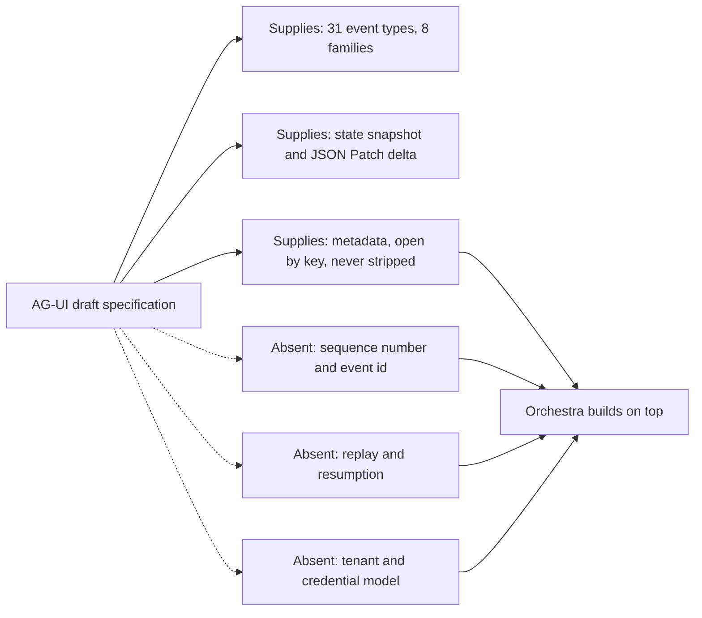

# AG-UI Evaluation

The evidence behind [ADR-0004](../adr/adr-0004-adopt-ag-ui-event-protocol.md), recorded so the
reasoning survives independently of the decision record. An ADR says what was decided; this says
what was measured, from which source, on which date, and where the measurement was wrong first time.

ADR-0004 is **Proposed**, not Accepted, and nothing here makes it binding. Orchestra is
pre-implementation and pre-customer: no platform code exists and no design partner has seen this.

## 1. What AG-UI is

AG-UI — the Agent-User Interaction Protocol — is an open, event-based protocol for real-time
communication between an agent backend and a user-facing application, carried over HTTP+SSE,
HTTP+Protobuf or a custom transport. It defines 31 concrete event types across eight families:
lifecycle, text messages, tool calls, reasoning, state, activity, subagents and passthrough.

It matters for one reason. [ADR-0003](../adr/adr-0003-governance-layer-positioning.md) classifies
agent-to-client event streaming as commodity, so Orchestra should consume it rather than author it —
provided the thing consumed can carry Orchestra's governance obligations and can sit behind a
contract Orchestra controls. This evaluation tested both halves of that proviso. The Orchestra term
for what flows on the stream is **Agent Event**, per [`GLOSSARY.md`](../GLOSSARY.md); AG-UI's own
vocabulary appears here because this document is about AG-UI, and MUST NOT appear in an Orchestra
public contract.

## 2. What was checked, and how far it can be trusted

Three gates were investigated on **2026-09-09** against primary sources: the published
specification, the machine-readable schema, registry metadata, repository files and package
tarballs.

| Gate | Question | Result |
| --- | --- | --- |
| 1 | Specification version, governance model, stability guarantees | Not satisfied |
| 2 | Can the four required per-event guarantees be carried without a fork? | Pass with conditions |
| 3 | Are the CopilotKit React bindings fit for an enterprise first release? | Fail |

Each gate was then re-run adversarially by an independent verification pass against the same
sources. It sustained all three conclusions and disputed several supporting claims. Every correction
is applied below and flagged as one, because a reader of a research record needs to know which
findings were fragile. Two cut against the original case: the Python package **does** declare MIT
(3.1), and the go-forward React bindings **do** re-export the protocol's types (5.3).

These are readings taken on one day from a project that shipped roughly 790 commits in the preceding
30 days and was pushed the day before. Treat every figure as a timestamped observation, not a
standing fact, and re-take it before relying on it.

## 3. Gate 1 — version, governance and stability

**There is no version to pin.** No version of the specification has ever been frozen. The only
published artefact is a [draft](https://docs.ag-ui.com/spec/draft/basic) under the banner *"Draft —
not yet ratified… nothing here is covered by a compatibility promise until a version is frozen. Do
not cite it as a stable reference."* There is no version selector beside `draft`, and the project's
own spec-hosting README describes frozen versions as a future state. The implementations agree:
[`@ag-ui/core`](https://registry.npmjs.org/@ag-ui/core) was at **0.0.59** (2026-08-27, MIT), never
out of the `0.0.x` line in roughly sixteen months across 33 stable releases since 2025-04-30, with a
`0.1.1` canary published 2026-07-30 and abandoned back to that line;
[`ag-ui-protocol`](https://pypi.org/pypi/ag-ui-protocol/json) on PyPI was at **0.1.22** (2026-08-31).

**Correction.** The first pass reported that the Python package declares no licence, because the
legacy `license` string is null and the classifier list empty. That is a metadata-format detail, not
an absence: it declares `license_expression: "MIT"` with `license_files: ["LICENSE"]`, the PEP 639
form PyPI has recorded since 2025. Its licensing position is the same plain MIT as the TypeScript
SDK's. The point that bears on the decision survives — the specification text carries an ordinary
MIT licence held by a private company, with no standards-body IPR policy, no express patent grant
and no defensive-termination clause.

**Governance is one company with a commercial interest.** `CODEOWNERS` assigns the whole repository
to a single team; there is no `GOVERNANCE.md`; `CONTRIBUTING.md` defines no RFC, proposal or
standards process and links work items to a private tracker; the organisation's `discussions`
repository, the nearest thing to a public deliberation venue, is a stub last pushed 2025-06-06. The
legal entity is Tawkit Inc., trading as CopilotKit, whose commercial product sits on top of the
protocol and whose [Series A](https://www.copilotkit.ai/blog/series-a) was announced 2026-05-05;
that announcement calls AG-UI "open, independent, free" and says nothing about a foundation. This is
the fact that changed ADR-0004: a governance layer sold to enterprises makes compatibility promises,
and cannot make one stronger than the promise of the artefact it derives from unless the derivation
is its own.

**A breaking transition is in flight.** The [1.0 draft
changelog](https://docs.ag-ui.com/spec/draft/changelog) lists eight major changes against `0.x`: the
`THINKING_*` family retired for a reasoning family, `RUN_FINISHED` gaining an outcome, subagent
attribution, activity events, a binary transport, and normative processing rules where `0.x`
"defined shapes; behaviour lived in the TypeScript client". The
[events documentation](https://docs.ag-ui.com/concepts/events) says certain events "will be removed
in version 1.0.0". Cross-SDK conformance is unsettled too: a commit merged 2026-09-08 reads
`fix(go-sdk): stop RunFinished emitting an outcome the peer SDKs reject`.

**Adoption grew, which is why the answer was not rejection.**

| Signal | Reading on 2026-09-09 |
| --- | --- |
| Integrations in the repository | 21, including Microsoft Agent Framework, Google ADK, AWS Strands, Bedrock AgentCore, Pydantic AI, LlamaIndex, Mastra, Agno, AG2, LangChain/LangGraph, CrewAI, Vercel AI SDK, watsonx |
| Commits, trailing 30 / 90 days | 790 / 1,608; last push 2026-09-08 |
| Stars / forks / contributors | 15,794 / 1,425 / 142 |
| Open issues and pull requests | ~218 issues, 146 open pull requests |
| `@ag-ui/core` downloads, month to 2026-09-06 | 6,741,657 |
| Hyperscaler support | [Native AG-UI support in Amazon Bedrock AgentCore Runtime](https://aws.amazon.com/about-aws/whats-new/2026/03/amazon-bedrock-agentcore-runtime-ag-ui-protocol/), 2026-03-13, fourteen regions |

Re-deriving a 31-event protocol that several major vendors already emit would be a poor use of a
pre-customer year. That is the ADR-0003 argument unchanged, and it is why the decision was to adopt
behind a profile rather than to reject.

**Corrections.** Two supporting claims narrowed. First-party SDK status is contradictory in AG-UI's
own documentation — the draft spec index names TypeScript, Python and .NET as first-party while the
[introduction](https://docs.ag-ui.com/introduction) tags .NET "Community" and `CONTRIBUTING.md`
names it as a community integration; treat only TypeScript and Python as reliably first-party. And
the schema's `$id` returns a 301 whose response carries no `Access-Control-Allow-Origin` header,
though the file it redirects to does serve one — the conclusion holds for a different reason, since
a CORS-mode fetch applies the check to every response in the redirect chain, so a browser-based
validator fails at the redirect rather than at the file.

The verification pass added one point in AG-UI's favour. The
[versioning page](https://docs.ag-ui.com/spec/draft/basic/versioning) does publish compatibility
rules for the moment a version freezes: additive-only growth, no meaning carried by an addition
alone, lossless downgrades MAY be silent while lossy ones MUST warn, a deprecation registry with
expiries, and in-band version negotiation. That is the same rule Orchestra sets for itself in
[`VERSIONING.md`](../VERSIONING.md) R3 — normative in intent, not binding until a freeze.

## 4. Gate 2 — ordering, replay and metadata carriage

Orchestra needs four things on every Agent Event: a per-Run monotonic `seq`, a `run_id`, a
`tenant_id` and a server-assigned `event_id`. The gate asked whether AG-UI can carry them without
forking the schema.

**What the protocol does not supply.** The `BaseEvent` envelope carries exactly four fields: `type`
(required), `timestamp`, `rawEvent` and `metadata`. No sequence number, no event id. `timestamp` is
informational and *"a consumer MUST NOT use it to order events — arrival order is the protocol's
order."* Ordering is delegated to the transport as a binding obligation, with no in-band mechanism
and no gap detection. Replay is not merely absent but foreclosed: the
[HTTP+SSE binding](https://docs.ag-ui.com/spec/draft/basic/transports/http-sse) has a section titled
**No resumption** — `Last-Event-ID` is not used, a broken stream cannot be re-entered, recovery is a
new run with a new `runId`, and consumers MUST ignore the SSE `id:` field, closing off the obvious
cursor. There is no at-least-once, exactly-once, deduplication or idempotency-key language anywhere.

Of AG-UI's identifiers — `threadId`, `runId`, `messageId`, `toolCallId`, `subagentRunId` — only
`runId` is one Orchestra needs, and just 2 of the 31 concrete event definitions carry it
(`RunStarted`, `RunFinished`); `RunError` does not. There is no tenant concept at all:
[transports](https://docs.ag-ui.com/spec/draft/basic/transports) states that authentication and
authorization are properties of the binding and the application, not of the protocol. Tenant scoping
is entirely Orchestra's, as CLAUDE.md working rule 7 requires regardless.
[State synchronisation](https://docs.ag-ui.com/spec/draft/events/state) is genuinely supplied:
`STATE_SNAPSHOT` replaces wholesale, `STATE_DELTA` is an
[RFC 6902](https://www.rfc-editor.org/rfc/rfc6902) JSON Patch applied atomically, and deltas carry
no version or sequence field — divergence is repaired by a fresh snapshot.

**What it does supply is `metadata`, and only `metadata`.** All 31 concrete definitions set
`unevaluatedProperties: false`; only the abstract `BaseEvent` and the `Event` union are open.
`Metadata` is the schema's one open-by-key object. The
[processing model](https://docs.ag-ui.com/spec/draft/basic/processing) requires a conformant
consumer to strip unknown properties and *"MUST NOT let a stripped property survive into the value
application code receives"* — while
[protecting metadata](https://docs.ag-ui.com/spec/draft/basic/metadata): *"Unknown metadata keys are
protocol-legal, not unrecognised material: the processing model never strips them, on any key."* The
`ag-ui` key is reserved, every other key is application space, and producers SHOULD vendor-prefix.

This was tested, not assumed, and reproduced by the verification pass — `jsonschema` 4.25.1 against
the [published Draft 2020-12 schema](https://docs.ag-ui.com/spec/draft/schema.json), on a `CUSTOM`
event and a `TEXT_MESSAGE_CONTENT` event:

| Carriage | Result |
| --- | --- |
| `seq`, `tenantId`, `eventId`, `runId` as top-level event fields | Schema-invalid |
| The same four nested under `metadata` | Valid |

So: yes, without a fork, on one condition. The four fields MUST live under a vendor-prefixed key
inside `metadata` and MUST NOT be top-level event fields.

Three consequences are easy to miss. First, top-level extras currently parse, and that is a trap:
the TypeScript `BaseEventSchema` uses `.passthrough()` and the Python `ConfiguredBaseModel` sets
`extra="allow"`, so a prototype will appear to work — but the specification names this an unmet
conformance gap, the schema is the generator source of truth for all SDKs, and the
[Protobuf binding](https://docs.ag-ui.com/spec/draft/basic/transports/http-protobuf)'s `BaseEvent`
declares four fields with no catch-all, so top-level extras vanish silently on the binary wire.
Second, a `seq` in metadata is expressible but unenforceable by anyone else: the specification tells
consumers arrival order is authoritative, so no third-party consumer will verify Orchestra's
sequence or detect a gap. It is data Orchestra carries and Orchestra's own client validates. Third,
merge semantics thin the trail for streamed items — for `TEXT_MESSAGE_*`, `TOOL_CALL_*`,
`REASONING_*` and `ACTIVITY_*` a consumer MUST merge event metadata key by key, last-write-wins,
into the assembled item, so a per-event `seq` collapses to its final value for any consumer reading
merged items. Governance events carried as `CUSTOM`, and the `RUN_*`, `STEP_*` and snapshot events,
have no merge target and keep their metadata intact.

One near-miss: a [`MetaEvent` proposal](https://docs.ag-ui.com/drafts/meta-events) carrying an `id`
and a `ts` sits outside the specification proper. It is not part of the event model and MUST NOT be
relied on.

The verification pass found no factual error in this gate. Its corrections were cosmetic: three
nested inline subschemas also set `additionalProperties: true`; the schema carries `parentRunId`,
`parentToolCallId`, `parentMessageId` and `interruptId` beyond the five named identifiers; and the
release cadence is nearer 2.4 per week than "roughly weekly".

## 5. Gate 3 — CopilotKit React bindings fitness

ADR-0004 originally booked a saving on the assumption that existing React bindings were usable for a
first release. This gate tested that against
[`@copilotkit/react-core`](https://registry.npmjs.org/@copilotkit/react-core) and
`@copilotkit/react-ui`, both at 1.70.2 (2026-09-08). Their strongest area is theming: seven CSS
custom properties, a documented class contract, sub-component replacement and a headless mode. The
finding against them rests elsewhere.

**Accessibility — no claim, no backlog, no live region.** A recursive search of all 25,785
repository paths returns no accessibility statement, VPAT, WCAG or Section 508 document. Across the
37 component source files in `@copilotkit/react-ui@1.70.2`: 12 occurrences of `aria-label`, 2 of
`role=`, and **zero** of `aria-live`, `aria-labelledby`, `aria-describedby`, `aria-modal`,
`aria-busy`, `tabIndex` or `sr-only`. A streaming transcript with no live region is silent to a
screen reader. `Modal.tsx`, `Popup.tsx` and `Sidebar.tsx` carry no role, no ARIA and no focus trap,
only a `hitEscapeToClose` flag; the focus-management library the repository already depends on is
imported by the internal dev console and by no customer-facing component. Issue search returns 0
results for `accessibility` in title and 0 for `aria`, against 538 for `bug`, so this is not a
tracked backlog item. The Angular package carries accessibility tests; React does not. For the
segment fixed by [ADR-0002](../adr/adr-0002-enterprise-segment-and-byok.md) that is a procurement
stop, not a backlog item.

**Licence and branding — real, but narrower than first reported.** Every `package.json`, `LICENSE`
file and registry entry says MIT while the official OSS-versus-enterprise docs page says "Apache 2.0
licensed" twice; `@copilotkit/shared` ships no `LICENSE` in its tarball; the Angular package's
`LICENSE` names a different copyright holder from the root. The project is open-core rather than
merely open-source: a [licence verifier](https://registry.npmjs.org/@copilotkit/license-verifier)
implementing Ed25519-signed tokens, tiers, licensed features and organisation entitlements is a hard
dependency of both the runtime and the shared package, and self-hosting is a paid tier.

**Correction.** The first pass called default-on branding a blocker with no key-free off-switch.
That is overstated for the v1 prebuilt chat. It is accurate that `Input.tsx` gates "Powered by
CopilotKit" on the presence of a CopilotKit API key, and that `PoweredByTag`'s `removeBranding` prop
is never passed by its sole call site and so is unreachable through the component API. But
sub-component replacement is a documented customization layer, the chat component accepts an `Input`
component as a prop, and swapping it removes the tag with no licence key — as does headless mode.
The claim holds unqualified only for v2, where the provider renders a fixed-position,
non-dismissible banner reading "Powered by CopilotKit" with a "Get a license" link whenever no key
is present, reserving layout space, with no suppression prop anywhere in the 1,077-line provider.
The Angular package additionally carries a complete "CopilotKit Unlicensed" watermark behind a
disabled flag, with a comment that it is kept intact so it can be re-enabled.

**Coupling — the correction that matters most.** The first pass concluded the bindings expose no
protocol types and built a replacement-cost argument on it: coupling at the hook-and-vocabulary
boundary rather than the protocol boundary means "swap the bindings, keep the protocol" is not a
swap. That premise is wrong for the surface that matters. It holds for the deprecated default entry
point, whose exports are CopilotKit vocabulary. It fails for v2, the go-forward API:
`packages/react-core/src/v2/index.ts` line 9 reads `export * from "@ag-ui/client";`, and the
published artefact carries it in both `dist/v2/index.mjs` and `dist/v2/index.d.mts`. AG-UI types
appear directly in v2 signatures, among them `AbstractAgent`, `Interrupt`, `ResumeEntry`,
`RunAgentResult`, `ToolCall` and `Message`. The correction does not rehabilitate the bindings; it
points the other way. v2 couples at **both** boundaries, so adopting it puts a `0.0.x` protocol's
types directly into Orchestra application code.

The rails-leak finding also needs narrowing. `useLangGraphInterrupt` is genuinely a public export,
with four related LangGraph-named symbols — but all are confined to the deprecated surface under
deprecation notices, and v2 renames the concept and leaks no rail name. It is a defect of a
deprecated entry point, not an unavoidable property of the package. The other half is unqualified:
`@copilotkit/react-core@1.70.2` declares the tool-protocol SDK as a peer dependency with no
`peerDependenciesMeta`, making it mandatory for every consuming frontend, and the v1 path pulls a
GraphQL client into the browser.

**Weight and stability.** Measured locally with esbuild — React external, production, minified,
code-split — because the usual public size service returns byte-identical figures for two packages
whose outputs differ severalfold and cannot be trusted here:

| Measurement | `react-core` + `react-ui` | `@ag-ui/client` alone |
| --- | --- | --- |
| Initial chunk, minified / gzipped | 661.7 KB / 204.5 KB | 222.4 KB / 50.8 KB |
| All chunks, minified / gzipped | 17,430 KB / 3,928 KB | — |
| Install footprint | 644 packages, 519 MB | 23 MB, no peer dependencies |

The weight arrives through a static dependency on a Markdown-streaming package pulling in syntax
grammars, a diagramming library, a graph library and a maths typesetter, present even in the
headless build. **Stated weakness of this measurement:** esbuild's splitting approximates but does
not reproduce Next.js or webpack chunking, so the initial-chunk figure could move materially in a
real build; the total-payload and install-footprint figures are robust regardless of bundler. The
React surface is also mid-rewrite — the two deprecated source trees hold 257 files between them, v2
sits behind separate export paths, the prebuilt chat is built on the deprecated half, and 22
distinct minor lines shipped in the trailing year.

## 6. What this changed in ADR-0004

| Original position | Position after the investigation |
| --- | --- |
| Adopt AG-UI directly as the public client-facing contract | Internal wire format only; the public contract is an Orchestra-versioned profile with its own semantic version and conformance suite |
| Mitigate upstream churn by pinning a version | There is no version to pin; the profile pins a commit of the draft schema |
| "State sync, ordering and reconnection arrive with the protocol" | Only state sync arrives. Ordering is a transport obligation with no in-band mechanism; replay and resumption are Orchestra's to build |
| 16–17 event types, per a vendor blog post | 31 concrete event types across eight families, per the specification |
| Existing React bindings are usable for the first release | Withdrawn. The protocol is adopted, the bindings are not; Orchestra writes its own thin React surface over an Orchestra-owned adapter |
| Per-event guarantees carried as event fields | Carried under a vendor-prefixed key inside `metadata`; top-level carriage prohibited |

Validation steps 1, 3 and 4 are complete. Step 2 — prove the Approval Request lifecycle survives
disconnect and replay — remains, and needs code rather than research. The ADR stays **Proposed**
until it passes.

One weakness in the outcome, raised by the verification pass and not yet addressed in ADR-0004: the
recommendation consumes the AG-UI client library while rejecting the same vendor's bindings. One
company governs both. Rejecting the bindings removes a dependency on the vendor's UI decisions, not
on its protocol decisions. The profile is what contains that exposure, which is why it is
load-bearing rather than precautionary.

## 7. What remains unverified

- **Whether the Approval Request lifecycle fits the draft's interrupt-and-resume pattern.** The
  pattern exists — an interrupt on run completion, tied to a tool call, with resume entries on the
  run input — and looks a better fit than a custom-event envelope, but those pages were not read in
  full. This is validation step 2, and it needs code.
- **When 1.0 freezes.** No public milestone, dated roadmap entry or announced target was found.
- **Whether a frozen 1.0 keeps `metadata` open-by-key and `unevaluatedProperties: false` on concrete
  events.** Both are draft behaviour with no compatibility promise, and Orchestra's whole extension
  strategy rests on the first.
- **Whether the vendor intends to move AG-UI to a foundation.** Nothing found either way.
- **Whether any integration has ever been removed.** Growth is established; non-removal is not.
- **Whether an upstream proposal to add a sequence number or event id would be accepted.** No
  proposal process is visible to assess.
- **Whether a public conformance corpus exists.** The Protobuf binding references a canonical-event
  corpus, but none was found in the repository tree, so an Orchestra profile has no upstream suite
  to test against and would define its own.
- **The composition of the roughly 218 open issues.** The count is confirmed; whether it includes
  unresolved protocol-semantics disputes was not sampled.
- **Everything downstream of a real buyer.** Per CLAUDE.md working rule 8 this is pre-customer: no
  enterprise reviewer has seen the accessibility finding, the licensing finding, or the profile as a
  contract.

## 8. Repository sources

Sources whose paths are too long for prose. All returned HTTP 200 on 2026-09-09, as did every link
above.

| Evidence | Source |
| --- | --- |
| Ownership, contribution process, integration inventory, activity | [ag-ui repository](https://github.com/ag-ui-protocol/ag-ui), [CODEOWNERS](https://github.com/ag-ui-protocol/ag-ui/blob/main/.github/CODEOWNERS), [CONTRIBUTING.md](https://github.com/ag-ui-protocol/ag-ui/blob/main/CONTRIBUTING.md), [spec README](https://github.com/ag-ui-protocol/ag-ui/blob/main/docs/spec/README.md) |
| Licence text and the conflicting Apache 2.0 statement | [LICENSE](https://github.com/CopilotKit/CopilotKit/blob/main/LICENSE), [oss-vs-enterprise.mdx](https://github.com/CopilotKit/CopilotKit/blob/main/showcase/shell-docs/src/content/docs/concepts/oss-vs-enterprise.mdx) |
| v1 branding gate and the documented replacement path | [Input.tsx](https://github.com/CopilotKit/CopilotKit/blob/main/packages/react-ui/src/components/chat/Input.tsx), [PoweredByTag.tsx](https://github.com/CopilotKit/CopilotKit/blob/main/packages/react-ui/src/components/chat/PoweredByTag.tsx), [bring-your-own-components.mdx](https://github.com/CopilotKit/CopilotKit/blob/main/showcase/shell-docs/src/content/snippets/shared/guides/custom-look-and-feel/bring-your-own-components.mdx) |
| v2 licence banner and the disabled watermark | [license-warning-banner.tsx](https://github.com/CopilotKit/CopilotKit/blob/main/packages/react-core/src/v2/components/license-warning-banner.tsx), [CopilotKitProvider.tsx](https://github.com/CopilotKit/CopilotKit/blob/main/packages/react-core/src/v2/providers/CopilotKitProvider.tsx), [license-watermark.ts](https://github.com/CopilotKit/CopilotKit/blob/main/packages/angular/src/lib/license-watermark.ts) |
| v2 protocol re-export | [v2/index.ts](https://github.com/CopilotKit/CopilotKit/blob/main/packages/react-core/src/v2/index.ts) |

Sibling evaluations for A2UI, MCP, LangGraph and the wider prior-art survey are planned but not yet
written; see the [section README](README.md).
