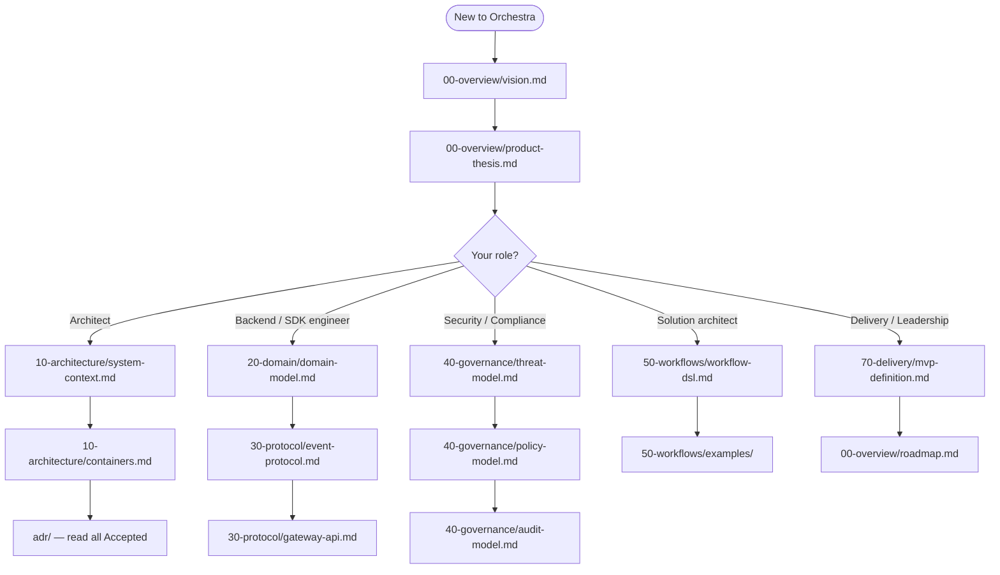

# Orchestra — Platform Documentation

Orchestra is a **multi-tenant SaaS governance and connectivity layer for enterprise AI agents.**
It is not an agent framework. The orchestration runtime (LangGraph), the model providers, and the
tool protocol (MCP) are treated as commodity rails. Orchestra supplies the control surface over them:
identity, policy, approval, audit, connectivity, workflow definition, and metering.

> **Product thesis.** Deterministic where determinism matters. Agentic where judgment matters.
> Governed at every step.

---

## 1. How this documentation is organised

| Path | Contains | Primary audience |
| --- | --- | --- |
| [`00-overview/`](00-overview/) | Vision, thesis, personas, scope, roadmap | Everyone |
| [`10-architecture/`](10-architecture/) | C4 views, control plane, data plane, connector, tenancy, deployment | Architects, engineers |
| [`20-domain/`](20-domain/) | Domain model, entity lifecycles, state machines | Engineers |
| [`30-protocol/`](30-protocol/) | Event protocol, gateway API, UI protocol, JSON Schemas | SDK + backend engineers, integrators |
| [`40-governance/`](40-governance/) | Policy model, approvals, tool authorization, audit, threat model | Security, compliance, engineers |
| [`50-workflows/`](50-workflows/) | Workflow DSL, step types, execution semantics, examples | Engineers, solution architects |
| [`60-operations/`](60-operations/) | Observability, reliability, quotas & metering, runbooks | SRE, operations |
| [`70-delivery/`](70-delivery/) | MVP definition, milestones, testing strategy, compliance roadmap | Delivery, leadership |
| [`80-reference/`](80-reference/) | Prior-art evaluations, external protocol notes, benchmarks | Everyone |
| [`adr/`](adr/) | Architecture Decision Records — the binding decisions | Everyone |
| [`rfc/`](rfc/) | Proposals under discussion, before they become ADRs | Everyone |
| [`archive/`](archive/) | Superseded documents, retained for provenance | Historians |

Directory prefixes (`00-`, `10-`, …) fix reading order and leave room for insertion. They are part of
the path and must not be renumbered once published — see [VERSIONING.md](VERSIONING.md).

---

## 2. Reading paths



---

## 3. Document conventions

**Front matter.** Every document carries YAML front matter:

```yaml
---
title:        Human-readable title
doc_id:       DOC-NNN            # stable, never reused
version:      MAJOR.MINOR.PATCH  # of this document
status:       Draft | In Review | Approved | Superseded | Deprecated
last_updated: YYYY-MM-DD
owners:       [team-or-role]
supersedes:   docs/path/to/old.md   # optional
depends_on:   [ADR-0001, DOC-012]   # optional
---
```

**File naming.** Lowercase kebab-case, `.md`. ADRs use `adr-NNNN-short-title.md`. RFCs use
`rfc-NNNN-short-title.md`. Schemas use `<entity>.v<MAJOR>.schema.json`. No spaces, no dates in
filenames except in `archive/`.

**Diagrams.** Mermaid, inline in the Markdown, so diagrams version with the prose and diff in review.
Only when Mermaid cannot express it (dense sequence charts, physical topology) may an SVG live in
[`assets/diagrams/`](assets/diagrams/) — and it must ship with its source.

**Architecture views** follow the [C4 model](https://c4model.com): Level 1 system context,
Level 2 containers, Level 3 components where warranted. No Level 4.

**Requirement keywords** — MUST, MUST NOT, SHOULD, SHOULD NOT, MAY — carry their
[RFC 2119](https://www.rfc-editor.org/rfc/rfc2119) meanings and are written in capitals.

**Normative vs informative.** Sections in `30-protocol/` and `40-governance/` are normative:
implementations must conform. Everything else is informative unless it says otherwise.

**Decisions live in ADRs, not in prose.** If a document explains *why* an approach was chosen, it
links to an ADR. If no ADR exists, the decision is not yet made — say so explicitly rather than
implying consensus.

---

## 4. Status of this documentation set

This set is at **v0.9.0** and is **pre-implementation**. It supersedes the single-file v0.1 vision
brief, retained at [`archive/vision-v0.1-2026-09-08.md`](archive/vision-v0.1-2026-09-08.md).

Substantive changes from v0.1, each recorded as an ADR:

| Change | ADR |
| --- | --- |
| Product shape fixed as multi-tenant SaaS | [ADR-0001](adr/adr-0001-product-shape-multi-tenant-saas.md) |
| Target segment: enterprise, BYOK model credentials | [ADR-0002](adr/adr-0002-enterprise-segment-and-byok.md) |
| Repositioned as governance layer, not agent framework | [ADR-0003](adr/adr-0003-governance-layer-positioning.md) |
| Client event protocol: AG-UI internally, behind an Orchestra-versioned profile | [ADR-0004](adr/adr-0004-adopt-ag-ui-event-protocol.md) |
| LangGraph confined behind a compilation boundary | [ADR-0005](adr/adr-0005-langgraph-as-compilation-target.md) |
| Model layer reduced to a credential/endpoint broker | [ADR-0006](adr/adr-0006-model-layer-as-credential-broker.md) |
| Enterprise reachability via outbound connector | [ADR-0007](adr/adr-0007-outbound-connector-for-enterprise-reachability.md) |
| Customer-defined workflows, compiled not interpreted | [ADR-0008](adr/adr-0008-declarative-workflow-definitions.md) |
| Meter from day one; defer tiering | [ADR-0009](adr/adr-0009-meter-first-defer-tiering.md) |
| A2UI as GenUI interchange — deferred pending evaluation | [ADR-0010](adr/adr-0010-a2ui-genui-interchange.md) |

---

## 5. Contributing

1. Substantive proposals start as an **RFC** in [`rfc/`](rfc/).
2. Once a decision is reached, it is recorded as an **ADR**. ADRs are immutable once Accepted —
   they are superseded, never edited.
3. Documents affected by the decision are then updated, and [`CHANGELOG.md`](CHANGELOG.md) records
   the change against the documentation-set version.
4. Protocol and schema changes additionally follow the compatibility rules in
   [VERSIONING.md](VERSIONING.md) and require a contract test before merge.
