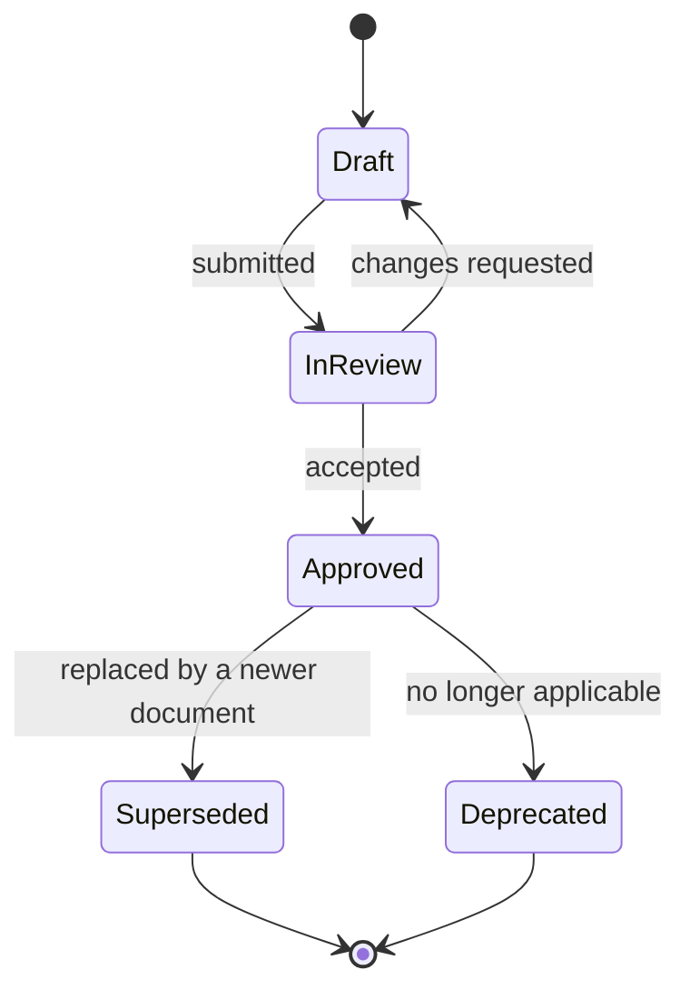
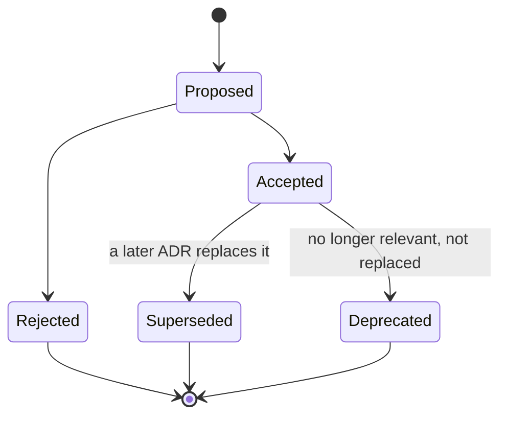
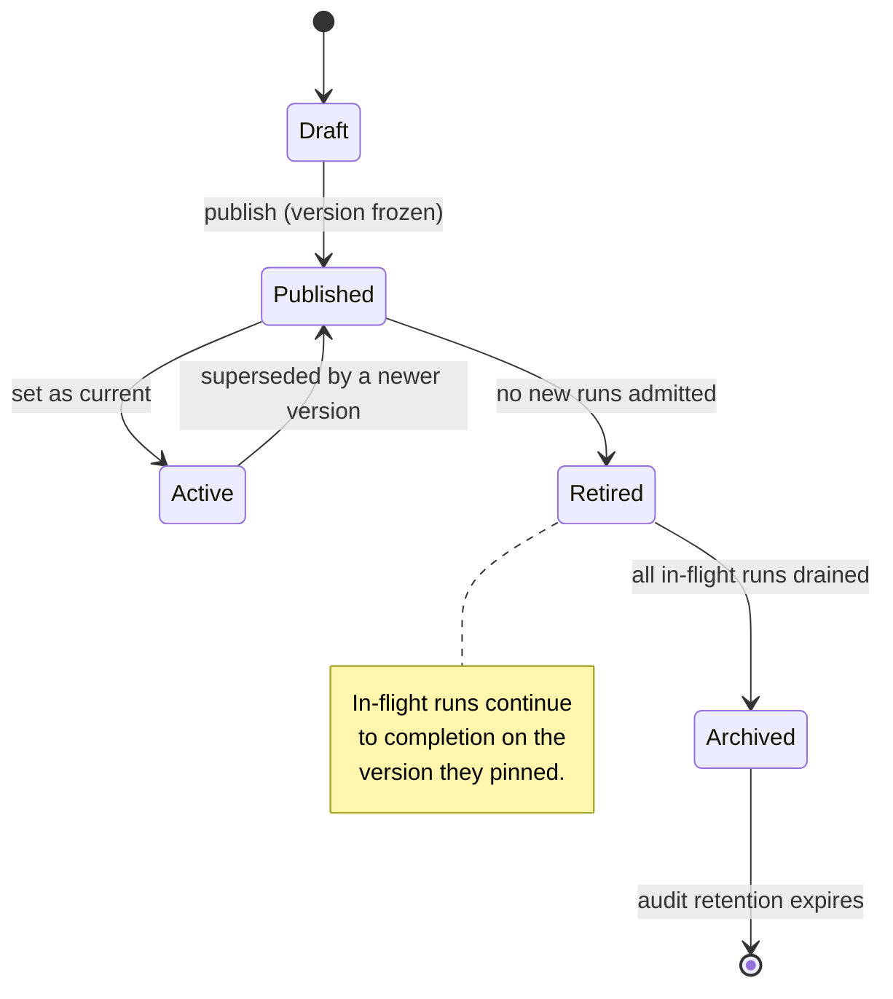

# Versioning & Compatibility Policy

**Normative.** This document governs every versioned artifact Orchestra produces. Nine distinct things
carry versions, and they are deliberately decoupled — coupling them would force unrelated breaking
changes on customers.

| # | Artifact | Scheme | Breaking change costs |
| --- | --- | --- | --- |
| 1 | Documentation set | SemVer | Nothing — informational |
| 2 | Architecture Decision Records | Immutable + supersession | Nothing — historical |
| 3 | Gateway HTTP API | URL major + dated revision | Customer code change |
| 4 | Agent event protocol | SemVer, additive-only within major | Every client SDK, every embedded app |
| 5 | JSON Schemas | Versioned `$id` | Every producer and consumer |
| 6 | Client SDKs | SemVer, independent per package | Customer rebuild + redeploy |
| 7 | Workflow definitions | Immutable versions, pinned per run | **In-flight executions — highest risk** |
| 8 | Agent definitions | Immutable versions, pinned per run | In-flight runs |
| 9 | Connector | SemVer + negotiated skew window | Customer must upgrade software inside their network |

---

## 1. Universal rules

**R1 — SemVer semantics.** `MAJOR.MINOR.PATCH`. MAJOR breaks compatibility, MINOR adds
backward-compatible capability, PATCH fixes without changing contracts.

**R2 — Additive evolution is the default.** A new optional field, event, step type or component is a
MINOR change. Removing or repurposing anything is MAJOR. Renaming is removal plus addition.

**R3 — The must-ignore rule.** Every consumer of an Orchestra contract — SDK, connector, renderer,
webhook receiver — **MUST silently ignore fields, events, enum values and component types it does not
recognise**, and MUST NOT fail, warn loudly, or drop the surrounding envelope. This single rule buys
years of additive evolution and is the cheapest compatibility guarantee available. It is a conformance
requirement, tested in the contract suite.

**R4 — No renumbering.** Document IDs, ADR numbers, RFC numbers and directory prefixes are stable
forever. Retired identifiers are never reused.

**R5 — Deprecate before removing.** Nothing is removed without a prior deprecation, an announced
sunset date, and telemetry proving the deprecated path is unused by supported customers.

---

## 2. Documentation set

The set version lives in [`README.md`](README.md) front matter; every document also carries its own.

- **PATCH** — typos, clarification, formatting.
- **MINOR** — new document, materially expanded section, new diagram.
- **MAJOR** — a change that invalidates prior guidance, e.g. a reversed architectural position.

Changes are recorded in [`CHANGELOG.md`](CHANGELOG.md) in
[Keep a Changelog](https://keepachangelog.com/en/1.1.0/) format.

**Document status lifecycle:**



A superseded document is moved to [`archive/`](archive/), renamed
`<original-name>-v<version>-<YYYY-MM-DD>.md`, and its `supersedes` / superseded-by links are set on
both sides. Archived documents are never edited.

---

## 3. Architecture Decision Records

ADRs are **immutable once Accepted.** Correcting an accepted decision means writing a new ADR that
supersedes it. This preserves the reasoning trail, which is the entire point of the practice.



Format: [MADR](https://adr.github.io/madr/). Template: [`adr/adr-template.md`](adr/adr-template.md).

---

## 4. Gateway HTTP API

Two-dimensional versioning, following the pattern proven by Stripe.

**Major version in the path** — `/v1/runs`. A new major version is a parallel API surface, reserved
for changes that cannot be expressed additively. Expect `/v1` to last years.

**Dated revisions in a header** — `Orchestra-Version: 2026-09-08`. Backward-incompatible refinements
within a major version are released as dated revisions. A tenant is pinned to the revision in effect
when it onboarded and upgrades deliberately.

```http
POST /v1/runs
Authorization: Bearer <session-token>
Orchestra-Version: 2026-09-08
Idempotency-Key: <client-generated-uuid>
```

- Requests without `Orchestra-Version` resolve to the tenant's pinned revision, never to `latest`.
  Defaulting to latest would break customers on our release schedule rather than theirs.
- Every state-changing endpoint MUST accept `Idempotency-Key` and MUST return the original response
  for a replayed key within the retention window.
- Deprecated endpoints return `Deprecation` and `Sunset` headers
  ([RFC 9745](https://www.rfc-editor.org/rfc/rfc9745), [RFC 8594](https://www.rfc-editor.org/rfc/rfc8594)).

**Support window:** each dated revision is supported for **24 months** from the release of its
successor. A major path version is supported for **36 months** after its successor becomes GA.

---

## 5. Agent event protocol

The client-facing event contract is the **Orchestra Agent Event Profile**, specified in
[`30-protocol/event-protocol.md`](30-protocol/event-protocol.md). It is Orchestra's artefact,
carrying Orchestra's version and Orchestra's compatibility promise, and it pins an upstream draft
event format by commit rather than adopting it as the contract. See
[ADR-0004](adr/adr-0004-adopt-ag-ui-event-protocol.md), which is **Proposed** and therefore not yet
binding. Two version numbers apply:

- **Pinned upstream commit** — tracked, not controlled by us, and not a promise Orchestra re-exports.
  No upstream version has ever been frozen, which is why the profile exists.
- **Profile version** — Orchestra's own semantic version: which upstream events the profile admits,
  plus the governance extensions it defines (approval lifecycle, policy decisions, workflow step
  transitions, quota signals).

Extension namespacing is mandatory: `orchestra.approval.required`, `orchestra.policy.denied`,
`orchestra.workflow.step.started`. Unprefixed custom event names are reserved for upstream.

**Every event MUST carry** a monotonically increasing per-run `seq`, the `run_id`, the `tenant_id`,
and a server-assigned `event_id`, in the profile's vendor-prefixed metadata rather than as top-level
fields — `30-protocol/event-protocol.md` states why. Ordering and replay are guarantees the profile
makes and Orchestra implements; the upstream format supplies neither, so they are built rather than
inherited. This is the gap that made the v0.1 event model unimplementable.

Stream resumption uses SSE `Last-Event-ID`, which names the last event the client received. The
server MUST replay from the event *after* that `seq`, within
the run's event-retention window, and MUST fail explicitly rather than silently skipping a gap.

---

## 6. JSON Schemas

Schemas are the source of truth for wire contracts and live in
[`30-protocol/schemas/`](30-protocol/schemas/).

```text
30-protocol/schemas/
  run.v1.schema.json
  agent-event.v1.schema.json
  workflow-definition.v1.schema.json
  policy-rule.v1.schema.json
  approval-request.v1.schema.json
  audit-record.v1.schema.json
  connector-envelope.v1.schema.json
```

- `$id` embeds the major version and resolves today, on a GitHub-hosted base URI:
  `https://raw.githubusercontent.com/ayesigapaul/orchestra/main/docs/30-protocol/schemas/agent-event.v1.schema.json`.
  **It stays GitHub-hosted until a domain is actually owned.** The base was
  `schemas.orchestra.dev`, and an earlier revision of this bullet called it merely unregistered.
  That was understated: the domain belongs to a third party and is parked, so DNS resolves to a
  lander, HTTPS presents no certificate for the host, and the apex publishes a null MX. The old
  `$id` was not an address that nothing resolved — it resolved to someone else. Moving the base
  changes every `$id` at once, which any consumer resolving schemas by `$id` would notice; that is
  free today with no consumer and no published SDK, and stops being free at the first one. The
  first external consumer is the deadline, not a date.
- MINOR and PATCH changes update the file in place and are recorded in the changelog; they MUST be
  additive and MUST NOT tighten an existing constraint.
- `additionalProperties` MUST NOT be set to `false` on any wire-facing object. Doing so makes
  additive evolution impossible and breaks rule R3.
- Every schema change requires a passing round-trip contract test against the previous minor version
  before merge.
- `scripts/validate-schemas.mjs` enforces the rules above in CI — the dialect, the `$id`, the
  `additionalProperties` prohibition at every depth, and the agreement between this list, the section
  README and the files on disk. Each of them fails silently otherwise: a schema that closes an object
  in passing looks like a working document until a consumer breaks on a field R3 promised it could
  ignore.

---

## 7. Client SDKs

`@orchestra/react`, `@orchestra/react-native`, `@orchestra/core` — versioned independently, SemVer.

An SDK declares the API revision and event-profile range it supports in its metadata, and the
gateway rejects an unsupported combination at session establishment with a precise error rather than
failing later mid-stream.

**Support window:** the current major plus the previous major, for **18 months** after the newer
major reaches GA.

---

## 8. Workflow definitions — the highest-risk versioning surface

Customer-authored workflows (see
[ADR-0008](adr/adr-0008-declarative-workflow-definitions.md)) are the most dangerous versioning
problem in the platform, because executions are long-lived: an approval may sit for days.

**W1 — Versions are immutable.** Publishing a workflow creates a new immutable version. Published
versions are never edited. Editing produces a draft, which produces a new version on publish.

**W2 — Runs pin their version at start.** A run started against `procurement-approval@3` executes
`@3` to completion, even after `@4` is published and `@3` is retired.

**W3 — In-flight executions are never migrated.** No automatic migration, no "upgrade running
instances" feature, ever. This is the single most common source of catastrophic, unreproducible
failure in workflow platforms, and the correct answer is simply to refuse.

**W4 — Retirement drains, it does not kill.** Retiring a version stops new runs from starting on it.
Existing runs continue. The version's definition is retained for the full audit-retention period,
because an audit must be able to reconstruct the exact process a decision followed.



**W5 — Compatibility of tools inside a workflow.** A workflow version pins the *major* version of
each tool schema it references. A tool's MAJOR bump does not retroactively alter published
workflows; it surfaces as an actionable warning in the control plane.

Agent definitions follow rules W1–W4 identically.

---

## 9. Connector

The connector runs **inside the customer's network**, so we cannot force an upgrade. Version skew is
permanent and must be designed for, not treated as an exception.

- The connector negotiates a protocol version at enrolment and on every reconnection.
- The gateway supports the current connector protocol major plus the previous one, for **12 months**
  after the newer major reaches GA.
- A connector below the minimum supported version is refused with an explicit, actionable error and
  raises an alert in the control plane. It is never silently degraded, because a silently degraded
  security boundary is worse than an offline one.
- Connector releases carry signed artifacts and published checksums.

---

## 10. Deprecation policy

| Artifact | Notice before sunset | Channels |
| --- | --- | --- |
| Gateway API dated revision | 12 months | Response headers, changelog, control plane, email to tenant admins |
| Gateway API major version | 24 months | As above, plus named migration guide |
| Event profile major | 12 months | As above |
| SDK major | 12 months | Release notes, deprecation warnings at build time |
| Connector protocol major | 12 months | Control-plane alert, connector logs |
| Workflow step type | 24 months | Control-plane warning on affected definitions |

Nothing is sunset while telemetry shows a supported customer still depends on it, regardless of the
announced date. The date is the earliest possible removal, not a commitment to remove.
