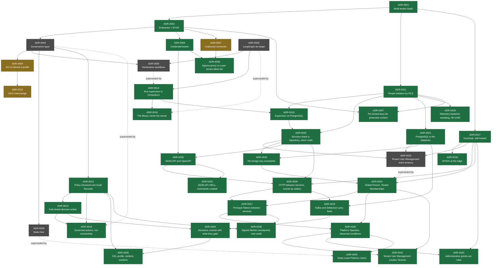

# Architecture Decision Records

An ADR records one architecturally significant decision, the context that forced it, the options
weighed, and the consequences accepted. Format: [MADR](https://adr.github.io/madr/).

**ADRs are immutable once Accepted.** A decision is changed by writing a new ADR that supersedes the
old one, never by editing it. The value of the practice is the reasoning trail, and editing destroys
it.

Write an ADR when a decision is **costly to reverse** and **affects more than one team or component**.
Do not write one for reversible implementation choices.

Template: [`adr-template.md`](adr-template.md) · Lifecycle: [`../VERSIONING.md`](../VERSIONING.md) §3

---

## Index

| ADR | Title | Status | Date |
| --- | --- | --- | --- |
| [0001](adr-0001-product-shape-multi-tenant-saas.md) | Product shape: multi-tenant SaaS | Accepted | 2026-09-08 |
| [0002](adr-0002-enterprise-segment-and-byok.md) | Enterprise segment with BYOK model credentials | Accepted | 2026-09-08 |
| [0003](adr-0003-governance-layer-positioning.md) | Position Orchestra as a governance layer, not an agent framework | Superseded by 0015 | 2026-09-08 |
| [0004](adr-0004-adopt-ag-ui-event-protocol.md) | Adopt AG-UI as the internal event format behind an Orchestra profile | Proposed | 2026-09-09 |
| [0005](adr-0005-langgraph-as-compilation-target.md) | LangGraph as a compilation target, not a public boundary | Superseded by 0016 | 2026-09-08 |
| [0006](adr-0006-model-layer-as-credential-broker.md) | Model layer is a credential and endpoint broker | Accepted | 2026-09-08 |
| [0007](adr-0007-outbound-connector-for-enterprise-reachability.md) | Outbound connector for enterprise tool reachability | Proposed | 2026-09-08 |
| [0008](adr-0008-declarative-workflow-definitions.md) | Customer-defined workflows as declarative definitions | Superseded by 0014 | 2026-09-08 |
| [0009](adr-0009-meter-first-defer-tiering.md) | Meter from day one, defer tiering | Superseded by 0039 | 2026-09-08 |
| [0010](adr-0010-a2ui-genui-interchange.md) | A2UI as the GenUI interchange format | Proposed | 2026-09-09 |
| [0011](adr-0011-tenant-isolation-shared-schema-rls.md) | Tenant isolation by shared schema with row-level security | Accepted | 2026-09-09 |
| [0012](adr-0012-policy-decisions-are-audit-records.md) | Policy Decisions are a class of Audit Record over versioned Policies | Accepted | 2026-09-09 |
| [0013](adr-0013-fail-closed-policy-decision-writes.md) | Policy Decision writes are fail-closed; other audit writes may degrade | Accepted | 2026-09-09 |
| [0014](adr-0014-run-supervisor-is-orchestras.md) | The run supervisor is Orchestra's; the runtime is an execution substrate | Accepted | 2026-09-11 |
| [0015](adr-0015-governed-action-positioning.md) | Differentiate on governed, accountable actions — not on connectivity | Accepted | 2026-09-11 |
| [0016](adr-0016-compile-to-the-langgraph-library.md) | The compilation target is the LangGraph library, never its server | Accepted | 2026-09-11 |
| [0017](adr-0017-keycloak-for-identity.md) | Keycloak is the identity provider, self-hosted | Accepted | 2026-09-12 |
| [0018](adr-0018-apisix-at-the-edge.md) | Apache APISIX is the edge, in front of the Gateway | Accepted | 2026-09-12 |
| [0019](adr-0019-postgres-run-supervisor.md) | The run supervisor is built on PostgreSQL; Temporal is the named fallback | Accepted | 2026-09-12 |
| [0020](adr-0020-monorepo-with-enforced-service-boundaries.md) | One repository, independent services — boundaries enforced as if the services were separate repositories | Accepted | 2026-09-12 |
| [0021](adr-0021-postgresql-is-the-datastore.md) | PostgreSQL is the datastore | Accepted | 2026-09-13 |
| [0022](adr-0022-tenant-user-management-owns-tenancy.md) | A Tenant User Management service owns Tenants, Persons and Principals | Superseded by 0024 | 2026-09-13 |
| [0023](adr-0023-no-foreign-key-constraints.md) | References are identifiers; no table carries a foreign key constraint | Accepted | 2026-09-13 |
| [0024](adr-0024-global-person-with-tenant-memberships.md) | One global Person per human, with a Membership per Tenant | Accepted | 2026-09-13 |
| [0025](adr-0025-json-api-http-contract.md) | HTTP APIs speak JSON:API 1.1, and each is described in OpenAPI | Accepted | 2026-09-13 |
| [0026](adr-0026-services-call-over-http-and-publish-through-an-outbox.md) | Services call each other over HTTP under the JSON:API contract, and publish facts through an outbox | Accepted | 2026-09-13 |
| [0027](adr-0027-tenant-user-management-signs-principal-tokens.md) | Tenant User Management signs the Principal Token that carries a Principal and Tenant between services | Accepted | 2026-09-13 |
| [0028](adr-0028-telemetry-in-a-self-hosted-grafana-stack.md) | Telemetry goes to a self-hosted Grafana stack, keeps every trace until volume demands sampling, and gives work with no Tenant the Nil UUID | Accepted | 2026-09-13 |
| [0029](adr-0029-kafka-carries-facts-captured-by-debezium.md) | Kafka carries facts between services, captured from each outbox by Debezium | Accepted | 2026-09-13 |
| [0030](adr-0030-platform-operator-and-observed-conditions.md) | Operator access to a Tenant's records is a time-boxed act by a Platform Operator, and a transition caused by an observed condition records its cause and no Principal | Accepted | 2026-09-13 |
| [0031](adr-0031-tenant-user-management-creates-tenants.md) | A Tenant is created by an internal Tenant User Management operation that only Orchestra's provisioning client may call, for a Platform Operator | Accepted | 2026-09-13 |
| [0032](adr-0032-administrative-grants-are-orchestra-defined-roles.md) | An administrative grant is a role from a closed set Orchestra defines, and an identity-provider group holds one only through a mapping the Tenant administers | Accepted | 2026-09-13 |
| [0033](adr-0033-gateway-urls-follow-json-api-and-commands-are-created.md) | The Gateway contract follows JSON:API's recommended URL layout, and a command is a resource that is created | Accepted | 2026-09-13 |
| [0034](adr-0034-policy-decisions-commit-with-the-gated-change-and-leave-by-outbox.md) | A Policy Decision is written in the enforcing service's own transaction, and reaches the audit store through that service's outbox | Accepted | 2026-09-13 |
| [0035](adr-0035-cel-profile-for-policies-and-workflow-expressions.md) | Policies and Workflow expressions are written in CEL behind an Orchestra profile, and matching Policies combine by verdict, never by order | Accepted | 2026-09-13 |
| [0036](adr-0036-signed-merkle-checkpoints-over-audit.md) | Audit immutability is also cryptographic, through periodic signed Merkle checkpoints per Tenant | Accepted | 2026-09-13 |
| [0037](adr-0037-per-tenant-keys-for-protected-content.md) | Per-tenant data keys extend beyond credentials to protected content | Accepted | 2026-09-13 |
| [0038](adr-0038-egress-proxy-on-a-per-tenant-allow-list.md) | Tenant-configured egress leaves through one proxy, on a per-tenant allow-list derived from configuration | Accepted | 2026-09-13 |
| [0039](adr-0039-seats-count-platform-users.md) | A seat is a Platform User, and Service Accounts are measured without being billed | Accepted | 2026-09-13 |

## Decision dependency graph

**Accepted** decisions are binding on implementation. **Proposed** decisions require a named
validation step — a spike, a benchmark, or a design-partner conversation — before they bind. Each
proposed ADR states that step explicitly.
