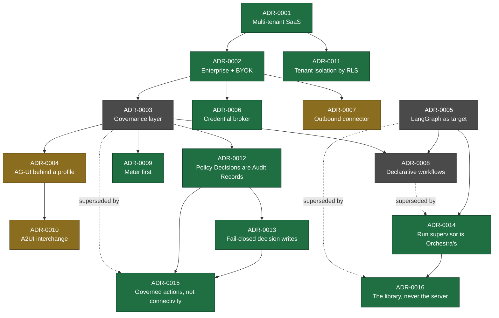

# Architecture Decision Records

An ADR records one architecturally significant decision, the context that forced it, the options
weighed, and the consequences accepted. Format: [MADR](https://adr.github.io/madr/).

**ADRs are immutable once Accepted.** A decision is changed by writing a new ADR that supersedes the
old one, never by editing it. The value of the practice is the reasoning trail, and editing destroys
it.

Write an ADR when a decision is **costly to reverse** and **affects more than one team or component**.
Do not write one for reversible implementation choices.

Template: [`adr-template.md`](adr-template.md) · Lifecycle: [`../VERSIONING.md`](../VERSIONING.md) §3

---

## Index

| ADR | Title | Status | Date |
| --- | --- | --- | --- |
| [0001](adr-0001-product-shape-multi-tenant-saas.md) | Product shape: multi-tenant SaaS | Accepted | 2026-09-08 |
| [0002](adr-0002-enterprise-segment-and-byok.md) | Enterprise segment with BYOK model credentials | Accepted | 2026-09-08 |
| [0003](adr-0003-governance-layer-positioning.md) | Position Orchestra as a governance layer, not an agent framework | Superseded by 0015 | 2026-09-08 |
| [0004](adr-0004-adopt-ag-ui-event-protocol.md) | Adopt AG-UI as the internal event format behind an Orchestra profile | Proposed | 2026-09-09 |
| [0005](adr-0005-langgraph-as-compilation-target.md) | LangGraph as a compilation target, not a public boundary | Superseded by 0016 | 2026-09-08 |
| [0006](adr-0006-model-layer-as-credential-broker.md) | Model layer is a credential and endpoint broker | Accepted | 2026-09-08 |
| [0007](adr-0007-outbound-connector-for-enterprise-reachability.md) | Outbound connector for enterprise tool reachability | Proposed | 2026-09-08 |
| [0008](adr-0008-declarative-workflow-definitions.md) | Customer-defined workflows as declarative definitions | Superseded by 0014 | 2026-09-08 |
| [0009](adr-0009-meter-first-defer-tiering.md) | Meter from day one, defer tiering | Accepted | 2026-09-08 |
| [0010](adr-0010-a2ui-genui-interchange.md) | A2UI as the GenUI interchange format | Proposed | 2026-09-09 |
| [0011](adr-0011-tenant-isolation-shared-schema-rls.md) | Tenant isolation by shared schema with row-level security | Accepted | 2026-09-09 |
| [0012](adr-0012-policy-decisions-are-audit-records.md) | Policy Decisions are a class of Audit Record over versioned Policies | Accepted | 2026-09-09 |
| [0013](adr-0013-fail-closed-policy-decision-writes.md) | Policy Decision writes are fail-closed; other audit writes may degrade | Accepted | 2026-09-09 |
| [0014](adr-0014-run-supervisor-is-orchestras.md) | The run supervisor is Orchestra's; the runtime is an execution substrate | Accepted | 2026-09-11 |
| [0015](adr-0015-governed-action-positioning.md) | Differentiate on governed, accountable actions — not on connectivity | Accepted | 2026-09-11 |
| [0016](adr-0016-compile-to-the-langgraph-library.md) | The compilation target is the LangGraph library, never its server | Accepted | 2026-09-11 |

## Decision dependency graph

**Accepted** decisions are binding on implementation. **Proposed** decisions require a named
validation step — a spike, a benchmark, or a design-partner conversation — before they bind. Each
proposed ADR states that step explicitly.
