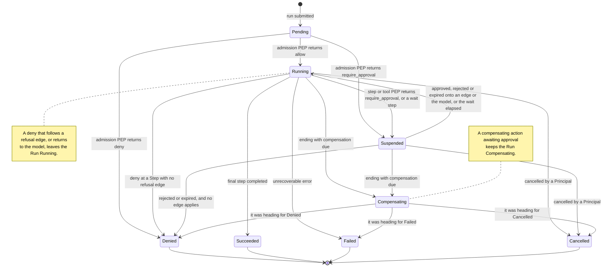

# ADR-0040: A governance refusal ends a Run in Denied unless a declared edge or the model carries it on, and a compensation outcome records whether its work was undone

## Status

Accepted.

## Context

The Run state machine in
[`lifecycle-state-machines.md`](../20-domain/lifecycle-state-machines.md) section 2 gives one
terminal state to facts that differ, and has no transition for others. Four questions follow from
that. The open-questions registers of the documents listed under *What this amends* mark each one as
needing an ADR, and the product owner has decided the four together.

- **A rejected or expired gate ends the Run in `Failed`, and the diagram marks that undecided.**
  `Failed` means *ended on an error, or on an unfavourable gate resolution*, and `Denied` is
  reachable only from `Pending`. [ADR-0009](adr-0009-meter-first-defer-tiering.md) meters Runs by
  outcome, so a governance refusal and a crash meter identically, which rule J1 of
  [`approval-workflows.md`](../40-governance/approval-workflows.md) forbids.
- **A `deny` after admission has no transition.**
  [`policy-model.md`](../40-governance/policy-model.md) rule V1 guarantees that the denied action is
  never attempted, and nothing says what the Run does next. In an Agent Run, which has no Steps, the
  Tool enforcement point is the only control between admission and a side effect (rule E4).
- **Nothing says what a Run is when compensation fails.**
  [`execution-semantics.md`](../50-workflows/execution-semantics.md) section 6.2 names three
  candidates, and its rule X23 requires an unresolved compensation to stay a distinct recorded fact.
- **A cancelled Run that compensates cannot end `Cancelled`.** Rule X28 makes cancellation trigger
  compensation, and `Compensating` leaves only to `Failed`, so the cancellation meters as a failure.
  Section 7 of that document names the defect: the Run's terminal state conflates *why the Run
  ended* with *whether its work was undone*.

Answering them exposes a fifth. Rule X16 expects a compensating action to be gated by
`require_approval` like any other business action, and `Compensating` has no transition to
`Suspended`.

Four constraints bound any answer.

- **A Run state is not free.** [`run.v1`](../30-protocol/schemas/run.v1.schema.json) records that
  consumers branch across its seven states exhaustively, so admitting one is MAJOR rather than the
  MINOR an added enum value would otherwise be.
  [`event-protocol.md`](../30-protocol/event-protocol.md) rule C2 applies the same test to the event
  profile.
- **Terminal is permanent.** A Run is never retried or reopened (X1, and
  [`audit-model.md`](../40-governance/audit-model.md) section 6).
- **A refusal never carries rule text** ([`gateway-api.md`](../30-protocol/gateway-api.md) G23).
- **Nothing reads `run.v1` yet.** No platform code produces or consumes a Run, so changing a
  documented meaning costs nothing now, and something from the first consumer on.

The run supervisor maps its own states onto this lifecycle
([ADR-0014](adr-0014-run-supervisor-is-orchestras.md)), so it needs these answers before it is
built.

## Decision drivers

- A governance refusal is distinguishable from a fault in the audit trail, in the metered outcome
  and to the caller (J1, `gateway-api.md` G22).
- A Run that left an effect in place is never reported as though it left none (X23).
- No new Run state, because consumers branch across the set.
- The refused action is never attempted, and nothing that runs afterwards inherits its authorization
  (V1, J2).
- A refusal takes the same path wherever it arises, whether a rule or a human made it.
- Terminal stays permanent.
- One call that Policy denies or a human rejects does not end a whole Agent Run, and the model never
  learns why.
- A choice that stays cheap to reverse before the first customer (working rule 8).

## Considered options

### A rejected or expired gate

- **A — As drawn.** `Suspended → Failed`, and J1 stays unsatisfiable.
- **B — Widen `Denied`** from *refused at admission* to *ended by a governance refusal*, recording
  the enforcement point and the cause. No new state, but a documented meaning changes.
- **C — A new terminal state** for a refusal after admission. Explicit, and MAJOR under C2.
- **D — Declared edges on the `approval` Step.** An `approval` Step may declare a rejection edge and
  an expiry edge. Without one, and for every other gate, B applies.
- **E — D on the `approval` Step, and a `deny`'s path everywhere else.** A gate raised anywhere else
  is treated like a `deny` at the same point: a Workflow Step's refusal edge, the model, or B.

### A `deny` after admission

- **A — Always a terminal refusal.** One exploratory Tool call ends a whole Agent Run.
- **B — A declared refusal edge on the Step, otherwise a terminal refusal.** An Agent Run still ends
  on any `deny`.
- **C — Fail the Step Execution.** A refusal recorded as a fault, against J1.
- **D — B for Workflow Steps.** In an Agent Run, or inside an `agent` Step, the refusal returns to
  the model as the invocation's outcome, and the Run continues.

### Compensation that fails

- **A — `Failed` plus an attribute.** A consumer that ignores the attribute cannot tell a clean
  failure from one that left a payment made.
- **B — A distinct terminal state.** MAJOR under C2.
- **C — Suspend the Run for human resolution.** An unbounded lifetime, and a fault turned into a
  gate.
- **D — Two axes.** The terminal state says why the Run ended, and a compensation outcome says
  whether its work was undone.

### A cancelled Run that compensates

- **A — As drawn.** It ends `Failed`, and a cancellation meters as a failure.
- **B — `Compensating` ends in the state the Run was heading for**, and the compensation outcome
  records what compensation achieved.
- **C — Refuse to cancel a Run that has taken a side effect.** Contradicts X28, and leaves no way to
  stop the Run.

## Decision

The product owner chose option E for a rejected or expired gate, with option B beneath it; option D
for a `deny` after admission; option D for compensation that fails; and option B for a cancelled
Run that compensates. A compensating action that needs approval waits in `Compensating`.

### The terminal state says why the Run ended

| Terminal state | Why the Run ended |
| --- | --- |
| `Succeeded` | It completed as defined |
| `Failed` | A fault ended it |
| `Cancelled` | A Principal stopped it |
| `Denied` | A governance refusal ended it, at admission or later |

`Failed` no longer carries an unfavourable gate resolution, and `Denied` no longer promises that no
Step Execution occurred. No state is added or removed, so the `run.v1` state enum and
`event-protocol.md` rule C2 are untouched.

A Run that ends `Denied` records where it was refused — Run admission, a Step boundary or a Tool
enforcement point, with the Step where one applies — and what refused it: the Policy Decision whose
verdict was `deny`, or the Approval Request whose resolution was `Rejected` or `Expired`, with the
Policy Decision that raised it. The Approval Request, not the Run state, carries which of those two
it was, so rule D1 of `approval-workflows.md` holds unchanged.

### Where a governance refusal leads

| Where the refusal arises | A `deny` | A gate resolved `Rejected` or `Expired` |
| --- | --- | --- |
| Run admission | Ends the Run `Denied`, and no Step Execution occurs | Ends the Run `Denied`, and no Step Execution occurs |
| An `approval` Step | At its boundary, follows the Step's refusal edge, and otherwise ends the Run `Denied` | Resumes onto the Step's rejection or expiry edge, and otherwise ends the Run `Denied` |
| Any other Workflow Step: its boundary, or the Tool enforcement point before the invocation a `tool` Step names | Follows the Step's refusal edge, and otherwise ends the Run `Denied` | Resumes onto the Step's refusal edge, and otherwise ends the Run `Denied` |
| A call the model chose, in an Agent Run or inside an `agent` Step | Returns to the model as that invocation's outcome, and the Run continues | Returns to the model as that invocation's outcome, and the Run continues |
| A compensating action | Follows no edge, and leaves its effect `unresolved` | Keeps the Run `Compensating` while the request is pending, then leaves the effect `unresolved` |

- **Edges are declared, and only these.** Control flow lives in edges
  ([`workflow-dsl.md`](../50-workflows/workflow-dsl.md) L8). Any Step may declare a refusal edge,
  which serves a `deny` and a rejected or expired gate alike. An `approval` Step may also declare a
  rejection edge and an expiry edge, and its own gate follows only those two; no other type declares
  either. An edge suppresses no enforcement point (`policy-model.md` E2): the refusal is recorded,
  and every Step the edge leads to is evaluated at its own boundary.
- **A declared edge is ordinary governed execution.** The branch it leads to inherits none of the
  refused action's authorization (J2). Proposing the refused action again is a new evaluation
  (`policy-model.md` E6), and after a rejection or an expiry it raises a new Approval Request (J3).
- **Without an edge, the Run ends.** An author who declares nothing gets `Denied`, never a path
  nobody wrote.
- **The delegation belongs to a Workflow Step.** A `deny` at an `agent` Step's own boundary, or a
  gate raised there that is rejected or expires, follows that Step's refusal edge or ends the Run.
  Only a call the model chooses inside the Step returns to the model.
- **A nested version is part of the Run.** A version that an `agent` or `subworkflow` Step names
  executes inside the parent Run
  ([ADR-0041](adr-0041-nested-versions-execute-inside-the-parent-run.md)), so a refusal, a failure
  or a rejected gate inside it does what it would do anywhere else in the Run.
- **The model learns only that a call was denied, rejected or expired, never why.** The outcome
  carries no rule text, no matched Policy version's content (G23) and nothing a deciding Principal
  recorded. Every further call crosses the Tool enforcement point again (E4), and neither V1 nor G1
  of `approval-workflows.md` weakens, because the refused action is never attempted. The model may
  probe for a permitted route, or propose a rejected action again and raise a new request. That is
  the standing residual of [`threat-model.md`](../40-governance/threat-model.md) T1, governed call
  by call.
- **Expiry edges are live.** A request expires when its decision deadline, an optional duration set
  in the Policy that raises it, passes undecided, and an expired request is never re-raised
  (ADR-0043).

### The compensation outcome says whether the work was undone

Every Run in a terminal state carries exactly one compensation outcome beside its terminal state,
and neither is derived from the other.

| Compensation outcome | Meaning |
| --- | --- |
| `not_required` | Nothing the Run did called for compensation |
| `compensated` | Every compensating action the Run called for completed |
| `unresolved` | At least one did not: it failed, was refused, was stranded, or its outcome is unknown. The outcome names each Step Execution whose effect remains |

- **A compensating action follows no edge.** It is an ordinary business action and not a Step
  (`execution-semantics.md` X16 and X21), so a `deny` of one, or a rejected or expired gate on one,
  changes neither the path nor the terminal state. It leaves the effect `unresolved`.
- **Resolving an effect later reopens nothing.** It is a new governed act with its own Audit Record
  and its own Principal (`audit-model.md` section 6), and the Run's terminal state and compensation
  outcome stay as recorded.
- **The terminal state stays the metered outcome.** The outcome ADR-0009 meters Runs by is why the
  Run ended, whatever compensation achieved.

### `Compensating` ends where the Run was heading

`Compensating` is the observable roll-up state that `execution-semantics.md` X22 settled. A Run that
would end `Failed`, `Cancelled` or `Denied` while compensation is due enters it instead, and leaves
it only for the state it was heading for. Rules X27 and X28 hold unchanged: cancellation triggers
compensation, and never abandons one in progress. A cancelled Run that compensates ends `Cancelled`,
and its compensation outcome records what compensation achieved.

**A compensating action that needs approval waits in `Compensating`.** A `require_approval` verdict
on a compensating action raises an Approval Request, and the Run stays `Compensating` while the
request is pending, with no transition to `Suspended`. Approved, the action is attempted. Rejected
or expired, its effect is recorded `unresolved`. The request's decision deadline, where its Policy
sets one (ADR-0043), bounds the wait.

### What this does not decide

- **How the edges are spelled.** Their labels are notation until the label vocabulary that
  `workflow-dsl.md` section 8 registers is decided.
- **What a Run-ending refusal in one `parallel` branch does to its siblings.** It is the question a
  branch failure already raises, and the three constraints of X19 bind any answer.
- **What an `unresolved` outcome names for a Tool invocation the model chose.** Such an invocation
  has no Step Execution, and what it is called stays open in
  [`domain-model.md`](../20-domain/domain-model.md) section 11. Where its compensating action is
  declared is not open: on the Tool's registration (ADR-0046).
- **Whether the Runs dimension also breaks down by compensation outcome**, which is the metering
  design's, and whether a terminal Run event carries it, which is `event-protocol.md`'s. Either
  would be additive.
- **How a Run's representation shows a request pending on a compensating action**, or refers to a
  later act that resolves one of its effects.

### What this amends

- `lifecycle-state-machines.md`: the diagram and table of section 2, sections 2.1, 2.2 and 2.5, and
  a new section 2.6. The rejected-gate and compensation items in sections 2.4 and 6 are discharged,
  and `Compensating` loses the provisional mark that X22 had already made stale.
- `approval-workflows.md`: rules G1 and G2, the diagram of section 2, and section 8 with a new rule
  J5. J1 now holds, and both of its section 11 rows are discharged.
- `policy-model.md`: rule V1 states what a `deny` outside admission does, V2 and the summaries in
  sections 2 and 3 admit a compensating action's gate, and the section 9 row is discharged.
- `audit-model.md`: section 3 records the refusal and the compensation outcome of a terminal
  transition, and whether a compensating action waiting on a request was attempted. Section 6
  forbids reopening a Run to resolve an effect.
- `execution-semantics.md`: sections 6.2, 7, 8, 9 and 10, with new rules X33, X34 and X35. Three
  section 11 rows are discharged, and one is added.
- `step-types.md` sections 4 to 7, and `workflow-dsl.md` sections 2 and 5 with a new rule L12, admit
  the edges. Their register rows are discharged.
- `tool-authorization.md` section 5 and its diagram, `gateway-api.md` G22 and section 7,
  `reliability.md` sections 3, 4, 7 and 9, and both worked examples follow. Rows in
  `tool-authorization.md` section 10, `gateway-api.md` section 9, `data-plane.md` section 11,
  `quotas-and-metering.md` section 14 and `reliability.md` section 13 are discharged or narrowed.
- `event-protocol.md` section 3.2 stops calling `Compensating` provisional, and its section 11 and
  `domain-model.md` section 11 register what stays open.
- `run.v1` gains optional `refusal` and `compensation` members, a wider `state` description, a
  narrower promise in `started_at`, and a `state` comment that no longer calls `Compensating`
  provisional. `approval-request.v1` and `workflow-definition.v1` each gain a wider description.
  All three stay v1: no member is removed, nothing enters an existing required list, and every
  document valid before stays valid (`VERSIONING.md` section 6). The wider meaning of `Denied` is
  still a repurposing under R2, MAJOR once `run.v1` has a consumer. It has none.
- `scope-and-non-goals.md` section 4 narrows its undecided compensation row to what stays open.
- The glossary gains *Compensation outcome*.

## Rationale

**The gate.** Option A keeps J1 unsatisfiable. Option C makes the separation explicit, at the cost
C2 puts on every consumer of the state set. Option B pays with a documented meaning instead, while
nothing reads it, and section 8 of `approval-workflows.md` had already observed that `Denied`
describes a human-rejected admission gate exactly. Option D keeps B as the floor and lets an author
say what a process does after a no, but only at an `approval` Step. A gate that Policy raised at a
`tool` Step, or on a call the model chose, could only end the Run, while a `deny` at the same point
could follow an edge or return to the model. Option E removes that asymmetry: a refusal takes the
same path whether a rule or a human made it, so one refusal edge serves both, and an Agent Run
survives a human's no as it survives a rule's. J2 already makes every such path ordinary governed
execution. Keeping rejection and expiry edges on the `approval` Step alone is the reversible
direction: admitting them on another type later is additive under R2, and withdrawing them would be
MAJOR.

**A `deny` after admission.** Option C records a refusal as a fault, which J1 forbids wherever it
happens. Options A and B end an Agent Run on its first refused call, although an Agent chooses its
sequence at runtime and a refused exploratory call is ordinary there. Option D gives a Workflow the
shape the gate has, an edge or `Denied`. It gives an Agent Run what that Run has instead of Steps:
the next evaluation at the Tool enforcement point. V1 requires only that the denied action is never
attempted, and D keeps that on both paths.

**Compensation that fails.** Option A puts the unresolved effect in an attribute of one state, where
a consumer can miss it. Option B is MAJOR under C2. Option C turns a fault into a gate, and gives
the Run a lifetime nobody chose. Option D separates the two facts that section 7 of
`execution-semantics.md` found conflated, and adds no state. No representation survives a consumer
that ignores a member, but this outcome is present on every terminal Run with a closed set of
values, so ignoring it is a choice rather than a missed case. A compensating action that needs
approval waits in `Compensating` rather than `Suspended`, so a Run undoing its work never reads as
one waiting to make progress (X22), and `Compensating` keeps its only exits.

**A cancelled Run that compensates.** Option A meters a cancellation as a failure, and option C
contradicts X28. Option B applies the two axes to cancellation, and keeps the cause visible to the
Runs-by-outcome metering of ADR-0009.

## Consequences

### Positive

- J1 holds: a refusal ends a Run `Denied`, and a fault ends it `Failed`.
- A Run that left a payment made is distinguishable from one that failed cleanly, on every terminal
  Run.
- A cancellation that compensates meters as a cancellation.
- One refused call no longer ends an Agent Run, whether a rule denied it or a human rejected it, and
  the model never learns why.
- One refusal edge serves a rule's `deny` and a human's rejection, and every Step it leads to is
  governed.
- The run supervisor has a complete terminal mapping, and the event profile's state set does not
  change.

### Negative

- **`Denied` no longer means that nothing ran.** A consumer reads the recorded refusal to tell an
  admission refusal from a later one, and `started_at` is no longer absent on every `Denied` Run.
  That repurposes a documented value, and is free only because nothing consumes `run.v1` yet.
- **A second axis to carry.** Every consumer of a terminal Run, the audit surface and the metering
  design carry the compensation outcome. `run.v1` cannot require it within v1, so the conformance
  suite has to check what the schema cannot.
- **An Agent adapts after a refusal.** The model learns that a call was denied, rejected or expired,
  and may try another route, with only the next evaluation in its way. A human's rejection of a call
  the model chose no longer ends the Run.
- **A refused Agent can loop.** No step limit or maximum duration is decided anywhere, so repeated
  refusals can spend a customer's Quota Envelope. Each time the model proposes a rejected action
  again it raises a new Approval Request, which is the approval fatigue of threat-model T8 by
  another route. Every refusal and request is recorded, so the loop is visible, but nothing bounds
  it.
- **A Run can wait in `Compensating` without end.** A compensating action awaiting approval holds
  the Run there while its request is pending, and a request whose Policy sets no deadline never
  expires.
- **An Agent Run's unresolved effects cannot yet be named**, because the invocation they belong to
  has no name (`domain-model.md` section 11).

### Neutral / follow-on work

- Amend the documents listed above, and add *Compensation outcome* to the glossary.
- Add the `refusal` and `compensation` members to `run.v1`, and check the compensation outcome on
  every terminal Run in the conformance suite.
- Spell the edge labels with the label vocabulary in `workflow-dsl.md` section 8.
- Register how a Run's representation shows a request pending on a compensating action, and refers
  to a later act that resolves one of its effects.

## Risks and mitigations

| Risk | Likelihood | Impact | Mitigation |
| --- | --- | --- | --- |
| A consumer reads `Denied` as refused at admission, and misses a later refusal's side effects | Medium | High | The Run records where it was refused and its compensation outcome, and the meaning changes before `run.v1` has a consumer |
| A consumer ignores the compensation outcome and reads a terminal Run as clean | Medium | High | Present on every terminal Run with a closed set of values, and checked by the conformance suite; an unrecognised value is read as unknown, never as `compensated` (`gateway-api.md` G2) |
| A model probes for a permitted route after a refusal, or proposes a rejected action again | High | Medium | Every call crosses the Tool enforcement point (E4), the capability grant set bounds what is reachable, the outcome carries no reason (G23), and a rejected action proposed again raises a new Approval Request (J3); the residual is T1's |
| Rejected actions proposed again flood the approvers | Medium | Medium | Each is a new, audited Approval Request that the Approvals dimension of ADR-0009 counts, so the pattern is visible; bounding it is the approval-fatigue question of threat-model T8 |
| An Agent loops on refusals and spends the customer's Quota Envelope | Medium | Medium | Every refusal is a recorded Policy Decision; the bound belongs with the step limit and maximum duration nobody has decided |
| An author reads an expiry edge as a limit on how long a Run waits | Low | Medium | The deadline belongs to the Policy that raises the request (ADR-0043), not to the definition, and `workflow-dsl.md` L12 states that an expiry edge only says where the Run goes when that deadline passes |
| A compensating action's approval is never decided, and the Run stays `Compensating` | Medium | Medium | The request's decision deadline, where its Policy sets one, bounds the wait, and expiry records the effect `unresolved`; without one, the Run waits visibly on a pending, audited request |
| An `unresolved` effect is recorded and never acted on | Medium | High | The outcome names each Step Execution whose effect remains, and resolving it is a governed act; how the Control Plane surfaces it is not decided |
| Authors declare no edges, so every refusal ends a whole Workflow Run | High | Low | The conservative default: the Run ends `Denied`, a refusal rather than a fault, and nothing continues on a path nobody wrote |

## Revisit criteria

Reopen this decision in any of these cases:

- An Agent is observed using denials, rejections or expiries to reach, by another route, an outcome
  that Policy or an approver meant to prevent, beyond what evaluating each call and raising a new
  request contain.
- The recorded cause proves too little to tell refusals apart in a dispute or an audit report, and a
  distinct terminal state becomes worth its MAJOR cost.
- Compensating actions awaiting approval hold Runs in `Compensating` long enough that suspension,
  with a transition of its own, becomes worth adding.
- A regulatory or contractual obligation keeps a Run open until its effects are resolved.
- The three compensation outcomes cannot express a case customers need, which would be a MAJOR
  change to the set.

## References

- [`../20-domain/lifecycle-state-machines.md`](../20-domain/lifecycle-state-machines.md) section 2:
  the Run state machine
- [`../40-governance/approval-workflows.md`](../40-governance/approval-workflows.md) sections 2 and
  8, and rules G1, G2, J1 to J4 and D1: the gate, and why a rejection is not a fault
- [`../40-governance/policy-model.md`](../40-governance/policy-model.md) V1, V2, E2, E4 and E6: what
  a `deny` and a gate guarantee, and the Tool enforcement point in an Agent Run
- [`../50-workflows/execution-semantics.md`](../50-workflows/execution-semantics.md) sections 6 to 8
  and 10: compensation, cancellation, the mid-Run `deny`, and the six outcomes
- [`../50-workflows/step-types.md`](../50-workflows/step-types.md) section 7, and
  [`../50-workflows/workflow-dsl.md`](../50-workflows/workflow-dsl.md) L8 and L11: the `approval`
  Step, and edges
- [ADR-0041](adr-0041-nested-versions-execute-inside-the-parent-run.md): a nested version executes
  inside the parent Run
- [`../30-protocol/event-protocol.md`](../30-protocol/event-protocol.md) C2, and
  [`../30-protocol/schemas/run.v1.schema.json`](../30-protocol/schemas/run.v1.schema.json): why a
  new Run state is MAJOR
- [`../30-protocol/gateway-api.md`](../30-protocol/gateway-api.md) G2, G22 and G23: refusals and
  unrecognised values on the wire
- [`../40-governance/audit-model.md`](../40-governance/audit-model.md) section 6, and
  [`../40-governance/threat-model.md`](../40-governance/threat-model.md) T1 and T8: no reopening,
  the residual an Agent Run keeps, and approval fatigue
- [ADR-0009](adr-0009-meter-first-defer-tiering.md): Runs metered by outcome
- [`../VERSIONING.md`](../VERSIONING.md) R2 and section 6: what a schema may change within a major
  version
